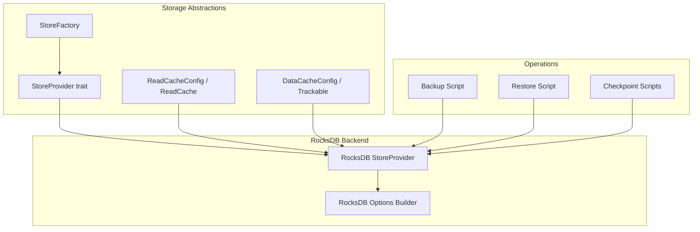
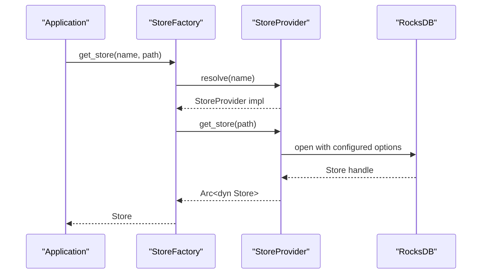
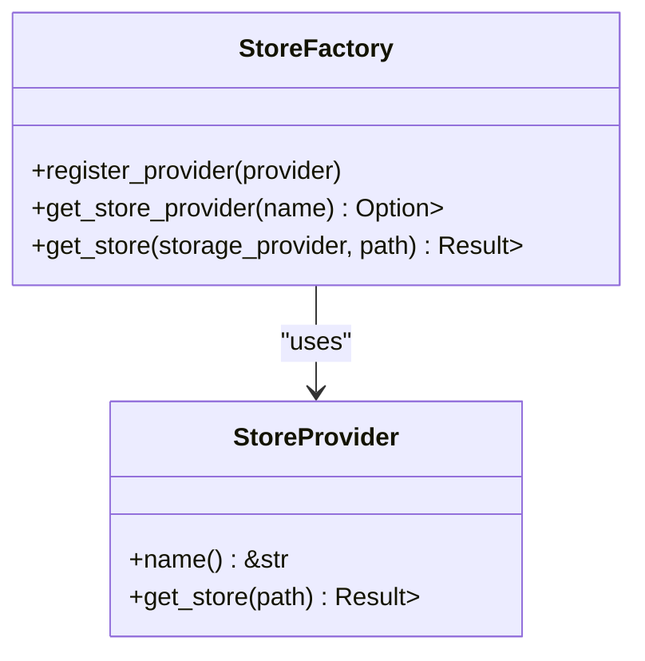
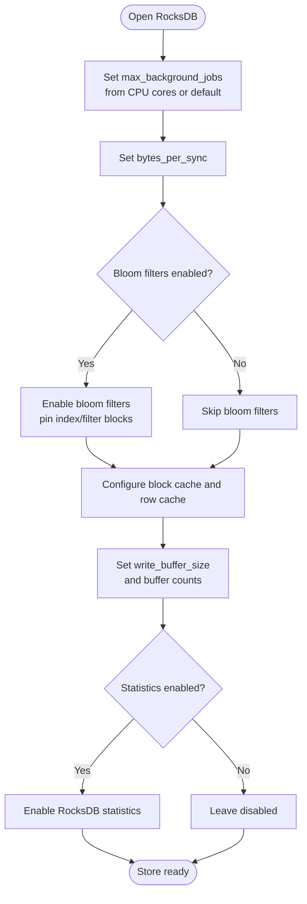
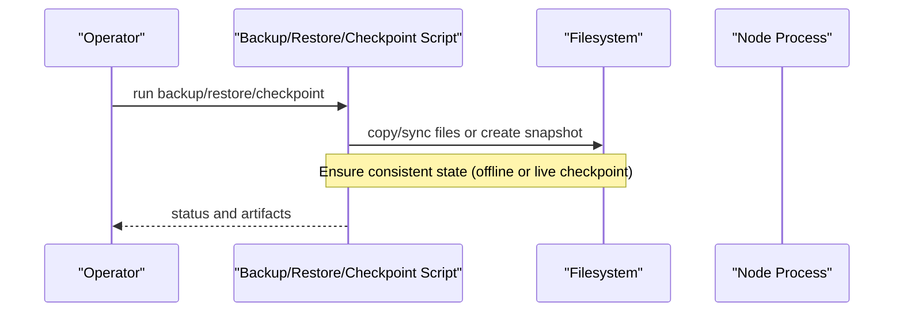
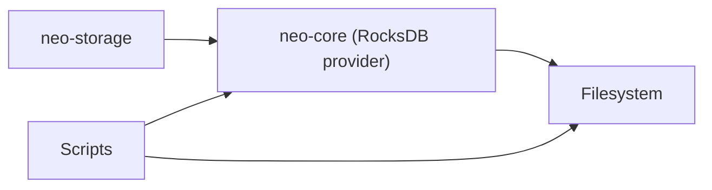

# Backend Implementation

<cite>
**Referenced Files in This Document**
- [neo-storage/src/lib.rs](file://neo-storage/src/lib.rs)
- [neo-storage/src/persistence/mod.rs](file://neo-storage/src/persistence/mod.rs)
- [neo-storage/src/persistence/store_factory.rs](file://neo-storage/src/persistence/store_factory.rs)
- [neo-storage/src/persistence/store_provider.rs](file://neo-storage/src/persistence/store_provider.rs)
- [neo-storage/src/persistence/read_cache.rs](file://neo-storage/src/persistence/read_cache.rs)
- [neo-storage/src/persistence/data_cache/trackable.rs](file://neo-storage/src/persistence/data_cache/trackable.rs)
- [neo-core/src/persistence/providers/rocksdb/provider.rs](file://neo-core/src/persistence/providers/rocksdb/provider.rs)
- [scripts/backup-rocksdb.sh](file://scripts/backup-rocksdb.sh)
- [scripts/checkpoint-live-rocksdb.sh](file://scripts/checkpoint-live-rocksdb.sh)
- [scripts/checkpoint-on-height.sh](file://scripts/checkpoint-on-height.sh)
- [scripts/restore-checkpoint.sh](file://scripts/restore-checkpoint.sh)
</cite>

## Table of Contents
1. [Introduction](#introduction)
2. [Project Structure](#project-structure)
3. [Core Components](#core-components)
4. [Architecture Overview](#architecture-overview)
5. [Detailed Component Analysis](#detailed-component-analysis)
6. [Dependency Analysis](#dependency-analysis)
7. [Performance Considerations](#performance-considerations)
8. [Troubleshooting Guide](#troubleshooting-guide)
9. [Conclusion](#conclusion)
10. [Appendices](#appendices)

## Introduction
This document explains the RocksDB backend implementation used by Neo-RS storage. It covers configuration options (block cache, write buffers, compression, and performance tuning), the provider architecture and store factory pattern for backend instantiation, connection management, error handling, resource cleanup, backup and restore operations, snapshot creation and restoration, and maintenance tasks such as compaction and checkpointing. It also provides troubleshooting guidance, performance optimization techniques, and monitoring approaches suitable for production deployments.

## Project Structure
Neo-RS separates storage abstractions from concrete backends:
- Storage traits and types are defined in neo-storage.
- The provider abstraction allows pluggable backends (e.g., memory, RocksDB).
- The RocksDB backend is implemented in neo-core under a providers module.
- Operational scripts support backup, restore, and checkpointing.

**Diagram sources**
- [neo-storage/src/persistence/store_provider.rs:6-13](file://neo-storage/src/persistence/store_provider.rs#L6-L13)
- [neo-storage/src/persistence/store_factory.rs:11-54](file://neo-storage/src/persistence/store_factory.rs#L11-L54)
- [neo-storage/src/persistence/read_cache.rs:242-325](file://neo-storage/src/persistence/read_cache.rs#L242-L325)
- [neo-storage/src/persistence/data_cache/trackable.rs:43-54](file://neo-storage/src/persistence/data_cache/trackable.rs#L43-L54)
- [neo-core/src/persistence/providers/rocksdb/provider.rs:272-312](file://neo-core/src/persistence/providers/rocksdb/provider.rs#L272-L312)
- [scripts/backup-rocksdb.sh](file://scripts/backup-rocksdb.sh)
- [scripts/restore-checkpoint.sh](file://scripts/restore-checkpoint.sh)
- [scripts/checkpoint-live-rocksdb.sh](file://scripts/checkpoint-live-rocksdb.sh)
- [scripts/checkpoint-on-height.sh](file://scripts/checkpoint-on-height.sh)

**Section sources**
- [neo-storage/src/lib.rs:1-71](file://neo-storage/src/lib.rs#L1-L71)
- [neo-storage/src/persistence/mod.rs:1-31](file://neo-storage/src/persistence/mod.rs#L1-L31)

## Core Components
- StoreProvider: Defines how to create Store instances by name and path.
- StoreFactory: Global registry that resolves a provider by name and constructs a Store.
- ReadCacheConfig: Controls in-memory read caching behavior (size, prefetch, TTL, bloom filter).
- DataCacheConfig: Controls write-side caching and tracking behavior.
- RocksDB Provider: Builds RocksDB options including block cache, row cache, write buffer sizing, background jobs, filters, and statistics.

Key responsibilities:
- Decouple application code from storage engine specifics via StoreProvider.
- Provide consistent store creation through StoreFactory with default fallbacks.
- Tune read paths with configurable caches and bloom filters.
- Configure RocksDB for throughput and latency based on workload characteristics.

**Section sources**
- [neo-storage/src/persistence/store_provider.rs:6-13](file://neo-storage/src/persistence/store_provider.rs#L6-L13)
- [neo-storage/src/persistence/store_factory.rs:11-54](file://neo-storage/src/persistence/store_factory.rs#L11-L54)
- [neo-storage/src/persistence/read_cache.rs:242-325](file://neo-storage/src/persistence/read_cache.rs#L242-L325)
- [neo-storage/src/persistence/data_cache/trackable.rs:43-54](file://neo-storage/src/persistence/data_cache/trackable.rs#L43-L54)
- [neo-core/src/persistence/providers/rocksdb/provider.rs:272-312](file://neo-core/src/persistence/providers/rocksdb/provider.rs#L272-L312)

## Architecture Overview
The backend uses a provider/factory pattern to instantiate stores. The application requests a store by provider name; the factory locates the provider and returns a Store instance. For RocksDB, the provider configures RocksDB options at open time, including caches, write buffers, filters, and background job limits.

**Diagram sources**
- [neo-storage/src/persistence/store_factory.rs:26-54](file://neo-storage/src/persistence/store_factory.rs#L26-L54)
- [neo-storage/src/persistence/store_provider.rs:6-13](file://neo-storage/src/persistence/store_provider.rs#L6-L13)
- [neo-core/src/persistence/providers/rocksdb/provider.rs:272-312](file://neo-core/src/persistence/providers/rocksdb/provider.rs#L272-L312)

## Detailed Component Analysis

### StoreFactory and StoreProvider
- StoreProvider defines a uniform interface to create Stores with a name and path.
- StoreFactory maintains a global registry of providers and supports a default provider when no name is specified.
- Registration enables dynamic extension without modifying core logic.

**Diagram sources**
- [neo-storage/src/persistence/store_provider.rs:6-13](file://neo-storage/src/persistence/store_provider.rs#L6-L13)
- [neo-storage/src/persistence/store_factory.rs:11-54](file://neo-storage/src/persistence/store_factory.rs#L11-L54)

**Section sources**
- [neo-storage/src/persistence/store_factory.rs:11-54](file://neo-storage/src/persistence/store_factory.rs#L11-L54)
- [neo-storage/src/persistence/store_provider.rs:6-13](file://neo-storage/src/persistence/store_provider.rs#L6-L13)

### RocksDB Configuration and Tuning
The RocksDB provider builds options that control performance and resource usage:
- Background jobs: set based on available parallelism or a safe default.
- Bytes per sync: smooths I/O to avoid bursts.
- Write buffer size: defaults to a tuned value if not provided; controls flush frequency.
- Max/min write buffer numbers: tune memory pressure and merge behavior.
- Block cache and row cache: sized relative to total cache budget; index/filter blocks pinned when bloom filters enabled.
- Bloom filters: optional, with bits-per-key and cache/index pinning.
- Statistics: optional enablement for observability.

**Diagram sources**
- [neo-core/src/persistence/providers/rocksdb/provider.rs:272-312](file://neo-core/src/persistence/providers/rocksdb/provider.rs#L272-L312)

**Section sources**
- [neo-core/src/persistence/providers/rocksdb/provider.rs:272-312](file://neo-core/src/persistence/providers/rocksdb/provider.rs#L272-L312)

### Read Cache and Data Cache
- ReadCacheConfig:
  - max_entries, max_bytes: cap LRU cache size.
  - enable_prefetch, prefetch_count, prefetch_threshold: control pre-fetch behavior.
  - ttl: optional entry expiration.
  - enable_stats: track hit rates and costs.
  - bloom filter: negative lookup optimization with capacity and false positive rate.
- DataCacheConfig:
  - max_entries: write cache capacity.
  - track_reads_in_write_cache: whether reads participate in write-side tracking.
  - enable_read_cache: integrate with ReadCache.
  - enable_prefetching, prefetch_count, prefetch_confidence_threshold: prefetch strategy.

These caches reduce RocksDB reads and improve tail latency during hot-path operations.

**Section sources**
- [neo-storage/src/persistence/read_cache.rs:242-325](file://neo-storage/src/persistence/read_cache.rs#L242-L325)
- [neo-storage/src/persistence/data_cache/trackable.rs:43-54](file://neo-storage/src/persistence/data_cache/trackable.rs#L43-L54)

### Backup, Restore, Checkpoints, and Maintenance
Operational scripts provide practical workflows:
- Backup: snapshot the RocksDB directory safely.
- Restore: replace data directory from a known-good snapshot.
- Live checkpoint: create a consistent point-in-time view without stopping the node.
- Height-based checkpoint: trigger checkpoints at specific heights for predictable cadence.

**Diagram sources**
- [scripts/backup-rocksdb.sh](file://scripts/backup-rocksdb.sh)
- [scripts/restore-checkpoint.sh](file://scripts/restore-checkpoint.sh)
- [scripts/checkpoint-live-rocksdb.sh](file://scripts/checkpoint-live-rocksdb.sh)
- [scripts/checkpoint-on-height.sh](file://scripts/checkpoint-on-height.sh)

**Section sources**
- [scripts/backup-rocksdb.sh](file://scripts/backup-rocksdb.sh)
- [scripts/restore-checkpoint.sh](file://scripts/restore-checkpoint.sh)
- [scripts/checkpoint-live-rocksdb.sh](file://scripts/checkpoint-live-rocksdb.sh)
- [scripts/checkpoint-on-height.sh](file://scripts/checkpoint-on-height.sh)

## Dependency Analysis
- neo-storage exposes traits and utilities used across the system.
- neo-core’s RocksDB provider depends on these abstractions to implement a concrete backend.
- Operational scripts depend on filesystem semantics and may interact with running nodes for live checkpoints.

**Diagram sources**
- [neo-storage/src/persistence/mod.rs:1-31](file://neo-storage/src/persistence/mod.rs#L1-L31)
- [neo-core/src/persistence/providers/rocksdb/provider.rs:272-312](file://neo-core/src/persistence/providers/rocksdb/provider.rs#L272-L312)
- [scripts/backup-rocksdb.sh](file://scripts/backup-rocksdb.sh)

**Section sources**
- [neo-storage/src/persistence/mod.rs:1-31](file://neo-storage/src/persistence/mod.rs#L1-L31)
- [neo-core/src/persistence/providers/rocksdb/provider.rs:272-312](file://neo-core/src/persistence/providers/rocksdb/provider.rs#L272-L312)

## Performance Considerations
- Block cache and row cache sizing:
  - Allocate a primary block cache and a smaller row cache derived from it.
  - Pin index and filter blocks when using bloom filters to reduce disk seeks.
- Write buffer tuning:
  - Increase write buffer size to reduce flush frequency during high-throughput sync.
  - Adjust max/min write buffer numbers to balance memory and compaction pressure.
- Background jobs:
  - Set based on CPU cores to maximize parallelism without starving other workloads.
- Bytes per sync:
  - Use moderate values to smooth I/O and reduce latency spikes.
- Bloom filters:
  - Enable for read-heavy workloads; tune bits-per-key and cache settings.
- Statistics:
  - Enable in production to monitor RocksDB internals (compaction, IO, cache hits).

[No sources needed since this section provides general guidance]

## Troubleshooting Guide
Common issues and mitigations:
- High write amplification or frequent compactions:
  - Increase write buffer sizes and adjust buffer counts.
  - Review compaction settings and ensure background jobs are appropriately sized.
- Slow reads or high seek latency:
  - Verify block cache and row cache sizes are adequate.
  - Enable and tune bloom filters; ensure index/filter blocks are pinned.
- Memory pressure:
  - Reduce cache sizes or disable prefetching temporarily.
  - Monitor RocksDB statistics to identify excessive memory use.
- I/O stalls or latency spikes:
  - Tune bytes_per_sync to smooth writes.
  - Ensure disks can sustain required throughput; consider faster storage or RAID.
- Snapshot/backup failures:
  - Use live checkpoint scripts to avoid downtime; otherwise stop the node before copying.
  - Validate restored data by comparing state roots or performing consistency checks.

Monitoring recommendations:
- Enable RocksDB statistics and export metrics to your monitoring stack.
- Track cache hit ratios, compaction throughput, and write stall durations.
- Alert on abnormal increases in compaction activity or write amplification.

[No sources needed since this section provides general guidance]

## Conclusion
Neo-RS storage abstracts the RocksDB backend behind a provider/factory pattern, enabling flexible configuration and easy integration. By tuning caches, write buffers, background jobs, and filters, operators can optimize for throughput, latency, and resource efficiency. Operational scripts simplify backup, restore, and checkpointing, while enabling robust maintenance procedures. Monitoring and proactive tuning are essential for stable production deployments.

[No sources needed since this section summarizes without analyzing specific files]

## Appendices

### Configuration Reference Summary
- Block cache and row cache: allocate proportional budgets; pin index/filter blocks when using bloom filters.
- Write buffers: set explicit size or rely on tuned default; adjust buffer counts for memory vs. flush trade-offs.
- Background jobs: scale with CPU cores; avoid over-subscription.
- Bytes per sync: moderate values to smooth I/O.
- Bloom filters: enable for read-heavy workloads; tune bits-per-key and cache pinning.
- Statistics: enable for observability in production.

[No sources needed since this section provides general guidance]