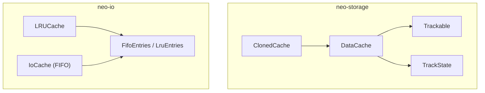
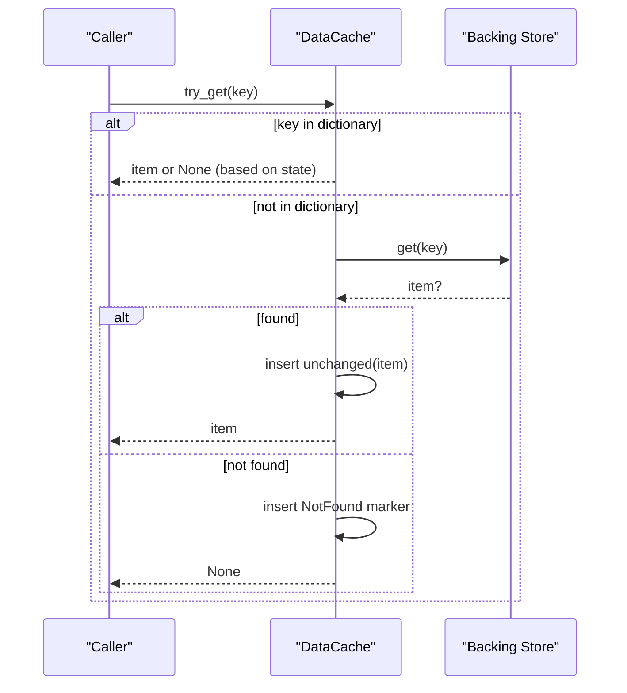
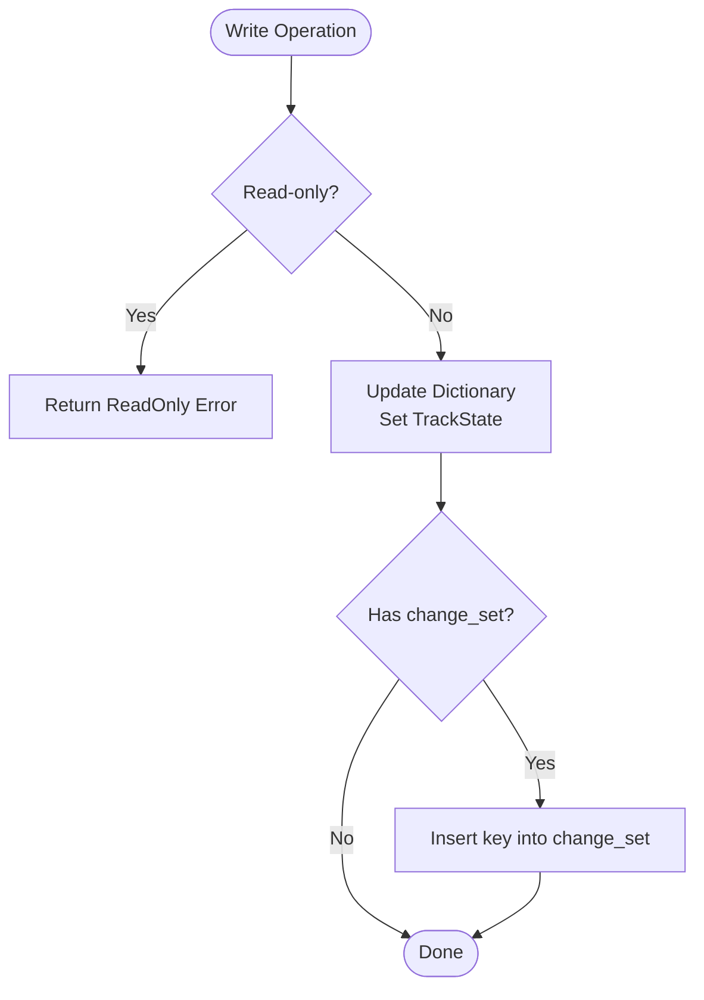
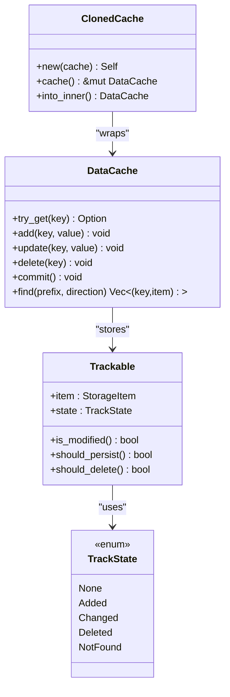

# Caching System

<cite>
**Referenced Files in This Document**
- [data_cache.rs](file://neo-storage/src/cache/data_cache.rs)
- [cloned_cache.rs](file://neo-storage/src/cache/cloned_cache.rs)
- [trackable.rs](file://neo-storage/src/cache/trackable.rs)
- [mod.rs](file://neo-storage/src/cache/mod.rs)
- [track.rs](file://neo-storage/src/types/track.rs)
- [cache.rs](file://neo-io/src/caching/cache.rs)
- [lru_cache.rs](file://neo-io/src/caching/lru_cache.rs)
- [cache_entries.rs](file://neo-io/src/caching/cache_entries.rs)
</cite>

## Table of Contents
1. Introduction
2. Project Structure
3. Core Components
4. Architecture Overview
5. Detailed Component Analysis
6. Dependency Analysis
7. Performance Considerations
8. Troubleshooting Guide
9. Conclusion

## Introduction
This document explains the Neo-RS caching system focused on DataCache, ClonedCache, and Trackable components. It covers the caching hierarchy (read cache, write buffer, data cache), change tracking via TrackState (None, Added, Changed, Deleted, NotFound), cache invalidation strategies, memory management, performance characteristics, usage patterns, monitoring hit rates, configuration tuning, and consistency guarantees with underlying storage.

## Project Structure
The caching subsystem is split across two crates:
- neo-storage/src/cache: core blockchain storage cache with change tracking and isolation
- neo-io/src/caching: general-purpose caches (FIFO/LRU) used by I/O paths

**Diagram sources**
- [data_cache.rs:58-69](file://neo-storage/src/cache/data_cache.rs#L58-L69)
- [cloned_cache.rs:35-38](file://neo-storage/src/cache/cloned_cache.rs#L35-L38)
- [trackable.rs:13-21](file://neo-storage/src/cache/trackable.rs#L13-L21)
- [track.rs:3-20](file://neo-storage/src/types/track.rs#L3-L20)
- [cache.rs:30-38](file://neo-io/src/caching/cache.rs#L30-L38)
- [lru_cache.rs:8-16](file://neo-io/src/caching/lru_cache.rs#L8-L16)
- [cache_entries.rs:6-11](file://neo-io/src/caching/cache_entries.rs#L6-L11)

**Section sources**
- [mod.rs:1-36](file://neo-storage/src/cache/mod.rs#L1-L36)

## Core Components
- DataCache: In-memory cache for blockchain storage with optional backing store delegation, read-only mode, and change tracking for batch commits.
- ClonedCache: Lightweight wrapper that clones a DataCache to provide isolated modifications (copy-on-write semantics).
- Trackable: Entry wrapper storing StorageItem plus TrackState to enable efficient commit and delta application.
- TrackState: Enumerates None, Added, Changed, Deleted, NotFound to represent entry lifecycle and mutation status.

Key responsibilities:
- Fast reads from memory with fallback to backing store
- Change tracking for minimal persistence work
- Isolation for speculative or transactional execution
- Thread-safe access via RwLock

**Section sources**
- [data_cache.rs:39-69](file://neo-storage/src/cache/data_cache.rs#L39-L69)
- [cloned_cache.rs:1-11](file://neo-storage/src/cache/cloned_cache.rs#L1-L11)
- [trackable.rs:8-21](file://neo-storage/src/cache/trackable.rs#L8-L21)
- [track.rs:3-20](file://neo-storage/src/types/track.rs#L3-L20)

## Architecture Overview
The caching hierarchy supports layered reads and writes:
- Read path: DataCache.try_get checks local dictionary first; if absent, delegates to backing store and caches result (or NotFound marker).
- Write path: add/update/delete mark entries with Added/Changed/Deleted and update a change set for efficient commit.
- Commit: removes deleted/not-found entries and resets states to None; only modified entries are persisted by consumers.
- Isolation: ClonedCache provides an independent copy of the current state for safe speculative operations.

**Diagram sources**
- [data_cache.rs:129-159](file://neo-storage/src/cache/data_cache.rs#L129-L159)

**Section sources**
- [data_cache.rs:129-159](file://neo-storage/src/cache/data_cache.rs#L129-L159)
- [data_cache.rs:274-300](file://neo-storage/src/cache/data_cache.rs#L274-L300)

## Detailed Component Analysis

### DataCache
Responsibilities:
- Maintain an in-memory HashMap of Trackable entries protected by RwLock
- Optional backing store functions for get/find
- Track changes via TrackState and a change set for optimized commit
- Provide find() that merges backing store results with cached overlays

Key behaviors:
- Reads: try_get returns cached value if present and not Deleted/NotFound; otherwise delegates to store and caches result
- Writes: add/update/delete mark entries and update change_set
- Commit: removes Deleted/NotFound entries and resets all states to None
- Find: merges backing store scan with overlayed cache entries, respecting prefix and direction

Complexity:
- O(1) average for get/add/update/delete/contains
- O(k log k) for find due to sorting results (k = number of matched keys)

Error handling:
- Read-only mode rejects mutations via try_* methods
- KeyNotFound error when using get() on missing keys

**Diagram sources**
- [data_cache.rs:172-221](file://neo-storage/src/cache/data_cache.rs#L172-L221)
- [data_cache.rs:233-252](file://neo-storage/src/cache/data_cache.rs#L233-L252)

**Section sources**
- [data_cache.rs:58-69](file://neo-storage/src/cache/data_cache.rs#L58-L69)
- [data_cache.rs:129-159](file://neo-storage/src/cache/data_cache.rs#L129-L159)
- [data_cache.rs:172-221](file://neo-storage/src/cache/data_cache.rs#L172-L221)
- [data_cache.rs:233-252](file://neo-storage/src/cache/data_cache.rs#L233-L252)
- [data_cache.rs:263-300](file://neo-storage/src/cache/data_cache.rs#L263-L300)
- [data_cache.rs:332-375](file://neo-storage/src/cache/data_cache.rs#L332-L375)

### ClonedCache
Purpose:
- Create an isolated copy of a DataCache for speculative execution or transaction verification without affecting the original.

Behavior:
- new(&DataCache) performs a shallow clone of the inner DataCache
- cache() returns mutable access to modify the clone
- into_inner() consumes the wrapper to retrieve the modified DataCache

Use cases:
- Transaction simulation
- Read queries with temporary modifications
- Batch validation where side effects must be isolated

**Section sources**
- [cloned_cache.rs:1-11](file://neo-storage/src/cache/cloned_cache.rs#L1-L11)
- [cloned_cache.rs:35-84](file://neo-storage/src/cache/cloned_cache.rs#L35-L84)

### Trackable and TrackState
Trackable:
- Wraps a StorageItem with a TrackState
- Provides helpers: unchanged(), added(), changed(), deleted(), is_modified(), should_persist(), should_delete()

TrackState:
- None: loaded but unmodified
- Added: newly inserted
- Changed: existing item updated
- Deleted: mark for removal
- NotFound: explicitly recorded absence

These enable efficient batch commits by persisting only Added/Changed and deleting only Deleted entries.

**Section sources**
- [trackable.rs:8-76](file://neo-storage/src/cache/trackable.rs#L8-L76)
- [track.rs:3-20](file://neo-storage/src/types/track.rs#L3-L20)

### Supporting Caches (I/O Layer)
- IoCache (FIFO): Fixed-capacity FIFO cache with key selector and thread-safe operations
- LRUCache: LRU policy using lru crate-backed entries
- FifoEntries/LruEntries: Internal containers implementing capacity-bounded storage and iteration

These caches are distinct from DataCache and are used in I/O paths for general-purpose memoization.

**Section sources**
- [cache.rs:30-85](file://neo-io/src/caching/cache.rs#L30-L85)
- [lru_cache.rs:8-52](file://neo-io/src/caching/lru_cache.rs#L8-L52)
- [cache_entries.rs:6-11](file://neo-io/src/caching/cache_entries.rs#L6-L11)
- [cache_entries.rs:138-153](file://neo-io/src/caching/cache_entries.rs#L138-L153)

## Dependency Analysis
- DataCache depends on Trackable and TrackState for change tracking
- ClonedCache depends on DataCache for isolation
- DataCache optionally depends on backing store functions for get/find
- I/O caches depend on FifoEntries/LruEntries for bounded storage

**Diagram sources**
- [data_cache.rs:58-69](file://neo-storage/src/cache/data_cache.rs#L58-L69)
- [cloned_cache.rs:35-38](file://neo-storage/src/cache/cloned_cache.rs#L35-L38)
- [trackable.rs:13-21](file://neo-storage/src/cache/trackable.rs#L13-L21)
- [track.rs:3-20](file://neo-storage/src/types/track.rs#L3-L20)

**Section sources**
- [data_cache.rs:58-69](file://neo-storage/src/cache/data_cache.rs#L58-L69)
- [cloned_cache.rs:35-38](file://neo-storage/src/cache/cloned_cache.rs#L35-L38)
- [trackable.rs:13-21](file://neo-storage/src/cache/trackable.rs#L13-L21)
- [track.rs:3-20](file://neo-storage/src/types/track.rs#L3-L20)

## Performance Considerations
- Read path optimization:
  - try_get avoids store calls for cached keys
  - NotFound markers prevent repeated misses for absent keys
- Write path efficiency:
  - change_set enables targeted commit scans
  - Single HashMap lookups via entry() reduce overhead
- Commit cost:
  - Removes Deleted/NotFound entries and resets states
  - Consumers should persist only Added/Changed entries
- Memory management:
  - DataCache holds all tracked entries until commit or clear
  - Use clear() between batches to bound memory
- I/O caches:
  - IoCache and LRUCache cap capacity to limit memory use
  - Zero capacity disables caching (no-op path)

Monitoring and tuning:
- Track modified_count() and len() to estimate working set size
- Profile backing store call frequency vs. cache hits
- Tune I/O cache capacities based on workload locality
- For high-throughput blocks, prefer batching and committing after processing to amortize costs

[No sources needed since this section provides general guidance]

## Troubleshooting Guide
Common issues and resolutions:
- Unexpected ReadOnly errors:
  - Ensure cache is created writable unless intentionally read-only
  - Use try_* methods to handle ReadOnly gracefully
- Missing keys after commit:
  - Deleted/NotFound entries are removed during commit; verify delete semantics
- High memory usage:
  - Call clear() between batches
  - Review whether NotFound markers are accumulating
- Stale reads:
  - Confirm updates are applied before reads within same scope
  - Verify backing store delegation is configured correctly

Operational tips:
- Use contains()/try_get() to detect presence before mutations
- Leverage find() with prefixes for range scans; remember it sorts results
- For speculative work, use ClonedCache to avoid contaminating shared state

**Section sources**
- [data_cache.rs:172-231](file://neo-storage/src/cache/data_cache.rs#L172-L231)
- [data_cache.rs:274-300](file://neo-storage/src/cache/data_cache.rs#L274-L300)
- [data_cache.rs:332-375](file://neo-storage/src/cache/data_cache.rs#L332-L375)

## Conclusion
Neo-RS caching combines a robust DataCache with change tracking and isolation via ClonedCache to deliver efficient, consistent reads and writes backed by optional storage. TrackState enables precise delta computation for batch commits. Complementary I/O caches provide bounded, thread-safe memoization for general use. Proper configuration, monitoring, and lifecycle management ensure strong performance and memory safety across diverse workloads.

[No sources needed since this section summarizes without analyzing specific files]