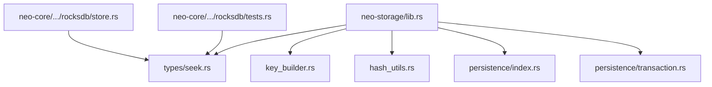
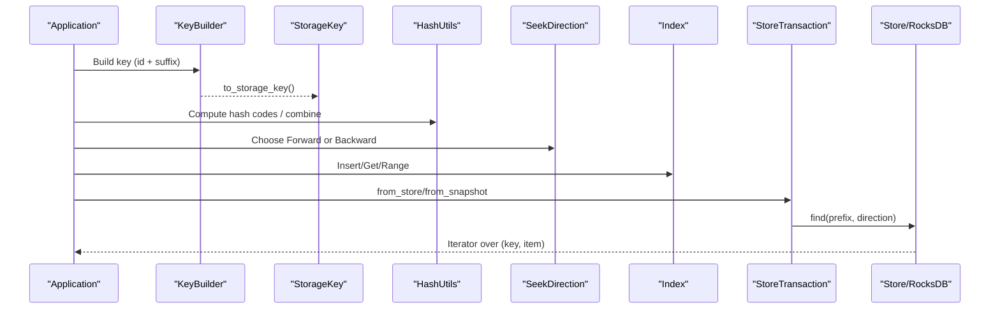
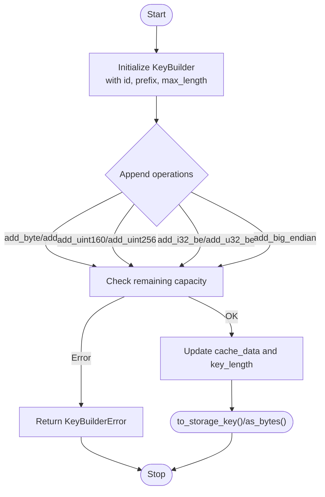
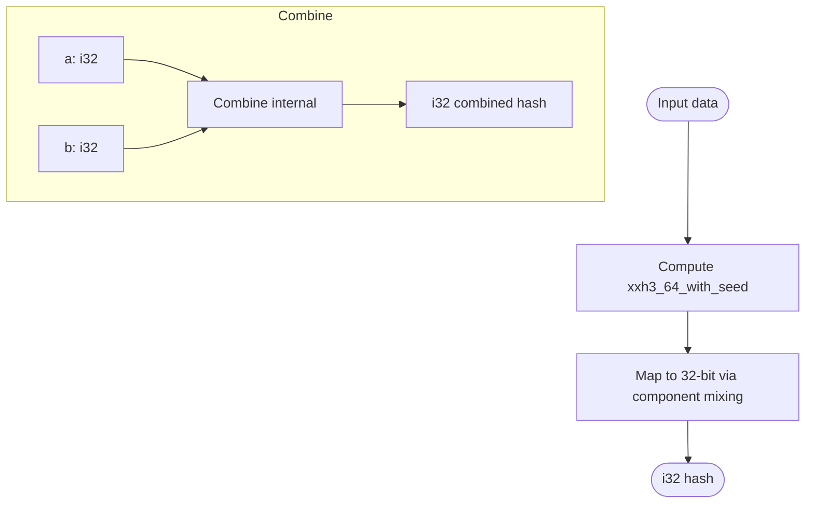
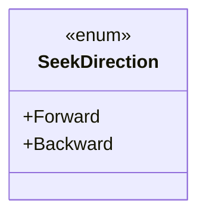
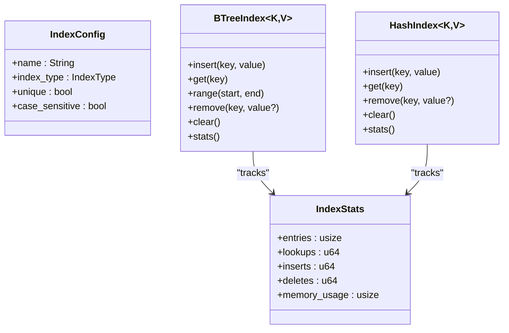
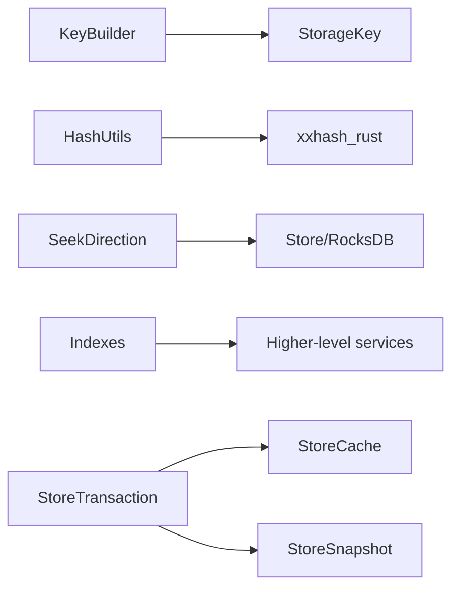

# Data Management

<cite>
**Referenced Files in This Document**
- [lib.rs](file://neo-storage/src/lib.rs)
- [key_builder.rs](file://neo-storage/src/key_builder.rs)
- [hash_utils.rs](file://neo-storage/src/hash_utils.rs)
- [seek.rs](file://neo-storage/src/types/seek.rs)
- [index.rs](file://neo-storage/src/persistence/index.rs)
- [transaction.rs](file://neo-storage/src/persistence/transaction.rs)
- [store.rs](file://neo-core/src/persistence/providers/rocksdb/store.rs)
- [tests.rs](file://neo-core/src/persistence/providers/rocksdb/tests.rs)
</cite>

## Table of Contents
1. [Introduction](#introduction)
2. [Project Structure](#project-structure)
3. [Core Components](#core-components)
4. [Architecture Overview](#architecture-overview)
5. [Detailed Component Analysis](#detailed-component-analysis)
6. [Dependency Analysis](#dependency-analysis)
7. [Performance Considerations](#performance-considerations)
8. [Troubleshooting Guide](#troubleshooting-guide)
9. [Conclusion](#conclusion)

## Introduction
This document explains the data management utilities in Neo-RS storage with a focus on:
- KeyBuilder fluent API for constructing storage keys that include contract IDs and key suffixes
- Hash utilities including xxhash3 implementation compatible with C# and hash code combination functions
- SeekDirection for forward and backward iteration across storage ranges
- Index management for efficient lookups and range queries
- Transaction management with atomic operations, rollback capabilities, and isolation levels
It also provides examples of complex key construction patterns, performance optimization techniques for large datasets, and best practices for data organization and access patterns.

## Project Structure
The Neo-RS storage crate exposes core types, utilities, and persistence abstractions used throughout the system. The most relevant modules for this document are:
- Types: StorageKey, StorageItem, SeekDirection, TrackState
- Utilities: KeyBuilder (fluent key construction), hash_utils (xxhash3 and hash code combine)
- Persistence: Store traits, snapshots, caches, transactions, and indexes



**Diagram sources**
- [lib.rs:1-71](file://neo-storage/src/lib.rs#L1-L71)
- [seek.rs:1-51](file://neo-storage/src/types/seek.rs#L1-L51)
- [key_builder.rs:1-459](file://neo-storage/src/key_builder.rs#L1-L459)
- [hash_utils.rs:1-122](file://neo-storage/src/hash_utils.rs#L1-L122)
- [index.rs:1-294](file://neo-storage/src/persistence/index.rs#L1-L294)
- [transaction.rs:1-71](file://neo-storage/src/persistence/transaction.rs#L1-L71)
- [store.rs:178-207](file://neo-core/src/persistence/providers/rocksdb/store.rs#L178-L207)
- [tests.rs:160-189](file://neo-core/src/persistence/providers/rocksdb/tests.rs#L160-L189)

**Section sources**
- [lib.rs:1-71](file://neo-storage/src/lib.rs#L1-L71)

## Core Components
- KeyBuilder: Fluent API to build storage keys with a contract ID prefix and variable-length suffix bytes. Supports adding bytes, integers, hashes, and big-endian values, with length checks and error handling.
- Hash utilities: xxhash3-based 32-bit hashing matching C# behavior, plus a System.HashCode.Combine-like combiner for deterministic composition of integer components.
- SeekDirection: Enumerates Forward and Backward iteration directions used by storage iterators.
- Index management: In-memory BTree and Hash indexes supporting insert, get, remove, clear, and range queries (BTree).
- Transactions: Thin wrapper around StoreCache providing explicit commit semantics and snapshot-backed read-only transactions.

**Section sources**
- [key_builder.rs:1-204](file://neo-storage/src/key_builder.rs#L1-L204)
- [hash_utils.rs:1-122](file://neo-storage/src/hash_utils.rs#L1-L122)
- [seek.rs:1-51](file://neo-storage/src/types/seek.rs#L1-L51)
- [index.rs:1-294](file://neo-storage/src/persistence/index.rs#L1-L294)
- [transaction.rs:1-71](file://neo-storage/src/persistence/transaction.rs#L1-L71)

## Architecture Overview
The storage layer composes typed keys, hashing utilities, and iteration direction into higher-level persistence operations. RocksDB-backed stores implement seek/find using SeekDirection, while in-memory indexes accelerate lookups and range scans. Transactions wrap caches to provide atomic commits and snapshot isolation.



**Diagram sources**
- [key_builder.rs:170-189](file://neo-storage/src/key_builder.rs#L170-L189)
- [hash_utils.rs:21-52](file://neo-storage/src/hash_utils.rs#L21-L52)
- [seek.rs:1-14](file://neo-storage/src/types/seek.rs#L1-L14)
- [index.rs:87-113](file://neo-storage/src/persistence/index.rs#L87-L113)
- [transaction.rs:15-51](file://neo-storage/src/persistence/transaction.rs#L15-L51)
- [store.rs:178-207](file://neo-core/src/persistence/providers/rocksdb/store.rs#L178-L207)

## Detailed Component Analysis

### KeyBuilder: Fluent API for Storage Keys
KeyBuilder constructs storage keys with a fixed-length prefix (contract id + prefix byte) followed by user-defined suffix bytes. It enforces maximum key length and supports appending various primitive types and hashes. Errors are returned via Result variants for safe usage, with panic-returning helpers for convenience.

Key behaviors:
- Prefix layout: little-endian i32 id followed by a u8 prefix byte
- Append methods: add_byte, add, add_uint160, add_uint256, add_i32_be, add_u32_be, add_big_endian
- Length validation: check_length prevents overflow beyond configured capacity
- Conversion: to_storage_key yields a StorageKey; as_bytes/to_bytes expose raw bytes

Complex key construction patterns:
- Contract state key: id + prefix + UInt160 account
- Counter map: id + prefix + i32 counter_id + u32 sequence
- Time-series entry: id + prefix + timestamp (big-endian) + entity id



**Diagram sources**
- [key_builder.rs:36-104](file://neo-storage/src/key_builder.rs#L36-L104)
- [key_builder.rs:112-168](file://neo-storage/src/key_builder.rs#L112-L168)
- [key_builder.rs:170-189](file://neo-storage/src/key_builder.rs#L170-L189)

**Section sources**
- [key_builder.rs:1-204](file://neo-storage/src/key_builder.rs#L1-L204)

### Hash Utilities: xxhash3 and Hash Code Combination
Provides deterministic 32-bit hashing compatible with C# Neo:
- xx_hash3_32(data, seed): Uses xxh3_64 internally and maps to 32-bit via a consistent transformation
- hash_code_combine_i32(a, b): Matches .NET’s System.HashCode.Combine(int, int) behavior
- Default seed constant ensures cross-language parity

Use cases:
- Computing stable hash codes for storage keys or index entries
- Combining multiple fields into a single hash for indexing or caching



**Diagram sources**
- [hash_utils.rs:21-52](file://neo-storage/src/hash_utils.rs#L21-L52)
- [hash_utils.rs:80-87](file://neo-storage/src/hash_utils.rs#L80-L87)

**Section sources**
- [hash_utils.rs:1-122](file://neo-storage/src/hash_utils.rs#L1-L122)

### SeekDirection: Forward and Backward Iteration
SeekDirection enumerates iteration order for storage scans:
- Forward: ascending order
- Backward: descending order

RocksDB-backed stores use SeekDirection to select appropriate iterators and optimize prefix scans. Tests verify backward prefix iteration returns expected ordering.



**Diagram sources**
- [seek.rs:1-14](file://neo-storage/src/types/seek.rs#L1-L14)

**Section sources**
- [seek.rs:1-51](file://neo-storage/src/types/seek.rs#L1-L51)
- [tests.rs:160-189](file://neo-core/src/persistence/providers/rocksdb/tests.rs#L160-L189)
- [store.rs:178-207](file://neo-core/src/persistence/providers/rocksdb/store.rs#L178-L207)

### Index Management: Efficient Lookups and Range Queries
In-memory indexes support fast lookups and, for BTree, ordered range queries:
- BTreeIndex: Ordered map enabling range(start..=end)
- HashIndex: Unordered map optimized for point lookups
- Both track statistics (entries, lookups, inserts, deletes, memory_usage)
- Unique mode enforces single value per key

Best practices:
- Use BTreeIndex when you need range scans or ordered traversal
- Use HashIndex for high-throughput point lookups
- Enable unique mode for primary-key-like constraints



**Diagram sources**
- [index.rs:5-41](file://neo-storage/src/persistence/index.rs#L5-L41)
- [index.rs:43-171](file://neo-storage/src/persistence/index.rs#L43-L171)
- [index.rs:173-294](file://neo-storage/src/persistence/index.rs#L173-L294)

**Section sources**
- [index.rs:1-294](file://neo-storage/src/persistence/index.rs#L1-L294)

### Transaction Management: Atomic Operations, Rollback, Isolation
StoreTransaction wraps StoreCache to provide:
- Explicit commit semantics via commit()
- Snapshot-backed read-only transactions for isolation
- Mutable access to underlying cache for staged mutations
- Helper to apply tracked changes based on TrackState

Isolation model:
- Read-only transactions backed by StoreSnapshot see a consistent view
- Write transactions stage changes in cache and persist atomically on commit

```mermaid
sequenceDiagram
participant Client as "Client"
participant TX as "StoreTransaction"
participant Cache as "StoreCache"
participant Snap as "StoreSnapshot"
participant Store as "Underlying Store"
Client->>TX : from_store(from_store/read_only)
TX->>Cache : stage mutations
Client->>TX : commit()
TX->>Cache : try_commit()
Cache->>Store : flush changes
Note over Client,Store : Atomic commit or no-op if errors
Client->>TX : from_snapshot(snapshot)
TX->>Snap : read-only view
Client->>TX : commit()
Note over TX,Snap : No writes; transaction ends
```

**Diagram sources**
- [transaction.rs:10-51](file://neo-storage/src/persistence/transaction.rs#L10-L51)

**Section sources**
- [transaction.rs:1-71](file://neo-storage/src/persistence/transaction.rs#L1-L71)

## Dependency Analysis
- KeyBuilder depends on StorageKey and primitive types to construct keys
- Hash utilities depend on xxhash_rust and random seeding for determinism
- SeekDirection is consumed by store implementations to control iterator direction
- Indexes are independent in-memory structures used by higher layers
- Transactions depend on StoreCache and StoreSnapshot to provide isolation and commit semantics



**Diagram sources**
- [key_builder.rs:170-189](file://neo-storage/src/key_builder.rs#L170-L189)
- [hash_utils.rs:1-122](file://neo-storage/src/hash_utils.rs#L1-L122)
- [seek.rs:1-14](file://neo-storage/src/types/seek.rs#L1-L14)
- [store.rs:178-207](file://neo-core/src/persistence/providers/rocksdb/store.rs#L178-L207)
- [transaction.rs:10-51](file://neo-storage/src/persistence/transaction.rs#L10-L51)

**Section sources**
- [lib.rs:1-71](file://neo-storage/src/lib.rs#L1-L71)

## Performance Considerations
- Key construction:
  - Pre-size KeyBuilder capacity to avoid reallocations
  - Prefer batched appends (add) over many small appends
  - Use big-endian integers for sortable keys to enable efficient range scans
- Hashing:
  - Reuse default seed for cross-language compatibility
  - Combine multiple fields with hash_code_combine_i32 for stable composite keys
- Iteration:
  - Use SeekDirection::Backward for reverse scans where supported by the store
  - Leverage prefix-based scans to minimize I/O
- Indexes:
  - Choose BTreeIndex for range queries; HashIndex for point lookups
  - Monitor IndexStats.memory_usage to bound in-memory footprint
- Transactions:
  - Batch writes within a single transaction to reduce commit overhead
  - Use snapshot-backed transactions for consistent reads without blocking writers

[No sources needed since this section provides general guidance]

## Troubleshooting Guide
Common issues and resolutions:
- KeyBuilder errors:
  - InvalidMaxLength: Ensure max_length > 0 when constructing KeyBuilder
  - DataTooLarge: Increase max_length or reduce payload size
  - NegativeBigInteger: Only non-negative BigIntegers are allowed for big-endian addition
- SeekDirection misuse:
  - Verify store supports backward iteration for your use case; tests demonstrate correct behavior
- Index uniqueness:
  - Duplicate key errors indicate unique mode violation; adjust key design or disable uniqueness
- Transaction commit failures:
  - Inspect underlying store errors during try_commit; ensure all staged changes are valid

**Section sources**
- [key_builder.rs:9-28](file://neo-storage/src/key_builder.rs#L9-L28)
- [key_builder.rs:86-104](file://neo-storage/src/key_builder.rs#L86-L104)
- [key_builder.rs:150-168](file://neo-storage/src/key_builder.rs#L150-L168)
- [tests.rs:160-189](file://neo-core/src/persistence/providers/rocksdb/tests.rs#L160-L189)
- [index.rs:87-100](file://neo-storage/src/persistence/index.rs#L87-L100)
- [index.rs:217-230](file://neo-storage/src/persistence/index.rs#L217-L230)
- [transaction.rs:48-51](file://neo-storage/src/persistence/transaction.rs#L48-L51)

## Conclusion
Neo-RS storage provides a robust set of utilities for building keys, computing compatible hashes, iterating efficiently, indexing data, and managing transactions. By following the recommended patterns—pre-sized builders, deterministic hashing, appropriate SeekDirection usage, suitable index selection, and transactional batching—you can achieve high performance and correctness at scale.

[No sources needed since this section summarizes without analyzing specific files]