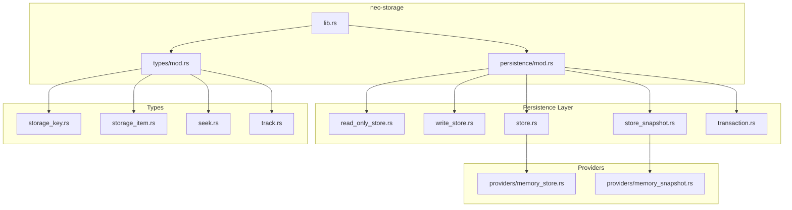
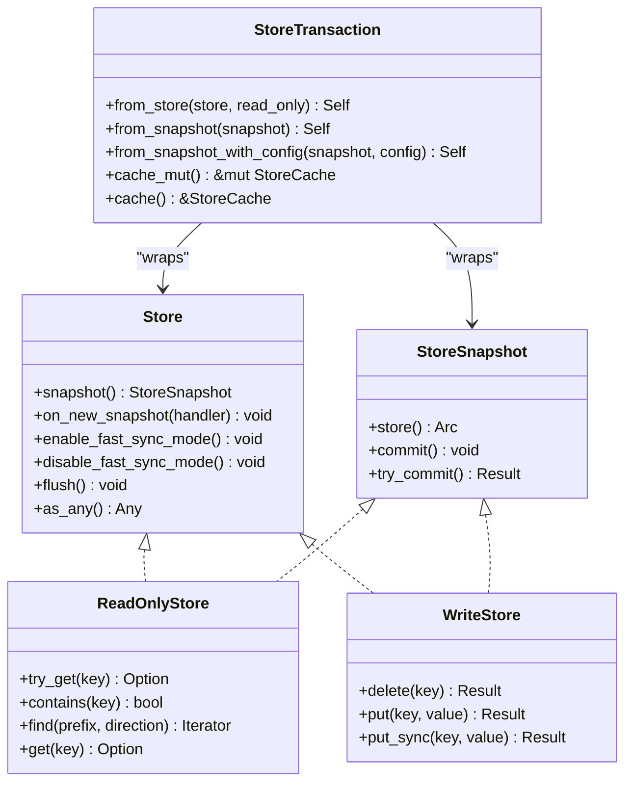
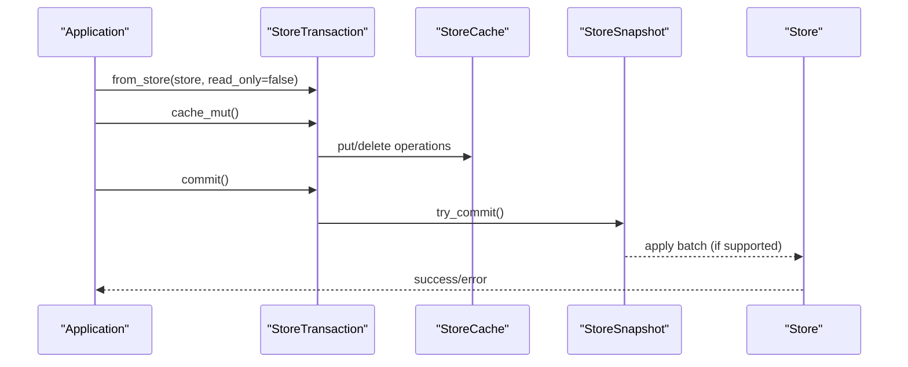
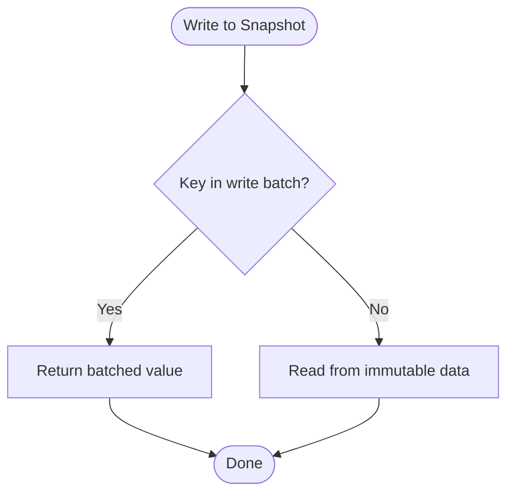
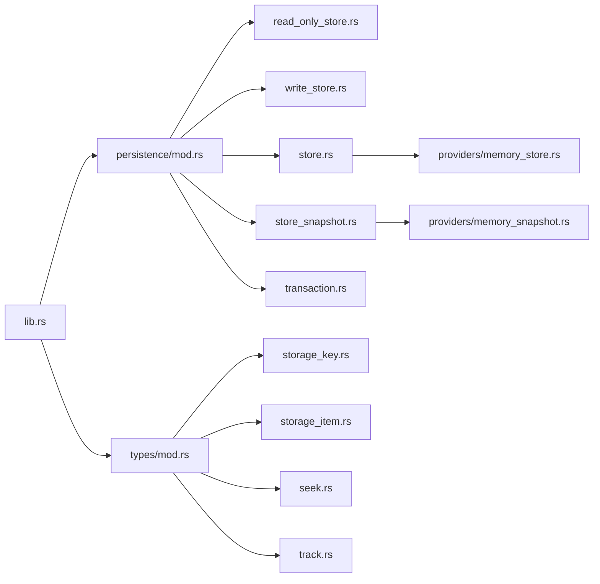

# Storage Abstraction

<cite>
**Referenced Files in This Document**
- [lib.rs](file://neo-storage/src/lib.rs)
- [mod.rs](file://neo-storage/src/persistence/mod.rs)
- [read_only_store.rs](file://neo-storage/src/persistence/read_only_store.rs)
- [write_store.rs](file://neo-storage/src/persistence/write_store.rs)
- [store.rs](file://neo-storage/src/persistence/store.rs)
- [store_snapshot.rs](file://neo-storage/src/persistence/store_snapshot.rs)
- [transaction.rs](file://neo-storage/src/persistence/transaction.rs)
- [storage_key.rs](file://neo-storage/src/types/storage_key.rs)
- [storage_item.rs](file://neo-storage/src/types/storage_item.rs)
- [seek.rs](file://neo-storage/src/types/seek.rs)
- [track.rs](file://neo-storage/src/types/track.rs)
- [memory_store.rs](file://neo-storage/src/persistence/providers/memory_store.rs)
- [memory_snapshot.rs](file://neo-storage/src/persistence/providers/memory_snapshot.rs)
</cite>

## Table of Contents
1. [Introduction](#introduction)
2. [Project Structure](#project-structure)
3. [Core Components](#core-components)
4. [Architecture Overview](#architecture-overview)
5. [Detailed Component Analysis](#detailed-component-analysis)
6. [Dependency Analysis](#dependency-analysis)
7. [Performance Considerations](#performance-considerations)
8. [Troubleshooting Guide](#troubleshooting-guide)
9. [Conclusion](#conclusion)

## Introduction
This document explains the Neo-RS storage abstraction layer, focusing on the core traits and types that define how data is read, written, versioned, and iterated. It covers:
- Core interfaces: ReadOnlyStore, WriteStore, Store, StoreSnapshot
- Transactions and batch operations via StoreTransaction
- Data types: StorageKey, StorageItem, SeekDirection, TrackState
- C# compatibility requirements for serialization and iteration semantics
- Guidance for implementing custom storage backends, error handling patterns, and performance considerations

The goal is to provide a clear mental model and practical guidance for building or integrating storage backends while maintaining protocol consistency with the C# implementation.

## Project Structure
The storage abstraction lives under neo-storage and exposes:
- Traits for reading, writing, snapshots, and transactions
- Types for keys, values, seek direction, and change tracking
- Providers (e.g., memory store/snapshot) as reference implementations
- Utilities for hashing and key building

**Diagram sources**
- [lib.rs:1-71](file://neo-storage/src/lib.rs#L1-L71)
- [mod.rs:1-31](file://neo-storage/src/persistence/mod.rs#L1-L31)
- [read_only_store.rs:1-34](file://neo-storage/src/persistence/read_only_store.rs#L1-L34)
- [write_store.rs:1-16](file://neo-storage/src/persistence/write_store.rs#L1-L16)
- [store.rs:1-31](file://neo-storage/src/persistence/store.rs#L1-L31)
- [store_snapshot.rs:1-32](file://neo-storage/src/persistence/store_snapshot.rs#L1-L32)
- [transaction.rs:1-46](file://neo-storage/src/persistence/transaction.rs#L1-L46)
- [storage_key.rs:1-504](file://neo-storage/src/types/storage_key.rs#L1-L504)
- [storage_item.rs:1-507](file://neo-storage/src/types/storage_item.rs#L1-L507)
- [seek.rs:1-50](file://neo-storage/src/types/seek.rs#L1-L50)
- [track.rs:1-39](file://neo-storage/src/types/track.rs#L1-L39)
- [memory_store.rs:121-176](file://neo-storage/src/persistence/providers/memory_store.rs#L121-L176)
- [memory_snapshot.rs:1-44](file://neo-storage/src/persistence/providers/memory_snapshot.rs#L1-L44)

**Section sources**
- [lib.rs:1-71](file://neo-storage/src/lib.rs#L1-L71)
- [mod.rs:1-31](file://neo-storage/src/persistence/mod.rs#L1-L31)

## Core Components
- ReadOnlyStore: Read-only interface with try_get, contains, find, get; generic over key/value types.
- WriteStore: Write interface with delete, put, and optional synchronous put_sync.
- Store: Combines read/write capabilities, snapshot creation, fast-sync hooks, flush, and downcasting.
- StoreSnapshot: Point-in-time view supporting reads/writes and commit semantics (try_commit preferred).
- StoreTransaction: Thin wrapper around a cache-backed transactional context bound to a Store or StoreSnapshot.

These abstractions enable pluggable backends while preserving consistent behavior across implementations.

**Section sources**
- [read_only_store.rs:1-34](file://neo-storage/src/persistence/read_only_store.rs#L1-L34)
- [write_store.rs:1-16](file://neo-storage/src/persistence/write_store.rs#L1-L16)
- [store.rs:1-31](file://neo-storage/src/persistence/store.rs#L1-L31)
- [store_snapshot.rs:1-32](file://neo-storage/src/persistence/store_snapshot.rs#L1-L32)
- [transaction.rs:1-46](file://neo-storage/src/persistence/transaction.rs#L1-L46)

## Architecture Overview
The storage layer separates concerns into traits and concrete providers:
- Consumers depend on traits (ReadOnlyStore, WriteStore, Store, StoreSnapshot).
- Implementations (e.g., MemoryStore/MemorySnapshot) provide concrete behavior.
- Transactions wrap caches to stage changes before committing to underlying stores.

**Diagram sources**
- [read_only_store.rs:1-34](file://neo-storage/src/persistence/read_only_store.rs#L1-L34)
- [write_store.rs:1-16](file://neo-storage/src/persistence/write_store.rs#L1-L16)
- [store.rs:1-31](file://neo-storage/src/persistence/store.rs#L1-L31)
- [store_snapshot.rs:1-32](file://neo-storage/src/persistence/store_snapshot.rs#L1-L32)
- [transaction.rs:1-46](file://neo-storage/src/persistence/transaction.rs#L1-L46)

## Detailed Component Analysis

### Storage Traits
- ReadOnlyStoreGeneric defines the read contract with try_get, contains, find, and get. The concrete ReadOnlyStore specializes it for StorageKey/StorageItem.
- WriteStore defines mutation methods with unified error handling via StorageResult.
- Store extends read/write with snapshotting, eventing, fast-sync toggles, flush, and downcasting.
- StoreSnapshot provides a mutable point-in-time view with try_commit for robust error propagation.

Implementation notes:
- Default implementations exist for convenience (e.g., contains based on try_get).
- Error handling uses a dedicated result type to propagate storage errors consistently.

**Section sources**
- [read_only_store.rs:1-34](file://neo-storage/src/persistence/read_only_store.rs#L1-L34)
- [write_store.rs:1-16](file://neo-storage/src/persistence/write_store.rs#L1-L16)
- [store.rs:1-31](file://neo-storage/src/persistence/store.rs#L1-L31)
- [store_snapshot.rs:1-32](file://neo-storage/src/persistence/store_snapshot.rs#L1-L32)

### Transaction Support and Batch Operations
- StoreTransaction wraps a cache-backed context bound to either a Store or StoreSnapshot.
- It exposes mutable and immutable access to the underlying cache for staged mutations.
- Commit semantics are delegated to the underlying cache/store, enabling batch application when supported by the backend.

Typical usage pattern:
- Create a transaction from a Store or Snapshot.
- Perform multiple put/delete operations through the cache.
- Commit once to apply all changes atomically where supported.

**Diagram sources**
- [transaction.rs:1-46](file://neo-storage/src/persistence/transaction.rs#L1-L46)
- [store_snapshot.rs:1-32](file://neo-storage/src/persistence/store_snapshot.rs#L1-L32)
- [store.rs:1-31](file://neo-storage/src/persistence/store.rs#L1-L31)

**Section sources**
- [transaction.rs:1-46](file://neo-storage/src/persistence/transaction.rs#L1-L46)

### StorageKey
- Represents a contract-scoped key composed of an i32 contract id and a variable-length suffix.
- Provides fluent constructors for common suffixes (bytes, UInt160, UInt256, integers).
- Supports search prefix generation for iteration and efficient ordering/comparison.
- Serialization format: little-endian i32 id followed by suffix bytes.
- Hash code computation matches C# using xxhash3-based combination.

Key behaviors:
- as_bytes returns borrowed slice when cached to avoid allocations.
- create_search_prefix builds a lexicographically valid prefix for range scans.

**Section sources**
- [storage_key.rs:1-504](file://neo-storage/src/types/storage_key.rs#L1-L504)

### StorageItem
- Encapsulates stored value bytes with an optional constant flag and lazy typed cache.
- Implements StorageValue with a wire format: one-byte constant flag followed by raw value bytes.
- Supports materialization from cache when raw bytes are empty, sealing, and replica copying.
- Equality compares both value bytes and constant flag.

Serialization format (C# compatible):
- Byte 0: is_constant (0x00 or 0x01)
- Bytes 1..N: raw value data

**Section sources**
- [storage_item.rs:1-507](file://neo-storage/src/types/storage_item.rs#L1-L507)

### SeekDirection and Iteration Patterns
- SeekDirection enumerates forward/backward iteration directions with explicit signed representation for C# parity.
- Used by find operations to control traversal order.

Usage:
- Pass SeekDirection::Forward for ascending scans.
- Pass SeekDirection::Backward for descending scans.

**Section sources**
- [seek.rs:1-50](file://neo-storage/src/types/seek.rs#L1-L50)

### TrackState and Change Tracking
- TrackState models lifecycle states for cached entries: None, Added, Changed, Deleted, NotFound.
- Used by caching layers to determine persistence actions during commit.
- Matches C# Neo.Persistence.TrackState exactly for interoperability.

Integration:
- Caches mark items as Added/Changed/Deleted when mutated.
- On commit, only modified entries are persisted, reducing write amplification.

**Section sources**
- [track.rs:1-39](file://neo-storage/src/types/track.rs#L1-L39)

### Example: Memory Store and Snapshot
- MemoryStore implements Store with snapshot support and eventing for new snapshots.
- MemorySnapshot implements StoreSnapshot with a write batch overlay and commit that applies changes to the underlying store when possible.

Highlights:
- Snapshot reads first check the write batch, then fall back to immutable data.
- Commit clears the write batch after applying changes.

**Diagram sources**
- [memory_snapshot.rs:1-44](file://neo-storage/src/persistence/providers/memory_snapshot.rs#L1-L44)
- [memory_store.rs:121-176](file://neo-storage/src/persistence/providers/memory_store.rs#L121-L176)

**Section sources**
- [memory_store.rs:121-176](file://neo-storage/src/persistence/providers/memory_store.rs#L121-L176)
- [memory_snapshot.rs:1-44](file://neo-storage/src/persistence/providers/memory_snapshot.rs#L1-L44)

## Dependency Analysis
- lib.rs re-exports core traits and types for consumers.
- persistence/mod.rs centralizes trait exports and module organization.
- Types module groups StorageKey, StorageItem, SeekDirection, TrackState.
- Providers implement traits defined in persistence.

**Diagram sources**
- [lib.rs:1-71](file://neo-storage/src/lib.rs#L1-L71)
- [mod.rs:1-31](file://neo-storage/src/persistence/mod.rs#L1-L31)
- [read_only_store.rs:1-34](file://neo-storage/src/persistence/read_only_store.rs#L1-L34)
- [write_store.rs:1-16](file://neo-storage/src/persistence/write_store.rs#L1-L16)
- [store.rs:1-31](file://neo-storage/src/persistence/store.rs#L1-L31)
- [store_snapshot.rs:1-32](file://neo-storage/src/persistence/store_snapshot.rs#L1-L32)
- [transaction.rs:1-46](file://neo-storage/src/persistence/transaction.rs#L1-L46)
- [storage_key.rs:1-504](file://neo-storage/src/types/storage_key.rs#L1-L504)
- [storage_item.rs:1-507](file://neo-storage/src/types/storage_item.rs#L1-L507)
- [seek.rs:1-50](file://neo-storage/src/types/seek.rs#L1-L50)
- [track.rs:1-39](file://neo-storage/src/types/track.rs#L1-L39)
- [memory_store.rs:121-176](file://neo-storage/src/persistence/providers/memory_store.rs#L121-L176)
- [memory_snapshot.rs:1-44](file://neo-storage/src/persistence/providers/memory_snapshot.rs#L1-L44)

**Section sources**
- [lib.rs:1-71](file://neo-storage/src/lib.rs#L1-L71)
- [mod.rs:1-31](file://neo-storage/src/persistence/mod.rs#L1-L31)

## Performance Considerations
- Prefer as_bytes/to_array on StorageKey to leverage cached full-key buffers and minimize allocations.
- Use create_search_prefix for efficient range scans; ensure prefixes align with key layout (little-endian id + suffix).
- Leverage StoreTransaction to batch writes; commit once to reduce overhead.
- Use SeekDirection appropriately to match iteration patterns expected by consumers.
- For high-throughput scenarios, consider enabling fast-sync mode on Store if supported by the backend.
- Minimize repeated conversions between StorageItem and raw bytes; use seal when necessary to materialize caches.

[No sources needed since this section provides general guidance]

## Troubleshooting Guide
Common issues and resolutions:
- Inconsistent state after commit: Ensure you call try_commit on StoreSnapshot and handle returned errors rather than ignoring them.
- Unexpected missing keys: Verify that your write batch includes the intended key and that commits are applied before reads.
- Serialization mismatches: Confirm StorageItem serialization format (constant flag + value bytes) matches expectations for cross-language compatibility.
- Iteration order surprises: Validate SeekDirection usage and key construction to ensure correct lexicographic ordering.

Error handling patterns:
- Propagate StorageError from WriteStore and StoreSnapshot operations.
- Log and surface failures from snapshot commits to prevent silent data loss.

**Section sources**
- [store_snapshot.rs:1-32](file://neo-storage/src/persistence/store_snapshot.rs#L1-L32)
- [write_store.rs:1-16](file://neo-storage/src/persistence/write_store.rs#L1-L16)
- [storage_item.rs:230-267](file://neo-storage/src/types/storage_item.rs#L230-L267)

## Conclusion
The Neo-RS storage abstraction provides a clean, composable set of traits and types that enable flexible, efficient, and protocol-compatible storage backends. By adhering to the defined interfaces, respecting serialization formats, and leveraging transactions and snapshots, developers can build robust systems that integrate seamlessly with the broader Neo ecosystem.

[No sources needed since this section summarizes without analyzing specific files]