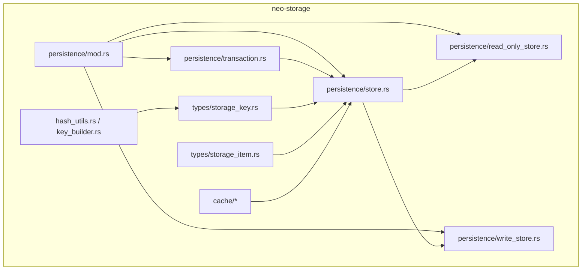
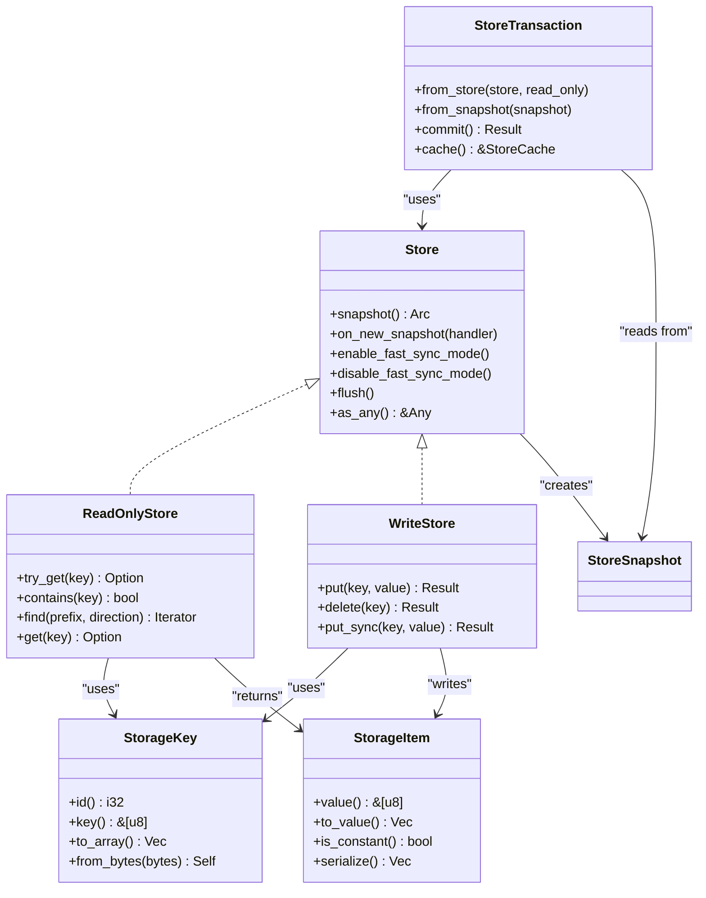
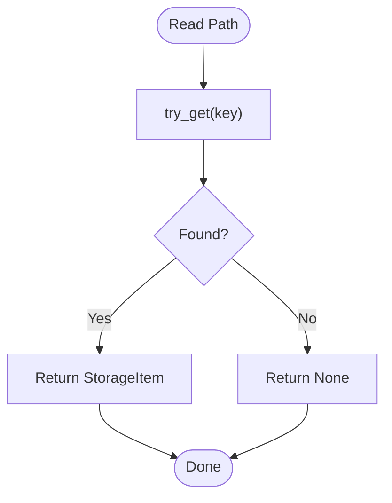
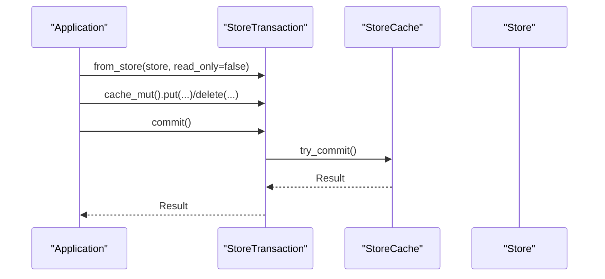
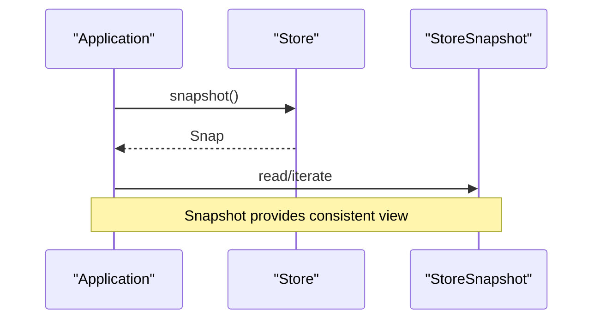
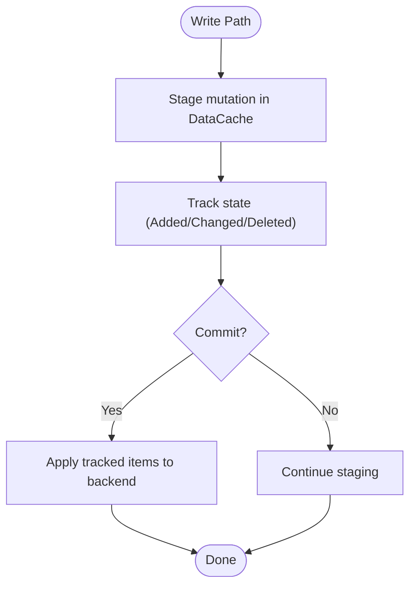
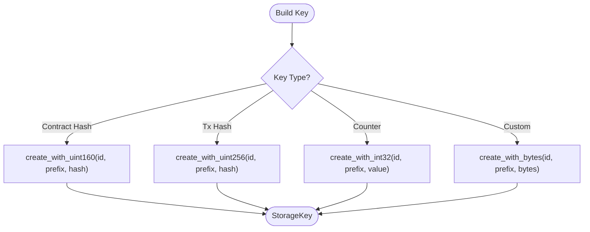
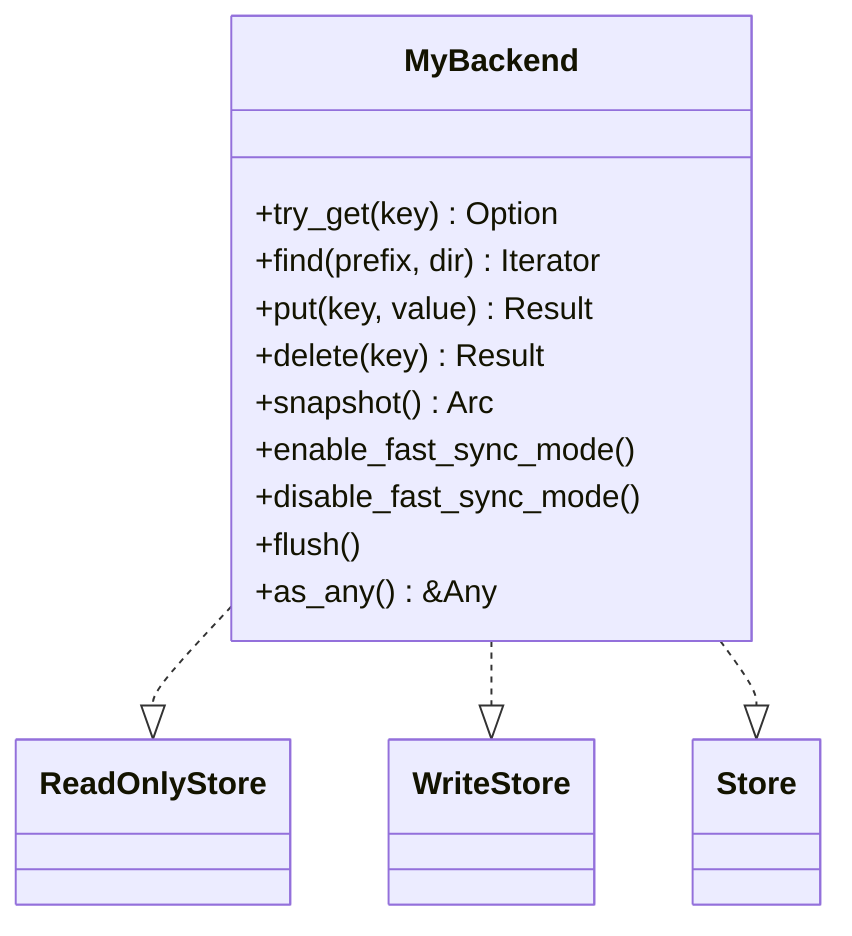
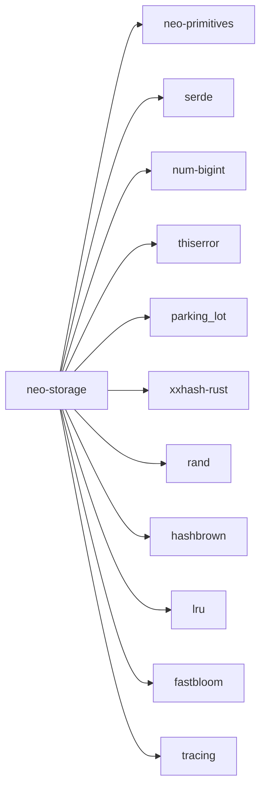

# Storage Layer

<cite>
**Referenced Files in This Document**
- [lib.rs](file://neo-storage/src/lib.rs)
- [mod.rs](file://neo-storage/src/persistence/mod.rs)
- [store.rs](file://neo-storage/src/persistence/store.rs)
- [read_only_store.rs](file://neo-storage/src/persistence/read_only_store.rs)
- [write_store.rs](file://neo-storage/src/write_store.rs)
- [transaction.rs](file://neo-storage/src/persistence/transaction.rs)
- [storage_key.rs](file://neo-storage/src/types/storage_key.rs)
- [storage_item.rs](file://neo-storage/src/types/storage_item.rs)
- [Cargo.toml](file://neo-storage/Cargo.toml)
</cite>

## Table of Contents
1. [Introduction](#introduction)
2. [Project Structure](#project-structure)
3. [Core Components](#core-components)
4. [Architecture Overview](#architecture-overview)
5. [Detailed Component Analysis](#detailed-component-analysis)
6. [Dependency Analysis](#dependency-analysis)
7. [Performance Considerations](#performance-considerations)
8. [Troubleshooting Guide](#troubleshooting-guide)
9. [Conclusion](#conclusion)
10. [Appendices](#appendices)

## Introduction
This document explains the Neo-RS storage abstraction layer, focusing on the key-value interface, transaction support, and batch operations. It covers the design of the storage traits, snapshotting, caching strategies (read cache, write buffer, data cache), storage types and key construction patterns, and guidance for custom backends, performance tuning, maintenance, backup/restore, snapshots, and migration strategies. The goal is to make the storage subsystem understandable for both developers integrating new backends and operators optimizing production deployments.

## Project Structure
The storage subsystem lives in the neo-storage crate and exposes a clean trait-based API over pluggable backends. The main modules are:
- persistence: core traits (ReadOnlyStore, WriteStore, Store, StoreSnapshot), transactions, caching layers, and provider/factory abstractions
- types: canonical storage key/value types and iteration direction
- cache: in-memory cache with change tracking
- hash_utils and key_builder: C#-compatible hashing and fluent key construction utilities

**Diagram sources**
- [mod.rs:1-31](file://neo-storage/src/persistence/mod.rs#L1-L31)
- [store.rs:1-31](file://neo-storage/src/persistence/store.rs#L1-L31)
- [read_only_store.rs:1-34](file://neo-storage/src/persistence/read_only_store.rs#L1-L34)
- [write_store.rs:1-16](file://neo-storage/src/persistence/write_store.rs#L1-L16)
- [transaction.rs:1-71](file://neo-storage/src/persistence/transaction.rs#L1-L71)
- [storage_key.rs:1-504](file://neo-storage/src/types/storage_key.rs#L1-L504)
- [storage_item.rs:1-507](file://neo-storage/src/types/storage_item.rs#L1-L507)

**Section sources**
- [lib.rs:1-71](file://neo-storage/src/lib.rs#L1-L71)
- [mod.rs:1-31](file://neo-storage/src/persistence/mod.rs#L1-L31)

## Core Components
- ReadOnlyStore: read-only access with try_get, contains, find, and get; supports prefix scans via SeekDirection
- WriteStore: put/delete with optional synchronous variant
- Store: combines reads/writes, adds snapshot creation, fast-sync mode toggles, flush, and downcasting
- StoreSnapshot: point-in-time view used by transactions and iterators
- StoreTransaction: explicit commit semantics backed by a cache that stages mutations
- StorageKey and StorageItem: canonical key/value types with serialization and compatibility guarantees
- DataCache and TrackState: in-memory cache with change tracking for staged writes

These components form a layered architecture where higher-level code uses Store and StoreTransaction while concrete backends implement the traits.

**Section sources**
- [read_only_store.rs:1-34](file://neo-storage/src/persistence/read_only_store.rs#L1-L34)
- [write_store.rs:1-16](file://neo-storage/src/persistence/write_store.rs#L1-L16)
- [store.rs:1-31](file://neo-storage/src/persistence/store.rs#L1-L31)
- [transaction.rs:1-71](file://neo-storage/src/persistence/transaction.rs#L1-L71)
- [storage_key.rs:1-504](file://neo-storage/src/types/storage_key.rs#L1-L504)
- [storage_item.rs:1-507](file://neo-storage/src/types/storage_item.rs#L1-L507)

## Architecture Overview
The storage layer separates concerns into traits, caching, and transactions:
- Traits define the contract for any backend (e.g., RocksDB or an in-memory store)
- Transactions wrap a cache-backed view over a Store or StoreSnapshot, enabling atomic commits
- Snapshots provide consistent views for iteration and read-heavy workloads
- Key/value types ensure protocol compatibility and efficient serialization

**Diagram sources**
- [store.rs:1-31](file://neo-storage/src/persistence/store.rs#L1-L31)
- [read_only_store.rs:1-34](file://neo-storage/src/persistence/read_only_store.rs#L1-L34)
- [write_store.rs:1-16](file://neo-storage/src/persistence/write_store.rs#L1-L16)
- [transaction.rs:1-71](file://neo-storage/src/persistence/transaction.rs#L1-L71)
- [storage_key.rs:1-504](file://neo-storage/src/types/storage_key.rs#L1-L504)
- [storage_item.rs:1-507](file://neo-storage/src/types/storage_item.rs#L1-L507)

## Detailed Component Analysis

### Key-Value Interface and Iteration
- Keys: StorageKey encodes a contract ID and a variable-length suffix, with helpers to build keys from primitives and hashes. It provides ordering, hashing compatible with C#, and zero-copy byte access when possible.
- Values: StorageItem wraps raw bytes with an optional constant flag and an opaque typed cache for lazy materialization. It implements a stable storage format including a leading flag byte.
- Read API: try_get returns values or None; contains is a convenience; find supports prefix scans with SeekDirection for forward/backward iteration.
- Write API: put and delete with optional synchronous variants.

**Diagram sources**
- [read_only_store.rs:1-34](file://neo-storage/src/persistence/read_only_store.rs#L1-L34)
- [storage_key.rs:1-504](file://neo-storage/src/types/storage_key.rs#L1-L504)
- [storage_item.rs:1-507](file://neo-storage/src/types/storage_item.rs#L1-L507)

**Section sources**
- [storage_key.rs:1-504](file://neo-storage/src/types/storage_key.rs#L1-L504)
- [storage_item.rs:1-507](file://neo-storage/src/types/storage_item.rs#L1-L507)
- [read_only_store.rs:1-34](file://neo-storage/src/persistence/read_only_store.rs#L1-L34)

### Transaction Support and Batch Operations
- StoreTransaction wraps a cache-backed view over a Store or StoreSnapshot, allowing multiple mutations to be staged and committed atomically.
- apply_tracked_items demonstrates how tracked changes map to add/update/delete operations during commit.
- Batch operations can be achieved by accumulating changes in a transaction and committing once, minimizing backend round-trips.

**Diagram sources**
- [transaction.rs:1-71](file://neo-storage/src/persistence/transaction.rs#L1-L71)
- [store.rs:1-31](file://neo-storage/src/persistence/store.rs#L1-L31)

**Section sources**
- [transaction.rs:1-71](file://neo-storage/src/persistence/transaction.rs#L1-L71)

### Snapshot Management
- Store::snapshot creates a point-in-time view suitable for consistent reads and iteration.
- StoreTransaction can be constructed from a snapshot to isolate reads and writes without affecting the live store.
- Fast-sync mode flags allow backends to optimize bulk import paths.

**Diagram sources**
- [store.rs:1-31](file://neo-storage/src/persistence/store.rs#L1-L31)
- [transaction.rs:1-71](file://neo-storage/src/persistence/transaction.rs#L1-L71)

**Section sources**
- [store.rs:1-31](file://neo-storage/src/persistence/store.rs#L1-L31)
- [transaction.rs:1-71](file://neo-storage/src/persistence/transaction.rs#L1-L71)

### Caching Strategies
- DataCache and TrackState: In-memory cache with change tracking for staged writes. Changes are classified as Added, Changed, Deleted, or NotFound, enabling efficient diffing and commit.
- Read cache: Exposed via ReadCache and StorageReadCache abstractions for prefetch hints and stats; reduces repeated disk reads.
- Write buffer: Transactions accumulate changes in a cache-backed view before committing, batching writes and reducing sync overhead.

**Diagram sources**
- [transaction.rs:1-71](file://neo-storage/src/persistence/transaction.rs#L1-L71)
- [mod.rs:1-31](file://neo-storage/src/persistence/mod.rs#L1-L31)

**Section sources**
- [mod.rs:1-31](file://neo-storage/src/persistence/mod.rs#L1-L31)
- [transaction.rs:1-71](file://neo-storage/src/persistence/transaction.rs#L1-L71)

### Storage Types and Key Construction Patterns
- StorageKey supports creating keys for various structures using helper constructors for bytes, integers, and hashes. Search prefixes enable efficient range scans.
- StorageItem supports constant values and typed caches for lazy materialization, with a stable wire format including a leading flag byte.

**Diagram sources**
- [storage_key.rs:1-504](file://neo-storage/src/types/storage_key.rs#L1-L504)

**Section sources**
- [storage_key.rs:1-504](file://neo-storage/src/types/storage_key.rs#L1-L504)
- [storage_item.rs:1-507](file://neo-storage/src/types/storage_item.rs#L1-L507)

### Custom Storage Backends
To implement a new backend:
- Implement ReadOnlyStore for reads and prefix scans
- Implement WriteStore for puts and deletes
- Combine into Store to expose snapshot(), fast-sync toggles, flush(), and as_any()
- Optionally integrate with StoreFactory/StoreProvider if your runtime requires dynamic instantiation

**Diagram sources**
- [read_only_store.rs:1-34](file://neo-storage/src/persistence/read_only_store.rs#L1-L34)
- [write_store.rs:1-16](file://neo-storage/src/persistence/write_store.rs#L1-L16)
- [store.rs:1-31](file://neo-storage/src/persistence/store.rs#L1-L31)

**Section sources**
- [read_only_store.rs:1-34](file://neo-storage/src/persistence/read_only_store.rs#L1-L34)
- [write_store.rs:1-16](file://neo-storage/src/persistence/write_store.rs#L1-L16)
- [store.rs:1-31](file://neo-storage/src/persistence/store.rs#L1-L31)

## Dependency Analysis
The neo-storage crate depends on internal primitives and external crates for serialization, concurrency, hashing, caching, and logging. These dependencies underpin the storage traits and utilities.

**Diagram sources**
- [Cargo.toml:1-51](file://neo-storage/Cargo.toml#L1-L51)

**Section sources**
- [Cargo.toml:1-51](file://neo-storage/Cargo.toml#L1-L51)

## Performance Considerations
- Prefer transactions to batch writes and reduce synchronization overhead
- Use StoreSnapshot for consistent reads and iteration to avoid locking contention
- Leverage fast-sync mode when importing large datasets to enable backend-specific optimizations
- Use prefix scans with appropriate SeekDirection to minimize unnecessary reads
- Tune read cache and prefetch hints where available to improve hit rates
- Avoid excessive allocations by reusing StorageKey buffers and leveraging zero-copy byte access when possible

[No sources needed since this section provides general guidance]

## Troubleshooting Guide
Common issues and diagnostics:
- Missing keys: verify key construction matches expected prefix and id; use create_search_prefix for scans
- Unexpected constants: check StorageItem.is_constant and serialization format
- Slow scans: ensure correct prefix and direction; consider read cache tuning
- Commit failures: inspect tracked states and ensure all mutations are valid before commit
- Backend errors: log and handle StorageResult errors from put/delete/commit

**Section sources**
- [storage_key.rs:1-504](file://neo-storage/src/types/storage_key.rs#L1-L504)
- [storage_item.rs:1-507](file://neo-storage/src/types/storage_item.rs#L1-L507)
- [transaction.rs:1-71](file://neo-storage/src/persistence/transaction.rs#L1-L71)

## Conclusion
The Neo-RS storage layer provides a robust, composable abstraction over key-value stores with strong transactional guarantees, snapshotting, and caching. By adhering to the defined traits and using StorageKey/StorageItem consistently, applications can achieve high performance and maintain protocol compatibility. Operators can tune caching and transactions for throughput, while developers can plug in custom backends seamlessly.

[No sources needed since this section summarizes without analyzing specific files]

## Appendices

### Backup and Restore Procedures
- Use StoreSnapshot to capture a consistent view for export
- Export serialized keys/values from the snapshot for offline storage
- On restore, reconstruct keys and values and replay them into a fresh backend using transactions

[No sources needed since this section provides general guidance]

### Migration Strategies
- Create a new backend instance and stream data from the old store via snapshots and prefix scans
- Use transactions to batch updates during migration to minimize downtime
- Validate integrity by comparing counts and checksums post-migration

[No sources needed since this section provides general guidance]