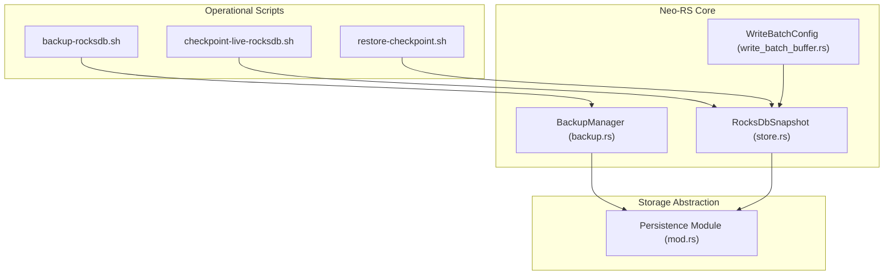
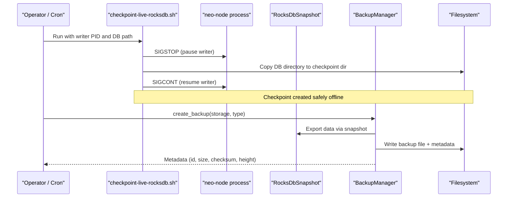
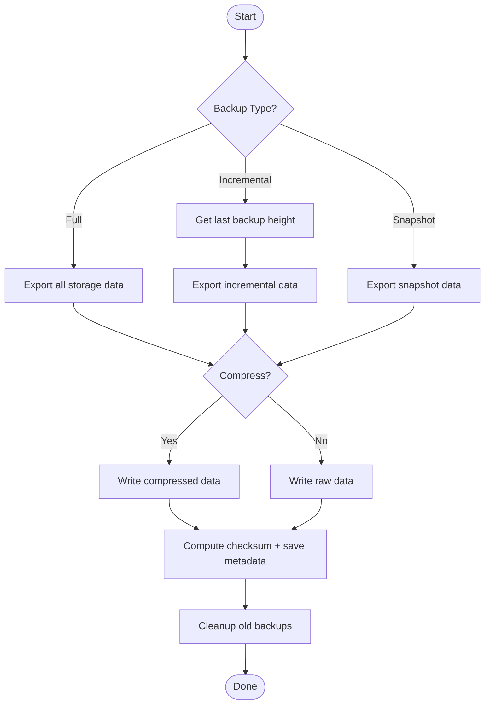
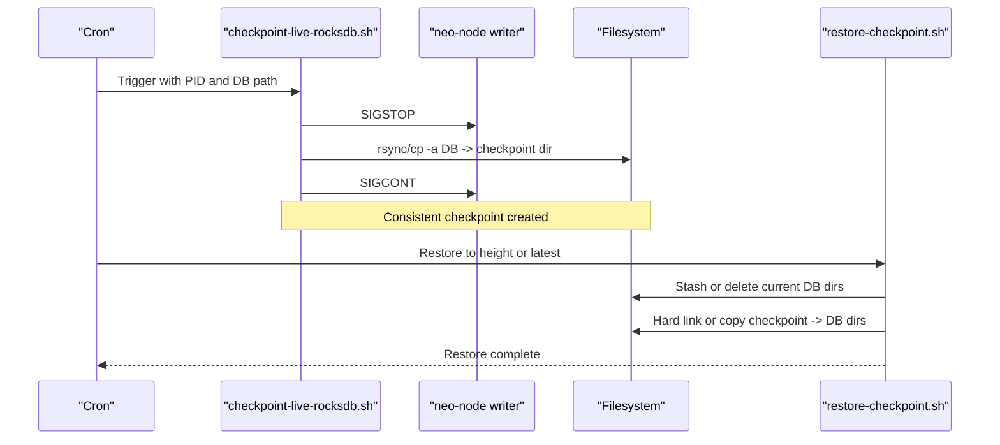
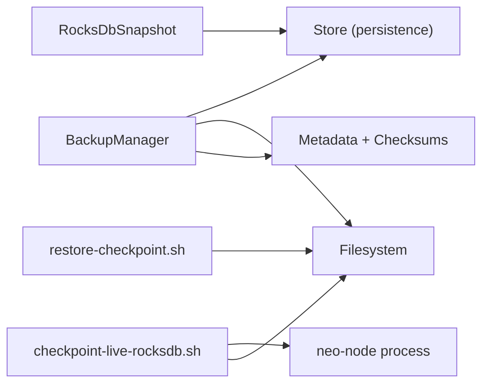

# Backup & Disaster Recovery

<cite>
**Referenced Files in This Document**
- [backup.rs](file://neo-core/src/persistence/backup.rs)
- [store.rs](file://neo-core/src/persistence/providers/rocksdb/store.rs)
- [write_batch_buffer.rs](file://neo-core/src/persistence/write_batch_buffer.rs)
- [mod.rs](file://neo-storage/src/persistence/mod.rs)
- [backup-rocksdb.sh](file://scripts/backup-rocksdb.sh)
- [checkpoint-live-rocksdb.sh](file://scripts/checkpoint-live-rocksdb.sh)
- [restore-checkpoint.sh](file://scripts/restore-checkpoint.sh)
- [MONITORING.md](file://docs/MONITORING.md)
- [neo_production_node.toml](file://neo_production_node.toml)
</cite>

## Table of Contents
1. [Introduction](#introduction)
2. [Project Structure](#project-structure)
3. [Core Components](#core-components)
4. [Architecture Overview](#architecture-overview)
5. [Detailed Component Analysis](#detailed-component-analysis)
6. [Dependency Analysis](#dependency-analysis)
7. [Performance Considerations](#performance-considerations)
8. [Troubleshooting Guide](#troubleshooting-guide)
9. [Conclusion](#conclusion)
10. [Appendices](#appendices)

## Introduction
This document provides comprehensive backup and disaster recovery guidance for Neo-RS production environments. It covers automated backup strategies for blockchain data, configuration files, and state snapshots; RocksDB-backed snapshotting and point-in-time recovery; RTO/RPO planning; verification and testing procedures; retention and offsite replication; emergency recovery playbooks; and monitoring, alerting, and maintenance practices to ensure backup integrity and availability.

## Project Structure
Neo-RS exposes both programmatic and operational mechanisms for backups:
- Programmatic backup manager with full, incremental, and snapshot modes, metadata, checksums, and optional compression.
- Operational scripts for live RocksDB checkpointing and safe restoration using hard links where possible.
- Storage layer abstractions and RocksDB-backed store with snapshot support and configurable write batching.
- Monitoring guidance that includes tying backup failures and restore events into alerts.

**Diagram sources**
- [backup.rs:109-164](file://neo-core/src/persistence/backup.rs#L109-L164)
- [store.rs:354-390](file://neo-core/src/persistence/providers/rocksdb/store.rs#L354-L390)
- [write_batch_buffer.rs:127-193](file://neo-core/src/persistence/write_batch_buffer.rs#L127-L193)
- [mod.rs:1-31](file://neo-storage/src/persistence/mod.rs#L1-L31)

**Section sources**
- [backup.rs:109-164](file://neo-core/src/persistence/backup.rs#L109-L164)
- [store.rs:354-390](file://neo-core/src/persistence/providers/rocksdb/store.rs#L354-L390)
- [write_batch_buffer.rs:127-193](file://neo-core/src/persistence/write_batch_buffer.rs#L127-L193)
- [mod.rs:1-31](file://neo-storage/src/persistence/mod.rs#L1-L31)

## Core Components
- BackupManager: Creates full/incremental/snapshot backups, writes metadata, computes checksums, supports optional compression, and cleans up old backups based on retention policy.
- RocksDbSnapshot: Provides a consistent read view over the live RocksDB instance, enabling safe export or snapshot operations without blocking normal writes.
- WriteBatchConfig: Controls RocksDB write behavior (sync-on-flush, WAL usage), which influences durability and performance trade-offs during backups and restores.
- Persistence module: Exposes storage abstractions used by backup routines and snapshot-based exports.

Key capabilities:
- Full backup: Export all storage data.
- Incremental backup: Export changes since last successful backup height.
- Snapshot backup: Export current state snapshot at a specific height.
- Verification: Size and checksum validation post-backup and pre-restore.
- Retention: Automatic cleanup of older backups beyond configured limits.

**Section sources**
- [backup.rs:16-25](file://neo-core/src/persistence/backup.rs#L16-L25)
- [backup.rs:42-64](file://neo-core/src/persistence/backup.rs#L42-L64)
- [backup.rs:109-164](file://neo-core/src/persistence/backup.rs#L109-L164)
- [backup.rs:166-201](file://neo-core/src/persistence/backup.rs#L166-L201)
- [backup.rs:253-278](file://neo-core/src/persistence/backup.rs#L253-L278)
- [backup.rs:305-364](file://neo-core/src/persistence/backup.rs#L305-L364)
- [store.rs:354-390](file://neo-core/src/persistence/providers/rocksdb/store.rs#L354-L390)
- [write_batch_buffer.rs:127-193](file://neo-core/src/persistence/write_batch_buffer.rs#L127-L193)
- [mod.rs:1-31](file://neo-storage/src/persistence/mod.rs#L1-L31)

## Architecture Overview
The backup architecture combines application-level backup logic with low-level RocksDB snapshotting and operational scripts for point-in-time consistency.

**Diagram sources**
- [checkpoint-live-rocksdb.sh:1-78](file://scripts/checkpoint-live-rocksdb.sh#L1-L78)
- [backup.rs:109-164](file://neo-core/src/persistence/backup.rs#L109-L164)
- [store.rs:354-390](file://neo-core/src/persistence/providers/rocksdb/store.rs#L354-L390)

## Detailed Component Analysis

### BackupManager (Programmatic Backups)
Responsibilities:
- Create full, incremental, and snapshot backups.
- Generate unique IDs, compute checksums, and persist metadata.
- Support optional compression and retention cleanup.
- Restore from backups with integrity checks.

Data flow:
- Full: Export all data, optionally compress, write file, compute checksum, save metadata.
- Incremental: Determine last backup height, export only new blocks/state, write and verify.
- Snapshot: Export current state snapshot, write and verify.

Restore flow:
- Validate existence and metadata, verify checksum, import data, verify restored height.

**Diagram sources**
- [backup.rs:109-164](file://neo-core/src/persistence/backup.rs#L109-L164)
- [backup.rs:305-364](file://neo-core/src/persistence/backup.rs#L305-L364)
- [backup.rs:447-466](file://neo-core/src/persistence/backup.rs#L447-L466)
- [backup.rs:468-483](file://neo-core/src/persistence/backup.rs#L468-L483)
- [backup.rs:485-499](file://neo-core/src/persistence/backup.rs#L485-L499)
- [backup.rs:524-558](file://neo-core/src/persistence/backup.rs#L524-L558)

**Section sources**
- [backup.rs:109-164](file://neo-core/src/persistence/backup.rs#L109-L164)
- [backup.rs:166-201](file://neo-core/src/persistence/backup.rs#L166-L201)
- [backup.rs:253-278](file://neo-core/src/persistence/backup.rs#L253-L278)
- [backup.rs:305-364](file://neo-core/src/persistence/backup.rs#L305-L364)
- [backup.rs:447-466](file://neo-core/src/persistence/backup.rs#L447-L466)
- [backup.rs:468-483](file://neo-core/src/persistence/backup.rs#L468-L483)
- [backup.rs:485-499](file://neo-core/src/persistence/backup.rs#L485-L499)
- [backup.rs:524-558](file://neo-core/src/persistence/backup.rs#L524-L558)

### RocksDB Snapshot and Live Checkpointing
- RocksDbSnapshot creates a consistent read-only view of the live database, enabling safe export without halting the node.
- The live checkpoint script pauses the writer process, copies the RocksDB directory, then resumes it, ensuring a consistent snapshot.
- Restoration uses hard links when available to minimize I/O and preserve original checkpoints.

**Diagram sources**
- [checkpoint-live-rocksdb.sh:1-78](file://scripts/checkpoint-live-rocksdb.sh#L1-L78)
- [restore-checkpoint.sh:1-162](file://scripts/restore-checkpoint.sh#L1-L162)
- [store.rs:354-390](file://neo-core/src/persistence/providers/rocksdb/store.rs#L354-L390)

**Section sources**
- [checkpoint-live-rocksdb.sh:1-78](file://scripts/checkpoint-live-rocksdb.sh#L1-L78)
- [restore-checkpoint.sh:1-162](file://scripts/restore-checkpoint.sh#L1-L162)
- [store.rs:354-390](file://neo-core/src/persistence/providers/rocksdb/store.rs#L354-L390)

### Write Batch Configuration and Durability
Write batch settings influence durability and performance during backups and restores:
- sync_on_flush: Controls whether writes are synced on flush.
- disable_wal: Disables WAL for higher throughput at reduced durability.
- Presets exist for high-throughput, durable, and balanced scenarios.

Recommendation:
- For backups/restores targeting durability, prefer durable presets or enable sync_on_flush.
- For non-critical bulk operations, consider balanced or high-throughput presets with caution.

**Section sources**
- [write_batch_buffer.rs:127-193](file://neo-core/src/persistence/write_batch_buffer.rs#L127-L193)
- [write_batch_buffer.rs:615-627](file://neo-core/src/persistence/write_batch_buffer.rs#L615-L627)

### Storage Abstraction Layer
The persistence module exposes core interfaces used by backup and snapshot flows:
- Store, StoreSnapshot, Read/Write stores, caching, and transactional boundaries.
- Ensures consistent access patterns for exporting data and restoring state.

**Section sources**
- [mod.rs:1-31](file://neo-storage/src/persistence/mod.rs#L1-L31)

## Dependency Analysis
Backup flows depend on:
- BackupManager orchestrating export/import and metadata management.
- RocksDbSnapshot providing consistent reads for live data.
- WriteBatchConfig influencing durability/performance of underlying RocksDB writes.
- Operational scripts coordinating process signals and filesystem operations.

**Diagram sources**
- [backup.rs:109-164](file://neo-core/src/persistence/backup.rs#L109-L164)
- [store.rs:354-390](file://neo-core/src/persistence/providers/rocksdb/store.rs#L354-L390)
- [checkpoint-live-rocksdb.sh:1-78](file://scripts/checkpoint-live-rocksdb.sh#L1-L78)
- [restore-checkpoint.sh:1-162](file://scripts/restore-checkpoint.sh#L1-L162)

**Section sources**
- [backup.rs:109-164](file://neo-core/src/persistence/backup.rs#L109-L164)
- [store.rs:354-390](file://neo-core/src/persistence/providers/rocksdb/store.rs#L354-L390)
- [checkpoint-live-rocksdb.sh:1-78](file://scripts/checkpoint-live-rocksdb.sh#L1-L78)
- [restore-checkpoint.sh:1-162](file://scripts/restore-checkpoint.sh#L1-L162)

## Performance Considerations
- Use RocksDbSnapshot to avoid blocking the writer during backups.
- Choose appropriate WriteBatchConfig presets depending on workload and durability needs.
- Prefer hard-link-based restores when on the same filesystem to reduce I/O.
- Monitor disk space and IO latency; ensure sufficient headroom for snapshots and archives.
- Enable compression for long-term storage to reduce footprint, balancing CPU overhead.

[No sources needed since this section provides general guidance]

## Troubleshooting Guide
Common issues and mitigations:
- Backup failure: Verify output path permissions, disk space, and checksum mismatches; re-run with logging enabled.
- Restore blocked by running writer: Ensure no neo-node processes hold locks; use provided safety checks before restore.
- Incomplete checkpoint: Confirm CHECKPOINT_IN_PROGRESS marker is absent; re-take checkpoint if present.
- Data corruption detection: Use verify_backup and compare heights after restore; validate against known-good references.

Monitoring and alerting:
- Tie backup failures and restore events into alerting systems to detect stale protection quickly.
- Track RocksDB disk usage, free space, and IO metrics; alert on thresholds.
- Use health endpoints and RPC probes to confirm node liveness and sync status.

**Section sources**
- [restore-checkpoint.sh:107-122](file://scripts/restore-checkpoint.sh#L107-L122)
- [restore-checkpoint.sh:103-105](file://scripts/restore-checkpoint.sh#L103-L105)
- [backup.rs:253-278](file://neo-core/src/persistence/backup.rs#L253-L278)
- [MONITORING.md:31-36](file://docs/MONITORING.md#L31-L36)

## Conclusion
Neo-RS provides robust backup and recovery primitives through a combination of programmatic backup management, RocksDB snapshotting, and operational scripts. By combining full, incremental, and snapshot strategies with rigorous verification, retention policies, and monitoring, production environments can achieve strong RTO/RPO targets and resilient disaster recovery.

[No sources needed since this section summarizes without analyzing specific files]

## Appendices

### Automated Backup Strategies
- Full backups: Periodic full exports for baseline recovery points.
- Incremental backups: Frequent incremental exports between fulls to limit data loss window.
- Snapshot backups: Point-in-time snapshots aligned with block heights for precise recovery.
- Configuration backups: Version-controlled configuration files alongside data backups.

Implementation pointers:
- Use BackupManager for full/incremental/snapshot creation and metadata handling.
- Use checkpoint-live-rocksdb.sh for consistent live snapshots.
- Use backup-rocksdb.sh for simple archival of RocksDB directories when needed.

**Section sources**
- [backup.rs:109-164](file://neo-core/src/persistence/backup.rs#L109-L164)
- [checkpoint-live-rocksdb.sh:1-78](file://scripts/checkpoint-live-rocksdb.sh#L1-L78)
- [backup-rocksdb.sh:1-30](file://scripts/backup-rocksdb.sh#L1-L30)

### RocksDB Backup Mechanisms and Point-in-Time Recovery
- Live snapshotting via RocksDbSnapshot ensures consistent reads without stopping the node.
- Process pause-and-copy approach yields a consistent snapshot for restore.
- Restore script supports selecting exact heights, latest, or “at-or-below” targets, with safety checks against running writers and lock files.

**Section sources**
- [store.rs:354-390](file://neo-core/src/persistence/providers/rocksdb/store.rs#L354-L390)
- [checkpoint-live-rocksdb.sh:1-78](file://scripts/checkpoint-live-rocksdb.sh#L1-L78)
- [restore-checkpoint.sh:1-162](file://scripts/restore-checkpoint.sh#L1-L162)

### Disaster Recovery Planning (RTO/RPO)
- Define RTO (Recovery Time Objective): Target time to restore service from a chosen backup.
- Define RPO (Recovery Point Objective): Maximum acceptable data loss measured in time or blocks.
- Align backup frequency and strategy (full vs incremental vs snapshot) to meet RPO.
- Automate restore drills to validate RTO feasibility.

[No sources needed since this section provides general guidance]

### Backup Verification and Recovery Testing
- Verify backups using checksums and size checks; log results.
- Test restores regularly in isolated environments; validate heights and state roots.
- Use restore-checkpoint.sh with dry-run mode to plan operations safely.

**Section sources**
- [backup.rs:253-278](file://neo-core/src/persistence/backup.rs#L253-L278)
- [restore-checkpoint.sh:124-138](file://scripts/restore-checkpoint.sh#L124-L138)

### Retention Policies and Offsite Replication
- Configure retention via BackupManager’s max_backups to cap local storage usage.
- Replicate backups to offsite storage (object storage, tape, or secondary sites) using external tools.
- Maintain versioned copies and immutable archives for compliance and ransomware resilience.

**Section sources**
- [backup.rs:524-558](file://neo-core/src/persistence/backup.rs#L524-L558)

### Cloud Storage Integration
- Integrate backup pipelines with cloud providers via CLI tools or SDKs.
- Encrypt backups in transit and at rest; manage keys securely.
- Schedule periodic uploads and verify integrity post-upload.

[No sources needed since this section provides general guidance]

### Emergency Recovery Procedures
- Data corruption: Identify earliest good checkpoint; restore to that height; validate state roots.
- Hardware failure: Stand up replacement node; restore from latest verified checkpoint; resume sync.
- Network partitions: After partition heals, verify chain continuity; reconcile any divergences using state root validation.

**Section sources**
- [restore-checkpoint.sh:107-122](file://scripts/restore-checkpoint.sh#L107-L122)
- [restore-checkpoint.sh:155-162](file://scripts/restore-checkpoint.sh#L155-L162)

### Monitoring, Alerting, and Maintenance
- Monitor backup success/failure and restore events; alert on staleness.
- Track RocksDB disk usage, free space, and IO metrics; alert on thresholds.
- Maintain logs and metrics; integrate with observability stacks for proactive operations.

**Section sources**
- [MONITORING.md:31-36](file://docs/MONITORING.md#L31-L36)

### Configuration Notes for Production
- Ensure storage backend is set to RocksDB and paths are correctly configured.
- Disable consensus for validator nodes unless required; tune RPC and telemetry as needed.
- Keep configuration under version control and back it up alongside data.

**Section sources**
- [neo_production_node.toml:7-10](file://neo_production_node.toml#L7-L10)
- [neo_production_node.toml:38-41](file://neo_production_node.toml#L38-L41)
- [neo_production_node.toml:42-53](file://neo_production_node.toml#L42-L53)