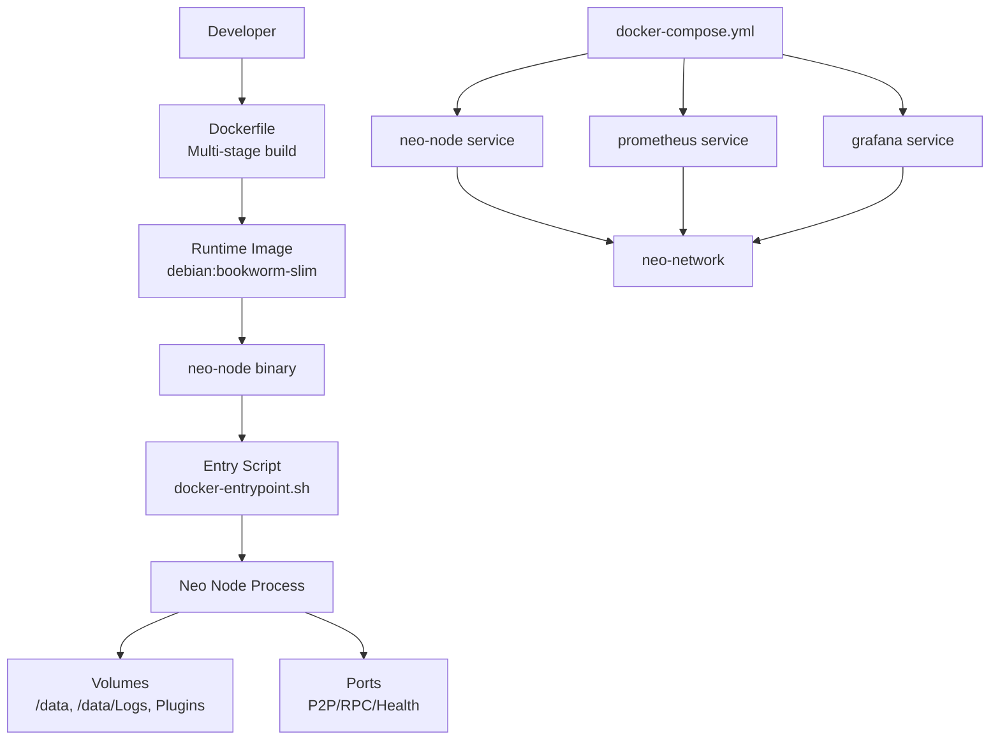
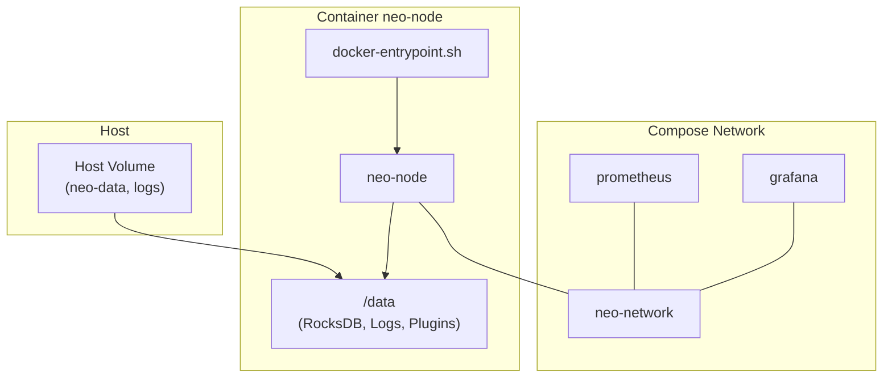
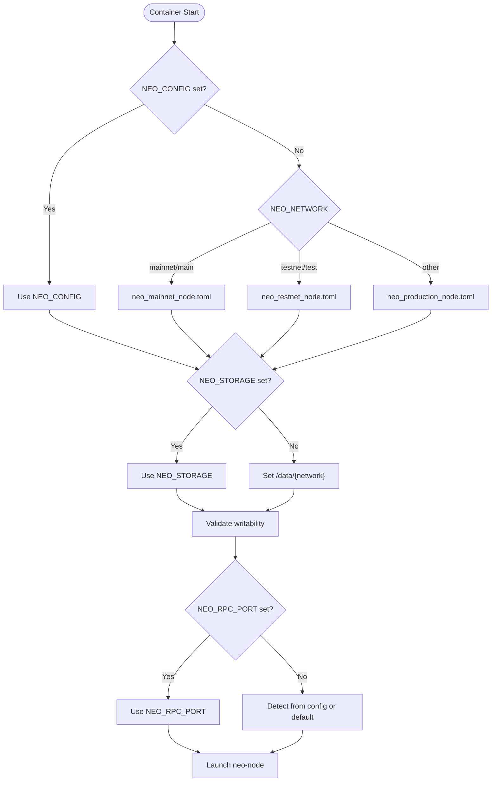
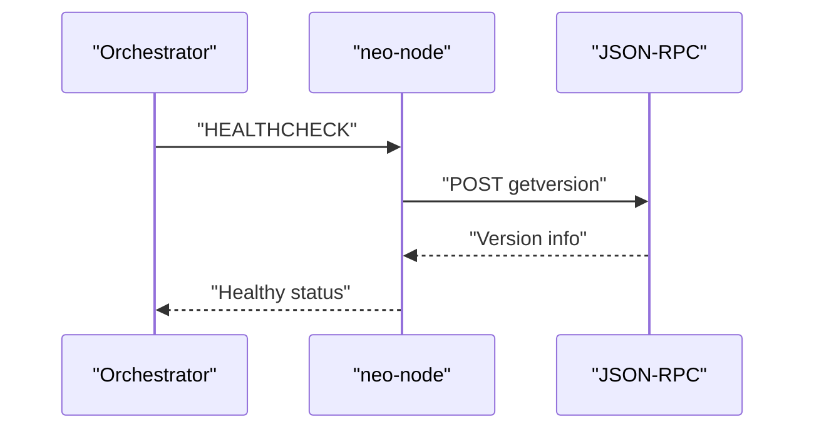
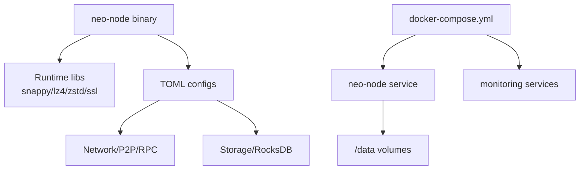

# Container Deployment

<cite>
**Referenced Files in This Document**
- [Dockerfile](file://Dockerfile)
- [docker-compose.yml](file://docker-compose.yml)
- [scripts/docker-entrypoint.sh](file://scripts/docker-entrypoint.sh)
- [neo_mainnet_node.toml](file://neo_mainnet_node.toml)
- [neo_testnet_node.toml](file://neo_testnet_node.toml)
- [neo_production_node.toml](file://neo_production_node.toml)
- [Makefile](file://Makefile)
- [docs/DEPLOYMENT.md](file://docs/DEPLOYMENT.md)
- [SECURITY.md](file://SECURITY.md)
</cite>

## Table of Contents
1. Introduction
2. Project Structure
3. Core Components
4. Architecture Overview
5. Detailed Component Analysis
6. Dependency Analysis
7. Performance Considerations
8. Troubleshooting Guide
9. Conclusion
10. Appendices

## Introduction
This document provides comprehensive container deployment guidance for Neo-RS using Docker and Docker Compose. It covers the multi-stage build process, image optimization techniques, security hardening, environment variables, volume strategies, persistent storage, orchestration across development/testing/production, health checks, resource limits, monitoring integration, networking, port mapping, inter-service communication, horizontal scaling, and lifecycle management.

## Project Structure
The containerization artifacts are centered around:
- A multi-stage Dockerfile that builds a minimal runtime image with only necessary dependencies and binaries.
- A docker-compose.yml that orchestrates the node and optional monitoring services (Prometheus and Grafana).
- An entrypoint script that selects configuration, prepares directories, validates permissions, resolves ports, and launches the node.
- Bundled TOML configurations for mainnet, testnet, and production profiles.
- Make targets to simplify building images, running containers, and managing compose stacks.

**Diagram sources**
- [Dockerfile:1-129](file://Dockerfile#L1-L129)
- [docker-compose.yml:1-183](file://docker-compose.yml#L1-L183)
- [scripts/docker-entrypoint.sh:1-111](file://scripts/docker-entrypoint.sh#L1-L111)

**Section sources**
- [Dockerfile:1-129](file://Dockerfile#L1-L129)
- [docker-compose.yml:1-183](file://docker-compose.yml#L1-L183)
- [scripts/docker-entrypoint.sh:1-111](file://scripts/docker-entrypoint.sh#L1-L111)
- [Makefile:133-168](file://Makefile#L133-L168)
- [Makefile:298-323](file://Makefile#L298-L323)

## Core Components
- Multi-stage Dockerfile:
  - Builder stage installs Rust toolchain and system libraries required to compile the node with RocksDB and compression features.
  - Runtime stage uses a slim Debian base, installs only runtime libraries, creates a non-root user, sets up data directories, copies the built binary, bundled configs, and entrypoint, exposes ports, defines a health check, and sets default environment variables.
- Entry script:
  - Selects config based on NEO_NETWORK or explicit NEO_CONFIG.
  - Derives storage path per network if not provided.
  - Ensures writable storage and plugins directories.
  - Detects RPC port from config or defaults; writes it to a temp file for health checks.
  - Launches neo-node with resolved arguments.
- docker-compose.yml:
  - Defines neo-node with volumes, environment, healthcheck, resource limits, security options, ulimits, logging, and networking.
  - Optional monitoring stack (Prometheus and Grafana) under a profile.
- Configuration files:
  - Mainnet, testnet, and production profiles define network, storage, P2P, RPC, telemetry, logging, and other settings.

**Section sources**
- [Dockerfile:4-119](file://Dockerfile#L4-L119)
- [scripts/docker-entrypoint.sh:7-111](file://scripts/docker-entrypoint.sh#L7-L111)
- [docker-compose.yml:4-113](file://docker-compose.yml#L4-L113)
- [neo_mainnet_node.toml:1-67](file://neo_mainnet_node.toml#L1-L67)
- [neo_testnet_node.toml:1-96](file://neo_testnet_node.toml#L1-L96)
- [neo_production_node.toml:1-61](file://neo_production_node.toml#L1-L61)

## Architecture Overview
The containerized architecture runs a single Neo node process inside a hardened, read-only filesystem with minimal privileges. Persistent data is stored in mounted volumes. Health checks probe the JSON-RPC endpoint. Optional Prometheus scrapes metrics and Grafana visualizes them.

**Diagram sources**
- [docker-compose.yml:27-113](file://docker-compose.yml#L27-L113)
- [Dockerfile:74-119](file://Dockerfile#L74-L119)
- [scripts/docker-entrypoint.sh:73-111](file://scripts/docker-entrypoint.sh#L73-L111)

## Detailed Component Analysis

### Multi-stage Build and Image Optimization
- Builder stage:
  - Uses rust:1.88-bookworm to compile the workspace with full features required by shipped configurations.
  - Installs build-time dependencies including LLVM/Clang and compression libraries.
  - Copies manifests and all crates explicitly to maximize layer caching.
  - Builds release binary for neo-node.
- Runtime stage:
  - Uses debian:bookworm-slim to minimize attack surface and image size.
  - Installs only runtime libraries needed by RocksDB and TLS.
  - Creates a dedicated non-root user and restricts filesystem access.
  - Copies only the final binary, configs, and entrypoint.
  - Declares VOLUME for /data to persist blockchain state.
  - Exposes standard P2P and RPC ports for each supported network.
  - Adds HEALTHCHECK probing the JSON-RPC getversion method.
  - Sets default environment variables for network, backend, plugins directory, and log level.

Optimization highlights:
- Explicit crate copying improves cache reuse when source changes.
- Slim runtime base reduces image footprint and vulnerabilities.
- Non-root execution and read-only root filesystem reduce privilege escalation risk.
- Minimal runtime dependencies limit exposure.

**Section sources**
- [Dockerfile:4-57](file://Dockerfile#L4-L57)
- [Dockerfile:59-119](file://Dockerfile#L59-L119)

### Security Hardening Practices
- Non-root user: The runtime stage creates and switches to a dedicated neo user.
- Read-only root filesystem: Enforced via compose to prevent runtime modifications.
- no-new-privileges: Prevents gaining additional privileges inside the container.
- tmpfs for /tmp: Limits executable code in memory and caps size.
- Ulimits: Raise file descriptors and process limits while capping resources.
- Logging rotation: Configured to avoid unbounded log growth.
- Secrets handling: Use environment variables or external secret managers for RPC credentials; avoid baking secrets into images.

**Section sources**
- [Dockerfile:74-98](file://Dockerfile#L74-L98)
- [docker-compose.yml:66-113](file://docker-compose.yml#L66-L113)
- [SECURITY.md:1-16](file://SECURITY.md#L1-L16)

### Environment Variables and Configuration Resolution
Key variables:
- NEO_NETWORK: Chooses bundled config and default storage path.
- NEO_CONFIG: Overrides config file path.
- NEO_STORAGE: Overrides storage directory.
- NEO_BACKEND: Storage backend selection.
- NEO_PLUGINS_DIR: Directory for plugin configurations.
- NEO_RPC_PORT: Override RPC port; auto-detected if omitted.
- NEO_LISTEN_PORT: Override P2P listen port.
- RUST_LOG: Controls log verbosity.
- NEO_RPC_USER/NEO_RPC_PASS: Optional RPC authentication.

Resolution flow:
- Entry script determines config based on NEO_NETWORK or NEO_CONFIG.
- Defaults storage path per network if not set.
- Validates write access to storage and plugins directories.
- Detects RPC port from config or falls back to defaults.
- Writes detected RPC port to a temp file for health checks.
- Launches neo-node with resolved arguments.

**Diagram sources**
- [scripts/docker-entrypoint.sh:7-111](file://scripts/docker-entrypoint.sh#L7-L111)

**Section sources**
- [scripts/docker-entrypoint.sh:7-111](file://scripts/docker-entrypoint.sh#L7-L111)
- [neo_mainnet_node.toml:1-67](file://neo_mainnet_node.toml#L1-L67)
- [neo_testnet_node.toml:1-96](file://neo_testnet_node.toml#L1-L96)
- [neo_production_node.toml:1-61](file://neo_production_node.toml#L1-L61)

### Volume Mounting and Persistent Storage
- Primary data volume:
  - /data is declared as a Docker volume and mounted at runtime.
  - Contains blockchain data (RocksDB), logs, and plugins.
- Recommended structure:
  - /data/mainnet or /data/testnet depending on network.
  - /data/Plugins for plugin configurations.
  - /data/Logs for log files.
- Bind mounts:
  - Optional host paths for custom config and logs can be bind-mounted read-only or read-write as needed.
- Permissions:
  - Entry script ensures storage and plugins directories are writable by the neo user.

Operational tips:
- Use named volumes for managed persistence.
- Back up /data regularly; consider snapshotting RocksDB with provided scripts.
- Ensure host filesystem supports high IOPS for RocksDB performance.

**Section sources**
- [Dockerfile:78-92](file://Dockerfile#L78-L92)
- [docker-compose.yml:27-35](file://docker-compose.yml#L27-L35)
- [scripts/docker-entrypoint.sh:73-86](file://scripts/docker-entrypoint.sh#L73-L86)
- [Makefile:259-265](file://Makefile#L259-L265)

### Health Checks and Monitoring Integration
- Built-in health check:
  - Probes JSON-RPC getversion on the resolved RPC port.
  - Supports start period, interval, timeout, and retries.
- Compose healthcheck:
  - Mirrors container health check logic for orchestration readiness.
- Metrics and dashboards:
  - Optional Prometheus service scrapes metrics endpoints.
  - Grafana service provides dashboards and alerting.
  - Both are enabled via the monitoring profile.

**Diagram sources**
- [Dockerfile:107-109](file://Dockerfile#L107-L109)
- [docker-compose.yml:52-64](file://docker-compose.yml#L52-L64)

**Section sources**
- [Dockerfile:107-109](file://Dockerfile#L107-L109)
- [docker-compose.yml:52-64](file://docker-compose.yml#L52-L64)
- [docker-compose.yml:115-165](file://docker-compose.yml#L115-L165)

### Networking, Port Mapping, and Inter-Service Communication
- Ports exposed by the image:
  - TestNet: P2P 20333, RPC 20332.
  - MainNet: P2P 10333, RPC 10332.
  - Private networks: 30332/30333.
- Port mapping in compose:
  - Maps both testnet and mainnet ports to host for flexibility.
  - Health/metrics port configurable via NEO_HEALTH_PORT.
- Internal networking:
  - All services connect via neo-network bridge.
  - Prometheus and Grafana depend on neo-node for metrics.

Best practices:
- Restrict RPC bind address to localhost unless exposing externally.
- Use reverse proxy or firewall rules to control external access.
- For multi-node setups, ensure seed nodes and P2P ports are reachable.

**Section sources**
- [Dockerfile:99-105](file://Dockerfile#L99-L105)
- [docker-compose.yml:14-25](file://docker-compose.yml#L14-L25)
- [docker-compose.yml:90-92](file://docker-compose.yml#L90-L92)
- [neo_testnet_node.toml:17-20](file://neo_testnet_node.toml#L17-L20)
- [neo_mainnet_node.toml:13-15](file://neo_mainnet_node.toml#L13-L15)

### Resource Limits and Production Tuning
- CPU and memory:
  - Limits and reservations configured via deploy.resources.
  - Adjust based on workload and hardware.
- Ulimits:
  - Increase file descriptors and process limits for high concurrency.
- Logging:
  - JSON file driver with size and file count limits to manage disk usage.
- Read-only filesystem:
  - Reduces attack surface; use tmpfs for temporary writes.

**Section sources**
- [docker-compose.yml:66-113](file://docker-compose.yml#L66-L113)

### Development, Testing, and Production Orchestration
- Development:
  - Use testnet configuration and lower resource limits.
  - Enable verbose logging for debugging.
- Testing:
  - Isolated volumes per test run to avoid cross-test contamination.
  - Use short-lived containers and automated teardown.
- Production:
  - Use mainnet or production config with hardened RPC settings.
  - Enable metrics and integrate with centralized logging and alerting.
  - Apply strict resource limits and security policies.

Convenience commands:
- Build image and run container via Make targets.
- Start/stop compose stack and monitoring profile.

**Section sources**
- [Makefile:133-168](file://Makefile#L133-L168)
- [Makefile:298-323](file://Makefile#L298-L323)
- [docs/DEPLOYMENT.md:408-563](file://docs/DEPLOYMENT.md#L408-L563)

### Horizontal Scaling and Lifecycle Management
- Horizontal scaling:
  - Run multiple neo-node instances behind a load balancer for RPC reads.
  - Each instance maintains its own blockchain data volume.
  - Ensure P2P connectivity and seed nodes are properly configured.
- Lifecycle management:
  - Use orchestrators (e.g., Kubernetes) to manage rolling updates and restarts.
  - Leverage health checks for readiness and liveness probes.
  - Implement graceful shutdown hooks to flush state and close connections.
- Backup and restore:
  - Snapshot RocksDB periodically using provided scripts.
  - Restore from backups during upgrades or disaster recovery.

[No sources needed since this section provides general operational guidance]

## Dependency Analysis
The container stack depends on:
- Neo node binary compiled with full features.
- System libraries for RocksDB and TLS at runtime.
- Compose services for monitoring (optional).
- Volumes for persistent data and logs.

**Diagram sources**
- [Dockerfile:61-72](file://Dockerfile#L61-L72)
- [Dockerfile:81-89](file://Dockerfile#L81-L89)
- [docker-compose.yml:27-113](file://docker-compose.yml#L27-L113)

**Section sources**
- [Dockerfile:61-72](file://Dockerfile#L61-L72)
- [docker-compose.yml:27-113](file://docker-compose.yml#L27-L113)

## Performance Considerations
- Use fast, durable storage (NVMe SSD) for RocksDB.
- Tune RocksDB parameters in TOML (cache sizes, write buffers, open files).
- Limit excessive logging levels in production to reduce I/O overhead.
- Allocate sufficient CPU and memory for consensus and RPC workloads.
- Monitor metrics and adjust resource limits based on observed utilization.

[No sources needed since this section provides general guidance]

## Troubleshooting Guide
Common issues and resolutions:
- Config not found:
  - Ensure NEO_CONFIG points to a valid TOML file or NEO_NETWORK matches a bundled config.
- Storage not writable:
  - Verify volume permissions for the neo user; entry script checks writability at startup.
- RPC port conflicts:
  - Set NEO_RPC_PORT explicitly or adjust host port mappings.
- Health check failures:
  - Confirm RPC is listening on expected port; check logs for binding errors.
- High disk usage:
  - Rotate logs and review retention settings; consider offloading logs.

Operational checks:
- Use Make targets to validate configuration and storage without starting the node.
- Inspect container health status and logs.

**Section sources**
- [scripts/docker-entrypoint.sh:68-86](file://scripts/docker-entrypoint.sh#L68-L86)
- [Makefile:206-225](file://Makefile#L206-L225)
- [docs/DEPLOYMENT.md:549-563](file://docs/DEPLOYMENT.md#L549-L563)

## Conclusion
Neo-RS containerization provides a secure, efficient, and scalable deployment model. The multi-stage build produces a minimal runtime image, while Docker Compose simplifies orchestration and monitoring integration. By leveraging environment-driven configuration, robust health checks, resource limits, and persistent volumes, operators can reliably run Neo nodes across development, testing, and production environments.

[No sources needed since this section summarizes without analyzing specific files]

## Appendices

### Quick Start with Docker Compose
- Build and start the node:
  - Use Make targets to build the image and start the compose stack.
- Access RPC:
  - Connect to mapped RPC port based on selected network.
- Enable monitoring:
  - Start the monitoring profile to bring up Prometheus and Grafana.

**Section sources**
- [Makefile:298-323](file://Makefile#L298-L323)
- [docker-compose.yml:115-165](file://docker-compose.yml#L115-L165)