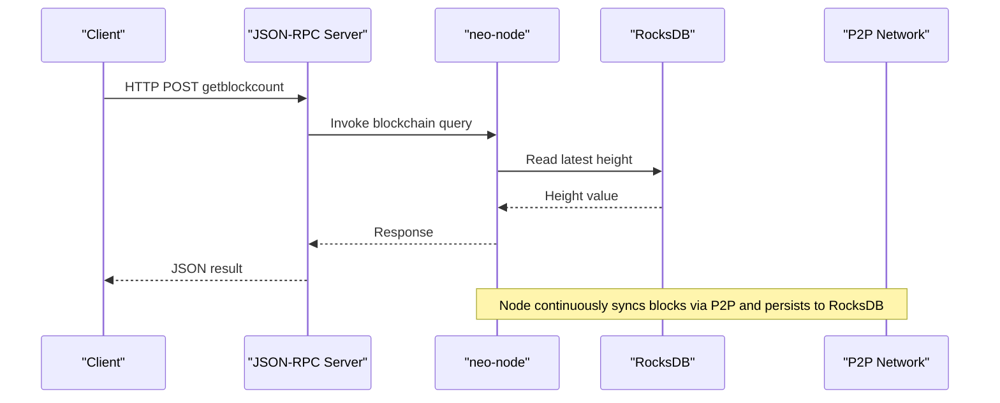
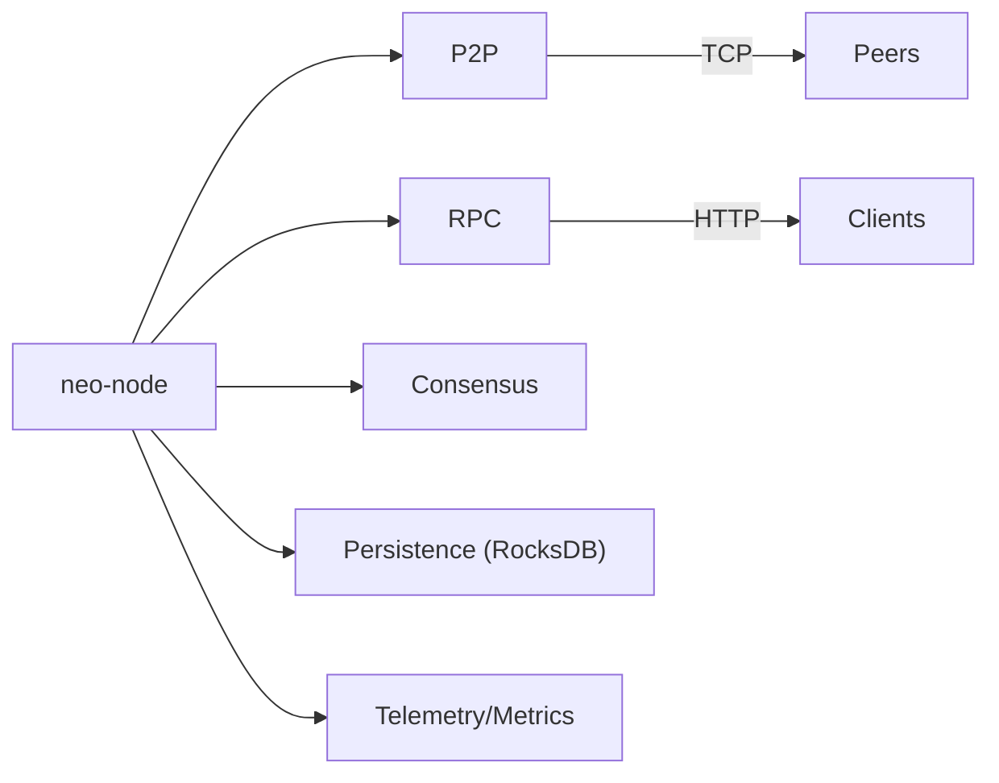
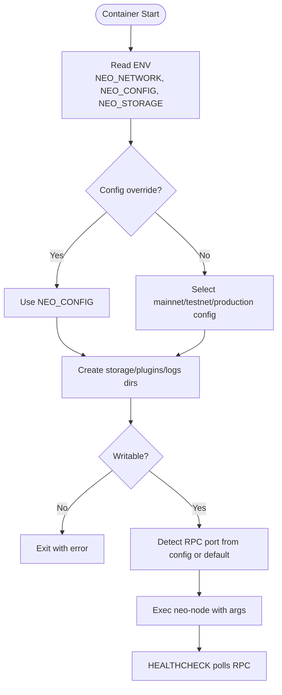

# Deployment & Production

<cite>
**Referenced Files in This Document**
- [DEPLOYMENT.md](file://docs/DEPLOYMENT.md)
- [OPERATIONS.md](file://docs/OPERATIONS.md)
- [MONITORING.md](file://docs/MONITORING.md)
- [SECURITY.md](file://docs/SECURITY.md)
- [Dockerfile](file://Dockerfile)
- [docker-compose.yml](file://docker-compose.yml)
- [neo_mainnet_node.toml](file://neo_mainnet_node.toml)
- [neo_testnet_node.toml](file://neo_testnet_node.toml)
- [neo_production_node.toml](file://neo_production_node.toml)
- [config/mainnet.toml](file://config/mainnet.toml)
- [scripts/docker-entrypoint.sh](file://scripts/docker-entrypoint.sh)
- [scripts/backup-rocksdb.sh](file://scripts/backup-rocksdb.sh)
- [scripts/checkpoint-live-rocksdb.sh](file://scripts/checkpoint-live-rocksdb.sh)
- [scripts/neo_node_watchdog.sh](file://scripts/neo_node_watchdog.sh)
</cite>

## Table of Contents
1. Introduction
2. Project Structure
3. Core Components
4. Architecture Overview
5. Detailed Component Analysis
6. Dependency Analysis
7. Performance Considerations
8. Troubleshooting Guide
9. Conclusion
10. Appendices

## Introduction
This document provides production-grade deployment and operations guidance for Neo-RS across bare metal, virtual machines, Docker, and Kubernetes-like environments. It covers infrastructure requirements, resource allocation, performance tuning, network configuration, security hardening, backup and disaster recovery, high availability patterns, load balancing considerations, monitoring and alerting, log aggregation, automation scripts, configuration management templates, and safe rollback procedures.

## Project Structure
Neo-RS ships with:
- Production-ready TOML configurations for MainNet, TestNet, and hardened production profiles
- A multi-stage Docker image and a docker-compose stack including optional Prometheus and Grafana
- An entrypoint script that selects config, storage paths, and ports based on environment
- Operational helpers for backups, live checkpoints, and watchdog-style restarts
- Documentation covering deployment, operations, monitoring, and security

```mermaid
graph TB
subgraph "Host"
A["Systemd / Container Runtime"]
B["neo-node process"]
C["RocksDB data directory"]
D["Logs"]
end
subgraph "Networking"
E["P2P port (e.g., 10333/20333)"]
F["RPC port (e.g., 10332/20332)"]
G["Health/metrics port (optional)"]
end
A --> B
B --> C
B --> D
B < --> E
B < --> F
B < --> G
```

**Diagram sources**
- [Dockerfile:100-118](file://Dockerfile#L100-L118)
- [docker-compose.yml:14-50](file://docker-compose.yml#L14-L50)
- [neo_mainnet_node.toml:12-36](file://neo_mainnet_node.toml#L12-L36)
- [neo_testnet_node.toml:17-71](file://neo_testnet_node.toml#L17-L71)

**Section sources**
- [DEPLOYMENT.md:243-405](file://docs/DEPLOYMENT.md#L243-L405)
- [Dockerfile:1-129](file://Dockerfile#L1-L129)
- [docker-compose.yml:1-183](file://docker-compose.yml#L1-L183)
- [neo_mainnet_node.toml:1-67](file://neo_mainnet_node.toml#L1-L67)
- [neo_testnet_node.toml:1-96](file://neo_testnet_node.toml#L1-L96)
- [neo_production_node.toml:1-61](file://neo_production_node.toml#L1-L61)
- [config/mainnet.toml:1-68](file://config/mainnet.toml#L1-L68)

## Core Components
- Node binary and runtime: neo-node, built with release or production profile; supports TEE/HSM features via feature flags
- Configuration: TOML files plus environment variable overrides; bundled configs for mainnet/testnet/production
- Storage: RocksDB-backed persistence with recommended fast SSD/NVMe; import and checkpoint helpers
- Networking: P2P and JSON-RPC endpoints; health and metrics endpoints when enabled
- Containers: Multi-stage Docker image, compose stack with optional monitoring
- Operations: Backup, live checkpoint, watchdog, continuous state-root validation

**Section sources**
- [DEPLOYMENT.md:100-240](file://docs/DEPLOYMENT.md#L100-L240)
- [DEPLOYMENT.md:243-405](file://docs/DEPLOYMENT.md#L243-L405)
- [DEPLOYMENT.md:566-718](file://docs/DEPLOYMENT.md#L566-L718)
- [OPERATIONS.md:17-67](file://docs/OPERATIONS.md#L17-L67)
- [MONITORING.md:1-36](file://docs/MONITORING.md#L1-L36)

## Architecture Overview
The node exposes:
- P2P interface for block/transaction sync and peer discovery
- JSON-RPC server for client queries and admin operations
- Optional health/metrics endpoints for orchestration and observability
- Persistent storage via RocksDB



**Diagram sources**
- [neo_mainnet_node.toml:12-36](file://neo_mainnet_node.toml#L12-L36)
- [neo_testnet_node.toml:17-71](file://neo_testnet_node.toml#L17-L71)
- [Dockerfile:100-118](file://Dockerfile#L100-L118)

## Detailed Component Analysis

### Bare Metal and VM Deployment
- Build the release or production binary using Cargo
- Use systemd to manage the service with resource limits, read-only root where possible, and restricted privileges
- Configure TOML settings per network; enable auth and disable risky methods in production
- Expose only necessary ports behind a firewall or reverse proxy

Key operational notes:
- Health endpoints: enable with --health-port and set header lag threshold
- Logging: configure file rotation and path
- Storage: ensure sufficient IOPS and free space; avoid ephemeral disks

**Section sources**
- [DEPLOYMENT.md:100-240](file://docs/DEPLOYMENT.md#L100-L240)
- [DEPLOYMENT.md:566-718](file://docs/DEPLOYMENT.md#L566-L718)
- [neo_production_node.toml:26-53](file://neo_production_node.toml#L26-L53)

### Docker Deployment
- Image build uses multi-stage builds; runtime stage is minimal Debian slim with required libraries
- Entrypoint selects config and storage based on NEO_NETWORK and allows overrides
- Volumes persist blockchain data and logs; health check probes RPC
- Compose includes optional Prometheus and Grafana under a monitoring profile

Operational tips:
- Map appropriate ports for your network
- Mount persistent volumes for data and logs
- Set environment variables for secrets and tuning
- Use read-only root filesystem and tmpfs for writable areas

**Section sources**
- [Dockerfile:1-129](file://Dockerfile#L1-L129)
- [scripts/docker-entrypoint.sh:1-111](file://scripts/docker-entrypoint.sh#L1-L111)
- [docker-compose.yml:1-183](file://docker-compose.yml#L1-L183)

### Kubernetes-like Orchestration
While explicit manifests are not included, the containerized design enables straightforward adaptation:
- Deploy the provided image with a Deployment/StatefulSet
- Expose P2P and RPC services; consider headless service for P2P
- Mount persistent volumes for data and logs
- Configure liveness/readiness probes using the same RPC-based checks used by Docker
- Apply resource requests/limits and security contexts similar to compose

Guidance derived from existing artifacts:
- Ports and health checks mirror those in Dockerfile and compose
- Environment-driven configuration aligns with entrypoint behavior

**Section sources**
- [Dockerfile:100-118](file://Dockerfile#L100-L118)
- [docker-compose.yml:52-75](file://docker-compose.yml#L52-L75)
- [scripts/docker-entrypoint.sh:31-99](file://scripts/docker-entrypoint.sh#L31-L99)

### Infrastructure Requirements and Resource Allocation
- CPU/RAM/storage recommendations vary by role (basic node, RPC-enabled, consensus)
- Prefer NVMe SSD for RocksDB; maintain free disk space and monitor inode usage
- Tune ulimits for open files and processes; ensure adequate memory lock settings in containers

**Section sources**
- [DEPLOYMENT.md:721-773](file://docs/DEPLOYMENT.md#L721-L773)
- [docker-compose.yml:66-104](file://docker-compose.yml#L66-L104)

### Performance Tuning
- Use production profile builds for LTO and optimized codegen
- Tune RocksDB parameters (cache, write buffer, compression) in TOML for workload
- Adjust mempool and p2p connection limits according to capacity
- Enable compression for P2P traffic where applicable
- For import-heavy workloads, use batch profiles and flush intervals

**Section sources**
- [DEPLOYMENT.md:121-138](file://docs/DEPLOYMENT.md#L121-L138)
- [neo_testnet_node.toml:8-16](file://neo_testnet_node.toml#L8-L16)
- [neo_testnet_node.toml:57-61](file://neo_testnet_node.toml#L57-L61)
- [OPERATIONS.md:39-43](file://docs/OPERATIONS.md#L39-L43)

### Network Configuration and Firewall Setup
- Open P2P and RPC ports as needed; bind RPC to localhost unless proxied
- Disable CORS and enforce authentication for RPC in production
- Use seed nodes appropriate for the target network
- Consider rate limiting and method filtering at a reverse proxy layer

**Section sources**
- [neo_mainnet_node.toml:12-36](file://neo_mainnet_node.toml#L12-L36)
- [neo_testnet_node.toml:17-71](file://neo_testnet_node.toml#L17-L71)
- [neo_production_node.toml:26-36](file://neo_production_node.toml#L26-L36)

### Security Hardening
- Harden RPC: enable auth, disable risky methods, restrict CORS
- Enforce least privilege in systemd or containers; read-only filesystem where possible
- Use strict TEE mode if deploying with SGX; otherwise run ordinary mode
- Validate configuration before starting; fail fast on invalid settings

**Section sources**
- [SECURITY.md:10-13](file://docs/SECURITY.md#L10-L13)
- [SECURITY.md:314-318](file://docs/SECURITY.md#L314-L318)
- [neo_production_node.toml:26-36](file://neo_production_node.toml#L26-L36)
- [DEPLOYMENT.md:635-640](file://docs/DEPLOYMENT.md#L635-L640)

### Backup and Disaster Recovery
- Stop the node, snapshot RocksDB directory, then resume
- Use helper scripts for tar-based backups and live checkpoints with writer pause/resume
- Restore by replacing data directory and restarting; verify version markers and permissions
- Maintain offsite copies and test restores regularly

**Section sources**
- [OPERATIONS.md:17-28](file://docs/OPERATIONS.md#L17-L28)
- [scripts/backup-rocksdb.sh:1-30](file://scripts/backup-rocksdb.sh#L1-L30)
- [scripts/checkpoint-live-rocksdb.sh:1-78](file://scripts/checkpoint-live-rocksdb.sh#L1-L78)

### High Availability and Load Balancing
- Run multiple independent nodes per region; do not share RocksDB directories
- Place a reverse proxy in front of RPC for TLS termination, rate limiting, and auth
- Distribute clients across multiple RPC endpoints; avoid single points of failure
- For consensus participation, ensure low-latency connectivity among validators

[No sources needed since this section provides general guidance]

### Monitoring and Alerting
- Expose health endpoints (/healthz, /readyz) and metrics when enabled
- Scrape RPC metrics periodically; track height lag, peers, mempool, disk, FDs
- Integrate with Prometheus/Grafana via compose profile or external setup
- Define alerts for sync lag, peer count drops, disk pressure, and restart loops

**Section sources**
- [MONITORING.md:1-36](file://docs/MONITORING.md#L1-L36)
- [DEPLOYMENT.md:642-718](file://docs/DEPLOYMENT.md#L642-L718)
- [docker-compose.yml:115-183](file://docker-compose.yml#L115-L183)

### Log Aggregation
- Configure log file path, level, format, rotation size, and retention
- Ship logs to centralized logging systems; tag by service/environment
- Use structured JSON logs for easier parsing and querying

**Section sources**
- [neo_production_node.toml:48-53](file://neo_production_node.toml#L48-L53)
- [neo_mainnet_node.toml:49-54](file://neo_mainnet_node.toml#L49-L54)
- [neo_testnet_node.toml:83-88](file://neo_testnet_node.toml#L83-L88)

### Automation Scripts and Configuration Management
- Entrypoint selects config and storage based on environment; validates writability
- Watchdog script monitors RPC progress and restarts stalled nodes
- Continuous state-root validation scripts compare local roots against official seeds
- Pre-flight checks validate config and storage without starting the node

**Section sources**
- [scripts/docker-entrypoint.sh:1-111](file://scripts/docker-entrypoint.sh#L1-L111)
- [scripts/neo_node_watchdog.sh:1-125](file://scripts/neo_node_watchdog.sh#L1-L125)
- [OPERATIONS.md:53-61](file://docs/OPERATIONS.md#L53-L61)
- [OPERATIONS.md:35-38](file://docs/OPERATIONS.md#L35-L38)

### Rollback Procedures
- Keep previous binaries and known-good backups accessible
- On upgrade failure, stop the node, restore from last good backup, and restart
- Validate configuration and storage preflight before rolling forward again
- For containerized deployments, roll back to prior image tag and re-run compose

**Section sources**
- [DEPLOYMENT.md:776-800](file://docs/DEPLOYMENT.md#L776-L800)
- [OPERATIONS.md:120-124](file://docs/OPERATIONS.md#L120-L124)

## Dependency Analysis
Neo-RS components interact through well-defined boundaries:
- neo-node orchestrates networking, RPC, consensus, and persistence
- Storage backend (RocksDB) provides durable state
- Telemetry and monitoring expose metrics and health
- Docker/compose encapsulate runtime dependencies and expose standardized interfaces



**Diagram sources**
- [neo_mainnet_node.toml:12-36](file://neo_mainnet_node.toml#L12-L36)
- [neo_testnet_node.toml:17-71](file://neo_testnet_node.toml#L17-L71)
- [neo_production_node.toml:42-46](file://neo_production_node.toml#L42-L46)

**Section sources**
- [neo_mainnet_node.toml:1-67](file://neo_mainnet_node.toml#L1-L67)
- [neo_testnet_node.toml:1-96](file://neo_testnet_node.toml#L1-L96)
- [neo_production_node.toml:1-61](file://neo_production_node.toml#L1-L61)

## Performance Considerations
- Use production profile builds for maximum optimization
- Tune RocksDB cache, buffers, and compression for workload characteristics
- Limit and tune P2P connections and mempool sizes based on capacity
- Ensure fast, durable storage and adequate free space
- Monitor and alert on resource saturation (CPU, RAM, disk I/O, FDs)

[No sources needed since this section provides general guidance]

## Troubleshooting Guide
Common issues and resolutions:
- Startup fails due to storage permissions or RocksDB open errors: verify paths, ownership, and disk space
- ContractManagement integrity error: restore from backup or resync from clean storage
- RPC overload: move RPC to dedicated instance and add rate limiting
- Disk full: expand volume, prune logs/backups, keep RocksDB on fast storage
- Sync stalls: check peers and ports; restart if necessary; use watchdog to auto-recover

**Section sources**
- [OPERATIONS.md:17-67](file://docs/OPERATIONS.md#L17-L67)
- [OPERATIONS.md:113-118](file://docs/OPERATIONS.md#L113-L118)

## Conclusion
Neo-RS provides robust, production-ready building blocks for deploying a secure, observable, and resilient Neo N3 node. By combining hardened configurations, containerization, automated backups, and comprehensive monitoring, operators can deploy confidently across bare metal, VMs, and orchestrated environments while maintaining safety and performance.

[No sources needed since this section summarizes without analyzing specific files]

## Appendices

### Configuration Templates Summary
- MainNet: default ports, seed list, RPC auth disabled in sample; adjust for production
- TestNet: development-friendly defaults with more seeds and relaxed CORS
- Production: hardened RPC, metrics disabled by default, conservative logging

**Section sources**
- [neo_mainnet_node.toml:1-67](file://neo_mainnet_node.toml#L1-L67)
- [neo_testnet_node.toml:1-96](file://neo_testnet_node.toml#L1-L96)
- [neo_production_node.toml:1-61](file://neo_production_node.toml#L1-L61)
- [config/mainnet.toml:1-68](file://config/mainnet.toml#L1-L68)

### Container Entry and Health Flow


**Diagram sources**
- [scripts/docker-entrypoint.sh:31-99](file://scripts/docker-entrypoint.sh#L31-L99)
- [Dockerfile:107-118](file://Dockerfile#L107-L118)