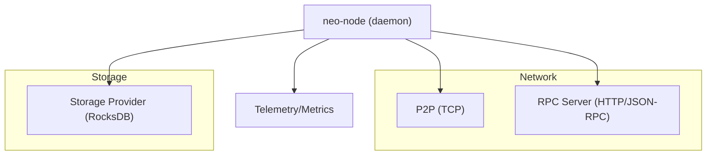
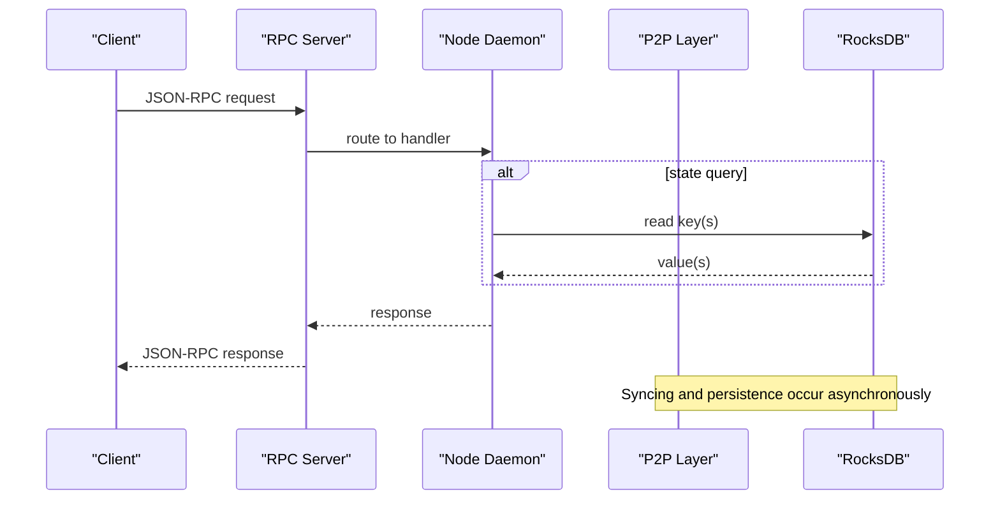
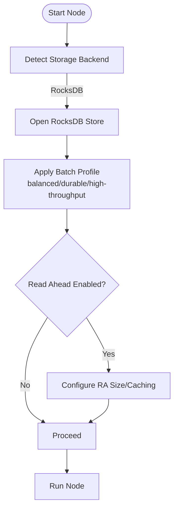
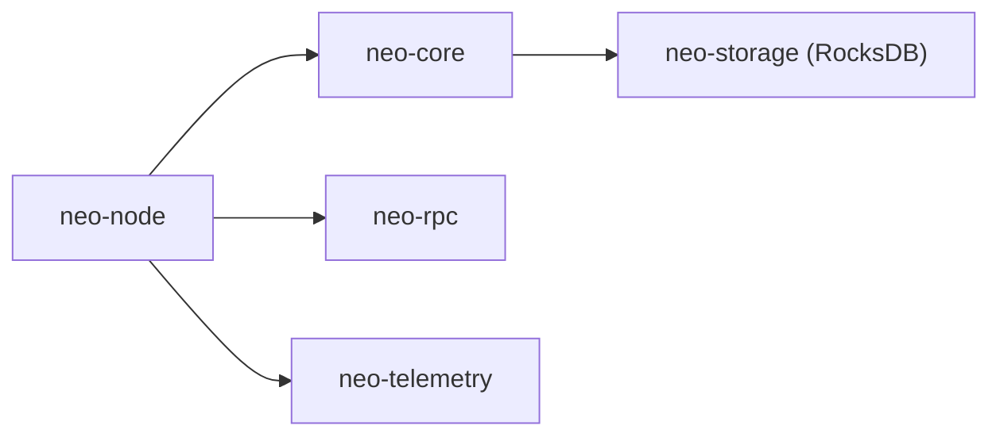

# Infrastructure Requirements

<cite>
**Referenced Files in This Document**
- [README.md](file://README.md)
- [DEPLOYMENT.md](file://docs/DEPLOYMENT.md)
- [OPERATIONS.md](file://docs/OPERATIONS.md)
- [neo_mainnet_node.toml](file://neo_mainnet_node.toml)
- [mainnet.toml](file://config/mainnet.toml)
- [testnet.toml](file://config/testnet.toml)
- [neo_production_node.toml](file://neo_production_node.toml)
- [docker-compose.yml](file://docker-compose.yml)
- [provider.rs](file://neo-core/src/persistence/providers/rocksdb/provider.rs)
- [config.rs](file://neo-node/src/startup/config.rs)
- [node_config.rs](file://neo-node/src/config/node_config.rs)
- [limits.rs](file://neo-vm/src/vm/limits.rs)
</cite>

## Table of Contents
1. [Introduction](#introduction)
2. [Project Structure](#project-structure)
3. [Core Components](#core-components)
4. [Architecture Overview](#architecture-overview)
5. [Detailed Component Analysis](#detailed-component-analysis)
6. [Dependency Analysis](#dependency-analysis)
7. [Performance Considerations](#performance-considerations)
8. [Troubleshooting Guide](#troubleshooting-guide)
9. [Conclusion](#conclusion)
10. [Appendices](#appendices)

## Introduction
This document specifies infrastructure requirements for production deployments of Neo-RS nodes, including hardware sizing, supported operating systems, system dependencies, storage and RocksDB considerations, memory and file descriptor limits, kernel tuning guidance, firewall and port requirements, and network topology recommendations. It consolidates configuration defaults and operational notes from the repository to help operators plan capacity, security, and reliability for full nodes, validators (consensus nodes), and RPC endpoints.

## Project Structure
Neo-RS is a modular Rust implementation with a node daemon exposing P2P synchronization and an optional JSON-RPC server. Production configurations are provided as TOML files, and deployment aids include Docker Compose and systemd service examples. Key directories:
- config/: bundled TOML profiles for mainnet, testnet, and production templates
- neo-node/: node daemon entrypoints, configuration parsing, startup validation, and health/metrics
- neo-core/: core blockchain logic, persistence providers (including RocksDB), and networking
- docs/: deployment, operations, monitoring, and security guides

**Diagram sources**
- [neo_mainnet_node.toml:13-37](file://neo_mainnet_node.toml#L13-L37)
- [neo_production_node.toml:12-36](file://neo_production_node.toml#L12-L36)
- [provider.rs:106-131](file://neo-core/src/persistence/providers/rocksdb/provider.rs#L106-L131)

**Section sources**
- [README.md:19-67](file://README.md#L19-L67)
- [neo_mainnet_node.toml:1-67](file://neo_mainnet_node.toml#L1-L67)
- [neo_production_node.toml:1-61](file://neo_production_node.toml#L1-L61)

## Core Components
- Node daemon: orchestrates P2P sync, optional consensus participation, and RPC server.
- Storage backend: RocksDB is the default and recommended backend for production; read-ahead and batch commit profiles are configurable via environment variables.
- Networking: P2P uses TCP on configured ports; RPC binds to a configurable address/port with optional authentication and CORS controls.
- Telemetry: optional metrics endpoint for Prometheus scraping.

Operational notes emphasize:
- Use release builds with RocksDB enabled for production.
- Validate configs and storage before starting.
- Keep logs rotated and data on durable fast storage.
- Harden RPC exposure behind reverse proxy with TLS/auth/rate limiting.

**Section sources**
- [README.md:189-211](file://README.md#L189-L211)
- [README.md:260-288](file://README.md#L260-L288)
- [README.md:403-418](file://README.md#L403-L418)
- [config.rs:57-83](file://neo-node/src/startup/config.rs#L57-L83)
- [provider.rs:106-156](file://neo-core/src/persistence/providers/rocksdb/provider.rs#L106-L156)

## Architecture Overview
The node exposes two primary external interfaces:
- P2P TCP listener for peer-to-peer synchronization
- RPC HTTP server for JSON-RPC queries

Both are controlled by TOML settings and environment overrides. Health and metrics endpoints can be exposed separately for orchestration and monitoring.

**Diagram sources**
- [neo_mainnet_node.toml:13-37](file://neo_mainnet_node.toml#L13-L37)
- [neo_production_node.toml:12-36](file://neo_production_node.toml#L12-L36)
- [provider.rs:106-131](file://neo-core/src/persistence/providers/rocksdb/provider.rs#L106-L131)

## Detailed Component Analysis

### Hardware Specifications by Node Type
- Basic full node (sync and validate): minimum CPU cores, RAM, SSD storage, and symmetric bandwidth are specified for lightweight operation.
- Production full node with RPC: higher CPU, RAM, NVMe storage, and bandwidth are recommended to sustain concurrent RPC requests and P2P traffic.
- Consensus node (dBFT validator): significantly higher CPU, RAM, NVMe storage, dedicated high-speed network, and low-latency interconnect to other validators.

These tiers guide capacity planning for different roles:
- Full nodes: primarily I/O bound during catch-up; steady-state CPU/RAM depend on mempool size and RPC load.
- Validators: require strong CPU and low-latency networking for timely message exchange and block proposal.
- RPC endpoints: may be scaled horizontally behind a reverse proxy; ensure sufficient CPU/RAM and disk for log rotation.

**Section sources**
- [DEPLOYMENT.md:721-773](file://docs/DEPLOYMENT.md#L721-L773)

### Supported Operating Systems and Version Compatibility
Supported OSes and status:
- Ubuntu LTS releases fully supported
- Debian releases fully supported
- CentOS/RHEL versions supported
- Alpine Linux supported with static linking considerations
- macOS for development only
- Windows community support

Use these matrices when provisioning VMs or containers to ensure compatibility with toolchains and native libraries.

**Section sources**
- [DEPLOYMENT.md:25-34](file://docs/DEPLOYMENT.md#L25-L34)

### System Dependencies by Distribution
- Ubuntu/Debian: build tools, compilers, CMake, pkg-config, RocksDB dev headers, OpenSSL dev, clang, git, curl.
- CentOS/RHEL: equivalent build toolchain, OpenSSL dev, clang, git, curl; RocksDB available via EPEL or built from source.
- Alpine Linux: requires static linking considerations due to musl and glibc differences.

Ensure the Rust toolchain meets the minimum supported version. Optional dependencies include Docker, docker-compose, systemd, Prometheus, and HSM-related packages if building with those features.

**Section sources**
- [DEPLOYMENT.md:38-97](file://docs/DEPLOYMENT.md#L38-L97)
- [DEPLOYMENT.md:75-86](file://docs/DEPLOYMENT.md#L75-L86)

### Storage Backend Requirements and RocksDB Performance
- Default backend: RocksDB with data directory set per network.
- Read-ahead and batch commit profiles:
  - Read-ahead improves sequential scan performance with configurable size and cache fill behavior.
  - Batch commit profile selectable via environment variable: balanced, durable, or high-throughput (reduced crash durability).
- Storage characteristics:
  - Prefer fast, durable local NVMe SSDs.
  - Avoid HDDs, NAS, and ephemeral disks for primary data.
  - Maintain free disk space headroom and monitor inode usage.
- Import and checkpointing:
  - Import mode uses high-throughput batch profile by default unless overridden.
  - Checkpoint flush intervals control recovery loss window versus throughput.

**Diagram sources**
- [provider.rs:106-156](file://neo-core/src/persistence/providers/rocksdb/provider.rs#L106-L156)
- [config.rs:57-83](file://neo-node/src/startup/config.rs#L57-L83)

**Section sources**
- [neo_mainnet_node.toml:8-11](file://neo_mainnet_node.toml#L8-L11)
- [neo_production_node.toml:7-10](file://neo_production_node.toml#L7-L10)
- [config.rs:57-83](file://neo-node/src/startup/config.rs#L57-L83)
- [provider.rs:106-156](file://neo-core/src/persistence/providers/rocksdb/provider.rs#L106-L156)
- [OPERATIONS.md:17-43](file://docs/OPERATIONS.md#L17-L43)

### Memory Allocation Guidelines
- Execution engine limits define maximum script size, stack depth, invocation depth, and item sizes used by smart contract execution. These bounds protect against resource exhaustion during contract execution.
- Container resource reservations and limits can be set via Docker Compose to cap CPU and memory usage per instance.
- For production, allocate enough RAM to accommodate:
  - RocksDB block cache and write buffers
  - P2P connection buffers
  - RPC request/response payloads
  - State caches and mempool structures

Tune based on observed memory usage under load and adjust container/system limits accordingly.

**Section sources**
- [limits.rs:1-117](file://neo-vm/src/vm/limits.rs#L1-L117)
- [docker-compose.yml:66-75](file://docker-compose.yml#L66-L75)

### File Descriptor Limits and Kernel Parameters
- Increase process-level limits for open files and processes:
  - nofile: at least 65535
  - nproc: at least 8192
- In systemd services, set LimitNOFILE and LimitNPROC.
- In Docker Compose, set ulimits for nofile, nproc, and optionally memlock.
- Ensure the service manager enforces these limits consistently across restarts.

**Section sources**
- [DEPLOYMENT.md:595-598](file://docs/DEPLOYMENT.md#L595-L598)
- [docker-compose.yml:94-104](file://docker-compose.yml#L94-L104)
- [OPERATIONS.md:99-101](file://docs/OPERATIONS.md#L99-L101)

### Firewall Configuration, Ports, and Network Topology
Ports commonly used:
- P2P TCP:
  - MainNet: 10333
  - TestNet: 20333
- RPC HTTP:
  - MainNet: 10332
  - TestNet: 20332
- Health/metrics:
  - Health endpoint: configurable (default 8080 when enabled)
  - Metrics: configurable (e.g., 9090 when enabled)

Firewall rules should:
- Allow inbound P2P from trusted peers or seed lists
- Restrict RPC to localhost or authenticated reverse proxies
- Expose health/metrics only to monitoring systems
- Block unnecessary outbound connections

Network topology considerations:
- Place RPC endpoints behind a reverse proxy with TLS, authentication, and rate limiting
- Isolate P2P traffic where possible (private networks or VPN) since P2P is unencrypted at the protocol level
- Ensure low-latency connectivity between validators for consensus participation

**Section sources**
- [neo_mainnet_node.toml:13-37](file://neo_mainnet_node.toml#L13-L37)
- [neo_production_node.toml:12-36](file://neo_production_node.toml#L12-L36)
- [testnet.toml:13-35](file://config/testnet.toml#L13-L35)
- [docker-compose.yml:14-25](file://docker-compose.yml#L14-L25)
- [README.md:260-288](file://README.md#L260-L288)

### Configuration Profiles and Environment Overrides
- Bundled profiles:
  - MainNet: sets network magic, storage path, P2P seeds, RPC bind/port, logging, and mempool limits
  - TestNet: similar structure with testnet-specific ports and seeds
  - Production template: hardened RPC credentials and secure defaults
- Environment variables allow overriding network selection, storage path, backend, ports, auth, and logging without editing TOML files.
- Validation flags:
  - --check-config validates TOML schema and paths
  - --check-storage verifies storage accessibility
  - --check-all runs both checks

**Section sources**
- [neo_mainnet_node.toml:1-67](file://neo_mainnet_node.toml#L1-L67)
- [testnet.toml:1-50](file://config/testnet.toml#L1-L50)
- [neo_production_node.toml:1-61](file://neo_production_node.toml#L1-L61)
- [README.md:260-288](file://README.md#L260-L288)
- [README.md:236-258](file://README.md#L236-L258)

### Security and Hardening Notes
- RPC hardening:
  - Disable CORS by default in production
  - Require authentication for RPC access
  - Disable risky methods (e.g., wallet operations)
- Reverse proxy:
  - Terminate TLS at the proxy
  - Enforce authentication and rate limiting
  - Restrict allowed origins
- P2P encryption:
  - P2P traffic is unencrypted at the protocol level; use VPN/private networks or restrict peers via firewall rules

**Section sources**
- [neo_production_node.toml:26-36](file://neo_production_node.toml#L26-L36)
- [README.md:278-288](file://README.md#L278-L288)
- [README.md:403-418](file://README.md#L403-L418)

## Dependency Analysis
Neo-RS components interact through well-defined boundaries:
- neo-node depends on neo-core for blockchain logic and persistence
- neo-core uses neo-storage (RocksDB provider) for data persistence
- neo-rpc provides the JSON-RPC server layer
- neo-telemetry exposes metrics and health endpoints

**Diagram sources**
- [README.md:93-112](file://README.md#L93-L112)
- [provider.rs:106-131](file://neo-core/src/persistence/providers/rocksdb/provider.rs#L106-L131)

**Section sources**
- [README.md:93-112](file://README.md#L93-L112)

## Performance Considerations
- Build optimizations:
  - Use release builds for production
  - Consider custom production profile with LTO and single codegen unit for maximum optimization
- RocksDB tuning:
  - Select batch profile appropriate to workload: durable for safety, high-throughput for import or bulk ingestion
  - Enable read-ahead for sequential scans
- Resource limits:
  - Set adequate CPU and memory reservations/limits in containerized environments
  - Ensure file descriptor limits are raised to handle many concurrent connections
- Monitoring:
  - Scrape metrics for block height lag, peer counts, mempool size, RocksDB IOPS, and process memory/FD count
  - Use health endpoints for liveness/readiness probes

[No sources needed since this section provides general guidance]

## Troubleshooting Guide
Common issues and mitigations:
- Startup fails to open RocksDB:
  - Verify permissions and available disk space
  - Ensure correct network magic/version markers in data directory
- ContractManagement integrity errors:
  - Do not repeatedly restart with corrupted data; restore from backup or resync from clean directory
- Divergent state after upgrades:
  - Resync from clean checkpoint or trusted snapshot
- RPC overload:
  - Raise connection limits and place RPC behind reverse proxy with rate limiting
  - Consider dedicated RPC instances
- Disk full:
  - Expand volume, prune backups/logs, keep RocksDB on fast durable storage
- TEE strict mode failures:
  - Review DCAP results and evidence paths; use temporary operator override only while remediation is in progress

Operational checks:
- Validate config and storage before starting
- Monitor health endpoints and logs
- Use continuous state root validation scripts to detect divergence early

**Section sources**
- [OPERATIONS.md:17-43](file://docs/OPERATIONS.md#L17-L43)
- [OPERATIONS.md:73-87](file://docs/OPERATIONS.md#L73-L87)
- [OPERATIONS.md:113-118](file://docs/OPERATIONS.md#L113-L118)

## Conclusion
Production deployments of Neo-RS should target fast, durable storage (NVMe SSD), sufficient CPU and RAM for expected P2P and RPC loads, and hardened RPC exposure. Follow distribution-specific dependency installation, enforce file descriptor limits, and configure RocksDB batch profiles appropriately. Use bundled TOML profiles as baselines, validate configurations, and monitor health and metrics continuously. For validators, prioritize low-latency networking and robust hardware to meet consensus timing requirements.

[No sources needed since this section summarizes without analyzing specific files]

## Appendices

### Appendix A: Port Reference Matrix
- P2P TCP:
  - MainNet: 10333
  - TestNet: 20333
- RPC HTTP:
  - MainNet: 10332
  - TestNet: 20332
- Health/metrics:
  - Health: configurable (default 8080 when enabled)
  - Metrics: configurable (e.g., 9090 when enabled)

**Section sources**
- [neo_mainnet_node.toml:13-37](file://neo_mainnet_node.toml#L13-L37)
- [neo_production_node.toml:12-36](file://neo_production_node.toml#L12-L36)
- [testnet.toml:13-35](file://config/testnet.toml#L13-L35)
- [docker-compose.yml:14-25](file://docker-compose.yml#L14-L25)

### Appendix B: Environment Variables Summary
Key environment variables for runtime configuration:
- NEO_CONFIG, NEO_NETWORK, NEO_STORAGE, NEO_BACKEND
- NEO_RPC_PORT, NEO_RPC_BIND, NEO_RPC_USER, NEO_RPC_PASS
- NEO_MAX_CONNECTIONS, NEO_MIN_CONNECTIONS, NEO_BLOCK_TIME
- NEO_LOG_LEVEL, NEO_LOG_PATH
- NEO_HEALTH_PORT, NEO_HEALTH_MAX_HEADER_LAG
- NEO_STATE_ROOT, NEO_STATE_ROOT_PATH
- NEO_ROCKSDB_BATCH_PROFILE (balanced/durable/high-throughput)

**Section sources**
- [README.md:260-288](file://README.md#L260-L288)
- [config.rs:57-83](file://neo-node/src/startup/config.rs#L57-L83)