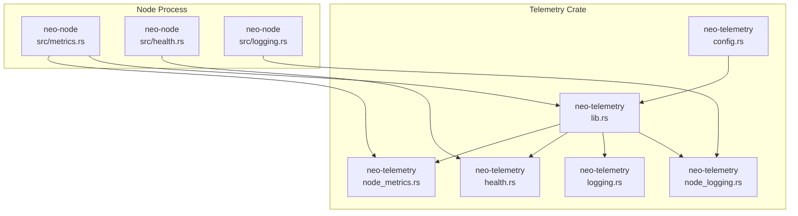
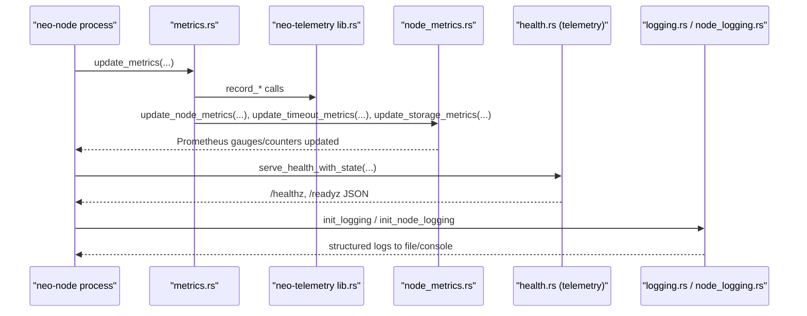
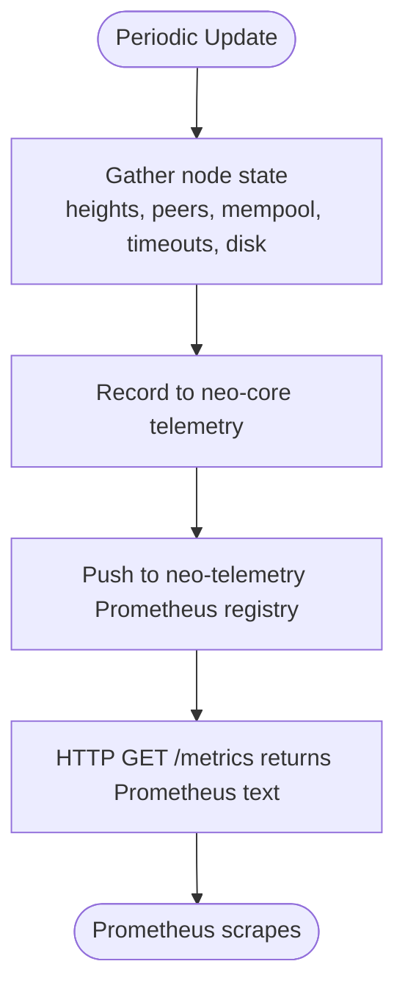
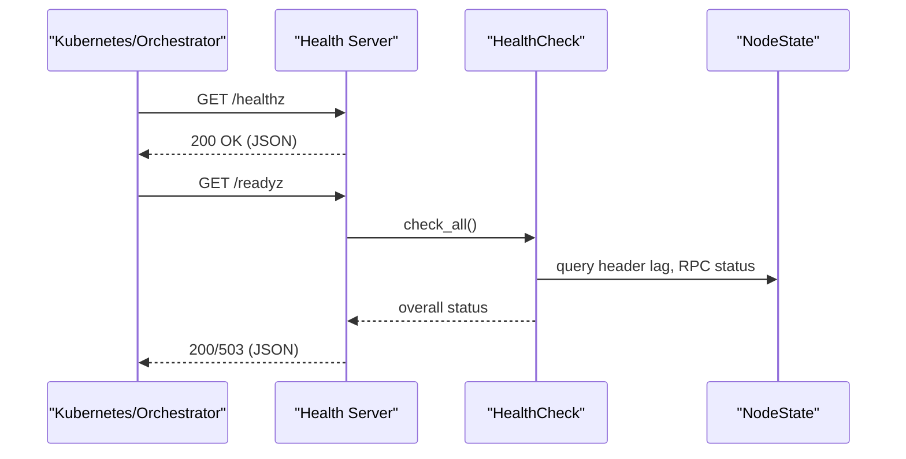
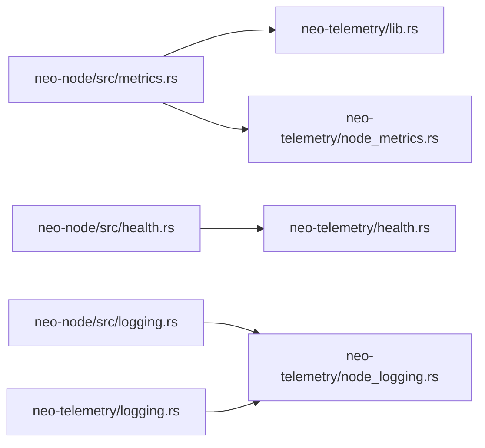

# Monitoring & Alerting

<cite>
**Referenced Files in This Document**
- [MONITORING.md](file://docs/MONITORING.md)
- [METRICS.md](file://docs/METRICS.md)
- [metrics.rs](file://neo-node/src/metrics.rs)
- [health.rs](file://neo-node/src/health.rs)
- [lib.rs](file://neo-telemetry/src/lib.rs)
- [node_metrics.rs](file://neo-telemetry/src/node_metrics.rs)
- [health.rs](file://neo-telemetry/src/health.rs)
- [config.rs](file://neo-telemetry/src/config.rs)
- [logging.rs](file://neo-telemetry/src/logging.rs)
- [node_logging.rs](file://neo-telemetry/src/node_logging.rs)
- [logging.rs](file://neo-node/src/logging.rs)
- [local.toml](file://config/local.toml)
</cite>

## Table of Contents
1. Introduction
2. Project Structure
3. Core Components
4. Architecture Overview
5. Detailed Component Analysis
6. Dependency Analysis
7. Performance Considerations
8. Troubleshooting Guide
9. Conclusion
10. Appendices

## Introduction
This document provides production-grade monitoring and alerting guidance for Neo-RS nodes. It covers Prometheus metrics collection, custom metric definitions, health endpoints, liveness/readiness signals, Grafana dashboards and alerts, log aggregation strategies, capacity planning, baselines, and anomaly detection techniques to support proactive operations.

## Project Structure
Neo-RS exposes observability through a dedicated telemetry subsystem and node-level integration:
- Node-level metrics update and export are implemented in the node crate and delegate to the telemetry crate for Prometheus exposure.
- Health endpoints (/healthz, /readyz) and Prometheus scraping (/metrics) are served via the telemetry subsystem.
- Logging is initialized with flexible formats (text, pretty, compact, JSON) and optional file output suitable for centralized logging pipelines.
- Configuration supports enabling metrics and health endpoints, binding addresses, ports, and log levels/formats.

**Diagram sources**
- [metrics.rs:26-108](file://neo-node/src/metrics.rs#L26-L108)
- [health.rs:12-34](file://neo-node/src/health.rs#L12-L34)
- [lib.rs:76-156](file://neo-telemetry/src/lib.rs#L76-L156)
- [node_metrics.rs:134-223](file://neo-telemetry/src/node_metrics.rs#L134-L223)
- [health.rs:1-128](file://neo-telemetry/src/health.rs#L1-L128)
- [config.rs:10-54](file://neo-telemetry/src/config.rs#L10-L54)
- [logging.rs:20-77](file://neo-telemetry/src/logging.rs#L20-L77)
- [node_logging.rs:53-109](file://neo-telemetry/src/node_logging.rs#L53-L109)

**Section sources**
- [metrics.rs:26-108](file://neo-node/src/metrics.rs#L26-L108)
- [health.rs:12-34](file://neo-node/src/health.rs#L12-L34)
- [lib.rs:76-156](file://neo-telemetry/src/lib.rs#L76-L156)
- [node_metrics.rs:134-223](file://neo-telemetry/src/node_metrics.rs#L134-L223)
- [health.rs:1-128](file://neo-telemetry/src/health.rs#L1-L128)
- [config.rs:10-54](file://neo-telemetry/src/config.rs#L10-L54)
- [logging.rs:20-77](file://neo-telemetry/src/logging.rs#L20-L77)
- [node_logging.rs:53-109](file://neo-telemetry/src/node_logging.rs#L53-L109)

## Core Components
- Prometheus metrics exporter: Exposes chain sync, mempool, P2P timeouts, storage disk usage, and state root ingestion metrics in Prometheus text format.
- Health endpoints: JSON responses for liveness (/healthz) and readiness (/readyz), including header lag policy and RPC availability.
- Logging: Structured logging with multiple formats and optional file output; suitable for shipping to centralized systems.
- Configuration: Telemetry and logging configuration types define defaults and toggles for metrics, health, prometheus path, and log behavior.

Key responsibilities:
- Metrics updates aggregate blockchain heights, peer counts, mempool size, timeout counters, and disk space, then push to Prometheus gauges/counters.
- Health server binds an HTTP endpoint on localhost by default and can be enabled via configuration or CLI flags.
- Logging initialization supports console and file outputs with environment-based filtering.

**Section sources**
- [METRICS.md:1-64](file://docs/METRICS.md#L1-L64)
- [metrics.rs:26-108](file://neo-node/src/metrics.rs#L26-L108)
- [node_metrics.rs:134-223](file://neo-telemetry/src/node_metrics.rs#L134-L223)
- [health.rs:12-34](file://neo-node/src/health.rs#L12-L34)
- [config.rs:10-54](file://neo-telemetry/src/config.rs#L10-L54)
- [logging.rs:20-77](file://neo-telemetry/src/logging.rs#L20-L77)
- [node_logging.rs:53-109](file://neo-telemetry/src/node_logging.rs#L53-L109)

## Architecture Overview
The runtime periodically records node state into shared Prometheus metrics and serves them over HTTP. Health checks evaluate component status and expose results as JSON. Logging is configured at startup and can write to files or stdout/stderr for log shippers.

**Diagram sources**
- [metrics.rs:26-108](file://neo-node/src/metrics.rs#L26-L108)
- [lib.rs:76-156](file://neo-telemetry/src/lib.rs#L76-L156)
- [node_metrics.rs:134-223](file://neo-telemetry/src/node_metrics.rs#L134-L223)
- [health.rs:12-34](file://neo-node/src/health.rs#L12-L34)
- [logging.rs:20-77](file://neo-telemetry/src/logging.rs#L20-L77)
- [node_logging.rs:53-109](file://neo-telemetry/src/node_logging.rs#L53-L109)

## Detailed Component Analysis

### Prometheus Metrics Collection and Definitions
- Chain/Sync: block height, header height, header lag, mempool size, peer count.
- P2P Timeouts: handshake, read, write timeout counters/gauges.
- Storage/Disk: free and total bytes for the storage volume.
- State Root: local/validated root indices, validated lag, accepted/rejected totals and counters.

Updates flow from the node’s metrics module into the telemetry crate’s Prometheus registry, which serializes metrics on demand.

**Diagram sources**
- [metrics.rs:26-108](file://neo-node/src/metrics.rs#L26-L108)
- [node_metrics.rs:134-223](file://neo-telemetry/src/node_metrics.rs#L134-L223)

**Section sources**
- [METRICS.md:21-53](file://docs/METRICS.md#L21-L53)
- [node_metrics.rs:134-223](file://neo-telemetry/src/node_metrics.rs#L134-L223)
- [metrics.rs:26-108](file://neo-node/src/metrics.rs#L26-L108)

### Health Endpoints, Liveness, and Readiness
- /healthz: Basic liveness; indicates process is alive and serving.
- /readyz: Readiness; aggregates component health and respects header lag policy and RPC availability.
- The health server binds to a configurable port and can be enabled via configuration or CLI flags.

**Diagram sources**
- [health.rs:12-34](file://neo-node/src/health.rs#L12-L34)
- [health.rs:1-128](file://neo-telemetry/src/health.rs#L1-L128)

**Section sources**
- [health.rs:12-34](file://neo-node/src/health.rs#L12-L34)
- [health.rs:1-128](file://neo-telemetry/src/health.rs#L1-L128)
- [MONITORING.md:5-18](file://docs/MONITORING.md#L5-L18)

### Logging and Centralized Aggregation
- Logging supports text, pretty, compact, and JSON formats.
- File output is supported with non-blocking writers; suitable for log shippers (e.g., Fluent Bit, Vector).
- Environment-based filtering allows fine-grained control over log verbosity.

Recommended strategy:
- Enable JSON logging in production for machine parsing.
- Ship log files to a centralized system (ELK/OpenSearch, Loki, Splunk).
- Use structured fields and consistent log levels for alerting on errors/timeouts/restarts.

**Section sources**
- [logging.rs:20-77](file://neo-telemetry/src/logging.rs#L20-L77)
- [node_logging.rs:53-109](file://neo-telemetry/src/node_logging.rs#L53-L109)
- [logging.rs:19-83](file://neo-node/src/logging.rs#L19-L83)
- [MONITORING.md:14-18](file://docs/MONITORING.md#L14-L18)

### Configuration and Enabling Observability
- Telemetry config includes toggles for metrics and health endpoints, bind address/port, and Prometheus path.
- Example local configuration shows how to enable metrics and set ports/bind addresses.
- CLI flag --health-port and environment variable NEO_HEALTH_PORT can enable the health/metrics server.

Operational tips:
- Bind metrics/health to localhost and proxy via sidecar or service mesh if needed.
- Set appropriate log level and format per environment.
- Ensure storage paths exist and are writable for file logging.

**Section sources**
- [config.rs:10-54](file://neo-telemetry/src/config.rs#L10-L54)
- [local.toml:34-45](file://config/local.toml#L34-L45)
- [METRICS.md:1-18](file://docs/METRICS.md#L1-L18)

## Dependency Analysis
- neo-node metrics module depends on neo-core telemetry for internal recording and delegates Prometheus export to neo-telemetry.
- neo-telemetry centralizes Prometheus registries, health checks, logging, and configuration.
- Health server depends on node-specific state (storage version, RPC enabled flag) passed from neo-node.

**Diagram sources**
- [metrics.rs:26-108](file://neo-node/src/metrics.rs#L26-L108)
- [lib.rs:76-156](file://neo-telemetry/src/lib.rs#L76-L156)
- [node_metrics.rs:134-223](file://neo-telemetry/src/node_metrics.rs#L134-L223)
- [health.rs:12-34](file://neo-node/src/health.rs#L12-L34)
- [health.rs:1-128](file://neo-telemetry/src/health.rs#L1-L128)
- [logging.rs:20-77](file://neo-telemetry/src/logging.rs#L20-L77)
- [node_logging.rs:53-109](file://neo-telemetry/src/node_logging.rs#L53-L109)

**Section sources**
- [metrics.rs:26-108](file://neo-node/src/metrics.rs#L26-L108)
- [lib.rs:76-156](file://neo-telemetry/src/lib.rs#L76-L156)
- [node_metrics.rs:134-223](file://neo-telemetry/src/node_metrics.rs#L134-L223)
- [health.rs:12-34](file://neo-node/src/health.rs#L12-L34)
- [health.rs:1-128](file://neo-telemetry/src/health.rs#L1-L128)
- [logging.rs:20-77](file://neo-telemetry/src/logging.rs#L20-L77)
- [node_logging.rs:53-109](file://neo-telemetry/src/node_logging.rs#L53-L109)

## Performance Considerations
- Scrape interval: Configure Prometheus scrape intervals to balance freshness and overhead.
- Metric cardinality: Current metrics use low-cardinality names; avoid adding high-cardinality labels.
- Disk metrics: Monitor free bytes and total bytes to prevent RocksDB saturation; plan capacity accordingly.
- P2P timeouts: Rising timeouts indicate network issues or peer misbehavior; investigate latency and connection churn.
- Header lag: Sustained lag suggests sync bottlenecks; consider resource scaling or tuning.

[No sources needed since this section provides general guidance]

## Troubleshooting Guide
Common issues and diagnostics:
- Health endpoint not reachable: Verify --health-port or NEO_HEALTH_PORT is set; ensure firewall/proxy allows access.
- Missing metrics: Confirm metrics_enabled and prometheus_enabled settings; check /metrics response.
- High header lag: Check peer connectivity and p2p timeouts; validate storage performance.
- Disk pressure: Watch neo_storage_free_bytes; alert when below threshold; schedule cleanup/backups.
- Log rotation/shipping: Ensure file paths exist and permissions are correct; verify log shipper connectivity.

Alert ideas:
- Height lag > N blocks for M minutes.
- Peer count below threshold for M minutes.
- Mempool stuck at 0 or exceeding cap.
- Free disk space < 20% or inode pressure.
- FD usage > 80% of limit; repeated restarts.

**Section sources**
- [MONITORING.md:20-35](file://docs/MONITORING.md#L20-L35)
- [METRICS.md:54-64](file://docs/METRICS.md#L54-L64)

## Conclusion
Neo-RS provides a robust observability foundation for production deployments: Prometheus metrics, health endpoints, and structured logging. Combine these with Prometheus/Grafana for visualization and alerting, and a centralized logging pipeline for search and retention. Define clear thresholds and escalation procedures to maintain healthy, performant nodes.

[No sources needed since this section summarizes without analyzing specific files]

## Appendices

### Prometheus Metrics Reference
- Chain/Sync: neo_header_height, neo_block_height, neo_header_lag, neo_mempool_size, neo_peer_count.
- P2P Timeouts: neo_p2p_timeouts_handshake, neo_p2p_timeouts_read, neo_p2p_timeouts_write.
- Storage: neo_storage_free_bytes, neo_storage_total_bytes.
- State Root: neo_state_local_root_index, neo_state_validated_root_index, neo_state_validated_lag, neo_state_roots_accepted_total, neo_state_roots_rejected_total, neo_state_roots_accepted, neo_state_roots_rejected.

**Section sources**
- [METRICS.md:21-53](file://docs/METRICS.md#L21-L53)
- [node_metrics.rs:14-112](file://neo-telemetry/src/node_metrics.rs#L14-L112)

### Health Endpoint Reference
- GET /healthz: JSON liveness probe.
- GET /readyz: JSON readiness probe with header lag policy and RPC status.
- GET /metrics: Prometheus text exposition.

Enable via --health-port or NEO_HEALTH_PORT.

**Section sources**
- [METRICS.md:1-18](file://docs/METRICS.md#L1-L18)
- [health.rs:12-34](file://neo-node/src/health.rs#L12-L34)

### Grafana Dashboards and Alerts
- Dashboards: Block/header lag, peer counts, RPC latency/error rates, disk IO/free space, process FDs.
- Alerts: Based on metrics above; configure PromQL rules and notification channels (email, Slack, PagerDuty).
- Baselines: Use historical data to set warning/critical thresholds tuned to your workload.

[No sources needed since this section provides general guidance]

### Capacity Planning and Anomaly Detection
- Capacity: Track neo_storage_free_bytes, neo_peer_count, neo_mempool_size, and timeout metrics to forecast scaling needs.
- Baselines: Establish normal ranges for heights, lag, and timeouts; detect regressions via CI benchmarks and production trends.
- Anomaly detection: Use statistical methods or ML-based detectors on key metrics to identify deviations early.

[No sources needed since this section provides general guidance]