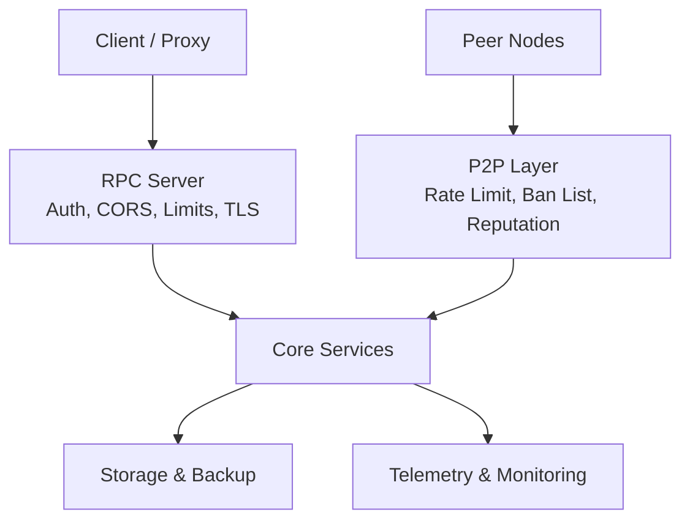
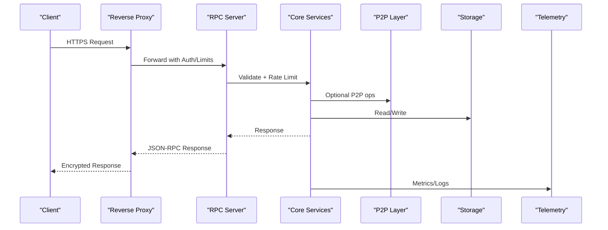
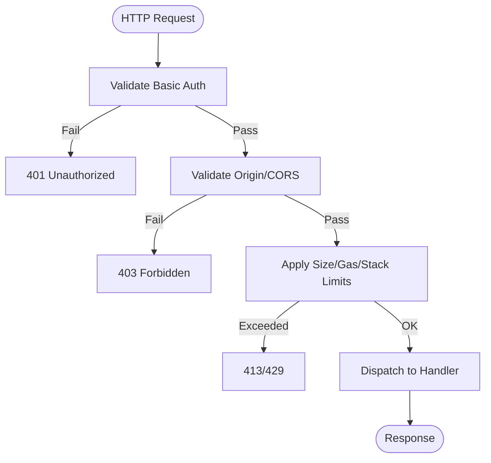
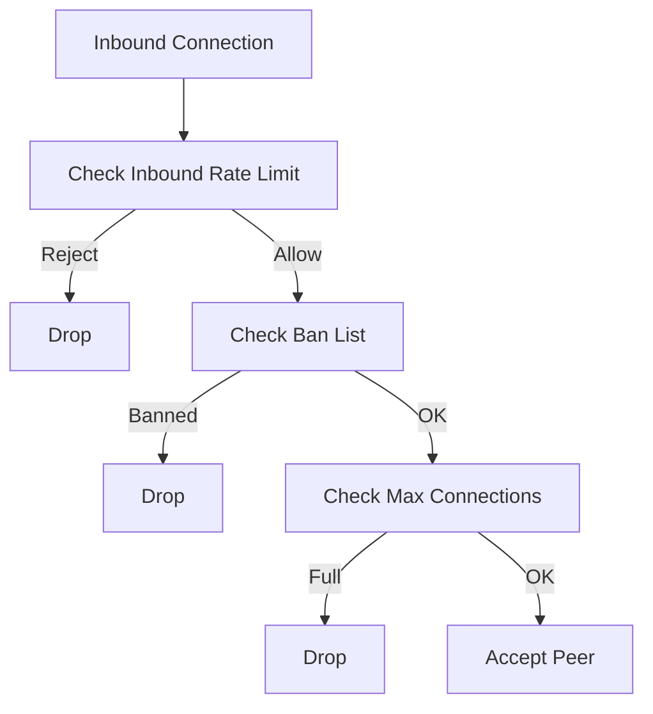
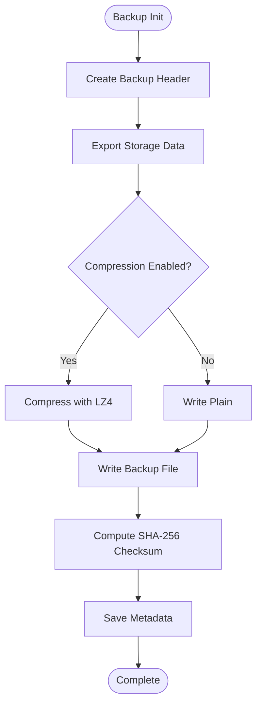
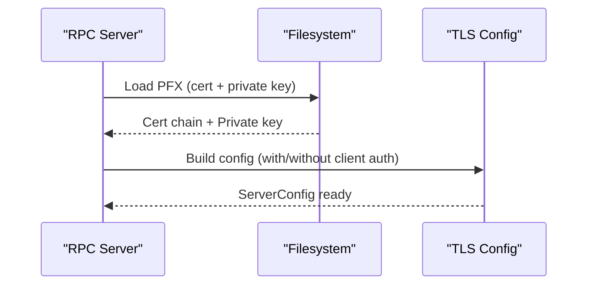
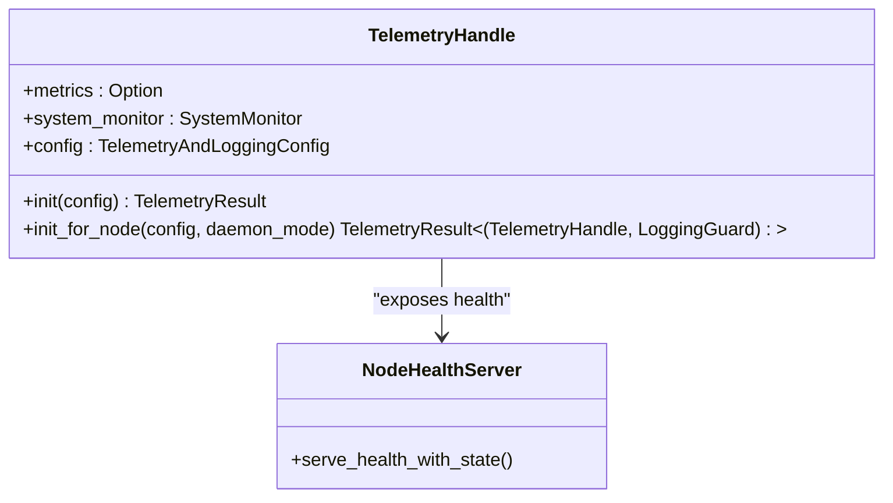
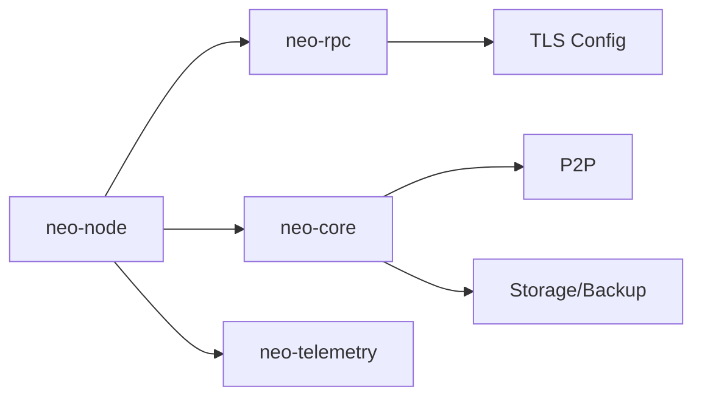

# Production Hardening

<cite>
**Referenced Files in This Document**
- [SECURITY.md](file://docs/SECURITY.md)
- [RPC_HARDENING.md](file://docs/RPC_HARDENING.md)
- [mainnet.toml](file://config/mainnet.toml)
- [RpcServer.json](file://neo-node/config/RpcServer/RpcServer.json)
- [main.rs](file://neo-node/src/main.rs)
- [mod.rs (routes)](file://neo-rpc/src/server/routes/mod.rs)
- [cors.rs](file://neo-rpc/src/server/routes/cors.rs)
- [rpc_tls.rs](file://neo-rpc/src/server/rpc_tls.rs)
- [p2p mod.rs](file://neo-core/src/network/p2p/mod.rs)
- [local_node state.rs](file://neo-core/src/network/p2p/local_node/state.rs)
- [bloom_filter.rs](file://neo-core/src/network/p2p/remote_node/bloom_filter.rs)
- [backup.rs](file://neo-core/src/persistence/backup.rs)
- [lib.rs (telemetry)](file://neo-telemetry/src/lib.rs)
- [security-check.sh](file://scripts/security-check.sh)
- [spec.md (security hardening)](file://openspec/specs/security-hardening/spec.md)
</cite>

## Table of Contents
1. [Introduction](#introduction)
2. [Project Structure](#project-structure)
3. [Core Components](#core-components)
4. [Architecture Overview](#architecture-overview)
5. [Detailed Component Analysis](#detailed-component-analysis)
6. [Dependency Analysis](#dependency-analysis)
7. [Performance Considerations](#performance-considerations)
8. [Troubleshooting Guide](#troubleshooting-guide)
9. [Conclusion](#conclusion)
10. [Appendices](#appendices)

## Introduction
This document provides production hardening guidance for Neo-RS deployments, focusing on network security, access control, data protection, RPC server hardening, P2P security, filesystem security, TLS/SSL configuration, monitoring and audit logging, incident response procedures, and a production readiness checklist. It synthesizes the repository’s built-in security features and configuration options into actionable operational practices.

## Project Structure
Neo-RS exposes multiple hardened surfaces:
- RPC server with authentication, CORS controls, request limits, optional rate limiting, and TLS support.
- P2P networking with inbound connection validation, rate limiting, ban lists, reputation tracking, and message quotas.
- Persistence layer with backup utilities and checksumming.
- Telemetry stack for metrics, health checks, and structured logging.
- Security scripts and specifications to enforce secure defaults and guardrails.

**Diagram sources**
- [main.rs:1-79](file://neo-node/src/main.rs#L1-L79)
- [rpc_tls.rs:34-67](file://neo-rpc/src/server/rpc_tls.rs#L34-L67)
- [local_node state.rs:605-624](file://neo-core/src/network/p2p/local_node/state.rs#L605-L624)
- [backup.rs:305-491](file://neo-core/src/persistence/backup.rs#L305-L491)
- [lib.rs (telemetry):76-156](file://neo-telemetry/src/lib.rs#L76-L156)

**Section sources**
- [main.rs:1-79](file://neo-node/src/main.rs#L1-L79)
- [RPC_HARDENING.md:1-69](file://docs/RPC_HARDENING.md#L1-L69)
- [mainnet.toml:1-68](file://config/mainnet.toml#L1-L68)

## Core Components
- RPC server hardening: Basic auth, CORS allowlist, method filtering, request size limits, gas/iterator/stack limits, optional per-IP rate limiting, and TLS with client certificate verification.
- P2P security: Inbound connection validation, per-IP rate limiting, ban list enforcement, max connections, bloom filter quotas, and peer reputation tracking.
- Data protection: Backups with compression and checksums; TEE/HSM integration paths for key isolation.
- Observability: Structured logging, Prometheus metrics, health endpoints, and alerting thresholds.

**Section sources**
- [RPC_HARDENING.md:8-22](file://docs/RPC_HARDENING.md#L8-L22)
- [cors.rs:129-160](file://neo-rpc/src/server/routes/cors.rs#L129-L160)
- [mod.rs (routes):180-239](file://neo-rpc/src/server/routes/mod.rs#L180-L239)
- [rpc_tls.rs:34-67](file://neo-rpc/src/server/rpc_tls.rs#L34-L67)
- [local_node state.rs:605-624](file://neo-core/src/network/p2p/local_node/state.rs#L605-L624)
- [p2p mod.rs:229-271](file://neo-core/src/network/p2p/mod.rs#L229-L271)
- [bloom_filter.rs:54-86](file://neo-core/src/network/p2p/remote_node/bloom_filter.rs#L54-L86)
- [backup.rs:305-491](file://neo-core/src/persistence/backup.rs#L305-L491)
- [lib.rs (telemetry):76-156](file://neo-telemetry/src/lib.rs#L76-L156)

## Architecture Overview
The hardened deployment places the RPC server behind a reverse proxy for TLS termination and additional rate limiting. The P2P layer enforces strict inbound validation and resource quotas. All sensitive operations are bounded by limits and logged via telemetry.

**Diagram sources**
- [rpc_tls.rs:34-67](file://neo-rpc/src/server/rpc_tls.rs#L34-L67)
- [cors.rs:129-160](file://neo-rpc/src/server/routes/cors.rs#L129-L160)
- [mod.rs (routes):180-239](file://neo-rpc/src/server/routes/mod.rs#L180-L239)
- [local_node state.rs:605-624](file://neo-core/src/network/p2p/local_node/state.rs#L605-L624)
- [lib.rs (telemetry):76-156](file://neo-telemetry/src/lib.rs#L76-L156)

## Detailed Component Analysis

### RPC Server Hardening
- Authentication: Basic auth is supported and validated using constant-time comparison to mitigate timing attacks.
- CORS: Disabled by default; when enabled, restrict origins to an explicit allowlist.
- Request limits: Enforce maximum body size, gas invoke caps, iterator result limits, and stack size.
- Method filtering: Disable dangerous methods (e.g., wallet or plugin listing) unless explicitly needed.
- Rate limiting: Optional per-IP rate limiter; prefer a reverse proxy for stronger guarantees.
- TLS: Built-in TLS supports PFX bundles and optional client certificate verification via trusted authorities.

**Diagram sources**
- [cors.rs:129-160](file://neo-rpc/src/server/routes/cors.rs#L129-L160)
- [mod.rs (routes):180-239](file://neo-rpc/src/server/routes/mod.rs#L180-L239)
- [RPC_HARDENING.md:8-22](file://docs/RPC_HARDENING.md#L8-L22)

**Section sources**
- [RPC_HARDENING.md:8-22](file://docs/RPC_HARDENING.md#L8-L22)
- [cors.rs:129-160](file://neo-rpc/src/server/routes/cors.rs#L129-L160)
- [mod.rs (routes):180-239](file://neo-rpc/src/server/routes/mod.rs#L180-L239)
- [rpc_tls.rs:34-67](file://neo-rpc/src/server/rpc_tls.rs#L34-L67)
- [RpcServer.json:1-16](file://neo-node/config/RpcServer/RpcServer.json#L1-L16)

### P2P Network Security
- Inbound connection validation: Checks rate limits, ban list, and total connection count before accepting peers.
- Per-peer quotas: Bloom filter operations are rate-limited and size-bounded to prevent abuse.
- Reputation system: Tracks violations and scores to identify misbehaving peers.
- Connection limits: Configurable maximum connections and desired peers.

**Diagram sources**
- [local_node state.rs:605-624](file://neo-core/src/network/p2p/local_node/state.rs#L605-L624)
- [bloom_filter.rs:54-86](file://neo-core/src/network/p2p/remote_node/bloom_filter.rs#L54-L86)
- [p2p mod.rs:229-271](file://neo-core/src/network/p2p/mod.rs#L229-L271)

**Section sources**
- [local_node state.rs:605-624](file://neo-core/src/network/p2p/local_node/state.rs#L605-L624)
- [bloom_filter.rs:54-86](file://neo-core/src/network/p2p/remote_node/bloom_filter.rs#L54-L86)
- [p2p mod.rs:229-271](file://neo-core/src/network/p2p/mod.rs#L229-L271)

### Filesystem Security and Backups
- Backups: Full/incremental/snapshot backups with LZ4 compression and SHA-256 checksums for integrity.
- Metadata: Backup metadata persisted alongside artifacts for traceability.
- Permissions: Store backups under restricted directories; ensure only service accounts can read/write.
- Encryption at rest: Use OS-level encryption or disk encryption; combine with secure backup storage policies.

**Diagram sources**
- [backup.rs:305-491](file://neo-core/src/persistence/backup.rs#L305-L491)

**Section sources**
- [backup.rs:305-491](file://neo-core/src/persistence/backup.rs#L305-L491)

### TLS/SSL Configuration and Key Handling
- Certificate loading: Supports PFX bundles with password verification and chain extraction.
- Client certificates: Optional mutual TLS via trusted authorities.
- Key handling: Private keys loaded from secure bundles; ensure minimal exposure and proper file permissions.
- Deployment note: Prefer terminating TLS at a reverse proxy; if using built-in TLS, configure trusted authorities carefully.

**Diagram sources**
- [rpc_tls.rs:34-67](file://neo-rpc/src/server/rpc_tls.rs#L34-L67)

**Section sources**
- [rpc_tls.rs:34-67](file://neo-rpc/src/server/rpc_tls.rs#L34-L67)
- [RPC_HARDENING.md:16-22](file://docs/RPC_HARDENING.md#L16-L22)

### Security Monitoring, Audit Logging, and Incident Response
- Telemetry: Centralized initialization for logging and metrics; node-specific logging with file output and daemon mode.
- Health: Health endpoints for liveness/readiness; configurable header lag thresholds.
- Alerts: Performance thresholds and alert callbacks for warning/critical conditions.
- Incident response: Use logs and metrics to detect anomalies; correlate with P2P bans and RPC auth failures.

**Diagram sources**
- [lib.rs (telemetry):76-156](file://neo-telemetry/src/lib.rs#L76-L156)

**Section sources**
- [lib.rs (telemetry):76-156](file://neo-telemetry/src/lib.rs#L76-L156)
- [mainnet.toml:40-51](file://config/mainnet.toml#L40-L51)

## Dependency Analysis
Key runtime dependencies and their roles:
- neo-rpc: HTTP/JSON-RPC server with auth, CORS, limits, and TLS.
- neo-core: P2P networking, persistence, and core services.
- neo-telemetry: Logging, metrics, and health endpoints.
- neo-node: Entry point orchestrating startup and feature flags (including TEE/HSM).

**Diagram sources**
- [main.rs:1-79](file://neo-node/src/main.rs#L1-L79)
- [rpc_tls.rs:34-67](file://neo-rpc/src/server/rpc_tls.rs#L34-L67)
- [local_node state.rs:605-624](file://neo-core/src/network/p2p/local_node/state.rs#L605-L624)
- [backup.rs:305-491](file://neo-core/src/persistence/backup.rs#L305-L491)
- [lib.rs (telemetry):76-156](file://neo-telemetry/src/lib.rs#L76-L156)

**Section sources**
- [main.rs:1-79](file://neo-node/src/main.rs#L1-L79)
- [rpc_tls.rs:34-67](file://neo-rpc/src/server/rpc_tls.rs#L34-L67)
- [local_node state.rs:605-624](file://neo-core/src/network/p2p/local_node/state.rs#L605-L624)
- [backup.rs:305-491](file://neo-core/src/persistence/backup.rs#L305-L491)
- [lib.rs (telemetry):76-156](file://neo-telemetry/src/lib.rs#L76-L156)

## Performance Considerations
- RPC limits: Tune max_request_body_size, max_gas_invoke, max_iterator_result_items, and max_stack_size to balance throughput and safety.
- P2P quotas: Configure bloom filter quotas and per-peer memory usage to avoid resource exhaustion.
- Backups: Enable compression for storage efficiency; schedule off-peak to minimize impact.
- Telemetry: Enable metrics and set appropriate scrape intervals; use health checks to detect degradation early.

[No sources needed since this section provides general guidance]

## Troubleshooting Guide
Common issues and mitigations:
- RPC 401/403: Verify Basic Auth credentials and CORS allowlist; ensure disabled_methods does not block required endpoints.
- TLS errors: Confirm PFX password validity and presence of both certificate chain and private key; validate trusted authorities if mTLS is enabled.
- P2P connection drops: Inspect inbound rate limit and ban list; check max_connections and reputation thresholds.
- Backup integrity: Validate SHA-256 checksums and ensure metadata files exist; verify compression settings.

**Section sources**
- [mod.rs (routes):180-239](file://neo-rpc/src/server/routes/mod.rs#L180-L239)
- [rpc_tls.rs:34-67](file://neo-rpc/src/server/rpc_tls.rs#L34-L67)
- [local_node state.rs:605-624](file://neo-core/src/network/p2p/local_node/state.rs#L605-L624)
- [backup.rs:468-491](file://neo-core/src/persistence/backup.rs#L468-L491)

## Conclusion
Neo-RS provides robust primitives for production hardening: authenticated and limited RPC endpoints, strict P2P inbound controls, resilient backups with integrity checks, and comprehensive telemetry. Combine these with disciplined configuration, reverse proxy hardening, and operational procedures to achieve a secure, observable, and reliable deployment.

[No sources needed since this section summarizes without analyzing specific files]

## Appendices

### Production Readiness Checklist
- Network and Access Control
  - Bind RPC to loopback; expose via reverse proxy with TLS and IP restrictions.
  - Enable Basic Auth and disable unnecessary RPC methods.
  - Configure CORS allowlist; disable wildcard origins.
- P2P Security
  - Set max_connections and seed nodes appropriately.
  - Ensure inbound rate limiting and ban list are active.
  - Monitor bloom filter quotas and peer reputation.
- Data Protection
  - Enable backups with compression; compute and store checksums.
  - Restrict filesystem permissions; encrypt backups at rest.
- TLS/SSL
  - Provide valid PFX bundle; verify password and chain.
  - Optionally enable client certificate verification via trusted authorities.
- Monitoring and Logging
  - Enable structured logging and metrics; bind metrics to localhost or internal network.
  - Configure health endpoints and header lag thresholds.
- Compliance and Audits
  - Address all audit findings prior to release.
  - Validate dependency security and input validation at boundaries.

**Section sources**
- [RPC_HARDENING.md:8-22](file://docs/RPC_HARDENING.md#L8-L22)
- [mainnet.toml:12-34](file://config/mainnet.toml#L12-L34)
- [local_node state.rs:605-624](file://neo-core/src/network/p2p/local_node/state.rs#L605-L624)
- [backup.rs:305-491](file://neo-core/src/persistence/backup.rs#L305-L491)
- [rpc_tls.rs:34-67](file://neo-rpc/src/server/rpc_tls.rs#L34-L67)
- [lib.rs (telemetry):76-156](file://neo-telemetry/src/lib.rs#L76-L156)
- [spec.md (security hardening):1-23](file://openspec/specs/security-hardening/spec.md#L1-L23)

### Vulnerability Mitigation Strategies
- Input Validation: Enforce strict parameter validation at RPC boundaries; apply size and depth limits.
- Dependency Security: Fail builds on vulnerable dependencies; regularly scan and update crates.
- Resource Limits: Cap VM execution, storage reads/writes, and P2P message sizes to prevent DoS.
- Secure Defaults: Disable risky methods by default; require explicit opt-in for advanced features.

**Section sources**
- [spec.md (security hardening):1-23](file://openspec/specs/security-hardening/spec.md#L1-L23)
- [RPC_HARDENING.md:8-22](file://docs/RPC_HARDENING.md#L8-L22)
- [SECURITY.md:135-167](file://docs/SECURITY.md#L135-L167)

### Security Scripting and CI Integration
- Run security checks in CI to detect insecure RNG usage, missing size checks, and unsafe code density.
- Gate releases on successful compilation and security checks.

**Section sources**
- [security-check.sh:1-73](file://scripts/security-check.sh#L1-L73)