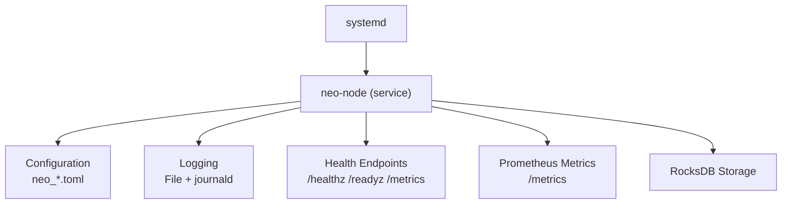
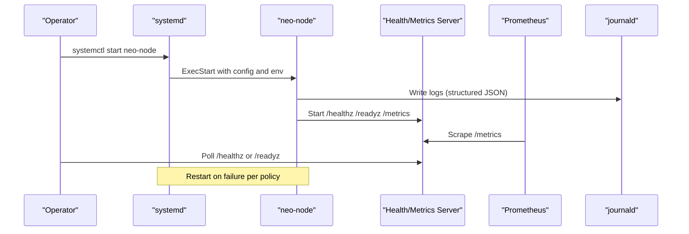
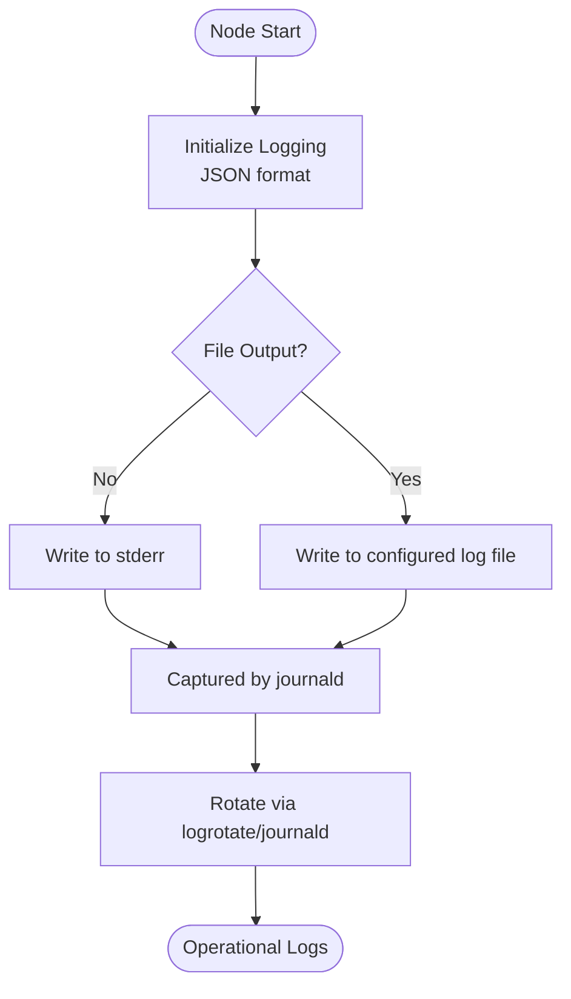
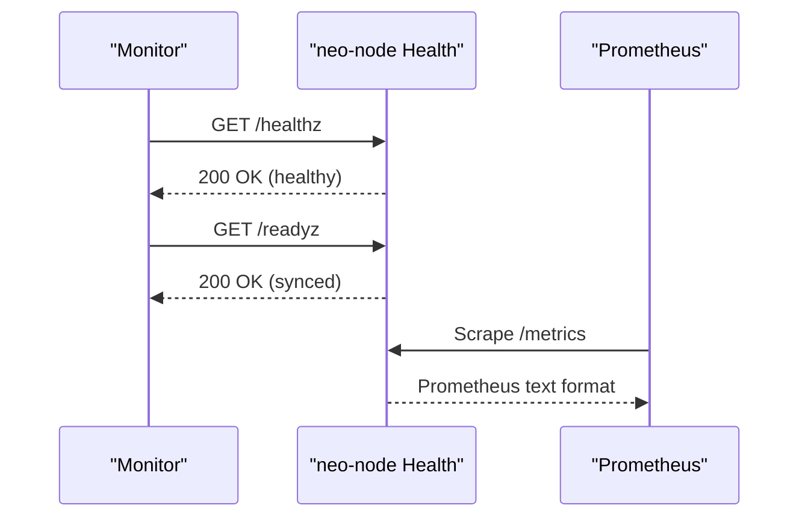
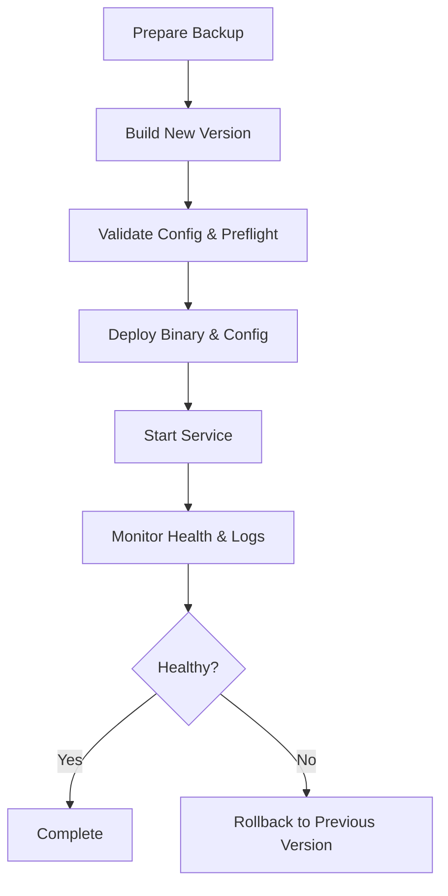
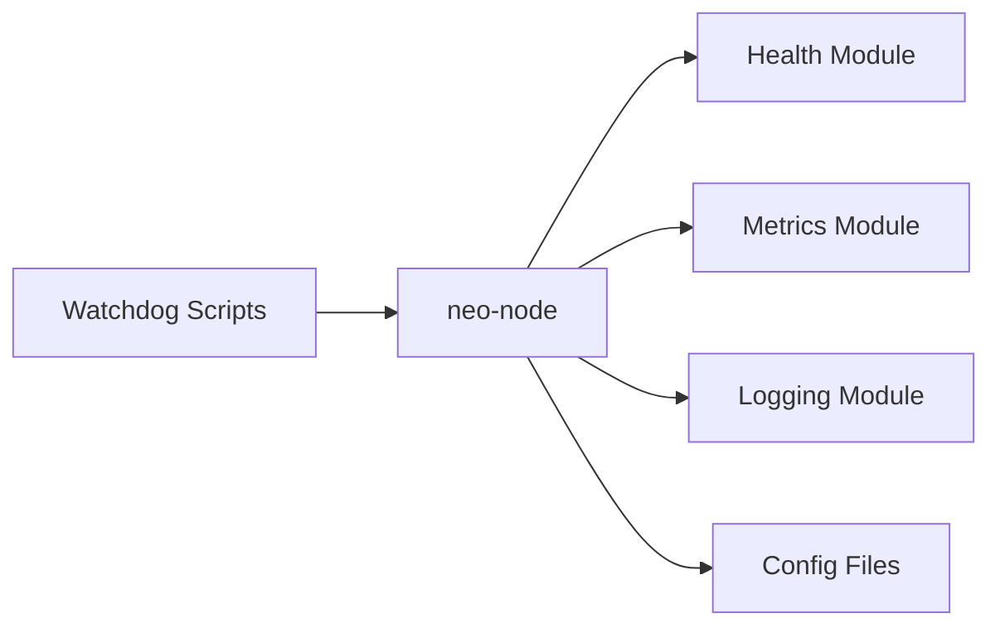

# System Service Management

<cite>
**Referenced Files in This Document**
- [DEPLOYMENT.md](file://docs/DEPLOYMENT.md)
- [neo_production_node.toml](file://neo_production_node.toml)
- [neo_mainnet_node.toml](file://neo_mainnet_node.toml)
- [health.rs](file://neo-node/src/health.rs)
- [node_logging.rs](file://neo-telemetry/src/node_logging.rs)
- [node_metrics.rs](file://neo-telemetry/src/node_metrics.rs)
- [docker-compose.yml](file://docker-compose.yml)
- [stateroot-watchdog.sh](file://scripts/stateroot-watchdog.sh)
- [watchdog.py](file://scripts/watchdog.py)
</cite>

## Table of Contents
1. [Introduction](#introduction)
2. [Project Structure](#project-structure)
3. [Core Components](#core-components)
4. [Architecture Overview](#architecture-overview)
5. [Detailed Component Analysis](#detailed-component-analysis)
6. [Dependency Analysis](#dependency-analysis)
7. [Performance Considerations](#performance-considerations)
8. [Troubleshooting Guide](#troubleshooting-guide)
9. [Conclusion](#conclusion)
10. [Appendices](#appendices)

## Introduction
This document provides production-grade guidance for managing Neo-RS as a systemd service. It covers unit file configuration, process isolation and security hardening, restart policies, lifecycle management, automatic startup, dependency ordering, logging with journald integration, log rotation, monitoring via health endpoints and metrics, update and rollback procedures, troubleshooting, and performance tuning through systemd parameters.

## Project Structure
Neo-RS exposes:
- A node binary that can be managed by systemd
- Configuration files for network, storage, RPC, telemetry, and logging
- Health endpoints and Prometheus metrics for observability
- Logging subsystems supporting file output and structured formats suitable for journald ingestion

**Diagram sources**
- [DEPLOYMENT.md:570-618](file://docs/DEPLOYMENT.md#L570-L618)
- [neo_production_node.toml:48-53](file://neo_production_node.toml#L48-L53)
- [neo_mainnet_node.toml:49-54](file://neo_mainnet_node.toml#L49-L54)
- [health.rs:12-34](file://neo-node/src/health.rs#L12-L34)
- [node_metrics.rs:197-223](file://neo-telemetry/src/node_metrics.rs#L197-L223)

**Section sources**
- [DEPLOYMENT.md:570-618](file://docs/DEPLOYMENT.md#L570-L618)
- [neo_production_node.toml:48-53](file://neo_production_node.toml#L48-L53)
- [neo_mainnet_node.toml:49-54](file://neo_mainnet_node.toml#L49-L54)

## Core Components
- Systemd unit file: defines process isolation, resource limits, security hardening, restart policy, environment variables, and dependencies.
- Node configuration: TOML files control networking, storage, RPC, telemetry, and logging behavior.
- Health and metrics: HTTP endpoints expose liveness/readiness and Prometheus metrics for automated monitoring.
- Logging: Structured logging to files and stderr/journald; supports JSON format for easy parsing.

Key responsibilities:
- systemd: lifecycle, restarts, resource enforcement, boot integration
- neo-node: application runtime, I/O, P2P/RPC, consensus, state root processing
- Telemetry/logging: structured logs and metrics for observability

**Section sources**
- [DEPLOYMENT.md:570-618](file://docs/DEPLOYMENT.md#L570-L618)
- [neo_production_node.toml:4-61](file://neo_production_node.toml#L4-L61)
- [neo_mainnet_node.toml:4-67](file://neo_mainnet_node.toml#L4-L67)
- [health.rs:12-34](file://neo-node/src/health.rs#L12-L34)
- [node_metrics.rs:134-223](file://neo-telemetry/src/node_metrics.rs#L134-L223)

## Architecture Overview
The systemd service runs the Neo node with hardened settings, captures logs via journald, and exposes health and metrics for automation. The node reads configuration from TOML files and writes data to RocksDB.

**Diagram sources**
- [DEPLOYMENT.md:570-618](file://docs/DEPLOYMENT.md#L570-L618)
- [health.rs:12-34](file://neo-node/src/health.rs#L12-L34)
- [node_metrics.rs:197-223](file://neo-telemetry/src/node_metrics.rs#L197-L223)
- [node_logging.rs:76-109](file://neo-telemetry/src/node_logging.rs#L76-L109)

## Detailed Component Analysis

### Systemd Unit File Configuration
Recommended fields for production:
- Unit section: description, After/Wants for network readiness
- Service section: Type=simple, User/Group, WorkingDirectory, ExecStart with config path
- Restart policy: Restart=always, RestartSec, StartLimitInterval/Burst
- Resource limits: LimitNOFILE, LimitNPROC, optional memory/CPU via cgroups
- Security hardening: NoNewPrivileges=true, ProtectSystem=strict, ProtectHome=true, ReadWritePaths for data/logs
- Environment: RUST_LOG, NEO_PLUGINS_DIR, and other NEO_* variables
- Install section: WantedBy=multi-user.target

Notes:
- Use dedicated user/group for least privilege
- Restrict filesystem access to only required paths
- Set appropriate ulimits for high concurrency (file descriptors, processes)
- Align environment with configuration files

**Section sources**
- [DEPLOYMENT.md:570-618](file://docs/DEPLOYMENT.md#L570-L618)

### Process Isolation and Security Hardening
- Run under a dedicated non-root user/group
- Enable NoNewPrivileges to prevent privilege escalation
- Use ProtectSystem=strict and ProtectHome=true to restrict filesystem access
- Allow read/write only to specific directories for data and logs via ReadWritePaths
- Combine with SELinux/AppArmor profiles if available
- Ensure secrets (RPC credentials, keys) are stored securely and not world-readable

**Section sources**
- [DEPLOYMENT.md:599-607](file://docs/DEPLOYMENT.md#L599-L607)

### Restart Policies and Lifecycle Management
- Restart=always ensures automatic recovery from crashes
- RestartSec controls backoff between restarts
- StartLimitInterval/StartLimitBurst prevents restart loops during severe failures
- Use journalctl to inspect recent failures and diagnose issues
- For graceful updates, prefer rolling restarts across multiple nodes when applicable

**Section sources**
- [DEPLOYMENT.md:589-593](file://docs/DEPLOYMENT.md#L589-L593)

### Automatic Startup and Dependency Ordering
- After=network.target and Wants=network-online.target ensure network is ready before starting
- WantedBy=multi-user.target enables boot-time activation
- Optionally add dependencies for storage mounts or external services if needed

**Section sources**
- [DEPLOYMENT.md:575-578](file://docs/DEPLOYMENT.md#L575-L578)

### Logging Configuration with Journald Integration
- Configure logging in TOML to output JSON format for structured logs
- Direct logs to a file path and/or stderr so journald can capture them
- Use RUST_LOG to set log levels and module filters
- Rotate logs using logrotate or systemd-journald settings (e.g., MaxSize, MaxKeepTime)
- Query logs via journalctl with filters for service name and level

**Diagram sources**
- [node_logging.rs:76-109](file://neo-telemetry/src/node_logging.rs#L76-L109)
- [neo_production_node.toml:48-53](file://neo_production_node.toml#L48-L53)
- [neo_mainnet_node.toml:49-54](file://neo_mainnet_node.toml#L49-L54)

**Section sources**
- [node_logging.rs:76-109](file://neo-telemetry/src/node_logging.rs#L76-L109)
- [neo_production_node.toml:48-53](file://neo_production_node.toml#L48-L53)
- [neo_mainnet_node.toml:49-54](file://neo_mainnet_node.toml#L49-L54)

### Monitoring Through Health Checks and Status Reporting
- Expose /healthz for liveness and /readyz for readiness when enabled
- Use --health-port and --health-max-header-lag to tailor checks
- Scrape /metrics for Prometheus metrics including block height, peer count, mempool size, timeouts, and disk usage
- Integrate with alerting systems to monitor lag, peer connectivity, and resource usage

**Diagram sources**
- [health.rs:12-34](file://neo-node/src/health.rs#L12-L34)
- [node_metrics.rs:197-223](file://neo-telemetry/src/node_metrics.rs#L197-L223)

**Section sources**
- [health.rs:12-34](file://neo-node/src/health.rs#L12-L34)
- [node_metrics.rs:134-223](file://neo-telemetry/src/node_metrics.rs#L134-L223)

### Service Updates, Rolling Restarts, and Rollback Procedures
- Standard upgrade: stop service, build new version, validate config, start service, monitor logs
- Major version upgrades may require resync or data migration steps
- Backup RocksDB data before upgrades; use provided scripts or manual tarball backups
- Rollback: stop current version, restore previous binaries and data if necessary, start previous version

**Diagram sources**
- [DEPLOYMENT.md:776-886](file://docs/DEPLOYMENT.md#L776-L886)

**Section sources**
- [DEPLOYMENT.md:776-886](file://docs/DEPLOYMENT.md#L776-L886)

### Performance Optimization Through Systemd Parameters
- Increase LimitNOFILE and LimitNPROC to support high connection counts
- Use cgroup-based CPU/memory limits to constrain resource usage
- Tune RestartSec to balance fast recovery vs. avoiding restart storms
- Align RUST_LOG and logging format for efficient analysis
- Ensure storage backend uses fast disks (NVMe SSD) for RocksDB

**Section sources**
- [DEPLOYMENT.md:595-597](file://docs/DEPLOYMENT.md#L595-L597)
- [neo_production_node.toml:48-53](file://neo_production_node.toml#L48-L53)
- [neo_mainnet_node.toml:49-54](file://neo_mainnet_node.toml#L49-L54)

## Dependency Analysis
Neo-RS components relevant to service management:
- neo-node binds health endpoints and serves metrics
- Telemetry/logging modules initialize structured logging and guards
- Configuration files define runtime behavior for networking, storage, RPC, and telemetry
- Scripts provide watchdog functionality for sync progress and auto-restart scenarios

**Diagram sources**
- [health.rs:12-34](file://neo-node/src/health.rs#L12-L34)
- [node_metrics.rs:134-223](file://neo-telemetry/src/node_metrics.rs#L134-L223)
- [node_logging.rs:76-109](file://neo-telemetry/src/node_logging.rs#L76-L109)
- [neo_production_node.toml:4-61](file://neo_production_node.toml#L4-L61)
- [neo_mainnet_node.toml:4-67](file://neo_mainnet_node.toml#L4-L67)
- [stateroot-watchdog.sh:1-33](file://scripts/stateroot-watchdog.sh#L1-L33)
- [watchdog.py:1-51](file://scripts/watchdog.py#L1-L51)

**Section sources**
- [health.rs:12-34](file://neo-node/src/health.rs#L12-L34)
- [node_metrics.rs:134-223](file://neo-telemetry/src/node_metrics.rs#L134-L223)
- [node_logging.rs:76-109](file://neo-telemetry/src/node_logging.rs#L76-L109)
- [neo_production_node.toml:4-61](file://neo_production_node.toml#L4-L61)
- [neo_mainnet_node.toml:4-67](file://neo_mainnet_node.toml#L4-L67)
- [stateroot-watchdog.sh:1-33](file://scripts/stateroot-watchdog.sh#L1-L33)
- [watchdog.py:1-51](file://scripts/watchdog.py#L1-L51)

## Performance Considerations
- Use release or production build profiles for optimized binaries
- Allocate sufficient CPU and memory via systemd cgroups
- Ensure RocksDB storage is on fast, durable disks
- Tune logging verbosity to reduce overhead in production
- Monitor head/header lag and adjust health thresholds accordingly
- Use metrics to identify bottlenecks (peer timeouts, mempool growth, disk pressure)

[No sources needed since this section provides general guidance]

## Troubleshooting Guide
Common issues and resolutions:
- Service fails to start: check configuration syntax, paths, permissions, and environment variables
- Frequent restarts: investigate crash logs via journalctl; adjust RestartSec and limits
- Sync stalls: use health endpoints and metrics to detect lag; consider watchdog scripts to restart stalled processes
- Disk space issues: monitor free bytes via metrics; configure log rotation and prune old logs
- RPC errors: verify authentication and port bindings; enable hardened mode if needed

Diagnostic commands:
- systemctl status neo-node
- journalctl -u neo-node -f
- curl http://localhost:<health-port>/healthz
- curl http://localhost:<health-port>/readyz
- curl http://localhost:<health-port>/metrics

**Section sources**
- [DEPLOYMENT.md:678-717](file://docs/DEPLOYMENT.md#L678-L717)
- [health.rs:12-34](file://neo-node/src/health.rs#L12-L34)
- [node_metrics.rs:197-223](file://neo-telemetry/src/node_metrics.rs#L197-L223)

## Conclusion
Managing Neo-RS with systemd provides robust lifecycle control, security hardening, and operational visibility. By configuring the unit file carefully, enabling health endpoints and metrics, integrating structured logging with journald, and following update/rollback procedures, operators can run production-grade nodes with high reliability and performance.

[No sources needed since this section summarizes without analyzing specific files]

## Appendices

### Example Systemd Unit File Fields Summary
- Description, After, Wants for boot dependencies
- Type, User, Group, WorkingDirectory, ExecStart with config
- Restart, RestartSec, StartLimitInterval/Burst
- LimitNOFILE, LimitNPROC, optional MemoryMax/CPUQuota
- NoNewPrivileges, ProtectSystem, ProtectHome, ReadWritePaths
- Environment variables for logging and plugins

**Section sources**
- [DEPLOYMENT.md:570-618](file://docs/DEPLOYMENT.md#L570-L618)

### Configuration Highlights
- Network magic and seed nodes
- Storage backend and paths
- RPC settings and authentication
- Telemetry metrics port and binding
- Logging level, format, and rotation settings

**Section sources**
- [neo_production_node.toml:4-61](file://neo_production_node.toml#L4-L61)
- [neo_mainnet_node.toml:4-67](file://neo_mainnet_node.toml#L4-L67)

### Health and Metrics Endpoints
- Liveness: /healthz
- Readiness: /readyz
- Metrics: /metrics (Prometheus text format)

**Section sources**
- [health.rs:12-34](file://neo-node/src/health.rs#L12-L34)
- [node_metrics.rs:197-223](file://neo-telemetry/src/node_metrics.rs#L197-L223)

### Watchdog and Auto-Restart Scripts
- stateroot-watchdog.sh monitors sync progress and restarts if stalled
- watchdog.py provides similar functionality for state root sync

**Section sources**
- [stateroot-watchdog.sh:1-33](file://scripts/stateroot-watchdog.sh#L1-L33)
- [watchdog.py:1-51](file://scripts/watchdog.py#L1-L51)