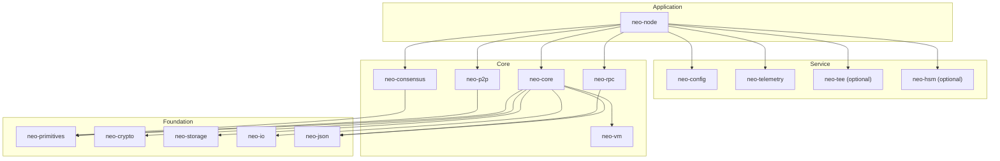
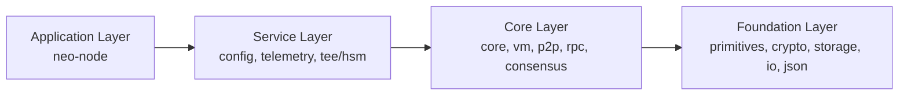
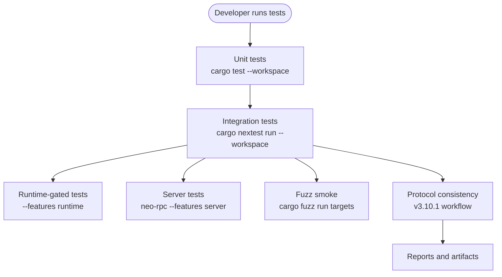
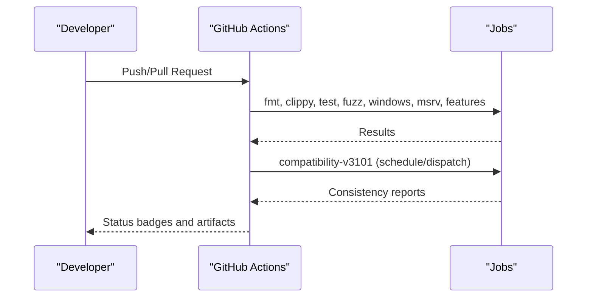
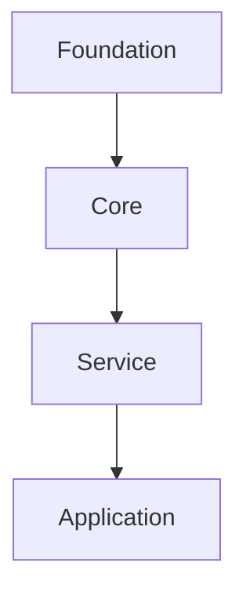

# Development Guide

<cite>
**Referenced Files in This Document**
- [Cargo.toml](file://Cargo.toml)
- [README.md](file://README.md)
- [CONTRIBUTING.md](file://CONTRIBUTING.md)
- [Makefile](file://Makefile)
- [ARCHITECTURE.md](file://ARCHITECTURE.md)
- [docs/STYLE.md](file://docs/STYLE.md)
- [rustfmt.toml](file://rustfmt.toml)
- [.github/workflows/ci.yml](file://.github/workflows/ci.yml)
- [.github/workflows/compatibility-v3101.yml](file://.github/workflows/compatibility-v3101.yml)
- [.github/workflows/release.yml](file://.github/workflows/release.yml)
- [neo_mainnet_node.toml](file://neo_mainnet_node.toml)
- [scripts/profiling/cpu-profile.sh](file://scripts/profiling/cpu-profile.sh)
- [docs/profiling.md](file://docs/profiling.md)
</cite>

## Table of Contents
1. Introduction
2. Project Structure
3. Core Components
4. Architecture Overview
5. Detailed Component Analysis
6. Dependency Analysis
7. Performance Considerations
8. Troubleshooting Guide
9. Conclusion
10. Appendices

## Introduction
This guide explains how to set up a development environment, build and run Neo-RS, write and run tests, follow coding standards, profile and debug performance, and contribute via pull requests with continuous integration. It is intended for contributors who want to add features, fix bugs, or improve the node while maintaining protocol compatibility and code quality.

## Project Structure
Neo-RS is a Rust workspace with layered crates:
- Foundation layer: primitives, crypto, storage traits, IO, JSON
- Core layer: VM, core protocol, P2P, RPC, consensus
- Service layer: configuration, telemetry, optional TEE/HSM integrations
- Application layer: neo-node daemon

The workspace manifest defines members, default members, versions, MSRV, profiles, and shared dependencies. The README provides quick start commands for building, running, and querying the node. The Makefile centralizes common tasks (build, test, format, lint, Docker, compose).

**Diagram sources**
- [Cargo.toml:1-68](file://Cargo.toml#L1-L68)
- [ARCHITECTURE.md:30-114](file://ARCHITECTURE.md#L30-L114)

**Section sources**
- [Cargo.toml:1-112](file://Cargo.toml#L1-L112)
- [README.md:13-28](file://README.md#L13-L28)
- [Makefile:25-79](file://Makefile#L25-L79)

## Core Components
- neo-node: entrypoint binary that wires networking, RPC, consensus, storage, and services based on TOML configuration.
- neo-core: protocol implementation (blocks, transactions, contracts, wallets, services).
- neo-vm: virtual machine runtime used by core for smart contract execution.
- neo-p2p: peer-to-peer messaging and handshake.
- neo-rpc: JSON-RPC server and client.
- neo-consensus: dBFT consensus service.
- neo-config: configuration parsing and presets.
- neo-telemetry: metrics, logging, health endpoints.
- Optional integrations: neo-tee (TEE), neo-hsm (HSM).

Development tips:
- Use feature flags to include optional capabilities (e.g., full RocksDB backend, tee, hsm).
- Validate configurations before starting the node using provided CLI checks.
- Prefer targeted crate builds/tests during iteration.

**Section sources**
- [ARCHITECTURE.md:120-164](file://ARCHITECTURE.md#L120-L164)
- [README.md:189-227](file://README.md#L189-L227)
- [neo_mainnet_node.toml:1-67](file://neo_mainnet_node.toml#L1-L67)

## Architecture Overview
Neo-RS enforces strict layering: lower layers have no upward dependencies. This ensures modularity, safety, and testability. The application layer composes services and core components; the core layer depends only on foundation types and abstractions.

**Diagram sources**
- [ARCHITECTURE.md:167-221](file://ARCHITECTURE.md#L167-L221)

**Section sources**
- [ARCHITECTURE.md:167-221](file://ARCHITECTURE.md#L167-L221)

## Detailed Component Analysis

### Build System and Feature Flags
- Workspace root Cargo.toml declares members, default members, MSRV, profiles, and shared dependency versions.
- Profiles:
  - release: high optimization, fat LTO, panic=abort, strip
  - dev: debug symbols, overflow checks
  - test: optimized enough for fast tests with debug info
  - bench: optimized for benchmarks
  - production: inherits release with stricter settings
- Features:
  - full: enables RocksDB-backed storage required by shipped configs
  - tee: optional TEE support for neo-node
  - hsm: optional HSM support for neo-node
  - runtime/server: enable specific test suites and server functionality

Recommended workflows:
- Default dev build: cargo build
- Production build: cargo build --release --features full
- Run node: cargo run -p neo-node --release --features full -- --config neo_mainnet_node.toml
- Validate config without startup: cargo run -p neo-node -- --config <path> --check-config

Cross-compilation and toolchain:
- CI pins stable toolchain and an MSRV check at 1.88.
- Windows MSVC build job exists for neo-node.
- For cross-compilation, ensure target-specific system libraries (e.g., RocksDB) are available.

**Section sources**
- [Cargo.toml:92-112](file://Cargo.toml#L92-L112)
- [Cargo.toml:251-286](file://Cargo.toml#L251-L286)
- [README.md:189-227](file://README.md#L189-L227)
- [.github/workflows/ci.yml:237-265](file://.github/workflows/ci.yml#L237-L265)
- [.github/workflows/ci.yml:195-208](file://.github/workflows/ci.yml#L195-L208)

### Testing Strategy
- Unit tests: per-crate lib tests under src and tests directories.
- Integration tests: workspace-level integration tests and scenario-based tests.
- Protocol compliance: v3.10.1 consistency workflow validates against live seeds and vectors.
- Fuzzing: bounded fuzz targets for message/script/transaction parsing.

Run locally:
- Full suite: cargo test --workspace
- Crate-specific: cargo test -p neo-core
- Runtime-gated tests: cargo nextest run -p neo-core --features runtime
- Server tests: cargo nextest run -p neo-rpc --features server
- Doctests: cargo test --workspace --doc

CI coverage:
- Format and clippy gates
- Test matrix including runtime features and full-feature builds
- Fuzz smoke tests
- MSRV validation
- Dependency policy checks (licenses, bans, advisories)
- Protocol consistency goldens and preset verification

**Diagram sources**
- [.github/workflows/ci.yml:68-149](file://.github/workflows/ci.yml#L68-L149)
- [.github/workflows/compatibility-v3101.yml:80-129](file://.github/workflows/compatibility-v3101.yml#L80-L129)

**Section sources**
- [README.md:347-367](file://README.md#L347-L367)
- [.github/workflows/ci.yml:18-149](file://.github/workflows/ci.yml#L18-L149)
- [.github/workflows/compatibility-v3101.yml:1-129](file://.github/workflows/compatibility-v3101.yml#L1-L129)

### Code Organization, Naming, and Standards
- Follow the style guide for module structure, imports, documentation, naming, visibility, formatting, error handling, testing, and unsafe usage.
- Enforce rustfmt with project settings (max width 100, import reordering, chain/array widths).
- Use thiserror for structured errors and Result propagation.
- Keep public APIs minimal; prefer private modules and pub(crate) for internal helpers.
- Maintain C# compatibility where necessary for public API names.

Pre-commit and CI:
- cargo fmt --all
- cargo clippy --workspace --all-targets -- -D warnings
- Ensure doctests pass

**Section sources**
- [docs/STYLE.md:20-105](file://docs/STYLE.md#L20-L105)
- [docs/STYLE.md:255-336](file://docs/STYLE.md#L255-L336)
- [docs/STYLE.md:427-535](file://docs/STYLE.md#L427-L535)
- [docs/STYLE.md:538-615](file://docs/STYLE.md#L538-L615)
- [docs/STYLE.md:618-720](file://docs/STYLE.md#L618-L720)
- [rustfmt.toml:1-22](file://rustfmt.toml#L1-L22)
- [CONTRIBUTING.md:9-14](file://CONTRIBUTING.md#L9-L14)

### Debugging Techniques and Profiling
- CPU profiling: use perf + flamegraph via scripts/profiling/cpu-profile.sh or manual steps.
- Memory profiling: heaptrack GUI for allocation analysis.
- Benchmarking: Criterion reports under target/criterion/report/index.html.
- Logging: configure via TOML and environment variables; use structured JSON logs in production.

Quick commands:
- CPU profile: ./scripts/profiling/cpu-profile.sh
- Memory profile: ./scripts/profiling/memory-profile.sh
- Benchmarks: ./scripts/profiling/benchmark.sh

Interpretation guidance:
- Focus on application hotspots (>1% total time).
- Watch for allocation spikes and leaks.
- Re-benchmark after changes and verify protocol compatibility.

**Section sources**
- [docs/profiling.md:1-97](file://docs/profiling.md#L1-L97)
- [scripts/profiling/cpu-profile.sh:1-24](file://scripts/profiling/cpu-profile.sh#L1-L24)

### Contribution Workflow and CI
- Pre-PR checklist: format, lint, tests, Docker/compose validation.
- Commit messages: small focused commits with descriptive messages.
- Security: report vulnerabilities privately per SECURITY.md.
- Release notes: update CHANGELOG when behavior or interfaces change.

CI pipeline highlights:
- Format and Clippy checks
- Tests with nextest, doctests
- Runtime and server feature-gated tests
- Fuzz smoke tests
- Windows MSVC build
- Full-feature node build/test
- MSRV validation
- Dependency policy checks
- Protocol consistency goldens and preset verification

Release automation:
- Tag-based Docker image publishing to GHCR with multi-platform support.

**Diagram sources**
- [.github/workflows/ci.yml:1-335](file://.github/workflows/ci.yml#L1-L335)
- [.github/workflows/compatibility-v3101.yml:1-129](file://.github/workflows/compatibility-v3101.yml#L1-L129)
- [.github/workflows/release.yml:1-49](file://.github/workflows/release.yml#L1-L49)

**Section sources**
- [CONTRIBUTING.md:1-30](file://CONTRIBUTING.md#L1-L30)
- [.github/workflows/ci.yml:18-335](file://.github/workflows/ci.yml#L18-L335)
- [.github/workflows/release.yml:1-49](file://.github/workflows/release.yml#L1-L49)

### Writing Documentation and Adding Features
- Add crate-level and item-level docs; keep examples runnable as doctests.
- When adding features:
  - Gate behind features if not always needed (e.g., tee, hsm, runtime).
  - Update configuration defaults responsibly.
  - Add unit and integration tests covering new paths.
  - If touching protocol-sensitive areas, run protocol consistency checks.
- Maintain backward compatibility:
  - Avoid breaking public APIs unless necessary; document deprecations.
  - Preserve serialization parity with C# reference where applicable.
  - Validate configs and storage connectivity before deployment.

**Section sources**
- [docs/STYLE.md:109-251](file://docs/STYLE.md#L109-L251)
- [ARCHITECTURE.md:379-430](file://ARCHITECTURE.md#L379-L430)
- [README.md:388-419](file://README.md#L388-L419)

## Dependency Analysis
Layered dependencies enforce stability and testability:
- Foundation has no neo-* dependencies.
- Core depends on Foundation.
- Services depend on Core and Foundation.
- Application depends on Services and Core.

**Diagram sources**
- [ARCHITECTURE.md:167-221](file://ARCHITECTURE.md#L167-L221)

**Section sources**
- [ARCHITECTURE.md:167-221](file://ARCHITECTURE.md#L167-L221)

## Performance Considerations
- Use release or production profiles for performance-sensitive workloads.
- Profile with perf and flamegraphs; analyze memory with heaptrack.
- Benchmark critical paths with Criterion; compare before/after.
- Tune OS limits (nofile, nproc) and storage backends (RocksDB) for production.
- Monitor metrics and health endpoints; integrate with Prometheus/Grafana.

[No sources needed since this section provides general guidance]

## Troubleshooting Guide
Common issues and resolutions:
- Build fails due to missing RocksDB headers: install librocksdb-dev and rebuild.
- Config validation fails: use --check-config to validate TOML sections and values.
- Storage connectivity issues: use --check-storage to verify backend access.
- RPC hardening: enable auth and disable CORS for production; expose via reverse proxy.
- Logs and data paths: ensure directories exist and are writable; adjust logging path in config.

Useful commands:
- cargo run -p neo-node -- --config neo_mainnet_node.toml --check-all
- cargo fmt --all && cargo clippy --workspace --all-targets -- -D warnings
- cargo test --workspace

**Section sources**
- [README.md:213-252](file://README.md#L213-L252)
- [Makefile:206-225](file://Makefile#L206-L225)
- [neo_mainnet_node.toml:27-37](file://neo_mainnet_node.toml#L27-L37)

## Conclusion
Neo-RS provides a robust, layered architecture with strong tooling for building, testing, profiling, and contributing safely. Follow the style guide, leverage feature flags, run the full test and protocol consistency suites, and use CI feedback to maintain quality and compatibility. For operations and advanced topics, consult the linked documentation and scripts.

[No sources needed since this section summarizes without analyzing specific files]

## Appendices

### Quick Commands Reference
- Build: cargo build / cargo build --release --features full
- Run: cargo run -p neo-node --release --features full -- --config neo_mainnet_node.toml
- Test: cargo test --workspace
- Format/Lint: cargo fmt --all && cargo clippy --workspace --all-targets -- -D warnings
- Docs: cargo doc --workspace --no-deps --open
- Docker: make docker / make docker-run
- Compose: make compose-up / make compose-down

**Section sources**
- [README.md:189-227](file://README.md#L189-L227)
- [Makefile:81-131](file://Makefile#L81-L131)