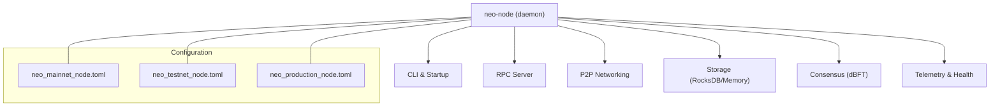
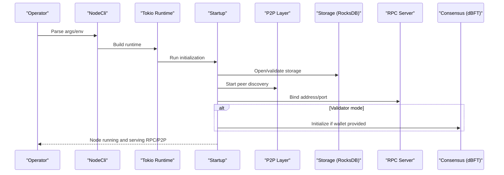
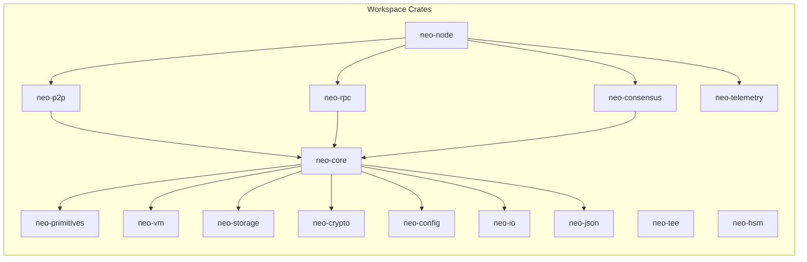

# Getting Started

<cite>
**Referenced Files in This Document**
- [README.md](file://README.md)
- [Cargo.toml](file://Cargo.toml)
- [neo-node/README.md](file://neo-node/README.md)
- [Dockerfile](file://Dockerfile)
- [docker-compose.yml](file://docker-compose.yml)
- [neo_mainnet_node.toml](file://neo_mainnet_node.toml)
- [neo_testnet_node.toml](file://neo_testnet_node.toml)
- [neo_production_node.toml](file://neo_production_node.toml)
- [neo-node/src/cli.rs](file://neo-node/src/cli.rs)
- [neo-node/src/main.rs](file://neo-node/src/main.rs)
- [scripts/docker-entrypoint.sh](file://scripts/docker-entrypoint.sh)
- [docs/DEPLOYMENT.md](file://docs/DEPLOYMENT.md)
</cite>

## Table of Contents
1. [Introduction](#introduction)
2. [Project Structure](#project-structure)
3. [Core Components](#core-components)
4. [Architecture Overview](#architecture-overview)
5. [Detailed Component Analysis](#detailed-component-analysis)
6. [Dependency Analysis](#dependency-analysis)
7. [Performance Considerations](#performance-considerations)
8. [Troubleshooting Guide](#troubleshooting-guide)
9. [Conclusion](#conclusion)
10. [Appendices](#appendices)

## Introduction
Neo-RS is a professional Rust implementation of the Neo N3 blockchain protocol. It provides a production-grade node daemon that synchronizes with the Neo network and exposes a JSON-RPC API for querying state, blocks, and contracts. The project includes ready-to-use configurations for MainNet and TestNet, Docker support, and extensive CLI options for configuration validation and operational checks.

This guide helps you install prerequisites, build from source (development vs production), run nodes on MainNet and TestNet, validate configuration, perform basic RPC queries, understand full nodes versus validators, deploy via Docker, and troubleshoot common issues.

## Project Structure
At a high level, the repository is organized into crates that implement the Neo N3 protocol stack and the node application:
- Foundation layer: primitives, config, crypto, storage abstractions, IO, JSON
- Core layer: VM, core protocol logic, P2P networking, RPC server, consensus
- Application layer: neo-node daemon, startup, CLI, health, metrics, wallet integration
- Configuration files: mainnet, testnet, production templates
- Docker assets: multi-stage Dockerfile and compose file for containerized deployment

**Diagram sources**
- [neo-node/src/main.rs:1-79](file://neo-node/src/main.rs#L1-L79)
- [neo-node/src/cli.rs:1-239](file://neo-node/src/cli.rs#L1-L239)
- [neo_mainnet_node.toml:1-67](file://neo_mainnet_node.toml#L1-L67)
- [neo_testnet_node.toml:1-96](file://neo_testnet_node.toml#L1-L96)
- [neo_production_node.toml:1-61](file://neo_production_node.toml#L1-L61)

**Section sources**
- [README.md:93-112](file://README.md#L93-L112)
- [Cargo.toml:1-68](file://Cargo.toml#L1-L68)

## Core Components
- Node daemon: long-running process that syncs the chain over P2P and optionally exposes JSON-RPC.
- CLI: rich set of flags and environment variables to configure storage, networking, RPC, logging, TEE/HSM, and preflight checks.
- Configuration: TOML files define network identity, storage backend, P2P peers, RPC settings, consensus toggles, telemetry, and logging.
- Storage: RocksDB is the default production backend; memory backend is available for development.
- Consensus: dBFT can be enabled for validator roles when a validator wallet is configured.

Key capabilities exposed by the CLI include:
- Config validation without starting the node
- Storage connectivity checks
- State root calculation/validation
- Hardened RPC mode
- Optional TEE and HSM integrations

**Section sources**
- [neo-node/README.md:1-45](file://neo-node/README.md#L1-L45)
- [neo-node/src/cli.rs:1-239](file://neo-node/src/cli.rs#L1-L239)
- [neo_mainnet_node.toml:1-67](file://neo_mainnet_node.toml#L1-L67)
- [neo_testnet_node.toml:1-96](file://neo_testnet_node.toml#L1-L96)
- [neo_production_node.toml:1-61](file://neo_production_node.toml#L1-L61)

## Architecture Overview
The node orchestrates several subsystems:
- CLI parses arguments and environment overrides
- Startup initializes runtime, applies configuration, and starts services
- P2P connects to seed nodes and peers to synchronize blocks
- Storage persists chain data using RocksDB (default) or memory
- RPC server exposes JSON-RPC endpoints for clients
- Consensus can be enabled for validators with a wallet
- Telemetry and health endpoints provide observability

**Diagram sources**
- [neo-node/src/main.rs:65-79](file://neo-node/src/main.rs#L65-L79)
- [neo-node/src/cli.rs:1-239](file://neo-node/src/cli.rs#L1-L239)
- [neo_mainnet_node.toml:1-67](file://neo_mainnet_node.toml#L1-L67)
- [neo_testnet_node.toml:1-96](file://neo_testnet_node.toml#L1-L96)

## Detailed Component Analysis

### Prerequisites and Installation
- Install the Rust toolchain (stable recommended).
- Install RocksDB native library for production builds using the shipped configs. On Ubuntu/Debian, install the RocksDB development package.
- Clone the repository and navigate to the project root.

Build options:
- Development build (memory storage, faster compile): `cargo build`
- Production build with RocksDB: `cargo build --release --features full`

Run the node directly:
- MainNet: `./target/release/neo-node --config neo_mainnet_node.toml`
- TestNet: `./target/release/neo-node --config neo_testnet_node.toml`
- Validate config before starting: `./target/release/neo-node --config neo_mainnet_node.toml --check-config`

Environment overrides are supported for storage path, backend, network magic, ports, connections, compression, block time, RPC bind/port/CORS/auth/TLS, logging path/level/format, state root options, health port, and more.

**Section sources**
- [README.md:15-27](file://README.md#L15-L27)
- [README.md:189-211](file://README.md#L189-L211)
- [README.md:213-258](file://README.md#L213-L258)
- [README.md:260-288](file://README.md#L260-L288)
- [Cargo.toml:251-286](file://Cargo.toml#L251-L286)

### Running Nodes: MainNet and TestNet
Use the bundled TOML files to quickly start nodes:
- MainNet configuration defines network type, magic number, storage path, P2P seeds, RPC settings, and optional consensus toggles.
- TestNet configuration mirrors similar sections tuned for development/testing.

Quick commands:
- MainNet: `./target/release/neo-node --config neo_mainnet_node.toml`
- TestNet: `./target/release/neo-node --config neo_testnet_node.toml`
- Daemon mode (minimal console output): add `--daemon`
- Override storage path: `--storage /path/to/data`
- Override backend: `--backend rocksdb` or `--backend memory`

**Section sources**
- [neo_mainnet_node.toml:1-67](file://neo_mainnet_node.toml#L1-L67)
- [neo_testnet_node.toml:1-96](file://neo_testnet_node.toml#L1-L96)
- [neo-node/README.md:19-39](file://neo-node/README.md#L19-L39)

### Essential CLI Commands
Common operations:
- Validate configuration only: `--check-config`
- Validate storage connectivity only: `--check-storage`
- Run both checks and exit: `--check-all`
- Import blocks from an offline `.acc` file (requires full feature): `--import-acc <path>`
- Enable state root calculation/validation: `--state-root` or `--stateroot`
- Set state root DB path: `--state-root-path <path>`
- Keep full historical state for proofs: `--state-root-full-state`
- Enable hardened RPC defaults: `--rpc-hardened`
- Configure health endpoints: `--health-port <port>` and `--health-max-header-lag <blocks>`
- Provide a NEP-6 wallet for validator mode: `--wallet <path>` and `--wallet-password <password>`

All CLI flags also accept environment variable overrides as documented in the CLI module.

**Section sources**
- [neo-node/src/cli.rs:188-239](file://neo-node/src/cli.rs#L188-L239)
- [README.md:236-258](file://README.md#L236-L258)

### Basic RPC Queries
Once the node is running, query it via JSON-RPC:
- Get block count: POST to the RPC port with method `getblockcount`
- Get block details: POST with method `getblock` and parameters

Example endpoints:
- MainNet RPC port defaults to 10332
- TestNet RPC port defaults to 20332

You can use curl or any JSON-RPC client library.

**Section sources**
- [README.md:63-78](file://README.md#L63-L78)
- [neo_mainnet_node.toml:27-37](file://neo_mainnet_node.toml#L27-L37)
- [neo_testnet_node.toml:63-71](file://neo_testnet_node.toml#L63-L71)

### Full Nodes vs Validators
- Full node: Synchronizes the chain and serves RPC requests. Does not participate in consensus unless explicitly enabled.
- Validator: Participates in dBFT consensus. Requires enabling consensus in configuration and providing a validator wallet via CLI flags. When auto_start is disabled, you must call the RPC to start consensus after opening the wallet.

Validator-related flags:
- `--wallet <path>` and `--wallet-password <password>`
- Consensus toggles in configuration: `enabled`, `auto_start`

**Section sources**
- [neo-node/README.md:41-45](file://neo-node/README.md#L41-L45)
- [neo_mainnet_node.toml:39-41](file://neo_mainnet_node.toml#L39-L41)
- [neo_testnet_node.toml:73-75](file://neo_testnet_node.toml#L73-L75)
- [neo-node/src/cli.rs:231-237](file://neo-node/src/cli.rs#L231-L237)

### Docker Deployment
Containerized deployment is supported with a multi-stage Dockerfile and a compose file:
- Build image: `docker build -t neo-rs .`
- Run TestNet with persistent volume: map `/data` and set `NEO_NETWORK=testnet`
- Run MainNet: set `NEO_NETWORK=mainnet` and expose appropriate ports
- Environment variables control network selection, storage path, backend, plugins directory, RPC port, listen port, and logging
- Health check uses JSON-RPC `getversion` on the detected RPC port

Compose usage:
- Start node: `docker compose up -d neo-node`
- Monitoring profile: `docker compose --profile monitoring up -d`

Entrypoint behavior:
- Chooses config based on `NEO_NETWORK`
- Ensures storage and plugins directories exist and are writable
- Detects RPC port from config or defaults
- Forwards additional CLI arguments to the node

**Section sources**
- [Dockerfile:1-129](file://Dockerfile#L1-L129)
- [docker-compose.yml:1-183](file://docker-compose.yml#L1-L183)
- [scripts/docker-entrypoint.sh:1-111](file://scripts/docker-entrypoint.sh#L1-L111)
- [README.md:290-315](file://README.md#L290-L315)

## Dependency Analysis
The workspace defines internal crates and external dependencies:
- Internal crates include primitives, config, crypto, storage, IO, JSON, VM, core, P2P, RPC, consensus, TEE, HSM, telemetry, and the node daemon
- External dependencies include async runtime, serialization, error handling, logging, CLI parsing, cryptography libraries, storage backends, and metrics
- Release profiles optimize for performance and size; a custom production profile further tunes optimizations

Feature flags:
- `full`: Enables RocksDB-backed storage required by shipped configs
- Optional features like `tee` and `hsm` enable advanced security integrations

**Diagram sources**
- [Cargo.toml:1-68](file://Cargo.toml#L1-L68)
- [Cargo.toml:113-139](file://Cargo.toml#L113-L139)

**Section sources**
- [Cargo.toml:1-68](file://Cargo.toml#L1-L68)
- [Cargo.toml:113-139](file://Cargo.toml#L113-L139)
- [Cargo.toml:251-286](file://Cargo.toml#L251-L286)

## Performance Considerations
- Use release or production profiles for optimized binaries
- Ensure RocksDB is built with compression libraries (snappy, lz4, zstd) for efficient storage
- Tune OS limits (nofile, nproc) and run under a service manager with restart policies
- Monitor disk I/O and use fast SSD/NVMe storage for RocksDB
- Adjust connection limits and broadcast history based on network conditions
- Enable metrics and health endpoints for observability

[No sources needed since this section provides general guidance]

## Troubleshooting Guide
Common setup issues and resolutions:
- Missing RocksDB native library: Install the development package for your distribution or ensure the Docker image includes required libraries
- Permission errors in storage or plugins directories: Ensure the user has write access to mounted volumes; the entrypoint validates writability and exits early with clear messages
- Port conflicts: Override RPC and P2P ports via CLI flags or environment variables
- Configuration errors: Use `--check-config` and `--check-storage` to validate settings before starting
- Read-only storage: Use read-only mode only for offline checks; the node refuses to start in read-only mode
- Health checks failing: Verify RPC port detection and network exposure; health checks call `getversion` on the configured port

Operational tips:
- Back up RocksDB data regularly and stop the node during backups
- Rotate logs and set appropriate retention
- Use hardened RPC mode in production and restrict CORS and methods
- Keep peers and network magic consistent with target network

**Section sources**
- [README.md:236-258](file://README.md#L236-L258)
- [README.md:403-418](file://README.md#L403-L418)
- [scripts/docker-entrypoint.sh:68-86](file://scripts/docker-entrypoint.sh#L68-L86)
- [docs/DEPLOYMENT.md:387-404](file://docs/DEPLOYMENT.md#L387-L404)

## Conclusion
Neo-RS provides a robust, production-ready implementation of the Neo N3 protocol with flexible configuration, comprehensive CLI tools, and containerized deployment options. By following the steps in this guide, you can install prerequisites, build from source, run nodes on MainNet or TestNet, validate configuration, perform RPC queries, and operate validators or full nodes. For advanced usage, explore TEE/HSM integrations, metrics, and monitoring profiles.

[No sources needed since this section summarizes without analyzing specific files]

## Appendices

### Quick Reference: Build and Run
- Development build: `cargo build`
- Production build: `cargo build --release --features full`
- Run MainNet: `./target/release/neo-node --config neo_mainnet_node.toml`
- Run TestNet: `./target/release/neo-node --config neo_testnet_node.toml`
- Validate config: `./target/release/neo-node --config neo_mainnet_node.toml --check-config`
- Validate storage: `./target/release/neo-node --config neo_mainnet_node.toml --check-storage`
- Run all checks: `./target/release/neo-node --config neo_mainnet_node.toml --check-all`

**Section sources**
- [README.md:15-27](file://README.md#L15-L27)
- [README.md:213-258](file://README.md#L213-L258)

### Docker Quick Start
- Build image: `docker build -t neo-rs .`
- Run TestNet: `docker run -d --name neo-node -p 20332:20332 -p 20333:20333 -v $(pwd)/data:/data -e NEO_NETWORK=testnet neo-rs`
- Run MainNet: set `NEO_NETWORK=mainnet` and expose 10332/10333
- Compose: `docker compose up -d neo-node`

**Section sources**
- [README.md:290-315](file://README.md#L290-L315)
- [docker-compose.yml:1-183](file://docker-compose.yml#L1-L183)
- [scripts/docker-entrypoint.sh:1-111](file://scripts/docker-entrypoint.sh#L1-L111)