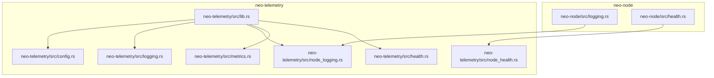
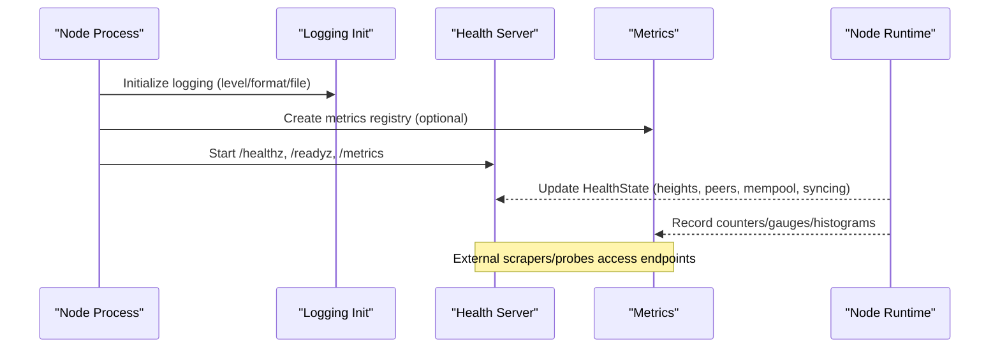
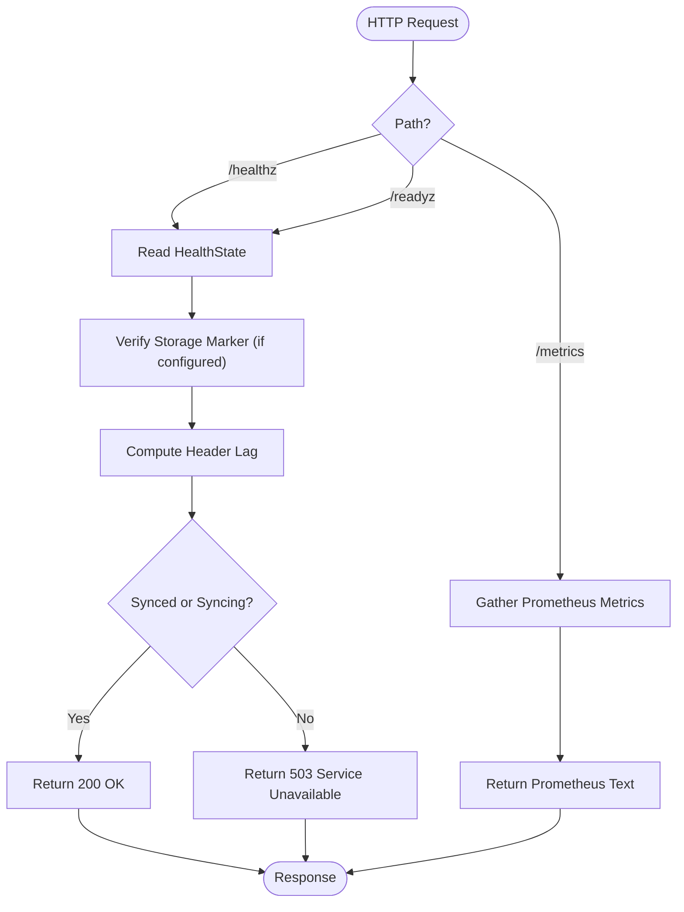
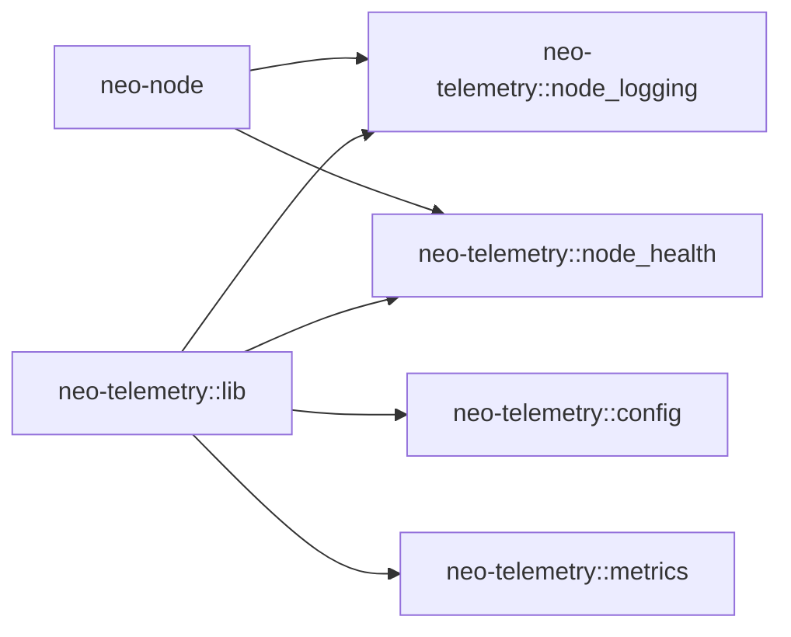

# Logging & Diagnostics

<cite>
**Referenced Files in This Document**
- [logging.rs](file://neo-node/src/logging.rs)
- [lib.rs](file://neo-telemetry/src/lib.rs)
- [logging.rs](file://neo-telemetry/src/logging.rs)
- [node_logging.rs](file://neo-telemetry/src/node_logging.rs)
- [config.rs](file://neo-telemetry/src/config.rs)
- [health.rs](file://neo-telemetry/src/health.rs)
- [metrics.rs](file://neo-telemetry/src/metrics.rs)
- [node_health.rs](file://neo-telemetry/src/node_health.rs)
- [health.rs](file://neo-node/src/health.rs)
- [local.toml](file://config/local.toml)
- [neo_production_node.toml](file://neo_production_node.toml)
- [neo_mainnet_node.toml](file://neo_mainnet_node.toml)
- [MONITORING.md](file://docs/MONITORING.md)
</cite>

## Table of Contents
1. Introduction
2. Project Structure
3. Core Components
4. Architecture Overview
5. Detailed Component Analysis
6. Dependency Analysis
7. Performance Considerations
8. Troubleshooting Guide
9. Conclusion
10. Appendices

## Introduction
This document explains how Neo-RS implements logging and diagnostics for production operations. It covers structured logging configuration (JSON, text, pretty), log levels, output destinations (console and file), health check endpoints, node status information, runtime inspection via metrics, and practical guidance for log correlation, request tracing, and debugging in production. It also includes examples of configuring different outputs and integrating with Prometheus/Grafana and log management systems.

## Project Structure
Neo-RS separates logging and telemetry into a dedicated crate (neo-telemetry) and integrates it into the node (neo-node). The key pieces are:
- Structured logging initialization and formats
- Node-specific logging with file output and daemon mode
- Health endpoints (/healthz, /readyz) and metrics endpoint (/metrics)
- Configuration types for both logging and telemetry

**Diagram sources**
- [logging.rs](file://neo-node/src/logging.rs)
- [health.rs](file://neo-node/src/health.rs)
- [lib.rs](file://neo-telemetry/src/lib.rs)
- [config.rs](file://neo-telemetry/src/config.rs)
- [logging.rs](file://neo-telemetry/src/logging.rs)
- [node_logging.rs](file://neo-telemetry/src/node_logging.rs)
- [health.rs](file://neo-telemetry/src/health.rs)
- [metrics.rs](file://neo-telemetry/src/metrics.rs)
- [node_health.rs](file://neo-telemetry/src/node_health.rs)

**Section sources**
- [lib.rs](file://neo-telemetry/src/lib.rs)
- [config.rs](file://neo-telemetry/src/config.rs)

## Core Components
- Structured logging: supports JSON, text, pretty, and compact formats; configurable level and target inclusion; optional file output with non-blocking writer.
- Node logging: combines console and file writers; supports daemon mode to suppress console output; creates daily default log files when a directory is provided.
- Health subsystem: provides liveness/readiness checks and an HTTP server exposing /healthz, /readyz, and /metrics.
- Metrics: Prometheus-compatible metrics registry and gatherer; optional HTTP server for scraping.

Key capabilities:
- Log filtering by level and module via environment filter.
- File-based logging with append semantics and non-blocking I/O.
- Health state including block/header heights, peer count, mempool size, syncing flag, and header lag thresholds.
- Metrics covering blockchain, network, consensus, system, and RPC domains.

**Section sources**
- [logging.rs](file://neo-telemetry/src/logging.rs)
- [node_logging.rs](file://neo-telemetry/src/node_logging.rs)
- [health.rs](file://neo-telemetry/src/health.rs)
- [metrics.rs](file://neo-telemetry/src/metrics.rs)
- [node_health.rs](file://neo-telemetry/src/node_health.rs)
- [config.rs](file://neo-telemetry/src/config.rs)

## Architecture Overview
The node initializes logging and telemetry at startup, optionally enabling file output and metrics. A lightweight HTTP server exposes health and metrics endpoints. Runtime components update health state and metrics as the node processes blocks, transactions, and network events.

**Diagram sources**
- [lib.rs](file://neo-telemetry/src/lib.rs)
- [node_logging.rs](file://neo-telemetry/src/node_logging.rs)
- [node_health.rs](file://neo-telemetry/src/node_health.rs)
- [metrics.rs](file://neo-telemetry/src/metrics.rs)

## Detailed Component Analysis

### Structured Logging Configuration
- Formats: text, compact, json, pretty.
- Level: trace, debug, info, warn, error; can be overridden via environment filter.
- Output destinations:
  - Console (stderr) when enabled and not in daemon mode.
  - File: append-only; if a directory is given, a daily-named file is created inside it.
- Non-blocking writer ensures high-throughput logging without blocking critical paths.
- ANSI colors are applied only when appropriate (e.g., console-only scenarios).

Configuration options include level, format, file path, console toggle, color, and whether to include target/location in logs.

**Section sources**
- [logging.rs](file://neo-telemetry/src/logging.rs)
- [node_logging.rs](file://neo-telemetry/src/node_logging.rs)
- [config.rs](file://neo-telemetry/src/config.rs)

### File-Based Logging and Rotation
- File creation:
  - If the configured path is a file or ends with an extension, that file is used.
  - If it is a directory, a daily log file named with the current date is created under it.
- Append mode is used to avoid overwriting existing logs.
- Rotation policy:
  - Built-in rotation is not implemented in the logging modules; daily naming helps organize logs.
  - For rotation and retention, use external tools (e.g., logrotate) or container orchestration policies.
- Retention strategy:
  - Configure your log shipper or OS-level rotation to retain logs for the required period.
  - Example configurations in repository show max_file_size and max_files fields; these are documented but not enforced by the logging modules themselves.

**Section sources**
- [node_logging.rs](file://neo-telemetry/src/node_logging.rs)
- [local.toml](file://config/local.toml)
- [neo_production_node.toml](file://neo_production_node.toml)
- [neo_mainnet_node.toml](file://neo_mainnet_node.toml)

### Health Check Endpoints and Node Status
Endpoints exposed by the health server:
- GET /healthz: Liveness/readiness with overall status, version, RPC enabled flag, storage readiness, block/header heights, peer count, mempool size, syncing flag, and header lag.
- GET /readyz: Same payload; typically used for readiness probes.
- GET /metrics: Prometheus text-format metrics.

Health determination:
- Storage readiness checks a VERSION marker file when a storage path is configured.
- Synced status depends on header lag vs. a configurable maximum threshold.
- Overall status is ok unless storage is not ready or the node is not synced and not currently syncing.

**Diagram sources**
- [node_health.rs](file://neo-telemetry/src/node_health.rs)

**Section sources**
- [node_health.rs](file://neo-telemetry/src/node_health.rs)
- [health.rs](file://neo-node/src/health.rs)

### Metrics and Runtime Inspection
- Metrics registry includes gauges, counters, and histograms for:
  - Blockchain: block height, blocks processed, block processing time.
  - Transactions: processed count, mempool size, transaction processing time.
  - Network: connected peers, messages received/sent, bytes in/out.
  - Consensus: view number, round time.
  - System: memory usage, CPU usage, disk usage.
  - RPC: requests, duration, errors.
- Metrics can be scraped from /metrics when enabled.
- The node updates health state and metrics during normal operation to reflect current runtime conditions.

**Section sources**
- [metrics.rs](file://neo-telemetry/src/metrics.rs)
- [node_health.rs](file://neo-telemetry/src/node_health.rs)

### Log Correlation and Request Tracing
- Use structured JSON logs to include contextual fields such as component, module, and request identifiers where applicable.
- Leverage span events (NEW/CLOSE) to correlate related operations across components.
- Combine health and metrics data with logs to build end-to-end traces:
  - Tag log entries with request IDs or transaction hashes when available.
  - Correlate spikes in RPC errors or latency with health state changes.

[No sources needed since this section provides general guidance]

### Debugging Approaches in Production
- Enable higher verbosity temporarily via environment filter to capture detailed traces around failures.
- Use /healthz and /readyz to validate service state and sync status.
- Scrape /metrics to identify performance bottlenecks (e.g., slow block processing, high RPC latency).
- Ship logs to a centralized system and set alerts on error rates, restarts, and sync gaps.

**Section sources**
- [node_health.rs](file://neo-telemetry/src/node_health.rs)
- [metrics.rs](file://neo-telemetry/src/metrics.rs)
- [MONITORING.md](file://docs/MONITORING.md)

## Dependency Analysis
- neo-node delegates logging to neo-telemetry’s node-specific logger and uses neo-telemetry’s health server for HTTP endpoints.
- neo-telemetry composes:
  - Config types for logging and telemetry.
  - Basic logging init and node-specific logging with file support.
  - Health check primitives and HTTP server.
  - Prometheus metrics registry and gatherer.

**Diagram sources**
- [lib.rs](file://neo-telemetry/src/lib.rs)
- [node_logging.rs](file://neo-telemetry/src/node_logging.rs)
- [node_health.rs](file://neo-telemetry/src/node_health.rs)
- [config.rs](file://neo-telemetry/src/config.rs)
- [metrics.rs](file://neo-telemetry/src/metrics.rs)

**Section sources**
- [lib.rs](file://neo-telemetry/src/lib.rs)

## Performance Considerations
- Prefer JSON logs in production for efficient parsing and lower overhead compared to pretty-printed formats.
- Use non-blocking file writers to avoid blocking hot paths.
- Limit include_location and span events in high-throughput environments to reduce overhead.
- Tune log levels per environment: debug/trace for development, info/warn for production.
- Monitor metrics like block processing time and RPC latency to detect regressions early.

[No sources needed since this section provides general guidance]

## Troubleshooting Guide
Common issues and resolutions:
- No logs appearing:
  - Ensure logging is active and level is appropriate.
  - Verify file path permissions and that directories exist.
  - In daemon mode, console output is suppressed; rely on file output.
- Logs not rotating:
  - Implement external rotation (e.g., logrotate) based on file size or age.
  - Use daily file naming to simplify rotation policies.
- Health endpoint returns degraded:
  - Check header lag against configured maximum.
  - Verify storage marker presence and version match when storage path is configured.
- Metrics not available:
  - Confirm metrics are enabled and the server is started.
  - Ensure firewall or network policies allow scraping.

**Section sources**
- [node_logging.rs](file://neo-telemetry/src/node_logging.rs)
- [node_health.rs](file://neo-telemetry/src/node_health.rs)
- [metrics.rs](file://neo-telemetry/src/metrics.rs)

## Conclusion
Neo-RS provides a robust observability stack centered on structured logging, health endpoints, and Prometheus metrics. By configuring logging formats and levels appropriately, shipping logs centrally, and exposing health and metrics endpoints, operators can effectively monitor and troubleshoot nodes in production. Combining health state, metrics, and correlated logs enables fast diagnosis and proactive alerting.

[No sources needed since this section summarizes without analyzing specific files]

## Appendices

### Configuration Examples
- Local development:
  - Enable metrics on a local port, set logging level to debug, and choose pretty format for readability.
  - Direct logs to a local directory for easy inspection.
- Production:
  - Set logging level to info and format to JSON.
  - Configure file path for persistent logs and plan external rotation/retention.
  - Disable metrics if not needed, or expose them securely behind internal networks.

**Section sources**
- [local.toml](file://config/local.toml)
- [neo_production_node.toml](file://neo_production_node.toml)
- [neo_mainnet_node.toml](file://neo_mainnet_node.toml)

### Integrating with Log Management Systems
- ELK Stack:
  - Ship JSON logs to Elasticsearch using Filebeat or Fluent Bit.
  - Index by service name and host; create dashboards for error rates and latency.
- Splunk:
  - Forward logs via Splunk Universal Forwarder or HTTP Event Collector.
  - Build alerts on error patterns and sync gaps.
- Prometheus/Grafana:
  - Scrape /metrics from the node or sidecar.
  - Create dashboards for block height, peer counts, RPC latency, and system resources.

[No sources needed since this section provides general guidance]