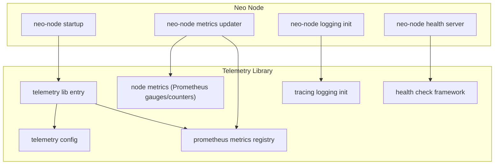
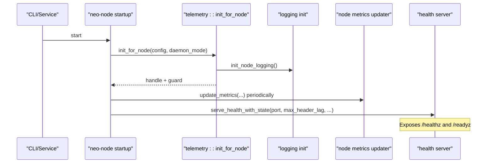
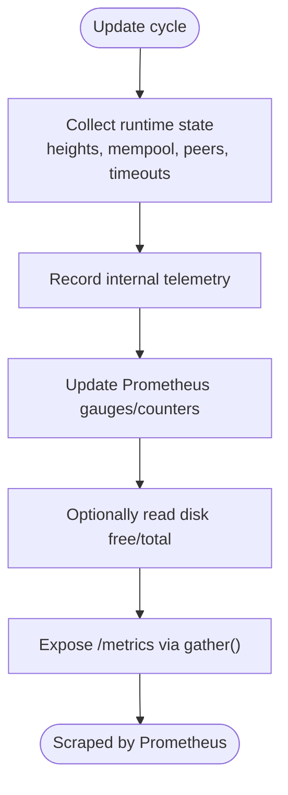
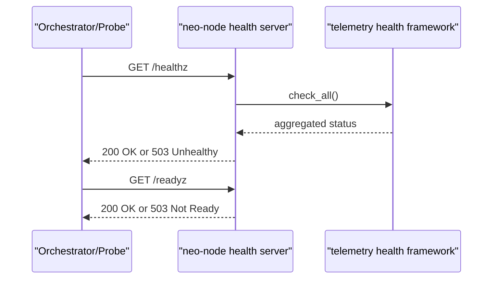
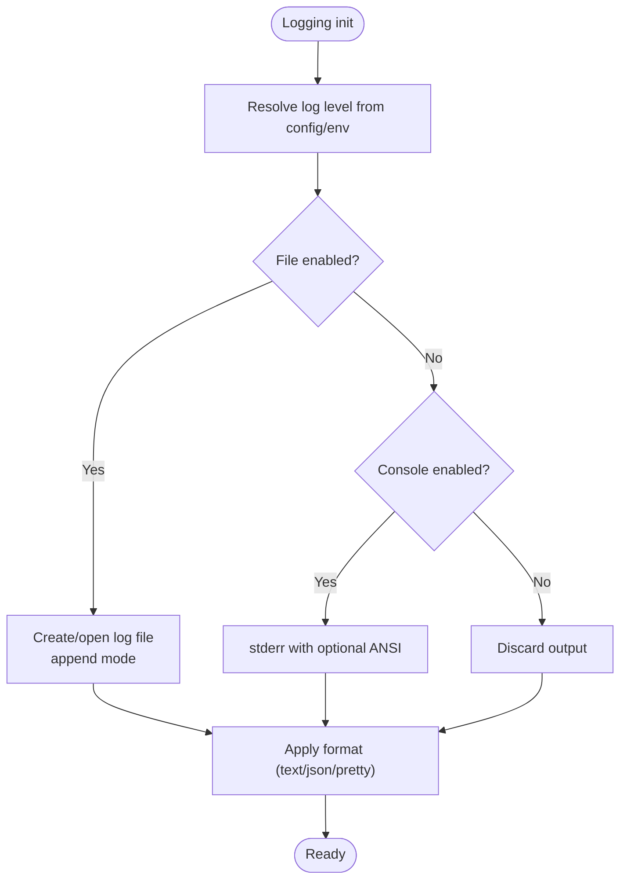
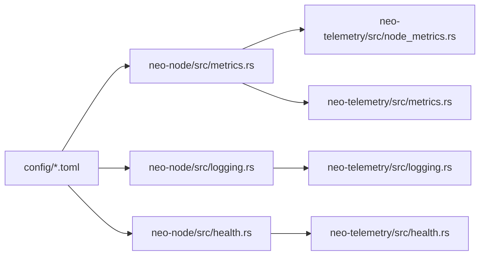

# Monitoring & Operations

<cite>
**Referenced Files in This Document**
- [MONITORING.md](file://docs/MONITORING.md)
- [OPERATIONS.md](file://docs/OPERATIONS.md)
- [lib.rs](file://neo-telemetry/src/lib.rs)
- [config.rs](file://neo-telemetry/src/config.rs)
- [metrics.rs](file://neo-telemetry/src/metrics.rs)
- [node_metrics.rs](file://neo-telemetry/src/node_metrics.rs)
- [health.rs](file://neo-telemetry/src/health.rs)
- [logging.rs](file://neo-telemetry/src/logging.rs)
- [metrics.rs](file://neo-node/src/metrics.rs)
- [logging.rs](file://neo-node/src/logging.rs)
- [health.rs](file://neo-node/src/health.rs)
- [mod.rs](file://neo-node/src/startup/mod.rs)
- [local.toml](file://config/local.toml)
- [mainnet.toml](file://config/mainnet.toml)
</cite>

## Table of Contents
1. Introduction
2. Project Structure
3. Core Components
4. Architecture Overview
5. Detailed Component Analysis
6. Dependency Analysis
7. Performance Considerations
8. Troubleshooting Guide
9. Conclusion
10. Appendices

## Introduction
This document provides comprehensive monitoring and operations guidance for running a Neo-RS node in production. It covers telemetry metrics collection (Prometheus), health check endpoints, structured logging configuration, operational procedures (startup/shutdown, backups/restores, upgrades), troubleshooting, alerting strategies, dashboard setup, and runbooks for incident response, capacity planning, and scaling.

## Project Structure
The monitoring and observability stack is split across:
- neo-telemetry: shared telemetry primitives, Prometheus metrics, health checks, and logging initialization
- neo-node: node-specific wiring of metrics updates, file-based logging, and health server binding
- config: example TOML configurations enabling metrics and logging per environment
- docs: operational guidance and monitoring recommendations

**Diagram sources**
- [lib.rs:76-156](file://neo-telemetry/src/lib.rs#L76-L156)
- [config.rs:10-126](file://neo-telemetry/src/config.rs#L10-L126)
- [metrics.rs:10-222](file://neo-telemetry/src/metrics.rs#L10-L222)
- [node_metrics.rs:14-223](file://neo-telemetry/src/node_metrics.rs#L14-L223)
- [health.rs:7-128](file://neo-telemetry/src/health.rs#L7-L128)
- [logging.rs:15-77](file://neo-telemetry/src/logging.rs#L15-L77)
- [metrics.rs:26-108](file://neo-node/src/metrics.rs#L26-L108)
- [logging.rs:19-83](file://neo-node/src/logging.rs#L19-L83)
- [health.rs:12-34](file://neo-node/src/health.rs#L12-L34)

**Section sources**
- [lib.rs:76-156](file://neo-telemetry/src/lib.rs#L76-L156)
- [config.rs:10-126](file://neo-telemetry/src/config.rs#L10-L126)
- [metrics.rs:10-222](file://neo-telemetry/src/metrics.rs#L10-L222)
- [node_metrics.rs:14-223](file://neo-telemetry/src/node_metrics.rs#L14-L223)
- [health.rs:7-128](file://neo-telemetry/src/health.rs#L7-L128)
- [logging.rs:15-77](file://neo-telemetry/src/logging.rs#L15-L77)
- [metrics.rs:26-108](file://neo-node/src/metrics.rs#L26-L108)
- [logging.rs:19-83](file://neo-node/src/logging.rs#L19-L83)
- [health.rs:12-34](file://neo-node/src/health.rs#L12-L34)

## Core Components
- Telemetry initialization: single entry point to initialize logging and optional metrics; supports node-specific initialization with file-backed logging and daemon mode.
- Prometheus metrics: global gauges/counters for blockchain state, mempool, P2P timeouts, storage disk usage, and state root ingestion counters; gatherable in Prometheus text format.
- Health checks: composable health framework with component-level status aggregation; node exposes /healthz and /readyz via a dedicated server.
- Logging: structured logging via tracing with configurable level, format (text/json/pretty), console/file output, and ANSI control; file rotation defaults are provided by configuration fields.

Key capabilities:
- Metrics enabled/disabled via configuration; default ports and bind addresses are defined.
- Health endpoint supports header lag thresholds to fail readiness when sync lags.
- Logging supports JSON output for machine parsing and file append with daily naming.

**Section sources**
- [lib.rs:76-156](file://neo-telemetry/src/lib.rs#L76-L156)
- [config.rs:10-126](file://neo-telemetry/src/config.rs#L10-L126)
- [metrics.rs:10-222](file://neo-telemetry/src/metrics.rs#L10-L222)
- [node_metrics.rs:14-223](file://neo-telemetry/src/node_metrics.rs#L14-L223)
- [health.rs:7-128](file://neo-telemetry/src/health.rs#L7-L128)
- [logging.rs:15-77](file://neo-telemetry/src/logging.rs#L15-L77)
- [metrics.rs:26-108](file://neo-node/src/metrics.rs#L26-L108)
- [logging.rs:19-83](file://neo-node/src/logging.rs#L19-L83)
- [health.rs:12-34](file://neo-node/src/health.rs#L12-L34)

## Architecture Overview
The node initializes telemetry and logging at startup, then periodically updates Prometheus metrics from runtime state. A lightweight HTTP server exposes health endpoints on a configured port. Logs can be written to files or stderr depending on mode and configuration.

**Diagram sources**
- [lib.rs:123-156](file://neo-telemetry/src/lib.rs#L123-L156)
- [logging.rs:19-83](file://neo-node/src/logging.rs#L19-L83)
- [metrics.rs:26-108](file://neo-node/src/metrics.rs#L26-L108)
- [health.rs:12-34](file://neo-node/src/health.rs#L12-L34)

## Detailed Component Analysis

### Prometheus Metrics Collection
- Global gauges and counters track block/header heights, mempool size, peer count, P2P handshake/read/write timeouts, local/validated state root indices, accepted/rejected state roots, and disk free/total bytes.
- The node’s metrics updater records blockchain and timeout stats into the internal telemetry system and pushes values to Prometheus gauges/counters.
- Prometheus text export is available via a gather function that serializes all registered metrics.

Operational notes:
- Enable metrics in configuration; set bind address and port.
- Scrape the metrics endpoint with Prometheus or compatible scrapers.
- Use header lag metric to detect sync issues.

**Diagram sources**
- [metrics.rs:26-108](file://neo-node/src/metrics.rs#L26-L108)
- [node_metrics.rs:134-223](file://neo-telemetry/src/node_metrics.rs#L134-L223)
- [metrics.rs:211-222](file://neo-telemetry/src/metrics.rs#L211-L222)

**Section sources**
- [metrics.rs:26-108](file://neo-node/src/metrics.rs#L26-L108)
- [node_metrics.rs:14-223](file://neo-telemetry/src/node_metrics.rs#L14-L223)
- [metrics.rs:211-222](file://neo-telemetry/src/metrics.rs#L211-L222)

### Health Check Endpoints
- Health framework defines statuses (healthy, degraded, unhealthy) and aggregates component results.
- Node binds an HTTP server exposing /healthz and /readyz; it can enforce readiness based on header lag threshold.
- Tests verify graceful shutdown behavior when a shutdown signal is received.

Operational notes:
- Configure health port and maximum header lag.
- Use /healthz for liveness and /readyz for readiness in orchestrators.
- Combine with RPC getversion for stronger assurance if needed.

**Diagram sources**
- [health.rs:7-128](file://neo-telemetry/src/health.rs#L7-L128)
- [health.rs:12-34](file://neo-node/src/health.rs#L12-L34)

**Section sources**
- [health.rs:7-128](file://neo-telemetry/src/health.rs#L7-L128)
- [health.rs:12-34](file://neo-node/src/health.rs#L12-L34)

### Structured Logging Configuration
- Logging uses tracing with EnvFilter; supports levels (trace/debug/info/warn/error), formats (text/compact/json/pretty), console vs file output, and ANSI colors.
- File writer appends to a daily-named log file under a configured directory; directories are created automatically.
- Daemon mode disables console output unless explicitly requested.

Operational notes:
- Set log level and format in configuration; enable file output for persistent logs.
- Ensure log directory exists and is writable.
- For log rotation, configure max file size and number of files in your deployment tooling or external log rotator.

**Diagram sources**
- [logging.rs:19-83](file://neo-node/src/logging.rs#L19-L83)
- [logging.rs:15-77](file://neo-telemetry/src/logging.rs#L15-L77)

**Section sources**
- [logging.rs:19-83](file://neo-node/src/logging.rs#L19-L83)
- [logging.rs:15-77](file://neo-telemetry/src/logging.rs#L15-L77)

### Operational Procedures

#### Node Startup and Shutdown
- Startup sequence loads configuration, selects storage, initializes services, sets up signals, and performs graceful shutdown.
- Telemetry initialization includes logging and optional metrics; node-specific init adds file-backed logging and daemon support.
- Health server starts with a configurable port and header lag policy.

Runbook highlights:
- Validate configuration before starting using built-in checks.
- Confirm storage backend is reachable and writable.
- Monitor health endpoints during startup to ensure readiness.

**Section sources**
- [mod.rs:1-17](file://neo-node/src/startup/mod.rs#L1-L17)
- [lib.rs:123-156](file://neo-telemetry/src/lib.rs#L123-L156)
- [health.rs:12-34](file://neo-node/src/health.rs#L12-L34)

#### Health Monitoring
- Use /healthz and /readyz for liveness and readiness probes.
- Compare block height and header height against trusted references to detect sync gaps.
- Track peer counts, mempool size, and storage disk usage via metrics.

**Section sources**
- [health.rs:7-128](file://neo-telemetry/src/health.rs#L7-L128)
- [node_metrics.rs:14-223](file://neo-telemetry/src/node_metrics.rs#L14-L223)
- [MONITORING.md:5-18](file://docs/MONITORING.md#L5-L18)

#### Backup and Restore
- Backups: stop service, snapshot RocksDB directory; use helper scripts to automate live checkpoints and rotation.
- Restore: stop service, restore data directory, fix permissions, restart service.
- Integrity: backup metadata and checksums are validated; restored data integrity is verified.

Runbook highlights:
- Keep at least 20% free space on storage volume.
- Automate periodic snapshots and retention policies.
- Validate restores in staging before production use.

**Section sources**
- [OPERATIONS.md:17-28](file://docs/OPERATIONS.md#L17-L28)
- [backup.rs:166-201](file://neo-core/src/persistence/backup.rs#L166-L201)
- [backup.rs:366-455](file://neo-core/src/persistence/backup.rs#L366-L455)

#### Upgrade Procedures
- Backup data and configs, deploy new binaries, restart service, watch logs during catch-up, verify RPC health and height parity post-upgrade.
- If storage version differs from binary, startup will fail; use fresh path or migrate accordingly.

**Section sources**
- [OPERATIONS.md:120-124](file://docs/OPERATIONS.md#L120-L124)

### Conceptual Overview
A typical production deployment runs the node behind a reverse proxy for RPC, exposes health endpoints internally, and scrapes Prometheus metrics. Logs are shipped to a centralized log aggregator. Alerts trigger on sync lag, peer connectivity, mempool anomalies, and storage pressure.

[No sources needed since this section doesn't analyze specific files]

## Dependency Analysis
- neo-node depends on neo-telemetry for metrics, health, and logging abstractions.
- neo-node’s metrics updater bridges runtime state to Prometheus gauges/counters and internal telemetry.
- Configuration drives which features are enabled (metrics, logging format, ports).

**Diagram sources**
- [metrics.rs:26-108](file://neo-node/src/metrics.rs#L26-L108)
- [node_metrics.rs:134-223](file://neo-telemetry/src/node_metrics.rs#L134-L223)
- [metrics.rs:10-222](file://neo-telemetry/src/metrics.rs#L10-L222)
- [logging.rs:19-83](file://neo-node/src/logging.rs#L19-L83)
- [logging.rs:15-77](file://neo-telemetry/src/logging.rs#L15-L77)
- [health.rs:12-34](file://neo-node/src/health.rs#L12-L34)
- [health.rs:7-128](file://neo-telemetry/src/health.rs#L7-L128)
- [local.toml:34-45](file://config/local.toml#L34-L45)
- [mainnet.toml:40-51](file://config/mainnet.toml#L40-L51)

**Section sources**
- [metrics.rs:26-108](file://neo-node/src/metrics.rs#L26-L108)
- [node_metrics.rs:134-223](file://neo-telemetry/src/node_metrics.rs#L134-L223)
- [metrics.rs:10-222](file://neo-telemetry/src/metrics.rs#L10-L222)
- [logging.rs:19-83](file://neo-node/src/logging.rs#L19-L83)
- [logging.rs:15-77](file://neo-telemetry/src/logging.rs#L15-L77)
- [health.rs:12-34](file://neo-node/src/health.rs#L12-L34)
- [health.rs:7-128](file://neo-telemetry/src/health.rs#L7-L128)
- [local.toml:34-45](file://config/local.toml#L34-L45)
- [mainnet.toml:40-51](file://config/mainnet.toml#L40-L51)

## Performance Considerations
- Prefer JSON logging in production for efficient parsing and lower overhead than pretty printing.
- Tune mempool size and P2P connection limits according to workload and network conditions.
- Monitor disk I/O and free space; RocksDB performance degrades under disk pressure.
- Use appropriate RocksDB batch profiles for import operations; adjust flush intervals to balance durability and throughput.
- Keep process file descriptor limits high enough to avoid FD exhaustion under load.

[No sources needed since this section provides general guidance]

## Troubleshooting Guide
Common operational issues and diagnostics:
- Sync lag: compare local height to reference; adjust health thresholds; inspect peer connectivity and timeouts.
- RPC overload: increase connection limits, place behind rate-limited proxy, or move RPC to a dedicated instance.
- Disk full: expand volume, prune old backups/logs, ensure RocksDB resides on fast durable storage.
- Plugin state anomalies: list plugins via RPC only when necessary and secured.
- Storage corruption or divergence: restore from known-good backup or resync from clean storage; validate state roots continuously.

Alerting starters:
- Height lag above threshold for sustained period.
- Peer count below minimum for sustained period.
- Mempool stuck at zero or exceeding cap.
- RocksDB free space below threshold or inode pressure.
- Process FD usage approaching limit; repeated restarts.

**Section sources**
- [MONITORING.md:20-29](file://docs/MONITORING.md#L20-L29)
- [OPERATIONS.md:93-118](file://docs/OPERATIONS.md#L93-L118)

## Conclusion
Neo-RS provides a robust, production-ready observability stack with Prometheus metrics, structured logging, and health endpoints. Operators should enable metrics and health checks, configure logging for parseable output, implement automated backups and continuous state-root validation, and set up alerts and dashboards around key signals like sync lag, peer connectivity, mempool health, and storage pressure.

[No sources needed since this section summarizes without analyzing specific files]

## Appendices

### Configuration Reference
- Metrics: enable/disable, bind address, port
- Health: enable/disable, port, max header lag
- Logging: level, format, file path, console output, color, include target/location

Example snippets:
- Local development enables metrics and pretty logging with file output.
- MainNet disables metrics by default and uses JSON logging with larger rotation.

**Section sources**
- [config.rs:10-126](file://neo-telemetry/src/config.rs#L10-L126)
- [local.toml:34-45](file://config/local.toml#L34-L45)
- [mainnet.toml:40-51](file://config/mainnet.toml#L40-L51)

### Runbooks

#### Incident Response
- Out of sync: restart, verify peers/ports and network magic; if DB corrupt, restore latest good backup and resync.
- Startup failures due to integrity errors: do not keep restarting same data directory; move aside corrupted dir, restore backup or re-bootstrap.
- RPC overloaded: raise limits, add reverse proxy with rate limiting, consider dedicated RPC instance.
- Disk full: expand volume, prune backups/logs, ensure RocksDB on fast durable storage.

**Section sources**
- [OPERATIONS.md:113-118](file://docs/OPERATIONS.md#L113-L118)

#### Capacity Planning and Scaling
- Estimate disk growth based on block time and transaction volume; provision storage with headroom.
- Size CPU/memory for expected mempool and P2P concurrency; monitor process memory and CPU usage.
- Scale horizontally by adding validator nodes or separating RPC workloads.

[No sources needed since this section provides general guidance]