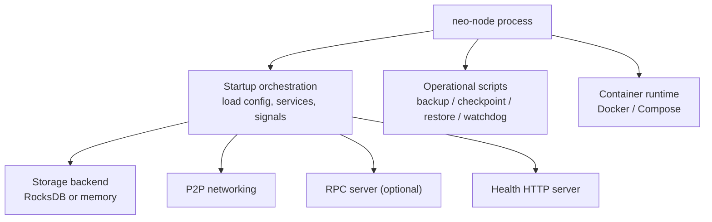
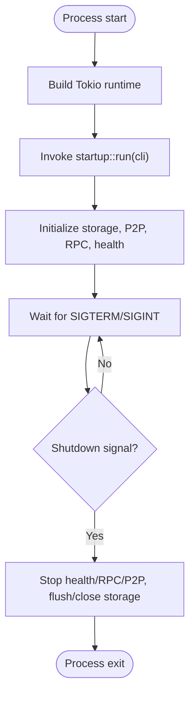
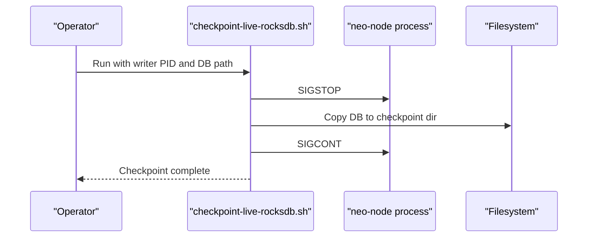
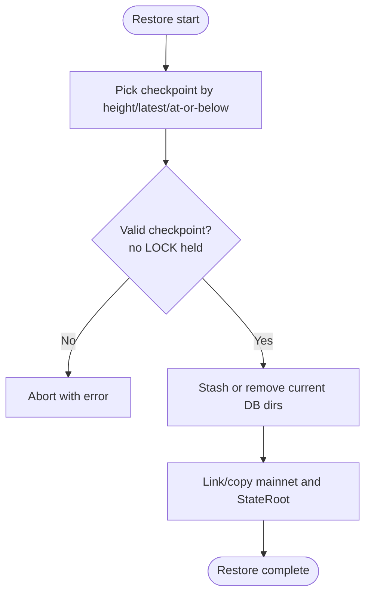
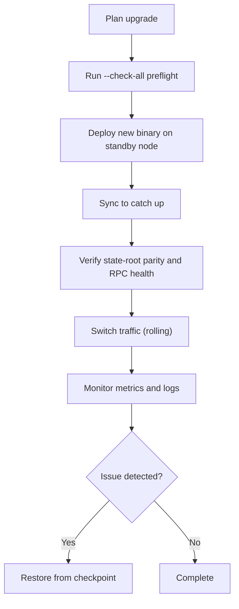
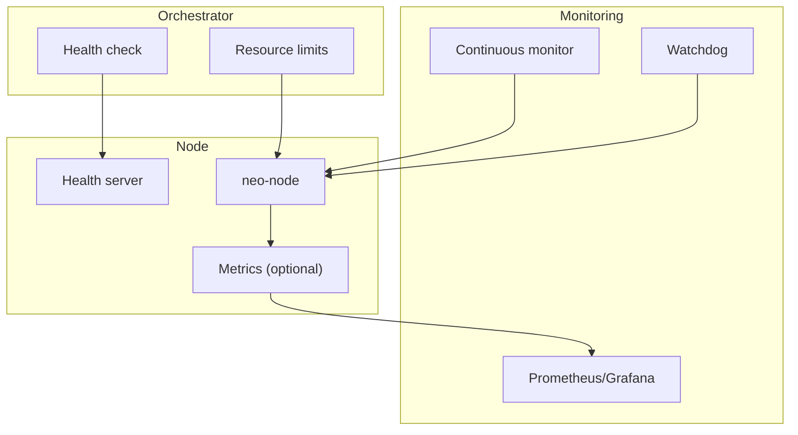
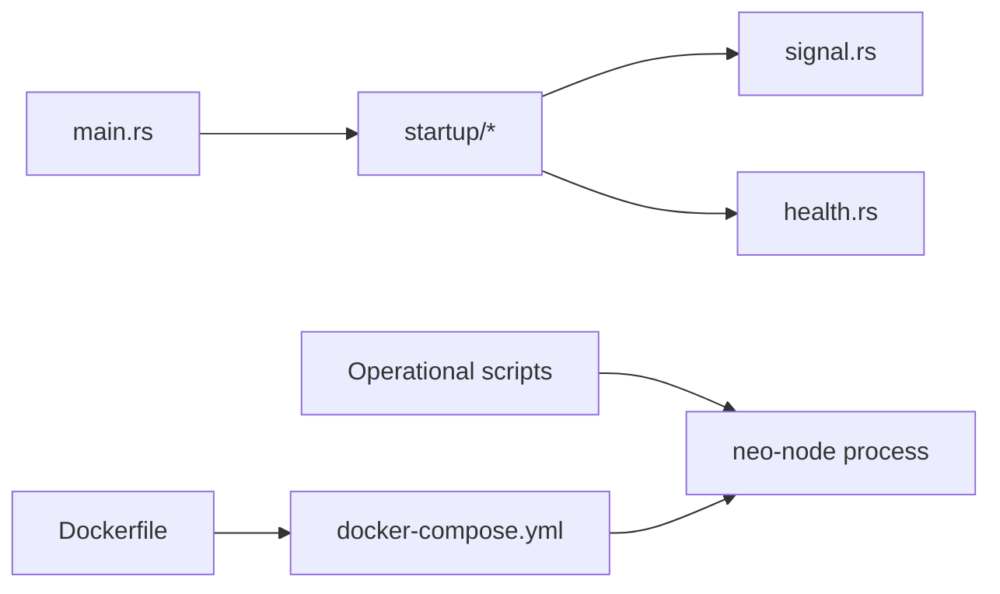

# Operational Procedures

<cite>
**Referenced Files in This Document**
- [main.rs](file://neo-node/src/main.rs)
- [startup/mod.rs](file://neo-node/src/startup/mod.rs)
- [signal.rs](file://neo-node/src/startup/signal.rs)
- [health.rs](file://neo-node/src/health.rs)
- [local.toml](file://config/local.toml)
- [mainnet.toml](file://config/mainnet.toml)
- [OPERATIONS.md](file://docs/OPERATIONS.md)
- [backup-rocksdb.sh](file://scripts/backup-rocksdb.sh)
- [checkpoint-live-rocksdb.sh](file://scripts/checkpoint-live-rocksdb.sh)
- [restore-checkpoint.sh](file://scripts/restore-checkpoint.sh)
- [neo_node_watchdog.sh](file://scripts/neo_node_watchdog.sh)
- [continuous-monitor.sh](file://scripts/continuous-monitor.sh)
- [docker-compose.yml](file://docker-compose.yml)
- [Dockerfile](file://Dockerfile)
</cite>

## Table of Contents
1. Introduction
2. Project Structure
3. Core Components
4. Architecture Overview
5. Detailed Component Analysis
6. Dependency Analysis
7. Performance Considerations
8. Troubleshooting Guide
9. Conclusion
10. Appendices

## Introduction
This document provides operational procedures for running and maintaining a Neo-RS node in production. It covers startup and shutdown, graceful termination, checkpointing, backup and restore, upgrades, capacity planning, monitoring, orchestration with Docker, and troubleshooting common issues. The guidance is grounded in the repository’s node entry point, startup orchestration, health endpoints, configuration samples, and operational scripts.

## Project Structure
The Neo-RS node is built as a long-running daemon that synchronizes the chain over P2P and optionally exposes an RPC server. Key operational concerns are implemented across:
- Node entry and runtime setup
- Startup orchestration and signal handling
- Health endpoint serving
- Configuration files for different networks
- Scripts for backups, checkpoints, restoration, watchdogs, and monitoring
- Containerization artifacts for deployment



**Diagram sources**
- [main.rs:65-79](file://neo-node/src/main.rs#L65-L79)
- [startup/mod.rs:1-17](file://neo-node/src/startup/mod.rs#L1-L17)
- [health.rs:12-34](file://neo-node/src/health.rs#L12-L34)
- [docker-compose.yml:4-113](file://docker-compose.yml#L4-L113)
- [Dockerfile:58-119](file://Dockerfile#L58-L119)

**Section sources**
- [main.rs:65-79](file://neo-node/src/main.rs#L65-L79)
- [startup/mod.rs:1-17](file://neo-node/src/startup/mod.rs#L1-L17)
- [local.toml:1-53](file://config/local.toml#L1-L53)
- [mainnet.toml:1-68](file://config/mainnet.toml#L1-L68)

## Core Components
- Node entrypoint and runtime: Initializes the Tokio runtime and delegates to startup orchestration.
- Startup module: Loads configuration, selects storage, initializes services, installs signal handlers, and coordinates graceful shutdown.
- Signal handling: Waits for SIGTERM/SIGINT and triggers shutdown flows.
- Health endpoint: Exposes /healthz and /readyz with header lag checks and storage version policy.
- Configuration: TOML-based settings for network, storage, P2P, RPC, consensus, telemetry, logging, blockchain, mempool, and state service.
- Operational scripts: Backup, live checkpoint, restore, watchdog, continuous monitoring, and validation helpers.
- Containerization: Multi-stage build and compose definitions for production deployments.

**Section sources**
- [main.rs:65-79](file://neo-node/src/main.rs#L65-L79)
- [startup/mod.rs:1-17](file://neo-node/src/startup/mod.rs#L1-L17)
- [signal.rs:1-33](file://neo-node/src/startup/signal.rs#L1-L33)
- [health.rs:12-34](file://neo-node/src/health.rs#L12-L34)
- [local.toml:1-53](file://config/local.toml#L1-L53)
- [mainnet.toml:1-68](file://config/mainnet.toml#L1-L68)
- [backup-rocksdb.sh:1-30](file://scripts/backup-rocksdb.sh#L1-L30)
- [checkpoint-live-rocksdb.sh:1-78](file://scripts/checkpoint-live-rocksdb.sh#L1-L78)
- [restore-checkpoint.sh:1-162](file://scripts/restore-checkpoint.sh#L1-L162)
- [neo_node_watchdog.sh:1-125](file://scripts/neo_node_watchdog.sh#L1-L125)
- [continuous-monitor.sh:1-54](file://scripts/continuous-monitor.sh#L1-L54)
- [docker-compose.yml:4-113](file://docker-compose.yml#L4-L113)
- [Dockerfile:58-119](file://Dockerfile#L58-L119)

## Architecture Overview
The node lifecycle begins at the main entrypoint, which constructs a multi-threaded runtime and invokes the startup runner. During startup, configuration is loaded, storage is selected, services are initialized, and signal handlers are installed. On shutdown, signals trigger graceful teardown. The health server runs alongside to expose liveness/readiness probes used by orchestrators.

```mermaid
sequenceDiagram
participant OS as "OS"
participant Main as "neo-node main"
participant Startup as "Startup runner"
participant Storage as "Storage backend"
participant P2P as "P2P service"
participant RPC as "RPC server"
participant Health as "Health server"
OS->>Main : Start process
Main->>Startup : run(cli)
Startup->>Storage : Initialize RocksDB/memory
Startup->>P2P : Start networking
Startup->>RPC : Start JSON-RPC (if enabled)
Startup->>Health : Serve /healthz and /readyz
Note over Startup,Health : Services are ready; process waits for shutdown signals
OS-->>Startup : SIGTERM/SIGINT
Startup->>Health : Stop health server
Startup->>RPC : Stop RPC server
Startup->>P2P : Stop networking
Startup->>Storage : Flush and close
Startup-->>Main : Exit
```

**Diagram sources**
- [main.rs:65-79](file://neo-node/src/main.rs#L65-L79)
- [startup/mod.rs:1-17](file://neo-node/src/startup/mod.rs#L1-L17)
- [signal.rs:8-33](file://neo-node/src/startup/signal.rs#L8-L33)
- [health.rs:12-34](file://neo-node/src/health.rs#L12-L34)

## Detailed Component Analysis

### Node Startup and Shutdown
- Startup: The main function builds a multi-threaded Tokio runtime and calls into the startup runner. Configuration loading, storage selection, service initialization, and signal handling occur here.
- Graceful shutdown: The signal handler listens for SIGTERM/SIGINT and initiates orderly shutdown of services and storage.



**Diagram sources**
- [main.rs:65-79](file://neo-node/src/main.rs#L65-L79)
- [startup/mod.rs:1-17](file://neo-node/src/startup/mod.rs#L1-L17)
- [signal.rs:8-33](file://neo-node/src/startup/signal.rs#L8-L33)

**Section sources**
- [main.rs:65-79](file://neo-node/src/main.rs#L65-L79)
- [startup/mod.rs:1-17](file://neo-node/src/startup/mod.rs#L1-L17)
- [signal.rs:8-33](file://neo-node/src/startup/signal.rs#L8-L33)

### Checkpoint Handling and State Preservation
- Live checkpoint: Pause the writer process, copy the RocksDB directory, then resume it. Supports periodic loops with retention pruning.
- Restore from checkpoint: Select a checkpoint by height or latest, validate integrity markers, refuse to run if a writer is active, and link/copy SST files back into place.
- Backup: Create compressed archives of the RocksDB data directory.



**Diagram sources**
- [checkpoint-live-rocksdb.sh:1-78](file://scripts/checkpoint-live-rocksdb.sh#L1-L78)



**Diagram sources**
- [restore-checkpoint.sh:1-162](file://scripts/restore-checkpoint.sh#L1-L162)

**Section sources**
- [checkpoint-live-rocksdb.sh:1-78](file://scripts/checkpoint-live-rocksdb.sh#L1-L78)
- [restore-checkpoint.sh:1-162](file://scripts/restore-checkpoint.sh#L1-L162)
- [backup-rocksdb.sh:1-30](file://scripts/backup-rocksdb.sh#L1-L30)
- [OPERATIONS.md:17-43](file://docs/OPERATIONS.md#L17-L43)

### Routine Maintenance: Backup, Restore, Optimization, Cleanup
- Backups: Use the provided helper to archive the RocksDB directory. Ensure sufficient disk space and consistent permissions.
- Restores: Use the restore script to revert to a known-good checkpoint. It enforces safety checks (no live writer, no incomplete checkpoints).
- Optimization: For import-only runs, the node auto-selects a high-throughput RocksDB batch profile unless overridden. Control durability vs throughput via environment variables.
- Cleanup: Prune old logs and backups; keep free disk space above recommended thresholds; monitor inode usage.

**Section sources**
- [backup-rocksdb.sh:1-30](file://scripts/backup-rocksdb.sh#L1-L30)
- [restore-checkpoint.sh:1-162](file://scripts/restore-checkpoint.sh#L1-L162)
- [main.rs:81-95](file://neo-node/src/main.rs#L81-L95)
- [OPERATIONS.md:17-43](file://docs/OPERATIONS.md#L17-L43)

### Upgrade Procedures: Zero-Downtime, Rollback, Compatibility
- Zero-downtime strategy: Use rolling restarts orchestrated by your platform. Keep a healthy standby node synced behind the leader; switch traffic after verifying parity.
- Rollback: Restore from a recent checkpoint using the restore script. Ensure the new binary matches the stored data version policy.
- Compatibility checks: Use preflight checks to validate configuration and storage before starting. Verify state-root parity against official seeds during/after upgrade.



**Diagram sources**
- [OPERATIONS.md:120-124](file://docs/OPERATIONS.md#L120-L124)
- [OPERATIONS.md:35-43](file://docs/OPERATIONS.md#L35-L43)
- [restore-checkpoint.sh:1-162](file://scripts/restore-checkpoint.sh#L1-L162)

**Section sources**
- [OPERATIONS.md:120-124](file://docs/OPERATIONS.md#L120-L124)
- [OPERATIONS.md:35-43](file://docs/OPERATIONS.md#L35-L43)
- [restore-checkpoint.sh:1-162](file://scripts/restore-checkpoint.sh#L1-L162)

### Capacity Planning and Scaling
- CPU and memory: Set resource limits and reservations in container orchestration. Tune worker threads and blocking threads via runtime options where applicable.
- Disk: Use fast, durable storage for RocksDB. Maintain headroom and monitor IOPS and disk usage.
- Network: Configure P2P connection limits and seed lists per network. Enable compression for bandwidth efficiency when appropriate.
- RPC: Limit max connections and disable risky methods in production. Place RPC behind a reverse proxy with TLS and rate limiting.

**Section sources**
- [docker-compose.yml:66-113](file://docker-compose.yml#L66-L113)
- [mainnet.toml:12-24](file://config/mainnet.toml#L12-L24)
- [mainnet.toml:26-35](file://config/mainnet.toml#L26-L35)
- [local.toml:12-28](file://config/local.toml#L12-L28)
- [OPERATIONS.md:93-102](file://docs/OPERATIONS.md#L93-L102)

### Monitoring and Orchestration
- Health probes: Expose /healthz and /readyz for liveness/readiness. Configure maximum header lag to detect sync stalls.
- Metrics: Optionally enable metrics endpoint for Prometheus scraping.
- Watchdog: Use the watchdog script to restart the node on stall or unexpected exit.
- Continuous monitoring: Use the provided monitoring script to poll block height, peers, and recent activity.
- Docker/Compose: Use the provided compose file with healthchecks, resource limits, ulimits, and optional monitoring stack.



**Diagram sources**
- [health.rs:12-34](file://neo-node/src/health.rs#L12-L34)
- [neo_node_watchdog.sh:1-125](file://scripts/neo_node_watchdog.sh#L1-L125)
- [continuous-monitor.sh:1-54](file://scripts/continuous-monitor.sh#L1-L54)
- [docker-compose.yml:52-113](file://docker-compose.yml#L52-L113)

**Section sources**
- [health.rs:12-34](file://neo-node/src/health.rs#L12-L34)
- [neo_node_watchdog.sh:1-125](file://scripts/neo_node_watchdog.sh#L1-L125)
- [continuous-monitor.sh:1-54](file://scripts/continuous-monitor.sh#L1-L54)
- [docker-compose.yml:52-113](file://docker-compose.yml#L52-L113)
- [OPERATIONS.md:93-102](file://docs/OPERATIONS.md#L93-L102)

## Dependency Analysis
- Entry and orchestration: main.rs depends on startup modules for configuration, services, and signals.
- Health integration: health.rs integrates with shared telemetry to serve health endpoints and enforce storage-version policy.
- Scripts depend on system tools (curl, jq, rsync/cp) and assume standard paths for binaries and data directories.
- Containerization depends on Rust toolchain for building and minimal runtime dependencies for execution.



**Diagram sources**
- [main.rs:65-79](file://neo-node/src/main.rs#L65-L79)
- [startup/mod.rs:1-17](file://neo-node/src/startup/mod.rs#L1-L17)
- [signal.rs:1-33](file://neo-node/src/startup/signal.rs#L1-L33)
- [health.rs:12-34](file://neo-node/src/health.rs#L12-L34)
- [docker-compose.yml:4-113](file://docker-compose.yml#L4-L113)
- [Dockerfile:58-119](file://Dockerfile#L58-L119)

**Section sources**
- [main.rs:65-79](file://neo-node/src/main.rs#L65-L79)
- [startup/mod.rs:1-17](file://neo-node/src/startup/mod.rs#L1-L17)
- [docker-compose.yml:4-113](file://docker-compose.yml#L4-L113)
- [Dockerfile:58-119](file://Dockerfile#L58-L119)

## Performance Considerations
- Import performance: Auto-selected high-throughput RocksDB batch profile for import-only runs; tune via environment variable.
- Durability vs throughput: Adjust import flush interval to balance recovery loss window and performance.
- Resource tuning: Set appropriate CPU/memory limits and ulimits in containers; ensure sufficient open file descriptors.
- Storage: Prefer SSD/NVMe for RocksDB; monitor IOPS and latency; maintain free disk space.
- Networking: Enable compression and set sensible broadcast history limits; configure seed nodes for stable connectivity.

[No sources needed since this section provides general guidance]

## Troubleshooting Guide

### Startup Failures
- Storage not writable or permission errors: Verify storage path, user permissions, and available disk. The node aborts if RocksDB cannot be opened.
- Version mismatch: If the stored version differs from the running binary, startup will fail; use a fresh path or migrate.
- ContractManagement integrity guard: Corruption detection prevents undefined VM behavior; restore from backup or resync.

**Section sources**
- [OPERATIONS.md:25-33](file://docs/OPERATIONS.md#L25-L33)

### Connectivity Problems
- Peer churn or low peer count: Inspect P2P configuration, firewall rules, and seed list; verify network magic and ports.
- RPC unresponsive: Check RPC port binding, CORS/auth settings, and reverse proxy configuration; use health endpoint to confirm liveness.

**Section sources**
- [mainnet.toml:12-24](file://config/mainnet.toml#L12-L24)
- [mainnet.toml:26-35](file://config/mainnet.toml#L26-L35)
- [local.toml:12-28](file://config/local.toml#L12-L28)
- [health.rs:12-34](file://neo-node/src/health.rs#L12-L34)

### Performance Issues
- Slow sync or stalls: Use the watchdog to restart on stalls; monitor header lag and peer counts; adjust mempool and broadcast limits.
- High CPU or memory: Review resource limits and worker thread configuration; consider scaling horizontally with multiple nodes.

**Section sources**
- [neo_node_watchdog.sh:85-124](file://scripts/neo_node_watchdog.sh#L85-L124)
- [docker-compose.yml:66-113](file://docker-compose.yml#L66-L113)

### Data Integrity and Recovery
- Corrupted database: Restore from a recent checkpoint; ensure no live writer is present; verify checkpoint completeness.
- State divergence: Use continuous state-root validation to detect mismatches early; resync from trusted snapshot if needed.

**Section sources**
- [restore-checkpoint.sh:1-162](file://scripts/restore-checkpoint.sh#L1-L162)
- [OPERATIONS.md:104-111](file://docs/OPERATIONS.md#L104-L111)

## Conclusion
Operational reliability for Neo-RS hinges on disciplined startup/shutdown practices, robust checkpointing and backup strategies, careful upgrades with rollback plans, and comprehensive monitoring integrated with orchestration. Use the provided scripts and configurations to automate routine tasks, detect issues early, and recover quickly while preserving data integrity.

## Appendices

### Quick Reference: Common Commands
- Preflight checks: Use the node’s preflight flags to validate configuration and storage without starting the daemon.
- Health probe: Query the health endpoint to verify liveness and readiness.
- Backup: Archive the RocksDB directory with the backup helper.
- Live checkpoint: Pause, copy, and resume the writer to create a point-in-time snapshot.
- Restore: Revert to a known-good checkpoint using the restore script.
- Watchdog: Run the watchdog to auto-restart on stalls or crashes.

**Section sources**
- [OPERATIONS.md:35-43](file://docs/OPERATIONS.md#L35-L43)
- [backup-rocksdb.sh:1-30](file://scripts/backup-rocksdb.sh#L1-L30)
- [checkpoint-live-rocksdb.sh:1-78](file://scripts/checkpoint-live-rocksdb.sh#L1-L78)
- [restore-checkpoint.sh:1-162](file://scripts/restore-checkpoint.sh#L1-L162)
- [neo_node_watchdog.sh:1-125](file://scripts/neo_node_watchdog.sh#L1-L125)