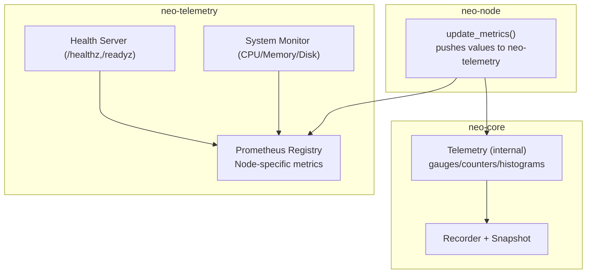
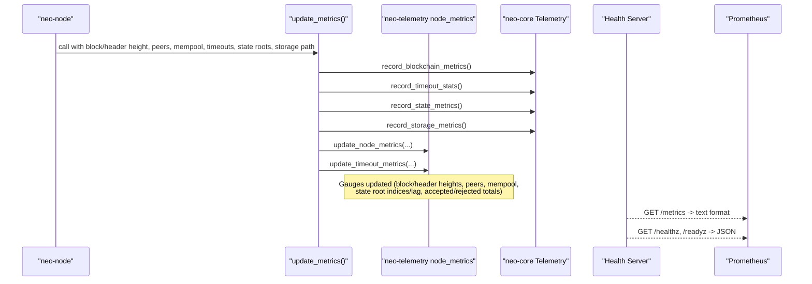
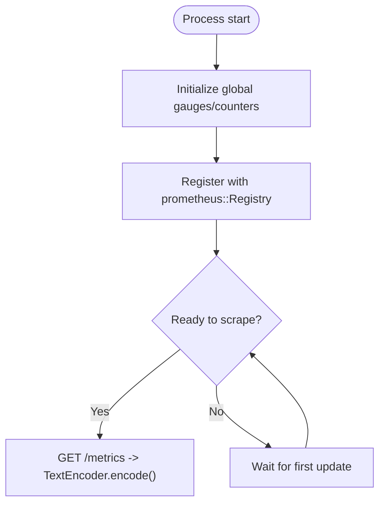
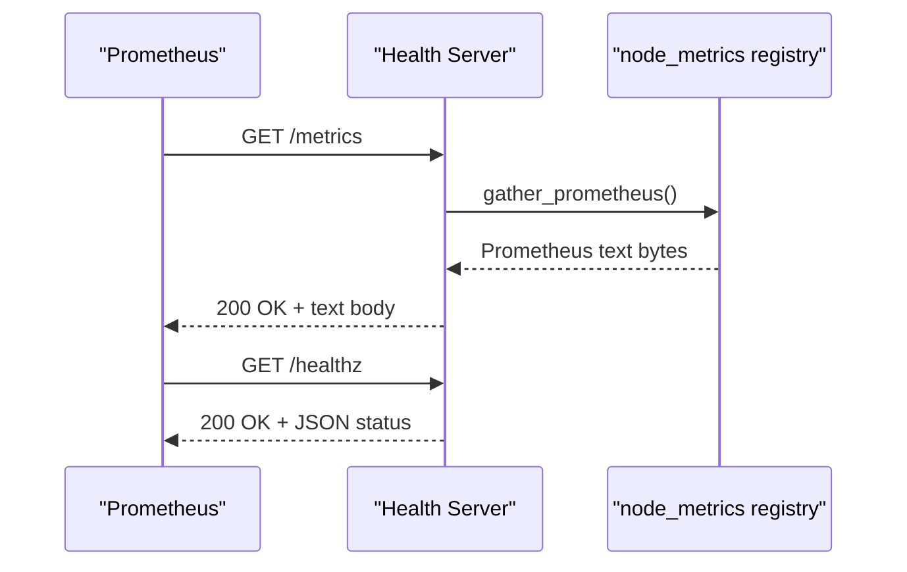
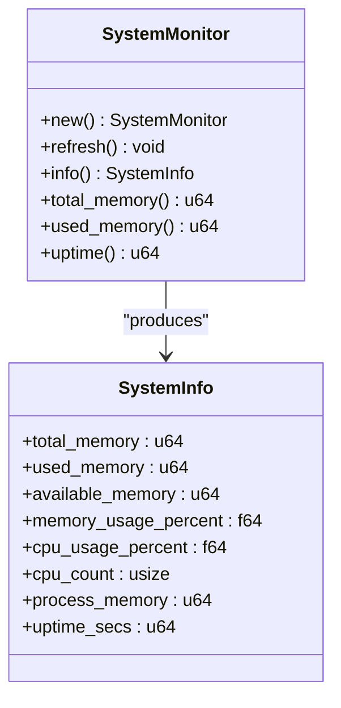
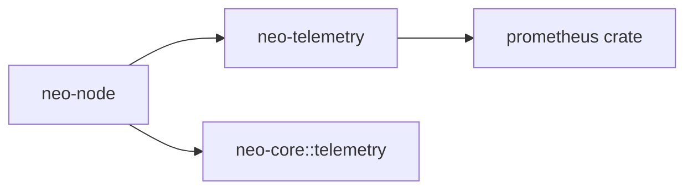

# Telemetry & Metrics

<cite>
**Referenced Files in This Document**
- [METRICS.md](file://docs/METRICS.md)
- [MONITORING.md](file://docs/MONITORING.md)
- [lib.rs](file://neo-telemetry/src/lib.rs)
- [metrics.rs](file://neo-telemetry/src/metrics.rs)
- [node_metrics.rs](file://neo-telemetry/src/node_metrics.rs)
- [health.rs](file://neo-telemetry/src/health.rs)
- [system.rs](file://neo-telemetry/src/system.rs)
- [config.rs](file://neo-telemetry/src/config.rs)
- [mod.rs (telemetry)](file://neo-core/src/telemetry/mod.rs)
- [recorder.rs](file://neo-core/src/telemetry/recorder.rs)
- [metrics.rs (neo-node)](file://neo-node/src/metrics.rs)
- [health.rs (neo-node)](file://neo-node/src/health.rs)
- [local.toml](file://config/local.toml)
</cite>

## Table of Contents
1. Introduction
2. Project Structure
3. Core Components
4. Architecture Overview
5. Detailed Component Analysis
6. Dependency Analysis
7. Performance Considerations
8. Troubleshooting Guide
9. Conclusion
10. Appendices

## Introduction
This document explains the telemetry and metrics system for Neo-RS node monitoring. It covers how Prometheus metrics are collected, what categories are exposed, how to configure the HTTP endpoints for scraping, and how to integrate with Prometheus and Grafana. It also documents system resource monitoring, metric naming conventions, cardinality management, and performance impact considerations.

## Project Structure
The observability stack is split across:
- neo-core::telemetry: lightweight internal metrics collection and snapshot export used by core components.
- neo-telemetry: production-grade metrics registry, health endpoints, and system resource monitoring.
- neo-node: wiring of runtime values into metrics and exposing health endpoints.

**Diagram sources**
- [mod.rs (telemetry):147-213](file://neo-core/src/telemetry/mod.rs#L147-L213)
- [metrics.rs (neo-node):32-108](file://neo-node/src/metrics.rs#L32-L108)
- [node_metrics.rs:138-223](file://neo-telemetry/src/node_metrics.rs#L138-L223)
- [health.rs:149-193](file://neo-telemetry/src/health.rs#L149-L193)
- [system.rs:39-98](file://neo-telemetry/src/system.rs#L39-L98)

**Section sources**
- [METRICS.md:1-64](file://docs/METRICS.md#L1-L64)
- [MONITORING.md:1-36](file://docs/MONITORING.md#L1-L36)

## Core Components
- Internal telemetry (neo-core::telemetry): provides counters, gauges, histograms, timers, and snapshots for use within core without external dependencies.
- Production metrics (neo-telemetry): registers Prometheus metrics, exposes a health server, and monitors system resources.
- Node wiring (neo-node): periodically updates blockchain, network, mempool, state root, and storage metrics from live node state.

Key responsibilities:
- Registration and exposure of Prometheus metrics via a global registry.
- Periodic updates of gauges and counters from node runtime.
- Serving /healthz and /readyz on localhost for liveness/readiness.
- Collecting CPU, memory, disk usage for operational dashboards.

**Section sources**
- [lib.rs:1-75](file://neo-telemetry/src/lib.rs#L1-L75)
- [metrics.rs (neo-node):13-24](file://neo-node/src/metrics.rs#L13-L24)
- [mod.rs (telemetry):1-43](file://neo-core/src/telemetry/mod.rs#L1-L43)

## Architecture Overview
The node periodically calls update_metrics, which:
- Records internal telemetry for blockchain, timeouts, state roots, and storage.
- Updates shared Prometheus gauges/counters in neo-telemetry.
- Exposes these metrics at /metrics and health probes at /healthz and /readyz.

**Diagram sources**
- [metrics.rs (neo-node):32-108](file://neo-node/src/metrics.rs#L32-L108)
- [node_metrics.rs:138-223](file://neo-telemetry/src/node_metrics.rs#L138-L223)
- [mod.rs (telemetry):147-213](file://neo-core/src/telemetry/mod.rs#L147-L213)
- [health.rs:149-193](file://neo-telemetry/src/health.rs#L149-L193)

## Detailed Component Analysis

### Prometheus Metrics Categories and Names
- Blockchain/Sync:
  - neo_block_height: current persisted block height
  - neo_header_height: highest header seen
  - neo_header_lag: difference between header and block height
- Mempool:
  - neo_mempool_size: number of transactions in mempool
- Network/P2P:
  - neo_peer_count: connected peers
  - neo_p2p_timeouts_handshake, neo_p2p_timeouts_read, neo_p2p_timeouts_write
- Storage/Disk:
  - neo_storage_free_bytes, neo_storage_total_bytes
- State Root (StateService):
  - neo_state_local_root_index, neo_state_validated_root_index, neo_state_validated_lag
  - neo_state_roots_accepted_total, neo_state_roots_rejected_total (gauges)
  - neo_state_roots_accepted, neo_state_roots_rejected (counters)

These are registered and updated by neo-telemetry’s node_metrics module and surfaced by the health server’s /metrics endpoint.

**Section sources**
- [METRICS.md:21-53](file://docs/METRICS.md#L21-L53)
- [node_metrics.rs:14-112](file://neo-telemetry/src/node_metrics.rs#L14-L112)
- [node_metrics.rs:138-195](file://neo-telemetry/src/node_metrics.rs#L138-L195)

### Metric Registration and Custom Creation
- Global Prometheus registry is used; metrics are created once and registered globally.
- Helper functions register_gauge/register_counter ensure registration and fallback behavior.
- gather_prometheus encodes all registered metrics to Prometheus text format.

**Diagram sources**
- [node_metrics.rs:118-132](file://neo-telemetry/src/node_metrics.rs#L118-L132)
- [node_metrics.rs:197-223](file://neo-telemetry/src/node_metrics.rs#L197-L223)

**Section sources**
- [node_metrics.rs:118-132](file://neo-telemetry/src/node_metrics.rs#L118-L132)
- [node_metrics.rs:197-223](file://neo-telemetry/src/node_metrics.rs#L197-L223)

### Metrics Server Configuration and Endpoints
- Health server binds to localhost and serves:
  - GET /healthz (JSON)
  - GET /readyz (JSON)
  - GET /metrics (Prometheus text)
- Enabled via CLI flag or environment variable; default bind address is localhost.
- Example configuration shows metrics port and bind address under [telemetry.metrics].

**Diagram sources**
- [health.rs:149-193](file://neo-telemetry/src/health.rs#L149-L193)
- [node_metrics.rs:197-223](file://neo-telemetry/src/node_metrics.rs#L197-L223)
- [local.toml:34-39](file://config/local.toml#L34-L39)

**Section sources**
- [METRICS.md:1-24](file://docs/METRICS.md#L1-L24)
- [health.rs:149-193](file://neo-telemetry/src/health.rs#L149-L193)
- [local.toml:34-39](file://config/local.toml#L34-L39)

### System Resource Monitoring
- SystemMonitor collects CPU usage percentage, memory usage, process memory, uptime, and CPU count.
- These can be integrated into dashboards alongside node metrics.

**Diagram sources**
- [system.rs:34-98](file://neo-telemetry/src/system.rs#L34-L98)

**Section sources**
- [system.rs:34-98](file://neo-telemetry/src/system.rs#L34-L98)

### Integration with Prometheus/Grafana
- Configure Prometheus to scrape http://localhost:<health_port>/metrics.
- Use /healthz and /readyz for Kubernetes liveness/readiness probes.
- Build Grafana dashboards using the documented metric names.

**Section sources**
- [MONITORING.md:14-29](file://docs/MONITORING.md#L14-L29)
- [METRICS.md:54-64](file://docs/METRICS.md#L54-L64)

## Dependency Analysis
- neo-node depends on neo-telemetry to expose Prometheus metrics and health endpoints.
- neo-core::telemetry provides an internal, dependency-light alternative for recording metrics inside core components.
- neo-telemetry uses the prometheus crate for registry and encoding.

**Diagram sources**
- [metrics.rs (neo-node):1-15](file://neo-node/src/metrics.rs#L1-L15)
- [lib.rs:1-75](file://neo-telemetry/src/lib.rs#L1-L75)
- [mod.rs (telemetry):1-43](file://neo-core/src/telemetry/mod.rs#L1-L43)

**Section sources**
- [metrics.rs (neo-node):1-15](file://neo-node/src/metrics.rs#L1-L15)
- [lib.rs:1-75](file://neo-telemetry/src/lib.rs#L1-L75)

## Performance Considerations
- Prefer gauges for instantaneous values (heights, peer counts, mempool size).
- Use counters for cumulative events (accepted/rejected state roots).
- Avoid high-cardinality labels; keep label sets small and stable to prevent metric explosion.
- Update metrics in batches during periodic loops rather than per-operation hot paths where possible.
- Disk usage queries should be throttled to avoid frequent syscalls.

[No sources needed since this section provides general guidance]

## Troubleshooting Guide
- If /metrics returns empty or errors:
  - Ensure metrics are enabled and the health server started on the configured port.
  - Verify that update_metrics is called regularly so gauges are initialized.
- If /healthz fails:
  - Check max header lag threshold and RPC availability.
  - Confirm the health server is bound to localhost and reachable by your probe.
- If Prometheus cannot scrape:
  - Validate firewall/proxy rules allowing access to the health port.
  - Confirm content type and UTF-8 encoding of the response.

**Section sources**
- [health.rs:149-193](file://neo-telemetry/src/health.rs#L149-L193)
- [METRICS.md:54-64](file://docs/METRICS.md#L54-L64)

## Conclusion
Neo-RS provides a layered telemetry system: lightweight internal metrics in neo-core and a production-ready Prometheus stack in neo-telemetry. The node wires runtime state into well-defined metric categories and exposes them via a local health server. Operators can build robust dashboards and alerts around blockchain sync, network health, mempool activity, state root validation, and storage capacity.

[No sources needed since this section summarizes without analyzing specific files]

## Appendices

### A. Query Examples
- Block height and lag:
  - neo_block_height, neo_header_height, neo_header_lag
- Network health:
  - neo_peer_count, neo_p2p_timeouts_handshake, neo_p2p_timeouts_read, neo_p2p_timeouts_write
- Mempool:
  - neo_mempool_size
- Storage:
  - neo_storage_free_bytes, neo_storage_total_bytes
- State root:
  - neo_state_local_root_index, neo_state_validated_root_index, neo_state_validated_lag
  - neo_state_roots_accepted_total, neo_state_roots_rejected_total
  - neo_state_roots_accepted, neo_state_roots_rejected

**Section sources**
- [METRICS.md:21-53](file://docs/METRICS.md#L21-L53)
- [node_metrics.rs:14-112](file://neo-telemetry/src/node_metrics.rs#L14-L112)

### B. Alerting Rules (PromQL examples)
- Sync lag:
  - neo_header_height - neo_block_height > 10 for 5m
- Peer connectivity:
  - neo_peer_count < 3 for 10m
- Mempool anomalies:
  - neo_mempool_size == 0 for 15m or neo_mempool_size > 50000
- Storage pressure:
  - neo_storage_free_bytes / neo_storage_total_bytes < 0.2
- Timeouts:
  - rate(neo_p2p_timeouts_handshake[5m]) > 0.1

[No sources needed since this section provides general guidance]

### C. Dashboard Suggestions
- Chain sync: neo_block_height, neo_header_height, neo_header_lag
- Network: neo_peer_count, timeout gauges
- Mempool: neo_mempool_size
- Storage: neo_storage_free_bytes, neo_storage_total_bytes
- State root: neo_state_validated_lag, accepted/rejected totals

[No sources needed since this section provides general guidance]

### D. Metric Naming Conventions and Cardinality
- Prefix with domain (e.g., neo_).
- Use descriptive nouns and suffixes (_total for counters, _seconds for durations).
- Keep labels minimal and bounded; avoid per-transaction or per-peer identifiers unless necessary.
- Prefer gauges for point-in-time values and counters for monotonic increments.

[No sources needed since this section provides general guidance]

### E. Enabling and Configuring the Health/Metrics Server
- Enable via CLI flag or environment variable for the health port.
- Example config section shows metrics enabled with bind address and port.

**Section sources**
- [METRICS.md:1-24](file://docs/METRICS.md#L1-L24)
- [local.toml:34-39](file://config/local.toml#L34-L39)