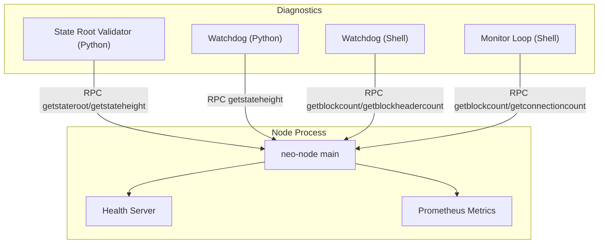
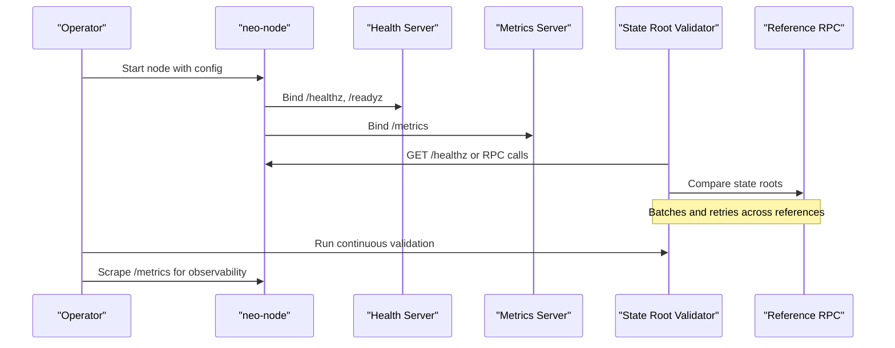
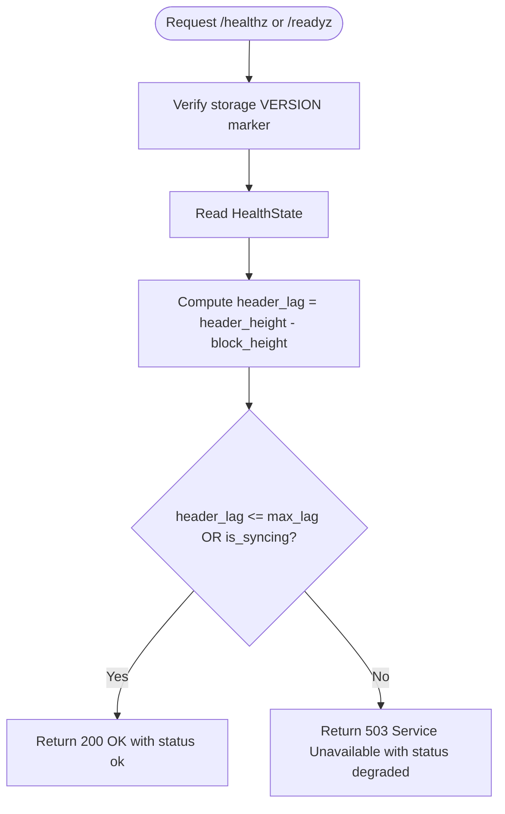
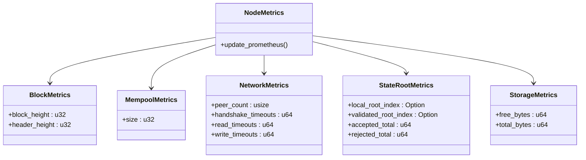
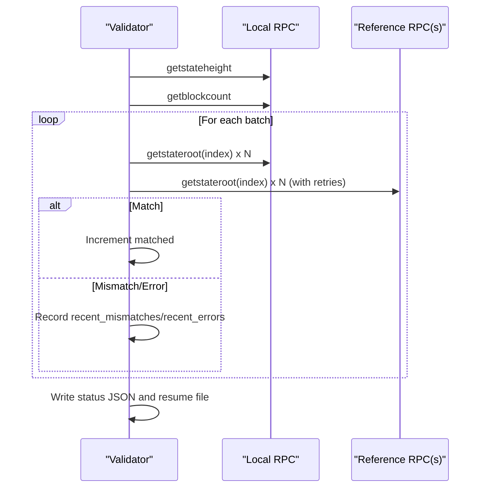
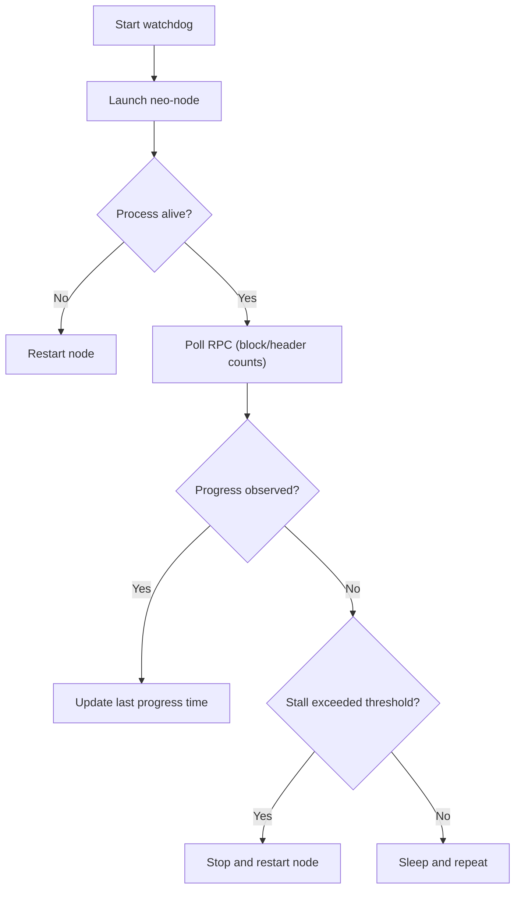
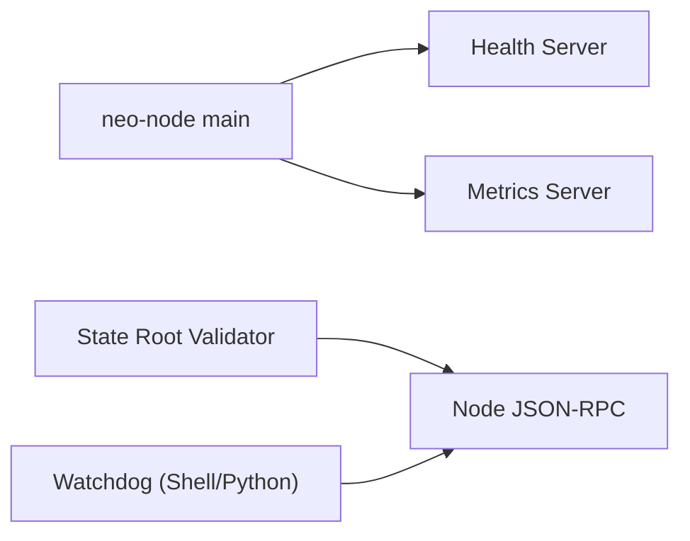

# Troubleshooting & Debugging

<cite>
**Referenced Files in This Document**
- [OPERATIONS.md](file://docs/OPERATIONS.md)
- [MONITORING.md](file://docs/MONITORING.md)
- [profiling.md](file://docs/profiling.md)
- [health.rs](file://neo-node/src/health.rs)
- [node_health.rs](file://neo-telemetry/src/node_health.rs)
- [node_metrics.rs](file://neo-telemetry/src/node_metrics.rs)
- [main.rs](file://neo-node/src/main.rs)
- [continuous-stateroot-validation.py](file://scripts/continuous-stateroot-validation.py)
- [validate-stateroot-continuous.sh](file://scripts/validate-stateroot-continuous.sh)
- [watchdog.py](file://scripts/watchdog.py)
- [monitor-loop.sh](file://scripts/monitor-loop.sh)
- [neo_node_watchdog.sh](file://scripts/neo_node_watchdog.sh)
</cite>

## Table of Contents
1. [Introduction](#introduction)
2. [Project Structure](#project-structure)
3. [Core Components](#core-components)
4. [Architecture Overview](#architecture-overview)
5. [Detailed Component Analysis](#detailed-component-analysis)
6. [Dependency Analysis](#dependency-analysis)
7. [Performance Considerations](#performance-considerations)
8. [Troubleshooting Guide](#troubleshooting-guide)
9. [Conclusion](#conclusion)
10. [Appendices](#appendices)

## Introduction
This document provides a comprehensive troubleshooting and debugging guide for Neo-RS operations. It focuses on resolving sync failures, consensus-related issues, and performance bottlenecks using built-in diagnostics, log analysis patterns, and profiling methods. It also covers health check interpretation, alert response procedures, incident escalation workflows, and the use of available tools and scripts to collect diagnostic information, reproduce issues, and collaborate with development teams.

## Project Structure
Neo-RS exposes operational surfaces through:
- A node daemon entry point that initializes runtime, logging, metrics, and services
- Health endpoints for liveness/readiness and Prometheus metrics
- Scripts for continuous state-root validation, monitoring loops, and watchdogs
- Operational guidance for daily checks, backups, storage integrity, and TEE modes

**Diagram sources**
- [main.rs:65-79](file://neo-node/src/main.rs#L65-L79)
- [health.rs:12-34](file://neo-node/src/health.rs#L12-L34)
- [node_health.rs:149-254](file://neo-telemetry/src/node_health.rs#L149-L254)
- [node_metrics.rs:197-223](file://neo-telemetry/src/node_metrics.rs#L197-L223)
- [continuous-stateroot-validation.py:435-474](file://scripts/continuous-stateroot-validation.py#L435-L474)
- [watchdog.py:9-22](file://scripts/watchdog.py#L9-L22)
- [neo_node_watchdog.sh:39-49](file://scripts/neo_node_watchdog.sh#L39-L49)
- [monitor-loop.sh:10-14](file://scripts/monitor-loop.sh#L10-L14)

**Section sources**
- [main.rs:65-79](file://neo-node/src/main.rs#L65-L79)
- [health.rs:12-34](file://neo-node/src/health.rs#L12-L34)
- [node_health.rs:149-254](file://neo-telemetry/src/node_health.rs#L149-L254)
- [node_metrics.rs:197-223](file://neo-telemetry/src/node_metrics.rs#L197-L223)
- [continuous-stateroot-validation.py:435-474](file://scripts/continuous-stateroot-validation.py#L435-L474)
- [watchdog.py:9-22](file://scripts/watchdog.py#L9-L22)
- [neo_node_watchdog.sh:39-49](file://scripts/neo_node_watchdog.sh#L39-L49)
- [monitor-loop.sh:10-14](file://scripts/monitor-loop.sh#L10-L14)

## Core Components
- Health server: Exposes /healthz and /readyz with status derived from block/header heights, peer count, mempool size, syncing state, and storage readiness. Returns 503 when degraded.
- Metrics server: Exposes Prometheus text format at /metrics with blockchain, network, mempool, state root, and storage metrics.
- State root validator: Continuously compares local state roots against official reference RPCs, persists progress, and reports mismatches/errors.
- Watchdogs and monitors: Shell and Python helpers to restart stalled nodes, poll RPC endpoints, and track progress.

**Section sources**
- [node_health.rs:16-49](file://neo-telemetry/src/node_health.rs#L16-L49)
- [node_health.rs:195-254](file://neo-telemetry/src/node_health.rs#L195-L254)
- [node_metrics.rs:14-112](file://neo-telemetry/src/node_metrics.rs#L14-L112)
- [continuous-stateroot-validation.py:74-191](file://scripts/continuous-stateroot-validation.py#L74-L191)
- [neo_node_watchdog.sh:51-68](file://scripts/neo_node_watchdog.sh#L51-L68)
- [watchdog.py:20-24](file://scripts/watchdog.py#L20-L24)

## Architecture Overview
The node process initializes a Tokio runtime and starts services including health and metrics. External scripts interact via JSON-RPC to validate state roots, monitor sync, and auto-restart if stalls are detected.

**Diagram sources**
- [main.rs:65-79](file://neo-node/src/main.rs#L65-L79)
- [health.rs:12-34](file://neo-node/src/health.rs#L12-L34)
- [node_health.rs:149-254](file://neo-telemetry/src/node_health.rs#L149-L254)
- [node_metrics.rs:197-223](file://neo-telemetry/src/node_metrics.rs#L197-L223)
- [continuous-stateroot-validation.py:477-521](file://scripts/continuous-stateroot-validation.py#L477-L521)

## Detailed Component Analysis

### Health Endpoint and Readiness
- Endpoints: /healthz and /readyz return JSON with version, rpc_enabled, storage_ready, block_height, header_height, peer_count, mempool_size, is_syncing, and header_lag.
- Health logic: Healthy if storage markers match expected version and either synced within configured max lag or currently syncing; otherwise returns 503.
- Storage marker check: Validates VERSION file in storage path matches running binary’s storage version.

**Diagram sources**
- [node_health.rs:195-254](file://neo-telemetry/src/node_health.rs#L195-L254)
- [node_health.rs:270-278](file://neo-telemetry/src/node_health.rs#L270-L278)

**Section sources**
- [node_health.rs:16-49](file://neo-telemetry/src/node_health.rs#L16-L49)
- [node_health.rs:195-254](file://neo-telemetry/src/node_health.rs#L195-L254)
- [node_health.rs:270-278](file://neo-telemetry/src/node_health.rs#L270-L278)

### Prometheus Metrics
- Key gauges: block height, header height, header lag, mempool size, peer count, P2P timeouts, state root indices and lag, accepted/rejected counters, disk free/total bytes.
- Update API: update_node_metrics aggregates blockchain, mempool, network, state root, and storage metrics into Prometheus gauges/counters.
- Export: gather_prometheus serializes all registered metrics to Prometheus text format.

**Diagram sources**
- [node_metrics.rs:225-293](file://neo-telemetry/src/node_metrics.rs#L225-L293)

**Section sources**
- [node_metrics.rs:14-112](file://neo-telemetry/src/node_metrics.rs#L14-L112)
- [node_metrics.rs:134-195](file://neo-telemetry/src/node_metrics.rs#L134-L195)
- [node_metrics.rs:197-223](file://neo-telemetry/src/node_metrics.rs#L197-L223)
- [node_metrics.rs:225-293](file://neo-telemetry/src/node_metrics.rs#L225-L293)

### Continuous State Root Validation
- Purpose: Continuously compare local getstateroot outputs against one or more reference RPC endpoints while the node syncs.
- Features: Batch fetching, parallel workers, retry rounds across references, resume checkpoint, structured status output, mismatch/error limits, and optional one-shot mode.
- Integration: Can read local RPC settings from TOML configuration and supports Basic auth for both local and reference endpoints.

**Diagram sources**
- [continuous-stateroot-validation.py:435-474](file://scripts/continuous-stateroot-validation.py#L435-L474)
- [continuous-stateroot-validation.py:477-521](file://scripts/continuous-stateroot-validation.py#L477-L521)
- [continuous-stateroot-validation.py:524-569](file://scripts/continuous-stateroot-validation.py#L524-L569)

**Section sources**
- [continuous-stateroot-validation.py:74-191](file://scripts/continuous-stateroot-validation.py#L74-L191)
- [continuous-stateroot-validation.py:435-474](file://scripts/continuous-stateroot-validation.py#L435-L474)
- [continuous-stateroot-validation.py:477-521](file://scripts/continuous-stateroot-validation.py#L477-L521)
- [continuous-stateroot-validation.py:524-569](file://scripts/continuous-stateroot-validation.py#L524-L569)

### Watchdogs and Monitoring Loops
- Python watchdog: Runs neo-node in state-root full-state mode, polls getstateheight, detects stalls, and restarts the process when stuck.
- Shell watchdog: Starts/stops neo-node, polls getblockcount and getblockheadercount, and restarts on stall or RPC unavailability.
- Monitor loop: Periodically queries getblockcount and getconnectioncount to log node status.

**Diagram sources**
- [watchdog.py:20-52](file://scripts/watchdog.py#L20-L52)
- [neo_node_watchdog.sh:51-124](file://scripts/neo_node_watchdog.sh#L51-L124)
- [monitor-loop.sh:7-17](file://scripts/monitor-loop.sh#L7-L17)

**Section sources**
- [watchdog.py:9-52](file://scripts/watchdog.py#L9-L52)
- [neo_node_watchdog.sh:39-124](file://scripts/neo_node_watchdog.sh#L39-L124)
- [monitor-loop.sh:7-17](file://scripts/monitor-loop.sh#L7-L17)

## Dependency Analysis
- The node main initializes the runtime and delegates to startup services, which bind health and metrics servers.
- Health depends on shared telemetry modules for HTTP serving and metric gathering.
- Scripts depend on the node’s JSON-RPC surface for validation and monitoring.

**Diagram sources**
- [main.rs:65-79](file://neo-node/src/main.rs#L65-L79)
- [health.rs:12-34](file://neo-node/src/health.rs#L12-L34)
- [node_health.rs:149-254](file://neo-telemetry/src/node_health.rs#L149-L254)
- [node_metrics.rs:197-223](file://neo-telemetry/src/node_metrics.rs#L197-L223)
- [continuous-stateroot-validation.py:435-474](file://scripts/continuous-stateroot-validation.py#L435-L474)
- [neo_node_watchdog.sh:39-49](file://scripts/neo_node_watchdog.sh#L39-L49)

**Section sources**
- [main.rs:65-79](file://neo-node/src/main.rs#L65-L79)
- [health.rs:12-34](file://neo-node/src/health.rs#L12-L34)
- [node_health.rs:149-254](file://neo-telemetry/src/node_health.rs#L149-L254)
- [node_metrics.rs:197-223](file://neo-telemetry/src/node_metrics.rs#L197-L223)
- [continuous-stateroot-validation.py:435-474](file://scripts/continuous-stateroot-validation.py#L435-L474)
- [neo_node_watchdog.sh:39-49](file://scripts/neo_node_watchdog.sh#L39-L49)

## Performance Considerations
- Use CPU and memory profiling tools documented in the repository to identify hotspots and allocation spikes.
- Prefer release builds with debug symbols for accurate profiling and generate flamegraphs for CPU analysis.
- Benchmark before and after changes to ensure protocol compatibility and performance gains.

[No sources needed since this section provides general guidance]

## Troubleshooting Guide

### Common Operational Issues and Resolutions

#### Sync Failures
- Symptoms: Header lag exceeds configured threshold; /healthz returns 503; validators report WAITING_FOR_SYNC.
- Steps:
  - Verify RPC health and compare block/header heights to trusted seeds.
  - Inspect peers and connection churn; ensure correct network magic and seed list.
  - If DB corruption suspected (e.g., ContractManagement integrity errors), restore from backup or resync from clean storage.
  - Use continuous state root validation to detect divergence early; review recent mismatches and errors in status JSON.
  - For import-only runs, verify stop-height parity and consider read-only checks for storage consistency.

**Section sources**
- [OPERATIONS.md:5-11](file://docs/OPERATIONS.md#L5-L11)
- [OPERATIONS.md:17-37](file://docs/OPERATIONS.md#L17-L37)
- [OPERATIONS.md:104-111](file://docs/OPERATIONS.md#L104-L111)
- [node_health.rs:195-254](file://neo-telemetry/src/node_health.rs#L195-L254)
- [continuous-stateroot-validation.py:667-781](file://scripts/continuous-stateroot-validation.py#L667-L781)

#### Consensus Problems
- Symptoms: Repeated state root rejections or acceptance anomalies; unexpected halts during contract deployment flows; native return-value parity issues.
- Steps:
  - Enable strict native security checks only after validating full chain parity for your exact network/data set.
  - Validate state roots continuously against official seeds; inspect mismatches and adjust reference RPCs if throttled.
  - Ensure manifest permissions and native return-value handling match protocol expectations; resync from trusted snapshot if divergence found.
  - Use watchdogs to auto-restart nodes stuck in consensus loops; monitor timeouts and peer connectivity.

**Section sources**
- [OPERATIONS.md:63-72](file://docs/OPERATIONS.md#L63-L72)
- [OPERATIONS.md:104-111](file://docs/OPERATIONS.md#L104-L111)
- [neo_node_watchdog.sh:85-124](file://scripts/neo_node_watchdog.sh#L85-L124)

#### Performance Bottlenecks
- Symptoms: High CPU usage, memory growth, slow catch-up, RocksDB I/O pressure.
- Steps:
  - Profile CPU with perf and generate flamegraphs; focus on application code hotspots.
  - Profile memory with heaptrack; look for allocation spikes and leaks.
  - Tune RocksDB batch profile for imports; control flush intervals to balance throughput and recovery loss window.
  - Monitor disk space and IOPS; keep sufficient free space on RocksDB volume.

**Section sources**
- [profiling.md:26-97](file://docs/profiling.md#L26-L97)
- [OPERATIONS.md:39-43](file://docs/OPERATIONS.md#L39-L43)
- [OPERATIONS.md:93-101](file://docs/OPERATIONS.md#L93-L101)

### Debugging Techniques

#### Built-in Diagnostic Tools
- Health endpoints: Query /healthz or /readyz for liveness/readiness and sync status; configure max header lag to fail fast on sync gaps.
- Metrics endpoint: Scrape /metrics for Prometheus data covering blockchain, network, mempool, state roots, and storage.
- Configuration checks: Use CLI flags to validate configuration and storage without starting the daemon.

**Section sources**
- [node_health.rs:195-254](file://neo-telemetry/src/node_health.rs#L195-L254)
- [node_metrics.rs:197-223](file://neo-telemetry/src/node_metrics.rs#L197-L223)
- [OPERATIONS.md:35-38](file://docs/OPERATIONS.md#L35-L38)

#### Log Analysis Patterns
- Review logs for warnings/alerts, especially around sync lag, peer churn, and storage errors.
- Look for TEE initialization messages and SGX runtime validation results when operating in TEE modes.
- Capture logs during catch-up and after upgrades to verify RPC health and height parity.

**Section sources**
- [OPERATIONS.md:5-11](file://docs/OPERATIONS.md#L5-L11)
- [OPERATIONS.md:73-91](file://docs/OPERATIONS.md#L73-L91)
- [OPERATIONS.md:120-124](file://docs/OPERATIONS.md#L120-L124)

#### Performance Profiling Methods
- Build with debug symbols and record CPU profiles; generate flamegraphs to identify top hotspots.
- Use memory profiling to detect leaks and temporary allocations in hot paths.
- Run benchmarks to validate improvements and maintain protocol compatibility.

**Section sources**
- [profiling.md:26-97](file://docs/profiling.md#L26-L97)

### Health Check Interpretation
- Status fields:
  - status: ok or degraded
  - header_lag: difference between header_height and block_height
  - is_syncing: true while catching up
  - storage_ready: true if VERSION marker matches expected
- Actions:
  - If degraded due to lag, wait for sync or investigate peers/RPC availability.
  - If storage_ready is false, verify storage path and version markers; resync if necessary.

**Section sources**
- [node_health.rs:195-254](file://neo-telemetry/src/node_health.rs#L195-L254)
- [node_health.rs:270-278](file://neo-telemetry/src/node_health.rs#L270-L278)

### Alert Response Procedures
- Height lag alerts: Investigate peers, RPC availability, and storage health; consider restarting if stuck.
- Peer count alerts: Check network configuration, ports, and firewall rules; rotate reference RPCs if throttled.
- Mempool anomalies: Inspect transaction acceptance policies and plugin behavior; place RPC behind rate-limited proxy.
- Disk pressure: Expand volumes, prune backups/logs, and ensure RocksDB is on durable storage.

**Section sources**
- [MONITORING.md:20-29](file://docs/MONITORING.md#L20-L29)
- [OPERATIONS.md:113-118](file://docs/OPERATIONS.md#L113-L118)

### Incident Escalation Workflows
- Immediate actions:
  - Restart node if process exited unexpectedly or RPC unavailable for extended periods.
  - Restore from latest good backup if storage corruption detected.
- Escalation triggers:
  - Persistent state root mismatches beyond configured limit.
  - Repeated consensus failures or native contract parity issues.
  - Inability to recover after restart and resync attempts.
- Collaboration:
  - Collect logs, health/metrics snapshots, and validator status files.
  - Provide reproduction steps and environment details to development teams.

**Section sources**
- [neo_node_watchdog.sh:85-124](file://scripts/neo_node_watchdog.sh#L85-L124)
- [continuous-stateroot-validation.py:524-569](file://scripts/continuous-stateroot-validation.py#L524-L569)
- [OPERATIONS.md:113-118](file://docs/OPERATIONS.md#L113-L118)

### Tools and Scripts for Diagnosis
- Continuous state root validation:
  - Python validator with batching, workers, retries, resume file, and structured status output.
  - Shell wrapper to run validator with environment-driven configuration.
- Watchdogs:
  - Python watchdog for state-root full-state mode with stall detection and restart.
  - Shell watchdog for general node monitoring with RPC-based stall detection.
- Monitoring loop:
  - Simple periodic polling of block count and connection count for quick status checks.

**Section sources**
- [continuous-stateroot-validation.py:74-191](file://scripts/continuous-stateroot-validation.py#L74-L191)
- [validate-stateroot-continuous.sh:1-59](file://scripts/validate-stateroot-continuous.sh#L1-L59)
- [watchdog.py:20-52](file://scripts/watchdog.py#L20-L52)
- [neo_node_watchdog.sh:51-124](file://scripts/neo_node_watchdog.sh#L51-L124)
- [monitor-loop.sh:7-17](file://scripts/monitor-loop.sh#L7-L17)

### Collecting Diagnostic Information
- Logs:
  - Capture node logs during catch-up and after upgrades; include warnings/alerts and TEE validation messages.
- Health and metrics:
  - Scrape /healthz and /metrics; store snapshots for post-mortem analysis.
- Validator outputs:
  - Save status JSON and resume files; review recent mismatches and errors.
- Environment:
  - Record configuration files, network magic, storage path, and process resource limits.

**Section sources**
- [OPERATIONS.md:5-11](file://docs/OPERATIONS.md#L5-L11)
- [OPERATIONS.md:73-91](file://docs/OPERATIONS.md#L73-L91)
- [continuous-stateroot-validation.py:524-569](file://scripts/continuous-stateroot-validation.py#L524-L569)
- [node_metrics.rs:197-223](file://neo-telemetry/src/node_metrics.rs#L197-L223)

### Reproducing Issues in Test Environments
- Use testnet configurations and RPC URLs to simulate conditions; leverage shell wrappers to set local/reference RPCs and credentials.
- Run validators in one-shot mode to bound replay windows and capture divergences quickly.
- Employ watchdogs to force restarts and observe recovery behavior under controlled conditions.

**Section sources**
- [validate-stateroot-continuous.sh:13-58](file://scripts/validate-stateroot-continuous.sh#L13-L58)
- [continuous-stateroot-validation.py:187-191](file://scripts/continuous-stateroot-validation.py#L187-L191)
- [neo_node_watchdog.sh:51-124](file://scripts/neo_node_watchdog.sh#L51-L124)

### Collaborating with Development Teams
- Provide:
  - Logs, health/metrics snapshots, validator status files, and configuration details.
  - Steps to reproduce, including commands used and environment variables set.
- Request:
  - Guidance on protocol-specific fixes or configuration adjustments.
  - Assistance with interpreting mismatches and error traces.

**Section sources**
- [continuous-stateroot-validation.py:524-569](file://scripts/continuous-stateroot-validation.py#L524-L569)
- [OPERATIONS.md:113-118](file://docs/OPERATIONS.md#L113-L118)

## Conclusion
Neo-RS provides robust operational surfaces for health checks, metrics, and continuous state-root validation. By combining these tools with disciplined log analysis, profiling, and scripted monitoring, operators can quickly diagnose sync failures, consensus problems, and performance bottlenecks. Adhering to the outlined procedures ensures reliable incident response and effective collaboration with development teams.

## Appendices

### Quick Reference Commands
- Health check: curl POST getversion to RPC endpoint
- Sync status: getblockcount and getblockheadercount
- Peers: getpeers
- Health endpoint: GET /healthz or /readyz
- Metrics: GET /metrics
- Continuous validation: run Python validator or shell wrapper
- Watchdog: start Python or shell watchdog to auto-restart stalled nodes

**Section sources**
- [OPERATIONS.md:5-11](file://docs/OPERATIONS.md#L5-L11)
- [neo_node_watchdog.sh:39-49](file://scripts/neo_node_watchdog.sh#L39-L49)
- [monitor-loop.sh:10-14](file://scripts/monitor-loop.sh#L10-L14)
- [validate-stateroot-continuous.sh:25-58](file://scripts/validate-stateroot-continuous.sh#L25-L58)