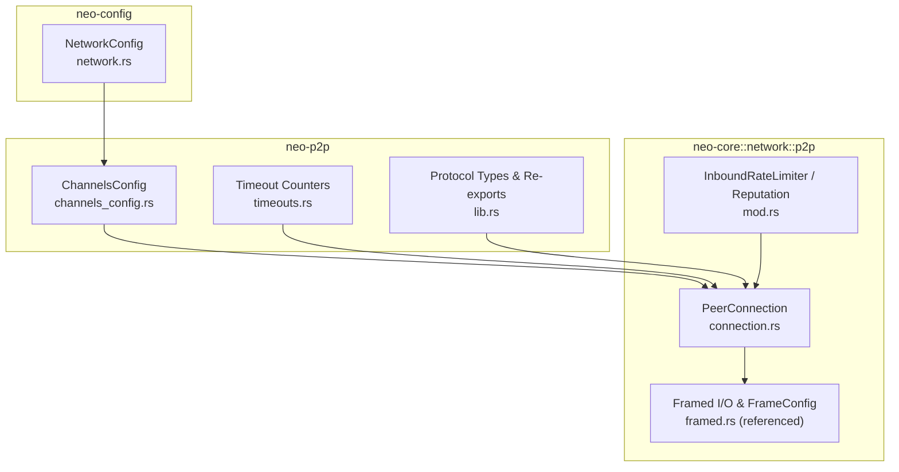
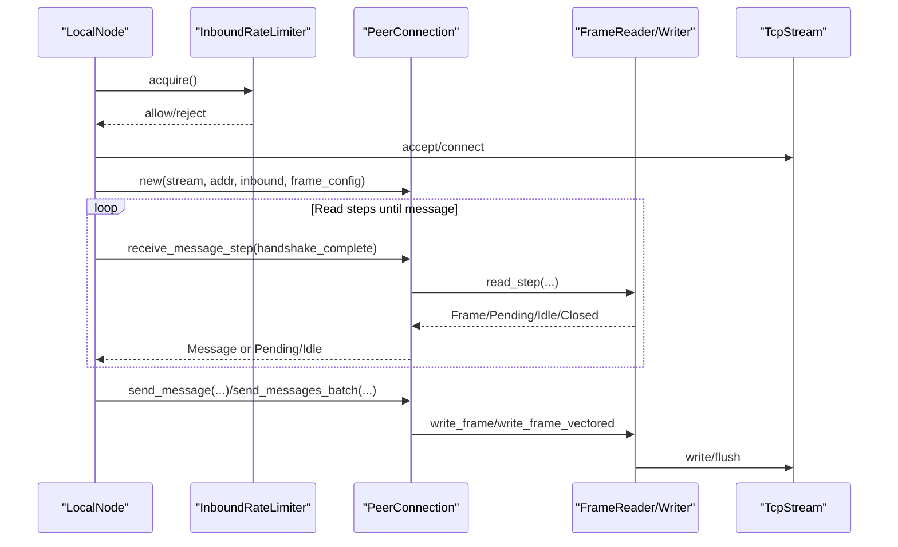
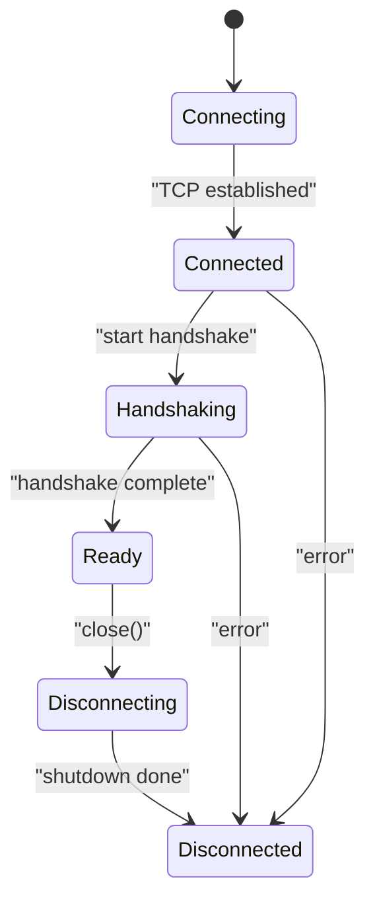
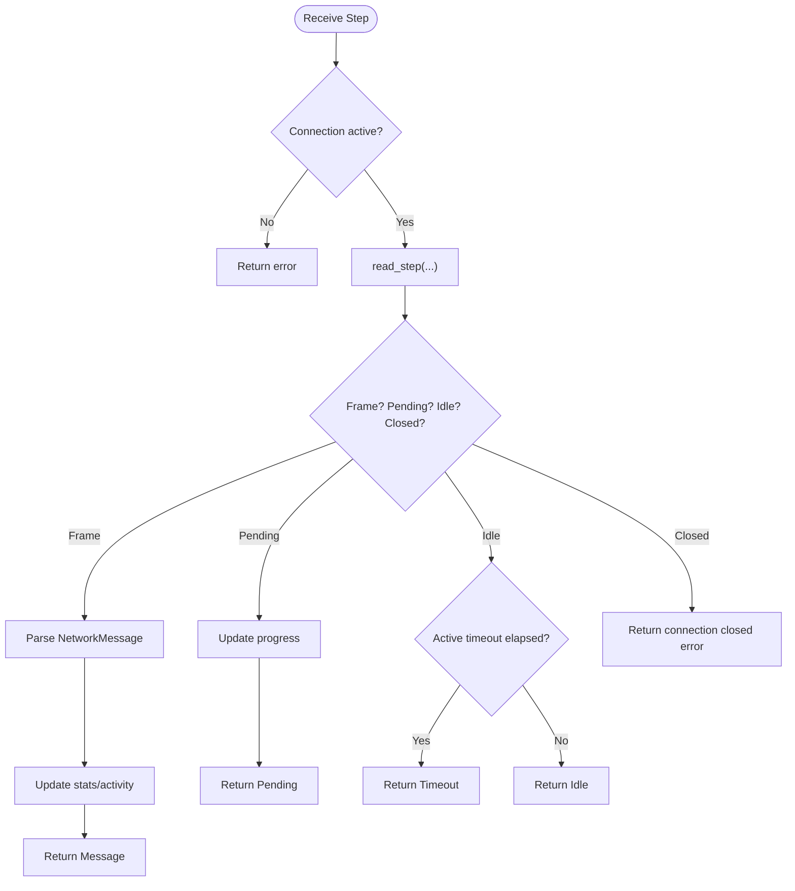
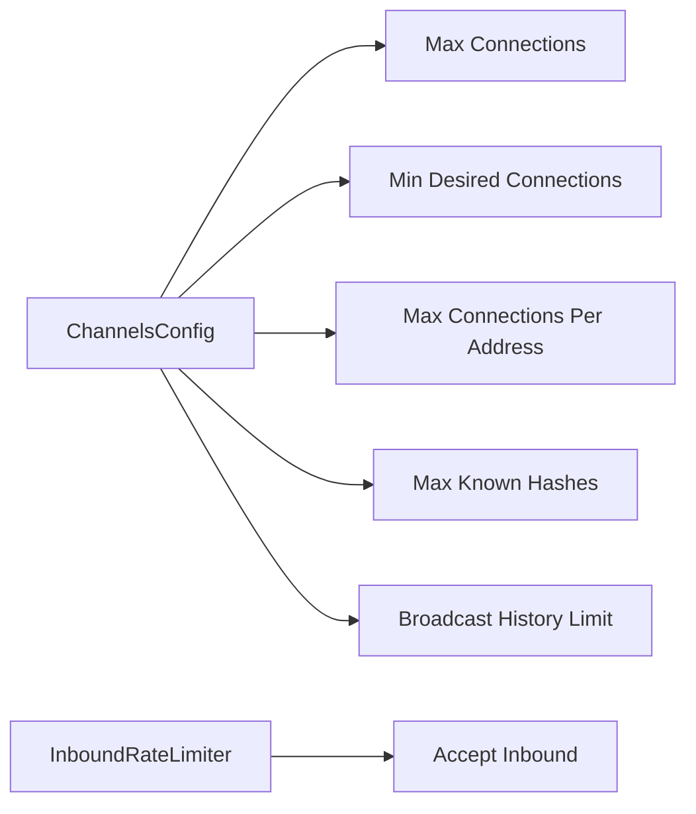
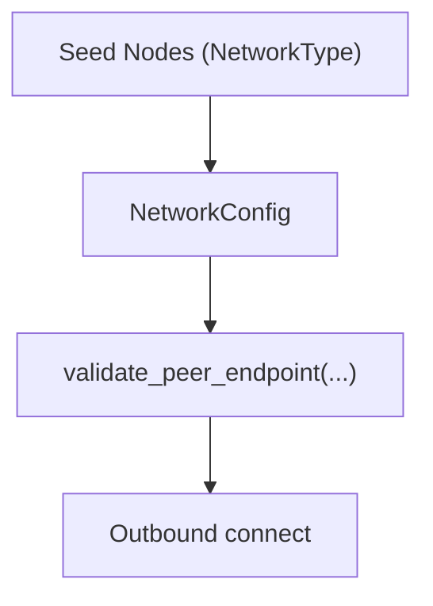
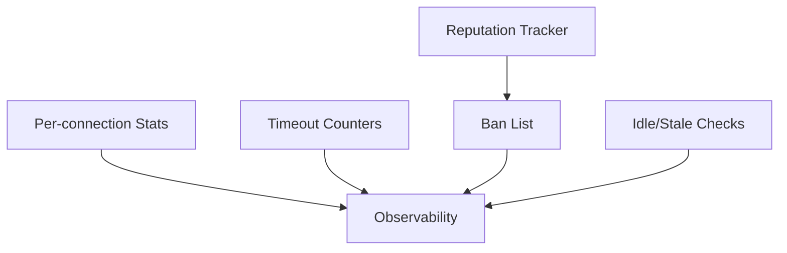
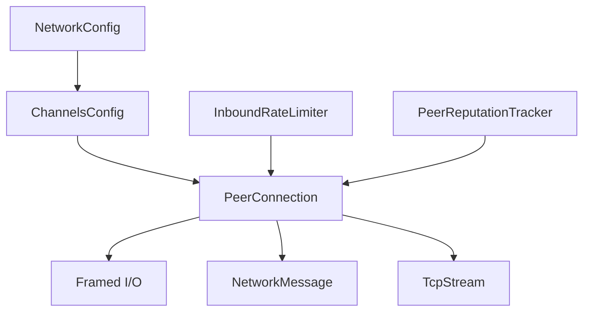

# Connection Management

<cite>
**Referenced Files in This Document**
- [connection.rs](file://neo-core/src/network/p2p/connection.rs)
- [mod.rs](file://neo-core/src/network/p2p/mod.rs)
- [channels_config.rs](file://neo-p2p/src/channels_config.rs)
- [timeouts.rs](file://neo-p2p/src/timeouts.rs)
- [network.rs](file://neo-config/src/network.rs)
- [lib.rs](file://neo-p2p/src/lib.rs)
</cite>

## Table of Contents
1. Introduction
2. Project Structure
3. Core Components
4. Architecture Overview
5. Detailed Component Analysis
6. Dependency Analysis
7. Performance Considerations
8. Troubleshooting Guide
9. Conclusion

## Introduction
This document explains connection management for the Neo P2P implementation, focusing on peer connection lifecycle (establishment, maintenance, termination), connection limits and resource management, discovery and retry behavior, security posture, monitoring and health checks, configuration options, troubleshooting, performance tuning, and best practices for high-throughput scenarios. It is grounded in the repository’s P2P modules and configuration types.

## Project Structure
The Neo P2P networking layer spans several crates:
- neo-core network p2p module provides runtime connection management, framing, rate limiting, reputation tracking, and peer lifecycle helpers.
- neo-p2p crate exposes protocol-level types, channel configuration, and shared timeout counters.
- neo-config defines network type, magic/versioning, seed nodes, and basic connection limits.

**Diagram sources**
- [connection.rs:107-147](file://neo-core/src/network/p2p/connection.rs#L107-L147)
- [mod.rs:131-204](file://neo-core/src/network/p2p/mod.rs#L131-L204)
- [channels_config.rs:14-88](file://neo-p2p/src/channels_config.rs#L14-L88)
- [timeouts.rs:1-58](file://neo-p2p/src/timeouts.rs#L1-L58)
- [network.rs:85-158](file://neo-config/src/network.rs#L85-L158)
- [lib.rs:169-252](file://neo-p2p/src/lib.rs#L169-L252)

**Section sources**
- [connection.rs:107-147](file://neo-core/src/network/p2p/connection.rs#L107-L147)
- [mod.rs:131-204](file://neo-core/src/network/p2p/mod.rs#L131-L204)
- [channels_config.rs:14-88](file://neo-p2p/src/channels_config.rs#L14-L88)
- [timeouts.rs:1-58](file://neo-p2p/src/timeouts.rs#L1-L58)
- [network.rs:85-158](file://neo-config/src/network.rs#L85-L158)
- [lib.rs:169-252](file://neo-p2p/src/lib.rs#L169-L252)

## Core Components
- PeerConnection: Represents a TCP-based P2P connection with state machine, framed I/O, write buffering, stepwise reads, timeouts, and statistics.
- ChannelsConfig: Global bootstrap settings controlling compression, desired/maximum connections, per-address limits, known-hash cache size, broadcast history, and timeouts.
- NetworkConfig: Network identity (magic/address version), seed nodes, max/min peers, and connection timeout.
- InboundRateLimiter and PeerReputationTracker: Protect inbound connection acceptance and track peer behavior to mitigate abuse.
- Timeout counters: Shared atomic counters for handshake/read/write timeouts used for observability.

Key responsibilities:
- Lifecycle: Connect → Handshake → Ready → Disconnect.
- I/O: Buffered writes, vectored batch sends, stepwise reads with active timeouts.
- Limits: Max peers, per-address caps, inbound rate limiting.
- Security: Plaintext transport; rely on signatures; optional external tunnels.
- Monitoring: Per-connection stats, global timeout counters, reputation/ban lists.

**Section sources**
- [connection.rs:23-86](file://neo-core/src/network/p2p/connection.rs#L23-L86)
- [connection.rs:107-147](file://neo-core/src/network/p2p/connection.rs#L107-L147)
- [channels_config.rs:14-88](file://neo-p2p/src/channels_config.rs#L14-L88)
- [network.rs:85-158](file://neo-config/src/network.rs#L85-L158)
- [mod.rs:131-204](file://neo-core/src/network/p2p/mod.rs#L131-L204)
- [timeouts.rs:1-58](file://neo-p2p/src/timeouts.rs#L1-L58)

## Architecture Overview
The connection architecture centers on PeerConnection, which wraps a TcpStream and uses Framed I/O to serialize/deserialize messages. Configuration flows from ChannelsConfig into FrameConfig applied per connection. The local node enforces connection limits via ChannelsConfig and protects inbound connections using an InboundRateLimiter. Peer reputation and ban lists help maintain network health.

**Diagram sources**
- [connection.rs:370-420](file://neo-core/src/network/p2p/connection.rs#L370-L420)
- [connection.rs:235-326](file://neo-core/src/network/p2p/connection.rs#L235-L326)
- [mod.rs:131-204](file://neo-core/src/network/p2p/mod.rs#L131-L204)

**Section sources**
- [connection.rs:235-420](file://neo-core/src/network/p2p/connection.rs#L235-L420)
- [mod.rs:131-204](file://neo-core/src/network/p2p/mod.rs#L131-L204)

## Detailed Component Analysis

### PeerConnection Lifecycle
States and transitions:
- Connecting → Connected → Handshaking → Ready → Disconnecting → Disconnected.
- Active states allow sending/receiving; ready state indicates full readiness.
- Graceful close flushes pending writes, shuts down stream with timeout, and sets disconnected state.

**Diagram sources**
- [connection.rs:35-86](file://neo-core/src/network/p2p/connection.rs#L35-L86)
- [connection.rs:422-459](file://neo-core/src/network/p2p/connection.rs#L422-L459)

**Section sources**
- [connection.rs:35-86](file://neo-core/src/network/p2p/connection.rs#L35-L86)
- [connection.rs:422-459](file://neo-core/src/network/p2p/connection.rs#L422-L459)

### I/O and Timeouts
- Writes: Buffered small writes, vectored batch writes, explicit flush.
- Reads: Stepwise reads with short read-step timeouts; overall active timeout enforced via last-progress timestamp; handshake vs active timeouts differ.
- Statistics: Per-connection counters for messages/bytes sent/received and write modes.

**Diagram sources**
- [connection.rs:370-420](file://neo-core/src/network/p2p/connection.rs#L370-L420)

**Section sources**
- [connection.rs:235-326](file://neo-core/src/network/p2p/connection.rs#L235-L326)
- [connection.rs:370-420](file://neo-core/src/network/p2p/connection.rs#L370-L420)

### Connection Limits and Pooling
- Desired and maximum connections are configured via ChannelsConfig.
- Per-address connection cap prevents single-peer saturation.
- InboundRateLimiter controls bursty inbound connection attempts.
- Known-hash cache and broadcast history limit aid memory control.

**Diagram sources**
- [channels_config.rs:14-88](file://neo-p2p/src/channels_config.rs#L14-L88)
- [mod.rs:131-204](file://neo-core/src/network/p2p/mod.rs#L131-L204)

**Section sources**
- [channels_config.rs:14-88](file://neo-p2p/src/channels_config.rs#L14-L88)
- [mod.rs:131-204](file://neo-core/src/network/p2p/mod.rs#L131-L204)

### Peer Discovery and Address Resolution
- Seed nodes are provided by NetworkType and can be overridden via NetworkConfig.
- Endpoint validation rejects unspecified, multicast, broadcast addresses and port 0.
- Address resolution and outbound connection establishment are handled by higher layers using these validated endpoints.

**Diagram sources**
- [network.rs:39-59](file://neo-config/src/network.rs#L39-L59)
- [network.rs:85-158](file://neo-config/src/network.rs#L85-L158)
- [mod.rs:443-472](file://neo-core/src/network/p2p/mod.rs#L443-L472)

**Section sources**
- [network.rs:39-59](file://neo-config/src/network.rs#L39-L59)
- [network.rs:85-158](file://neo-config/src/network.rs#L85-L158)
- [mod.rs:443-472](file://neo-core/src/network/p2p/mod.rs#L443-L472)

### Retry Logic
- Stepwise reads enforce active timeouts to avoid blocking indefinitely.
- Write timeouts bound outbound operations.
- Shutdown timeout ensures bounded teardown.
- Higher-layer retry policies (not shown here) typically use these timeouts to decide when to reconnect.

**Section sources**
- [connection.rs:370-420](file://neo-core/src/network/p2p/connection.rs#L370-L420)
- [connection.rs:422-459](file://neo-core/src/network/p2p/connection.rs#L422-L459)
- [channels_config.rs:31-38](file://neo-p2p/src/channels_config.rs#L31-L38)

### Security Features
- Transport is plaintext TCP; no built-in TLS.
- Integrity and authenticity rely on cryptographic signatures in messages.
- Mitigations include VPN/Tunnel/Private networks/Firewall rules.
- Optional future upgrade could add encryption via capability negotiation.

**Section sources**
- [mod.rs:12-45](file://neo-core/src/network/p2p/mod.rs#L12-L45)

### Monitoring, Health Checks, and Failure Detection
- Per-connection stats: messages/bytes sent/received, buffered vs direct writes.
- Global timeout counters: handshake/read/write timeouts tracked atomically.
- Reputation and bans: track misbehavior and temporarily block bad peers.
- Staleness detection: idle duration and configurable thresholds.

**Diagram sources**
- [connection.rs:149-164](file://neo-core/src/network/p2p/connection.rs#L149-L164)
- [timeouts.rs:1-58](file://neo-p2p/src/timeouts.rs#L1-L58)
- [mod.rs:229-363](file://neo-core/src/network/p2p/mod.rs#L229-L363)

**Section sources**
- [connection.rs:149-164](file://neo-core/src/network/p2p/connection.rs#L149-L164)
- [timeouts.rs:1-58](file://neo-p2p/src/timeouts.rs#L1-L58)
- [mod.rs:229-363](file://neo-core/src/network/p2p/mod.rs#L229-L363)

### Configuration Options
- ChannelsConfig:
  - enable_compression, min_desired_connections, max_connections, max_connections_per_address
  - max_known_hashes, broadcast_history_limit
  - handshake_timeout, read_timeout_active, write_timeout, shutdown_timeout
- NetworkConfig:
  - network_type, magic, address_version
  - seed_nodes, max_peers, min_peers, connection_timeout_ms

These feed into FrameConfig and runtime behavior for each PeerConnection.

**Section sources**
- [channels_config.rs:14-88](file://neo-p2p/src/channels_config.rs#L14-L88)
- [network.rs:85-158](file://neo-config/src/network.rs#L85-L158)
- [connection.rs:107-147](file://neo-core/src/network/p2p/connection.rs#L107-L147)

## Dependency Analysis
PeerConnection depends on:
- Framed I/O (write_frame, write_frame_vectored, FrameReader).
- ChannelsConfig-derived FrameConfig for timeouts and thresholds.
- Tokio TcpStream for IO.
- Protocol message serialization (NetworkMessage).

Higher-level components depend on:
- InboundRateLimiter to gate inbound connections.
- PeerReputationTracker/BanList for policy enforcement.
- NetworkConfig for identity and seeds.

**Diagram sources**
- [connection.rs:107-147](file://neo-core/src/network/p2p/connection.rs#L107-L147)
- [channels_config.rs:14-88](file://neo-p2p/src/channels_config.rs#L14-L88)
- [network.rs:85-158](file://neo-config/src/network.rs#L85-L158)
- [mod.rs:131-204](file://neo-core/src/network/p2p/mod.rs#L131-L204)

**Section sources**
- [connection.rs:107-147](file://neo-core/src/network/p2p/connection.rs#L107-L147)
- [mod.rs:131-204](file://neo-core/src/network/p2p/mod.rs#L131-L204)

## Performance Considerations
- Use send_messages_batch to reduce syscalls via vectored writes.
- Prefer buffered writes for small messages; flush periodically to balance latency and throughput.
- Tune read_timeout_active and handshake_timeout based on network conditions.
- Adjust max_connections and max_connections_per_address to match host capacity.
- Monitor stats and timeout counters to detect bottlenecks and misbehaving peers.
- For high-throughput scenarios:
  - Increase buffer sizes cautiously.
  - Enable compression if payload sizes justify overhead.
  - Ensure adequate CPU and NIC resources; monitor kernel buffers.

[No sources needed since this section provides general guidance]

## Troubleshooting Guide
Common issues and diagnostics:
- Connection not active errors during send: ensure state is Connected/Handshaking/Ready before sending.
- Timeouts:
  - Handshake timeout: verify peer supports expected protocol and network latency is acceptable.
  - Read timeout: check for silent peers or congestion; consider increasing read_timeout_active.
  - Write timeout: investigate downstream backpressure or slow peers.
- Excessive reconnections: review inbound rate limiter and per-address caps; adjust max_connections_per_address.
- Misbehaving peers: inspect reputation adjustments and ban list; tune thresholds and ban durations.
- Resource leaks: confirm flush and close paths are invoked; verify shutdown_timeout is sufficient.

Operational tips:
- Log and export per-connection stats and global timeout counters.
- Use validate_peer_endpoint to reject invalid targets early.
- Combine firewall rules with reputation/bans for defense-in-depth.

**Section sources**
- [connection.rs:235-326](file://neo-core/src/network/p2p/connection.rs#L235-L326)
- [connection.rs:370-420](file://neo-core/src/network/p2p/connection.rs#L370-L420)
- [connection.rs:422-459](file://neo-core/src/network/p2p/connection.rs#L422-L459)
- [timeouts.rs:1-58](file://neo-p2p/src/timeouts.rs#L1-L58)
- [mod.rs:443-472](file://neo-core/src/network/p2p/mod.rs#L443-L472)
- [mod.rs:229-363](file://neo-core/src/network/p2p/mod.rs#L229-L363)

## Conclusion
Neo’s P2P connection management centers on a robust PeerConnection with clear lifecycle states, efficient framed I/O, and strong configurability via ChannelsConfig and NetworkConfig. Protection mechanisms like inbound rate limiting, reputation tracking, and ban lists complement strict timeouts and per-connection statistics to maintain healthy operation under load. While transport is unencrypted, signature-based integrity and operational mitigations provide a secure-enough baseline for trusted environments. Proper tuning of timeouts, connection limits, and monitoring enables reliable, high-throughput deployments.

[No sources needed since this section summarizes without analyzing specific files]