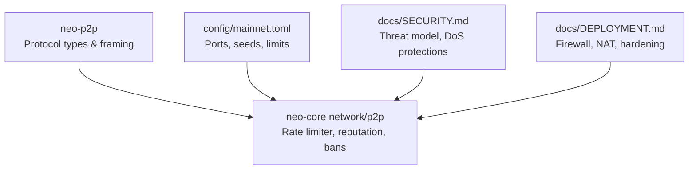
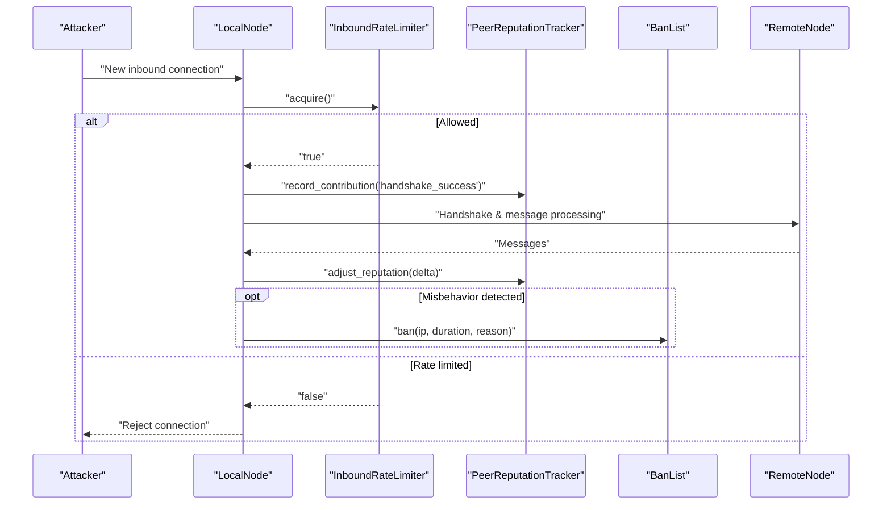
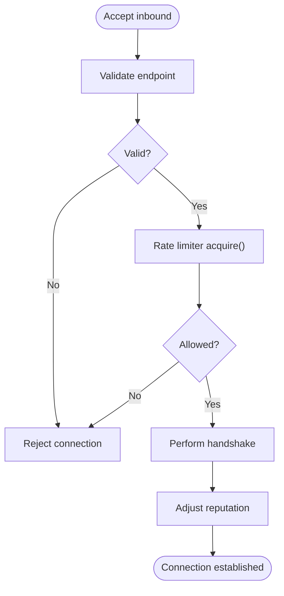
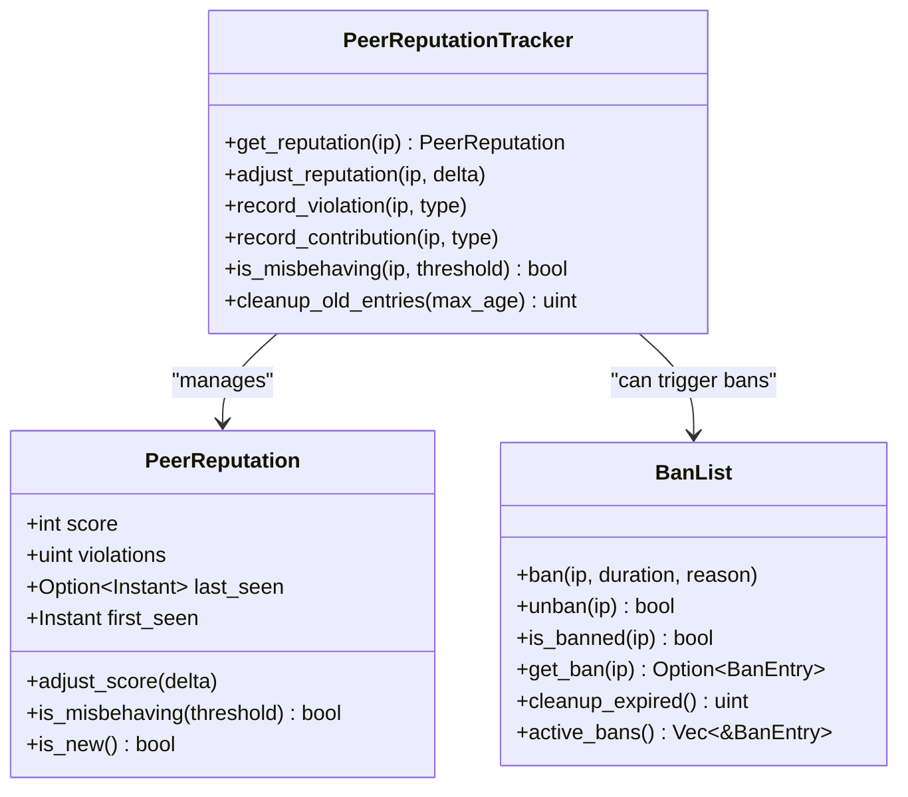
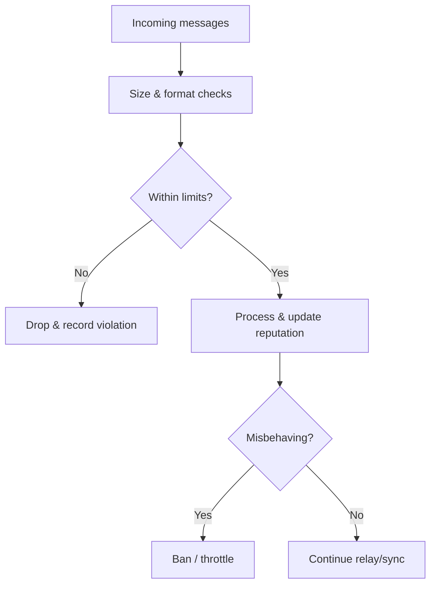
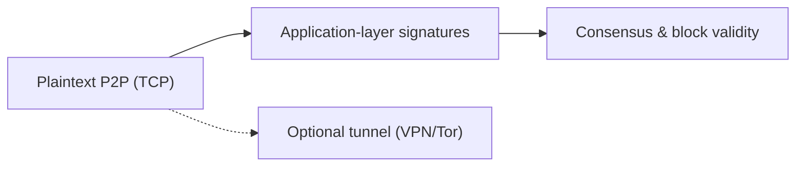
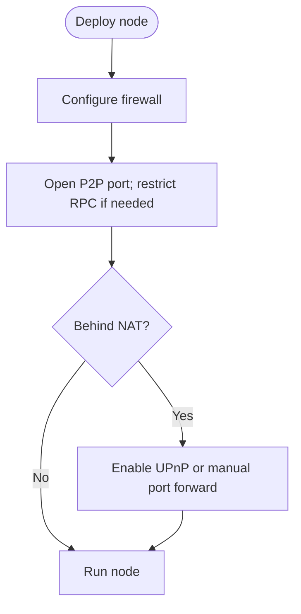
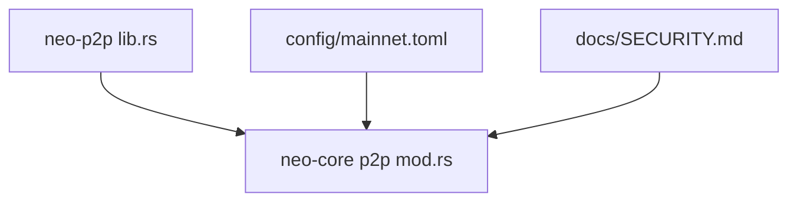

# Network Security

<cite>
**Referenced Files in This Document**
- [SECURITY.md](file://docs/SECURITY.md)
- [DEPLOYMENT.md](file://docs/DEPLOYMENT.md)
- [mod.rs (neo-core network p2p)](file://neo-core/src/network/p2p/mod.rs)
- [lib.rs (neo-p2p)](file://neo-p2p/src/lib.rs)
- [mainnet.toml](file://config/mainnet.toml)
</cite>

## Table of Contents
1. Introduction
2. Project Structure
3. Core Components
4. Architecture Overview
5. Detailed Component Analysis
6. Dependency Analysis
7. Performance Considerations
8. Troubleshooting Guide
9. Conclusion
10. Appendices

## Introduction
This document provides comprehensive network security guidance for the Neo P2P implementation, focusing on defenses against DDoS and Sybil attacks, connection validation, peer reputation and trust mechanisms, encryption and authentication considerations, firewall/NAT configuration, operator best practices, vulnerability assessment, audits, incident response, secure deployment examples, and troubleshooting. It synthesizes the repository’s security documentation and P2P networking components to help operators deploy resilient, secure nodes.

## Project Structure
The Neo P2P stack is split into a lightweight protocol types crate and a full networking implementation:
- neo-p2p: Protocol message framing, commands, inventory types, traits, and shared timeouts.
- neo-core network/p2p: Full node networking with rate limiting, peer reputation, ban lists, endpoint validation, and optional UPnP port forwarding.
- Configuration files define network identity, ports, seeds, and RPC settings.

**Diagram sources**
- [lib.rs (neo-p2p):108-146](file://neo-p2p/src/lib.rs#L108-L146)
- [mod.rs (neo-core network p2p):12-45](file://neo-core/src/network/p2p/mod.rs#L12-L45)
- [mainnet.toml:4-24](file://config/mainnet.toml#L4-L24)

**Section sources**
- [lib.rs (neo-p2p):108-146](file://neo-p2p/src/lib.rs#L108-L146)
- [mod.rs (neo-core network p2p):12-45](file://neo-core/src/network/p2p/mod.rs#L12-L45)
- [mainnet.toml:4-24](file://config/mainnet.toml#L4-L24)

## Core Components
- Inbound connection rate limiter: Token-bucket limiter protecting against connection floods and DDoS.
- Peer reputation system: Tracks scores and violations; supports thresholds and misbehavior detection.
- Ban list: Time-bound bans with expiration and cleanup.
- Endpoint validation: Rejects unspecified, multicast, broadcast addresses and invalid ports.
- Optional UPnP: Port forwarding helper for inbound connectivity behind NAT.

Key constants and defaults include inbound rate limits, burst sizes, reputation thresholds, and default ban durations.

**Section sources**
- [mod.rs (neo-core network p2p):94-121](file://neo-core/src/network/p2p/mod.rs#L94-L121)
- [mod.rs (neo-core network p2p):131-204](file://neo-core/src/network/p2p/mod.rs#L131-L204)
- [mod.rs (neo-core network p2p):229-363](file://neo-core/src/network/p2p/mod.rs#L229-L363)
- [mod.rs (neo-core network p2p):443-472](file://neo-core/src/network/p2p/mod.rs#L443-L472)
- [mod.rs (neo-core network p2p):474-543](file://neo-core/src/network/p2p/mod.rs#L474-L543)
- [mod.rs (neo-core network p2p):8-10](file://neo-core/src/network/mod.rs#L8-L10)

## Architecture Overview
Neo’s P2P layer uses an unencrypted TCP transport by design to match the reference implementation. Security relies on cryptographic signatures at the application layer and operational mitigations such as rate limiting, reputation, and bans. For production privacy, operators should tunnel traffic or isolate networks.

**Diagram sources**
- [mod.rs (neo-core network p2p):131-204](file://neo-core/src/network/p2p/mod.rs#L131-L204)
- [mod.rs (neo-core network p2p):474-543](file://neo-core/src/network/p2p/mod.rs#L474-L543)
- [mod.rs (neo-core network p2p):311-363](file://neo-core/src/network/p2p/mod.rs#L311-L363)

## Detailed Component Analysis

### Connection Validation and Handshake Flow
- Validate endpoints before accepting connections: reject unspecified/multicast/broadcast and invalid ports.
- Enforce inbound connection rate limits using token buckets to mitigate DDoS and connection flooding.
- Record successful handshakes as positive reputation signals; penalize failures and protocol violations.

**Diagram sources**
- [mod.rs (neo-core network p2p):443-472](file://neo-core/src/network/p2p/mod.rs#L443-L472)
- [mod.rs (neo-core network p2p):131-204](file://neo-core/src/network/p2p/mod.rs#L131-L204)
- [mod.rs (neo-core network p2p):474-543](file://neo-core/src/network/p2p/mod.rs#L474-L543)

**Section sources**
- [mod.rs (neo-core network p2p):443-472](file://neo-core/src/network/p2p/mod.rs#L443-L472)
- [mod.rs (neo-core network p2p):131-204](file://neo-core/src/network/p2p/mod.rs#L131-L204)

### Peer Reputation and Trust Mechanisms
- Track per-IP reputation scores and violation counts; adjust based on behavior.
- Define penalties/rewards for specific events (protocol violations, invalid data, successful handshakes, valid relays).
- Determine misbehavior via configurable thresholds; integrate with banning policies.

**Diagram sources**
- [mod.rs (neo-core network p2p):229-363](file://neo-core/src/network/p2p/mod.rs#L229-L363)
- [mod.rs (neo-core network p2p):474-543](file://neo-core/src/network/p2p/mod.rs#L474-L543)

**Section sources**
- [mod.rs (neo-core network p2p):229-363](file://neo-core/src/network/p2p/mod.rs#L229-L363)
- [mod.rs (neo-core network p2p):474-543](file://neo-core/src/network/p2p/mod.rs#L474-L543)

### DoS and Sybil Mitigations
- Inbound rate limiting protects against DDoS and connection exhaustion.
- Reputation-based filtering helps mitigate Sybil attacks by deprioritizing or banning low-reputation peers.
- Message size and resource limits are enforced at the protocol level to prevent memory exhaustion.

**Diagram sources**
- [SECURITY.md:502-531](file://docs/SECURITY.md#L502-L531)
- [SECURITY.md:550-607](file://docs/SECURITY.md#L550-L607)
- [mod.rs (neo-core network p2p):131-204](file://neo-core/src/network/p2p/mod.rs#L131-L204)

**Section sources**
- [SECURITY.md:502-531](file://docs/SECURITY.md#L502-L531)
- [SECURITY.md:550-607](file://docs/SECURITY.md#L550-L607)
- [mod.rs (neo-core network p2p):131-204](file://neo-core/src/network/p2p/mod.rs#L131-L204)

### Encryption and Authentication
- P2P transport is plaintext by design to maintain compatibility with the reference implementation.
- Application-layer signatures ensure authenticity and integrity of messages.
- For privacy and confidentiality, operators should use encrypted tunnels (e.g., WireGuard/IPsec), private networks, or anonymizing networks.

**Diagram sources**
- [mod.rs (neo-core network p2p):12-45](file://neo-core/src/network/p2p/mod.rs#L12-L45)

**Section sources**
- [mod.rs (neo-core network p2p):12-45](file://neo-core/src/network/p2p/mod.rs#L12-L45)

### Firewall, Port Forwarding, and NAT Traversal
- Expose only necessary ports: P2P and RPC (if enabled). Bind RPC to localhost when possible.
- Use firewall rules to restrict inbound P2P to known peers where feasible.
- Optionally enable UPnP for automatic port forwarding behind NAT; otherwise configure router port forwarding manually.

**Diagram sources**
- [mod.rs (neo-core network p2p):8-10](file://neo-core/src/network/mod.rs#L8-L10)
- [mainnet.toml:12-24](file://config/mainnet.toml#L12-L24)

**Section sources**
- [mod.rs (neo-core network p2p):8-10](file://neo-core/src/network/mod.rs#L8-L10)
- [mainnet.toml:12-24](file://config/mainnet.toml#L12-L24)

### Operator Best Practices
- Network isolation: Place nodes in private networks or use tunnels for P2P traffic.
- Access controls: Restrict RPC to localhost or authenticated clients; disable unnecessary methods.
- Monitoring: Enable health endpoints and metrics; log and rotate logs; track peer reputation and bans.
- Resource limits: Configure max connections, min desired connections, and message limits appropriately.

**Section sources**
- [SECURITY.md:781-790](file://docs/SECURITY.md#L781-L790)
- [DEPLOYMENT.md:243-325](file://docs/DEPLOYMENT.md#L243-L325)
- [DEPLOYMENT.md:642-717](file://docs/DEPLOYMENT.md#L642-L717)

### Vulnerability Assessment and Security Audits
- Follow the repository’s threat model and attack surface analysis to identify risks.
- Conduct periodic audits of configuration, dependencies, and runtime behavior.
- Use fuzzing targets and tests to validate robustness of parsers and validators.

**Section sources**
- [SECURITY.md:40-167](file://docs/SECURITY.md#L40-L167)

### Incident Response Protocols
- Establish escalation paths and response times per severity.
- Maintain a coordinated disclosure process and publish patches transparently.
- Prepare runbooks for common incidents (DDoS spikes, reputation anomalies, bans).

**Section sources**
- [SECURITY.md:737-790](file://docs/SECURITY.md#L737-L790)

## Dependency Analysis
- neo-p2p provides protocol primitives used by neo-core’s P2P module.
- neo-core integrates rate limiting, reputation, and ban management around these primitives.
- Configuration drives network identity, ports, and seed nodes that influence trust and connectivity.

**Diagram sources**
- [lib.rs (neo-p2p):169-213](file://neo-p2p/src/lib.rs#L169-L213)
- [mod.rs (neo-core network p2p):47-92](file://neo-core/src/network/p2p/mod.rs#L47-L92)
- [mainnet.toml:4-24](file://config/mainnet.toml#L4-L24)

**Section sources**
- [lib.rs (neo-p2p):169-213](file://neo-p2p/src/lib.rs#L169-L213)
- [mod.rs (neo-core network p2p):47-92](file://neo-core/src/network/p2p/mod.rs#L47-L92)
- [mainnet.toml:4-24](file://config/mainnet.toml#L4-L24)

## Performance Considerations
- Tune inbound rate limits and burst sizes to balance resilience and throughput.
- Monitor reputation metrics and ban activity to detect emerging threats.
- Limit message sizes and per-peer memory usage to prevent resource exhaustion.

[No sources needed since this section provides general guidance]

## Troubleshooting Guide
Common issues and resolutions:
- Too many rejected inbound connections: Increase rate limit or investigate source IPs; check for active bans.
- Peers repeatedly failing handshake: Review reputation adjustments and consider temporary bans.
- RPC exposure risks: Ensure bind address is restricted and authentication is enabled.
- NAT connectivity problems: Verify UPnP or manual port forwarding; confirm firewall rules.

**Section sources**
- [mod.rs (neo-core network p2p):131-204](file://neo-core/src/network/p2p/mod.rs#L131-L204)
- [mod.rs (neo-core network p2p):474-543](file://neo-core/src/network/p2p/mod.rs#L474-L543)
- [mainnet.toml:26-34](file://config/mainnet.toml#L26-L34)

## Conclusion
The Neo P2P implementation emphasizes application-layer cryptography and strong operational controls to defend against network-level threats. By combining inbound rate limiting, peer reputation, bans, strict endpoint validation, and careful deployment practices (firewalls, NAT, optional tunnels), operators can build resilient and secure nodes. Regular audits, monitoring, and incident response planning further strengthen long-term security posture.

[No sources needed since this section summarizes without analyzing specific files]

## Appendices

### Secure Deployment Checklist
- Set network magic and ports correctly; configure seed nodes.
- Enable RPC authentication and restrict bind address.
- Apply inbound rate limits and tune reputation thresholds.
- Use firewalls to restrict P2P access; enable UPnP or configure port forwarding.
- Monitor health, metrics, and logs; rotate logs regularly.
- Keep software updated and apply security patches promptly.

**Section sources**
- [mainnet.toml:4-34](file://config/mainnet.toml#L4-L34)
- [DEPLOYMENT.md:243-325](file://docs/DEPLOYMENT.md#L243-L325)
- [SECURITY.md:781-790](file://docs/SECURITY.md#L781-L790)