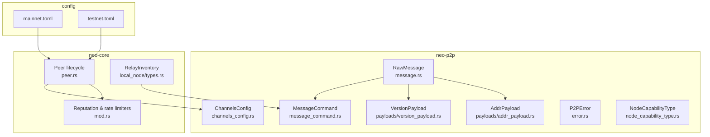
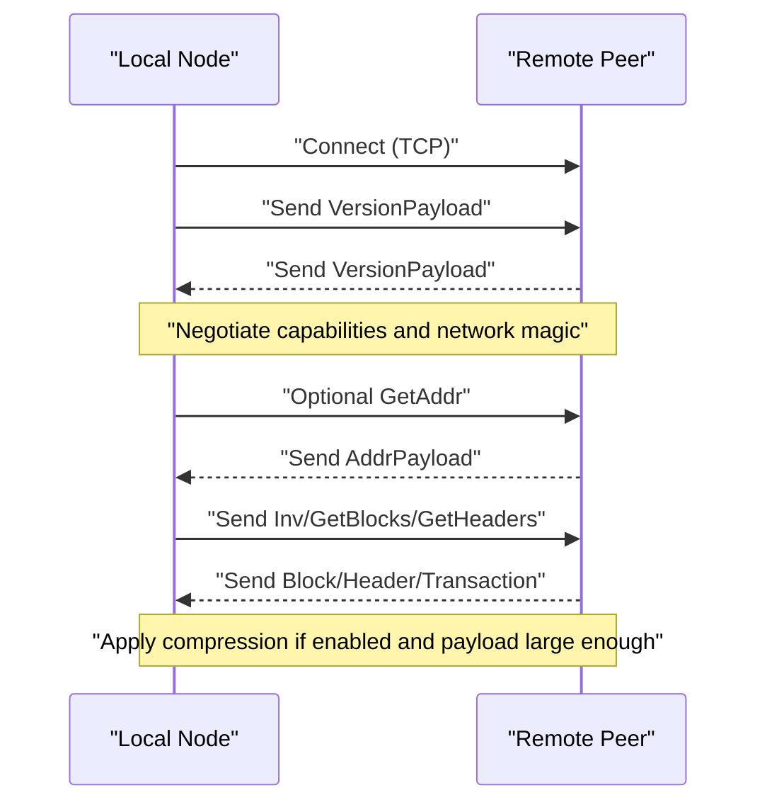
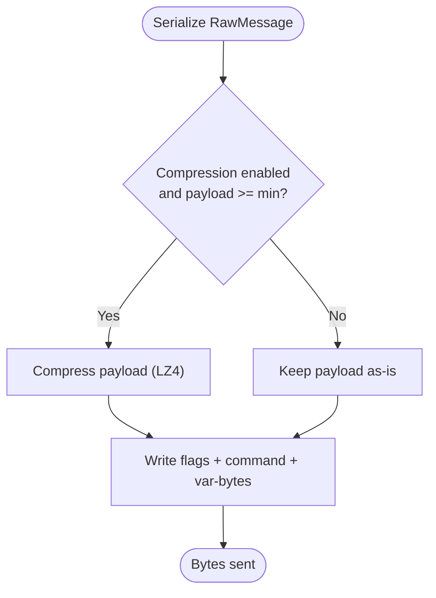
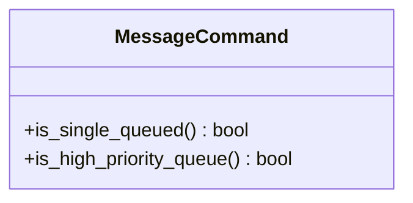
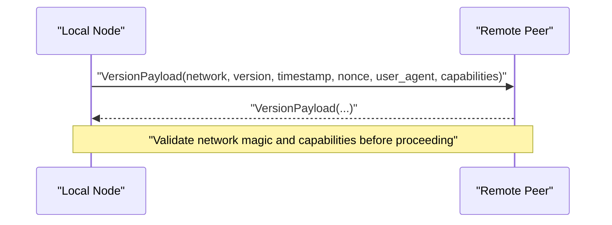
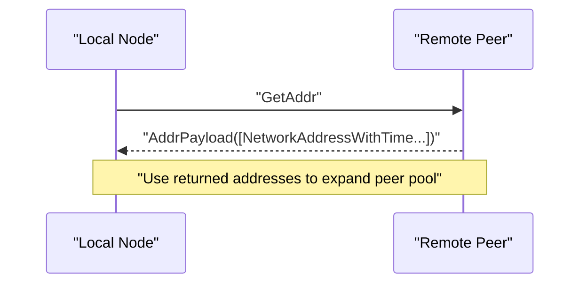
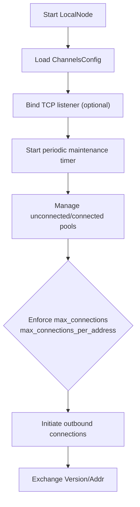
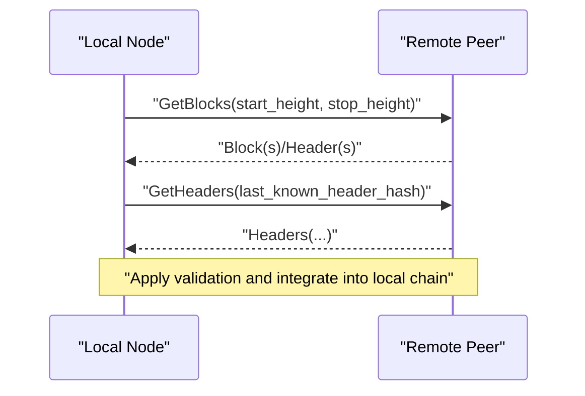
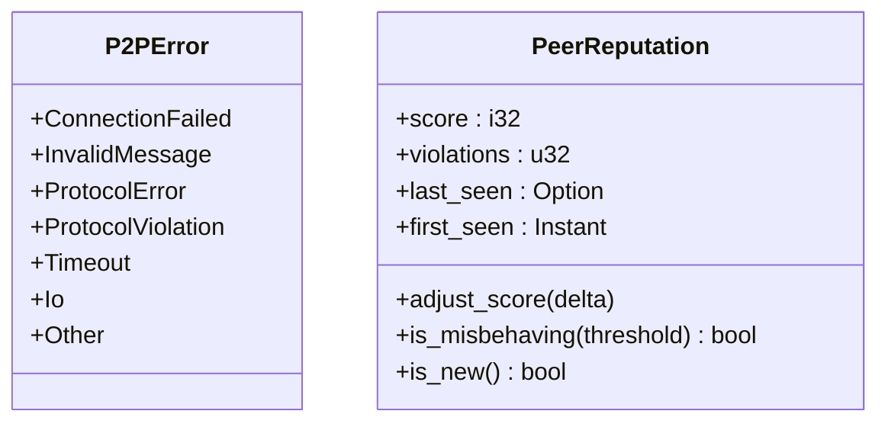
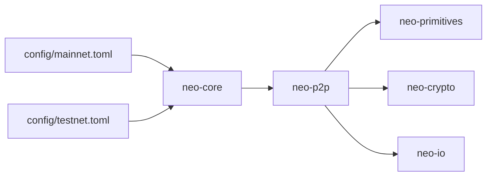

# Networking & P2P

<cite>
**Referenced Files in This Document**
- [message.rs](file://neo-p2p/src/message.rs)
- [message_command.rs](file://neo-p2p/src/message_command.rs)
- [version_payload.rs](file://neo-p2p/src/payloads/version_payload.rs)
- [addr_payload.rs](file://neo-p2p/src/payloads/addr_payload.rs)
- [channels_config.rs](file://neo-p2p/src/channels_config.rs)
- [error.rs](file://neo-p2p/src/error.rs)
- [node_capability_type.rs](file://neo-p2p/src/node_capability_type.rs)
- [Cargo.toml](file://neo-p2p/Cargo.toml)
- [peer.rs](file://neo-core/src/network/p2p/peer.rs)
- [mod.rs](file://neo-core/src/network/p2p/mod.rs)
- [types.rs](file://neo-core/src/network/p2p/local_node/types.rs)
- [mainnet.toml](file://config/mainnet.toml)
- [testnet.toml](file://config/testnet.toml)
</cite>

## Table of Contents
1. [Introduction](#introduction)
2. [Project Structure](#project-structure)
3. [Core Components](#core-components)
4. [Architecture Overview](#architecture-overview)
5. [Detailed Component Analysis](#detailed-component-analysis)
6. [Dependency Analysis](#dependency-analysis)
7. [Performance Considerations](#performance-considerations)
8. [Troubleshooting Guide](#troubleshooting-guide)
9. [Conclusion](#conclusion)

## Introduction
This document describes the Neo-RS peer-to-peer networking layer, focusing on the protocol specification and implementation details for connection establishment, authentication via capability negotiation, message framing, payload formats, discovery, connection management, synchronization flows, configuration, security posture, and operational guidance. It is intended for developers and operators who need to understand how Neo nodes discover each other, exchange blocks and transactions, and maintain a consistent chain state across the network.

## Project Structure
The P2P subsystem is split between:
- neo-p2p: wire-format message framing, command identifiers, payloads, and channel configuration primitives.
- neo-core: higher-level peer lifecycle, reputation, rate limiting, and relay abstractions used by the node runtime.
- Configuration files under config/: environment-specific settings such as ports, seed nodes, and limits.

**Diagram sources**
- [message.rs:1-106](file://neo-p2p/src/message.rs#L1-L106)
- [message_command.rs:1-154](file://neo-p2p/src/message_command.rs#L1-L154)
- [version_payload.rs:1-112](file://neo-p2p/src/payloads/version_payload.rs#L1-L112)
- [addr_payload.rs:1-60](file://neo-p2p/src/payloads/addr_payload.rs#L1-L60)
- [channels_config.rs:1-109](file://neo-p2p/src/channels_config.rs#L1-L109)
- [error.rs:1-66](file://neo-p2p/src/error.rs#L1-L66)
- [node_capability_type.rs:1-5](file://neo-p2p/src/node_capability_type.rs#L1-L5)
- [peer.rs:99-138](file://neo-core/src/network/p2p/peer.rs#L99-L138)
- [mod.rs:220-271](file://neo-core/src/network/p2p/mod.rs#L220-L271)
- [types.rs:43-78](file://neo-core/src/network/p2p/local_node/types.rs#L43-L78)
- [mainnet.toml:1-68](file://config/mainnet.toml#L1-L68)
- [testnet.toml:1-50](file://config/testnet.toml#L1-L50)

**Section sources**
- [Cargo.toml:1-44](file://neo-p2p/Cargo.toml#L1-L44)
- [channels_config.rs:14-88](file://neo-p2p/src/channels_config.rs#L14-L88)
- [mainnet.toml:4-24](file://config/mainnet.toml#L4-L24)
- [testnet.toml:4-25](file://config/testnet.toml#L4-L25)

## Core Components
- RawMessage: Wire-format envelope with flags, command discriminator, and payload bytes. Supports optional LZ4 compression when enabled and payload size exceeds threshold.
- MessageCommand: Single-byte command IDs with high-priority and single-queue sets for flow control.
- Payloads: VersionPayload (handshake), AddrPayload (address discovery), plus others for filtering and inventory.
- ChannelsConfig: Runtime configuration for TCP listener, compression, connection limits, known-hash cache, timeouts, and broadcast history retention.
- Peer lifecycle and reputation: Connection pooling, per-address caps, maintenance timers, inbound rate limiting, and misbehavior tracking.
- RelayInventory: Abstraction for relaying blocks, transactions, and extensible payloads across peers.

**Section sources**
- [message.rs:17-105](file://neo-p2p/src/message.rs#L17-L105)
- [message_command.rs:22-54](file://neo-p2p/src/message_command.rs#L22-L54)
- [version_payload.rs:20-112](file://neo-p2p/src/payloads/version_payload.rs#L20-L112)
- [addr_payload.rs:19-59](file://neo-p2p/src/payloads/addr_payload.rs#L19-L59)
- [channels_config.rs:14-88](file://neo-p2p/src/channels_config.rs#L14-L88)
- [peer.rs:99-138](file://neo-core/src/network/p2p/peer.rs#L99-L138)
- [mod.rs:229-271](file://neo-core/src/network/p2p/mod.rs#L229-L271)
- [types.rs:43-78](file://neo-core/src/network/p2p/local_node/types.rs#L43-L78)

## Architecture Overview
The P2P stack layers are:
- Transport and framing: RawMessage serializes/deserializes messages with optional compression and enforces payload size limits.
- Protocol commands: MessageCommand enumerates supported commands and classifies them for priority and queueing behavior.
- Handshake and discovery: VersionPayload negotiates capabilities; AddrPayload exchanges addresses for peer discovery.
- Connection management: ChannelsConfig drives connection limits, timeouts, and compression; peer module manages pools and timers.
- Relaying and sync: RelayInventory carries blocks and transactions; higher layers orchestrate get/getdata-style synchronization using commands like GetBlocks/GetHeaders.

**Diagram sources**
- [message.rs:51-105](file://neo-p2p/src/message.rs#L51-L105)
- [version_payload.rs:26-112](file://neo-p2p/src/payloads/version_payload.rs#L26-L112)
- [addr_payload.rs:22-59](file://neo-p2p/src/payloads/addr_payload.rs#L22-L59)
- [message_command.rs:22-54](file://neo-p2p/src/message_command.rs#L22-L54)

## Detailed Component Analysis

### Message Framing and Compression
- RawMessage carries flags, command, and payload bytes. On send, it may compress the payload using LZ4 when enabled and above a minimum size; otherwise sends uncompressed. On receive, it decompresses based on flags.
- Payload size is bounded to prevent memory exhaustion.

**Diagram sources**
- [message.rs:51-105](file://neo-p2p/src/message.rs#L51-L105)

**Section sources**
- [message.rs:11-105](file://neo-p2p/src/message.rs#L11-L105)

### Message Commands and Queuing Policy
- MessageCommand defines all supported commands and provides helpers to classify commands that must be single-queued or processed with high priority. This ensures critical control messages (e.g., GetAddr, Ping/Pong, Mempool) are not starved.

**Diagram sources**
- [message_command.rs:22-54](file://neo-p2p/src/message_command.rs#L22-L54)

**Section sources**
- [message_command.rs:1-154](file://neo-p2p/src/message_command.rs#L1-L154)

### Handshake and Capability Negotiation
- VersionPayload includes network magic, version, timestamp, nonce, user agent, and a list of NodeCapability entries. Peers validate network magic and negotiate capabilities during handshake.
- NodeCapabilityType is re-exported from primitives to keep stable public paths.

**Diagram sources**
- [version_payload.rs:20-112](file://neo-p2p/src/payloads/version_payload.rs#L20-L112)
- [node_capability_type.rs:1-5](file://neo-p2p/src/node_capability_type.rs#L1-L5)

**Section sources**
- [version_payload.rs:20-112](file://neo-p2p/src/payloads/version_payload.rs#L20-L112)
- [node_capability_type.rs:1-5](file://neo-p2p/src/node_capability_type.rs#L1-L5)

### Address Discovery and Propagation
- AddrPayload returns a list of NetworkAddressWithTime entries in response to address requests. Serialization enforces maximum counts and non-empty lists.

**Diagram sources**
- [addr_payload.rs:19-59](file://neo-p2p/src/payloads/addr_payload.rs#L19-L59)

**Section sources**
- [addr_payload.rs:19-59](file://neo-p2p/src/payloads/addr_payload.rs#L19-L59)

### Connection Management and Topology Maintenance
- ChannelsConfig controls TCP listener, compression, desired and maximum connections, per-address limits, known-hash cache size, broadcast history retention, and various timeouts.
- The peer module applies runtime configuration, starts maintenance timers, normalizes endpoints, and enforces unconnected pool limits.

**Diagram sources**
- [channels_config.rs:14-88](file://neo-p2p/src/channels_config.rs#L14-L88)
- [peer.rs:99-138](file://neo-core/src/network/p2p/peer.rs#L99-L138)

**Section sources**
- [channels_config.rs:14-88](file://neo-p2p/src/channels_config.rs#L14-L88)
- [peer.rs:99-138](file://neo-core/src/network/p2p/peer.rs#L99-L138)

### Synchronization Protocols (Blocks, Transactions, Headers)
- Inventory-based synchronization uses commands such as GetBlocks and GetHeaders to request ranges, followed by data messages carrying blocks or headers.
- RelayInventory abstracts what can be relayed (blocks, transactions, extensible payloads) and provides serialization for transmission.

**Diagram sources**
- [message_command.rs:22-54](file://neo-p2p/src/message_command.rs#L22-L54)
- [types.rs:43-78](file://neo-core/src/network/p2p/local_node/types.rs#L43-L78)

**Section sources**
- [types.rs:43-78](file://neo-core/src/network/p2p/local_node/types.rs#L43-L78)
- [message_command.rs:22-54](file://neo-p2p/src/message_command.rs#L22-L54)

### Security Measures and Error Handling
- P2PError covers connection failures, invalid messages, protocol errors, violations, timeouts, IO errors, and generic network errors.
- Inbound rate limiting and peer reputation tracking help mitigate abuse and identify misbehaving peers.

**Diagram sources**
- [error.rs:1-66](file://neo-p2p/src/error.rs#L1-L66)
- [mod.rs:229-271](file://neo-core/src/network/p2p/mod.rs#L229-L271)

**Section sources**
- [error.rs:1-66](file://neo-p2p/src/error.rs#L1-L66)
- [mod.rs:229-271](file://neo-core/src/network/p2p/mod.rs#L229-L271)

## Dependency Analysis
- neo-p2p depends on internal crates for I/O, crypto, and primitives, and on async/runtime libraries for concurrency.
- neo-core builds on neo-p2p types to implement peer lifecycle, reputation, and relay logic.
- Configuration files drive runtime behavior for ports, seeds, and limits.

**Diagram sources**
- [Cargo.toml:16-37](file://neo-p2p/Cargo.toml#L16-L37)
- [mainnet.toml:4-24](file://config/mainnet.toml#L4-L24)
- [testnet.toml:4-25](file://config/testnet.toml#L4-L25)

**Section sources**
- [Cargo.toml:16-37](file://neo-p2p/Cargo.toml#L16-L37)
- [mainnet.toml:4-24](file://config/mainnet.toml#L4-L24)
- [testnet.toml:4-25](file://config/testnet.toml#L4-L25)

## Performance Considerations
- Enable compression for large payloads to reduce bandwidth usage; compression is automatically applied when enabled and payload exceeds the minimum threshold.
- Tune connection limits:
  - Increase max_connections for high-throughput environments while respecting host resources.
  - Adjust min_desired_connections to maintain healthy connectivity.
  - Limit max_connections_per_address to reduce single-IP impact.
- Known-hash cache size affects duplicate detection overhead; increase for high-gossip networks.
- Broadcast history limit impacts memory usage; tune based on available RAM and diagnostic needs.
- Timeouts:
  - Shorten handshake_timeout for faster failures.
  - Adjust read/write timeouts to balance responsiveness and resilience.
- Use high-priority queues for control messages to avoid starvation during congestion.

[No sources needed since this section provides general guidance]

## Troubleshooting Guide
Common issues and remedies:
- Connection failures: Inspect P2PError::ConnectionFailed and ensure correct network magic and firewall rules allow the configured port.
- Invalid or unknown messages: P2PError::InvalidMessage or ProtocolError indicates malformed frames; verify peer software compatibility and message versions.
- Protocol violations: P2PError::ProtocolViolation signals non-compliant peers; consider disconnecting and reporting.
- Timeouts: P2PError::Timeout suggests network latency or resource pressure; adjust read/write timeouts and check system load.
- Too many peers or per-IP saturation: Reduce max_connections or max_connections_per_address; monitor peer counts and connection churn.
- Stuck synchronization: Verify GetBlocks/GetHeaders flows and ensure peers advertise compatible capabilities and recent chain tips.
- Reputation drops: If PeerReputation indicates misbehavior, disconnect and avoid reconnecting to the same peer until conditions improve.

**Section sources**
- [error.rs:1-66](file://neo-p2p/src/error.rs#L1-L66)
- [mod.rs:229-271](file://neo-core/src/network/p2p/mod.rs#L229-L271)

## Conclusion
Neo-RS implements a robust P2P layer with clear separation between wire framing, protocol commands, payloads, and connection management. The design supports efficient block and transaction propagation, reliable synchronization, and configurable tuning for diverse deployment scenarios. By leveraging compression, careful queuing policies, and reputation/rate-limiting mechanisms, the system maintains performance and resilience against common network threats. Operators should tailor configuration to their environment and monitor reputation and throughput metrics for optimal operation.