# Protocol Specification

<cite>
**Referenced Files in This Document**
- [lib.rs](file://neo-p2p/src/lib.rs)
- [message.rs](file://neo-p2p/src/message.rs)
- [message_command.rs](file://neo-p2p/src/message_command.rs)
- [message_flags.rs](file://neo-p2p/src/message_flags.rs)
- [inventory_type.rs](file://neo-p2p/src/inventory_type.rs)
- [traits.rs](file://neo-p2p/src/traits.rs)
- [error.rs](file://neo-p2p/src/error.rs)
- [timeouts.rs](file://neo-p2p/src/timeouts.rs)
- [version_payload.rs](file://neo-p2p/src/payloads/version_payload.rs)
- [node_capability.rs](file://neo-p2p/src/payloads/node_capability.rs)
- [inv_payload.rs](file://neo-p2p/src/payloads/inv_payload.rs)
- [get_blocks_payload.rs](file://neo-p2p/src/payloads/get_blocks_payload.rs)
- [addr_payload.rs](file://neo-p2p/src/payloads/addr_payload.rs)
</cite>

## Table of Contents
1. [Introduction](#introduction)
2. [Project Structure](#project-structure)
3. [Core Components](#core-components)
4. [Architecture Overview](#architecture-overview)
5. [Detailed Component Analysis](#detailed-component-analysis)
6. [Dependency Analysis](#dependency-analysis)
7. [Performance Considerations](#performance-considerations)
8. [Troubleshooting Guide](#troubleshooting-guide)
9. [Conclusion](#conclusion)
10. [Appendices](#appendices)

## Introduction
This document specifies the Neo P2P networking protocol as implemented in this repository. It covers wire framing, header structure, payload encoding, message commands and their byte values, handshake and capability exchange, inventory types, flags, error handling, state sequencing rules, timeouts, and example exchanges for block synchronization, transaction relay, and peer discovery. The specification is derived from the neo-p2p crate and its payloads, which define the canonical wire format and behavior used by the node’s networking stack.

## Project Structure
The P2P protocol is defined primarily in the neo-p2p crate:
- Wire framing and serialization are in message.rs.
- Message command identifiers and priority/queueing policies are in message_command.rs.
- Flags (e.g., compression) are in message_flags.rs.
- Inventory type to command mapping is in inventory_type.rs.
- Payloads for specific messages (Version, Inv, GetBlocks, Addr, etc.) are under payloads/.
- Service traits, configuration, and events are in traits.rs.
- Errors and timeout counters are in error.rs and timeouts.rs.

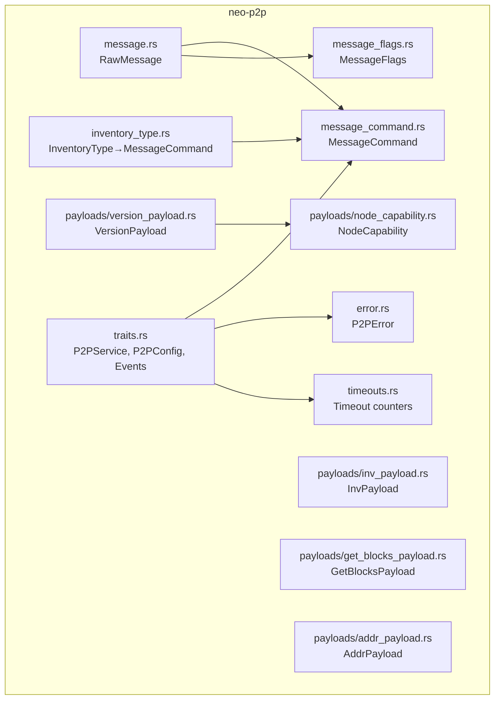

**Diagram sources**
- [message.rs:17-105](file://neo-p2p/src/message.rs#L17-L105)
- [message_command.rs:6-54](file://neo-p2p/src/message_command.rs#L6-L54)
- [message_flags.rs:5-16](file://neo-p2p/src/message_flags.rs#L5-L16)
- [inventory_type.rs:8-17](file://neo-p2p/src/inventory_type.rs#L8-L17)
- [version_payload.rs:28-111](file://neo-p2p/src/payloads/version_payload.rs#L28-L111)
- [node_capability.rs:13-30](file://neo-p2p/src/payloads/node_capability.rs#L13-L30)
- [inv_payload.rs:17-23](file://neo-p2p/src/payloads/inv_payload.rs#L17-L23)
- [get_blocks_payload.rs:17-24](file://neo-p2p/src/payloads/get_blocks_payload.rs#L17-L24)
- [addr_payload.rs:23-27](file://neo-p2p/src/payloads/addr_payload.rs#L23-L27)
- [traits.rs:152-213](file://neo-p2p/src/traits.rs#L152-L213)
- [error.rs:7-66](file://neo-p2p/src/error.rs#L7-L66)
- [timeouts.rs:4-58](file://neo-p2p/src/timeouts.rs#L4-L58)

**Section sources**
- [lib.rs:106-147](file://neo-p2p/src/lib.rs#L106-L147)
- [message.rs:17-105](file://neo-p2p/src/message.rs#L17-L105)
- [message_command.rs:6-54](file://neo-p2p/src/message_command.rs#L6-L54)
- [message_flags.rs:5-16](file://neo-p2p/src/message_flags.rs#L5-L16)
- [inventory_type.rs:8-17](file://neo-p2p/src/inventory_type.rs#L8-L17)
- [traits.rs:152-213](file://neo-p2p/src/traits.rs#L152-L213)
- [error.rs:7-66](file://neo-p2p/src/error.rs#L7-L66)
- [timeouts.rs:4-58](file://neo-p2p/src/timeouts.rs#L4-L58)

## Core Components
- Wire framing: Each message consists of a one-byte flags field, a one-byte command discriminator, a variable-length length prefix, and a variable-length payload. No per-message magic or checksum; integrity relies on TCP. Compression is indicated via flags when enabled and payload size thresholds are met.
- Message commands: Defined as single-byte discriminators with known sets and an Unknown variant for unknown bytes. Commands include Version, Verack, GetAddr, Addr, Ping, Pong, GetHeaders, Headers, GetBlocks, Mempool, Inv, GetData, GetBlockByIndex, NotFound, Transaction, Block, Extensible, Reject, FilterLoad, FilterAdd, FilterClear, MerkleBlock, Alert.
- Flags: Currently supports a compressed flag; future bits are preserved for forward compatibility.
- Inventory types: Map to corresponding message commands for data requests and responses.
- Payloads: Typed structures for Version, NodeCapability, Inv, GetBlocks, Addr, and others, each implementing Serializable.

**Section sources**
- [message.rs:17-105](file://neo-p2p/src/message.rs#L17-L105)
- [message_command.rs:6-54](file://neo-p2p/src/message_command.rs#L6-L54)
- [message_flags.rs:5-16](file://neo-p2p/src/message_flags.rs#L5-L16)
- [inventory_type.rs:8-17](file://neo-p2p/src/inventory_type.rs#L8-L17)
- [lib.rs:106-147](file://neo-p2p/src/lib.rs#L106-L147)

## Architecture Overview
The P2P layer exposes traits for broadcasting, requesting data, managing peers, and subscribing to events. Configuration includes network magic, protocol version, timeouts, and connection limits. Handshake uses VersionPayload carrying network magic, version, timestamp, nonce, user agent, and capabilities.

```mermaid
sequenceDiagram
participant A as "Local Node"
participant B as "Remote Peer"
A->>B : "Connect(TCP)"
A->>B : "Send VersionPayload(network, version, timestamp, nonce, user_agent, capabilities)"
B-->>A : "Send VersionPayload(...)"
A->>B : "Send Verack"
B-->>A : "Send Verack"
Note over A,B : "Handshake complete; capabilities negotiated"
```

**Diagram sources**
- [version_payload.rs:28-111](file://neo-p2p/src/payloads/version_payload.rs#L28-L111)
- [node_capability.rs:13-30](file://neo-p2p/src/payloads/node_capability.rs#L13-L30)
- [traits.rs:152-192](file://neo-p2p/src/traits.rs#L152-L192)

**Section sources**
- [traits.rs:152-213](file://neo-p2p/src/traits.rs#L152-L213)
- [version_payload.rs:28-111](file://neo-p2p/src/payloads/version_payload.rs#L28-L111)
- [node_capability.rs:13-30](file://neo-p2p/src/payloads/node_capability.rs#L13-L30)

## Detailed Component Analysis

### Wire Framing and Serialization
- Header: flags (1 byte), command (1 byte), length (var_int), payload (variable).
- Compression: When enabled and payload meets minimum size, LZ4 compression may be applied and the COMPRESSED flag set. On receive, decompression occurs if flagged.
- Max payload size enforced at parse time.

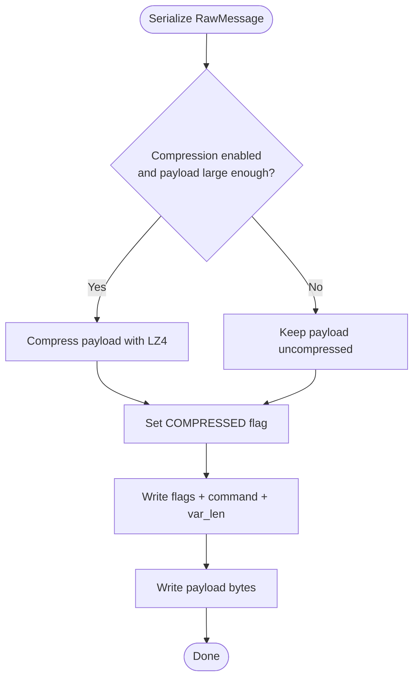

**Diagram sources**
- [message.rs:51-71](file://neo-p2p/src/message.rs#L51-L71)
- [message_flags.rs:5-16](file://neo-p2p/src/message_flags.rs#L5-L16)

**Section sources**
- [message.rs:17-105](file://neo-p2p/src/message.rs#L17-L105)
- [message_flags.rs:5-16](file://neo-p2p/src/message_flags.rs#L5-L16)

### Message Commands and Priority/Queueing
- Command set includes Version, Verack, GetAddr, Addr, Ping, Pong, GetHeaders, Headers, GetBlocks, Mempool, Inv, GetData, GetBlockByIndex, NotFound, Transaction, Block, Extensible, Reject, FilterLoad, FilterAdd, FilterClear, MerkleBlock, Alert.
- Some commands are single-queued (only one outstanding at a time) and some are high priority.

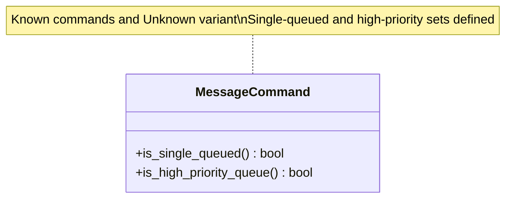

**Diagram sources**
- [message_command.rs:6-54](file://neo-p2p/src/message_command.rs#L6-L54)

**Section sources**
- [message_command.rs:6-54](file://neo-p2p/src/message_command.rs#L6-L54)
- [lib.rs:120-147](file://neo-p2p/src/lib.rs#L120-L147)

### Inventory Types and Mapping
- InventoryType maps to a corresponding MessageCommand for request/response flows (e.g., Transaction → Transaction, Block → Block, Consensus/Extensible → Extensible).

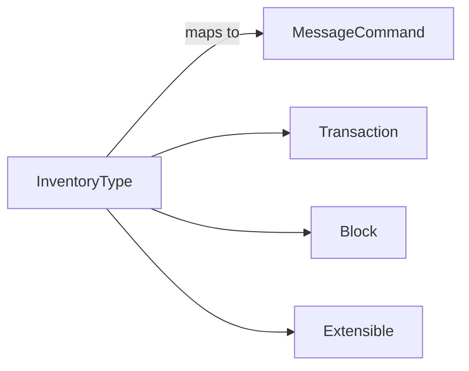

**Diagram sources**
- [inventory_type.rs:8-17](file://neo-p2p/src/inventory_type.rs#L8-L17)

**Section sources**
- [inventory_type.rs:8-17](file://neo-p2p/src/inventory_type.rs#L8-L17)

### Version and Capabilities
- VersionPayload carries network magic, protocol version, timestamp, nonce, user agent, and a list of NodeCapability entries.
- NodeCapability includes TcpServer, WsServer, DisableCompression, FullNode(start_height), ArchivalNode, and Unknown(ty, data). Duplicate known capabilities are rejected during deserialization.

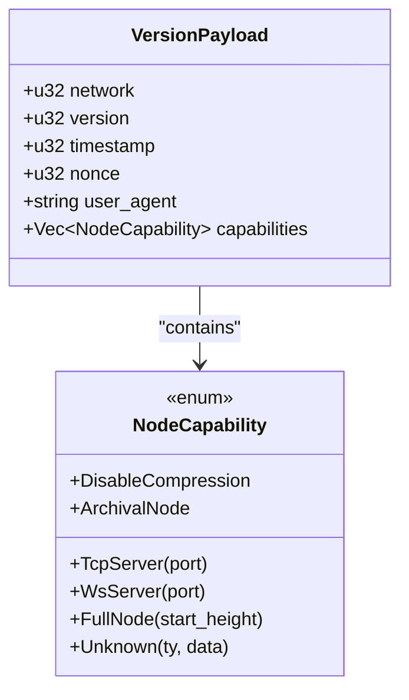

**Diagram sources**
- [version_payload.rs:28-111](file://neo-p2p/src/payloads/version_payload.rs#L28-L111)
- [node_capability.rs:13-30](file://neo-p2p/src/payloads/node_capability.rs#L13-L30)

**Section sources**
- [version_payload.rs:28-111](file://neo-p2p/src/payloads/version_payload.rs#L28-L111)
- [node_capability.rs:13-30](file://neo-p2p/src/payloads/node_capability.rs#L13-L30)

### Inventory Announcement and Data Request Flow
- InvPayload announces hashes of inventory items with a maximum count per payload.
- GetBlocksPayload requests blocks starting from a hash with a bounded count (-1 means “as many as possible”).

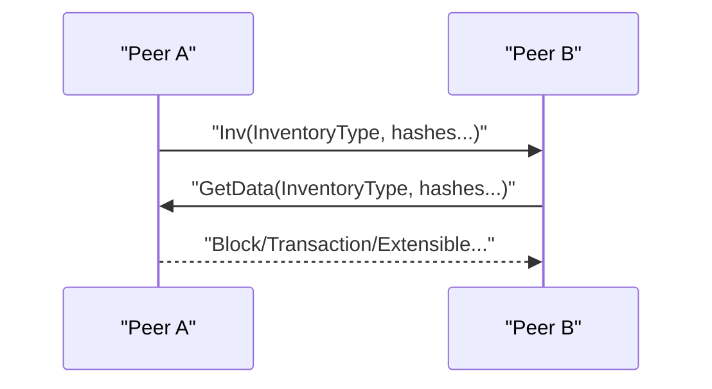

**Diagram sources**
- [inv_payload.rs:17-23](file://neo-p2p/src/payloads/inv_payload.rs#L17-L23)
- [get_blocks_payload.rs:17-24](file://neo-p2p/src/payloads/get_blocks_payload.rs#L17-L24)

**Section sources**
- [inv_payload.rs:17-23](file://neo-p2p/src/payloads/inv_payload.rs#L17-L23)
- [get_blocks_payload.rs:17-24](file://neo-p2p/src/payloads/get_blocks_payload.rs#L17-L24)

### Peer Discovery Flow
- GetAddr requests addresses; AddrPayload responds with up to a configured maximum number of NetworkAddressWithTime entries.

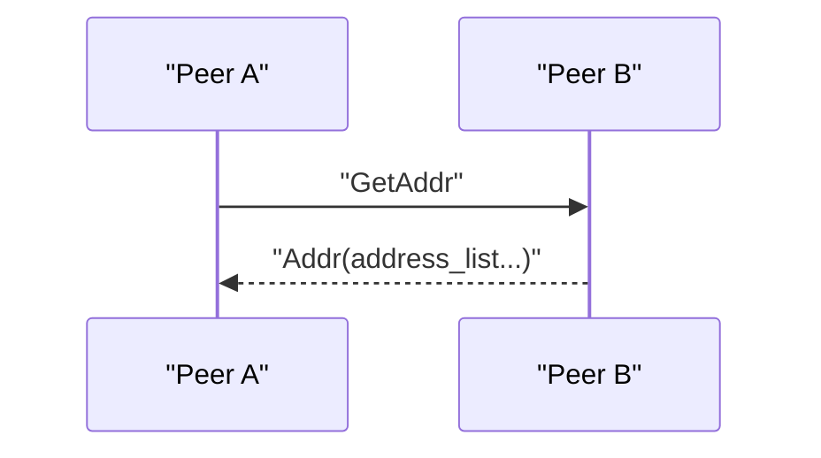

**Diagram sources**
- [addr_payload.rs:23-27](file://neo-p2p/src/payloads/addr_payload.rs#L23-L27)

**Section sources**
- [addr_payload.rs:23-27](file://neo-p2p/src/payloads/addr_payload.rs#L23-L27)

### Ping/Pong Keepalive
- Ping and Pong are single-queued and not high priority. They maintain liveness without consuming high-priority queue space.

**Section sources**
- [message_command.rs:22-54](file://neo-p2p/src/message_command.rs#L22-L54)

### Error Handling and Timeouts
- Errors include connection failures, invalid messages, protocol errors, violations, timeouts, IO errors, and generic network errors.
- Timeout counters track handshake, read, and write timeouts for observability.

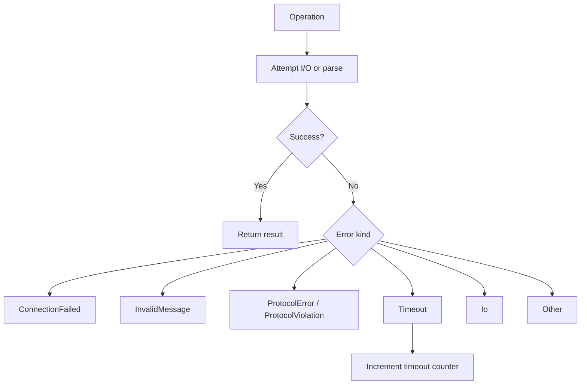

**Diagram sources**
- [error.rs:7-66](file://neo-p2p/src/error.rs#L7-L66)
- [timeouts.rs:4-58](file://neo-p2p/src/timeouts.rs#L4-L58)

**Section sources**
- [error.rs:7-66](file://neo-p2p/src/error.rs#L7-L66)
- [timeouts.rs:4-58](file://neo-p2p/src/timeouts.rs#L4-L58)

### Protocol State Machine and Sequencing Rules
- Initial connection must perform Version exchange followed by Verack before any other application-level messaging.
- After handshake, peers may exchange inventory announcements and data requests/responses.
- Single-queued commands ensure only one outstanding instance per peer for certain control messages.
- High-priority commands are processed ahead of normal traffic.

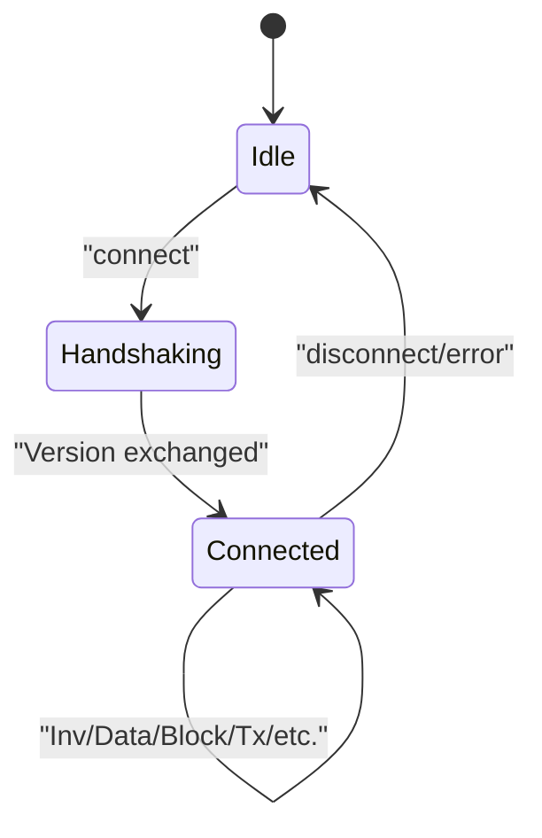

[No diagram sources needed since this diagram shows conceptual workflow, not actual code structure]

**Section sources**
- [message_command.rs:22-54](file://neo-p2p/src/message_command.rs#L22-L54)
- [traits.rs:152-213](file://neo-p2p/src/traits.rs#L152-L213)

### Example Scenarios

#### Block Synchronization
- Peer A sends Inv(Block, hashes). Peer B responds with GetData(Block, hashes). Peer A returns Block messages. Optionally, GetBlocks can be used to request ranges.

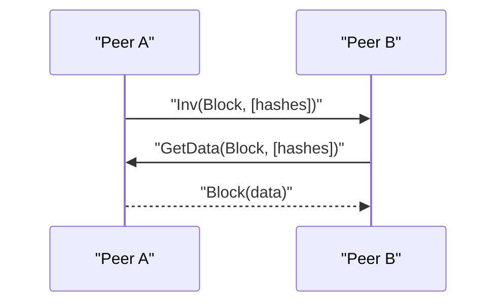

**Diagram sources**
- [inv_payload.rs:17-23](file://neo-p2p/src/payloads/inv_payload.rs#L17-L23)
- [get_blocks_payload.rs:17-24](file://neo-p2p/src/payloads/get_blocks_payload.rs#L17-L24)

#### Transaction Relay
- Peers announce new transactions via Inv(Transaction, hashes). Recipients may request full transactions via GetData(Transaction, hashes) or accept relays directly.

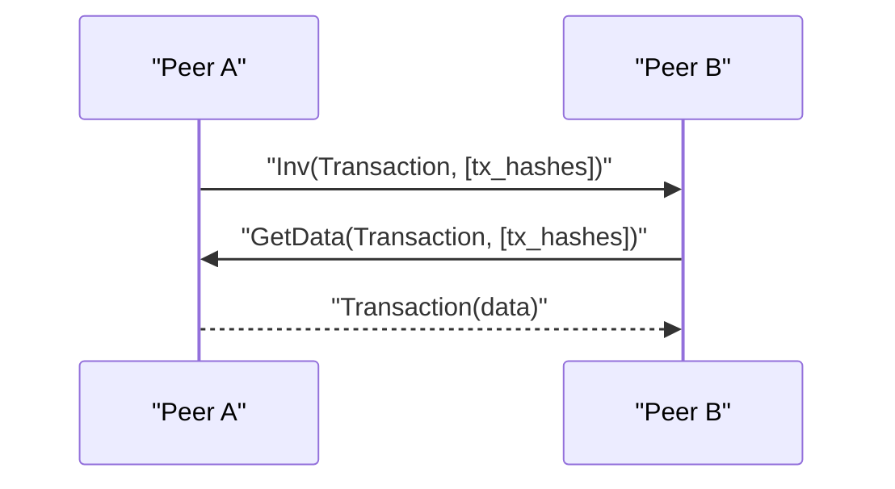

**Diagram sources**
- [inv_payload.rs:17-23](file://neo-p2p/src/payloads/inv_payload.rs#L17-L23)

#### Peer Discovery
- Use GetAddr to request addresses; AddrPayload responds with a bounded list of NetworkAddressWithTime entries.

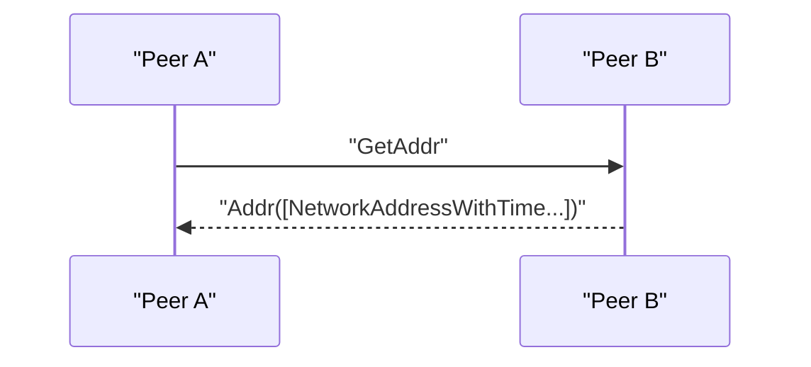

**Diagram sources**
- [addr_payload.rs:23-27](file://neo-p2p/src/payloads/addr_payload.rs#L23-L27)

## Dependency Analysis
- message.rs depends on MessageCommand, MessageFlags, and compression utilities.
- inventory_type.rs maps InventoryType to MessageCommand.
- version_payload.rs depends on NodeCapability serialization helpers.
- traits.rs defines service interfaces and configuration consumed by higher layers.
- error.rs and timeouts.rs provide cross-cutting concerns for failure and observability.

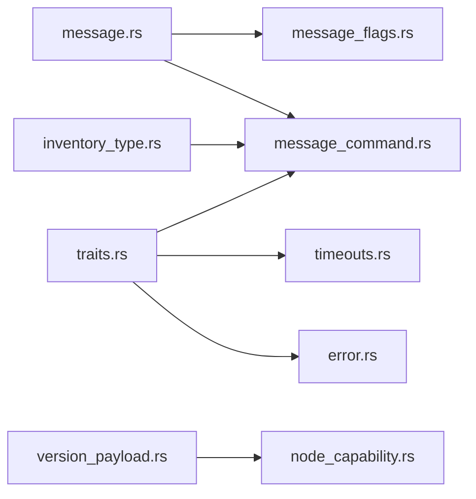

**Diagram sources**
- [message.rs:17-105](file://neo-p2p/src/message.rs#L17-L105)
- [message_command.rs:6-54](file://neo-p2p/src/message_command.rs#L6-L54)
- [message_flags.rs:5-16](file://neo-p2p/src/message_flags.rs#L5-L16)
- [inventory_type.rs:8-17](file://neo-p2p/src/inventory_type.rs#L8-L17)
- [version_payload.rs:28-111](file://neo-p2p/src/payloads/version_payload.rs#L28-L111)
- [node_capability.rs:13-30](file://neo-p2p/src/payloads/node_capability.rs#L13-L30)
- [traits.rs:152-213](file://neo-p2p/src/traits.rs#L152-L213)
- [error.rs:7-66](file://neo-p2p/src/error.rs#L7-L66)
- [timeouts.rs:4-58](file://neo-p2p/src/timeouts.rs#L4-L58)

**Section sources**
- [message.rs:17-105](file://neo-p2p/src/message.rs#L17-L105)
- [message_command.rs:6-54](file://neo-p2p/src/message_command.rs#L6-L54)
- [message_flags.rs:5-16](file://neo-p2p/src/message_flags.rs#L5-L16)
- [inventory_type.rs:8-17](file://neo-p2p/src/inventory_type.rs#L8-L17)
- [version_payload.rs:28-111](file://neo-p2p/src/payloads/version_payload.rs#L28-L111)
- [node_capability.rs:13-30](file://neo-p2p/src/payloads/node_capability.rs#L13-L30)
- [traits.rs:152-213](file://neo-p2p/src/traits.rs#L152-L213)
- [error.rs:7-66](file://neo-p2p/src/error.rs#L7-L66)
- [timeouts.rs:4-58](file://neo-p2p/src/timeouts.rs#L4-L58)

## Performance Considerations
- Compression: Enabled conditionally based on payload size threshold; reduces bandwidth for large messages like Block, Transaction, Headers, Addr, MerkleBlock, and filter-related payloads.
- Batch sizes: InvPayload enforces a maximum number of hashes per message to avoid oversized frames.
- Queueing: Single-queued commands prevent backpressure issues; high-priority commands ensure timely processing of critical control messages.
- Limits: Payload max size enforced at parse time to guard against memory pressure.

[No sources needed since this section provides general guidance]

## Troubleshooting Guide
Common issues and diagnostics:
- Invalid or unknown commands: Parse errors indicate malformed or unsupported command bytes.
- Protocol violations: Misordered messages or unexpected states trigger protocol violation errors.
- Timeouts: Track handshake/read/write timeouts to detect unresponsive peers or network stalls.
- Decompression failures: Ensure both sides agree on compression policy and that payloads meet size thresholds.

Recommended steps:
- Inspect error types to determine whether to retry, ban, or disconnect.
- Use timeout stats to identify problematic connections.
- Validate payload sizes and counts against protocol limits.

**Section sources**
- [error.rs:7-66](file://neo-p2p/src/error.rs#L7-L66)
- [timeouts.rs:4-58](file://neo-p2p/src/timeouts.rs#L4-L58)

## Conclusion
The Neo P2P protocol in this repository defines a compact, extensible wire format with clear separation between framing, commands, flags, and typed payloads. Handshake negotiates capabilities and network identity, while inventory-driven flows enable efficient synchronization and relay. Robust error handling and timeout tracking support resilient operation. Implementations should adhere to the sequencing rules, respect payload limits, and leverage compression where beneficial.

[No sources needed since this section summarizes without analyzing specific files]

## Appendices

### Appendix A: Message Commands Reference
- Commands include Version, Verack, GetAddr, Addr, Ping, Pong, GetHeaders, Headers, GetBlocks, Mempool, Inv, GetData, GetBlockByIndex, NotFound, Transaction, Block, Extensible, Reject, FilterLoad, FilterAdd, FilterClear, MerkleBlock, Alert.
- Commands have associated behaviors such as single-queuing and high priority as defined in the command module.

**Section sources**
- [lib.rs:120-147](file://neo-p2p/src/lib.rs#L120-L147)
- [message_command.rs:22-54](file://neo-p2p/src/message_command.rs#L22-L54)

### Appendix B: VersionPayload Fields
- network: Magic number identifying the network.
- version: Protocol version.
- timestamp: UTC time at connection establishment.
- nonce: Random identifier.
- user_agent: Software identification string.
- capabilities: List of NodeCapability entries describing supported features.

**Section sources**
- [version_payload.rs:28-111](file://neo-p2p/src/payloads/version_payload.rs#L28-L111)
- [node_capability.rs:13-30](file://neo-p2p/src/payloads/node_capability.rs#L13-L30)

### Appendix C: Inventory and Data Requests
- InvPayload: Carries inventory type and a list of hashes, bounded by a maximum count.
- GetBlocksPayload: Requests blocks starting from a given hash with a bounded count; -1 indicates “as many as possible.”

**Section sources**
- [inv_payload.rs:17-23](file://neo-p2p/src/payloads/inv_payload.rs#L17-L23)
- [get_blocks_payload.rs:17-24](file://neo-p2p/src/payloads/get_blocks_payload.rs#L17-L24)

### Appendix D: Peer Discovery
- AddrPayload: Responds to GetAddr with a list of NetworkAddressWithTime entries, bounded by a maximum count.

**Section sources**
- [addr_payload.rs:23-27](file://neo-p2p/src/payloads/addr_payload.rs#L23-L27)