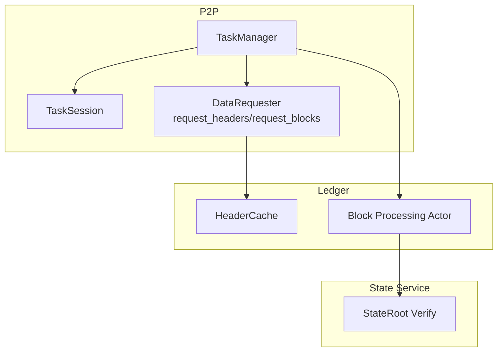
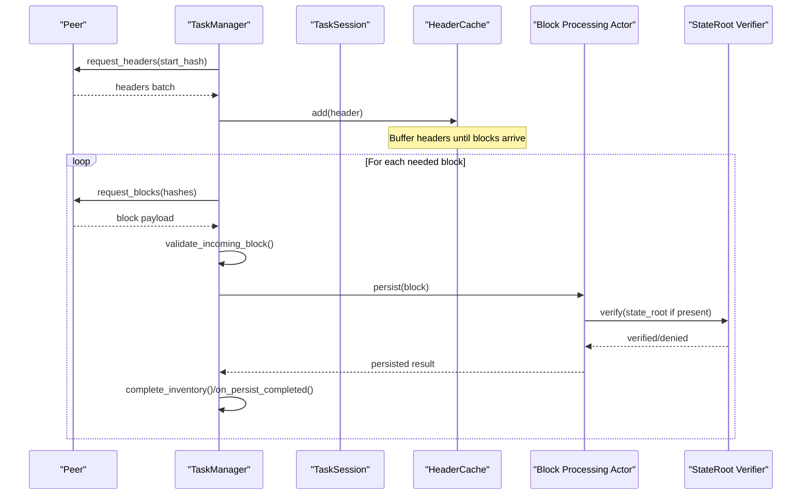
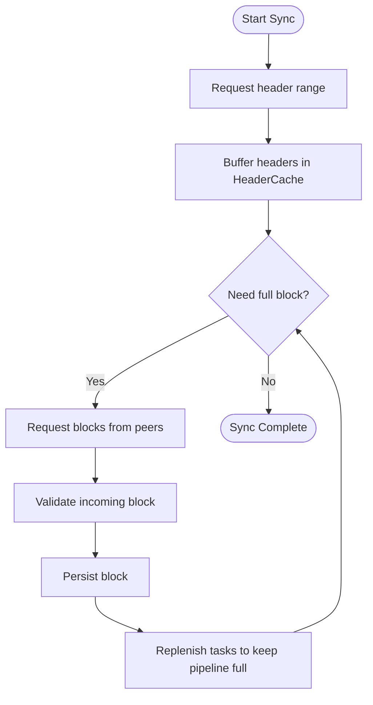
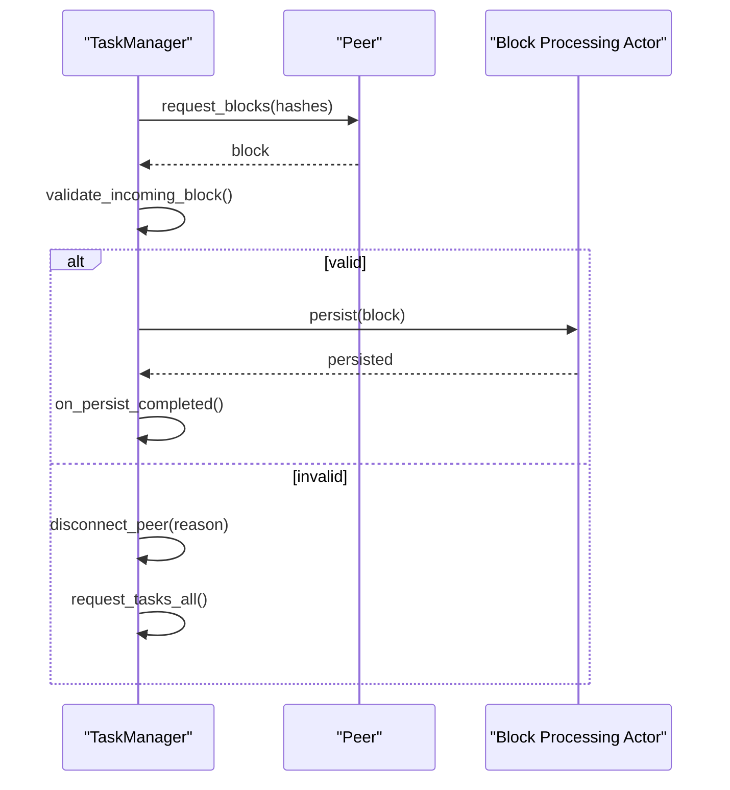
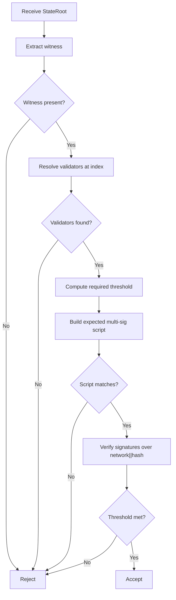
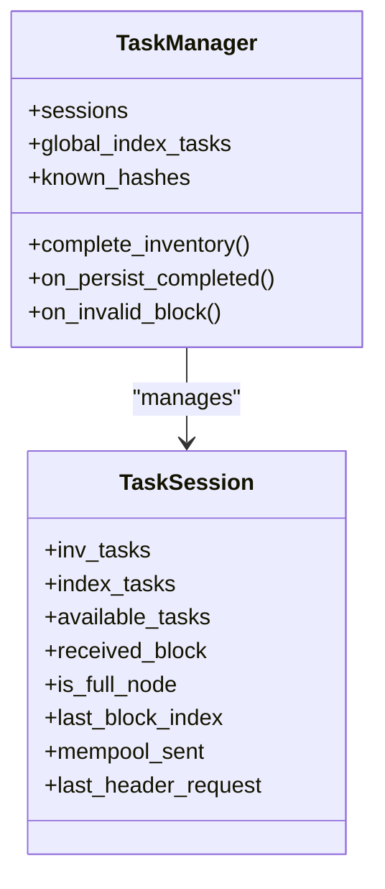
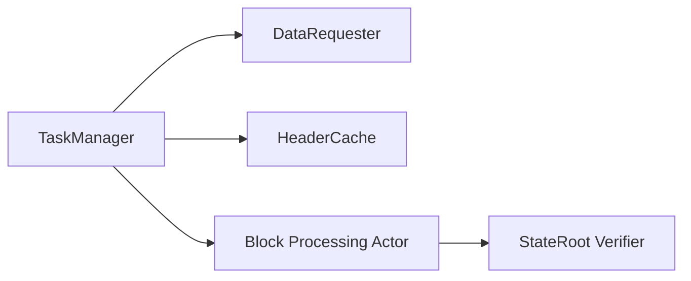

# Block Synchronization

<cite>
**Referenced Files in This Document**
- [completion_flow.rs](file://neo-core/src/network/p2p/task_manager/completion_flow.rs)
- [header_cache.rs](file://neo-core/src/ledger/header_cache.rs)
- [task_session.rs](file://neo-core/src/network/p2p/task_session.rs)
- [traits.rs](file://neo-p2p/src/traits.rs)
- [state_root.rs](file://neo-core/src/state_service/state_root.rs)
- [blockchain_application_executed.rs](file://neo-core/src/ledger/blockchain_application_executed.rs)
- [block_processing.rs](file://neo-core/src/ledger/blockchain/block_processing.rs)
- [actor.rs](file://neo-core/src/ledger/blockchain/actor.rs)
- [mod.rs](file://neo-core/src/ledger/blockchain/mod.rs)
- [payloads/block.rs](file://neo-core/src/network/p2p/payloads/block.rs)
- [payloads/header.rs](file://neo-core/src/network/p2p/payloads/header.rs)
- [timeouts.rs](file://neo-p2p/src/timeouts.rs)
- [channels_config.rs](file://neo-p2p/src/channels_config.rs)
</cite>

## Table of Contents
1. [Introduction](#introduction)
2. [Project Structure](#project-structure)
3. [Core Components](#core-components)
4. [Architecture Overview](#architecture-overview)
5. [Detailed Component Analysis](#detailed-component-analysis)
6. [Dependency Analysis](#dependency-analysis)
7. [Performance Considerations](#performance-considerations)
8. [Troubleshooting Guide](#troubleshooting-guide)
9. [Conclusion](#conclusion)

## Introduction
This document explains block synchronization in the Neo blockchain implementation, focusing on header-first synchronization, parallel block fetching from multiple peers, validation and persistence flows, state root verification, peer selection considerations, configuration knobs for rate limits and timeouts, and troubleshooting guidance. It maps these behaviors to concrete components in the codebase to help operators and developers understand how fast sync works end-to-end.

## Project Structure
Block synchronization spans several modules:
- P2P task manager and sessions orchestrate inventory requests, header ranges, and block downloads across peers.
- A header cache buffers headers that arrive before their blocks to keep the pipeline full.
- The ledger’s block processing actor validates and persists blocks.
- State service verifies state roots with BFT multi-sig witnesses.
- P2P traits define request interfaces (headers, blocks, transactions).

**Diagram sources**
- [completion_flow.rs:24-139](file://neo-core/src/network/p2p/task_manager/completion_flow.rs#L24-L139)
- [task_session.rs:17-52](file://neo-core/src/network/p2p/task_session.rs#L17-L52)
- [traits.rs:95-108](file://neo-p2p/src/traits.rs#L95-L108)
- [header_cache.rs:1-104](file://neo-core/src/ledger/header_cache.rs#L1-L104)
- [block_processing.rs:1-200](file://neo-core/src/ledger/blockchain/block_processing.rs#L1-L200)
- [state_root.rs:121-179](file://neo-core/src/state_service/state_root.rs#L121-L179)

**Section sources**
- [completion_flow.rs:24-139](file://neo-core/src/network/p2p/task_manager/completion_flow.rs#L24-L139)
- [task_session.rs:17-52](file://neo-core/src/network/p2p/task_session.rs#L17-L52)
- [traits.rs:95-108](file://neo-p2p/src/traits.rs#L95-L108)
- [header_cache.rs:1-104](file://neo-core/src/ledger/header_cache.rs#L1-L104)

## Core Components
- Task Manager and Sessions: Track per-peer tasks, outstanding inventory/index requests, received-but-not-persisted blocks, and enforce global limits to avoid overloading peers or memory.
- Header Cache: Buffers incoming headers until corresponding blocks are available, enabling continuous download without blocking.
- Block Processing Actor: Validates and persists blocks, coordinates with state root verification when applicable.
- P2P Traits: Provide standardized methods to request headers and blocks from peers.
- State Root Verification: Validates BFT multi-sig signatures against designated state validators at a given index.

**Section sources**
- [completion_flow.rs:24-139](file://neo-core/src/network/p2p/task_manager/completion_flow.rs#L24-L139)
- [task_session.rs:17-52](file://neo-core/src/network/p2p/task_session.rs#L17-L52)
- [header_cache.rs:1-104](file://neo-core/src/ledger/header_cache.rs#L1-L104)
- [traits.rs:95-108](file://neo-p2p/src/traits.rs#L95-L108)
- [state_root.rs:121-179](file://neo-core/src/state_service/state_root.rs#L121-L179)

## Architecture Overview
The synchronization flow is header-first: nodes request header ranges, validate them, then request full blocks in parallel from multiple peers while keeping the pipeline full via a header buffer.

**Diagram sources**
- [traits.rs:95-108](file://neo-p2p/src/traits.rs#L95-L108)
- [header_cache.rs:68-95](file://neo-core/src/ledger/header_cache.rs#L68-L95)
- [completion_flow.rs:24-139](file://neo-core/src/network/p2p/task_manager/completion_flow.rs#L24-L139)
- [block_processing.rs:1-200](file://neo-core/src/ledger/blockchain/block_processing.rs#L1-L200)
- [state_root.rs:121-179](file://neo-core/src/state_service/state_root.rs#L121-L179)

## Detailed Component Analysis

### Header-First Synchronization and Parallel Block Fetching
- Header range requests are issued via the DataRequester interface; headers are buffered in HeaderCache to unblock block downloads.
- TaskSession tracks outstanding inventory and index tasks, preventing duplicate work and capping concurrency.
- CompletionFlow ensures that after each delivered block, new tasks are requested to keep the pipeline full, even if persistence lags behind.

**Diagram sources**
- [traits.rs:95-108](file://neo-p2p/src/traits.rs#L95-L108)
- [header_cache.rs:68-95](file://neo-core/src/ledger/header_cache.rs#L68-L95)
- [completion_flow.rs:24-139](file://neo-core/src/network/p2p/task_manager/completion_flow.rs#L24-L139)

**Section sources**
- [completion_flow.rs:24-139](file://neo-core/src/network/p2p/task_manager/completion_flow.rs#L24-L139)
- [task_session.rs:17-52](file://neo-core/src/network/p2p/task_session.rs#L17-L52)
- [header_cache.rs:1-104](file://neo-core/src/ledger/header_cache.rs#L1-L104)

### Block Validation and Persistence Flow
- Incoming blocks are validated before storage; mismatches or invalid hashes trigger peer disconnection and re-request logic.
- After persistence completes, the task manager matches persisted blocks to cached received blocks, disconnects offenders, and continues requesting missing blocks.

**Diagram sources**
- [completion_flow.rs:71-139](file://neo-core/src/network/p2p/task_manager/completion_flow.rs#L71-L139)
- [completion_flow.rs:141-209](file://neo-core/src/network/p2p/task_manager/completion_flow.rs#L141-L209)
- [block_processing.rs:1-200](file://neo-core/src/ledger/blockchain/block_processing.rs#L1-L200)

**Section sources**
- [completion_flow.rs:71-139](file://neo-core/src/network/p2p/task_manager/completion_flow.rs#L71-L139)
- [completion_flow.rs:141-209](file://neo-core/src/network/p2p/task_manager/completion_flow.rs#L141-L209)

### State Root Verification
- State roots include a witness that must match the expected BFT multi-sig script derived from designated state validators at the given index.
- Verification enforces presence of witness, correct script, and sufficient valid signatures over network + hash.

**Diagram sources**
- [state_root.rs:121-179](file://neo-core/src/state_service/state_root.rs#L121-L179)

**Section sources**
- [state_root.rs:121-179](file://neo-core/src/state_service/state_root.rs#L121-L179)

### Peer Selection and Load Balancing
- The task session maintains per-peer task queues and availability sets to avoid double-fetching and to distribute load.
- Global pending task caps prevent overwhelming peers or memory.
- Offending peers are disconnected on invalid or mismatched blocks, improving overall distribution quality.

**Diagram sources**
- [task_session.rs:17-52](file://neo-core/src/network/p2p/task_session.rs#L17-L52)
- [completion_flow.rs:24-139](file://neo-core/src/network/p2p/task_manager/completion_flow.rs#L24-L139)

**Section sources**
- [task_session.rs:17-52](file://neo-core/src/network/p2p/task_session.rs#L17-L52)
- [completion_flow.rs:24-139](file://neo-core/src/network/p2p/task_manager/completion_flow.rs#L24-L139)

### Configuration Options for Rate Limits, Concurrency, and Timeouts
- Concurrency and buffering:
  - Header cache capacity controls how many headers can be buffered ahead of blocks.
  - Task session pending task limit bounds outstanding requests per peer.
- Timeouts and channel behavior:
  - P2P timeouts and channel configurations influence request/response timing and backpressure.
- These settings collectively tune sync throughput and resource usage.

**Section sources**
- [header_cache.rs:6-34](file://neo-core/src/ledger/header_cache.rs#L6-L34)
- [task_session.rs:45-52](file://neo-core/src/network/p2p/task_session.rs#L45-L52)
- [timeouts.rs:1-200](file://neo-p2p/src/timeouts.rs#L1-L200)
- [channels_config.rs:1-200](file://neo-p2p/src/channels_config.rs#L1-L200)

## Dependency Analysis
- TaskManager depends on P2P traits to request headers/blocks and on the ledger to persist blocks.
- HeaderCache decouples header arrival from block persistence, reducing stalls.
- Block Processing Actor integrates with state root verification for consensus-backed state integrity.

**Diagram sources**
- [traits.rs:95-108](file://neo-p2p/src/traits.rs#L95-L108)
- [completion_flow.rs:24-139](file://neo-core/src/network/p2p/task_manager/completion_flow.rs#L24-L139)
- [header_cache.rs:1-104](file://neo-core/src/ledger/header_cache.rs#L1-L104)
- [block_processing.rs:1-200](file://neo-core/src/ledger/blockchain/block_processing.rs#L1-L200)
- [state_root.rs:121-179](file://neo-core/src/state_service/state_root.rs#L121-L179)

**Section sources**
- [completion_flow.rs:24-139](file://neo-core/src/network/p2p/task_manager/completion_flow.rs#L24-L139)
- [header_cache.rs:1-104](file://neo-core/src/ledger/header_cache.rs#L1-L104)
- [block_processing.rs:1-200](file://neo-core/src/ledger/blockchain/block_processing.rs#L1-L200)
- [state_root.rs:121-179](file://neo-core/src/state_service/state_root.rs#L121-L179)

## Performance Considerations
- Increase header cache capacity to reduce head-of-line blocking during fast sync.
- Tune pending task limits to balance memory usage and throughput.
- Adjust P2P timeouts and channel backpressure to match network conditions.
- Monitor peer health and disconnect offending peers promptly to maintain effective distribution.

[No sources needed since this section provides general guidance]

## Troubleshooting Guide
Common issues and remedies:
- Stalled sync due to insufficient headers:
  - Ensure header cache has capacity and header range requests are being issued.
- Slow block download:
  - Check per-peer pending task limits and ensure tasks are replenished after each persisted block.
- Peer misbehavior or invalid blocks:
  - Observe disconnect reasons for invalid or mismatched blocks; rely on automatic re-request and peer removal.
- State root verification failures:
  - Confirm designated state validators are available and witness scripts match expected multi-sig configuration.

**Section sources**
- [completion_flow.rs:71-139](file://neo-core/src/network/p2p/task_manager/completion_flow.rs#L71-L139)
- [completion_flow.rs:141-209](file://neo-core/src/network/p2p/task_manager/completion_flow.rs#L141-L209)
- [state_root.rs:121-179](file://neo-core/src/state_service/state_root.rs#L121-L179)

## Conclusion
Neo’s block synchronization uses a header-first strategy with a robust header buffer and parallel block fetching across peers. The task manager orchestrates requests, validates incoming data, persists blocks, and enforces peer health. State root verification adds consensus-backed integrity checks. Operators can tune header caching, concurrency limits, and timeouts to optimize performance, while relying on built-in mechanisms to handle invalid data and peer failures.