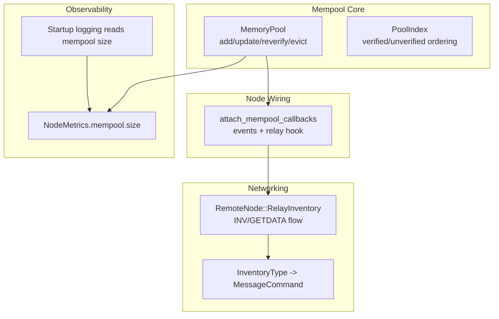
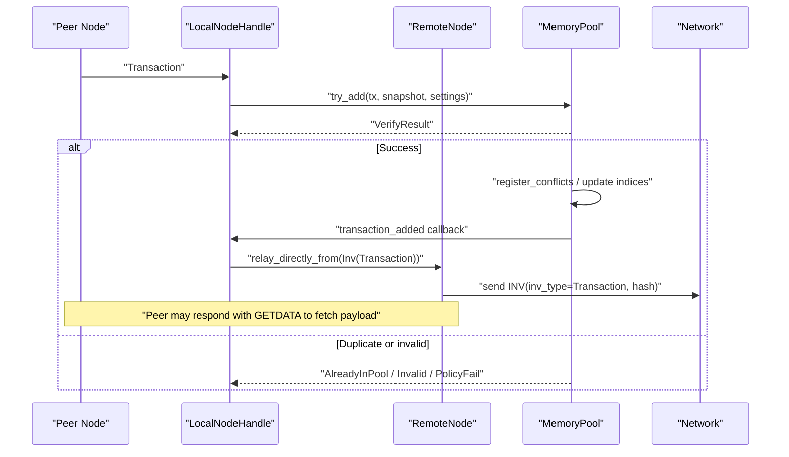
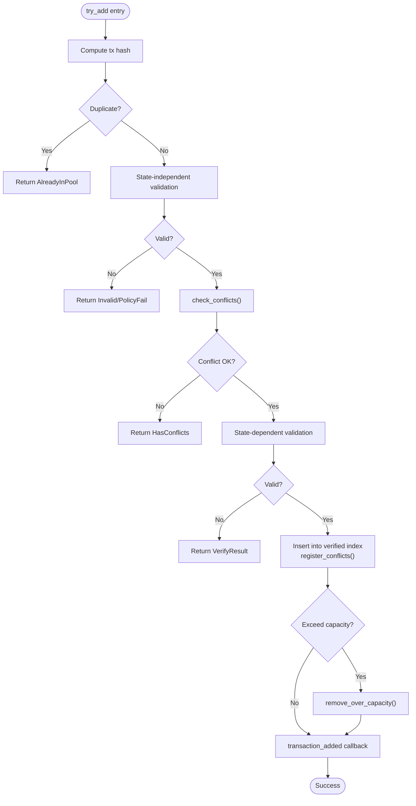
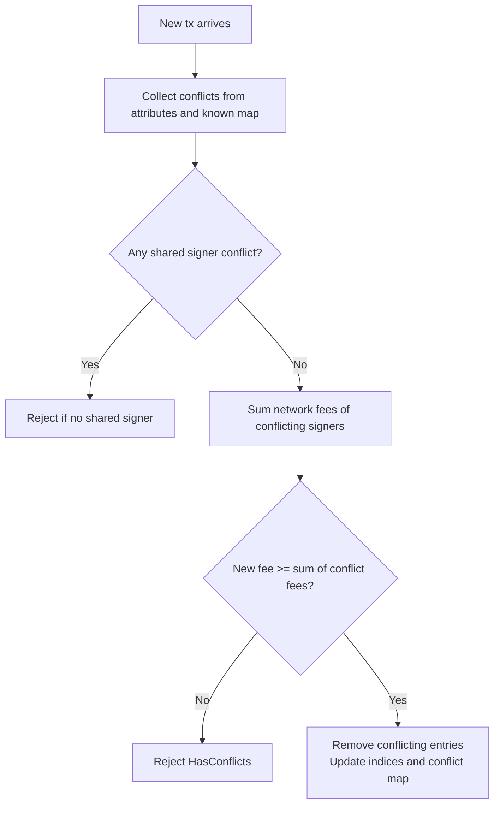
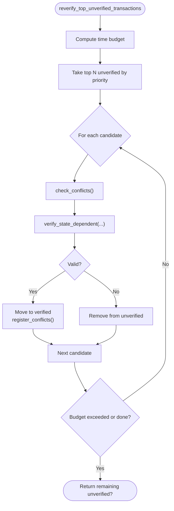
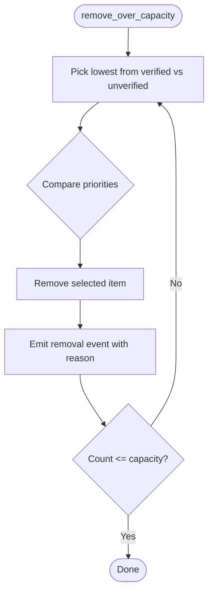
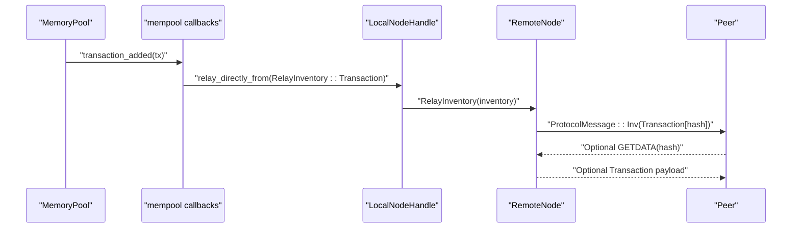
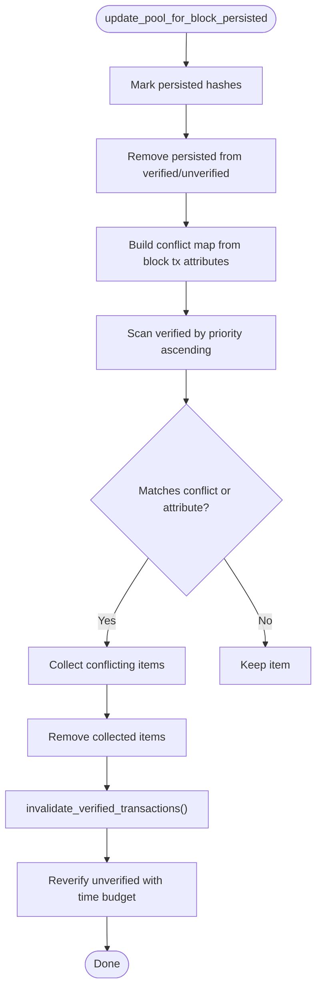
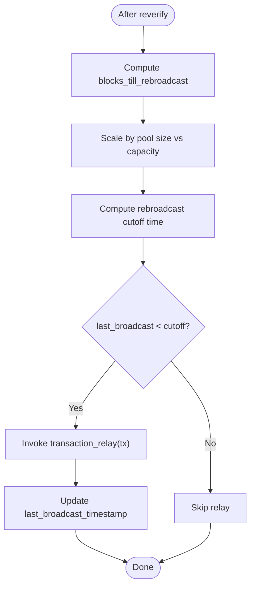
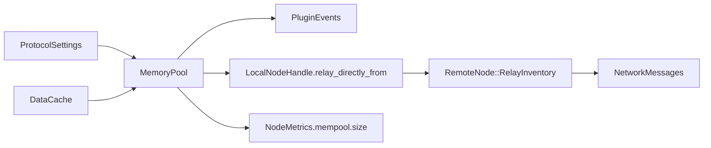

# Mempool Synchronization

<cite>
**Referenced Files in This Document**
- [neo-core/src/ledger/memory_pool/mod.rs](file://neo-core/src/ledger/memory_pool/mod.rs)
- [neo-core/src/neo_system/mempool.rs](file://neo-core/src/neo_system/mempool.rs)
- [neo-core/src/network/p2p/remote_node.rs](file://neo-core/src/network/p2p/remote_node.rs)
- [neo-p2p/src/inventory_type.rs](file://neo-p2p/src/inventory_type.rs)
- [neo-node/src/startup/logging.rs](file://neo-node/src/startup/logging.rs)
- [neo-telemetry/src/node_metrics.rs](file://neo-telemetry/src/node_metrics.rs)
- [neo-node/src/config/sections.rs](file://neo-node/src/config/sections.rs)
- [neo-node/src/consensus.rs](file://neo-node/src/consensus.rs)
- [neo-rpc/src/server/rpc_server_blockchain/tests.rs](file://neo-rpc/src/server/rpc_server_blockchain/tests.rs)
- [neo-rpc/src/client/models/rpc_raw_mem_pool.rs](file://neo-rpc/src/client/models/rpc_raw_mem_pool.rs)
</cite>

## Table of Contents
1. [Introduction](#introduction)
2. [Project Structure](#project-structure)
3. [Core Components](#core-components)
4. [Architecture Overview](#architecture-overview)
5. [Detailed Component Analysis](#detailed-component-analysis)
6. [Dependency Analysis](#dependency-analysis)
7. [Performance Considerations](#performance-considerations)
8. [Troubleshooting Guide](#troubleshooting-guide)
9. [Conclusion](#conclusion)
10. [Appendices](#appendices)

## Introduction
This document explains how the Neo node synchronizes its mempool with peers, including transaction propagation, conflict resolution, deduplication, fee-based prioritization, and pruning of stale or evicted transactions. It also covers configuration options for mempool behavior, metrics exposure, and operational guidance for high-throughput environments.

## Project Structure
The mempool synchronization spans several modules:
- Memory pool core logic (addition, conflict handling, revalidation, capacity eviction, rebroadcast gating).
- Node wiring that connects mempool events to plugin events and network relay.
- P2P relay path that announces inventory and handles peer responses.
- Configuration and metrics integration for observability and tuning.

**Diagram sources**
- [neo-core/src/ledger/memory_pool/mod.rs:66-118](file://neo-core/src/ledger/memory_pool/mod.rs#L66-L118)
- [neo-core/src/neo_system/mempool.rs:17-62](file://neo-core/src/neo_system/mempool.rs#L17-L62)
- [neo-core/src/network/p2p/remote_node.rs:483-505](file://neo-core/src/network/p2p/remote_node.rs#L483-L485)
- [neo-p2p/src/inventory_type.rs:8-16](file://neo-p2p/src/inventory_type.rs#L8-L16)
- [neo-node/src/startup/logging.rs:106-108](file://neo-node/src/startup/logging.rs#L106-L108)
- [neo-telemetry/src/node_metrics.rs:242-246](file://neo-telemetry/src/node_metrics.rs#L242-L246)

**Section sources**
- [neo-core/src/ledger/memory_pool/mod.rs:66-118](file://neo-core/src/ledger/memory_pool/mod.rs#L66-L118)
- [neo-core/src/neo_system/mempool.rs:17-62](file://neo-core/src/neo_system/mempool.rs#L17-L62)
- [neo-core/src/network/p2p/remote_node.rs:483-505](file://neo-core/src/network/p2p/remote_node.rs#L483-L505)
- [neo-p2p/src/inventory_type.rs:8-16](file://neo-p2p/src/inventory_type.rs#L8-L16)
- [neo-node/src/startup/logging.rs:106-108](file://neo-node/src/startup/logging.rs#L106-L108)
- [neo-telemetry/src/node_metrics.rs:242-246](file://neo-telemetry/src/node_metrics.rs#L242-L246)

## Core Components
- MemoryPool: In-memory store of verified and unverified transactions, conflict tracking, capacity enforcement, and periodic revalidation.
- PoolIndex: Ordered indices for verified and unverified sets used for fee-based prioritization and eviction.
- Callbacks: Hooks for new, added, removed, and relay events to integrate with plugins and network.
- RemoteNode relay: Announces transactions via INV; peers request payloads via GETDATA when needed.
- Metrics and logging: Expose mempool size and integrate with startup logging.

Key behaviors:
- Deduplication by transaction hash prevents duplicates.
- Conflict chains allow replacement only if the new transaction pays at least as much total network fee as conflicting signers’ fees.
- Capacity eviction removes lowest-priority items across verified and unverified sets.
- Revalidation promotes valid unverified transactions into verified set within time budgets.
- Rebroadcast gating avoids excessive retransmission based on block time and pool size.

**Section sources**
- [neo-core/src/ledger/memory_pool/mod.rs:66-118](file://neo-core/src/ledger/memory_pool/mod.rs#L66-L118)
- [neo-core/src/ledger/memory_pool/mod.rs:153-213](file://neo-core/src/ledger/memory_pool/mod.rs#L153-L213)
- [neo-core/src/ledger/memory_pool/mod.rs:236-384](file://neo-core/src/ledger/memory_pool/mod.rs#L236-L384)
- [neo-core/src/ledger/memory_pool/mod.rs:386-483](file://neo-core/src/ledger/memory_pool/mod.rs#L386-L483)
- [neo-core/src/ledger/memory_pool/mod.rs:501-654](file://neo-core/src/ledger/memory_pool/mod.rs#L501-L654)
- [neo-core/src/ledger/memory_pool/mod.rs:685-718](file://neo-core/src/ledger/memory_pool/mod.rs#L685-L718)

## Architecture Overview
The mempool synchronization architecture integrates local validation, conflict management, and peer-to-peer propagation.

**Diagram sources**
- [neo-core/src/neo_system/mempool.rs:17-62](file://neo-core/src/neo_system/mempool.rs#L17-L62)
- [neo-core/src/network/p2p/remote_node.rs:483-505](file://neo-core/src/network/p2p/remote_node.rs#L483-L505)
- [neo-p2p/src/inventory_type.rs:8-16](file://neo-p2p/src/inventory_type.rs#L8-L16)
- [neo-core/src/ledger/memory_pool/mod.rs:236-384](file://neo-core/src/ledger/memory_pool/mod.rs#L236-L384)

## Detailed Component Analysis

### Transaction Addition and Deduplication
- The add path computes the transaction hash first and rejects duplicates immediately.
- State-independent checks run before state-dependent checks to avoid unnecessary work.
- Conflicts are detected using both declared conflicts and shared signer overlap; replacement requires sufficient fee coverage.
- After successful addition, callbacks notify plugins and trigger network relay.

**Diagram sources**
- [neo-core/src/ledger/memory_pool/mod.rs:236-384](file://neo-core/src/ledger/memory_pool/mod.rs#L236-L384)
- [neo-core/src/ledger/memory_pool/mod.rs:153-213](file://neo-core/src/ledger/memory_pool/mod.rs#L153-L213)

**Section sources**
- [neo-core/src/ledger/memory_pool/mod.rs:236-384](file://neo-core/src/ledger/memory_pool/mod.rs#L236-L384)
- [neo-core/src/ledger/memory_pool/mod.rs:153-213](file://neo-core/src/ledger/memory_pool/mod.rs#L153-L213)

### Conflict Resolution and Replacement
- Conflicts are tracked per target hash and include all transactions that reference it via attributes.
- When a new transaction references a conflict, the pool evaluates whether replacing is allowed based on:
  - Shared signers between conflicting and new transaction.
  - Total network fee of conflicting signers versus new transaction’s network fee.
- Replacement removes lower-fee conflicting entries and updates indices and conflict maps accordingly.

**Diagram sources**
- [neo-core/src/ledger/memory_pool/mod.rs:153-213](file://neo-core/src/ledger/memory_pool/mod.rs#L153-L213)
- [neo-core/src/ledger/memory_pool/mod.rs:215-234](file://neo-core/src/ledger/memory_pool/mod.rs#L215-L234)

**Section sources**
- [neo-core/src/ledger/memory_pool/mod.rs:153-213](file://neo-core/src/ledger/memory_pool/mod.rs#L153-L213)
- [neo-core/src/ledger/memory_pool/mod.rs:215-234](file://neo-core/src/ledger/memory_pool/mod.rs#L215-L234)

### Revalidation and Promotion
- Unverified transactions are periodically revalidated with a time budget derived from block time.
- Validated transactions are promoted to the verified set; invalidated ones are removed and reported.
- During promotion, conflicts are rechecked and resolved similarly to initial insertion.

**Diagram sources**
- [neo-core/src/ledger/memory_pool/mod.rs:501-654](file://neo-core/src/ledger/memory_pool/mod.rs#L501-L654)

**Section sources**
- [neo-core/src/ledger/memory_pool/mod.rs:501-654](file://neo-core/src/ledger/memory_pool/mod.rs#L501-L654)

### Capacity Eviction and Fee-Based Prioritization
- When the pool exceeds capacity, the lowest-priority candidates from both verified and unverified sets are removed.
- Ordering is fee-based; higher fee transactions are retained.
- Removal triggers removal callbacks with reason indicating capacity pressure.

**Diagram sources**
- [neo-core/src/ledger/memory_pool/mod.rs:685-718](file://neo-core/src/ledger/memory_pool/mod.rs#L685-L718)

**Section sources**
- [neo-core/src/ledger/memory_pool/mod.rs:685-718](file://neo-core/src/ledger/memory_pool/mod.rs#L685-L718)

### Network Propagation and Peer Command Handling
- On successful addition, the node relays the transaction by sending an INV message containing the transaction hash.
- Peers can request the full payload via GETDATA; this ensures efficient bandwidth usage.
- Inventory type mapping converts internal types to protocol messages.

**Diagram sources**
- [neo-core/src/neo_system/mempool.rs:17-62](file://neo-core/src/neo_system/mempool.rs#L17-L62)
- [neo-core/src/network/p2p/remote_node.rs:483-505](file://neo-core/src/network/p2p/remote_node.rs#L483-L505)
- [neo-p2p/src/inventory_type.rs:8-16](file://neo-p2p/src/inventory_type.rs#L8-L16)

**Section sources**
- [neo-core/src/neo_system/mempool.rs:17-62](file://neo-core/src/neo_system/mempool.rs#L17-L62)
- [neo-core/src/network/p2p/remote_node.rs:483-505](file://neo-core/src/network/p2p/remote_node.rs#L483-L505)
- [neo-p2p/src/inventory_type.rs:8-16](file://neo-p2p/src/inventory_type.rs#L8-L16)

### Block Persisted Updates and Stale Transaction Pruning
- When a block is persisted, the pool removes committed transactions and any conflicting transactions whose signers are affected.
- Remaining transactions are moved back to unverified for revalidation with a per-block time budget.
- This process prunes stale or invalidated transactions and keeps the pool consistent with the ledger.

**Diagram sources**
- [neo-core/src/ledger/memory_pool/mod.rs:386-483](file://neo-core/src/ledger/memory_pool/mod.rs#L386-L483)

**Section sources**
- [neo-core/src/ledger/memory_pool/mod.rs:386-483](file://neo-core/src/ledger/memory_pool/mod.rs#L386-L483)

### Rebroadcast Gating and Timeout Behavior
- Reverified transactions are optionally rebroadcast if enough time has elapsed since last broadcast.
- The threshold scales with pool size relative to capacity to reduce churn under load.
- Time thresholds are derived from block time and hardfork-aware policy.

**Diagram sources**
- [neo-core/src/ledger/memory_pool/mod.rs:610-638](file://neo-core/src/ledger/memory_pool/mod.rs#L610-L638)

**Section sources**
- [neo-core/src/ledger/memory_pool/mod.rs:610-638](file://neo-core/src/ledger/memory_pool/mod.rs#L610-L638)

### Configuration Options
- Maximum mempool size and per-sender limits are configurable via node configuration sections.
- Validation rules ensure sensible defaults and reject invalid values such as zero per-sender limits.
- Consensus-related filters can be installed to limit system fee acceptance for consensus purposes.

Configuration highlights:
- `max_transactions`: caps total mempool size.
- `max_transactions_per_sender`: caps per-sender count; enforced during insertion.
- Consensus filter: optional handler to cancel transactions exceeding a system fee threshold.

**Section sources**
- [neo-node/src/config/sections.rs:391-399](file://neo-node/src/config/sections.rs#L391-L399)
- [neo-node/src/consensus.rs:151-166](file://neo-node/src/consensus.rs#L151-L166)

### RPC Exposure and Observability
- Raw mempool RPC models expose height, verified, and unverified lists for clients.
- Tests validate serialization round-trips and numeric/string parsing flexibility.
- Startup logging reads mempool size and includes it in metrics updates.

**Section sources**
- [neo-rpc/src/client/models/rpc_raw_mem_pool.rs:75-116](file://neo-rpc/src/client/models/rpc_raw_mem_pool.rs#L75-L116)
- [neo-node/src/startup/logging.rs:106-108](file://neo-node/src/startup/logging.rs#L106-L108)

## Dependency Analysis
The mempool depends on:
- Protocol settings for capacity and timing parameters.
- Persistence snapshot for state-dependent validation.
- Network layer for relay and inventory announcements.
- Telemetry for metrics reporting.

**Diagram sources**
- [neo-core/src/ledger/memory_pool/mod.rs:93-118](file://neo-core/src/ledger/memory_pool/mod.rs#L93-L118)
- [neo-core/src/neo_system/mempool.rs:17-62](file://neo-core/src/neo_system/mempool.rs#L17-L62)
- [neo-core/src/network/p2p/remote_node.rs:483-505](file://neo-core/src/network/p2p/remote_node.rs#L483-L505)
- [neo-telemetry/src/node_metrics.rs:242-246](file://neo-telemetry/src/node_metrics.rs#L242-L246)

**Section sources**
- [neo-core/src/ledger/memory_pool/mod.rs:93-118](file://neo-core/src/ledger/memory_pool/mod.rs#L93-L118)
- [neo-core/src/neo_system/mempool.rs:17-62](file://neo-core/src/neo_system/mempool.rs#L17-L62)
- [neo-core/src/network/p2p/remote_node.rs:483-505](file://neo-core/src/network/p2p/remote_node.rs#L483-L505)
- [neo-telemetry/src/node_metrics.rs:242-246](file://neo-telemetry/src/node_metrics.rs#L242-L246)

## Performance Considerations
- Use pre-allocation methods to reduce reallocations during initial sync or high throughput periods.
- Leverage fee-based prioritization to keep high-value transactions in the pool under pressure.
- Revalidation uses time budgets to avoid blocking on heavy verification bursts.
- Rebroadcast scaling reduces redundant traffic when the pool is large.

[No sources needed since this section provides general guidance]

## Troubleshooting Guide
Common issues and diagnostics:
- Duplicate transactions: Ensure deduplication by hash is functioning; check for AlreadyInPool results.
- Conflict rejection: Validate conflict attributes and signer overlaps; confirm fee coverage for replacements.
- Capacity pressure: Monitor mempool size metrics; adjust max_transactions and per-sender limits.
- Stale transactions: Confirm block persist updates and revalidation are running; check time budgets.
- Network propagation: Verify INV messages are sent and peers request payloads when needed.

Operational tips:
- Observe mempool size via metrics and startup logs.
- Use RPC raw mempool endpoints to inspect verified and unverified lists.
- Tune per-sender limits to prevent abuse while allowing legitimate bursts.

**Section sources**
- [neo-node/src/startup/logging.rs:106-108](file://neo-node/src/startup/logging.rs#L106-L108)
- [neo-rpc/src/server/rpc_server_blockchain/tests.rs:1338-1371](file://neo-rpc/src/server/rpc_server_blockchain/tests.rs#L1338-L1371)
- [neo-telemetry/src/node_metrics.rs:242-246](file://neo-telemetry/src/node_metrics.rs#L242-L246)

## Conclusion
The Neo mempool synchronization combines robust validation, conflict resolution, and efficient peer-to-peer propagation. Fee-based prioritization and capacity-aware eviction maintain performance under load, while revalidation and block persist updates ensure consistency. Configurable limits and metrics enable operators to tune behavior for diverse network conditions and throughput requirements.

[No sources needed since this section summarizes without analyzing specific files]

## Appendices

### Key Algorithms Summary
- Deduplication: Hash-based lookup prevents duplicates.
- Conflict resolution: Attribute-based and signer-based checks with fee coverage requirement.
- Prioritization: Fee-based ordering for selection and eviction.
- Revalidation: Time-bounded promotion from unverified to verified.
- Eviction: Lowest-priority removal across verified and unverified sets.
- Rebroadcast gating: Scaled thresholds based on pool size and block time.

[No sources needed since this section provides general guidance]