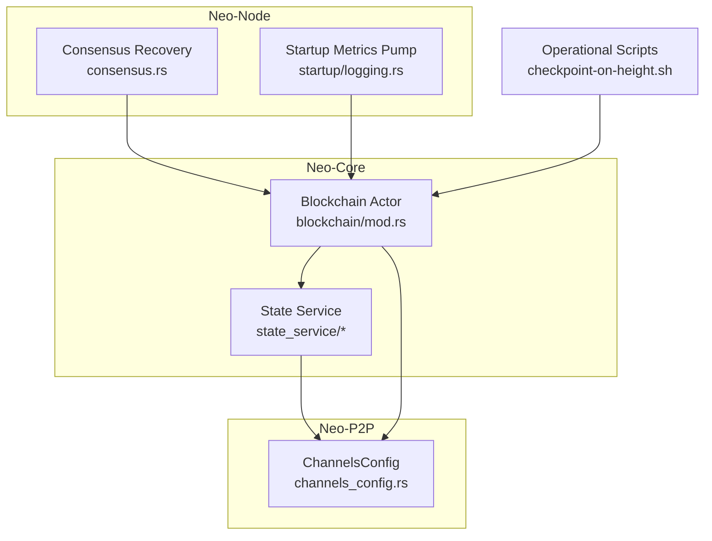
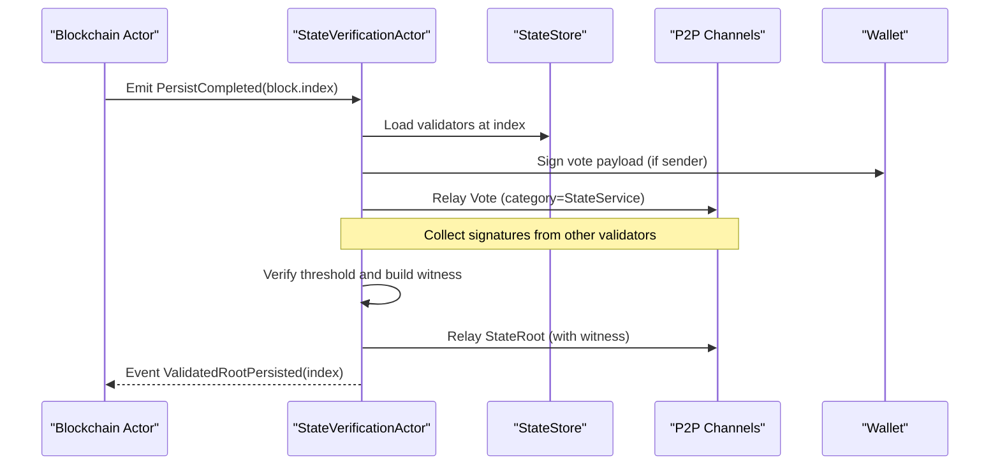
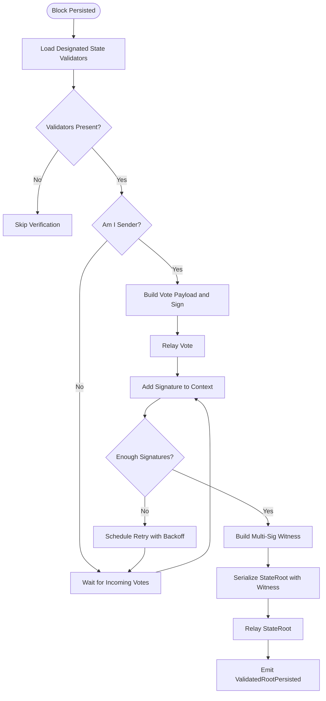
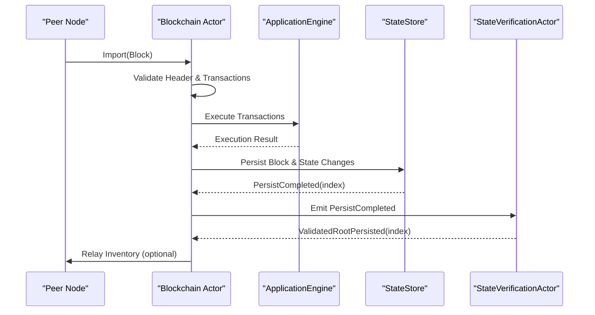
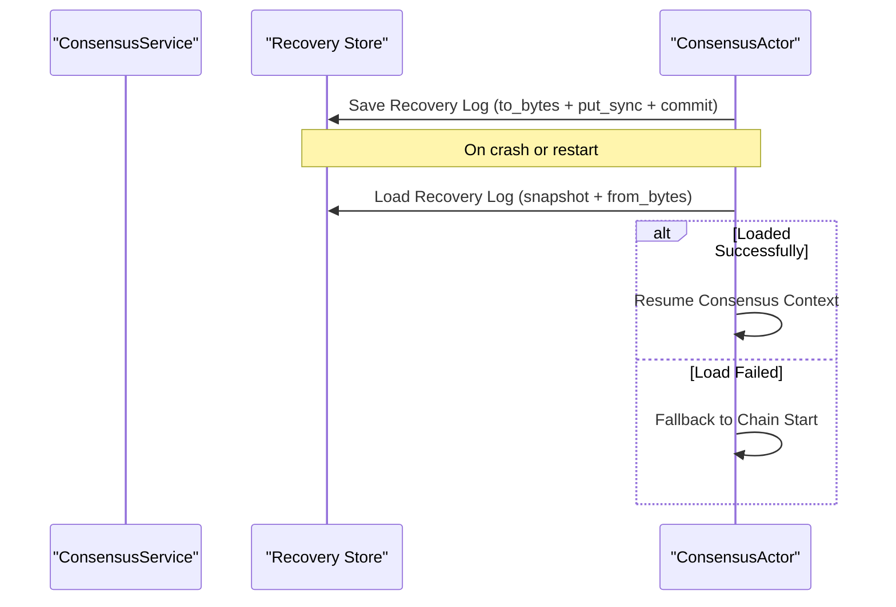
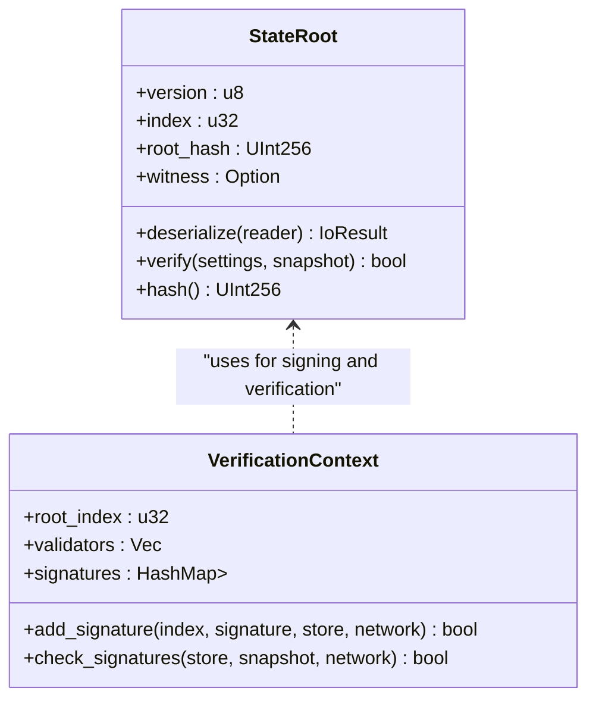
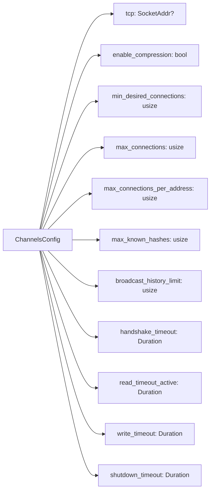
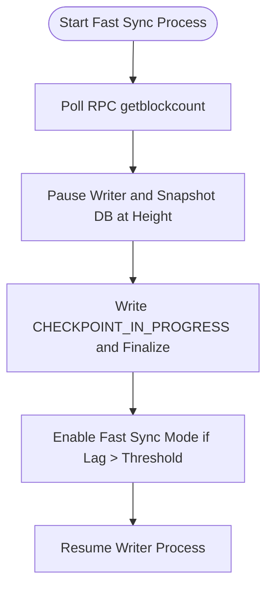
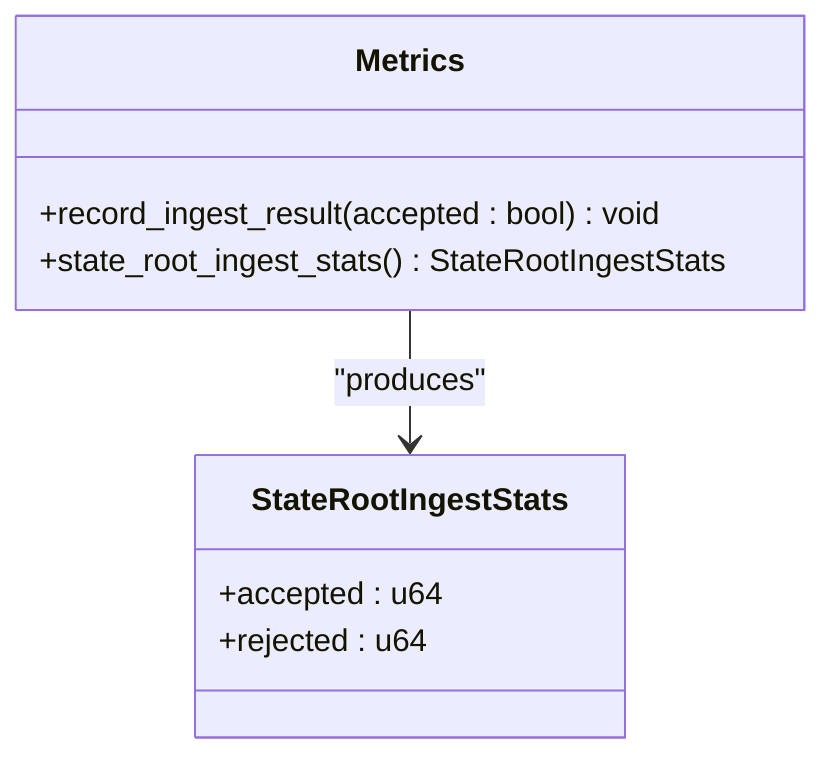
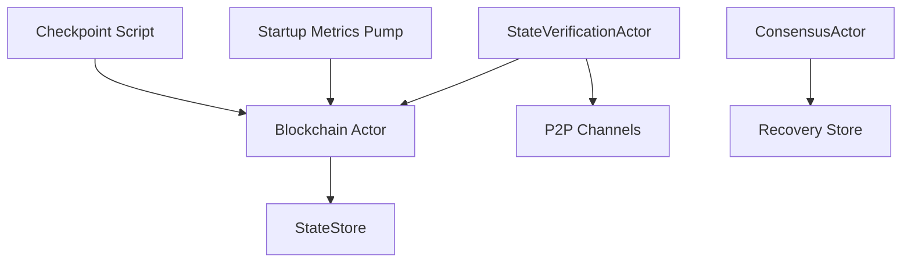

# State Synchronization

<cite>
**Referenced Files in This Document**
- [mod.rs](file://neo-core/src/state_service/mod.rs)
- [state_root.rs](file://neo-core/src/state_service/state_root.rs)
- [verification.rs](file://neo-core/src/state_service/verification.rs)
- [metrics.rs](file://neo-core/src/state_service/metrics.rs)
- [channels_config.rs](file://neo-p2p/src/channels_config.rs)
- [blockchain_mod.rs](file://neo-core/src/ledger/blockchain/mod.rs)
- [consensus.rs](file://neo-node/src/consensus.rs)
- [logging.rs](file://neo-node/src/startup/logging.rs)
- [checkpoint-on-height.sh](file://scripts/checkpoint-on-height.sh)
</cite>

## Table of Contents
1. [Introduction](#introduction)
2. [Project Structure](#project-structure)
3. [Core Components](#core-components)
4. [Architecture Overview](#architecture-overview)
5. [Detailed Component Analysis](#detailed-component-analysis)
6. [Dependency Analysis](#dependency-analysis)
7. [Performance Considerations](#performance-considerations)
8. [Troubleshooting Guide](#troubleshooting-guide)
9. [Conclusion](#conclusion)
10. [Appendices](#appendices)

## Introduction
This document explains state synchronization in the Neo blockchain implementation, focusing on how nodes verify and apply state changes after block processing, recover from synchronization failures using checkpoints, validate Merkle-based state roots, exchange state data efficiently over P2P channels, support fast sync via snapshots and incremental updates, track metrics and progress, and tune performance through configuration and caching strategies.

## Project Structure
State synchronization spans several modules:
- State service: state root computation, verification, persistence, and metrics
- Blockchain actor: block import, validation, persistence, and relay
- P2P channels: connection limits, timeouts, compression, and broadcast controls
- Consensus recovery: persisting and restoring consensus context for resuming operations
- Startup monitoring: dynamic enablement of fast sync based on lag thresholds
- Operational scripts: checkpointing at specific heights to produce snapshots for fast sync

**Diagram sources**
- [blockchain_mod.rs:1-239](file://neo-core/src/ledger/blockchain/mod.rs#L1-L239)
- [mod.rs:1-38](file://neo-core/src/state_service/mod.rs#L1-L38)
- [channels_config.rs:1-109](file://neo-p2p/src/channels_config.rs#L1-L109)
- [consensus.rs:1113-1190](file://neo-node/src/consensus.rs#L1113-L1190)
- [logging.rs:48-68](file://neo-node/src/startup/logging.rs#L48-L68)
- [checkpoint-on-height.sh:100-137](file://scripts/checkpoint-on-height.sh#L100-L137)

**Section sources**
- [blockchain_mod.rs:1-239](file://neo-core/src/ledger/blockchain/mod.rs#L1-L239)
- [mod.rs:1-38](file://neo-core/src/state_service/mod.rs#L1-L38)
- [channels_config.rs:1-109](file://neo-p2p/src/channels_config.rs#L1-L109)
- [consensus.rs:1113-1190](file://neo-node/src/consensus.rs#L1113-L1190)
- [logging.rs:48-68](file://neo-node/src/startup/logging.rs#L48-L68)
- [checkpoint-on-height.sh:100-137](file://scripts/checkpoint-on-height.sh#L100-L137)

## Core Components
- State Root: Represents a signed snapshot of the world state at a given index with a verifiable witness and hash.
- State Verification Actor: Orchestrates signature collection, threshold checks, payload construction, and relaying of votes and state roots.
- State Store and Cache: Persisted and cached state roots and related metadata.
- Metrics: Atomic counters for accepted/rejected state roots ingested from the network.
- Channels Configuration: Controls P2P connectivity, timeouts, compression, and broadcast history used during sync.
- Blockchain Actor: Coordinates block import, execution, persistence, and relay; integrates with state service events.
- Consensus Recovery: Persists and restores consensus context to resume after restarts or failures.
- Startup Fast Sync Control: Enables/disables fast sync mode based on node lag relative to peers.
- Checkpoint Script: Produces consistent snapshots at specific heights for fast sync bootstrapping.

**Section sources**
- [state_root.rs:90-301](file://neo-core/src/state_service/state_root.rs#L90-L301)
- [verification.rs:1-634](file://neo-core/src/state_service/verification.rs#L1-L634)
- [metrics.rs:1-31](file://neo-core/src/state_service/metrics.rs#L1-L31)
- [channels_config.rs:1-109](file://neo-p2p/src/channels_config.rs#L1-L109)
- [blockchain_mod.rs:1-239](file://neo-core/src/ledger/blockchain/mod.rs#L1-L239)
- [consensus.rs:1113-1190](file://neo-node/src/consensus.rs#L1113-L1190)
- [logging.rs:48-68](file://neo-node/src/startup/logging.rs#L48-L68)
- [checkpoint-on-height.sh:100-137](file://scripts/checkpoint-on-height.sh#L100-L137)

## Architecture Overview
The state synchronization architecture centers around verifying and applying state roots after blocks are persisted, coordinating multi-signature validation among designated state validators, and exchanging state payloads over configured P2P channels. The system supports fast sync by leveraging checkpoints and incremental updates, while tracking progress and performance via metrics and startup heuristics.

**Diagram sources**
- [verification.rs:248-516](file://neo-core/src/state_service/verification.rs#L248-L516)
- [blockchain_mod.rs:156-201](file://neo-core/src/ledger/blockchain/mod.rs#L156-L201)
- [channels_config.rs:14-88](file://neo-p2p/src/channels_config.rs#L14-L88)

## Detailed Component Analysis

### State Root and Verification Flow
- State Root structure includes version, index, root hash, and optional witness. It provides deserialization, hashing, and JSON serialization helpers.
- Verification logic resolves designated state validators at the given index, enforces BFT threshold, validates individual signatures, constructs a multi-sig witness if needed, and attaches it to the state root before relaying.
- The verification actor manages per-index contexts, schedules retries with exponential backoff, prunes old contexts, and coordinates message relay via the blockchain handle.

**Diagram sources**
- [verification.rs:35-195](file://neo-core/src/state_service/verification.rs#L35-L195)
- [verification.rs:248-516](file://neo-core/src/state_service/verification.rs#L248-L516)
- [state_root.rs:90-301](file://neo-core/src/state_service/state_root.rs#L90-L301)

**Section sources**
- [state_root.rs:90-301](file://neo-core/src/state_service/state_root.rs#L90-L301)
- [verification.rs:1-634](file://neo-core/src/state_service/verification.rs#L1-L634)

### Block Processing and State Completion
- The blockchain actor handles importing blocks, validating headers and transactions, executing them, and persisting changes.
- On persistence success, it emits events that trigger state verification workflows and can relay inventory to peers.
- In fast sync mode, block persistence may continue even if certain blocks fail due to gas/balance issues, allowing catch-up while maintaining chain integrity.

**Diagram sources**
- [blockchain_mod.rs:156-201](file://neo-core/src/ledger/blockchain/mod.rs#L156-L201)
- [verification.rs:525-577](file://neo-core/src/state_service/verification.rs#L525-L577)

**Section sources**
- [blockchain_mod.rs:1-239](file://neo-core/src/ledger/blockchain/mod.rs#L1-L239)
- [verification.rs:525-577](file://neo-core/src/state_service/verification.rs#L525-L577)

### Restart Flow and Recovery from Synchronization Failures
- Consensus recovery persists and loads a serialized context keyed by a fixed store key, enabling resumption after restarts or crashes.
- The consensus actor subscribes to persistence and relay events and can start from the chain automatically when configured.

**Diagram sources**
- [consensus.rs:1113-1190](file://neo-node/src/consensus.rs#L1113-L1190)

**Section sources**
- [consensus.rs:1113-1190](file://neo-node/src/consensus.rs#L1113-L1190)

### State Verification Processes: Merkle Tree Validation and Root Comparison
- State roots carry a root hash representing the Merkle tree of state changes; verification ensures the witness satisfies the BFT threshold against designated validators.
- The verification process computes sign data from the state root and validates each validator’s signature, then constructs a multi-sig witness if necessary.
- Root comparison is implicit: peers compare received state root hashes to ensure consistency across the network.

**Diagram sources**
- [state_root.rs:90-301](file://neo-core/src/state_service/state_root.rs#L90-L301)
- [verification.rs:35-195](file://neo-core/src/state_service/verification.rs#L35-L195)

**Section sources**
- [state_root.rs:90-301](file://neo-core/src/state_service/state_root.rs#L90-L301)
- [verification.rs:35-195](file://neo-core/src/state_service/verification.rs#L35-L195)

### Channel Configuration for Efficient State Data Transfer
- ChannelsConfig defines TCP endpoint, compression toggle, desired and maximum connections, per-address limits, known-hash cache size, broadcast history retention, and various timeouts for handshake, read, write, and shutdown.
- These settings influence how quickly and reliably state payloads (votes and state roots) propagate across the network during synchronization.

**Diagram sources**
- [channels_config.rs:14-88](file://neo-p2p/src/channels_config.rs#L14-L88)

**Section sources**
- [channels_config.rs:1-109](file://neo-p2p/src/channels_config.rs#L1-L109)

### Fast Sync Capabilities: Snapshots and Incremental Updates
- Checkpoint script pauses the writer process, captures a consistent snapshot at a target height, and marks completion, enabling fast sync bootstrap from a known-good state.
- Startup metrics pump monitors node lag and toggles fast sync mode based on configurable thresholds, optimizing initial synchronization behavior.

**Diagram sources**
- [checkpoint-on-height.sh:100-137](file://scripts/checkpoint-on-height.sh#L100-L137)
- [logging.rs:48-68](file://neo-node/src/startup/logging.rs#L48-L68)

**Section sources**
- [checkpoint-on-height.sh:100-137](file://scripts/checkpoint-on-height.sh#L100-L137)
- [logging.rs:48-68](file://neo-node/src/startup/logging.rs#L48-L68)

### State Synchronization Metrics and Progress Tracking
- Metrics module exposes atomic counters for accepted and rejected state roots ingested from the network, enabling observability of sync health.
- Progress tracking occurs via block indices and validated root events, allowing downstream components to align their state with the latest verified root.

**Diagram sources**
- [metrics.rs:1-31](file://neo-core/src/state_service/metrics.rs#L1-L31)

**Section sources**
- [metrics.rs:1-31](file://neo-core/src/state_service/metrics.rs#L1-L31)

### Configuration Options: Behavior, Caching, and Memory Management
- ChannelsConfig offers tunable parameters for connection limits, timeouts, compression, and broadcast history to optimize memory usage and throughput during sync.
- Blockchain actor maintains bounded caches for verified and unverified blocks to prevent unbounded memory growth and support fast sync windows without backpressure.
- Startup metrics pump uses lag thresholds to dynamically enable fast sync mode, balancing speed and resource consumption.

**Section sources**
- [channels_config.rs:14-88](file://neo-p2p/src/channels_config.rs#L14-L88)
- [blockchain_mod.rs:108-116](file://neo-core/src/ledger/blockchain/mod.rs#L108-L116)
- [logging.rs:48-68](file://neo-node/src/startup/logging.rs#L48-L68)

## Dependency Analysis
- State verification depends on the blockchain actor for persistence events and on P2P channels for relaying messages.
- Consensus recovery depends on persistent storage to serialize/deserialize context and on event streams to resume operation.
- Fast sync integration depends on startup metrics to detect lag and on operational scripts to provide snapshots.

**Diagram sources**
- [verification.rs:525-577](file://neo-core/src/state_service/verification.rs#L525-L577)
- [blockchain_mod.rs:156-201](file://neo-core/src/ledger/blockchain/mod.rs#L156-L201)
- [consensus.rs:1113-1190](file://neo-node/src/consensus.rs#L1113-L1190)
- [logging.rs:48-68](file://neo-node/src/startup/logging.rs#L48-L68)
- [checkpoint-on-height.sh:100-137](file://scripts/checkpoint-on-height.sh#L100-L137)

**Section sources**
- [verification.rs:525-577](file://neo-core/src/state_service/verification.rs#L525-L577)
- [blockchain_mod.rs:156-201](file://neo-core/src/ledger/blockchain/mod.rs#L156-L201)
- [consensus.rs:1113-1190](file://neo-node/src/consensus.rs#L1113-L1190)
- [logging.rs:48-68](file://neo-node/src/startup/logging.rs#L48-L68)
- [checkpoint-on-height.sh:100-137](file://scripts/checkpoint-on-height.sh#L100-L137)

## Performance Considerations
- Use appropriate channel timeouts and compression to reduce bandwidth and latency during state payload propagation.
- Tune connection limits and per-address caps to avoid resource exhaustion under high sync load.
- Leverage fast sync mode when lag exceeds thresholds to accelerate catch-up.
- Maintain bounded caches for verified/unverified blocks to control memory pressure.
- Monitor accepted/rejected state root metrics to detect anomalies early.

[No sources needed since this section provides general guidance]

## Troubleshooting Guide
- State root verification failures:
  - Ensure designated state validators are present at the given index; verification aborts if none are found.
  - Validate that signatures match the expected BFT threshold and are computed over the correct sign data.
  - Check relay results for extensible payloads in the StateService category.
- Persistence errors:
  - Review blockchain persistence logs for block hash computation and RocksDB write failures.
  - In fast sync mode, non-fatal block execution failures do not halt sync but should be investigated.
- Consensus recovery issues:
  - If loading the recovery log fails, fall back to starting from the chain and re-establish consensus context.
- Fast sync misconfiguration:
  - Adjust lag thresholds in the startup metrics pump to balance speed and stability.
  - Ensure checkpoints are taken consistently and writer processes are paused/resumed correctly.

**Section sources**
- [verification.rs:121-195](file://neo-core/src/state_service/verification.rs#L121-L195)
- [blockchain_mod.rs:156-201](file://neo-core/src/ledger/blockchain/mod.rs#L156-L201)
- [consensus.rs:1113-1190](file://neo-node/src/consensus.rs#L1113-L1190)
- [logging.rs:48-68](file://neo-node/src/startup/logging.rs#L48-L68)
- [checkpoint-on-height.sh:100-137](file://scripts/checkpoint-on-height.sh#L100-L137)

## Conclusion
The Neo blockchain’s state synchronization mechanism combines robust state root verification, efficient P2P channel configuration, and resilient recovery flows to maintain chain integrity and performance. By leveraging checkpoints for fast sync, tracking metrics for observability, and tuning configuration for caching and memory management, nodes can synchronize reliably and quickly even under challenging network conditions.

[No sources needed since this section summarizes without analyzing specific files]

## Appendices
- Key constants and defaults for P2P channels are defined in ChannelsConfig and can be adjusted per deployment needs.
- State root ingestion metrics provide simple counters for accepted and rejected roots, useful for dashboards and alerts.
- Operational scripts facilitate consistent snapshot creation at specific heights, enabling repeatable fast sync procedures.

[No sources needed since this section provides general guidance]