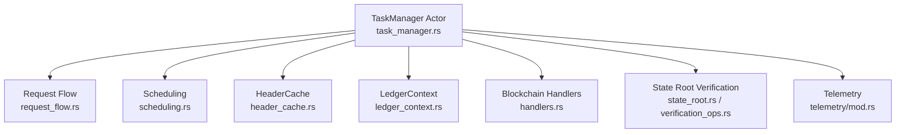
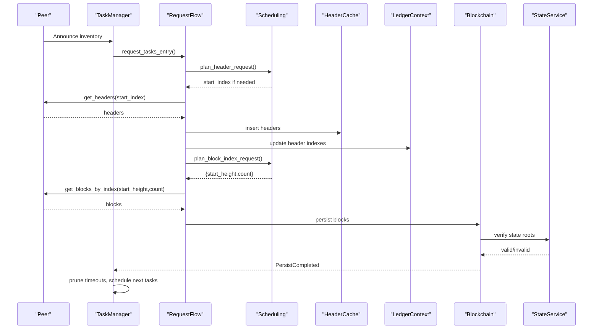
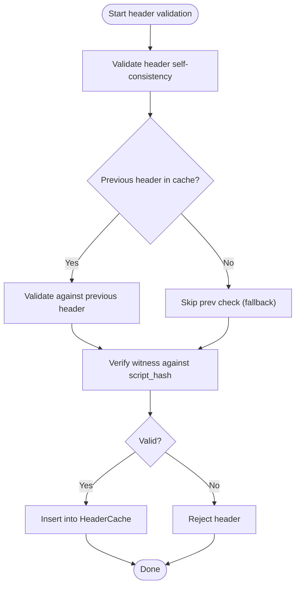
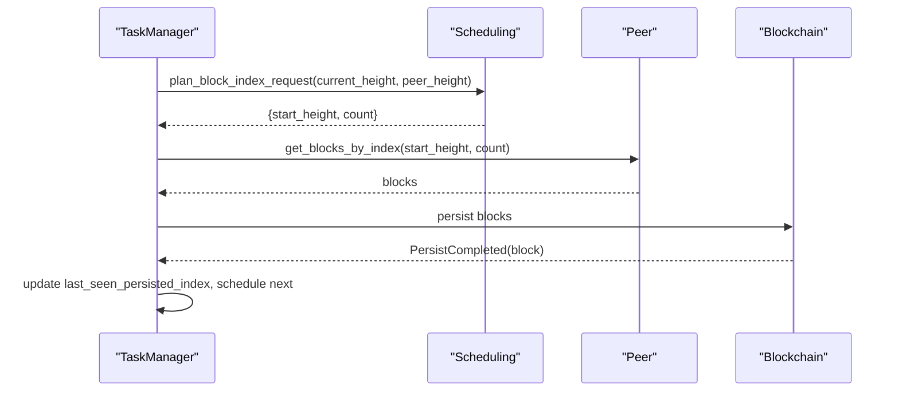
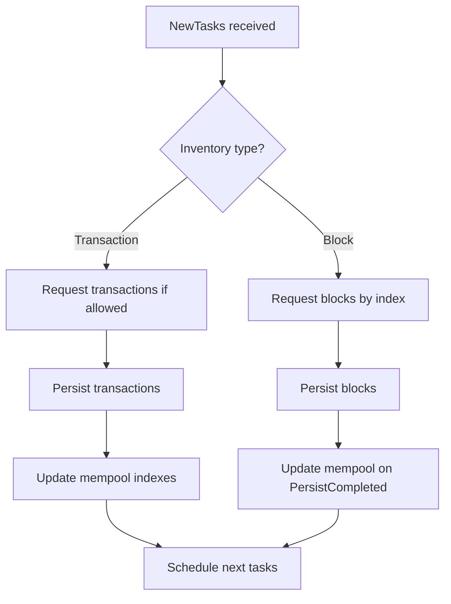
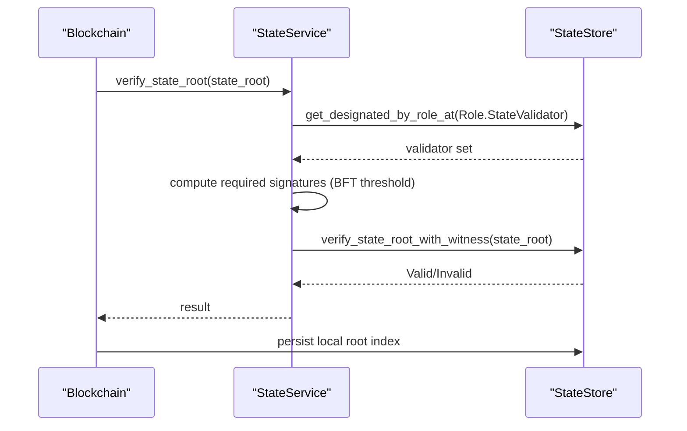
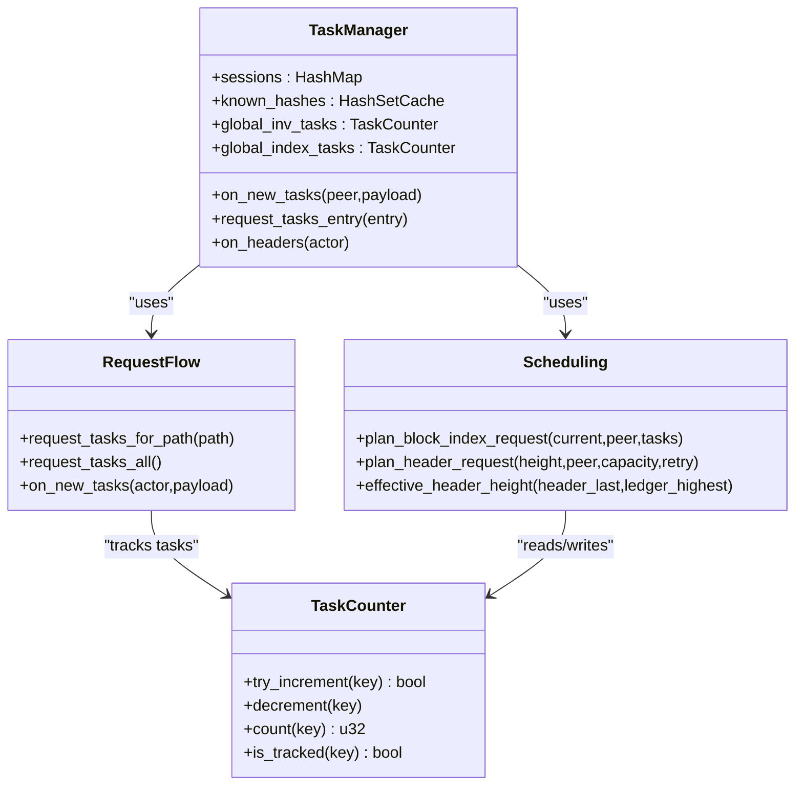
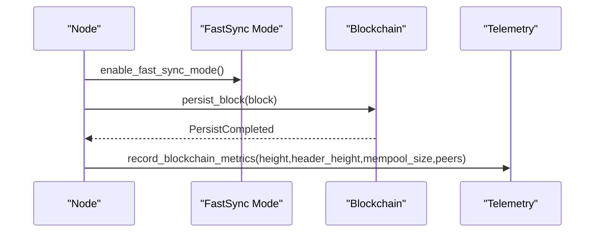
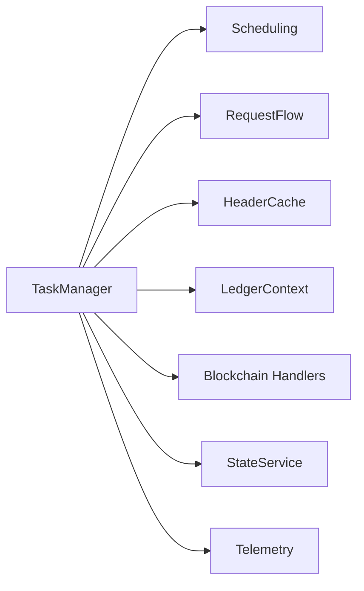

# Synchronization Protocols

<cite>
**Referenced Files in This Document**
- [task_manager.rs](file://neo-core/src/network/p2p/task_manager.rs)
- [scheduling.rs](file://neo-core/src/network/p2p/task_manager/scheduling.rs)
- [request_flow.rs](file://neo-core/src/network/p2p/task_manager/request_flow.rs)
- [handle.rs](file://neo-core/src/network/p2p/task_manager/handle.rs)
- [header_cache.rs](file://neo-core/src/ledger/header_cache.rs)
- [verification.rs](file://neo-core/src/network/p2p/payloads/header/verification.rs)
- [ledger_context.rs](file://neo-core/src/ledger/ledger_context.rs)
- [handlers.rs](file://neo-core/src/ledger/blockchain/handlers.rs)
- [state_root.rs](file://neo-core/src/state_service/state_root.rs)
- [verification_ops.rs](file://neo-core/src/state_service/state_store/verification_ops.rs)
- [mod.rs](file://neo-core/src/telemetry/mod.rs)
- [fast_sync_p2p_e2e_tests.rs](file://tests/tests/fast_sync_p2p_e2e_tests.rs)
</cite>

## Table of Contents
1. [Introduction](#introduction)
2. [Project Structure](#project-structure)
3. [Core Components](#core-components)
4. [Architecture Overview](#architecture-overview)
5. [Detailed Component Analysis](#detailed-component-analysis)
6. [Dependency Analysis](#dependency-analysis)
7. [Performance Considerations](#performance-considerations)
8. [Troubleshooting Guide](#troubleshooting-guide)
9. [Conclusion](#conclusion)

## Introduction
This document explains the Neo blockchain node synchronization protocol with a focus on header-first sync, block download and validation, transaction and mempool synchronization, state synchronization via state roots, and the task manager architecture that coordinates parallel downloads. It also covers fast sync capabilities, checkpoint-based recovery, metrics and progress tracking, configuration knobs for rate limiting and resource allocation, and troubleshooting guidance.

## Project Structure
The synchronization stack is centered around:
- P2P Task Manager: schedules and dispatches inventory requests (headers, blocks by index, transactions), tracks in-flight tasks, and enforces concurrency limits.
- Header Cache and Validation: buffers headers ahead of blocks and validates them against previous headers and witnesses.
- Ledger Context: maintains in-memory header and transaction indexes used during sync.
- Blockchain Handlers: process persisted blocks and update caches/mempool.
- State Service: verifies and persists state roots to enable fast sync and recovery.
- Telemetry: exposes metrics for monitoring sync progress and performance.

**Diagram sources**
- [task_manager.rs:101-136](file://neo-core/src/network/p2p/task_manager.rs#L101-L136)
- [request_flow.rs:16-196](file://neo-core/src/network/p2p/task_manager/request_flow.rs#L16-L196)
- [scheduling.rs:85-149](file://neo-core/src/network/p2p/task_manager/scheduling.rs#L85-L149)
- [header_cache.rs:1-46](file://neo-core/src/ledger/header_cache.rs#L1-L46)
- [ledger_context.rs:140-163](file://neo-core/src/ledger/ledger_context.rs#L140-L163)
- [handlers.rs:75-100](file://neo-core/src/ledger/blockchain/handlers.rs#L75-L100)
- [state_root.rs:132-166](file://neo-core/src/state_service/state_root.rs#L132-L166)
- [verification_ops.rs:33-74](file://neo-core/src/state_service/state_store/verification_ops.rs#L33-L74)
- [mod.rs:147-162](file://neo-core/src/telemetry/mod.rs#L147-L162)

**Section sources**
- [task_manager.rs:1-136](file://neo-core/src/network/p2p/task_manager.rs#L1-L136)
- [request_flow.rs:1-316](file://neo-core/src/network/p2p/task_manager/request_flow.rs#L1-L316)
- [scheduling.rs:1-292](file://neo-core/src/network/p2p/task_manager/scheduling.rs#L1-L292)
- [header_cache.rs:1-46](file://neo-core/src/ledger/header_cache.rs#L1-L46)
- [ledger_context.rs:140-163](file://neo-core/src/ledger/ledger_context.rs#L140-L163)
- [handlers.rs:75-100](file://neo-core/src/ledger/blockchain/handlers.rs#L75-L100)
- [state_root.rs:132-166](file://neo-core/src/state_service/state_root.rs#L132-L166)
- [verification_ops.rs:33-74](file://neo-core/src/state_service/state_store/verification_ops.rs#L33-L74)
- [mod.rs:127-162](file://neo-core/src/telemetry/mod.rs#L127-L162)

## Core Components
- Task Manager Actor: central coordinator for peer sessions, inventory requests, retries, and timeouts. It schedules header and block-index requests and manages concurrent task limits.
- Request Flow: decides whether to request headers, blocks by index, or specific inventories based on current ledger height, peer advertised height, and global task counters.
- Scheduling: computes safe windows and batches for block index requests and header fetches; enforces maximum concurrent tasks per hash or height.
- Header Cache: thread-safe buffer for headers arriving before their blocks; supports efficient verification using cached previous headers.
- Ledger Context: provides in-memory header and transaction indexes used during sync and mempool operations.
- Blockchain Handlers: handle persistence completion events, update caches, and integrate with fast-sync mode.
- State Service: verifies state roots with witness validation and designated validators; ensures durable local root index for restart resilience.
- Telemetry: records block/header heights, mempool size, peer count, and durations for observability.

**Section sources**
- [task_manager.rs:101-136](file://neo-core/src/network/p2p/task_manager.rs#L101-L136)
- [request_flow.rs:16-196](file://neo-core/src/network/p2p/task_manager/request_flow.rs#L16-L196)
- [scheduling.rs:85-149](file://neo-core/src/network/p2p/task_manager/scheduling.rs#L85-L149)
- [header_cache.rs:1-46](file://neo-core/src/ledger/header_cache.rs#L1-L46)
- [ledger_context.rs:140-163](file://neo-core/src/ledger/ledger_context.rs#L140-L163)
- [handlers.rs:75-100](file://neo-core/src/ledger/blockchain/handlers.rs#L75-L100)
- [state_root.rs:132-166](file://neo-core/src/state_service/state_root.rs#L132-L166)
- [verification_ops.rs:33-74](file://neo-core/src/state_service/state_store/verification_ops.rs#L33-L74)
- [mod.rs:147-162](file://neo-core/src/telemetry/mod.rs#L147-L162)

## Architecture Overview
The synchronization pipeline starts with peers announcing inventory. The Task Manager evaluates what is missing locally and schedules appropriate requests:
- Header-first sync: request headers starting from the effective header height (max of cached last header and highest known header).
- Block download: request contiguous ranges of blocks by index within a bounded window to avoid head-of-line blocking.
- Transaction sync: request transactions when needed, coordinated with header/block flow.
- State sync: verify and persist state roots to enable fast sync and resilient recovery.

**Diagram sources**
- [request_flow.rs:16-196](file://neo-core/src/network/p2p/task_manager/request_flow.rs#L16-L196)
- [scheduling.rs:85-149](file://neo-core/src/network/p2p/task_manager/scheduling.rs#L85-L149)
- [header_cache.rs:1-46](file://neo-core/src/ledger/header_cache.rs#L1-L46)
- [ledger_context.rs:140-163](file://neo-core/src/ledger/ledger_context.rs#L140-L163)
- [handlers.rs:75-100](file://neo-core/src/ledger/blockchain/handlers.rs#L75-L100)
- [state_root.rs:132-166](file://neo-core/src/state_service/state_root.rs#L132-L166)

## Detailed Component Analysis

### Header-First Sync and Validation
- Effective header height is computed from the latest cached header and the highest known header to ensure continuity.
- Headers are validated against the previous header and witness set using cached headers for efficiency.
- The header cache stores headers that arrive before their corresponding blocks, enabling faster chain building.

**Diagram sources**
- [verification.rs:434-497](file://neo-core/src/network/p2p/payloads/header/verification.rs#L434-L497)
- [header_cache.rs:1-46](file://neo-core/src/ledger/header_cache.rs#L1-L46)

**Section sources**
- [verification.rs:434-497](file://neo-core/src/network/p2p/payloads/header/verification.rs#L434-L497)
- [header_cache.rs:1-46](file://neo-core/src/ledger/header_cache.rs#L1-L46)

### Block Download and Validation Workflow
- The Task Manager plans block index requests in bounded windows to prevent starvation and reduce head-of-line blocking.
- Blocks are requested in batches and persisted; persistence completion triggers updates to caches and mempool.
- Fast sync mode allows ingestion of blocks while updating memory structures without full validation overhead where applicable.

**Diagram sources**
- [scheduling.rs:85-125](file://neo-core/src/network/p2p/task_manager/scheduling.rs#L85-L125)
- [request_flow.rs:143-196](file://neo-core/src/network/p2p/task_manager/request_flow.rs#L143-L196)
- [handlers.rs:75-100](file://neo-core/src/ledger/blockchain/handlers.rs#L75-L100)

**Section sources**
- [scheduling.rs:85-125](file://neo-core/src/network/p2p/task_manager/scheduling.rs#L85-L125)
- [request_flow.rs:143-196](file://neo-core/src/network/p2p/task_manager/request_flow.rs#L143-L196)
- [handlers.rs:75-100](file://neo-core/src/ledger/blockchain/handlers.rs#L75-L100)

### Transaction and Mempool Synchronization
- Transactions are synchronized alongside headers and blocks; the Task Manager avoids requesting transactions when behind header sync thresholds.
- Mempool synchronization is triggered once per session to keep local mempool aligned with peers after initial sync phases.
- LedgerContext exposes methods to retrieve tracked transaction hashes for coordination.

**Diagram sources**
- [request_flow.rs:223-316](file://neo-core/src/network/p2p/task_manager/request_flow.rs#L223-L316)
- [ledger_context.rs:140-163](file://neo-core/src/ledger/ledger_context.rs#L140-L163)
- [task_manager.rs:84-99](file://neo-core/src/network/p2p/task_manager.rs#L84-L99)

**Section sources**
- [request_flow.rs:223-316](file://neo-core/src/network/p2p/task_manager/request_flow.rs#L223-L316)
- [ledger_context.rs:140-163](file://neo-core/src/ledger/ledger_context.rs#L140-L163)
- [task_manager.rs:84-99](file://neo-core/src/network/p2p/task_manager.rs#L84-L99)

### State Synchronization and Checkpoint-Based Recovery
- State roots are verified using designated validators and quorum rules; verification includes witness checks.
- Local root index is persisted durably to support restart recovery; flush verification ensures consistency after import.
- Fast sync mode integrates with persistence handlers to update memory structures efficiently.

**Diagram sources**
- [state_root.rs:132-166](file://neo-core/src/state_service/state_root.rs#L132-L166)
- [verification_ops.rs:33-74](file://neo-core/src/state_service/state_store/verification_ops.rs#L33-L74)
- [handlers.rs:75-100](file://neo-core/src/ledger/blockchain/handlers.rs#L75-L100)

**Section sources**
- [state_root.rs:132-166](file://neo-core/src/state_service/state_root.rs#L132-L166)
- [verification_ops.rs:33-74](file://neo-core/src/state_service/state_store/verification_ops.rs#L33-L74)
- [handlers.rs:75-100](file://neo-core/src/ledger/blockchain/handlers.rs#L75-L100)

### Task Manager Architecture for Parallel Downloads
- Global task counters limit concurrent tasks per inventory hash and per block height to balance throughput and fairness.
- Scheduling computes safe windows and batches for block index requests and header fetches.
- Request flow orchestrates header, block, and transaction requests, ensuring fast sync does not starve block downloads.

**Diagram sources**
- [task_manager.rs:101-136](file://neo-core/src/network/p2p/task_manager.rs#L101-L136)
- [request_flow.rs:16-196](file://neo-core/src/network/p2p/task_manager/request_flow.rs#L16-L196)
- [scheduling.rs:7-66](file://neo-core/src/network/p2p/task_manager/scheduling.rs#L7-L66)
- [scheduling.rs:85-149](file://neo-core/src/network/p2p/task_manager/scheduling.rs#L85-L149)

**Section sources**
- [task_manager.rs:101-136](file://neo-core/src/network/p2p/task_manager.rs#L101-L136)
- [request_flow.rs:16-196](file://neo-core/src/network/p2p/task_manager/request_flow.rs#L16-L196)
- [scheduling.rs:7-66](file://neo-core/src/network/p2p/task_manager/scheduling.rs#L7-L66)
- [scheduling.rs:85-149](file://neo-core/src/network/p2p/task_manager/scheduling.rs#L85-L149)

### Fast Sync Capabilities and Progress Tracking
- Fast sync mode enables efficient ingestion of blocks and updates to memory structures; tests demonstrate enabling fast sync and persisting blocks to reach target heights.
- Telemetry records block height, header height, header lag, mempool size, and peer count for monitoring progress.

**Diagram sources**
- [fast_sync_p2p_e2e_tests.rs:114-135](file://tests/tests/fast_sync_p2p_e2e_tests.rs#L114-L135)
- [mod.rs:147-162](file://neo-core/src/telemetry/mod.rs#L147-L162)

**Section sources**
- [fast_sync_p2p_e2e_tests.rs:114-135](file://tests/tests/fast_sync_p2p_e2e_tests.rs#L114-L135)
- [mod.rs:147-162](file://neo-core/src/telemetry/mod.rs#L147-L162)

## Dependency Analysis
- Task Manager depends on scheduling logic to compute safe request windows and on request flow to dispatch messages to peers.
- Header validation depends on HeaderCache and StoreCache to efficiently validate against previous headers and witnesses.
- State service depends on role management to resolve validators and on storage to persist local root indices.
- Telemetry depends on system context to gather metrics such as block height and peer counts.

**Diagram sources**
- [task_manager.rs:101-136](file://neo-core/src/network/p2p/task_manager.rs#L101-L136)
- [request_flow.rs:16-196](file://neo-core/src/network/p2p/task_manager/request_flow.rs#L16-L196)
- [scheduling.rs:85-149](file://neo-core/src/network/p2p/task_manager/scheduling.rs#L85-L149)
- [header_cache.rs:1-46](file://neo-core/src/ledger/header_cache.rs#L1-L46)
- [ledger_context.rs:140-163](file://neo-core/src/ledger/ledger_context.rs#L140-L163)
- [handlers.rs:75-100](file://neo-core/src/ledger/blockchain/handlers.rs#L75-L100)
- [state_root.rs:132-166](file://neo-core/src/state_service/state_root.rs#L132-L166)
- [mod.rs:147-162](file://neo-core/src/telemetry/mod.rs#L147-L162)

**Section sources**
- [task_manager.rs:101-136](file://neo-core/src/network/p2p/task_manager.rs#L101-L136)
- [request_flow.rs:16-196](file://neo-core/src/network/p2p/task_manager/request_flow.rs#L16-L196)
- [scheduling.rs:85-149](file://neo-core/src/network/p2p/task_manager/scheduling.rs#L85-L149)
- [header_cache.rs:1-46](file://neo-core/src/ledger/header_cache.rs#L1-L46)
- [ledger_context.rs:140-163](file://neo-core/src/ledger/ledger_context.rs#L140-L163)
- [handlers.rs:75-100](file://neo-core/src/ledger/blockchain/handlers.rs#L75-L100)
- [state_root.rs:132-166](file://neo-core/src/state_service/state_root.rs#L132-L166)
- [mod.rs:147-162](file://neo-core/src/telemetry/mod.rs#L147-L162)

## Performance Considerations
- Concurrency Limits: Max concurrent tasks per inventory hash prevents overloading peers and balances load across sessions.
- Batch Sizes: Block index batch size and window multiplier control how many heights are requested concurrently to reduce head-of-line blocking.
- Header Cache Size: Larger header cache improves header-first sync throughput by buffering more headers ahead of blocks.
- Timeouts and Retries: Periodic timer ticks prune time-outs and re-schedule failed tasks to maintain progress under network issues.
- Metrics: Record block/header heights and gaps to detect stalls and tune parameters like batch sizes and concurrency.

[No sources needed since this section provides general guidance]

## Troubleshooting Guide
Common issues and remedies:
- Stalled header sync: Check header cache usage and effective header height; ensure peers allow retry and have capacity for header tasks.
- Slow block download: Reduce batch size or increase window multiplier cautiously; monitor global index tasks to avoid saturation.
- Invalid headers: Inspect previous header availability in cache and witness verification results; adjust cache size if necessary.
- State root mismatches: Verify designated validators and witness presence; ensure local root index is flushed and consistent after import.
- Mempool divergence: Confirm mempool synchronization is triggered once per session and that transaction requests are not blocked by header sync thresholds.

**Section sources**
- [scheduling.rs:127-149](file://neo-core/src/network/p2p/task_manager/scheduling.rs#L127-L149)
- [verification.rs:434-497](file://neo-core/src/network/p2p/payloads/header/verification.rs#L434-L497)
- [state_root.rs:132-166](file://neo-core/src/state_service/state_root.rs#L132-L166)
- [verification_ops.rs:33-74](file://neo-core/src/state_service/state_store/verification_ops.rs#L33-L74)
- [request_flow.rs:223-316](file://neo-core/src/network/p2p/task_manager/request_flow.rs#L223-L316)

## Conclusion
Neo’s synchronization protocol combines header-first validation, efficient block indexing, robust state root verification, and a flexible task manager to achieve high-throughput, resilient sync. By tuning concurrency limits, batch sizes, and cache capacities, operators can optimize performance for diverse network conditions. Telemetry and fast sync modes provide visibility and speed for large-scale deployments.

[No sources needed since this section summarizes without analyzing specific files]