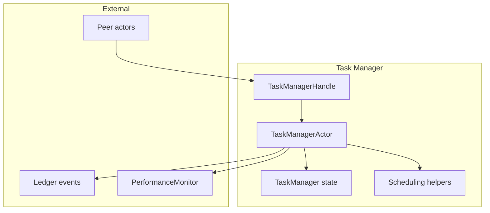
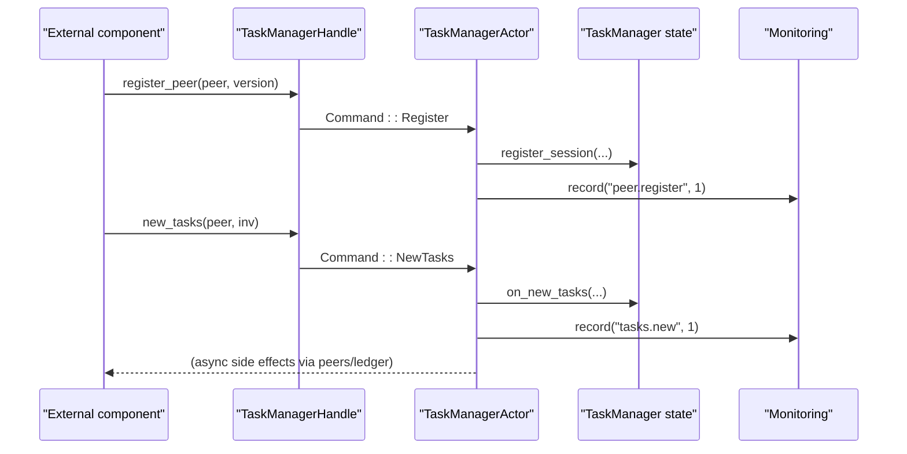
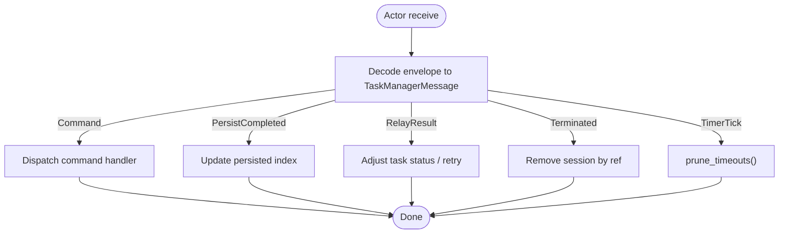
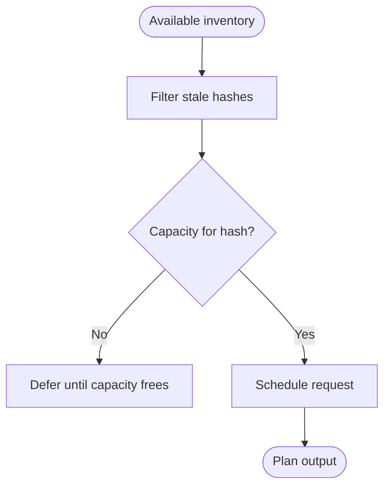
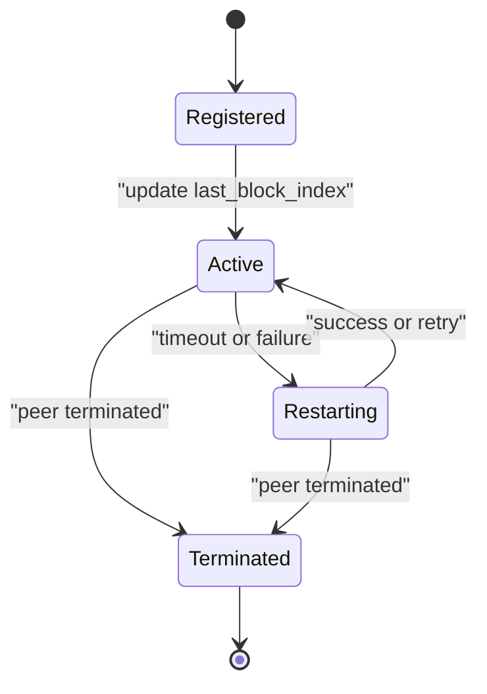
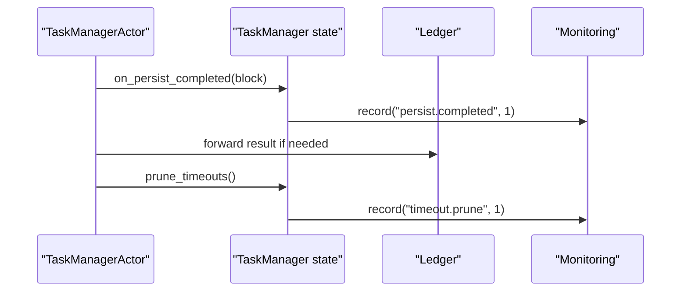
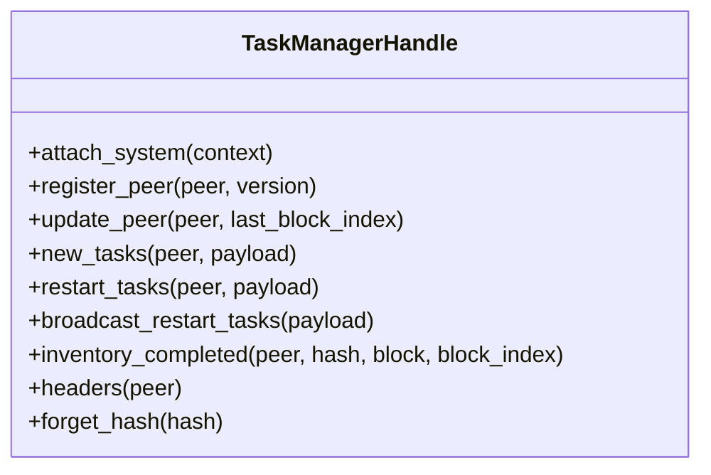
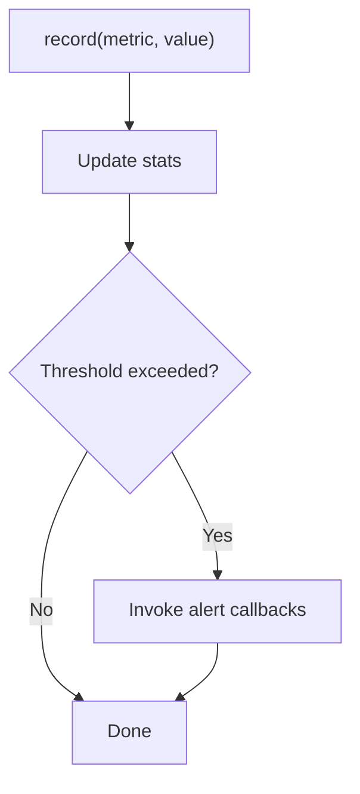
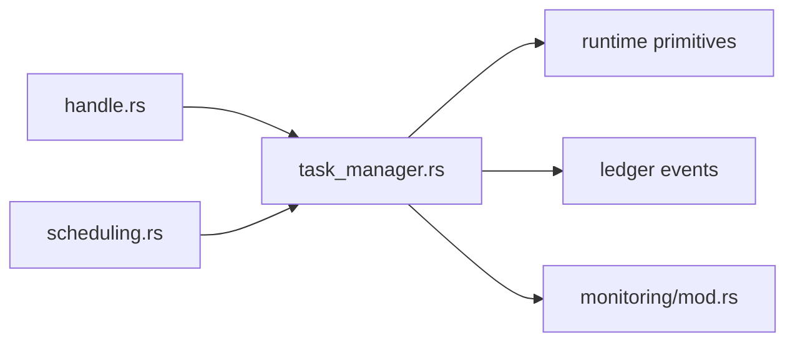

# Task Manager Architecture

<cite>
**Referenced Files in This Document**
- [task_manager.rs](file://neo-core/src/network/p2p/task_manager.rs)
- [scheduling.rs](file://neo-core/src/network/p2p/task_manager/scheduling.rs)
- [handle.rs](file://neo-core/src/network/p2p/task_manager/handle.rs)
- [task_manager_restart_tests.rs](file://neo-core/tests/task_manager_restart_tests.rs)
- [mod.rs (monitoring)](file://neo-core/src/monitoring/mod.rs)
</cite>

## Table of Contents
1. [Introduction](#introduction)
2. [Project Structure](#project-structure)
3. [Core Components](#core-components)
4. [Architecture Overview](#architecture-overview)
5. [Detailed Component Analysis](#detailed-component-analysis)
6. [Dependency Analysis](#dependency-analysis)
7. [Performance Considerations](#performance-considerations)
8. [Troubleshooting Guide](#troubleshooting-guide)
9. [Conclusion](#conclusion)
10. [Appendices](#appendices)

## Introduction
This document explains the task manager architecture that coordinates synchronization tasks across peers. It covers scheduling, priority-based queuing, resource allocation, session lifecycle management, state tracking, error recovery, external control via a typed handle, monitoring and metrics, configuration options, and debugging techniques. The goal is to make the system understandable for both developers and operators while remaining grounded in the actual codebase.

## Project Structure
The task manager lives under the P2P subsystem and is implemented as an actor with a clear separation between actor-facing messaging and pure scheduling logic:
- Actor shell and message routing: task_manager.rs
- Scheduling algorithms and counters: scheduling.rs
- External control facade: handle.rs
- Tests validating restart behavior and edge cases: task_manager_restart_tests.rs
- Monitoring and metrics infrastructure used by the node: monitoring/mod.rs

**Diagram sources**
- [task_manager.rs:101-142](file://neo-core/src/network/p2p/task_manager.rs#L101-L142)
- [task_manager.rs:147-174](file://neo-core/src/network/p2p/task_manager.rs#L147-L174)
- [task_manager.rs:269-299](file://neo-core/src/network/p2p/task_manager.rs#L269-L299)
- [scheduling.rs:1-83](file://neo-core/src/network/p2p/task_manager/scheduling.rs#L1-L83)
- [handle.rs:8-88](file://neo-core/src/network/p2p/task_manager/handle.rs#L8-L88)

**Section sources**
- [task_manager.rs:1-15](file://neo-core/src/network/p2p/task_manager.rs#L1-L15)
- [task_manager.rs:101-142](file://neo-core/src/network/p2p/task_manager.rs#L101-L142)
- [scheduling.rs:1-83](file://neo-core/src/network/p2p/task_manager/scheduling.rs#L1-L83)
- [handle.rs:8-88](file://neo-core/src/network/p2p/task_manager/handle.rs#L8-L88)

## Core Components
- TaskManagerActor: An actor that receives commands, ledger events, peer termination notifications, and periodic timer ticks. It routes messages to internal handlers and schedules housekeeping.
- TaskManager: Pure state holding sessions, known hashes, global task counters, timers, and timeouts. It encapsulates business logic for scheduling and cleanup.
- Scheduling module: Provides TaskCounter for per-hash or per-height concurrency limits, and planning functions for header requests, block index batches, and available inventory tasks.
- TaskManagerHandle: A typed facade over the actor reference exposing safe methods to register peers, announce new tasks, restart tasks, report completion, and more.
- Monitoring integration: PerformanceMonitor records metrics and evaluates thresholds, enabling alerting on performance anomalies.

Key responsibilities:
- Maintain peer sessions and track their advertised heights.
- Plan and limit concurrent requests for headers and blocks.
- Deduplicate and prioritize shared inventory tasks across peers.
- React to persistence and relay results to update progress.
- Prune timed-out tasks and clean up resources on shutdown.

**Section sources**
- [task_manager.rs:101-142](file://neo-core/src/network/p2p/task_manager.rs#L101-L142)
- [task_manager.rs:147-174](file://neo-core/src/network/p2p/task_manager.rs#L147-L174)
- [task_manager.rs:202-260](file://neo-core/src/network/p2p/task_manager.rs#L202-L260)
- [scheduling.rs:6-83](file://neo-core/src/network/p2p/task_manager/scheduling.rs#L6-L83)
- [handle.rs:8-88](file://neo-core/src/network/p2p/task_manager/handle.rs#L8-L88)
- [mod.rs (monitoring):400-464](file://neo-core/src/monitoring/mod.rs#L400-L464)

## Architecture Overview
The task manager uses an actor model to isolate state and coordinate asynchronous work. External components interact through TaskManagerHandle, which sends typed commands to the actor. The actor dispatches messages to handlers that update state and schedule network requests. Periodic timers prune timeouts and maintain health.

**Diagram sources**
- [handle.rs:35-51](file://neo-core/src/network/p2p/task_manager/handle.rs#L35-L51)
- [task_manager.rs:202-242](file://neo-core/src/network/p2p/task_manager.rs#L202-L242)
- [mod.rs (monitoring):422-435](file://neo-core/src/monitoring/mod.rs#L422-L435)

## Detailed Component Analysis

### Task Manager Actor and Message Flow
- Messages: Commands from the handle, PersistCompleted and RelayResult from the ledger, Terminated from peer actors, and TimerTick for housekeeping.
- Routing: The actor decodes envelopes into typed messages and delegates to handler methods. Unknown messages are logged and dropped safely.
- Timers: A recurring timer triggers timeout pruning; it is started when the system context attaches and cancelled on stop.

**Diagram sources**
- [task_manager.rs:147-174](file://neo-core/src/network/p2p/task_manager.rs#L147-L174)
- [task_manager.rs:202-260](file://neo-core/src/network/p2p/task_manager.rs#L202-L260)

**Section sources**
- [task_manager.rs:147-174](file://neo-core/src/network/p2p/task_manager.rs#L147-L174)
- [task_manager.rs:202-260](file://neo-core/src/network/p2p/task_manager.rs#L202-L260)
- [task_manager.rs:269-299](file://neo-core/src/network/p2p/task_manager.rs#L269-L299)

### Scheduling System and Priority-Based Queuing
- Concurrency limits: TaskCounter enforces MAX_CONCURRENT_TASKS per inventory hash or per height, preventing saturation and starvation.
- Inventory planning: plan_available_inventory_tasks filters stale items and schedules only those with capacity.
- Header requests: plan_header_request ensures retries only when peers allow and global capacity permits.
- Block index batching: plan_block_index_request computes contiguous ranges bounded by batch size and window limits, skipping in-flight heights.

**Diagram sources**
- [scheduling.rs:151-175](file://neo-core/src/network/p2p/task_manager/scheduling.rs#L151-L175)
- [scheduling.rs:8-66](file://neo-core/src/network/p2p/task_manager/scheduling.rs#L8-L66)

**Section sources**
- [scheduling.rs:6-83](file://neo-core/src/network/p2p/task_manager/scheduling.rs#L6-L83)
- [scheduling.rs:85-149](file://neo-core/src/network/p2p/task_manager/scheduling.rs#L85-L149)
- [scheduling.rs:151-175](file://neo-core/src/network/p2p/task_manager/scheduling.rs#L151-L175)

### Session Lifecycle Management
- Registration: Peers are registered with their VersionPayload, enabling capability-aware decisions (e.g., header retrieval).
- Updates: Last advertised block index updates inform scheduling windows.
- Termination: On peer termination, sessions are removed to free resources and avoid leaks.
- Housekeeping: Periodic timer tick triggers timeout pruning to recover from stalled tasks.

**Diagram sources**
- [task_manager.rs:202-256](file://neo-core/src/network/p2p/task_manager.rs#L202-L256)
- [task_manager.rs:258-260](file://neo-core/src/network/p2p/task_manager.rs#L258-L260)

**Section sources**
- [task_manager.rs:202-256](file://neo-core/src/network/p2p/task_manager.rs#L202-L256)
- [task_manager.rs:258-260](file://neo-core/src/network/p2p/task_manager.rs#L258-L260)

### State Management and Error Recovery
- Known hashes: A cache tracks processed hashes to avoid redundant work.
- Global counters: Track in-flight inventory and index tasks to enforce concurrency and prevent overload.
- Persistence callbacks: PersistCompleted advances the last seen persisted index, aligning sync progress with storage.
- Relay results: RelayResult informs success/failure paths, enabling retries or backoff strategies.
- Timeout pruning: Removes or re-schedules tasks that exceed configured timeouts.

**Diagram sources**
- [task_manager.rs:243-260](file://neo-core/src/network/p2p/task_manager.rs#L243-L260)
- [mod.rs (monitoring):422-435](file://neo-core/src/monitoring/mod.rs#L422-L435)

**Section sources**
- [task_manager.rs:243-260](file://neo-core/src/network/p2p/task_manager.rs#L243-L260)
- [task_manager.rs:101-142](file://neo-core/src/network/p2p/task_manager.rs#L101-L142)

### External Control via Handle Interface
The handle provides a type-safe API to interact with the task manager without direct actor knowledge:
- attach_system: Binds the manager to the node’s system context.
- register_peer: Registers a peer with its version payload.
- update_peer: Updates a peer’s last advertised block index.
- new_tasks: Announces new inventory tasks from a peer.
- restart_tasks / broadcast_restart_tasks: Re-requests inventories from specific or all peers.
- inventory_completed: Marks delivered items as completed.
- headers: Records that headers were received from a peer.
- forget_hash: Forgets hashes whose processing failed before acceptance.

**Diagram sources**
- [handle.rs:8-88](file://neo-core/src/network/p2p/task_manager/handle.rs#L8-L88)

**Section sources**
- [handle.rs:8-88](file://neo-core/src/network/p2p/task_manager/handle.rs#L8-L88)

### Monitoring and Metrics Collection
- PerformanceMonitor supports registering metrics, recording samples, evaluating thresholds, and invoking alert callbacks.
- Integration points: The task manager can record events such as task creation, completion, and timeout pruning to enable observability and alerting.

**Diagram sources**
- [mod.rs (monitoring):400-464](file://neo-core/src/monitoring/mod.rs#L400-L464)

**Section sources**
- [mod.rs (monitoring):400-464](file://neo-core/src/monitoring/mod.rs#L400-L464)

## Dependency Analysis
- Internal dependencies:
  - task_manager.rs depends on scheduling.rs for concurrency and planning logic.
  - task_manager.rs depends on handle.rs for typed external control.
  - task_manager.rs integrates with runtime primitives (Actor, EventStreamHandle, ScheduleHandle) and ledger events (PersistCompleted, RelayResult).
- External dependencies:
  - Monitoring subsystem for metrics and alerts.
  - Peer actors for sending/receiving protocol messages.

**Diagram sources**
- [handle.rs:8-88](file://neo-core/src/network/p2p/task_manager/handle.rs#L8-L88)
- [task_manager.rs:27-57](file://neo-core/src/network/p2p/task_manager.rs#L27-L57)
- [scheduling.rs:1-83](file://neo-core/src/network/p2p/task_manager/scheduling.rs#L1-L83)
- [mod.rs (monitoring):400-464](file://neo-core/src/monitoring/mod.rs#L400-L464)

**Section sources**
- [task_manager.rs:27-57](file://neo-core/src/network/p2p/task_manager.rs#L27-L57)
- [scheduling.rs:1-83](file://neo-core/src/network/p2p/task_manager/scheduling.rs#L1-L83)
- [handle.rs:8-88](file://neo-core/src/network/p2p/task_manager/handle.rs#L8-L88)
- [mod.rs (monitoring):400-464](file://neo-core/src/monitoring/mod.rs#L400-L464)

## Performance Considerations
- Concurrency caps: MAX_CONCURRENT_TASKS prevents header fetching from starving block sync and avoids overwhelming peers.
- Batch sizing: MAX_BLOCK_INDEX_BATCH and BLOCK_INDEX_WINDOW_MULTIPLIER balance throughput and head-of-line blocking risks.
- Timeouts: TASK_TIMEOUT governs in-flight request lifetimes; TIMER_INTERVAL controls pruning frequency.
- Memory usage: HashSetCache bounds known hashes; TaskCounter maps track active tasks efficiently.
- Observability: Use PerformanceMonitor to record key events and set thresholds for early warning.

[No sources needed since this section provides general guidance]

## Troubleshooting Guide
Common issues and diagnostics:
- Unknown messages routed to task manager: Logged with message type ID; indicates misrouted envelopes.
- Dead peer registration: Tests verify no noisy warnings when registering closed peers; ensure proper peer lifecycle handling.
- Restart behavior: Restarting tasks from unknown senders should not trigger GetData to other peers; broadcast restart should target registered peers only.
- Timeouts and stalls: Verify timer intervals and timeouts; check pruning logs and metrics.

Debugging steps:
- Inspect actor messages and commands via tests similar to task_manager_restart_tests.rs.
- Attach tracing layers to capture warnings and events from the “neo” target.
- Use PerformanceMonitor thresholds to detect abnormal task volumes or latencies.

**Section sources**
- [task_manager.rs:269-299](file://neo-core/src/network/p2p/task_manager.rs#L269-L299)
- [task_manager_restart_tests.rs:79-136](file://neo-core/tests/task_manager_restart_tests.rs#L79-L136)
- [task_manager_restart_tests.rs:138-173](file://neo-core/tests/task_manager_restart_tests.rs#L138-L173)
- [task_manager_restart_tests.rs:286-339](file://neo-core/tests/task_manager_restart_tests.rs#L286-L339)

## Conclusion
The task manager provides a robust, actor-based coordination layer for synchronization tasks. It enforces concurrency limits, plans efficient requests, manages peer sessions, reacts to persistence and relay outcomes, and exposes a clean handle interface for external control. With integrated monitoring and configurable timeouts, it supports reliable operation and observability in production environments.

[No sources needed since this section summarizes without analyzing specific files]

## Appendices

### Configuration Options
- Timer interval: Controls periodic housekeeping frequency.
- Task timeout: Governs maximum lifetime for in-flight inventory requests.
- Max concurrent tasks: Limits parallelism per inventory hash to protect peers and balance workload.
- Block index batch size: Caps contiguous height ranges requested per round.
- Window multiplier: Defines how far ahead the scheduler may look for block index requests.

**Section sources**
- [task_manager.rs:59-78](file://neo-core/src/network/p2p/task_manager.rs#L59-L78)
- [scheduling.rs:85-125](file://neo-core/src/network/p2p/task_manager/scheduling.rs#L85-L125)