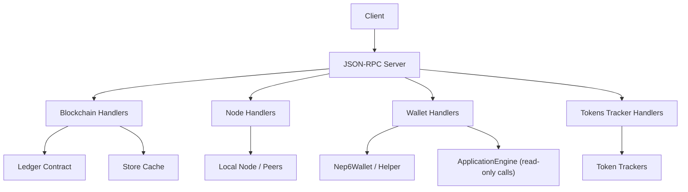
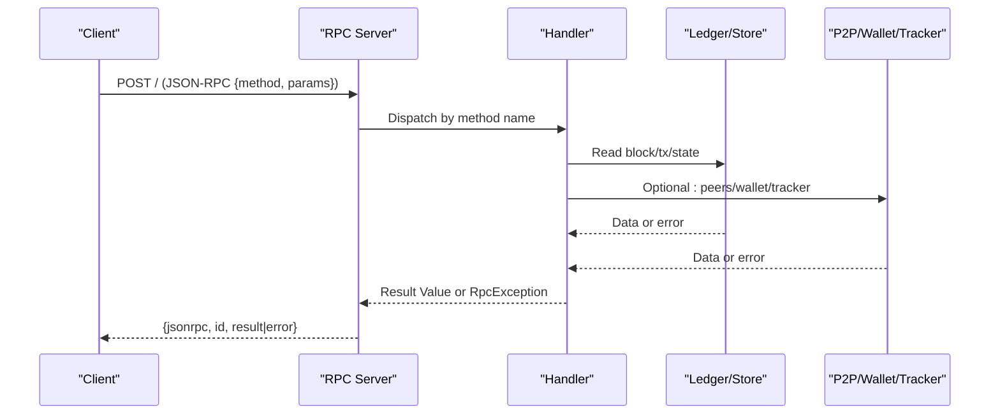
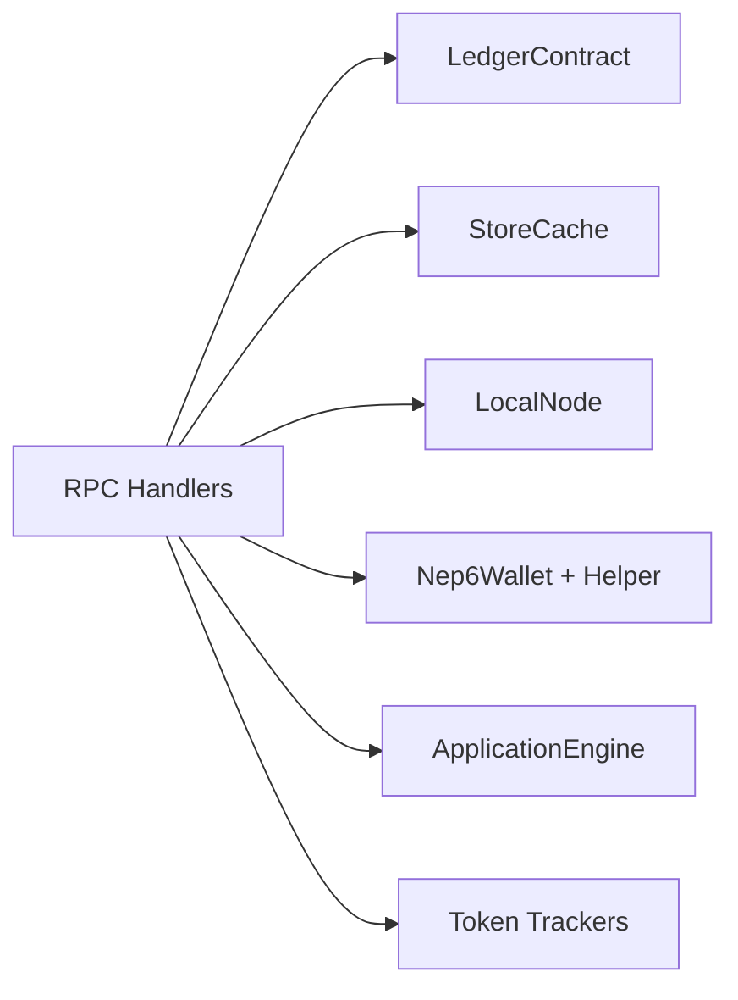

# API Endpoints Reference

<cite>
**Referenced Files in This Document**
- [mod.rs](file://neo-rpc/src/server/rpc_server_blockchain/mod.rs)
- [mod.rs](file://neo-rpc/src/server/rpc_server_node/mod.rs)
- [mod.rs](file://neo-rpc/src/server/rpc_server_wallet/mod.rs)
- [mod.rs](file://neo-rpc/src/server/rpc_server_tokens_tracker/mod.rs)
</cite>

## Table of Contents
1. [Introduction](#introduction)
2. [Project Structure](#project-structure)
3. [Core Components](#core-components)
4. [Architecture Overview](#architecture-overview)
5. [Detailed Component Analysis](#detailed-component-analysis)
6. [Dependency Analysis](#dependency-analysis)
7. [Performance Considerations](#performance-considerations)
8. [Troubleshooting Guide](#troubleshooting-guide)
9. [Conclusion](#conclusion)

## Introduction
This document provides a comprehensive reference for Neo-RS JSON-RPC endpoints exposed by the node. It focuses on HTTP POST requests using the standard JSON-RPC 2.0 envelope and organizes methods into functional categories: Blockchain queries, Node management, Smart contract operations, Wallet operations, State queries, Token tracking (NEP-17/NEP-11), Application logs, Oracle services, Settings management, and Utility functions. For each method, you will find request parameters, return types, validation rules, common error responses, and practical usage patterns.

## Project Structure
The RPC server is organized by feature modules under neo-rpc/src/server. Each module registers handlers for a set of related JSON-RPC methods and delegates to core system components (ledger, storage, mempool, p2p, smart contract engine). The key modules used in this reference are:
- Blockchain: block/header/transaction/query helpers
- Node: peer/version/connection info and transaction/block submission
- Wallet: account management, transfers, fee calculation
- Tokens Tracker: NEP-17/NEP-11 balances and transfer history

**Diagram sources**
- [mod.rs](file://neo-rpc/src/server/rpc_server_blockchain/mod.rs)
- [mod.rs](file://neo-rpc/src/server/rpc_server_node/mod.rs)
- [mod.rs](file://neo-rpc/src/server/rpc_server_wallet/mod.rs)
- [mod.rs](file://neo-rpc/src/server/rpc_server_tokens_tracker/mod.rs)

**Section sources**
- [mod.rs](file://neo-rpc/src/server/rpc_server_blockchain/mod.rs)
- [mod.rs](file://neo-rpc/src/server/rpc_server_node/mod.rs)
- [mod.rs](file://neo-rpc/src/server/rpc_server_wallet/mod.rs)
- [mod.rs](file://neo-rpc/src/server/rpc_server_tokens_tracker/mod.rs)

## Core Components
- Blockchain handlers provide read-only access to blocks, headers, transactions, contracts, validators, candidates, committee, and mempool.
- Node handlers expose node identity, version, peers, connection count, and relay/submit endpoints.
- Wallet handlers manage opened wallets, accounts, addresses, balances, unclaimed gas, and asset transfers with optional signers.
- Tokens tracker handlers expose NEP-17 and NEP-11 balances and transfer histories when enabled.

**Section sources**
- [mod.rs](file://neo-rpc/src/server/rpc_server_blockchain/mod.rs)
- [mod.rs](file://neo-rpc/src/server/rpc_server_node/mod.rs)
- [mod.rs](file://neo-rpc/src/server/rpc_server_wallet/mod.rs)
- [mod.rs](file://neo-rpc/src/server/rpc_server_tokens_tracker/mod.rs)

## Architecture Overview
All JSON-RPC methods follow the same pattern:
- Parse and validate parameters
- Access store cache or live snapshots as needed
- Query ledger, p2p, or token trackers
- Return JSON or base64-encoded payloads
- Map internal errors to standardized RPC error codes

**Diagram sources**
- [mod.rs](file://neo-rpc/src/server/rpc_server_blockchain/mod.rs)
- [mod.rs](file://neo-rpc/src/server/rpc_server_node/mod.rs)
- [mod.rs](file://neo-rpc/src/server/rpc_server_wallet/mod.rs)
- [mod.rs](file://neo-rpc/src/server/rpc_server_tokens_tracker/mod.rs)

## Detailed Component Analysis

### Blockchain Queries
Methods: getbestblockhash, getblockcount, getblockheadercount, getblockhash, getblock, getblockheader, getblocksysfee, getrawmempool, getrawtransaction, getcontractstate, getstorage, findstorage, getnativecontracts, getnextblockvalidators, getcandidates, gettransactionheight, getcommittee.

Common parameter formats:
- Block identifier: integer index or hex-encoded hash string
- Hashes: hex-encoded strings
- Base64-encoded binary fields where specified
- Verbose flag: boolean or 0/1

Return types:
- Strings for hashes, base64 payloads, or numeric values
- Objects for verbose block/header/transaction details
- Arrays for lists (e.g., mempool, validators)

Validation rules:
- Index bounds checked against current chain height
- Hash parsing validated; invalid input returns invalid_params
- Base64 decoding errors mapped to invalid_params
- Verbose flag accepts boolean or 0/1

Error responses:
- unknown_height, unknown_block, unknown_transaction, unknown_contract, unknown_storage_item
- invalid_params for malformed inputs
- internal_server_error for unexpected failures

Practical examples:
- Get block by index: send params [index]
- Get block by hash: send params ["<hex-hash>"]
- Get raw transaction verbose: send params ["<tx-hex>", true]
- Find storage entries: send params ["<contract-id-or-hash-or-name>", "<base64-prefix>", start_index]

Notes:
- getrawmempool supports an optional boolean or 0/1 to include unverified transactions
- getblock/getblockheader support verbose mode returning full objects with confirmations and next block hash
- getstorage requires a Base64 key; findstorage paginates results with truncated and next fields

**Section sources**
- [mod.rs](file://neo-rpc/src/server/rpc_server_blockchain/mod.rs)

### Node Management
Methods: getversion, getpeers, getconnectioncount, sendrawtransaction, submitblock.

Parameters:
- getversion: none
- getpeers: none
- getconnectioncount: none
- sendrawtransaction: base64-encoded transaction
- submitblock: base64-encoded block

Return types:
- Object with node metadata and RPC settings for getversion
- Array of connected/unconnected peers for getpeers
- Integer for connection count
- Transaction hash or object for sendrawtransaction
- Boolean or status for submitblock

Validation rules:
- Base64 decoding for payloads
- Peer lists built from local node snapshots and unconnected queue

Error responses:
- invalid_params for malformed payloads
- internal_server_error for unexpected failures

Practical examples:
- Check node version: call getversion
- List peers: call getpeers
- Relay a transaction: call sendrawtransaction with base64 payload

**Section sources**
- [mod.rs](file://neo-rpc/src/server/rpc_server_node/mod.rs)

### Smart Contract Operations
Methods: invokefunction, invokescript, getcontractstate.

Parameters:
- invokefunction: contract identifier, method name, parameter list, call flags, signers (optional)
- invokescript: base64 script, call flags, signers (optional)
- getcontractstate: contract identifier (name, hash, or id)

Return types:
- Invocation result object (gas consumed, state, events, revert reason if any)
- Contract state object for getcontractstate

Validation rules:
- Contract identifiers parsed as name/hash/id
- Script base64 decoded and executed in read-only or full mode depending on flags
- Signers array optional; must be valid address strings when provided

Error responses:
- invalid_params for bad inputs
- internal_server_error for execution failures
- unknown_contract for missing contracts

Practical examples:
- Call a read-only method: use invokescript with READ_ONLY flags
- Submit a state-changing invocation: use invokefunction with appropriate signers

Notes:
- getcontractstate is also listed under blockchain handlers and can be used to inspect deployed contracts

**Section sources**
- [mod.rs](file://neo-rpc/src/server/rpc_server_blockchain/mod.rs)

### Wallet Operations
Methods: openwallet, closewallet, dumpprivkey, getnewaddress, getwalletbalance, getwalletunclaimedgas, importprivkey, listaddress, calculatenetworkfee, sendfrom, sendtoaddress, sendmany, canceltransaction.

Parameters:
- openwallet: wallet path, password
- dumpprivkey: address or script hash
- getwalletbalance: asset id (script hash)
- getwalletunclaimedgas: none
- importprivkey: WIF private key
- calculatenetworkfee: base64 transaction
- sendfrom/sendtoaddress/sendmany: asset, destination(s), amount(s), optional signers
- canceltransaction: transaction id, signers array, optional extra fee

Return types:
- Boolean for open/close
- Address strings for new address
- Balance objects with decimal amounts
- Transaction hash/object for transfers
- Network fee string for calculatenetworkfee

Validation rules:
- Path resolution jailed to configured wallet directory
- Amounts parsed with asset decimals; negative or zero rejected
- Signers must be arrays of address strings
- Cancel transaction checks confirmed status and applies conflict attribute

Error responses:
- wallet_not_found for missing files or paths outside jail
- wallet_not_supported for invalid password or unsupported operations
- insufficient_funds_wallet for balance issues
- already_exists for confirmed transactions being cancelled
- invalid_params for malformed inputs

Practical examples:
- Open wallet: openwallet("/path/to/wallet.json", "password")
- Send NEO/GAS: sendfrom("<asset-id>", "<from-address>", "<to-address>", "<amount>")
- Estimate network fee: calculatenetworkfee("<base64-tx>")

Notes:
- getwalletbalance handles native tokens (NEO/GAS) specially and falls back to NEP-17 logic for others
- sendmany accepts an array of outputs with asset, value, and address fields

**Section sources**
- [mod.rs](file://neo-rpc/src/server/rpc_server_wallet/mod.rs)

### State Queries
Methods: getstate, getsnapshot.

Notes:
- These methods are not explicitly registered in the referenced handler modules. If present elsewhere, they typically return application state snapshots or configuration-derived data. Verify registration in your build configuration.

[No sources needed since this section doesn't analyze specific source files]

### Token Tracking (NEP-17/NEP-11)
Methods: getnep17balances, getnep17transfers, getnep11balances, getnep11transfers, getnep11properties.

Parameters:
- Balances: address (string or script hash)
- Transfers: address, optional start timestamp, optional end timestamp
- Properties: script hash (token contract), token id

Return types:
- Object with address and array of balances including asset metadata
- Object with sent/received transfer arrays
- Map of properties for NEP-11 tokens

Validation rules:
- Methods require tracker service enabled; otherwise return method_not_found
- Timestamp ranges validated; defaults to last 7 days if omitted
- Max results enforced by tracker settings

Error responses:
- method_not_found if tracker disabled or history not tracked
- invalid_params for bad timestamps or addresses

Practical examples:
- Get NEP-17 balances: getnep17balances("<address>")
- Query NEP-11 transfers: getnep11transfers("<address>", start_ms, end_ms)
- Fetch NEP-11 properties: getnep11properties("<contract-script-hash>", "<token-id>")

**Section sources**
- [mod.rs](file://neo-rpc/src/server/rpc_server_tokens_tracker/mod.rs)

### Application Logs
Methods: Not registered in the referenced modules. Typically used to query application log entries filtered by time range or event type.

[No sources needed since this section doesn't analyze specific source files]

### Oracle Services
Methods: Not registered in the referenced modules. Typically used to submit oracle requests and retrieve responses.

[No sources needed since this section doesn't analyze specific source files]

### Settings Management
Methods: Not registered in the referenced modules. Typically used to read or update runtime settings.

[No sources needed since this section doesn't analyze specific source files]

### Utility Functions
Methods: Not registered in the referenced modules. Common utilities may include address validation, hash conversions, and helper computations.

[No sources needed since this section doesn't analyze specific source files]

## Dependency Analysis
The RPC handlers depend on:
- LedgerContract for chain state (blocks, headers, transactions, validators, candidates, committee)
- StoreCache for persistent data access
- LocalNode/P2P for peer information
- Nep6Wallet and Helper for wallet operations
- ApplicationEngine for read-only contract invocations
- Token trackers for NEP-17/NEP-11 data

**Diagram sources**
- [mod.rs](file://neo-rpc/src/server/rpc_server_blockchain/mod.rs)
- [mod.rs](file://neo-rpc/src/server/rpc_server_node/mod.rs)
- [mod.rs](file://neo-rpc/src/server/rpc_server_wallet/mod.rs)
- [mod.rs](file://neo-rpc/src/server/rpc_server_tokens_tracker/mod.rs)

**Section sources**
- [mod.rs](file://neo-rpc/src/server/rpc_server_blockchain/mod.rs)
- [mod.rs](file://neo-rpc/src/server/rpc_server_node/mod.rs)
- [mod.rs](file://neo-rpc/src/server/rpc_server_wallet/mod.rs)
- [mod.rs](file://neo-rpc/src/server/rpc_server_tokens_tracker/mod.rs)

## Performance Considerations
- Prefer non-verbose modes for large payloads (blocks, transactions) to reduce bandwidth
- Use pagination for findstorage and token transfer queries to avoid large responses
- Limit max_results via tracker settings to control response size
- Avoid excessive read-only invocations; batch where possible
- Use mempool queries judiciously; locking may impact throughput

[No sources needed since this section provides general guidance]

## Troubleshooting Guide
Common errors and causes:
- invalid_params: malformed or out-of-range parameters (e.g., invalid hash, negative amount, wrong verbose flag)
- unknown_height/unknown_block/unknown_transaction/unknown_contract/unknown_storage_item: requested item not found at current chain state
- wallet_not_found: wallet file missing or path outside jail
- wallet_not_supported: invalid password or unsupported operation
- insufficient_funds_wallet: sender lacks sufficient balance
- already_exists: attempting to cancel a confirmed transaction
- method_not_found: token tracker features disabled or not implemented

Diagnostics:
- Validate parameters before sending (hash formats, base64 encoding, numeric ranges)
- Check node version and RPC settings for limits (max iterator results, session flags)
- Inspect mempool and chain height for transaction visibility
- Confirm tracker settings for NEP-17/NEP-11 availability

**Section sources**
- [mod.rs](file://neo-rpc/src/server/rpc_server_blockchain/mod.rs)
- [mod.rs](file://neo-rpc/src/server/rpc_server_wallet/mod.rs)
- [mod.rs](file://neo-rpc/src/server/rpc_server_tokens_tracker/mod.rs)

## Conclusion
Neo-RS exposes a robust set of JSON-RPC endpoints across blockchain, node, wallet, and token tracking domains. By following the parameter validation rules and error handling patterns documented here, clients can reliably interact with the node. For methods not covered in this reference, verify their registration in your build configuration and consult additional modules if available.