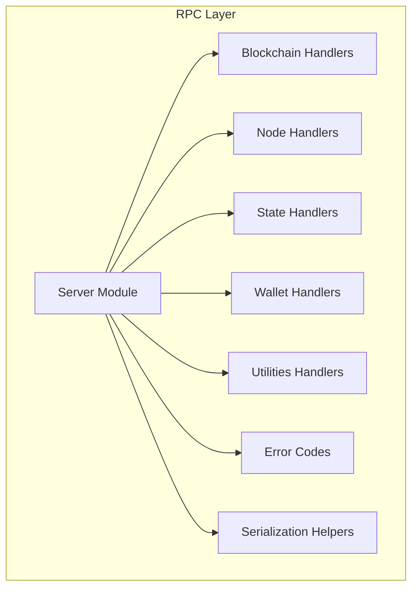
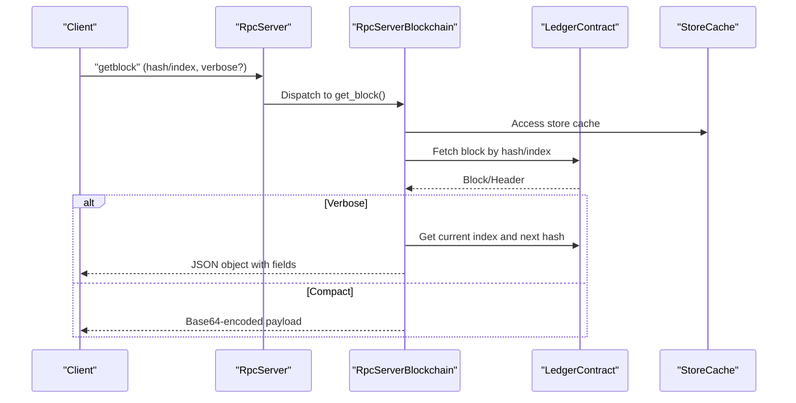
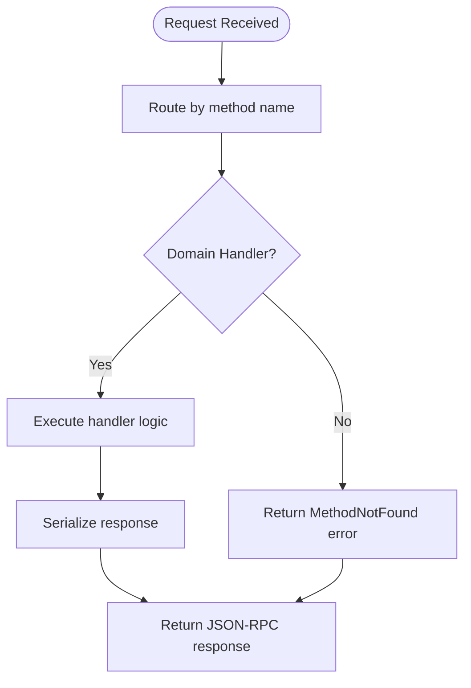
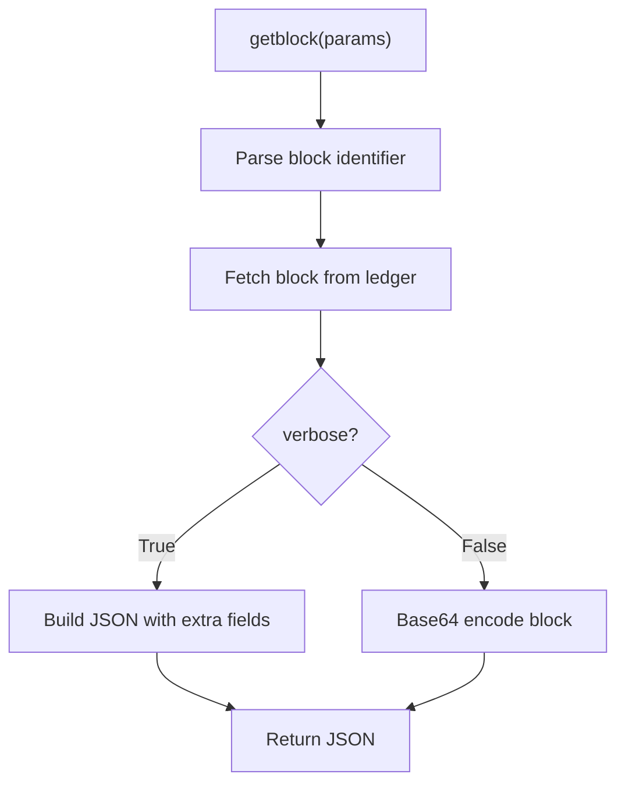
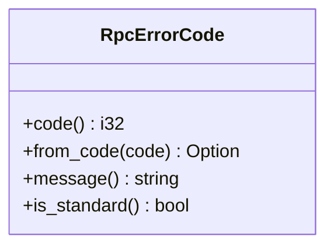
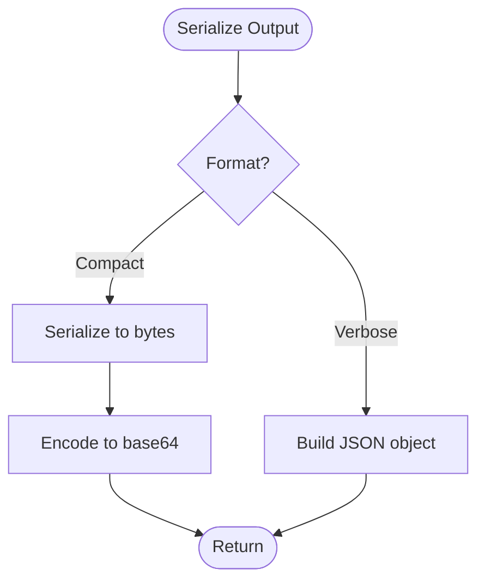
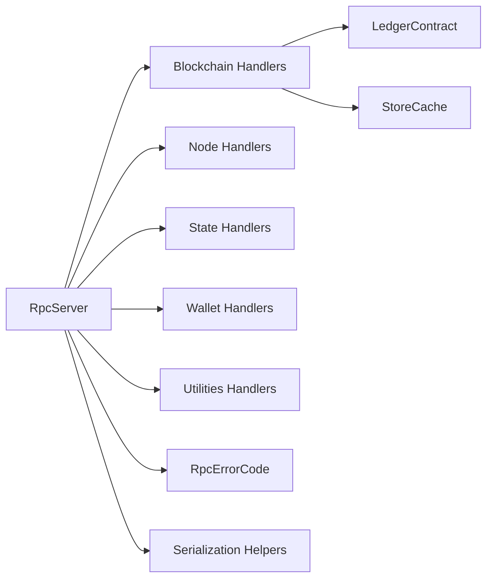

# API Versioning & Compatibility

<cite>
**Referenced Files in This Document**
- [lib.rs](file://neo-rpc/src/lib.rs)
- [error_code.rs](file://neo-rpc/src/error_code.rs)
- [serialization.rs](file://neo-rpc/src/serialization.rs)
- [mod.rs](file://neo-rpc/src/server/mod.rs)
- [rpc_server_blockchain_mod.rs](file://neo-rpc/src/server/rpc_server_blockchain/mod.rs)
</cite>

## Table of Contents
1. [Introduction](#introduction)
2. [Project Structure](#project-structure)
3. [Core Components](#core-components)
4. [Architecture Overview](#architecture-overview)
5. [Detailed Component Analysis](#detailed-component-analysis)
6. [Dependency Analysis](#dependency-analysis)
7. [Performance Considerations](#performance-considerations)
8. [Troubleshooting Guide](#troubleshooting-guide)
9. [Conclusion](#conclusion)
10. [Appendices](#appendices)

## Introduction
This document defines the API versioning and compatibility strategy for the Neo-RS JSON-RPC interface. It explains how RPC methods are versioned, how backward compatibility is maintained, and how deprecations are handled. It also covers:
- Detecting API versions at runtime
- Migration paths between versions
- Graceful degradation when calling deprecated endpoints
- Serialization format changes across versions
- Error code evolution
- Response schema modifications
- Guidelines for compatible client implementations and testing strategies
- The relationship between RPC API versions and Neo protocol versions, including upgrade and rollback considerations

The goal is to provide a clear, actionable guide for both server operators and client developers to evolve the RPC surface safely over time.

## Project Structure
The Neo-RS RPC layer is implemented as a crate providing both server and client functionality. Key modules include:
- Server entrypoints and method registration
- Blockchain, Node, State, Wallet, Oracle, Utilities, and Smart Contract handlers
- Shared error codes and serialization helpers
- Client APIs and builders

**Diagram sources**
- [mod.rs:6-66](file://neo-rpc/src/server/mod.rs#L6-L66)
- [lib.rs:205-241](file://neo-rpc/src/lib.rs#L205-L241)

**Section sources**
- [lib.rs:6-54](file://neo-rpc/src/lib.rs#L6-L54)
- [mod.rs:6-66](file://neo-rpc/src/server/mod.rs#L6-L66)

## Core Components
- RPC Server: Exposes JSON-RPC methods grouped by domain (blockchain, node, state, wallet, utilities). Method registration is centralized and extensible.
- Error Codes: Centralized enum mapping standard JSON-RPC and Neo-specific error codes with messages and helpers.
- Serialization: Shared helpers to serialize core types into base64 or bytes for wire payloads.
- Client: Typed API and builders for interacting with nodes, including retry and timeout support.

Key responsibilities for versioning and compatibility:
- Stable method names and signatures where possible
- Backward-compatible response schemas with optional fields
- Controlled error code evolution
- Clear deprecation lifecycle and migration guidance

**Section sources**
- [lib.rs:56-199](file://neo-rpc/src/lib.rs#L56-L199)
- [error_code.rs:6-140](file://neo-rpc/src/error_code.rs#L6-L140)
- [serialization.rs:1-21](file://neo-rpc/src/serialization.rs#L1-L21)

## Architecture Overview
The RPC server registers handlers per domain and dispatches requests to the appropriate handler. Responses are serialized using shared helpers and standardized error codes.

**Diagram sources**
- [rpc_server_blockchain_mod.rs:108-151](file://neo-rpc/src/server/rpc_server_blockchain/mod.rs#L108-L151)
- [rpc_server_blockchain_mod.rs:228-282](file://neo-rpc/src/server/rpc_server_blockchain/mod.rs#L228-L282)
- [serialization.rs:6-20](file://neo-rpc/src/serialization.rs#L6-L20)

## Detailed Component Analysis

### RPC Method Registration and Routing
- Methods are registered via a macro-driven registry that maps string method names to handler functions.
- Domain-specific modules expose their handlers and register them during server initialization.
- This design allows adding new methods without modifying global routing logic, supporting incremental versioning.

**Diagram sources**
- [mod.rs:36-66](file://neo-rpc/src/server/mod.rs#L36-L66)
- [rpc_server_blockchain_mod.rs:35-56](file://neo-rpc/src/server/rpc_server_blockchain/mod.rs#L35-L56)

**Section sources**
- [mod.rs:36-66](file://neo-rpc/src/server/mod.rs#L36-L66)
- [rpc_server_blockchain_mod.rs:35-56](file://neo-rpc/src/server/rpc_server_blockchain/mod.rs#L35-L56)

### Blockchain Handlers: Version-Sensitive Behavior
- Many blockchain methods accept flexible parameters (e.g., block identifier as hash or index; verbose flag as boolean or numeric).
- Verbose responses add extra fields such as confirmations and next block hash; compact responses return base64-encoded payloads.
- These behaviors enable backward-compatible evolution: older clients can rely on compact responses while newer clients opt into richer JSON.

**Diagram sources**
- [rpc_server_blockchain_mod.rs:108-151](file://neo-rpc/src/server/rpc_server_blockchain/mod.rs#L108-L151)
- [serialization.rs:15-20](file://neo-rpc/src/serialization.rs#L15-L20)

**Section sources**
- [rpc_server_blockchain_mod.rs:108-151](file://neo-rpc/src/server/rpc_server_blockchain/mod.rs#L108-L151)
- [rpc_server_blockchain_mod.rs:228-282](file://neo-rpc/src/server/rpc_server_blockchain/mod.rs#L228-L282)

### Error Code Evolution and Handling
- Standard JSON-RPC errors are preserved for interoperability.
- Neo-specific error codes are defined centrally and used consistently across handlers.
- New error codes should be added only when necessary and documented with migration notes. Clients should handle unknown codes gracefully.

**Diagram sources**
- [error_code.rs:6-62](file://neo-rpc/src/error_code.rs#L6-L62)

**Section sources**
- [error_code.rs:64-140](file://neo-rpc/src/error_code.rs#L64-L140)
- [error_code.rs:142-152](file://neo-rpc/src/error_code.rs#L142-L152)

### Serialization Formats Across Versions
- Compact responses use base64-encoded binary payloads derived from core serializable types.
- Verbose responses use JSON objects with explicit fields.
- When evolving formats:
  - Prefer additive changes (new optional fields) in JSON
  - Maintain base64 payload compatibility where possible
  - Introduce versioned wrappers if structural changes are required

**Diagram sources**
- [serialization.rs:6-20](file://neo-rpc/src/serialization.rs#L6-L20)

**Section sources**
- [serialization.rs:1-21](file://neo-rpc/src/serialization.rs#L1-L21)

### Relationship Between RPC API Versions and Neo Protocol Versions
- RPC behavior often depends on protocol settings (e.g., address version, native contract states, validator sets).
- Changes in protocol versions may alter RPC responses (e.g., new fields, changed semantics).
- Strategy:
  - Tie RPC behavior to protocol version checks within handlers
  - Provide feature flags or version-aware branches to maintain compatibility
  - Document which RPC versions require minimum protocol versions

[No sources needed since this section provides general guidance]

## Dependency Analysis
The RPC server depends on:
- Domain handlers (blockchain, node, state, wallet, utilities)
- Shared error codes and serialization helpers
- Core ledger and storage interfaces for data access

**Diagram sources**
- [mod.rs:6-66](file://neo-rpc/src/server/mod.rs#L6-L66)
- [rpc_server_blockchain_mod.rs:108-151](file://neo-rpc/src/server/rpc_server_blockchain/mod.rs#L108-L151)

**Section sources**
- [mod.rs:6-66](file://neo-rpc/src/server/mod.rs#L6-L66)
- [rpc_server_blockchain_mod.rs:108-151](file://neo-rpc/src/server/rpc_server_blockchain/mod.rs#L108-L151)

## Performance Considerations
- Prefer compact responses for high-throughput scenarios; allow clients to opt into verbose JSON when needed.
- Use pagination and truncation indicators for large result sets (e.g., findstorage).
- Avoid unnecessary conversions; reuse cached store snapshots where safe.
- Rate-limit and throttle requests to protect node stability under load.

[No sources needed since this section provides general guidance]

## Troubleshooting Guide
Common issues and resolutions:
- Method not found: Indicates unsupported or deprecated method; check server capabilities and client version.
- Invalid params: Validate parameter types and ranges; ensure verbose flags accept expected types.
- Unknown block/transaction/contract: Ensure correct identifiers and sufficient chain sync; verify height bounds.
- Insufficient funds/wallet errors: Confirm wallet state and balances; adjust fee limits if applicable.

Use error codes to categorize and log issues consistently. For unknown error codes, log and forward to clients with fallback handling.

**Section sources**
- [error_code.rs:64-140](file://neo-rpc/src/error_code.rs#L64-L140)
- [rpc_server_blockchain_mod.rs:175-226](file://neo-rpc/src/server/rpc_server_blockchain/mod.rs#L175-L226)

## Conclusion
Neo-RS RPC versioning emphasizes backward compatibility through:
- Stable method names and flexible parameters
- Additive response schema changes
- Centralized error code management
- Clear deprecation lifecycle and migration guidance
Clients should implement robust version detection, graceful degradation, and comprehensive tests to ensure compatibility across upgrades.

[No sources needed since this section summarizes without analyzing specific files]

## Appendices

### Version Detection and Capability Negotiation
- Use getversion to determine node capabilities and supported features.
- Clients can negotiate behavior based on returned version info (e.g., enable verbose responses only if supported).
- Implement fallbacks for missing fields or methods.

[No sources needed since this section provides general guidance]

### Deprecation Policy
- Announce deprecations in release notes with timelines.
- Keep deprecated endpoints functional for a grace period.
- Provide migration guides and alternative methods.
- Monitor usage metrics to plan removal.

[No sources needed since this section provides general guidance]

### Migration Paths Between Versions
- Add optional fields to JSON responses rather than removing existing ones.
- Introduce new methods before deprecating old ones.
- Use feature flags to toggle new behavior behind configuration.
- Test migrations against multiple node versions.

[No sources needed since this section provides general guidance]

### Testing Strategies for Version Compatibility
- Unit tests for each handler’s parameter parsing and response shaping.
- Integration tests against nodes running different protocol versions.
- Contract tests to validate JSON schema stability.
- Fuzz tests for parameter validation and error handling.

[No sources needed since this section provides general guidance]

### Upgrade Procedures and Rollback Considerations
- Coordinate RPC changes with protocol upgrades to avoid incompatible behavior.
- Maintain dual-mode support during transition windows.
- Plan rollbacks by keeping deprecated endpoints available until all clients migrate.
- Validate responses across versions before enabling new defaults.

[No sources needed since this section provides general guidance]