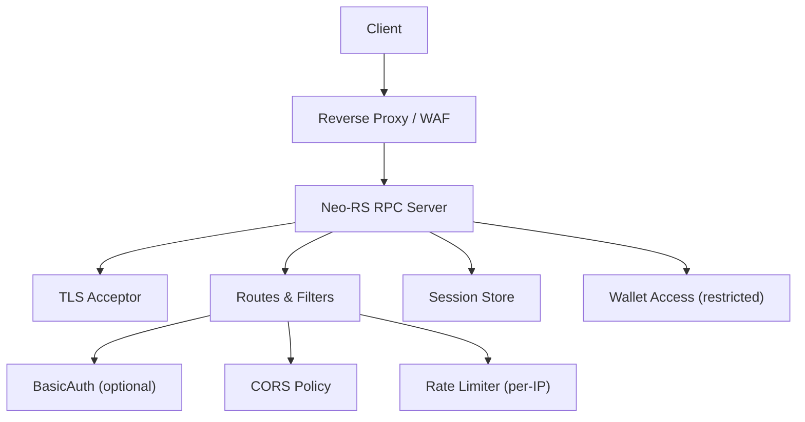
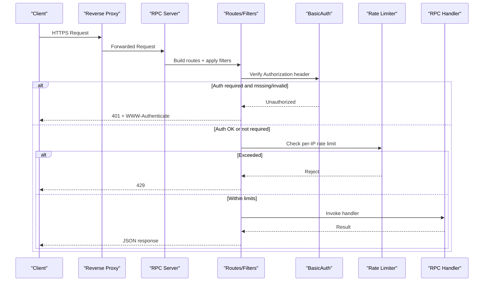
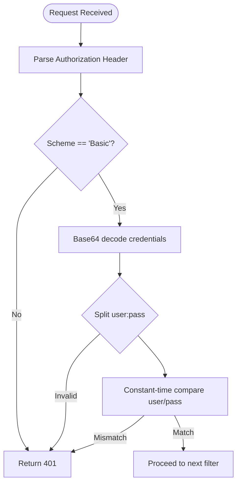
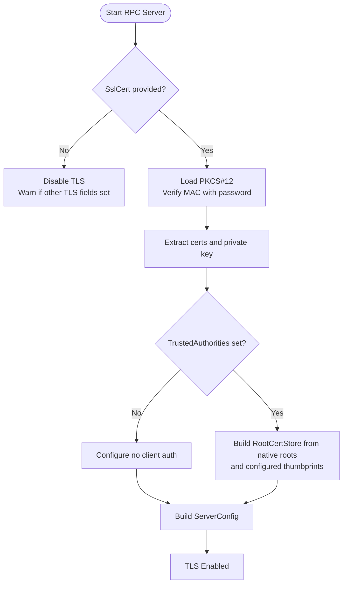
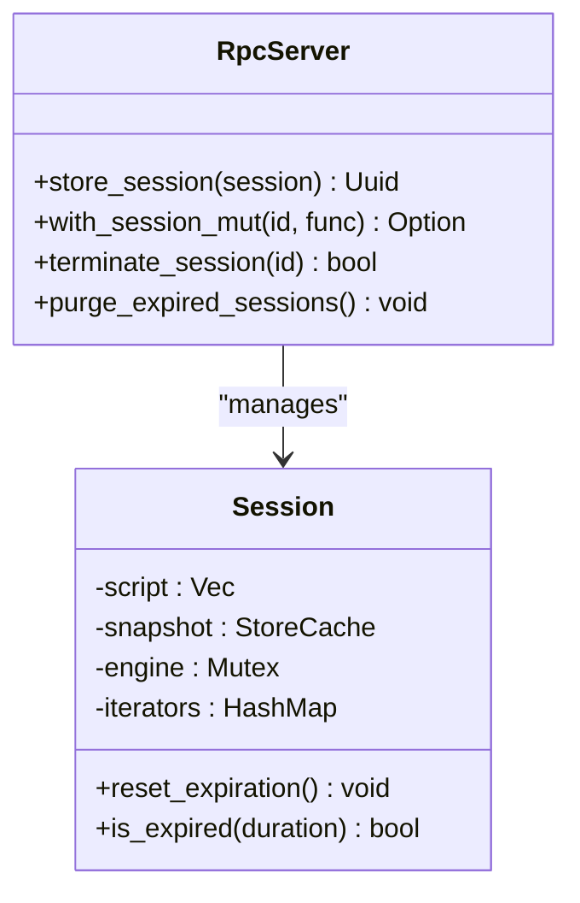
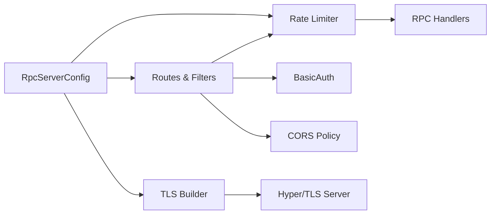

# Authentication & Security

<cite>
**Referenced Files in This Document**
- [SECURITY.md](file://docs/SECURITY.md)
- [RPC_HARDENING.md](file://docs/RPC_HARDENING.md)
- [RpcServer.json](file://neo-node/config/RpcServer/RpcServer.json)
- [rpc_server.rs](file://neo-rpc/src/server/rpc_server.rs)
- [rpc_tls.rs](file://neo-rpc/src/server/rpc_tls.rs)
- [session.rs](file://neo-rpc/src/server/session.rs)
- [mod.rs (routes)](file://neo-rpc/src/server/routes/mod.rs)
- [cors.rs](file://neo-rpc/src/server/routes/cors.rs)
- [rate_limiter.rs](file://neo-rpc/src/server/middleware/rate_limiter.rs)
- [rpc_server_settings.rs](file://neo-rpc/src/server/rpc_server_settings.rs)
</cite>

## Table of Contents
1. Introduction
2. Project Structure
3. Core Components
4. Architecture Overview
5. Detailed Component Analysis
6. Dependency Analysis
7. Performance Considerations
8. Troubleshooting Guide
9. Conclusion
10. Appendices

## Introduction
This document provides comprehensive authentication and security guidance for the Neo-RS RPC server. It covers username/password authentication, CORS configuration, TLS/HTTPS setup, rate limiting policies, input validation and sanitization, protection against common attacks (DoS, injection), wallet operation security, session management, access control patterns, production configuration examples, security headers, monitoring of suspicious activities, middleware architecture for custom security, and secure client application practices.

## Project Structure
The RPC server’s security surface is implemented across several modules:
- Server lifecycle, TLS, and connection limits are handled in the RPC server core.
- Authentication and CORS are enforced at the route layer.
- Rate limiting is provided via middleware.
- Session management persists execution context safely.
- Configuration defines defaults, validation, and security-sensitive options.

**Diagram sources**
- [rpc_server.rs:194-516](file://neo-rpc/src/server/rpc_server.rs#L194-L516)
- [mod.rs (routes):54-118](file://neo-rpc/src/server/routes/mod.rs#L54-L118)
- [cors.rs:10-79](file://neo-rpc/src/server/routes/cors.rs#L10-L79)
- [rate_limiter.rs:1-200](file://neo-rpc/src/server/middleware/rate_limiter.rs#L1-L200)
- [session.rs:60-158](file://neo-rpc/src/server/session.rs#L60-L158)

**Section sources**
- [rpc_server.rs:194-516](file://neo-rpc/src/server/rpc_server.rs#L194-L516)
- [mod.rs (routes):54-118](file://neo-rpc/src/server/routes/mod.rs#L54-L118)
- [rpc_server_settings.rs:36-146](file://neo-rpc/src/server/rpc_server_settings.rs#L36-L146)

## Core Components
- Authentication: Basic HTTP authentication with constant-time comparison; optional and enforced per-route by filters.
- CORS: Configurable allowlist or wildcard; warnings when combined with auth enabled.
- TLS: Optional built-in TLS using PKCS#12 certificate; supports trusted authorities for mutual TLS.
- Rate Limiting: Per-IP token-bucket limiter with burst support; disabled when set to zero.
- Sessions: In-memory store with expiration and purge; protects non-thread-safe VM engine state via Mutex.
- Configuration: Centralized settings with defaults, validation, and environment overrides.

**Section sources**
- [cors.rs:10-79](file://neo-rpc/src/server/routes/cors.rs#L10-L79)
- [cors.rs:129-168](file://neo-rpc/src/server/routes/cors.rs#L129-L168)
- [rpc_tls.rs:10-66](file://neo-rpc/src/server/rpc_tls.rs#L10-L66)
- [mod.rs (routes):54-118](file://neo-rpc/src/server/routes/mod.rs#L54-L118)
- [session.rs:60-158](file://neo-rpc/src/server/session.rs#L60-L158)
- [rpc_server_settings.rs:36-146](file://neo-rpc/src/server/rpc_server_settings.rs#L36-L146)

## Architecture Overview
The request flow enforces multiple security layers before reaching RPC handlers:

**Diagram sources**
- [mod.rs (routes):54-118](file://neo-rpc/src/server/routes/mod.rs#L54-L118)
- [cors.rs:129-168](file://neo-rpc/src/server/routes/cors.rs#L129-L168)
- [rate_limiter.rs:1-200](file://neo-rpc/src/server/middleware/rate_limiter.rs#L1-L200)

## Detailed Component Analysis

### Username/Password Authentication
- Mechanism: Basic HTTP authentication parsed from the Authorization header. Credentials are compared using a constant-time routine to mitigate timing side-channels.
- Scope: Applied to both HTTP RPC endpoints and WebSocket upgrades.
- Behavior: On failure, returns 401 Unauthorized with a WWW-Authenticate challenge.

**Diagram sources**
- [cors.rs:129-168](file://neo-rpc/src/server/routes/cors.rs#L129-L168)
- [mod.rs (routes):120-153](file://neo-rpc/src/server/routes/mod.rs#L120-L153)

**Section sources**
- [cors.rs:10-27](file://neo-rpc/src/server/routes/cors.rs#L10-L27)
- [cors.rs:129-168](file://neo-rpc/src/server/routes/cors.rs#L129-L168)
- [mod.rs (routes):120-153](file://neo-rpc/src/server/routes/mod.rs#L120-L153)

### CORS Configuration
- Options: Enable CORS globally; specify allowed origins; default is disabled to prevent accidental exposure.
- Behavior: Sets appropriate Access-Control-* headers; warns if wildcard origins are used with authentication enabled.
- Best Practice: Use explicit allowlists; avoid wildcard (*) in production.

**Section sources**
- [cors.rs:30-79](file://neo-rpc/src/server/routes/cors.rs#L30-L79)
- [cors.rs:98-127](file://neo-rpc/src/server/routes/cors.rs#L98-L127)
- [rpc_server_settings.rs:79-82](file://neo-rpc/src/server/rpc_server_settings.rs#L79-L82)

### TLS/HTTPS Setup
- Built-in TLS: Supports loading a PKCS#12 certificate chain and private key; validates password; optionally requires client certificates via trusted authorities.
- Startup behavior: If no certificate path is provided, TLS remains disabled even if other TLS fields are present; logs warnings accordingly.
- Production recommendation: Terminate TLS at a reverse proxy; use built-in TLS only when necessary.

**Diagram sources**
- [rpc_tls.rs:10-66](file://neo-rpc/src/server/rpc_tls.rs#L10-L66)
- [rpc_tls.rs:68-115](file://neo-rpc/src/server/rpc_tls.rs#L68-L115)

**Section sources**
- [rpc_tls.rs:10-66](file://neo-rpc/src/server/rpc_tls.rs#L10-L66)
- [rpc_tls.rs:68-115](file://neo-rpc/src/server/rpc_tls.rs#L68-L115)
- [rpc_server.rs:255-389](file://neo-rpc/src/server/rpc_server.rs#L255-L389)

### Rate Limiting Policies
- Per-IP token bucket: Configurable sustained requests per second and burst capacity; disabled when set to zero.
- Integration: Applied in route filters; rejects excess requests early.
- Protection: Helps mitigate amplification and brute-force attempts.

**Section sources**
- [mod.rs (routes):54-81](file://neo-rpc/src/server/routes/mod.rs#L54-L81)
- [rpc_server_settings.rs:58-69](file://neo-rpc/src/server/rpc_server_settings.rs#L58-L69)
- [rate_limiter.rs:1-200](file://neo-rpc/src/server/middleware/rate_limiter.rs#L1-L200)

### Input Validation and Sanitization
- Body size limits: Enforced on POST/GET to prevent large payloads.
- Batch limits: Maximum number of JSON-RPC calls per batch to reduce amplification risk.
- Depth limits: Guard against deeply nested JSON structures.
- Method filtering: Disabled methods list prevents execution of sensitive or unused RPCs.

**Section sources**
- [mod.rs (routes):83-104](file://neo-rpc/src/server/routes/mod.rs#L83-L104)
- [mod.rs (routes):222-235](file://neo-rpc/src/server/routes/mod.rs#L222-L235)
- [rpc_server_settings.rs:129-136](file://neo-rpc/src/server/rpc_server_settings.rs#L129-L136)
- [rpc_server_settings.rs:115-116](file://neo-rpc/src/server/rpc_server_settings.rs#L115-L116)

### DoS and Injection Protections
- Connection limits: Max concurrent connections enforced via semaphore; excess connections are dropped.
- Header timeouts: HTTP/1 header read timeout prevents slowloris-style stalls.
- VM/resource limits: Gas invocation caps, max fee, stack size, iterator result items protect execution resources.
- P2P-level protections: Message size limits, checksum validation, peer reputation (see broader project security doc).

**Section sources**
- [rpc_server.rs:228-231](file://neo-rpc/src/server/rpc_server.rs#L228-L231)
- [rpc_server.rs:372-376](file://neo-rpc/src/server/rpc_server.rs#L372-L376)
- [rpc_server_settings.rs:93-114](file://neo-rpc/src/server/rpc_server_settings.rs#L93-L114)
- [SECURITY.md:550-607](file://docs/SECURITY.md#L550-L607)

### Wallet Operation Security
- Restricted methods: Dangerous wallet/export/send methods can be disabled via configuration or hardened mode.
- Hardened mode: CLI switch forces authentication, disables CORS, and disables sensitive methods; fails startup if credentials are missing.
- Directory constraints: Optional wallet directory restriction to limit file system access scope.

**Section sources**
- [RPC_HARDENING.md:8-22](file://docs/RPC_HARDENING.md#L8-L22)
- [rpc_server_settings.rs:137-139](file://neo-rpc/src/server/rpc_server_settings.rs#L137-L139)

### Session Management
- Purpose: Persist iterators and execution context across RPC calls within an expiration window.
- Safety: Uses Mutex around ApplicationEngine to prevent concurrent access to non-thread-safe state.
- Lifecycle: Background purger removes expired sessions; maximum sessions enforced.

**Diagram sources**
- [rpc_server.rs:591-633](file://neo-rpc/src/server/rpc_server.rs#L591-L633)
- [session.rs:60-158](file://neo-rpc/src/server/session.rs#L60-L158)

**Section sources**
- [rpc_server.rs:112-128](file://neo-rpc/src/server/rpc_server.rs#L112-L128)
- [rpc_server.rs:487-511](file://neo-rpc/src/server/rpc_server.rs#L487-L511)
- [session.rs:60-158](file://neo-rpc/src/server/session.rs#L60-L158)
- [session.rs:231-239](file://neo-rpc/src/server/session.rs#L231-L239)

### Access Control Patterns
- Method-level gating: Disabled methods list blocks execution of specific RPCs.
- Route-level gating: BasicAuth applied to all HTTP and WebSocket routes when configured.
- Environment-driven hardening: CLI flags and environment variables enforce stricter defaults in production.

**Section sources**
- [mod.rs (routes):54-118](file://neo-rpc/src/server/routes/mod.rs#L54-L118)
- [rpc_server_settings.rs:115-136](file://neo-rpc/src/server/rpc_server_settings.rs#L115-L136)
- [RPC_HARDENING.md:8-22](file://docs/RPC_HARDENING.md#L8-L22)

## Dependency Analysis
Security features depend on configuration and are wired into the request pipeline:

**Diagram sources**
- [rpc_server_settings.rs:36-146](file://neo-rpc/src/server/rpc_server_settings.rs#L36-L146)
- [mod.rs (routes):54-118](file://neo-rpc/src/server/routes/mod.rs#L54-L118)
- [rpc_tls.rs:10-66](file://neo-rpc/src/server/rpc_tls.rs#L10-L66)

**Section sources**
- [rpc_server_settings.rs:36-146](file://neo-rpc/src/server/rpc_server_settings.rs#L36-L146)
- [mod.rs (routes):54-118](file://neo-rpc/src/server/routes/mod.rs#L54-L118)
- [rpc_tls.rs:10-66](file://neo-rpc/src/server/rpc_tls.rs#L10-L66)

## Performance Considerations
- Keep-alive and header timeouts reduce resource holding.
- Connection semaphore prevents overload.
- Rate limiting controls throughput per IP.
- Batch size limits reduce amplification.
- VM gas and stack limits bound execution costs.

[No sources needed since this section provides general guidance]

## Troubleshooting Guide
- Authentication failures: Ensure Authorization header uses Basic scheme and correct credentials; verify that BasicAuth is enabled via settings.
- CORS errors: Confirm origin is in allowlist; avoid wildcard with authentication enabled.
- TLS issues: Validate PKCS#12 path and password; ensure trusted authorities match installed roots when requiring client certs.
- Rate limiting rejections: Increase MaxRequestsPerSecond or RateLimitBurst; consider proxy-side limits for stronger guarantees.
- High memory/CPU: Reduce max_concurrent_connections, adjust body size limits, and tune VM-related limits.

**Section sources**
- [cors.rs:129-168](file://neo-rpc/src/server/routes/cors.rs#L129-L168)
- [rpc_tls.rs:10-66](file://neo-rpc/src/server/rpc_tls.rs#L10-L66)
- [mod.rs (routes):54-118](file://neo-rpc/src/server/routes/mod.rs#L54-L118)
- [rpc_server_settings.rs:403-418](file://neo-rpc/src/server/rpc_server_settings.rs#L403-L418)

## Conclusion
The Neo-RS RPC server implements a layered security model: transport encryption (TLS), request authentication (Basic), strict CORS policy, per-IP rate limiting, robust input validation, and resource controls. For production, enable TLS (preferably at a reverse proxy), enforce authentication, restrict CORS, configure rate limits, disable unnecessary methods, and monitor metrics and logs for anomalies.

[No sources needed since this section summarizes without analyzing specific files]

## Appendices

### Production Configuration Examples
- Bind to loopback and front with a reverse proxy for TLS, auth, and rate limiting.
- Set strong rpc_user/rpc_pass; keep CORS disabled or explicitly allowlisted.
- Configure MaxRequestBodySize, MaxGasInvoke, MaxFee, MaxIteratorResultItems, MaxStackSize.
- Optionally enable built-in TLS with PKCS#12 and TrustedAuthorities for mutual TLS.
- Use environment overrides for secrets and endpoints.

**Section sources**
- [RPC_HARDENING.md:8-22](file://docs/RPC_HARDENING.md#L8-L22)
- [RPC_HARDENING.md:24-69](file://docs/RPC_HARDENING.md#L24-L69)
- [RpcServer.json:1-16](file://neo-node/config/RpcServer/RpcServer.json#L1-L16)
- [rpc_server_settings.rs:36-146](file://neo-rpc/src/server/rpc_server_settings.rs#L36-L146)

### Security Headers Setup
- WWW-Authenticate: Added on 401 responses when authentication is required.
- CORS headers: Access-Control-Allow-Origin, Methods, Headers, and Vary set when CORS is enabled.
- Content-Type: application/json for JSON responses.

**Section sources**
- [mod.rs (routes):185-215](file://neo-rpc/src/server/routes/mod.rs#L185-L215)
- [cors.rs:98-127](file://neo-rpc/src/server/routes/cors.rs#L98-L127)

### Monitoring Suspicious Activities
- Metrics: Total requests and errors counters exposed via Prometheus-compatible metrics.
- Logs: Warnings for insecure configurations (e.g., non-localhost without TLS, disabled rate limiting on public bind).
- Health endpoint: Keep internal (/healthz) bound to localhost; fail health checks on large sync gaps.

**Section sources**
- [rpc_server.rs:83-103](file://neo-rpc/src/server/rpc_server.rs#L83-L103)
- [rpc_server.rs:207-220](file://neo-rpc/src/server/rpc_server.rs#L207-L220)
- [rpc_server_settings.rs:403-418](file://neo-rpc/src/server/rpc_server_settings.rs#L403-L418)
- [RPC_HARDENING.md:18-22](file://docs/RPC_HARDENING.md#L18-L22)

### Middleware Architecture for Custom Security
- Filters: The route builder composes filters for auth, CORS, rate limiting, and body limits.
- Extensibility: Add custom filters/wrappers around handle_post_request/handle_get_request to implement additional checks (e.g., API keys, IP allowlists).
- WebSocket: Upgrade path honors the same BasicAuth gate as HTTP RPC.

**Section sources**
- [mod.rs (routes):54-118](file://neo-rpc/src/server/routes/mod.rs#L54-L118)
- [mod.rs (routes):120-153](file://neo-rpc/src/server/routes/mod.rs#L120-L153)

### Secure Client Application Practices
- Always use HTTPS (TLS) to the RPC endpoint.
- Include Authorization header with Basic credentials when required.
- Respect rate limits and implement retry/backoff logic.
- Validate responses and handle 401/429 appropriately.
- Avoid sending sensitive data in query strings; prefer POST with limited payloads.

[No sources needed since this section provides general guidance]