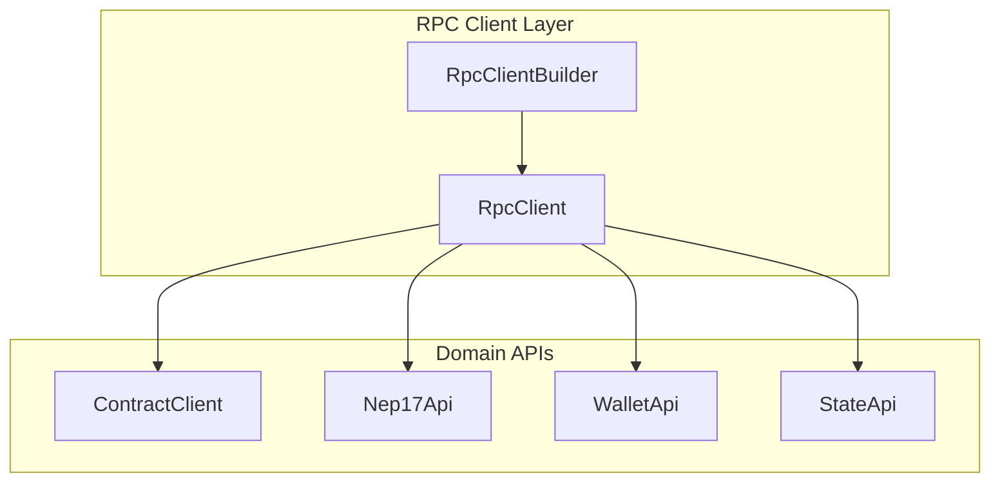
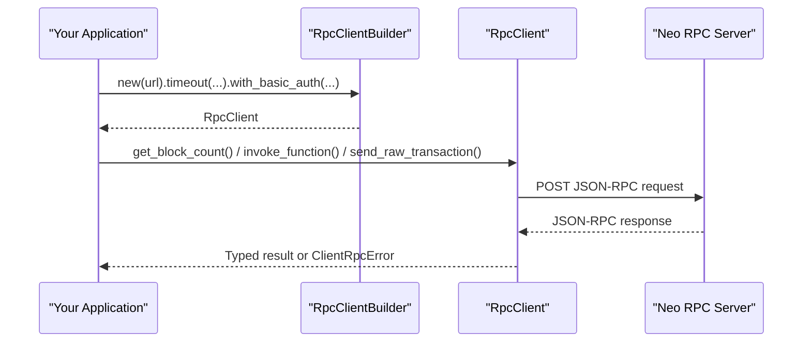
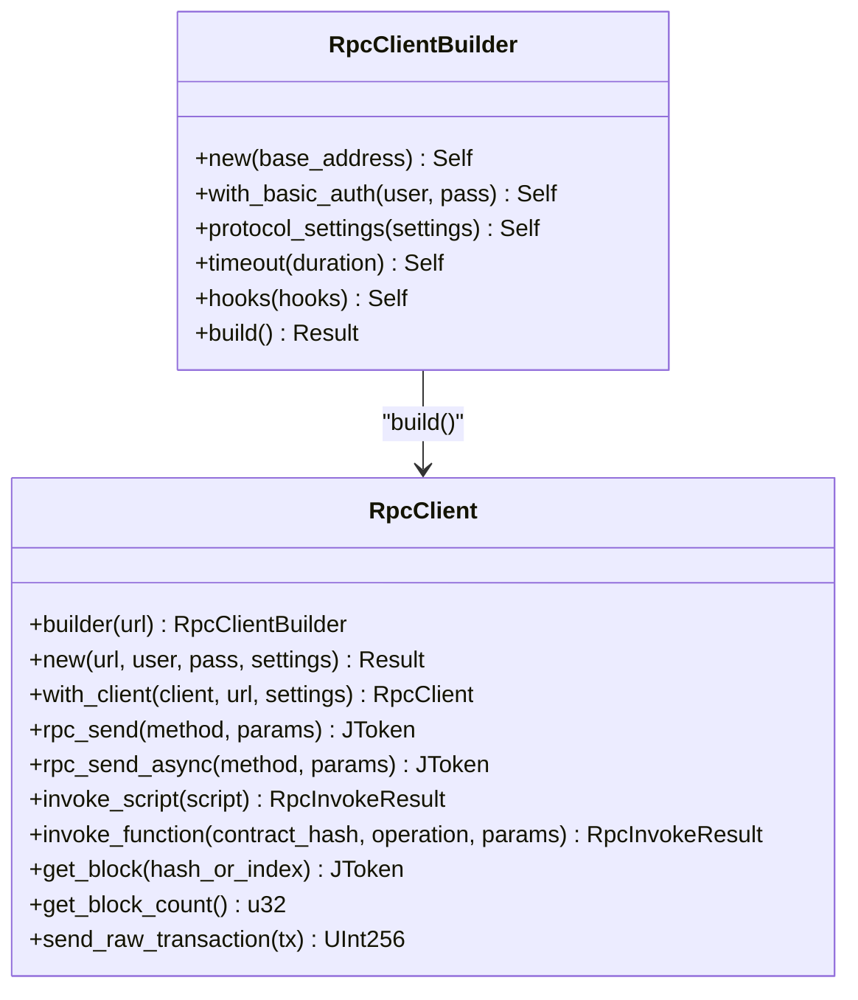
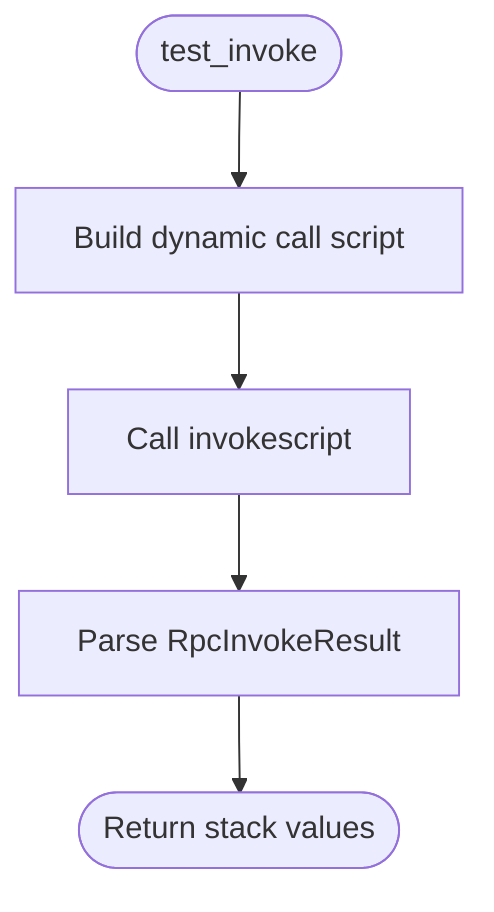
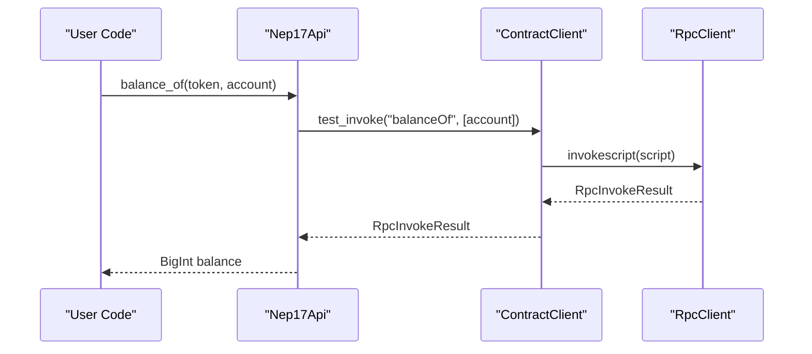
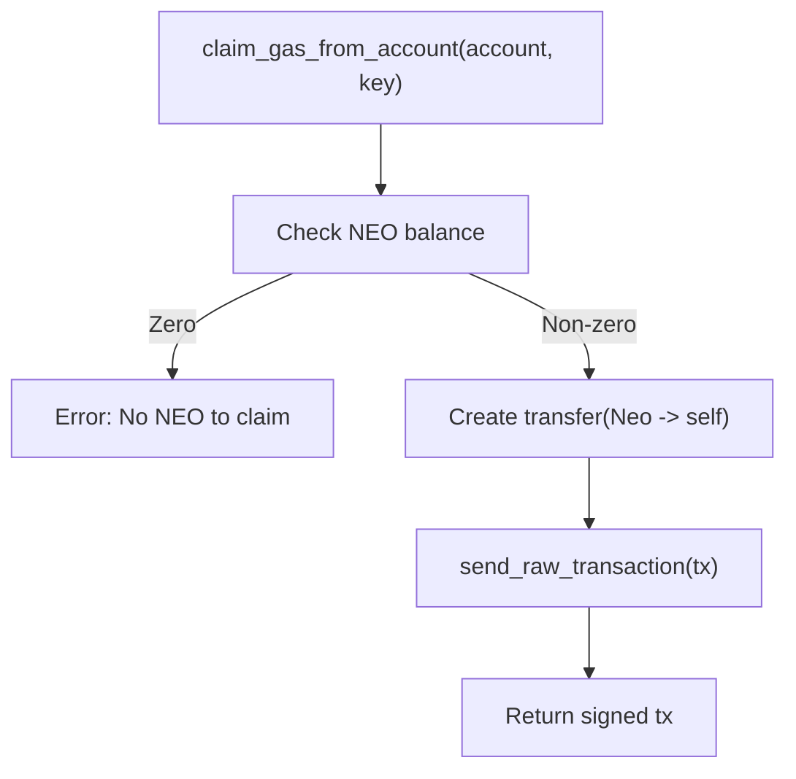
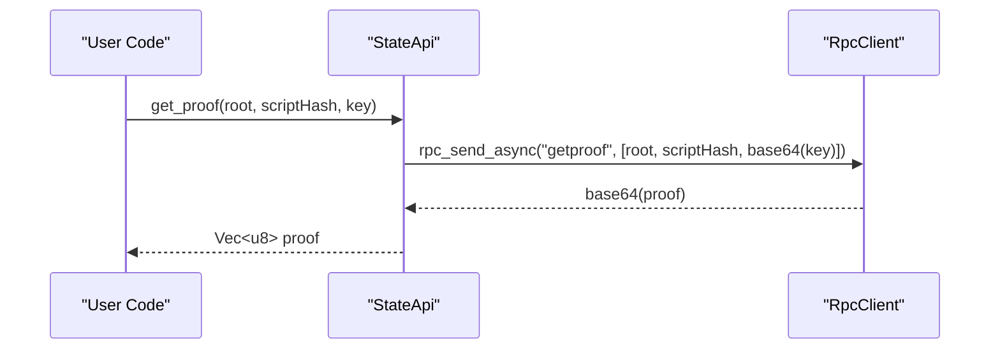
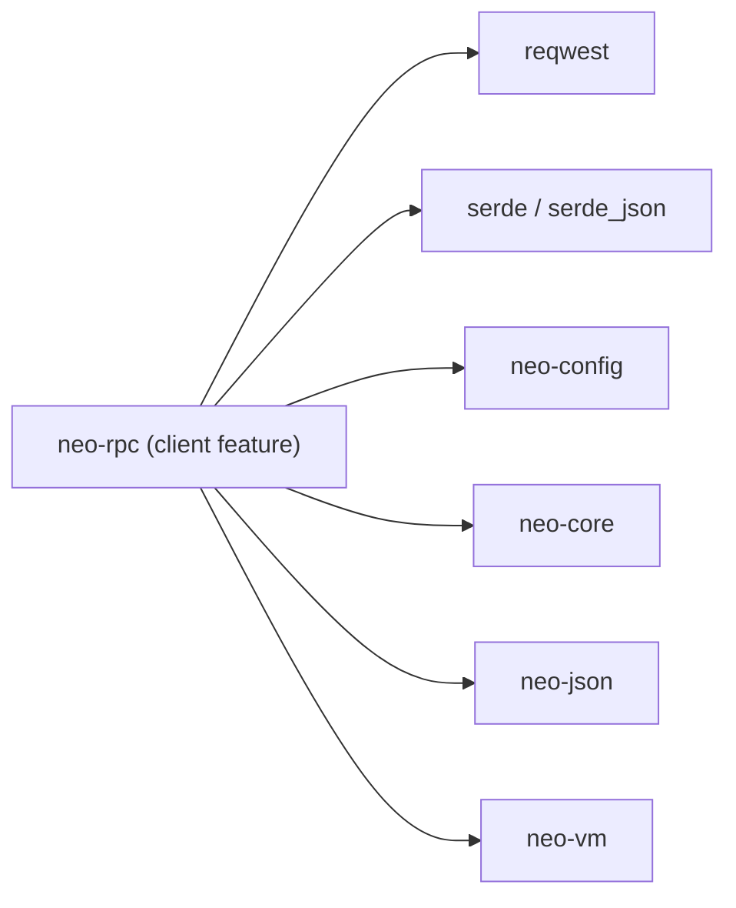

# Client Integration Guide

<cite>
**Referenced Files in This Document**
- [mod.rs](file://neo-rpc/src/client/mod.rs)
- [builder.rs](file://neo-rpc/src/client/rpc_client/builder.rs)
- [client.rs](file://neo-rpc/src/client/rpc_client/client.rs)
- [contract_client.rs](file://neo-rpc/src/client/contract_client.rs)
- [nep17_api.rs](file://neo-rpc/src/client/nep17_api.rs)
- [wallet_api.rs](file://neo-rpc/src/client/wallet_api.rs)
- [state_api.rs](file://neo-rpc/src/client/state_api.rs)
- [error.rs](file://neo-rpc/src/client/error.rs)
- [Cargo.toml](file://neo-rpc/Cargo.toml)
</cite>

## Table of Contents
1. [Introduction](#introduction)
2. [Project Structure](#project-structure)
3. [Core Components](#core-components)
4. [Architecture Overview](#architecture-overview)
5. [Detailed Component Analysis](#detailed-component-analysis)
6. [Dependency Analysis](#dependency-analysis)
7. [Performance Considerations](#performance-considerations)
8. [Troubleshooting Guide](#troubleshooting-guide)
9. [Conclusion](#conclusion)
10. [Appendices](#appendices)

## Introduction
This guide documents how to integrate with the Neo-RS RPC server using the typed Rust client API. It covers RpcClient, RpcClientBuilder, and specialized APIs such as Nep17Api, WalletApi, ContractClient, and StateApi. You will learn how to configure timeouts, handle errors, query blockchain data, invoke contracts, manage wallets, and build production-grade clients with robust connection management and monitoring hooks.

## Project Structure
The client library is organized under neo-rpc/src/client with a clear separation between core transport (RpcClient), builders, and domain-specific APIs:
- Core transport and HTTP layer: RpcClient and RpcClientBuilder
- Domain APIs: ContractClient, Nep17Api, WalletApi, StateApi
- Error modeling and utilities

**Diagram sources**
- [mod.rs:17-41](file://neo-rpc/src/client/mod.rs#L17-L41)
- [client.rs:48-102](file://neo-rpc/src/client/rpc_client/client.rs#L48-L102)
- [builder.rs:22-116](file://neo-rpc/src/client/rpc_client/builder.rs#L22-L116)

**Section sources**
- [mod.rs:12-41](file://neo-rpc/src/client/mod.rs#L12-L41)

## Core Components
- RpcClient: The central HTTP JSON-RPC client that sends requests, parses responses, and exposes typed methods for blockchain queries, contract invocations, and transaction submission.
- RpcClientBuilder: Configures base URL, basic auth, protocol settings, timeout, and request hooks.
- ContractClient: Builds scripts and invokes contracts via test_invoke or deploy operations.
- Nep17Api: High-level NEP-17 token operations (balance, symbol, decimals, total supply, transfers).
- WalletApi: Wallet helpers for NEO/GAS balances, claiming GAS, transfers, and transaction confirmation polling.
- StateApi: State root, proof retrieval, verification, and state queries.

Key configuration options:
- Timeout: Set via builder.timeout(Duration)
- Basic Auth: Set via builder.with_basic_auth(user, pass)
- Protocol Settings: Set via builder.protocol_settings(settings)
- Hooks: Register metrics/logging via builder.hooks(hooks)

Error handling:
- Errors are modeled as ClientRpcError with code, message, and optional data.

**Section sources**
- [client.rs:48-102](file://neo-rpc/src/client/rpc_client/client.rs#L48-L102)
- [builder.rs:22-116](file://neo-rpc/src/client/rpc_client/builder.rs#L22-L116)
- [error.rs:1-77](file://neo-rpc/src/client/error.rs#L1-L77)

## Architecture Overview
The client uses reqwest for HTTP JSON-RPC calls. Requests are serialized into RpcRequest, sent to the node’s RPC endpoint, and parsed into RpcResponse. Domain APIs wrap these primitives to provide strongly-typed operations.

**Diagram sources**
- [client.rs:144-233](file://neo-rpc/src/client/rpc_client/client.rs#L144-L233)
- [builder.rs:87-116](file://neo-rpc/src/client/rpc_client/builder.rs#L87-L116)

## Detailed Component Analysis

### RpcClient and RpcClientBuilder
- Builder supports:
  - Basic authentication headers
  - Protocol settings injection
  - Per-client timeout
  - Hook registration for observability
- Client provides:
  - Low-level rpc_send / rpc_send_async
  - High-level methods for blocks, transactions, mempool, contracts, tokens
  - Script invocation and function invocation
  - Transaction submission and block submission

**Diagram sources**
- [client.rs:48-102](file://neo-rpc/src/client/rpc_client/client.rs#L48-L102)
- [client.rs:211-336](file://neo-rpc/src/client/rpc_client/client.rs#L211-L336)
- [builder.rs:22-116](file://neo-rpc/src/client/rpc_client/builder.rs#L22-L116)

**Section sources**
- [client.rs:144-233](file://neo-rpc/src/client/rpc_client/client.rs#L144-L233)
- [client.rs:278-336](file://neo-rpc/src/client/rpc_client/client.rs#L278-L336)
- [builder.rs:22-116](file://neo-rpc/src/client/rpc_client/builder.rs#L22-L116)

### ContractClient
- test_invoke: Builds a dynamic call script and executes it via invokescript to read contract state without affecting chain.
- create_deploy_contract_tx: Builds a deploy script and returns a signed transaction ready to broadcast.

**Diagram sources**
- [contract_client.rs:39-55](file://neo-rpc/src/client/contract_client.rs#L39-L55)
- [client.rs:278-315](file://neo-rpc/src/client/rpc_client/client.rs#L278-L315)

**Section sources**
- [contract_client.rs:39-108](file://neo-rpc/src/client/contract_client.rs#L39-L108)

### Nep17Api
- Balance, symbol, decimals, total supply via test_invoke on native token contracts.
- Token info aggregation by invoking multiple methods in one script.
- Transfer transaction creation supporting single-signer and multi-signer accounts, with optional assert emission.
- Convenience methods to fetch NEP-17 balances and transfers for an address.

**Diagram sources**
- [nep17_api.rs:51-71](file://neo-rpc/src/client/nep17_api.rs#L51-L71)
- [contract_client.rs:39-55](file://neo-rpc/src/client/contract_client.rs#L39-L55)
- [client.rs:278-315](file://neo-rpc/src/client/rpc_client/client.rs#L278-L315)

**Section sources**
- [nep17_api.rs:27-160](file://neo-rpc/src/client/nep17_api.rs#L27-L160)
- [nep17_api.rs:162-317](file://neo-rpc/src/client/nep17_api.rs#L162-L317)
- [nep17_api.rs:319-426](file://neo-rpc/src/client/nep17_api.rs#L319-L426)

### WalletApi
- Read-only balances: NEO, GAS, unclaimed GAS.
- Claim GAS by sending a self-transfer of NEO to trigger reward distribution.
- Transfer NEP-17 tokens with integer or decimal amounts; supports multi-sig.
- Polling helper to wait for transaction confirmation with adaptive poll interval based on protocol settings.

**Diagram sources**
- [wallet_api.rs:149-189](file://neo-rpc/src/client/wallet_api.rs#L149-L189)
- [client.rs:761-775](file://neo-rpc/src/client/rpc_client/client.rs#L761-L775)

**Section sources**
- [wallet_api.rs:43-112](file://neo-rpc/src/client/wallet_api.rs#L43-L112)
- [wallet_api.rs:114-189](file://neo-rpc/src/client/wallet_api.rs#L114-L189)
- [wallet_api.rs:191-344](file://neo-rpc/src/client/wallet_api.rs#L191-L344)
- [wallet_api.rs:346-412](file://neo-rpc/src/client/wallet_api.rs#L346-L412)

### StateApi
- Get state roots, proofs, and verify proofs.
- Query state values and find states by prefix with pagination.
- Retrieve state height information.

**Diagram sources**
- [state_api.rs:55-76](file://neo-rpc/src/client/state_api.rs#L55-L76)
- [client.rs:221-233](file://neo-rpc/src/client/rpc_client/client.rs#L221-L233)

**Section sources**
- [state_api.rs:20-187](file://neo-rpc/src/client/state_api.rs#L20-L187)

## Dependency Analysis
The client feature enables HTTP-based communication and serialization support. Optional features enable server capabilities.

**Diagram sources**
- [Cargo.toml:119-134](file://neo-rpc/Cargo.toml#L119-L134)

**Section sources**
- [Cargo.toml:119-134](file://neo-rpc/Cargo.toml#L119-L134)

## Performance Considerations
- Connection reuse: Reuse a single RpcClient instance across your application to benefit from HTTP connection pooling provided by reqwest.
- Timeouts: Configure per-request timeouts via builder.timeout to avoid hanging requests.
- Request batching: For multiple reads, prefer invoking a single script that performs multiple operations when possible (e.g., Nep17Api token info aggregation).
- Polling intervals: Use protocol settings to derive sensible poll intervals (as done in wallet confirmation waiting).
- Observability: Use RpcClientHooks to record latency, success/failure rates, and error codes for monitoring.

[No sources needed since this section provides general guidance]

## Troubleshooting Guide
Common issues and strategies:
- Network errors: Inspect ClientRpcError.code and .message; network failures surface as generic errors during HTTP send or body read.
- JSON parsing errors: Invalid response format triggers parse errors; ensure the node is reachable and responding with valid JSON-RPC.
- Missing results: Methods expecting a result return an error if none is present; validate server behavior and parameters.
- Authentication: If using basic auth, ensure credentials are correctly set via builder.with_basic_auth.

Recovery patterns:
- Retry with backoff on transient network errors.
- Log method names and elapsed times via hooks to identify slow endpoints.
- Validate inputs (addresses, hashes) before sending requests.

**Section sources**
- [error.rs:1-77](file://neo-rpc/src/client/error.rs#L1-L77)
- [client.rs:115-142](file://neo-rpc/src/client/rpc_client/client.rs#L115-L142)
- [client.rs:157-209](file://neo-rpc/src/client/rpc_client/client.rs#L157-L209)

## Conclusion
The Neo-RS RPC client provides a robust, typed interface for interacting with Neo nodes. By combining RpcClient and RpcClientBuilder with domain APIs like Nep17Api, WalletApi, ContractClient, and StateApi, you can implement production-grade integrations with strong error handling, configurable timeouts, and observability hooks.

[No sources needed since this section summarizes without analyzing specific files]

## Appendices

### Configuration Options Summary
- Base URL: Provided to builder.new(url)
- Basic Auth: builder.with_basic_auth(user, pass)
- Protocol Settings: builder.protocol_settings(settings)
- Timeout: builder.timeout(Duration)
- Hooks: builder.hooks(RpcClientHooks)

**Section sources**
- [builder.rs:22-116](file://neo-rpc/src/client/rpc_client/builder.rs#L22-L116)

### Multi-language Client Examples (Conceptual)
- HTTP JSON-RPC (cURL):
  - POST to the node’s RPC URL with JSON-RPC payload {"jsonrpc":"2.0","method":"getblockcount","params":[],"id":1}
- WebSocket (conceptual):
  - Connect to the node’s WebSocket endpoint and subscribe to relevant events (e.g., new blocks, transactions) using standard JSON-RPC over WS.

[No sources needed since this section provides conceptual examples]

### Production Best Practices
- Share a single RpcClient instance across threads/tasks to leverage connection pooling.
- Wrap all RPC calls with retry logic for transient failures.
- Instrument with hooks to track latency and error rates.
- Validate addresses and hashes locally to reduce failed requests.
- Use appropriate timeouts and consider circuit breakers for critical paths.

[No sources needed since this section provides general guidance]