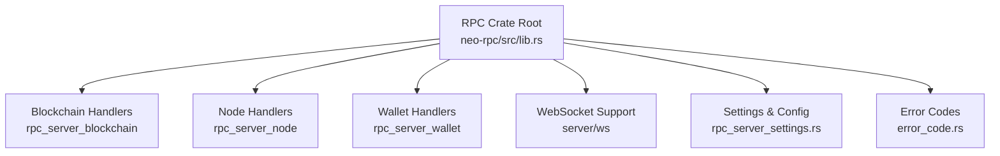
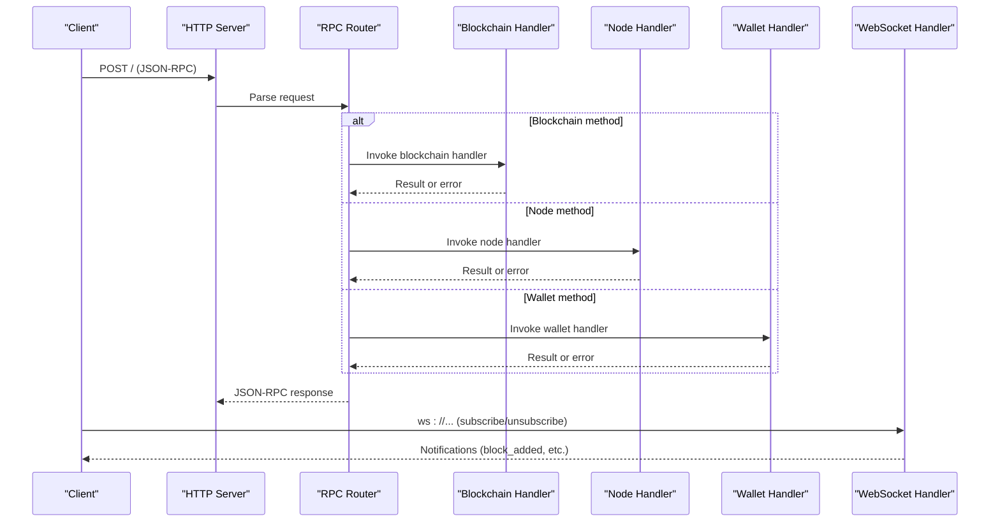
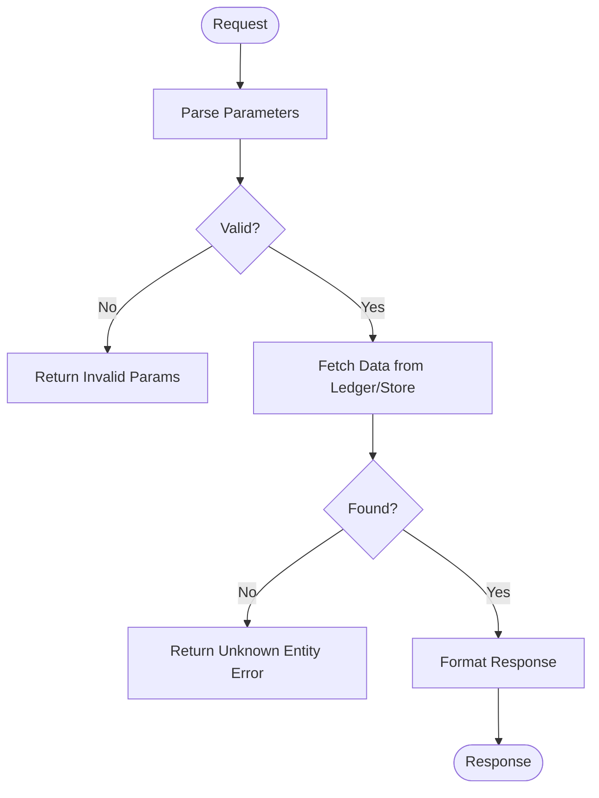
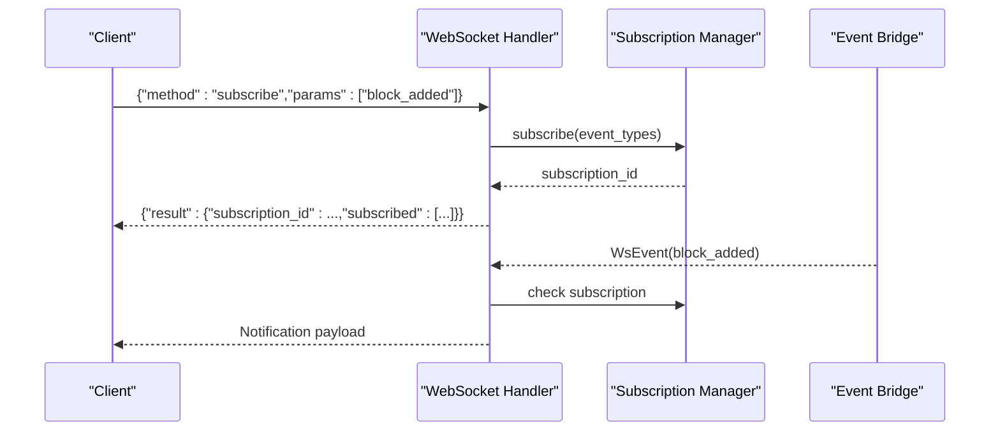
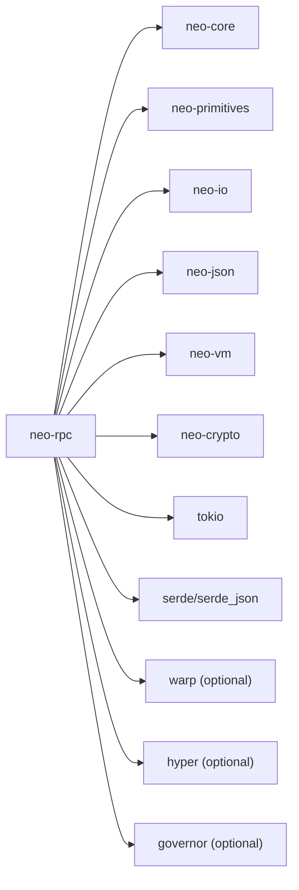

# RPC API Reference

<cite>
**Referenced Files in This Document**
- [lib.rs](file://neo-rpc/src/lib.rs)
- [Cargo.toml](file://neo-rpc/Cargo.toml)
- [rpc_server_blockchain/mod.rs](file://neo-rpc/src/server/rpc_server_blockchain/mod.rs)
- [rpc_server_node/mod.rs](file://neo-rpc/src/server/rpc_server_node/mod.rs)
- [rpc_server_wallet/mod.rs](file://neo-rpc/src/server/rpc_server_wallet/mod.rs)
- [rpc_server_settings.rs](file://neo-rpc/src/server/rpc_server_settings.rs)
- [error_code.rs](file://neo-rpc/src/error_code.rs)
- [ws/mod.rs](file://neo-rpc/src/server/ws/mod.rs)
- [ws/handler.rs](file://neo-rpc/src/server/ws/handler.rs)
- [ws/subscription.rs](file://neo-rpc/src/server/ws/subscription.rs)
</cite>

## Table of Contents
1. [Introduction](#introduction)
2. [Project Structure](#project-structure)
3. [Core Components](#core-components)
4. [Architecture Overview](#architecture-overview)
5. [Detailed Component Analysis](#detailed-component-analysis)
6. [Dependency Analysis](#dependency-analysis)
7. [Performance Considerations](#performance-considerations)
8. [Troubleshooting Guide](#troubleshooting-guide)
9. [Conclusion](#conclusion)
10. [Appendices](#appendices)

## Introduction
This document provides a comprehensive reference for the Neo-RS JSON-RPC server. It covers all available RPC endpoints organized by functional categories, including blockchain queries, node operations, wallet operations, and smart contract interactions. It also documents WebSocket support for real-time event subscriptions, authentication and CORS configuration, rate limiting policies, request validation, error codes, security considerations, and client usage patterns.

The RPC layer exposes standard JSON-RPC 2.0 methods over HTTP and WebSocket transports, with typed request/response models and async/await support. The server supports TLS, per-IP rate limiting, batch size limits, session controls, and configurable method restrictions.

## Project Structure
The RPC implementation is implemented as a crate that provides both server and client functionality. Key modules include:
- Server entrypoints and handler registration
- Category-specific RPC servers (blockchain, node, wallet)
- WebSocket event subscription handling
- Configuration and settings
- Error code definitions

**Diagram sources**
- [lib.rs:1-241](file://neo-rpc/src/lib.rs#L1-L241)
- [rpc_server_blockchain/mod.rs:1-800](file://neo-rpc/src/server/rpc_server_blockchain/mod.rs#L1-L800)
- [rpc_server_node/mod.rs:1-271](file://neo-rpc/src/server/rpc_server_node/mod.rs#L1-L271)
- [rpc_server_wallet/mod.rs:1-800](file://neo-rpc/src/server/rpc_server_wallet/mod.rs#L1-L800)
- [ws/mod.rs:1-18](file://neo-rpc/src/server/ws/mod.rs#L1-L18)
- [rpc_server_settings.rs:1-517](file://neo-rpc/src/server/rpc_server_settings.rs#L1-L517)
- [error_code.rs:1-209](file://neo-rpc/src/error_code.rs#L1-L209)

**Section sources**
- [lib.rs:1-241](file://neo-rpc/src/lib.rs#L1-L241)
- [Cargo.toml:1-139](file://neo-rpc/Cargo.toml#L1-L139)

## Core Components
- Blockchain RPCs: block and transaction queries, mempool, storage, native contracts, validators, committee.
- Node RPCs: connection count, peers, version info, raw transaction submission, block submission.
- Wallet RPCs: wallet lifecycle, address management, balances, transfers, fee calculation, cancellation.
- Smart Contract RPCs: invoke function/script, get contract state, list native contracts.
- WebSocket Subscriptions: block_added, transaction_added, transaction_removed, notification events.
- Settings: bind address, port, TLS, CORS, rate limiting, max batch size, sessions, disabled methods, gas limits.
- Errors: standardized JSON-RPC and Neo-specific error codes.

**Section sources**
- [lib.rs:56-199](file://neo-rpc/src/lib.rs#L56-L199)
- [rpc_server_blockchain/mod.rs:35-56](file://neo-rpc/src/server/rpc_server_blockchain/mod.rs#L35-L56)
- [rpc_server_node/mod.rs:28-37](file://neo-rpc/src/server/rpc_server_node/mod.rs#L28-L37)
- [rpc_server_wallet/mod.rs:56-80](file://neo-rpc/src/server/rpc_server_wallet/mod.rs#L56-L80)
- [ws/mod.rs:1-18](file://neo-rpc/src/server/ws/mod.rs#L1-L18)
- [rpc_server_settings.rs:35-146](file://neo-rpc/src/server/rpc_server_settings.rs#L35-L146)
- [error_code.rs:64-140](file://neo-rpc/src/error_code.rs#L64-L140)

## Architecture Overview
The RPC server registers handlers per category and routes requests to appropriate implementations. WebSocket connections are handled via a dedicated handler that manages subscriptions and forwards events from an event bridge.

**Diagram sources**
- [rpc_server_blockchain/mod.rs:35-56](file://neo-rpc/src/server/rpc_server_blockchain/mod.rs#L35-L56)
- [rpc_server_node/mod.rs:28-37](file://neo-rpc/src/server/rpc_server_node/mod.rs#L28-L37)
- [rpc_server_wallet/mod.rs:56-80](file://neo-rpc/src/server/rpc_server_wallet/mod.rs#L56-L80)
- [ws/handler.rs:207-251](file://neo-rpc/src/server/ws/handler.rs#L207-L251)

## Detailed Component Analysis

### Blockchain Queries
Available methods:
- getbestblockhash
- getblockcount
- getblockheadercount
- getblockhash
- getblock
- getblockheader
- getblocksysfee
- getrawmempool
- getrawtransaction
- getcontractstate
- getstorage
- findstorage
- getnativecontracts
- getnextblockvalidators
- getcandidates
- gettransactionheight
- getcommittee

Common parameters and behaviors:
- Block identifiers accept hash or index where applicable; verbose flags return structured JSON instead of base64 payloads.
- Storage keys and prefixes are Base64-encoded; pagination supported via start index and page size configured by settings.
- Mempool listing can include unverified transactions based on boolean parameter.
- Validators and candidates queries use snapshot-based reads from native contracts.

Validation rules:
- Numeric parameters validated for range and type.
- Hash strings parsed and validated; invalid formats produce invalid params errors.
- Base64 decoding errors mapped to invalid params with descriptive data.

Error handling:
- Unknown block/transaction/contract/storage items map to specific Neo error codes.
- Internal errors wrapped and returned with context.

**Diagram sources**
- [rpc_server_blockchain/mod.rs:92-128](file://neo-rpc/src/server/rpc_server_blockchain/mod.rs#L92-L128)
- [rpc_server_blockchain/mod.rs:228-282](file://neo-rpc/src/server/rpc_server_blockchain/mod.rs#L228-L282)
- [rpc_server_blockchain/mod.rs:292-380](file://neo-rpc/src/server/rpc_server_blockchain/mod.rs#L292-L380)

**Section sources**
- [rpc_server_blockchain/mod.rs:35-56](file://neo-rpc/src/server/rpc_server_blockchain/mod.rs#L35-L56)
- [rpc_server_blockchain/mod.rs:58-502](file://neo-rpc/src/server/rpc_server_blockchain/mod.rs#L58-L502)
- [rpc_server_blockchain/mod.rs:504-800](file://neo-rpc/src/server/rpc_server_blockchain/mod.rs#L504-L800)

### Node Operations
Available methods:
- getconnectioncount
- getpeers
- getversion
- sendrawtransaction
- submitblock

Behavior:
- Connection and peer information retrieved from local node service.
- Version returns protocol and RPC settings, including hardfork heights.
- Raw transaction and block submissions relayed through internal actors with pre-verification and queueing.

Validation:
- Transaction and block payloads must be valid serialized forms; invalid payloads return invalid params.

**Section sources**
- [rpc_server_node/mod.rs:28-37](file://neo-rpc/src/server/rpc_server_node/mod.rs#L28-L37)
- [rpc_server_node/mod.rs:39-216](file://neo-rpc/src/server/rpc_server_node/mod.rs#L39-L216)

### Wallet Operations
Available methods:
- openwallet
- closewallet
- dumpprivkey
- getnewaddress
- getwalletbalance
- getwalletunclaimedgas
- importprivkey
- listaddress
- calculatenetworkfee
- sendfrom
- sendtoaddress
- sendmany
- canceltransaction

Security and access:
- Wallet methods are marked protected; require an opened wallet instance.
- Path resolution for openwallet is jailed to a configured directory to prevent traversal.
- Authentication via basic auth is enforced when configured; otherwise, wallet methods remain protected by wallet state.

Validation:
- Addresses and hashes parsed and validated against network settings.
- Amounts parsed with asset decimals; negative amounts rejected.
- Signers arrays validated; missing signers produce specific errors.

Transfer flow:
- Transfers built using helper functions, signed if possible, then relayed.
- Fee calculation uses wallet-aware logic and configured max gas invocation.

Cancellation:
- Conflicts attribute used to mark original transaction; optional extra fee bump supported.

**Section sources**
- [rpc_server_wallet/mod.rs:56-80](file://neo-rpc/src/server/rpc_server_wallet/mod.rs#L56-L80)
- [rpc_server_wallet/mod.rs:82-245](file://neo-rpc/src/server/rpc_server_wallet/mod.rs#L82-L245)
- [rpc_server_wallet/mod.rs:286-465](file://neo-rpc/src/server/rpc_server_wallet/mod.rs#L286-L465)
- [rpc_server_wallet/mod.rs:467-800](file://neo-rpc/src/server/rpc_server_wallet/mod.rs#L467-L800)

### Smart Contract Interactions
Available methods:
- invokefunction
- invokescript
- getcontractstate
- getnativecontracts

Behavior:
- Read-only invocations executed with restricted call flags; results returned without broadcasting.
- Contract state retrieval supports name, hash, or id identifiers.
- Native contracts listed with current state and metadata.

**Section sources**
- [lib.rs:81-89](file://neo-rpc/src/lib.rs#L81-L89)
- [rpc_server_blockchain/mod.rs:284-407](file://neo-rpc/src/server/rpc_server_blockchain/mod.rs#L284-L407)

### WebSocket Real-Time Events
Supported event types:
- block_added
- transaction_added
- transaction_removed
- notification

Subscription workflow:
- Clients connect via WebSocket and send subscribe/unsubscribe messages.
- Subscription manager tracks active subscriptions per connection.
- Event bridge forwards matching events to subscribed clients.

Validation:
- Subscribe requires at least one valid event type; invalid inputs return invalid params.
- Unsubscribe accepts event names or subscription IDs; partial unsubscribes supported.

**Diagram sources**
- [ws/handler.rs:207-251](file://neo-rpc/src/server/ws/handler.rs#L207-L251)
- [ws/subscription.rs:91-137](file://neo-rpc/src/server/ws/subscription.rs#L91-L137)

**Section sources**
- [ws/mod.rs:1-18](file://neo-rpc/src/server/ws/mod.rs#L1-L18)
- [ws/handler.rs:207-251](file://neo-rpc/src/server/ws/handler.rs#L207-L251)
- [ws/subscription.rs:91-137](file://neo-rpc/src/server/ws/subscription.rs#L91-L137)

### Authentication and CORS
Authentication:
- Basic authentication supported via rpc_user and rpc_pass configuration fields.
- Protected methods enforce wallet presence; authentication applies when configured.

CORS:
- EnableCors flag controls CORS behavior; default is disabled to avoid exposing wallet RPCs publicly.
- AllowOrigins lists permitted origins when CORS is enabled.

TLS:
- SSL certificate and password fields enable HTTPS/TLS termination.

Rate Limiting:
- MaxRequestsPerSecond and RateLimitBurst configure per-IP throttling.
- Disabled rate limiting on non-loopback addresses triggers warnings.

Batch Size:
- MaxBatchSize limits concurrent JSON-RPC calls per request to prevent amplification attacks.

Session Controls:
- SessionEnabled toggles iterator sessions; SessionExpirationTime sets TTL.
- MaxSessions caps concurrent invoke iterator sessions.

Storage Page Size:
- FindStoragePageSize controls pagination for findstorage results.

Gas Limits:
- MaxGasInvoke and MaxFee cap execution costs for invocations and transfers.

**Section sources**
- [rpc_server_settings.rs:35-146](file://neo-rpc/src/server/rpc_server_settings.rs#L35-L146)
- [rpc_server_settings.rs:148-243](file://neo-rpc/src/server/rpc_server_settings.rs#L148-L243)
- [rpc_server_settings.rs:322-441](file://neo-rpc/src/server/rpc_server_settings.rs#L322-L441)

### Error Codes
Standard JSON-RPC 2.0 codes:
- -32700 Parse error
- -32600 Invalid request
- -32601 Method not found
- -32602 Invalid params
- -32603 Internal error

Neo-specific codes:
- -101 Unknown block
- -102 Unknown contract
- -103 Unknown transaction
- -104 Unknown storage item
- -105 Unknown script container
- -106 Unknown state root
- -107 Unknown session
- -108 Unknown iterator
- -109 Unknown height
- -300 Insufficient funds
- -301 Wallet fee limit exceeded
- -302 No opened wallet
- -303 Invalid wallet password
- -500 Inventory verification failed
- -501 Inventory already exists
- -502 Memory pool capacity reached
- -503 Already in pool
- -504 Insufficient network fee
- -505 Policy check failed
- -506 Invalid size
- -507 Invalid attribute
- -508 Invalid signature
- -509 Invalid transaction script
- -510 Expired transaction
- -511 Insufficient funds for fee
- -512 Invalid verification script
- -600 Access denied
- -700 Session not found
- -701 Oracle not found
- -702 Oracle request not found

**Section sources**
- [error_code.rs:64-140](file://neo-rpc/src/error_code.rs#L64-L140)

## Dependency Analysis
The RPC crate depends on core components for ledger, networking, VM execution, and serialization. Feature flags control inclusion of server/client capabilities and optional integrations like TLS and rate limiting.

**Diagram sources**
- [Cargo.toml:16-80](file://neo-rpc/Cargo.toml#L16-L80)
- [Cargo.toml:87-139](file://neo-rpc/Cargo.toml#L87-L139)

**Section sources**
- [Cargo.toml:16-80](file://neo-rpc/Cargo.toml#L16-L80)
- [Cargo.toml:87-139](file://neo-rpc/Cargo.toml#L87-L139)

## Performance Considerations
- Use verbose=false for compact responses when only payloads are needed.
- Configure findstorage page size appropriately to balance memory and throughput.
- Enable rate limiting on public endpoints to mitigate DoS risks.
- Cap batch sizes to prevent request amplification.
- Monitor max_gas_invoke and max_fee to constrain expensive operations.
- Prefer read-only invocations for querying contract state without broadcasting.

[No sources needed since this section provides general guidance]

## Troubleshooting Guide
Common issues and resolutions:
- Invalid params: Ensure correct parameter types and formats; validate hashes, Base64 keys, and numeric ranges.
- Unknown entity errors: Verify block/transaction/contract identifiers exist at the queried height.
- Wallet errors: Confirm wallet is opened and accessible; check path jail and permissions.
- Relay failures: Check mempool capacity and policy checks; adjust fees if necessary.
- WebSocket disconnects: Reconnect and resubscribe; verify event types requested.

**Section sources**
- [rpc_server_blockchain/mod.rs:92-128](file://neo-rpc/src/server/rpc_server_blockchain/mod.rs#L92-L128)
- [rpc_server_wallet/mod.rs:209-245](file://neo-rpc/src/server/rpc_server_wallet/mod.rs#L209-L245)
- [rpc_server_node/mod.rs:172-216](file://neo-rpc/src/server/rpc_server_node/mod.rs#L172-L216)
- [ws/handler.rs:207-251](file://neo-rpc/src/server/ws/handler.rs#L207-L251)

## Conclusion
The Neo-RS JSON-RPC server provides a robust, configurable interface for interacting with the Neo blockchain. It supports comprehensive blockchain queries, node operations, wallet management, smart contract interactions, and real-time event subscriptions. Security features such as authentication, CORS, TLS, rate limiting, and session controls help protect deployments. Proper configuration and validation ensure reliable operation across diverse environments.

[No sources needed since this section summarizes without analyzing specific files]

## Appendices

### Endpoint Summary by Category

Blockchain
- Methods: getbestblockhash, getblockcount, getblockheadercount, getblockhash, getblock, getblockheader, getblocksysfee, getrawmempool, getrawtransaction, getcontractstate, getstorage, findstorage, getnativecontracts, getnextblockvalidators, getcandidates, gettransactionheight, getcommittee
- Transport: HTTP JSON-RPC
- Notes: Verbose flags return structured JSON; Base64 payloads for compact responses

Node
- Methods: getconnectioncount, getpeers, getversion, sendrawtransaction, submitblock
- Transport: HTTP JSON-RPC
- Notes: Submission methods relay via internal actors

Wallet
- Methods: openwallet, closewallet, dumpprivkey, getnewaddress, getwalletbalance, getwalletunclaimedgas, importprivkey, listaddress, calculatenetworkfee, sendfrom, sendtoaddress, sendmany, canceltransaction
- Transport: HTTP JSON-RPC
- Notes: Protected methods require opened wallet; path jail enforced

Smart Contract
- Methods: invokefunction, invokescript, getcontractstate, getnativecontracts
- Transport: HTTP JSON-RPC
- Notes: Read-only invocations do not broadcast

WebSocket
- Events: block_added, transaction_added, transaction_removed, notification
- Transport: WebSocket JSON-RPC
- Notes: Subscribe/unsubscribe via method calls; notifications pushed to clients

**Section sources**
- [lib.rs:56-199](file://neo-rpc/src/lib.rs#L56-L199)
- [rpc_server_blockchain/mod.rs:35-56](file://neo-rpc/src/server/rpc_server_blockchain/mod.rs#L35-L56)
- [rpc_server_node/mod.rs:28-37](file://neo-rpc/src/server/rpc_server_node/mod.rs#L28-L37)
- [rpc_server_wallet/mod.rs:56-80](file://neo-rpc/src/server/rpc_server_wallet/mod.rs#L56-L80)
- [ws/mod.rs:1-18](file://neo-rpc/src/server/ws/mod.rs#L1-L18)