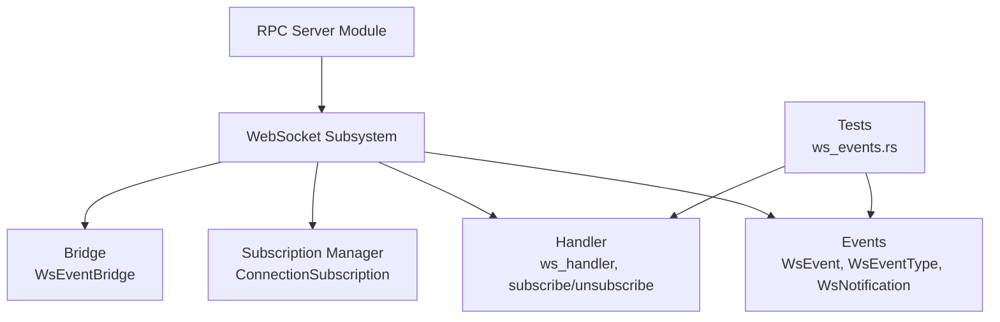
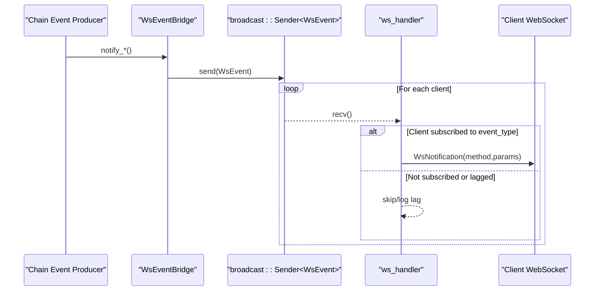
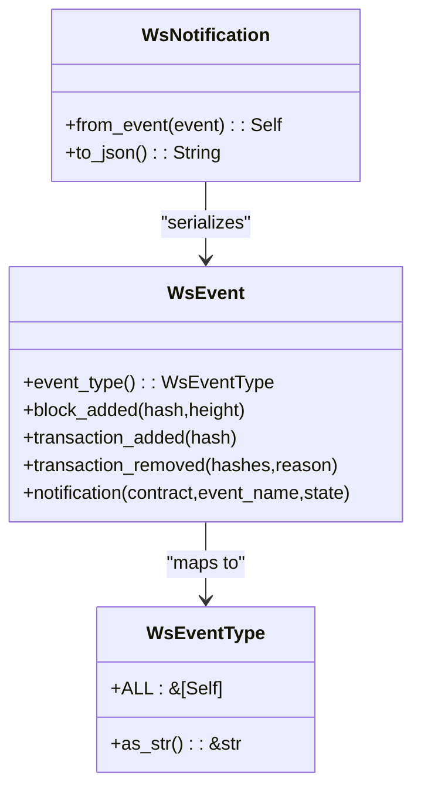
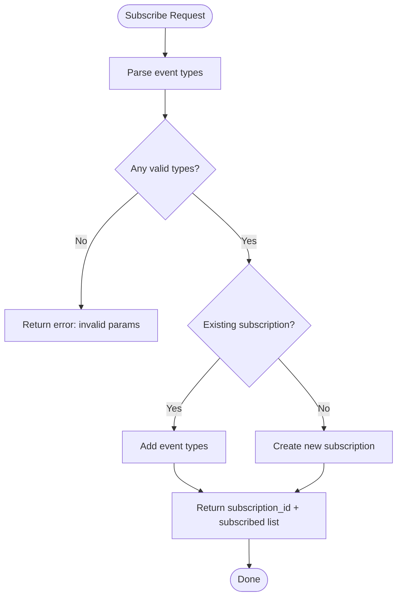
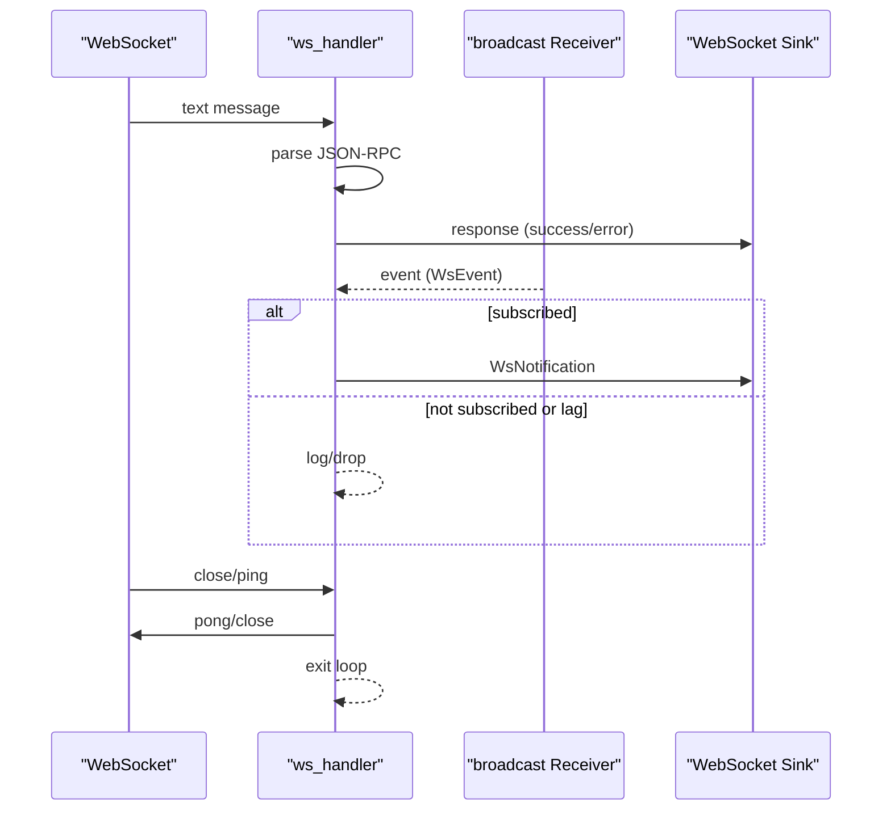
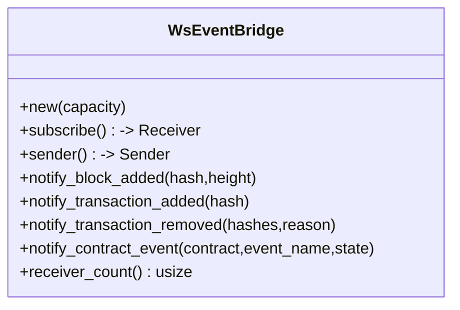
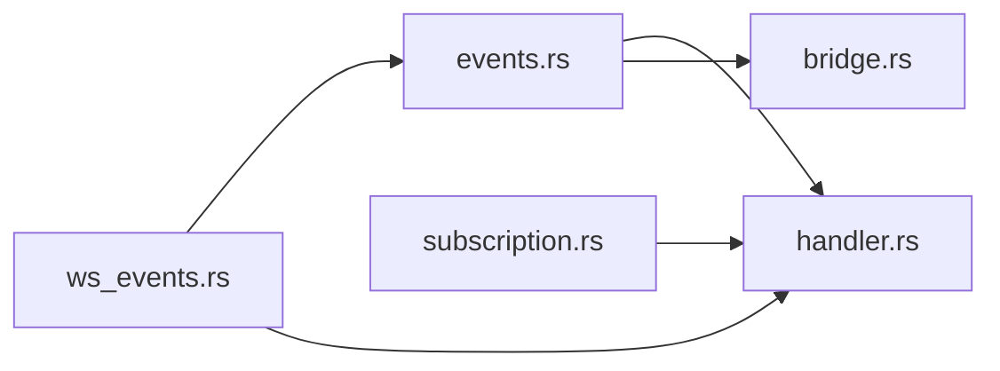

# WebSocket Events & Real-time APIs

<cite>
**Referenced Files in This Document**
- [mod.rs](file://neo-rpc/src/server/ws/mod.rs)
- [events.rs](file://neo-rpc/src/server/ws/events.rs)
- [subscription.rs](file://neo-rpc/src/server/ws/subscription.rs)
- [handler.rs](file://neo-rpc/src/server/ws/handler.rs)
- [bridge.rs](file://neo-rpc/src/server/ws/bridge.rs)
- [ws_events.rs](file://neo-rpc/tests/ws_events.rs)
</cite>

## Table of Contents
1. [Introduction](#introduction)
2. [Project Structure](#project-structure)
3. [Core Components](#core-components)
4. [Architecture Overview](#architecture-overview)
5. [Detailed Component Analysis](#detailed-component-analysis)
6. [Dependency Analysis](#dependency-analysis)
7. [Performance Considerations](#performance-considerations)
8. [Troubleshooting Guide](#troubleshooting-guide)
9. [Conclusion](#conclusion)
10. [Appendices](#appendices)

## Introduction
This document describes the WebSocket event system for real-time Neo blockchain data streaming. It covers connection establishment, subscription management, available event types, message formats, filtering, lifecycle handling, reconnection strategies, and error recovery patterns. It also provides guidance on performance considerations for high-frequency event processing and scaling connections.

## Project Structure
The WebSocket subsystem is implemented under the RPC server module and consists of:
- Event type definitions and serialization
- Subscription management per connection
- JSON-RPC request handling over WebSocket
- Event bridge to publish chain events to subscribers
- Tests validating wire format and behavior

**Diagram sources**
- [mod.rs:1-18](file://neo-rpc/src/server/ws/mod.rs#L1-L18)
- [events.rs:1-247](file://neo-rpc/src/server/ws/events.rs#L1-L247)
- [subscription.rs:1-138](file://neo-rpc/src/server/ws/subscription.rs#L1-L138)
- [handler.rs:1-512](file://neo-rpc/src/server/ws/handler.rs#L1-L512)
- [bridge.rs:1-142](file://neo-rpc/src/server/ws/bridge.rs#L1-L142)
- [ws_events.rs:1-89](file://neo-rpc/tests/ws_events.rs#L1-L89)

**Section sources**
- [mod.rs:1-18](file://neo-rpc/src/server/ws/mod.rs#L1-L18)

## Core Components
- Event types and payloads:
  - WsEventType enumerates supported event channels: block_added, transaction_added, transaction_removed, notification.
  - WsEvent defines typed payloads for each event with consistent hash formatting (0x-prefixed hex).
  - WsNotification serializes events into JSON-RPC 2.0 notifications with method and params.
- Subscription management:
  - SubscriptionManager allocates unique IDs and creates ConnectionSubscription instances per connection.
  - ConnectionSubscription tracks subscribed event types and supports add/remove operations.
- Handler:
  - ws_handler manages a single WebSocket connection, processes JSON-RPC requests (subscribe/unsubscribe), and forwards matching events from a broadcast channel.
- Bridge:
  - WsEventBridge publishes chain events to all connected clients via a broadcast channel and exposes helper methods for common events.

**Section sources**
- [events.rs:8-119](file://neo-rpc/src/server/ws/events.rs#L8-L119)
- [events.rs:170-216](file://neo-rpc/src/server/ws/events.rs#L170-L216)
- [subscription.rs:7-89](file://neo-rpc/src/server/ws/subscription.rs#L7-L89)
- [handler.rs:12-164](file://neo-rpc/src/server/ws/handler.rs#L12-L164)
- [bridge.rs:12-95](file://neo-rpc/src/server/ws/bridge.rs#L12-L95)

## Architecture Overview
The WebSocket architecture connects external event producers to multiple clients through a broadcast channel and per-connection subscriptions.

**Diagram sources**
- [bridge.rs:21-85](file://neo-rpc/src/server/ws/bridge.rs#L21-L85)
- [handler.rs:73-164](file://neo-rpc/src/server/ws/handler.rs#L73-L164)
- [events.rs:170-216](file://neo-rpc/src/server/ws/events.rs#L170-L216)

## Detailed Component Analysis

### Event Types and Message Formats
- Supported event types:
  - block_added: includes hash and height
  - transaction_added: includes hash
  - transaction_removed: includes hashes array and reason
  - notification: includes contract, eventname, state
- All hashes are serialized as 0x-prefixed hex strings.
- Notifications use JSON-RPC 2.0 structure with method set to the event type string and params containing event-specific fields.

**Diagram sources**
- [events.rs:8-80](file://neo-rpc/src/server/ws/events.rs#L8-L80)
- [events.rs:86-168](file://neo-rpc/src/server/ws/events.rs#L86-L168)
- [events.rs:170-216](file://neo-rpc/src/server/ws/events.rs#L170-L216)

**Section sources**
- [events.rs:8-119](file://neo-rpc/src/server/ws/events.rs#L8-L119)
- [events.rs:170-216](file://neo-rpc/src/server/ws/events.rs#L170-L216)
- [ws_events.rs:6-22](file://neo-rpc/tests/ws_events.rs#L6-L22)
- [ws_events.rs:24-56](file://neo-rpc/tests/ws_events.rs#L24-L56)
- [ws_events.rs:58-89](file://neo-rpc/tests/ws_events.rs#L58-L89)

### Subscription Management
- Each connection maintains a ConnectionSubscription that tracks which event types it receives.
- SubscriptionManager assigns monotonically increasing IDs and supports adding/removing event types.
- Unsubscribe can remove specific event types or clear the entire subscription by passing the subscription ID.

**Diagram sources**
- [handler.rs:207-252](file://neo-rpc/src/server/ws/handler.rs#L207-L252)
- [subscription.rs:16-89](file://neo-rpc/src/server/ws/subscription.rs#L16-L89)

**Section sources**
- [subscription.rs:7-89](file://neo-rpc/src/server/ws/subscription.rs#L7-L89)
- [handler.rs:207-252](file://neo-rpc/src/server/ws/handler.rs#L207-L252)

### WebSocket Handler and Lifecycle
- The handler splits the WebSocket into read/write halves and runs a select loop:
  - Reads incoming messages, parses JSON-RPC requests, and responds with success or error.
  - Listens to the broadcast channel for events and forwards matching ones to the client.
  - Handles ping/pong and close frames; logs errors and disconnects gracefully.
- Lag handling: if a client falls behind, the handler logs the lag and continues without dropping the connection.

**Diagram sources**
- [handler.rs:73-164](file://neo-rpc/src/server/ws/handler.rs#L73-L164)

**Section sources**
- [handler.rs:73-164](file://neo-rpc/src/server/ws/handler.rs#L73-L164)

### Event Bridge
- WsEventBridge wraps a broadcast channel and exposes convenience methods to publish:
  - Block added
  - Transaction added
  - Transaction removed
  - Contract notification
- It reports receiver count for monitoring and logs when there are no subscribers.

**Diagram sources**
- [bridge.rs:12-95](file://neo-rpc/src/server/ws/bridge.rs#L12-L95)

**Section sources**
- [bridge.rs:12-95](file://neo-rpc/src/server/ws/bridge.rs#L12-L95)

## Dependency Analysis
- The handler depends on:
  - events for WsEvent/WsEventType/WsNotification
  - subscription for ConnectionSubscription/SubscriptionManager
  - tokio::sync::broadcast for event distribution
- The bridge depends on:
  - events for constructing WsEvent
  - tokio::sync::broadcast for publishing
- Tests validate wire names, field names, and hash prefixing.

**Diagram sources**
- [events.rs:1-247](file://neo-rpc/src/server/ws/events.rs#L1-L247)
- [subscription.rs:1-138](file://neo-rpc/src/server/ws/subscription.rs#L1-L138)
- [handler.rs:1-512](file://neo-rpc/src/server/ws/handler.rs#L1-L512)
- [bridge.rs:1-142](file://neo-rpc/src/server/ws/bridge.rs#L1-L142)
- [ws_events.rs:1-89](file://neo-rpc/tests/ws_events.rs#L1-L89)

**Section sources**
- [mod.rs:1-18](file://neo-rpc/src/server/ws/mod.rs#L1-L18)

## Performance Considerations
- Broadcast channel capacity:
  - Configure bridge capacity to balance memory usage vs. risk of lagging clients dropping events.
- Lag handling:
  - Clients may lag; the handler logs lag and continues. Ensure consumers process events promptly to avoid accumulation.
- Filtering at source:
  - Subscribe only to needed event types to reduce payload size and processing overhead.
- Concurrency:
  - Each connection runs independently; scale horizontally by running multiple node instances behind a load balancer if necessary.
- Serialization:
  - Keep notification payloads minimal; avoid large states in notifications where possible.

[No sources needed since this section provides general guidance]

## Troubleshooting Guide
Common issues and resolutions:
- Invalid JSON-RPC version:
  - Ensure jsonrpc field equals "2.0".
- Method not found:
  - Only "subscribe" and "unsubscribe" are supported over WebSocket.
- Invalid parameters:
  - Provide valid event type strings for subscribe; ensure unsubscribe uses either a subscription id or valid event types.
- No active subscription:
  - Call subscribe before attempting unsubscribe.
- Lag warnings:
  - If you see lag warnings, optimize your consumer pipeline or increase buffer capacity.

**Section sources**
- [handler.rs:166-184](file://neo-rpc/src/server/ws/handler.rs#L166-L184)
- [handler.rs:207-252](file://neo-rpc/src/server/ws/handler.rs#L207-L252)
- [handler.rs:254-319](file://neo-rpc/src/server/ws/handler.rs#L254-L319)
- [handler.rs:146-154](file://neo-rpc/src/server/ws/handler.rs#L146-L154)

## Conclusion
The WebSocket subsystem provides a robust, JSON-RPC 2.0-compliant interface for subscribing to real-time Neo blockchain events. It supports fine-grained filtering, efficient broadcasting, and resilient handling of client lag and disconnections. By configuring appropriate capacities and subscribing selectively, applications can achieve scalable, low-latency event streaming.

[No sources needed since this section summarizes without analyzing specific files]

## Appendices

### API Reference: WebSocket Methods
- subscribe(params: [string...])
  - Parameters: one or more of "block_added", "transaction_added", "transaction_removed", "notification"
  - Response: { subscription_id: number, subscribed: string[] }
- unsubscribe(params?: [number|string|...])
  - Options:
    - Pass subscription_id to clear the entire subscription
    - Pass event type strings to remove specific events
    - Omit params to clear all events
  - Response: { unsubscribed: true } | { unsubscribed: string[], remaining: string[] }

**Section sources**
- [handler.rs:207-252](file://neo-rpc/src/server/ws/handler.rs#L207-L252)
- [handler.rs:254-319](file://neo-rpc/src/server/ws/handler.rs#L254-L319)

### Event Payloads
- block_added: { hash: string, height: number }
- transaction_added: { hash: string }
- transaction_removed: { hashes: string[], reason: string }
- notification: { contract: string, eventname: string, state: any }

All hash fields are 0x-prefixed hex strings.

**Section sources**
- [events.rs:86-119](file://neo-rpc/src/server/ws/events.rs#L86-L119)
- [events.rs:170-216](file://neo-rpc/src/server/ws/events.rs#L170-L216)
- [ws_events.rs:24-56](file://neo-rpc/tests/ws_events.rs#L24-L56)
- [ws_events.rs:58-89](file://neo-rpc/tests/ws_events.rs#L58-L89)

### Client Implementation Examples
Below are conceptual steps for implementing clients in multiple languages. Replace placeholders with actual values and adapt to your language’s WebSocket library.

- Python (websockets)
  - Connect to the WebSocket endpoint
  - Send subscribe request with desired event types
  - Loop to receive notifications and parse JSON
  - Handle reconnect on disconnect with exponential backoff
  - Close the session on shutdown

- JavaScript (browser or Node)
  - Establish WebSocket connection
  - On open, send subscribe with event types
  - On message, parse JSON and dispatch by method
  - Implement retry logic on close with jittered backoff
  - Clean up listeners on page unload or process exit

- Rust (tokio-tungstenite or async-websocket)
  - Open WebSocket stream
  - Serialize subscribe request using serde_json
  - Read messages asynchronously and deserialize into WsNotification
  - Use tokio tasks to fan out event processing
  - Gracefully drop the stream on shutdown

- Go (gorilla/websocket)
  - Dial the WebSocket URL
  - Write subscribe message as JSON
  - Read loop to handle incoming notifications
  - Implement reconnection with context cancellation
  - Close the connection on signal or timeout

[No sources needed since this section provides general guidance]

### Reconnection Strategy
- Detect connection close and attempt reconnect with exponential backoff capped at a maximum delay.
- On reconnect, resend subscribe requests to restore subscriptions.
- Monitor lag metrics; if persistent lag occurs, consider reducing event scope or scaling consumers.

[No sources needed since this section provides general guidance]

### Error Recovery Patterns
- Parse errors: return JSON-RPC parse error responses; do not terminate the connection.
- Unknown methods: respond with method-not-found error.
- Invalid parameters: respond with parameter validation errors.
- Channel closed: log and exit the handler loop cleanly.

**Section sources**
- [handler.rs:102-108](file://neo-rpc/src/server/ws/handler.rs#L102-L108)
- [handler.rs:176-184](file://neo-rpc/src/server/ws/handler.rs#L176-L184)
- [handler.rs:218-224](file://neo-rpc/src/server/ws/handler.rs#L218-L224)
- [handler.rs:150-154](file://neo-rpc/src/server/ws/handler.rs#L150-L154)