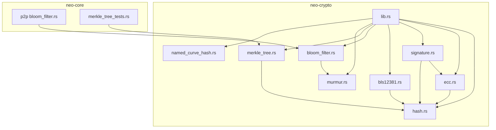
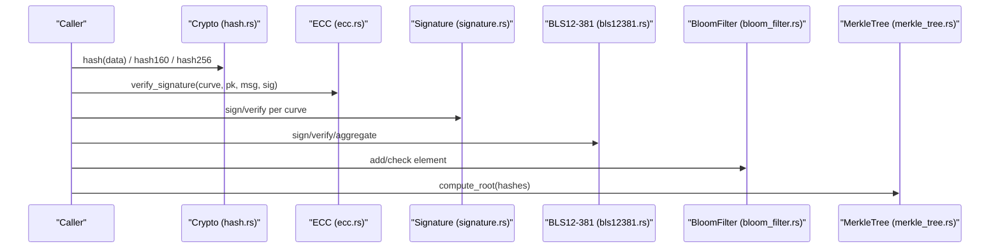
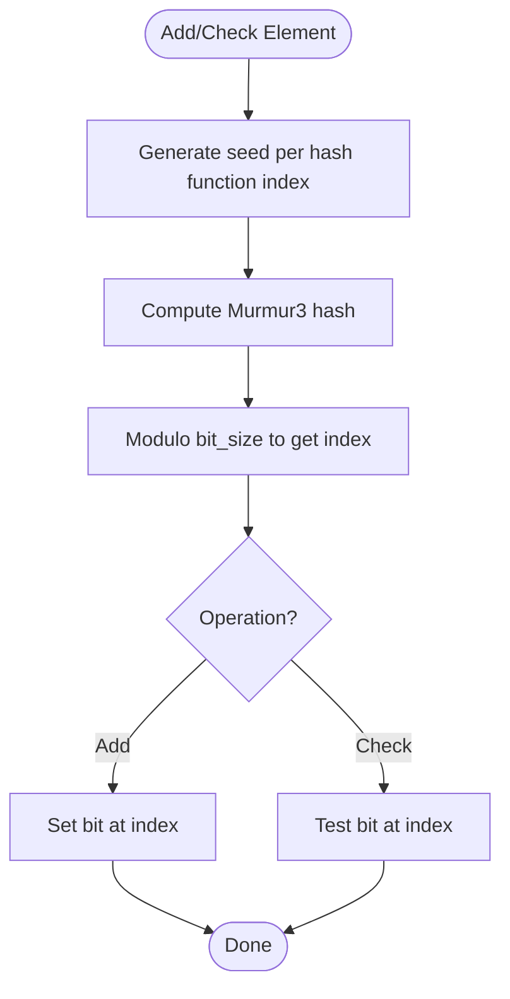
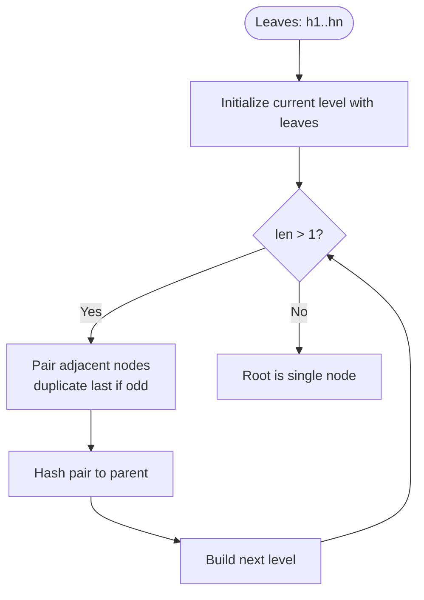
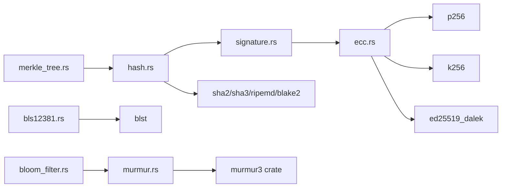

# Cryptographic Primitives

<cite>
**Referenced Files in This Document**
- [lib.rs](file://neo-crypto/src/lib.rs)
- [hash.rs](file://neo-crypto/src/hash.rs)
- [ecc.rs](file://neo-crypto/src/ecc.rs)
- [signature.rs](file://neo-crypto/src/signature.rs)
- [bls12381.rs](file://neo-crypto/src/bls12381.rs)
- [bloom_filter.rs](file://neo-crypto/src/bloom_filter.rs)
- [merkle_tree.rs](file://neo-crypto/src/merkle_tree.rs)
- [murmur.rs](file://neo-crypto/src/murmur.rs)
- [named_curve_hash.rs](file://neo-crypto/src/named_curve_hash.rs)
- [crypto_utils.rs](file://neo-crypto/src/crypto_utils.rs)
- [bloom_filter_state.rs](file://neo-core/src/network/p2p/remote_node/bloom_filter.rs)
- [merkle_tree_tests.rs](file://neo-core/tests/merkle_tree_tests.rs)
</cite>

## Table of Contents
1. [Introduction](#introduction)
2. [Project Structure](#project-structure)
3. [Core Components](#core-components)
4. [Architecture Overview](#architecture-overview)
5. [Detailed Component Analysis](#detailed-component-analysis)
6. [Dependency Analysis](#dependency-analysis)
7. [Performance Considerations](#performance-considerations)
8. [Troubleshooting Guide](#troubleshooting-guide)
9. [Conclusion](#conclusion)
10. [Appendices](#appendices)

## Introduction
This document explains the cryptographic primitives implemented in Neo-RS and how they are used across the blockchain for hashing, signatures, probabilistic filtering, and data integrity. It covers:
- Hash functions: SHA-256, SHA-512, RIPEMD-160, Keccak-256, Blake2b/Blake2s, plus Neo-specific Hash160 and Hash256.
- Elliptic curve cryptography: secp256r1 (P-256), secp256k1, and Ed25519 with their use cases and compatibility notes.
- BLS12-381 signature aggregation for consensus efficiency.
- Bloom filter implementation for probabilistic set membership testing.
- Merkle tree construction for transaction and block verification.
It also provides performance characteristics, security properties, and compatibility considerations with the C# Neo implementation.

## Project Structure
The cryptographic functionality is primarily implemented in the neo-crypto crate, with usage throughout neo-core and other modules. Key files include:
- Hashing and utilities: hash.rs, murmur.rs, named_curve_hash.rs
- ECC and signatures: ecc.rs, signature.rs
- BLS12-381: bls12381.rs
- Probabilistic structures: bloom_filter.rs
- Integrity structures: merkle_tree.rs
- Re-exports and module index: lib.rs, crypto_utils.rs
- Integration points: p2p bloom filter state and tests

**Diagram sources**
- [lib.rs:38-79](file://neo-crypto/src/lib.rs#L38-L79)
- [hash.rs:16-31](file://neo-crypto/src/hash.rs#L16-L31)
- [ecc.rs:42-51](file://neo-crypto/src/ecc.rs#L42-L51)
- [signature.rs:26-28](file://neo-crypto/src/signature.rs#L26-L28)
- [bls12381.rs:13-19](file://neo-crypto/src/bls12381.rs#L13-L19)
- [bloom_filter.rs:12-17](file://neo-crypto/src/bloom_filter.rs#L12-L17)
- [merkle_tree.rs:31-36](file://neo-crypto/src/merkle_tree.rs#L31-L36)
- [murmur.rs:1-18](file://neo-crypto/src/murmur.rs#L1-L18)
- [named_curve_hash.rs:7-20](file://neo-crypto/src/named_curve_hash.rs#L7-L20)

**Section sources**
- [lib.rs:38-79](file://neo-crypto/src/lib.rs#L38-L79)

## Core Components
- Hashing: Crypto enum and methods provide SHA-256, SHA-512, Keccak-256, RIPEMD-160, Blake2b/s, plus Hash160 and Hash256. Includes constant-time comparison helpers to prevent timing attacks.
- ECC: ECPoint and ECCurve represent public keys and supported curves (secp256r1, secp256k1, Ed25519). Includes on-curve validation, compression, and signature verification.
- Signatures: Curve-specific signing and verification APIs, including prehash variants and NeoFS compatibility.
- BLS12-381: Minimal-signature-size scheme with domain separation tag matching C# Neo; supports key derivation, signing, verification, and aggregation for consensus.
- Bloom Filter: Probabilistic set membership using Murmur3 with configurable bit size, number of hash functions, and tweak value.
- Merkle Tree: Efficient root computation and optional tree structure for trimming based on bloom-filter flags.

**Section sources**
- [hash.rs:16-31](file://neo-crypto/src/hash.rs#L16-L31)
- [hash.rs:84-301](file://neo-crypto/src/hash.rs#L84-L301)
- [hash.rs:304-351](file://neo-crypto/src/hash.rs#L304-L351)
- [ecc.rs:42-51](file://neo-crypto/src/ecc.rs#L42-L51)
- [ecc.rs:91-108](file://neo-crypto/src/ecc.rs#L91-L108)
- [signature.rs:26-28](file://neo-crypto/src/signature.rs#L26-L28)
- [bls12381.rs:13-19](file://neo-crypto/src/bls12381.rs#L13-L19)
- [bloom_filter.rs:12-17](file://neo-crypto/src/bloom_filter.rs#L12-L17)
- [merkle_tree.rs:31-36](file://neo-crypto/src/merkle_tree.rs#L31-L36)

## Architecture Overview
Neo-RS organizes cryptographic primitives into a cohesive library that is reused by higher-level components such as networking and core protocol logic. The architecture emphasizes correctness, compatibility with C# Neo, and performance.

**Diagram sources**
- [hash.rs:84-301](file://neo-crypto/src/hash.rs#L84-L301)
- [ecc.rs:597-662](file://neo-crypto/src/ecc.rs#L597-L662)
- [signature.rs:370-438](file://neo-crypto/src/signature.rs#L370-L438)
- [bls12381.rs:90-198](file://neo-crypto/src/bls12381.rs#L90-L198)
- [bloom_filter.rs:57-75](file://neo-crypto/src/bloom_filter.rs#L57-L75)
- [merkle_tree.rs:87-117](file://neo-crypto/src/merkle_tree.rs#L87-L117)

## Detailed Component Analysis

### Hash Functions
- Supported algorithms: SHA-256, SHA-512, Keccak-256, RIPEMD-160, Blake2b, Blake2s.
- Neo-specific convenience:
  - Hash160 = RIPEMD160(SHA256(data))
  - Hash256 = SHA256(SHA256(data))
- Streaming support via Sha256Hasher for incremental updates.
- Constant-time equality helpers to avoid timing side-channels.

Security and compatibility:
- All hashes use well-tested crates and match expected outputs.
- Constant-time comparisons recommended for sensitive contexts.

Usage examples (by reference):
- Compute SHA-256: see [hash.rs:99-104](file://neo-crypto/src/hash.rs#L99-L104)
- Compute Hash160: see [hash.rs:254-258](file://neo-crypto/src/hash.rs#L254-L258)
- Compute Hash256: see [hash.rs:277-281](file://neo-crypto/src/hash.rs#L277-L281)
- Constant-time compare: see [hash.rs:329-351](file://neo-crypto/src/hash.rs#L329-L351)

**Section sources**
- [hash.rs:16-31](file://neo-crypto/src/hash.rs#L16-L31)
- [hash.rs:84-301](file://neo-crypto/src/hash.rs#L84-L301)
- [hash.rs:304-351](file://neo-crypto/src/hash.rs#L304-L351)

### Elliptic Curve Cryptography (ECC)
Curves:
- secp256r1 (P-256/NIST): Primary curve for Neo N3 signatures.
- secp256k1: Bitcoin/Ethereum compatibility.
- Ed25519: EdDSA signatures.

Key features:
- ECPoint supports compressed/uncompressed encodings, on-curve validation, infinity handling, and constant-time equality.
- Signature verification supports both raw message and prehashed inputs where applicable.

Security:
- On-curve validation prevents invalid-curve attacks.
- Private keys returned wrapped to ensure zeroization on drop.

Usage examples (by reference):
- Create point from bytes: see [ecc.rs:149-183](file://neo-crypto/src/ecc.rs#L149-L183)
- Verify signature generic: see [ecc.rs:597-612](file://neo-crypto/src/ecc.rs#L597-L612)
- Generate keypair: see [ecc.rs:664-698](file://neo-crypto/src/ecc.rs#L664-L698)

**Section sources**
- [ecc.rs:42-51](file://neo-crypto/src/ecc.rs#L42-L51)
- [ecc.rs:91-108](file://neo-crypto/src/ecc.rs#L91-L108)
- [ecc.rs:149-183](file://neo-crypto/src/ecc.rs#L149-L183)
- [ecc.rs:597-662](file://neo-crypto/src/ecc.rs#L597-L662)
- [ecc.rs:664-698](file://neo-crypto/src/ecc.rs#L664-L698)

### Signature Algorithms
Curve-specific APIs:
- secp256k1: generate, derive, sign, verify, recover public key.
- secp256r1: generate, derive, sign, verify, prehash variants, NeoFS compatibility.
- Ed25519: generate, derive, sign, verify.

Unified wrappers:
- ECDsa and ECC provide unified interfaces for signing and verification across curves.
- NamedCurveHash maps curve+hash combinations for smart contract native calls.

Compatibility:
- Prehash semantics align with C# Neo for secp256r1.
- NeoFS uses P-256 over SHA-512 with a specific prefix.

Usage examples (by reference):
- secp256k1 operations: see [signature.rs:32-143](file://neo-crypto/src/signature.rs#L32-L143)
- secp256r1 operations and NeoFS: see [signature.rs:154-280](file://neo-crypto/src/signature.rs#L154-L280)
- Ed25519 operations: see [signature.rs:282-320](file://neo-crypto/src/signature.rs#L282-L320)
- Unified wrappers: see [signature.rs:370-438](file://neo-crypto/src/signature.rs#L370-L438)
- NamedCurveHash mapping: see [named_curve_hash.rs:7-20](file://neo-crypto/src/named_curve_hash.rs#L7-L20)

**Section sources**
- [signature.rs:26-28](file://neo-crypto/src/signature.rs#L26-L28)
- [signature.rs:32-143](file://neo-crypto/src/signature.rs#L32-L143)
- [signature.rs:154-280](file://neo-crypto/src/signature.rs#L154-L280)
- [signature.rs:282-320](file://neo-crypto/src/signature.rs#L282-L320)
- [signature.rs:370-438](file://neo-crypto/src/signature.rs#L370-L438)
- [named_curve_hash.rs:7-20](file://neo-crypto/src/named_curve_hash.rs#L7-L20)

### BLS12-381 Signature Aggregation
Design:
- Uses minimal-signature-size scheme: private key 32 bytes, public key 96 bytes (G2 compressed), signature 48 bytes (G1 compressed).
- Domain Separation Tag matches C# Neo for cross-compatibility.

Operations:
- Key generation and derivation.
- Signing and verification.
- Aggregation of multiple signatures into one.
- Verification against aggregated public keys.

Use case:
- Consensus efficiency: aggregate validator signatures to reduce bandwidth and verification overhead.

Usage examples (by reference):
- Derive public key: see [bls12381.rs:81-88](file://neo-crypto/src/bls12381.rs#L81-L88)
- Sign/verify: see [bls12381.rs:90-123](file://neo-crypto/src/bls12381.rs#L90-L123)
- Aggregate signatures: see [bls12381.rs:125-161](file://neo-crypto/src/bls12381.rs#L125-L161)
- Verify aggregated: see [bls12381.rs:163-198](file://neo-crypto/src/bls12381.rs#L163-L198)

**Section sources**
- [bls12381.rs:13-19](file://neo-crypto/src/bls12381.rs#L13-L19)
- [bls12381.rs:81-198](file://neo-crypto/src/bls12381.rs#L81-L198)

### Bloom Filter
Implementation:
- Probabilistic set membership using Murmur3 hashing with configurable bit size, number of hash functions, and tweak value.
- Bit array stored in a bit vector; seeds derived deterministically per hash function index.

Integration:
- Used in p2p layer to filter transactions for lightweight clients.
- Rate-limited operations to protect nodes from abuse.

Usage examples (by reference):
- Create and operate filter: see [bloom_filter.rs:19-75](file://neo-crypto/src/bloom_filter.rs#L19-L75)
- Seed and index calculation: see [bloom_filter.rs:110-118](file://neo-crypto/src/bloom_filter.rs#L110-L118)
- P2P integration and limits: see [bloom_filter_state.rs:54-96](file://neo-core/src/network/p2p/remote_node/bloom_filter.rs#L54-L96)

**Diagram sources**
- [bloom_filter.rs:57-75](file://neo-crypto/src/bloom_filter.rs#L57-L75)
- [bloom_filter.rs:110-118](file://neo-crypto/src/bloom_filter.rs#L110-L118)
- [murmur.rs:6-18](file://neo-crypto/src/murmur.rs#L6-L18)

**Section sources**
- [bloom_filter.rs:12-17](file://neo-crypto/src/bloom_filter.rs#L12-L17)
- [bloom_filter.rs:19-75](file://neo-crypto/src/bloom_filter.rs#L19-L75)
- [bloom_filter.rs:110-118](file://neo-crypto/src/bloom_filter.rs#L110-L118)
- [bloom_filter_state.rs:54-96](file://neo-core/src/network/p2p/remote_node/bloom_filter.rs#L54-L96)

### Merkle Tree
Construction:
- Builds a binary tree from leaf hashes; odd leaves are duplicated to maintain pairing.
- Root computed via iterative reduction without building full tree when only root is needed.

Features:
- Depth tracking and optional tree structure for trimming based on bloom-filter flags.
- Depth-first traversal to collect hashes.

Usage examples (by reference):
- Build tree: see [merkle_tree.rs:38-80](file://neo-crypto/src/merkle_tree.rs#L38-L80)
- Compute root efficiently: see [merkle_tree.rs:87-117](file://neo-crypto/src/merkle_tree.rs#L87-L117)
- Trim by flags: see [merkle_tree.rs:131-151](file://neo-crypto/src/merkle_tree.rs#L131-L151)
- Pair hashing: see [merkle_tree.rs:216-221](file://neo-crypto/src/merkle_tree.rs#L216-L221)

**Diagram sources**
- [merkle_tree.rs:38-80](file://neo-crypto/src/merkle_tree.rs#L38-L80)
- [merkle_tree.rs:87-117](file://neo-crypto/src/merkle_tree.rs#L87-L117)
- [merkle_tree.rs:216-221](file://neo-crypto/src/merkle_tree.rs#L216-L221)

**Section sources**
- [merkle_tree.rs:31-36](file://neo-crypto/src/merkle_tree.rs#L31-L36)
- [merkle_tree.rs:38-80](file://neo-crypto/src/merkle_tree.rs#L38-L80)
- [merkle_tree.rs:87-117](file://neo-crypto/src/merkle_tree.rs#L87-L117)
- [merkle_tree.rs:131-151](file://neo-crypto/src/merkle_tree.rs#L131-L151)
- [merkle_tree.rs:216-221](file://neo-crypto/src/merkle_tree.rs#L216-L221)

## Dependency Analysis
- Hashing depends on external crates for SHA-2, SHA-3, RIPEMD, Blake2, and subtle for constant-time operations.
- ECC depends on p256, k256, ed25519_dalek, and subtle for secure operations.
- BLS12-381 depends on blst for high-performance pairing-based cryptography.
- Bloom filter depends on Murmur3 and bitvec.
- Merkle tree depends on UInt256 and Crypto for hashing pairs.

**Diagram sources**
- [hash.rs:9-14](file://neo-crypto/src/hash.rs#L9-L14)
- [ecc.rs:13-40](file://neo-crypto/src/ecc.rs#L13-L40)
- [signature.rs:3-24](file://neo-crypto/src/signature.rs#L3-L24)
- [bls12381.rs:7-11](file://neo-crypto/src/bls12381.rs#L7-L11)
- [bloom_filter.rs:1-6](file://neo-crypto/src/bloom_filter.rs#L1-L6)
- [murmur.rs:1-18](file://neo-crypto/src/murmur.rs#L1-L18)
- [merkle_tree.rs:6-7](file://neo-crypto/src/merkle_tree.rs#L6-L7)

**Section sources**
- [hash.rs:9-14](file://neo-crypto/src/hash.rs#L9-L14)
- [ecc.rs:13-40](file://neo-crypto/src/ecc.rs#L13-L40)
- [signature.rs:3-24](file://neo-crypto/src/signature.rs#L3-L24)
- [bls12381.rs:7-11](file://neo-crypto/src/bls12381.rs#L7-L11)
- [bloom_filter.rs:1-6](file://neo-crypto/src/bloom_filter.rs#L1-L6)
- [murmur.rs:1-18](file://neo-crypto/src/murmur.rs#L1-L18)
- [merkle_tree.rs:6-7](file://neo-crypto/src/merkle_tree.rs#L6-L7)

## Performance Considerations
- Hashing:
  - Use streaming hasher for large or chunked inputs to avoid buffering.
  - Prefer constant-time comparisons in security-sensitive paths.
- ECC:
  - secp256r1 is optimized for Neo N3; use prehash variants when caller already hashed to avoid redundant hashing.
  - Ed25519 offers fast verification suitable for high-throughput scenarios.
- BLS12-381:
  - Aggregation reduces bandwidth and verification cost for consensus messages.
  - Subgroup validation ensures robustness against invalid subgroup elements.
- Bloom filter:
  - Tune bit_size and hash_functions to balance false positive rate and memory usage.
  - Apply rate limiting in p2p to mitigate abuse.
- Merkle tree:
  - compute_root avoids building full tree when only root is needed, reducing allocations.
  - Duplicate last leaf for odd counts to maintain deterministic structure.

[No sources needed since this section provides general guidance]

## Troubleshooting Guide
Common issues and resolutions:
- Invalid curve point:
  - Ensure input length matches curve expectations and prefix is valid for compressed points.
  - Validate on-curve before use to prevent invalid-curve attacks.
- Signature verification failures:
  - Confirm correct curve and hash algorithm combination.
  - For secp256r1, ensure prehash semantics match C# Neo (SHA-256 digest passed to verify_prehash).
  - For NeoFS, ensure 65-byte format with prefix and SHA-512 prehash.
- BLS12-381 errors:
  - Check domain separation tag and encoding sizes (48-byte signature, 96-byte public key).
  - Validate subgroup membership for signatures and public keys.
- Bloom filter misbehavior:
  - Verify bit_size, hash_functions, and tweak values match sender/receiver expectations.
  - Ensure rate limits are not rejecting legitimate operations.
- Merkle root mismatches:
  - Confirm leaf ordering and duplication rule for odd counts.
  - Use consistent hashing (hash256) for pair concatenation.

**Section sources**
- [ecc.rs:149-183](file://neo-crypto/src/ecc.rs#L149-L183)
- [signature.rs:154-280](file://neo-crypto/src/signature.rs#L154-L280)
- [bls12381.rs:90-198](file://neo-crypto/src/bls12381.rs#L90-L198)
- [bloom_filter.rs:19-75](file://neo-crypto/src/bloom_filter.rs#L19-L75)
- [merkle_tree.rs:87-117](file://neo-crypto/src/merkle_tree.rs#L87-L117)

## Conclusion
Neo-RS provides a comprehensive, secure, and efficient set of cryptographic primitives tailored for blockchain operations. The design emphasizes compatibility with C# Neo, strong security guarantees (on-curve validation, constant-time comparisons, zeroization), and performance optimizations (streaming hashing, efficient Merkle root computation, BLS aggregation). These primitives underpin transaction and block integrity, identity and signatures, and network efficiency through probabilistic filtering.

[No sources needed since this section summarizes without analyzing specific files]

## Appendices

### Security Properties Summary
- Hashing: Collision resistance and preimage resistance per algorithm; constant-time comparisons to mitigate timing attacks.
- ECC: On-curve validation, safe key handling, and standardized encodings.
- BLS12-381: Subgroup validation and domain separation for interoperability.
- Bloom filter: Probabilistic nature requires careful parameter tuning to control false positives.
- Merkle tree: Deterministic construction ensures consistent roots across implementations.

[No sources needed since this section provides general guidance]

### Compatibility Notes
- Hash160 and Hash256 match C# Neo conventions.
- secp256r1 prehash semantics align with C# Neo’s VerifyHash behavior.
- BLS12-381 domain separation tag matches C# Neo for cross-compatibility.
- Bloom filter parameters and Murmur3 seeding must be consistent between peers.

**Section sources**
- [hash.rs:254-281](file://neo-crypto/src/hash.rs#L254-L281)
- [signature.rs:187-235](file://neo-crypto/src/signature.rs#L187-L235)
- [bls12381.rs:21-24](file://neo-crypto/src/bls12381.rs#L21-L24)
- [bloom_filter.rs:110-118](file://neo-crypto/src/bloom_filter.rs#L110-L118)