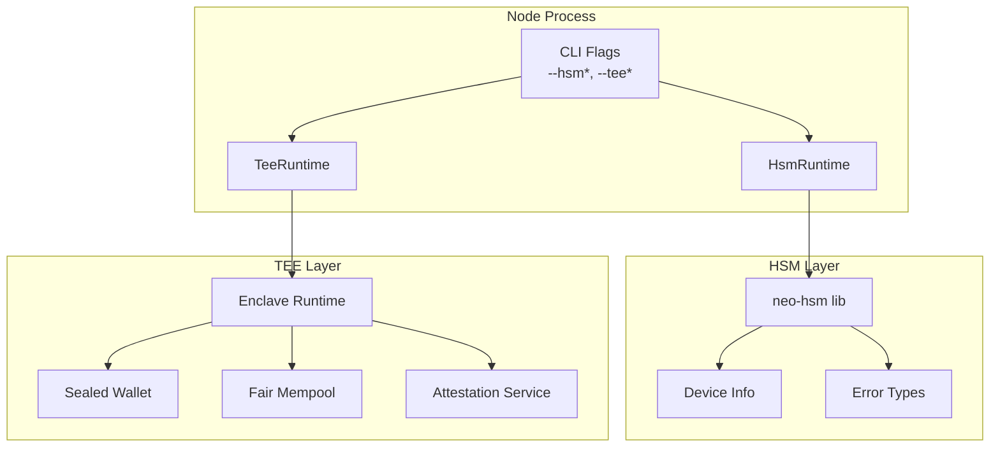
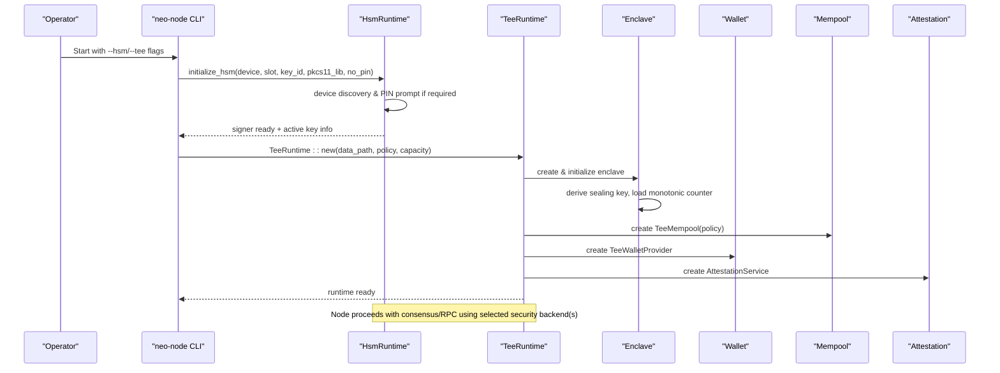
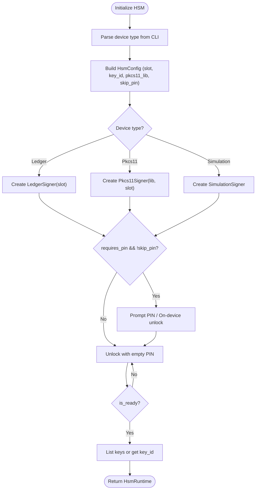
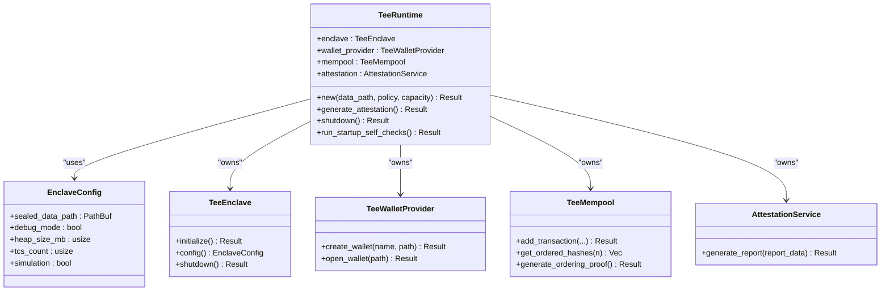
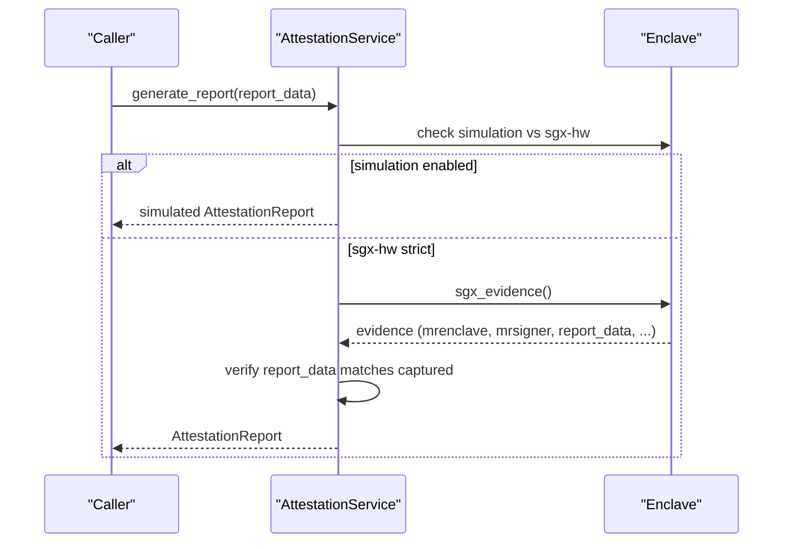
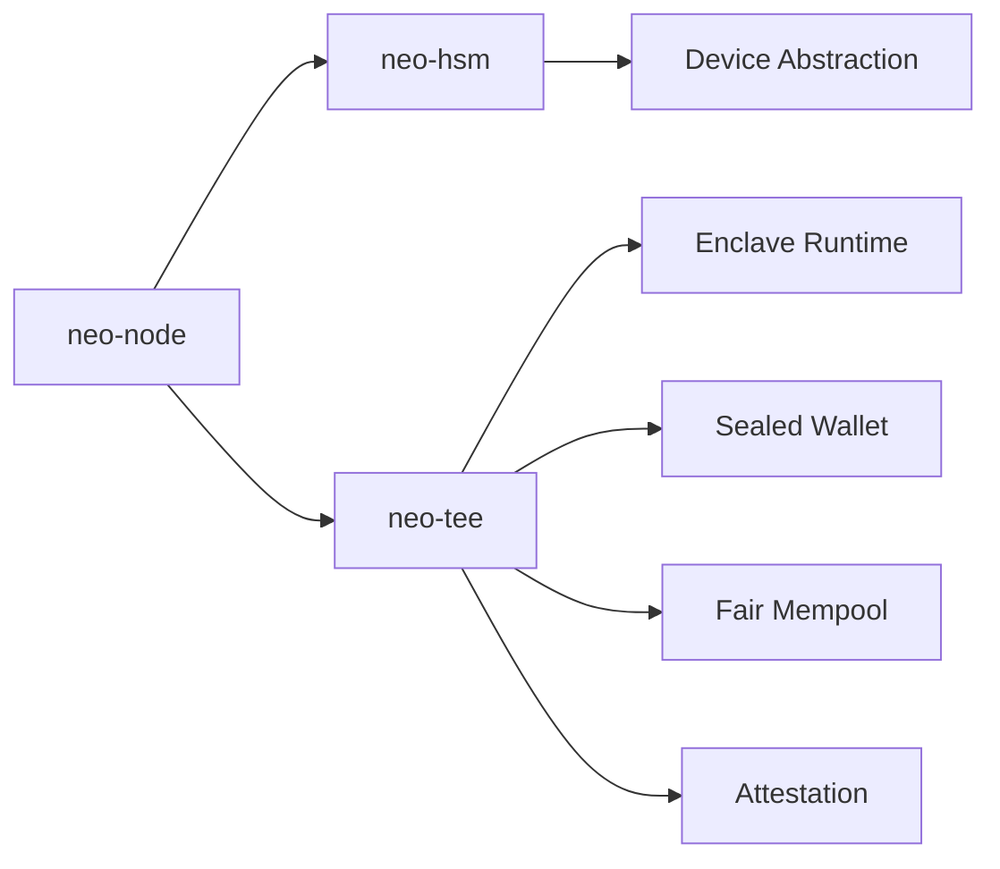

# Hardware Security

<cite>
**Referenced Files in This Document**
- [neo-hsm/src/lib.rs](file://neo-hsm/src/lib.rs)
- [neo-hsm/src/config.rs](file://neo-hsm/src/config.rs)
- [neo-hsm/src/device/device_info.rs](file://neo-hsm/src/device/device_info.rs)
- [neo-hsm/src/error.rs](file://neo-hsm/src/error.rs)
- [neo-node/src/hsm_integration.rs](file://neo-node/src/hsm_integration.rs)
- [neo-node/src/cli.rs](file://neo-node/src/cli.rs)
- [neo-tee/src/lib.rs](file://neo-tee/src/lib.rs)
- [neo-tee/src/enclave/mod.rs](file://neo-tee/src/enclave/mod.rs)
- [neo-tee/src/enclave/runtime.rs](file://neo-tee/src/enclave/runtime.rs)
- [neo-tee/src/attestation/service.rs](file://neo-tee/src/attestation/service.rs)
- [neo-tee/src/wallet/mod.rs](file://neo-tee/src/wallet/mod.rs)
- [neo-node/src/tee_integration.rs](file://neo-node/src/tee_integration.rs)
- [tools/sgx-evidence-helper/App/main.cpp](file://tools/sgx-evidence-helper/App/main.cpp)
- [docs/SECURITY.md](file://docs/SECURITY.md)
- [docs/DEPLOYMENT.md](file://docs/DEPLOYMENT.md)
</cite>

## Table of Contents
1. Introduction
2. Project Structure
3. Core Components
4. Architecture Overview
5. Detailed Component Analysis
6. Dependency Analysis
7. Performance Considerations
8. Troubleshooting Guide
9. Conclusion
10. Appendices

## Introduction
This document explains the hardware security features in Neo-RS with a focus on:
- Hardware Security Module (HSM) integration for secure key storage and signing operations
- Trusted Execution Environment (TEE) support using Intel SGX for enhanced isolation, fair transaction ordering, and sealed key storage
- Device discovery, authentication, and operation modes for HSM
- TEE enclave creation, attestation, and sealed data lifecycle
- Configuration options, security policies, and access controls
- Operational continuity modes (fail-open vs fail-safe/fail-closed)
- Production deployment guidance and troubleshooting

## Project Structure
Neo-RS organizes hardware security across two primary crates and their node integrations:
- neo-hsm: Unified HSM abstraction supporting Ledger, PKCS#11, and simulation backends
- neo-tee: TEE/SGX support including enclave runtime, sealing, mempool fairness, and attestation
- neo-node: Integrates both HSM and TEE into the running node via CLI flags and runtime initialization

**Diagram sources**
- [neo-node/src/cli.rs:138-186](file://neo-node/src/cli.rs#L138-L186)
- [neo-node/src/hsm_integration.rs:13-23](file://neo-node/src/hsm_integration.rs#L13-L23)
- [neo-node/src/tee_integration.rs:20-26](file://neo-node/src/tee_integration.rs#L20-L26)
- [neo-hsm/src/lib.rs:1-67](file://neo-hsm/src/lib.rs#L1-L67)
- [neo-tee/src/lib.rs:1-63](file://neo-tee/src/lib.rs#L1-L63)

**Section sources**
- [neo-node/src/cli.rs:138-186](file://neo-node/src/cli.rs#L138-L186)
- [neo-hsm/src/lib.rs:1-67](file://neo-hsm/src/lib.rs#L1-L67)
- [neo-tee/src/lib.rs:1-63](file://neo-tee/src/lib.rs#L1-L63)

## Core Components
- HSM runtime: Wraps device selection, PIN handling, key discovery, and signing via a unified interface
- TEE runtime: Initializes enclave, configures sealed storage, fair mempool policy, wallet provider, and attestation service
- Enclave runtime: Derives sealing keys, manages monotonic counter, checks hardware attestation availability
- Attestation service: Produces reports bound to verified evidence or simulated measurements depending on mode
- Wallet and sealing: Provides sealed key storage and signing within TEE protection

Key responsibilities:
- HSM: device discovery, unlock/PIN flow, key listing/getting, signing delegation
- TEE: enclave init, sealed data lifecycle, fair ordering, remote attestation, startup self-checks

**Section sources**
- [neo-node/src/hsm_integration.rs:13-23](file://neo-node/src/hsm_integration.rs#L13-L23)
- [neo-node/src/tee_integration.rs:20-26](file://neo-node/src/tee_integration.rs#L20-L26)
- [neo-tee/src/enclave/runtime.rs:193-223](file://neo-tee/src/enclave/runtime.rs#L193-L223)
- [neo-tee/src/attestation/service.rs:390-427](file://neo-tee/src/attestation/service.rs#L390-L427)
- [neo-tee/src/wallet/mod.rs:1-12](file://neo-tee/src/wallet/mod.rs#L1-L12)

## Architecture Overview
The node can operate with HSM-only, TEE-only, both, or neither, controlled by CLI flags and feature flags.

**Diagram sources**
- [neo-node/src/cli.rs:138-186](file://neo-node/src/cli.rs#L138-L186)
- [neo-node/src/hsm_integration.rs:42-185](file://neo-node/src/hsm_integration.rs#L42-L185)
- [neo-node/src/tee_integration.rs:56-125](file://neo-node/src/tee_integration.rs#L56-L125)
- [neo-tee/src/enclave/runtime.rs:193-223](file://neo-tee/src/enclave/runtime.rs#L193-L223)

## Detailed Component Analysis

### HSM Integration
- Device types: Ledger, PKCS#11, Simulation
- Discovery and readiness: device_info exposes manufacturer/model/serial/firmware/connection state and whether PIN is required
- Authentication: interactive PIN prompt when required; Ledger prompts on-device; skip-pin supported for testing
- Operation modes: select device via CLI; optional key_id or default key selection; status reporting

**Diagram sources**
- [neo-node/src/hsm_integration.rs:42-185](file://neo-node/src/hsm_integration.rs#L42-L185)
- [neo-hsm/src/config.rs:1-86](file://neo-hsm/src/config.rs#L1-L86)
- [neo-hsm/src/device/device_info.rs:43-77](file://neo-hsm/src/device/device_info.rs#L43-L77)

Configuration highlights:
- HsmConfig fields include device_type, slot, key_id, pkcs11_lib, skip_pin, max_pin_attempts, timeout_ms
- Convenience constructors for ledger/pkcs11/simulation

Errors:
- Comprehensive error enum covering not initialized, init failed, device errors, PIN issues, key not found, signing failures, user rejection, and backend-specific errors

**Section sources**
- [neo-node/src/hsm_integration.rs:42-185](file://neo-node/src/hsm_integration.rs#L42-L185)
- [neo-hsm/src/config.rs:1-86](file://neo-hsm/src/config.rs#L1-L86)
- [neo-hsm/src/device/device_info.rs:43-77](file://neo-hsm/src/device/device_info.rs#L43-L77)
- [neo-hsm/src/error.rs:1-57](file://neo-hsm/src/error.rs#L1-L57)

### TEE Integration (Intel SGX)
- Enclave configuration: sealed data path, debug mode, heap size, TCS count, simulation flag
- Initialization: derives sealing key, loads monotonic counter, checks hardware attestation availability
- Fair mempool: configurable ordering policies (FCFS, batched-random, commit-reveal, threshold encryption, FCFS with gas cap)
- Wallet provider: creates/opens sealed wallets; supports key creation and signing inside TEE
- Attestation: generates reports bound to verified quote evidence or simulated measurements; strict-mode enforces matching report_data

**Diagram sources**
- [neo-node/src/tee_integration.rs:20-125](file://neo-node/src/tee_integration.rs#L20-L125)
- [neo-tee/src/enclave/mod.rs:1-14](file://neo-tee/src/enclave/mod.rs#L1-L14)
- [neo-tee/src/wallet/mod.rs:1-12](file://neo-tee/src/wallet/mod.rs#L1-L12)

Startup self-checks:
- Validates mempool add/order/proof path
- Validates wallet key creation and signing
- Handles stale sealed data by recreating temporary wallets during checks

**Section sources**
- [neo-node/src/tee_integration.rs:56-125](file://neo-node/src/tee_integration.rs#L56-L125)
- [neo-node/src/tee_integration.rs:139-231](file://neo-node/src/tee_integration.rs#L139-L231)
- [neo-tee/src/enclave/runtime.rs:193-223](file://neo-tee/src/enclave/runtime.rs#L193-L223)

### Sealed Key Storage and Attestation
- Sealing key derivation: deterministic in simulation; hardware-backed in SGX builds
- Monotonic counter: loaded at startup; missing file allowed on first boot; corrupt/unreadable counter fails closed
- Attestation report generation:
  - In simulation without allow_simulated: returns error
  - With allow_simulated: returns simulated report with measurements
  - In strict SGX mode: requires verified quote evidence; report_data must match the captured value at init

**Diagram sources**
- [neo-tee/src/attestation/service.rs:390-427](file://neo-tee/src/attestation/service.rs#L390-L427)
- [neo-tee/src/enclave/runtime.rs:425-455](file://neo-tee/src/enclave/runtime.rs#L425-L455)

Evidence helper:
- The repository includes an SGX evidence helper that generates sealing key material and report data binding used during strict SGX setup

**Section sources**
- [tools/sgx-evidence-helper/App/main.cpp:1-51](file://tools/sgx-evidence-helper/App/main.cpp#L1-L51)

### Configuration Options and Access Controls
- CLI flags for HSM:
  - Enable HSM mode
  - Device type (ledger, pkcs11, simulation)
  - PKCS#11 library path
  - Slot ID
  - Key ID or derivation path
  - Skip PIN prompt (testing only)
- CLI flags for TEE:
  - Enable TEE mode (--tee) or opportunistic mode (--tee-auto)
  - Sealed data path
  - Ordering policy (fcfs, batched, commit-reveal, etc.)
- Security policies:
  - TEE simulation blocked in release builds unless explicitly allowed
  - Strict SGX mode requires verified quote evidence and matching report_data
  - HSM PIN requirements enforced per device capability

Operational continuity modes:
- TEE:
  - --tee: fail-closed; startup fails if TEE init/self-checks/attestation fail
  - --tee-auto: attempt TEE; if setup fails, continue in ordinary mode with warning
- HSM:
  - Simulation signer behavior documented as fail-open when no PIN configured; production deployments should avoid this by using real devices or enforcing PIN

**Section sources**
- [neo-node/src/cli.rs:138-186](file://neo-node/src/cli.rs#L138-L186)
- [neo-node/src/tee_integration.rs:56-96](file://neo-node/src/tee_integration.rs#L56-L96)
- [docs/SECURITY.md:314-318](file://docs/SECURITY.md#L314-L318)
- [neo-hsm/tests/t07_hsm_failopen_proof.rs:1-32](file://neo-hsm/tests/t07_hsm_failopen_proof.rs#L1-L32)

### Deployment Guides for Production
- Build with appropriate features:
  - tee-sgx for SGX hardware support
  - hsm-ledger or hsm-pkcs11 for HSM backends
- Strict SGX mode:
  - Requires SGX devices and DCAP verification libraries
  - Provide quote evidence and sealing key material at startup under --tee-data-path
  - Use environment variables to override paths if needed
- Run modes:
  - Strict TEE: --tee with valid evidence
  - Opportunistic TEE: --tee-auto
  - Ordinary mode: no TEE flags
- Security hardening:
  - Follow RPC hardening defaults where applicable
  - Restrict network exposure and enable TLS for RPC

**Section sources**
- [docs/DEPLOYMENT.md:139-193](file://docs/DEPLOYMENT.md#L139-L193)

## Dependency Analysis
Neo-RS composes HSM and TEE through clear boundaries:
- neo-node depends on neo-hsm and neo-tee for security backends
- neo-hsm abstracts device drivers behind a common interface
- neo-tee encapsulates enclave lifecycle, sealing, mempool fairness, and attestation

**Diagram sources**
- [neo-node/src/hsm_integration.rs:1-208](file://neo-node/src/hsm_integration.rs#L1-L208)
- [neo-node/src/tee_integration.rs:1-378](file://neo-node/src/tee_integration.rs#L1-L378)
- [neo-hsm/src/lib.rs:1-67](file://neo-hsm/src/lib.rs#L1-L67)
- [neo-tee/src/lib.rs:1-63](file://neo-tee/src/lib.rs#L1-L63)

**Section sources**
- [neo-node/src/hsm_integration.rs:1-208](file://neo-node/src/hsm_integration.rs#L1-L208)
- [neo-node/src/tee_integration.rs:1-378](file://neo-node/src/tee_integration.rs#L1-L378)
- [neo-hsm/src/lib.rs:1-67](file://neo-hsm/src/lib.rs#L1-L67)
- [neo-tee/src/lib.rs:1-63](file://neo-tee/src/lib.rs#L1-L63)

## Performance Considerations
- TEE mempool batching:
  - Batch interval influences throughput vs latency trade-offs
  - Policy selection affects fairness and performance characteristics
- Enclave resources:
  - Heap size and TCS count impact concurrency and memory usage
- HSM operations:
  - Device communication timeouts and PIN retries affect responsiveness
  - Prefer dedicated HSM devices for high-throughput signing workloads
- General:
  - Avoid simulation modes in production for performance and security guarantees
  - Use release or production build profiles for optimized binaries

[No sources needed since this section provides general guidance]

## Troubleshooting Guide
Common issues and remedies:
- HSM not ready:
  - Ensure device is connected and Neo app open (for Ledger)
  - Verify PIN prompt handled correctly; avoid skip_pin in production
  - Check device-specific errors and adjust timeouts/retries
- TEE initialization failure:
  - In strict SGX mode, ensure quote evidence and sealing key are present and valid
  - Validate report_data binding matches expected hash of sealing key
  - Review startup self-check logs for mempool/wallet validation failures
- Stale sealed data:
  - During startup self-checks, stale wallets may be recreated automatically; persistent failures indicate misconfiguration or tampering
- Simulation mode restrictions:
  - Release builds block TEE simulation unless explicitly allowed; use proper SGX hardware for production

Operational tips:
- Use --tee-auto for graceful fallback when SGX is unavailable
- Log device info and active key details for HSM; log enclave mode and policy for TEE
- Monitor attestation report generation and policy parsing outcomes

**Section sources**
- [neo-node/src/hsm_integration.rs:106-185](file://neo-node/src/hsm_integration.rs#L106-L185)
- [neo-node/src/tee_integration.rs:56-125](file://neo-node/src/tee_integration.rs#L56-L125)
- [neo-node/src/tee_integration.rs:139-231](file://neo-node/src/tee_integration.rs#L139-L231)
- [neo-tee/src/attestation/service.rs:390-427](file://neo-tee/src/attestation/service.rs#L390-L427)
- [neo-tee/src/enclave/runtime.rs:193-223](file://neo-tee/src/enclave/runtime.rs#L193-L223)

## Conclusion
Neo-RS provides robust hardware security through modular HSM and TEE integrations:
- HSM enables secure key storage and signing via Ledger or PKCS#11 with flexible configuration and PIN handling
- TEE offers enclave-based isolation, sealed key storage, fair transaction ordering, and verifiable attestation
- Clear operational modes support both strict security (fail-closed) and resilient operation (opportunistic fallback)
- Production deployments should use SGX hardware with verified evidence, enforce PIN policies, and follow hardening guidelines

[No sources needed since this section summarizes without analyzing specific files]

## Appendices

### A. CLI Reference for Hardware Security
- HSM flags:
  - --hsm: enable HSM mode
  - --hsm-device: ledger, pkcs11, simulation
  - --hsm-pkcs11-lib: path to PKCS#11 library
  - --hsm-slot: device slot/index
  - --hsm-key-id: key identifier or derivation path
  - --hsm-no-pin: skip PIN prompt (testing only)
- TEE flags:
  - --tee: strict TEE mode (fail-closed)
  - --tee-auto: opportunistic TEE mode
  - --tee-data-path: sealed data directory
  - --tee-ordering-policy: fcfs, batched, commit-reveal, threshold, fcfs-gas-cap

**Section sources**
- [neo-node/src/cli.rs:138-186](file://neo-node/src/cli.rs#L138-L186)

### B. Security Policies and Modes Summary
- TEE modes:
  - --tee: fail-closed; startup fails on any TEE-related error
  - --tee-auto: attempt TEE; continue in ordinary mode on failure
- HSM modes:
  - Simulation signer is fail-open when no PIN configured; avoid in production
  - Real devices enforce PIN and device-specific constraints

**Section sources**
- [docs/SECURITY.md:314-318](file://docs/SECURITY.md#L314-L318)
- [neo-hsm/tests/t07_hsm_failopen_proof.rs:1-32](file://neo-hsm/tests/t07_hsm_failopen_proof.rs#L1-L32)