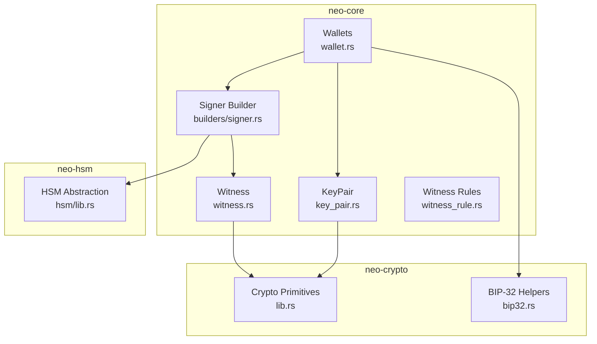
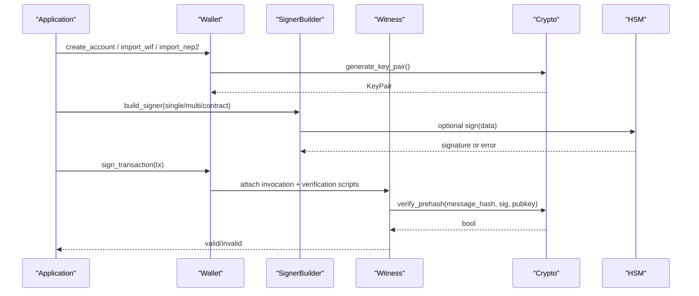
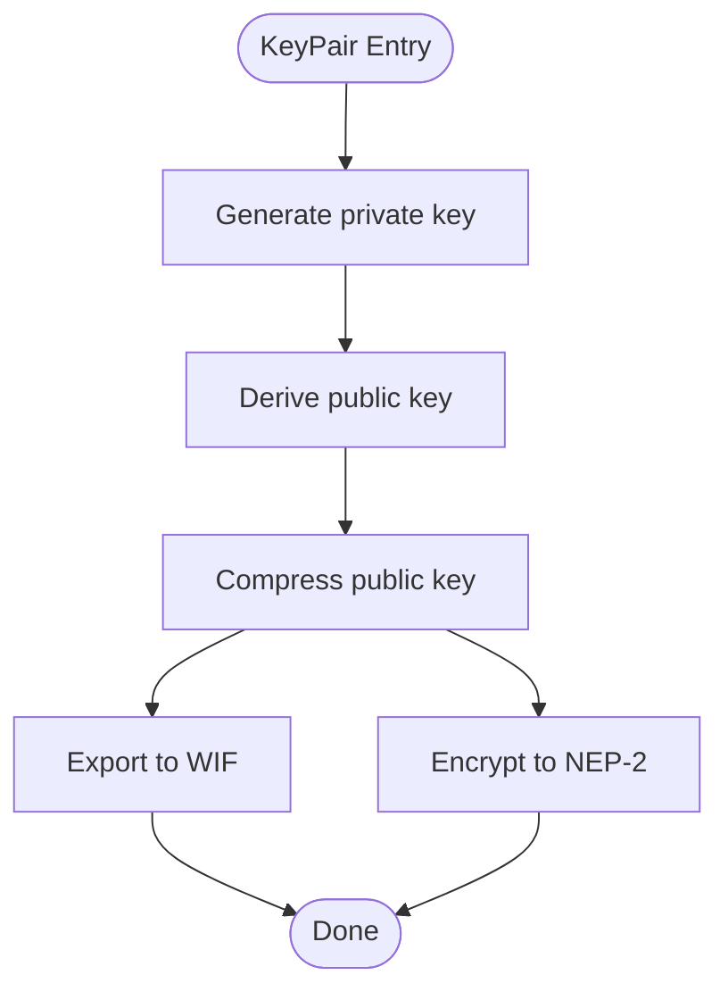
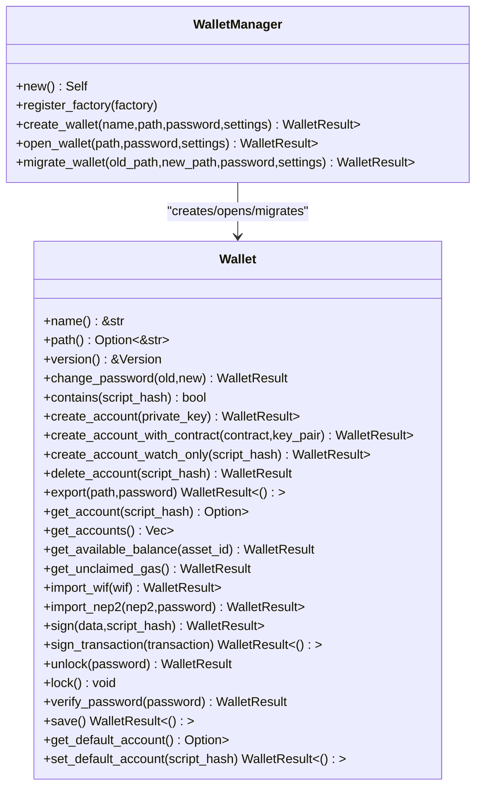
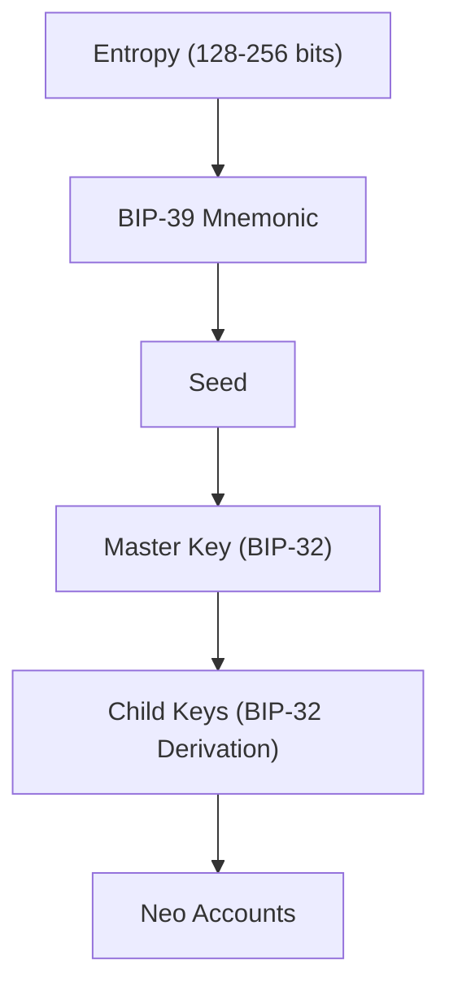
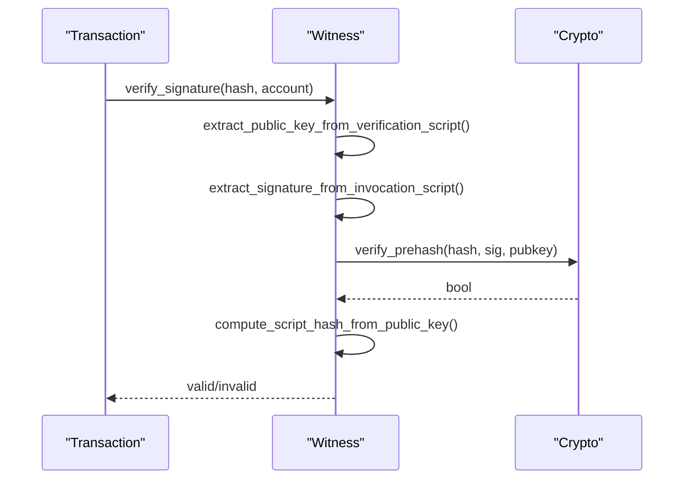
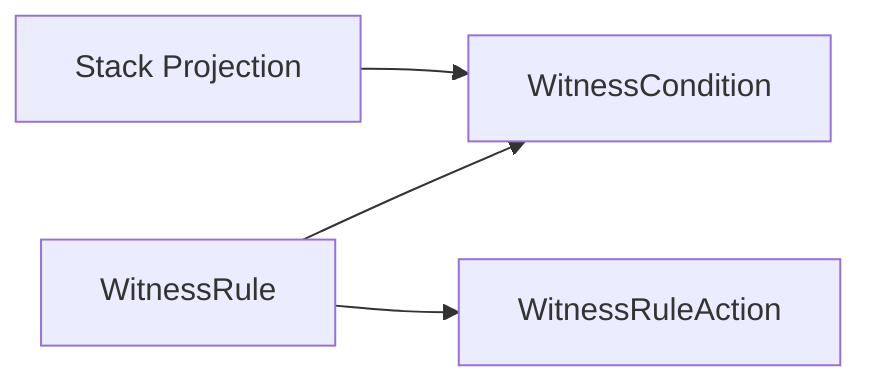
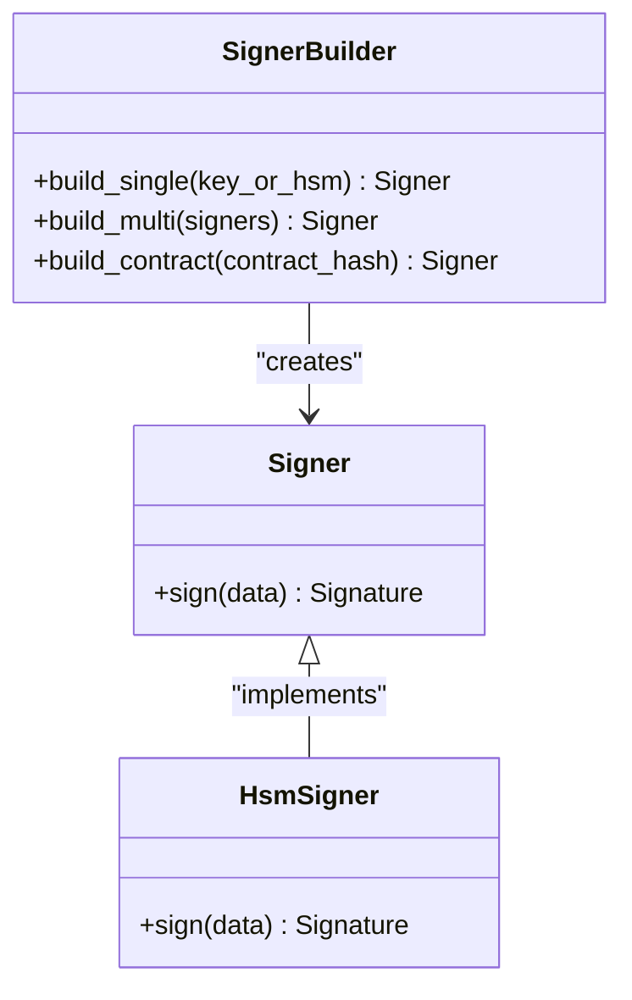
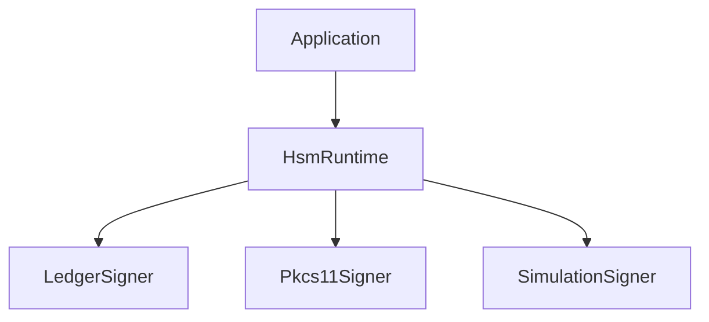
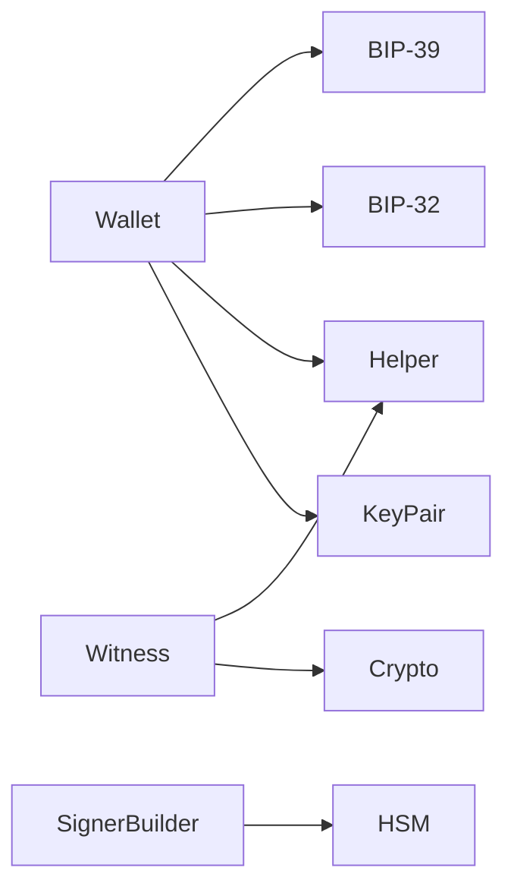

# Key Management

<cite>
**Referenced Files in This Document**
- [mod.rs](file://neo-core/src/wallets/mod.rs)
- [wallet.rs](file://neo-core/src/wallets/wallet.rs)
- [key_pair.rs](file://neo-core/src/wallets/key_pair.rs)
- [bip39.rs](file://neo-core/src/wallets/bip39.rs)
- [bip32.rs](file://neo-crypto/src/bip32.rs)
- [lib.rs](file://neo-crypto/src/lib.rs)
- [witness.rs](file://neo-core/src/witness.rs)
- [witness_rule.rs](file://neo-core/src/witness_rule.rs)
- [signer.rs](file://neo-core/src/builders/signer.rs)
- [witness_builder.rs](file://neo-core/src/builders/witness.rs)
- [witness_condition.rs](file://neo-core/src/builders/witness_condition.rs)
- [lib.rs](file://neo-hsm/src/lib.rs)
</cite>

## Table of Contents
1. Introduction
2. Project Structure
3. Core Components
4. Architecture Overview
5. Detailed Component Analysis
6. Dependency Analysis
7. Performance Considerations
8. Troubleshooting Guide
9. Conclusion
10. Appendices

## Introduction
This document explains key management in Neo-RS with a focus on:
- Witness validation for single-signature and multi-signature transactions
- Wallet functionality including HD wallet support (BIP-32/BIP-39)
- Private key generation, storage formats (WIF, NEP-2), and secure handling
- Signer builder pattern to create single-key, multi-key, and contract-based signers
- Witness rules and conditions for complex authorization
- Key rotation, backup, and recovery procedures
- Integration with external key management systems and hardware security modules (HSM)
- Common workflows and production security best practices

## Project Structure
Neo-RS organizes key management across several crates:
- neo-core: wallets, witness validation, signer builders, witness rules
- neo-crypto: cryptographic primitives, BIP-32 helpers, curves, hashing
- neo-hsm: HSM abstraction and device integrations (Ledger, PKCS#11, simulation)

**Diagram sources**
- [wallet.rs:71-157](file://neo-core/src/wallets/wallet.rs#L71-L157)
- [key_pair.rs:24-186](file://neo-core/src/wallets/key_pair.rs#L24-L186)
- [witness.rs:59-188](file://neo-core/src/witness.rs#L59-L188)
- [witness_rule.rs:6-19](file://neo-core/src/witness_rule.rs#L6-L19)
- [signer.rs:1-200](file://neo-core/src/builders/signer.rs#L1-L200)
- [lib.rs:1-96](file://neo-crypto/src/lib.rs#L1-L96)
- [bip32.rs:19-86](file://neo-crypto/src/bip32.rs#L19-L86)
- [lib.rs:1-67](file://neo-hsm/src/lib.rs#L1-L67)

**Section sources**
- [mod.rs:1-36](file://neo-core/src/wallets/mod.rs#L1-L36)
- [wallet.rs:71-157](file://neo-core/src/wallets/wallet.rs#L71-L157)
- [key_pair.rs:24-186](file://neo-core/src/wallets/key_pair.rs#L24-L186)
- [bip39.rs:20-75](file://neo-core/src/wallets/bip39.rs#L20-L75)
- [bip32.rs:19-86](file://neo-crypto/src/bip32.rs#L19-L86)
- [lib.rs:1-96](file://neo-crypto/src/lib.rs#L1-L96)
- [witness.rs:59-188](file://neo-core/src/witness.rs#L59-L188)
- [witness_rule.rs:6-19](file://neo-core/src/witness_rule.rs#L6-L19)
- [lib.rs:1-67](file://neo-hsm/src/lib.rs#L1-L67)

## Core Components
- KeyPair: generates keys, signs/verifies, supports WIF and NEP-2 import/export, derives verification scripts and script hashes.
- Wallet trait and manager: abstracts account lifecycle, signing, and persistence; supports watch-only accounts and migrations.
- Witness: encapsulates invocation and verification scripts; validates single and multi-signatures against message hashes.
- Witness rules: re-export core rule types from neo-io and add VM stack projection utilities for condition evaluation.
- Signer builder: constructs signers for single-key, multi-key, and contract-based scenarios.
- HSM integration: unified interface for Ledger, PKCS#11, and simulation backends.

**Section sources**
- [key_pair.rs:24-186](file://neo-core/src/wallets/key_pair.rs#L24-L186)
- [wallet.rs:71-157](file://neo-core/src/wallets/wallet.rs#L71-L157)
- [witness.rs:59-188](file://neo-core/src/witness.rs#L59-L188)
- [witness_rule.rs:6-19](file://neo-core/src/witness_rule.rs#L6-L19)
- [signer.rs:1-200](file://neo-core/src/builders/signer.rs#L1-L200)
- [lib.rs:1-67](file://neo-hsm/src/lib.rs#L1-L67)

## Architecture Overview
The key management architecture separates concerns:
- Crypto layer (neo-crypto): curve operations, hashing, BIP-32 helpers
- Wallet layer (neo-core): account management, key formats, mnemonic handling
- Transaction signing (neo-core): witness construction and validation
- Policy layer (neo-core): witness rules and conditions for authorization
- Hardware integration (neo-hsm): abstracted signing via HSM devices

**Diagram sources**
- [wallet.rs:71-157](file://neo-core/src/wallets/wallet.rs#L71-L157)
- [key_pair.rs:51-186](file://neo-core/src/wallets/key_pair.rs#L51-L186)
- [witness.rs:171-255](file://neo-core/src/witness.rs#L171-L255)
- [lib.rs:1-96](file://neo-crypto/src/lib.rs#L1-L96)
- [lib.rs:1-67](file://neo-hsm/src/lib.rs#L1-L67)

## Detailed Component Analysis

### KeyPair: Generation, Formats, and Secure Handling
- Generates P-256 keys using secure RNG
- Derives public key and compressed form
- Supports WIF and NEP-2 import/export with scrypt-based encryption and AES-CBC
- Provides signing and verification APIs
- Uses zeroization for sensitive buffers and constant-time comparisons where applicable

**Diagram sources**
- [key_pair.rs:51-186](file://neo-core/src/wallets/key_pair.rs#L51-L186)

**Section sources**
- [key_pair.rs:24-186](file://neo-core/src/wallets/key_pair.rs#L24-L186)

### Wallet: Account Lifecycle, Signing, and Persistence
- Defines the Wallet trait with methods for account creation, import, deletion, password management, and transaction signing
- WalletManager provides factory-based creation/opening/migration of wallets
- Supports watch-only accounts and balance queries

**Diagram sources**
- [wallet.rs:71-269](file://neo-core/src/wallets/wallet.rs#L71-L269)

**Section sources**
- [wallet.rs:71-269](file://neo-core/src/wallets/wallet.rs#L71-L269)

### HD Wallet Support: BIP-32 and BIP-39
- BIP-39: Mnemonic generation and parsing with multi-language support; entropy validation and checksum checks; safe handling via zeroizing
- BIP-32: Low-level HMAC-SHA512 and child key derivation modulo curve order; supports secp256r1 and secp256k1; rejects invalid curves like Ed25519

**Diagram sources**
- [bip39.rs:20-75](file://neo-core/src/wallets/bip39.rs#L20-L75)
- [bip32.rs:19-86](file://neo-crypto/src/bip32.rs#L19-L86)

**Section sources**
- [bip39.rs:20-75](file://neo-core/src/wallets/bip39.rs#L20-L75)
- [bip32.rs:19-86](file://neo-crypto/src/bip32.rs#L19-L86)

### Witness Validation: Single and Multi-Signature
- Single-signature: extracts public key from verification script and signature from invocation script; verifies ECDSA over SHA-256 hash; ensures script hash matches account
- Multi-signature: builds expected multisig script, sorts public keys, verifies required number of signatures against message hash

**Diagram sources**
- [witness.rs:171-255](file://neo-core/src/witness.rs#L171-L255)

**Section sources**
- [witness.rs:59-188](file://neo-core/src/witness.rs#L59-L188)
- [witness.rs:190-255](file://neo-core/src/witness.rs#L190-L255)

### Witness Rules and Conditions
- Re-exports core witness rule types and actions from neo-io
- Adds VM-specific stack projection utilities for evaluating conditions during execution
- Enables complex authorization policies beyond simple signatures

**Diagram sources**
- [witness_rule.rs:6-19](file://neo-core/src/witness_rule.rs#L6-L19)

**Section sources**
- [witness_rule.rs:6-19](file://neo-core/src/witness_rule.rs#L6-L19)

### Signer Builder Pattern
- Constructs different signer types:
  - Single-key signer backed by KeyPair or HSM
  - Multi-key signer aggregating multiple signers
  - Contract-based signer delegating to deployed contracts
- Integrates with HSM backends when configured

**Diagram sources**
- [signer.rs:1-200](file://neo-core/src/builders/signer.rs#L1-L200)
- [lib.rs:1-67](file://neo-hsm/src/lib.rs#L1-L67)

**Section sources**
- [signer.rs:1-200](file://neo-core/src/builders/signer.rs#L1-L200)
- [witness_builder.rs:1-200](file://neo-core/src/builders/witness.rs#L1-L200)
- [witness_condition.rs:1-200](file://neo-core/src/builders/witness_condition.rs#L1-L200)

### HSM Integration
- Unified interface for Ledger, PKCS#11, and simulation modes
- Exposes configuration, device info, PIN prompting, and signing capabilities
- Allows applications to transparently switch between software and hardware-backed signing

**Diagram sources**
- [lib.rs:1-67](file://neo-hsm/src/lib.rs#L1-L67)

**Section sources**
- [lib.rs:1-67](file://neo-hsm/src/lib.rs#L1-L67)

## Dependency Analysis
- Wallet depends on KeyPair for cryptographic operations and on helper utilities for address/script conversions
- Witness depends on crypto primitives for ECDSA verification and on helper functions to build verification scripts
- Signer builder may depend on HSM abstractions for hardware-backed signing
- BIP-32/BIP-39 are used by wallet implementations for HD wallet flows

**Diagram sources**
- [wallet.rs:71-157](file://neo-core/src/wallets/wallet.rs#L71-L157)
- [key_pair.rs:24-186](file://neo-core/src/wallets/key_pair.rs#L24-L186)
- [witness.rs:59-188](file://neo-core/src/witness.rs#L59-L188)
- [bip32.rs:19-86](file://neo-crypto/src/bip32.rs#L19-L86)
- [bip39.rs:20-75](file://neo-core/src/wallets/bip39.rs#L20-L75)
- [lib.rs:1-67](file://neo-hsm/src/lib.rs#L1-L67)

**Section sources**
- [wallet.rs:71-157](file://neo-core/src/wallets/wallet.rs#L71-L157)
- [witness.rs:59-188](file://neo-core/src/witness.rs#L59-L188)
- [bip32.rs:19-86](file://neo-crypto/src/bip32.rs#L19-L86)
- [bip39.rs:20-75](file://neo-core/src/wallets/bip39.rs#L20-L75)
- [lib.rs:1-67](file://neo-hsm/src/lib.rs#L1-L67)

## Performance Considerations
- Use prehashed messages for ECDSA verification to avoid redundant hashing
- Cache script hashes in witnesses to reduce repeated computations
- Prefer batch verification for multi-signature scenarios where possible
- Minimize memory exposure of private keys; use zeroization and short-lived scopes
- Leverage HSM offloading for signing to reduce CPU load and protect keys

[No sources needed since this section provides general guidance]

## Troubleshooting Guide
Common issues and resolutions:
- Invalid WIF format: ensure correct version byte and compressed flag; check Base58 decoding errors
- Invalid NEP-2 key: validate length, prefix, and password; confirm address hash matches derived address
- Witness verification failures: verify invocation script length and format; ensure public key is compressed and matches account script hash
- Multi-signature mismatches: confirm required signatures count, sorted public keys, and exact signature lengths
- HSM errors: check device availability, PIN prompts, and feature flags for ledger/pkcs11/simulation

**Section sources**
- [key_pair.rs:188-354](file://neo-core/src/wallets/key_pair.rs#L188-L354)
- [witness.rs:257-325](file://neo-core/src/witness.rs#L257-L325)
- [witness.rs:190-255](file://neo-core/src/witness.rs#L190-L255)
- [lib.rs:1-67](file://neo-hsm/src/lib.rs#L1-L67)

## Conclusion
Neo-RS provides a robust key management system that integrates wallet operations, HD wallet standards, witness validation, and HSM-backed signing. By following the documented patterns—using KeyPair for local keys, Wallet for lifecycle management, Witness for validation, and SignerBuilder for flexible signing strategies—you can implement secure, scalable, and compliant key workflows suitable for production environments.

[No sources needed since this section summarizes without analyzing specific files]

## Appendices

### Security Best Practices for Production
- Store private keys in HSM or secure enclaves whenever possible
- Rotate keys periodically and maintain audit trails
- Back up mnemonics securely offline; never log or persist raw entropy
- Validate all inputs strictly; reject malformed scripts and signatures early
- Use constant-time comparisons and zeroization for sensitive data
- Enforce least privilege for signing operations and restrict access to key material

[No sources needed since this section provides general guidance]

### Example Workflows
- Single-signature transfer:
  - Create KeyPair or import WIF/NEP-2
  - Build transaction and attach witness
  - Sign with KeyPair or HSM
  - Verify witness before broadcast
- Multi-signature transfer:
  - Configure multisig policy (m-of-n)
  - Collect signatures from authorized parties
  - Attach multisig witness and verify
- Contract-based authorization:
  - Deploy contract with custom logic
  - Use SignerBuilder to delegate signing to contract
  - Ensure witness rules enforce desired constraints

[No sources needed since this section provides general guidance]