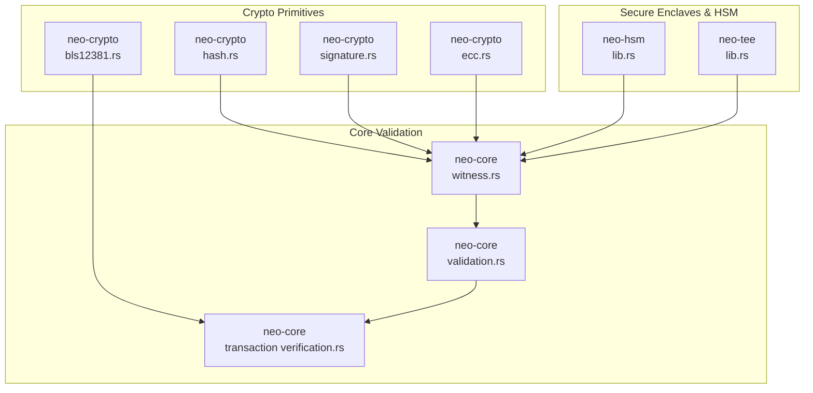
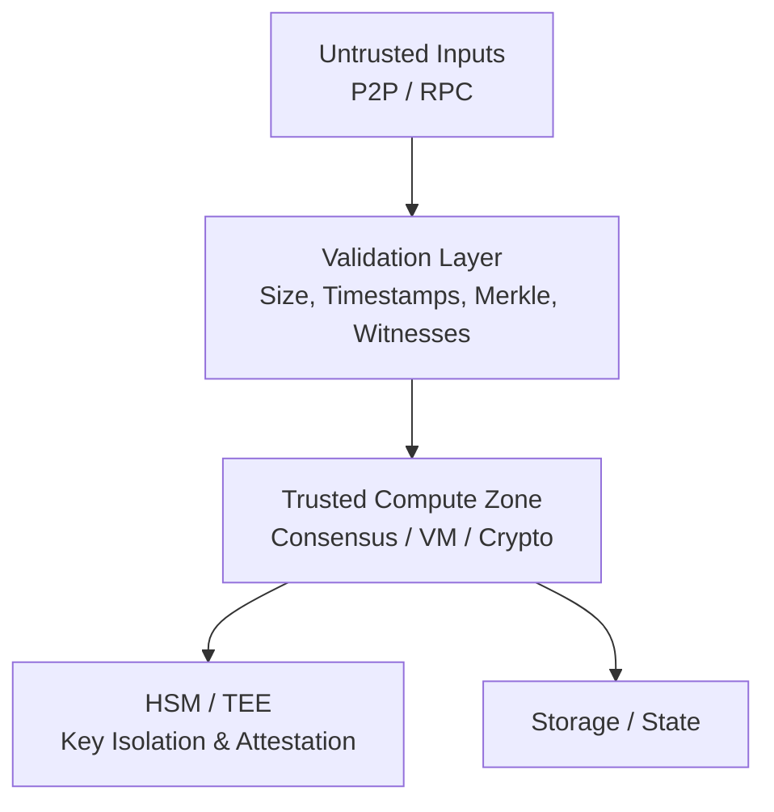
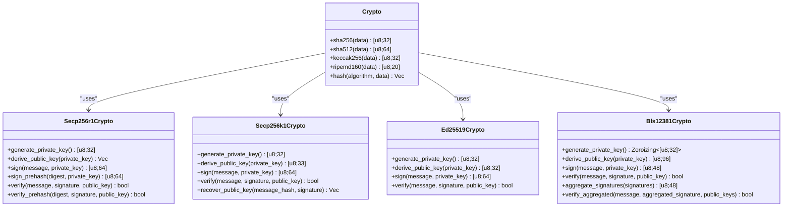
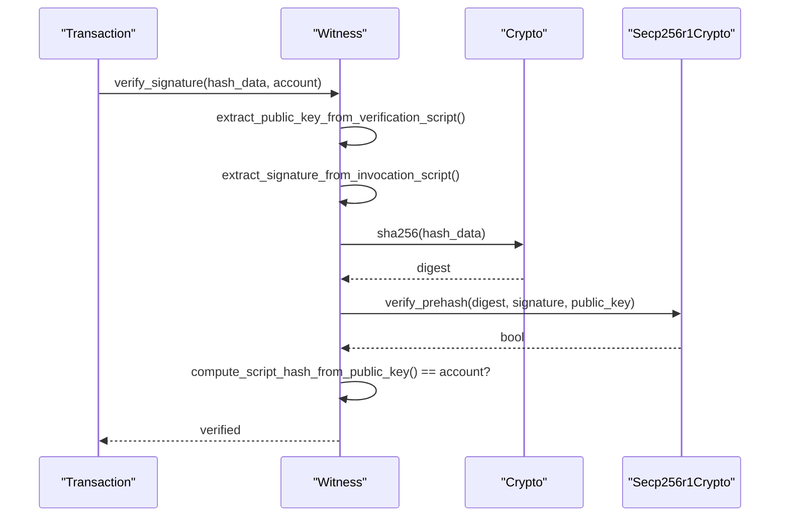
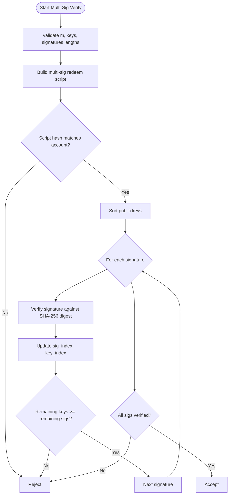
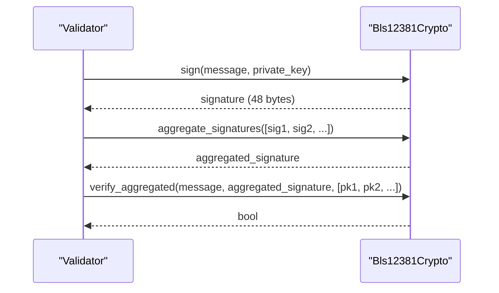
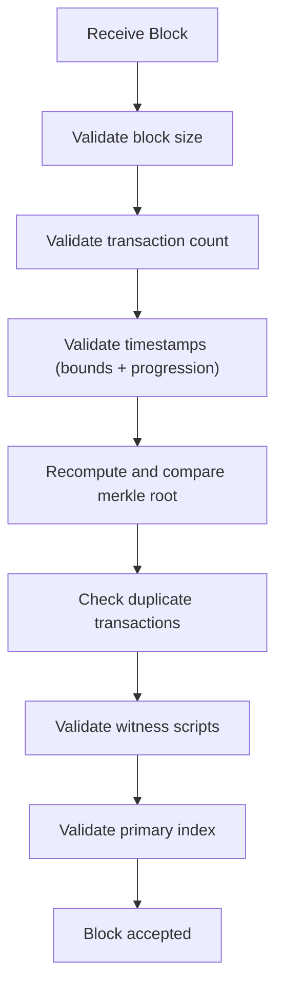
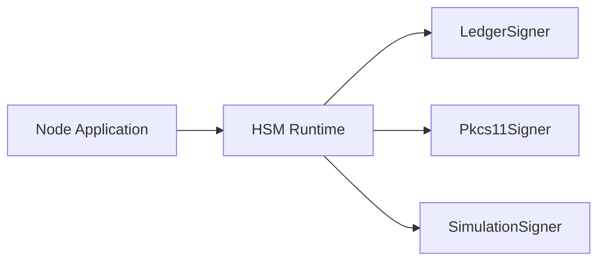
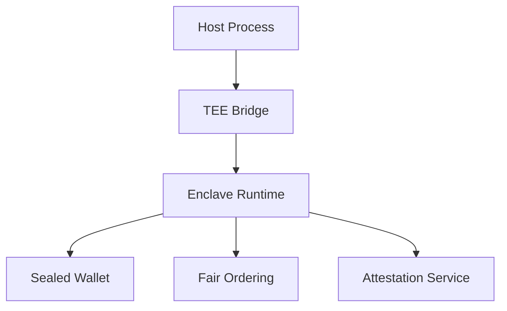
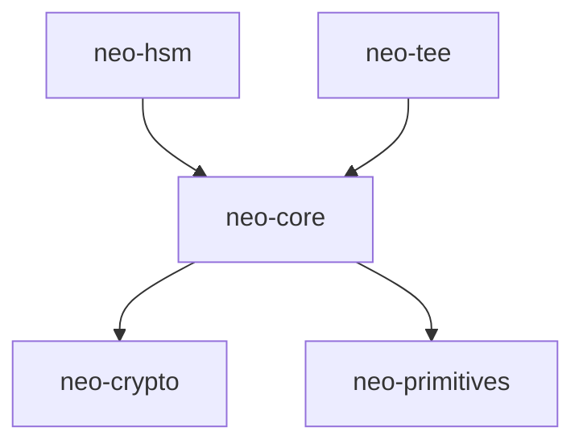

# Security & Cryptography

<cite>
**Referenced Files in This Document**
- [SECURITY.md](file://SECURITY.md)
- [docs/SECURITY.md](file://docs/SECURITY.md)
- [neo-crypto/src/lib.rs](file://neo-crypto/src/lib.rs)
- [neo-crypto/src/hash.rs](file://neo-crypto/src/hash.rs)
- [neo-crypto/src/signature.rs](file://neo-crypto/src/signature.rs)
- [neo-crypto/src/ecc.rs](file://neo-crypto/src/ecc.rs)
- [neo-crypto/src/bls12381.rs](file://neo-crypto/src/bls12381.rs)
- [neo-core/src/witness.rs](file://neo-core/src/witness.rs)
- [neo-core/src/validation.rs](file://neo-core/src/validation.rs)
- [neo-core/src/network/p2p/payloads/transaction/verification.rs](file://neo-core/src/network/p2p/payloads/transaction/verification.rs)
- [neo-hsm/src/lib.rs](file://neo-hsm/src/lib.rs)
- [neo-tee/src/lib.rs](file://neo-tee/src/lib.rs)
</cite>

## Table of Contents
1. Introduction
2. Project Structure
3. Core Components
4. Architecture Overview
5. Detailed Component Analysis
6. Dependency Analysis
7. Performance Considerations
8. Troubleshooting Guide
9. Conclusion
10. Appendices

## Introduction
This document provides comprehensive security and cryptography guidance for the Neo-RS implementation. It covers cryptographic primitives (ECDSA, hash functions including SHA-256, RIPEMD-160, Keccak-256), BLS signature aggregation used in consensus, witness validation, transaction signing, multi-signature support, HSM integration, and TEE support. It also includes threat analysis, mitigation strategies, audit references, secure deployment guidance, certificate management, and monitoring recommendations.

## Project Structure
Neo-RS organizes security-related functionality across dedicated crates:
- neo-crypto: Hashing, ECDSA, Ed25519, ECC utilities, and BLS12-381 helpers
- neo-core: Witness handling, block and transaction validation, transaction verification logic
- neo-hsm: Hardware-backed key management and signing abstractions
- neo-tee: Trusted Execution Environment support with enclave runtime, sealed wallet storage, fair mempool ordering, and attestation

**Diagram sources**
- [neo-crypto/src/hash.rs:1-544](file://neo-crypto/src/hash.rs#L1-L544)
- [neo-crypto/src/signature.rs:1-703](file://neo-crypto/src/signature.rs#L1-L703)
- [neo-crypto/src/ecc.rs:1-909](file://neo-crypto/src/ecc.rs#L1-L909)
- [neo-crypto/src/bls12381.rs:1-284](file://neo-crypto/src/bls12381.rs#L1-L284)
- [neo-core/src/witness.rs:1-520](file://neo-core/src/witness.rs#L1-L520)
- [neo-core/src/validation.rs:1-685](file://neo-core/src/validation.rs#L1-L685)
- [neo-core/src/network/p2p/payloads/transaction/verification.rs:261-303](file://neo-core/src/network/p2p/payloads/transaction/verification.rs#L261-L303)
- [neo-hsm/src/lib.rs:1-67](file://neo-hsm/src/lib.rs#L1-L67)
- [neo-tee/src/lib.rs:1-63](file://neo-tee/src/lib.rs#L1-L63)

**Section sources**
- [neo-crypto/src/lib.rs:1-96](file://neo-crypto/src/lib.rs#L1-L96)
- [neo-core/src/witness.rs:1-520](file://neo-core/src/witness.rs#L1-L520)
- [neo-core/src/validation.rs:1-685](file://neo-core/src/validation.rs#L1-L685)
- [neo-hsm/src/lib.rs:1-67](file://neo-hsm/src/lib.rs#L1-L67)
- [neo-tee/src/lib.rs:1-63](file://neo-tee/src/lib.rs#L1-L63)

## Core Components
- Hashing: SHA-256, SHA-512, Keccak-256, RIPEMD-160, Blake2b/s, constant-time comparison helpers
- ECDSA: secp256r1 (primary), secp256k1 (compatibility), Ed25519; prehash APIs for protocol parity
- ECC: Point validation, curve selection, safe encoding/decoding, constant-time equality
- BLS12-381: Sign, verify, aggregate signatures for dBFT consensus
- Witness: Single-sig and multi-sig verification, script parsing, size limits
- Validation: Block size, transaction count, timestamps, merkle root, duplicate tx detection, witness script checks
- HSM: Unified interface for Ledger/PKCS#11/simulation signers
- TEE: Enclave runtime, sealed wallet, fair mempool ordering, attestation

**Section sources**
- [neo-crypto/src/hash.rs:1-544](file://neo-crypto/src/hash.rs#L1-L544)
- [neo-crypto/src/signature.rs:1-703](file://neo-crypto/src/signature.rs#L1-L703)
- [neo-crypto/src/ecc.rs:1-909](file://neo-crypto/src/ecc.rs#L1-L909)
- [neo-crypto/src/bls12381.rs:1-284](file://neo-crypto/src/bls12381.rs#L1-L284)
- [neo-core/src/witness.rs:1-520](file://neo-core/src/witness.rs#L1-L520)
- [neo-core/src/validation.rs:1-685](file://neo-core/src/validation.rs#L1-L685)
- [neo-hsm/src/lib.rs:1-67](file://neo-hsm/src/lib.rs#L1-L67)
- [neo-tee/src/lib.rs:1-63](file://neo-tee/src/lib.rs#L1-L63)

## Architecture Overview
The system enforces a layered defense: untrusted inputs enter through P2P/RPC, pass strict validation, then reach the trusted compute zone where consensus, VM execution, crypto operations, and wallet/HSM/TEE interactions occur.

[No sources needed since this diagram shows conceptual workflow, not actual code structure]

## Detailed Component Analysis

### Cryptographic Primitives
- Hash Functions
  - SHA-256, SHA-512, Keccak-256, RIPEMD-160, Blake2b/s
  - Constant-time comparison utilities to prevent timing side-channels
- ECDSA
  - secp256r1 (primary): sign, verify, prehash variants for protocol compatibility
  - secp256k1: sign/verify/recover for cross-chain compatibility
  - Ed25519: fast deterministic signatures
- ECC Utilities
  - Curve-aware point construction with on-curve validation
  - Compressed/uncompressed encodings, infinity handling, constant-time equality
- BLS12-381
  - Sign, verify, aggregate signatures using minimal-signature-size scheme
  - Domain separation tag aligned with reference implementation

**Diagram sources**
- [neo-crypto/src/hash.rs:1-544](file://neo-crypto/src/hash.rs#L1-L544)
- [neo-crypto/src/signature.rs:1-703](file://neo-crypto/src/signature.rs#L1-L703)
- [neo-crypto/src/bls12381.rs:1-284](file://neo-crypto/src/bls12381.rs#L1-L284)

**Section sources**
- [neo-crypto/src/hash.rs:1-544](file://neo-crypto/src/hash.rs#L1-L544)
- [neo-crypto/src/signature.rs:1-703](file://neo-crypto/src/signature.rs#L1-L703)
- [neo-crypto/src/ecc.rs:1-909](file://neo-crypto/src/ecc.rs#L1-L909)
- [neo-crypto/src/bls12381.rs:1-284](file://neo-crypto/src/bls12381.rs#L1-L284)

### Witness Validation and Transaction Signing
- Single-signature witnesses extract public key from verification script and signature from invocation script, then verify via secp256r1 prehash over SHA-256 digest
- Multi-signature witnesses validate m-of-n thresholds, sort keys, and verify each signature against the message digest
- Transaction verification integrates per-witness checks and computes fees based on contract types

**Diagram sources**
- [neo-core/src/witness.rs:171-351](file://neo-core/src/witness.rs#L171-L351)
- [neo-crypto/src/signature.rs:172-235](file://neo-crypto/src/signature.rs#L172-L235)
- [neo-crypto/src/hash.rs:84-134](file://neo-crypto/src/hash.rs#L84-L134)

**Section sources**
- [neo-core/src/witness.rs:1-520](file://neo-core/src/witness.rs#L1-L520)
- [neo-core/src/network/p2p/payloads/transaction/verification.rs:261-303](file://neo-core/src/network/p2p/payloads/transaction/verification.rs#L261-L303)

### Multi-Signature Support
- Multi-sig verification enforces required signature count, sorts public keys, validates each 64-byte signature against the message digest, and ensures remaining keys are sufficient to meet threshold
- Fee calculation accounts for multi-sig contract cost scaling with m and n

**Diagram sources**
- [neo-core/src/witness.rs:190-255](file://neo-core/src/witness.rs#L190-L255)

**Section sources**
- [neo-core/src/witness.rs:190-255](file://neo-core/src/witness.rs#L190-L255)
- [neo-core/src/network/p2p/payloads/transaction/verification.rs:261-303](file://neo-core/src/network/p2p/payloads/transaction/verification.rs#L261-L303)

### BLS Signature Aggregation (dBFT)
- BLS12-381 supports sign, verify, and aggregate signatures for consensus messages
- Uses minimal-signature-size scheme with domain separation tag matching reference implementation
- Aggregation validates subgroup membership for both signatures and public keys

**Diagram sources**
- [neo-crypto/src/bls12381.rs:90-198](file://neo-crypto/src/bls12381.rs#L90-L198)

**Section sources**
- [neo-crypto/src/bls12381.rs:1-284](file://neo-crypto/src/bls12381.rs#L1-L284)

### Block and Transaction Validation
- Enforces block size, transaction count, timestamp bounds and progression, merkle root integrity, duplicate transactions, witness script sizes, and primary index validity
- Provides structured error types for precise diagnostics

**Diagram sources**
- [neo-core/src/validation.rs:128-409](file://neo-core/src/validation.rs#L128-L409)

**Section sources**
- [neo-core/src/validation.rs:1-685](file://neo-core/src/validation.rs#L1-L685)

### HSM Integration
- Unified interface supporting Ledger devices, PKCS#11 modules, and simulation mode
- Exposes device info, configuration, PIN prompting, and signer abstraction for secure key operations

**Diagram sources**
- [neo-hsm/src/lib.rs:1-67](file://neo-hsm/src/lib.rs#L1-L67)

**Section sources**
- [neo-hsm/src/lib.rs:1-67](file://neo-hsm/src/lib.rs#L1-L67)

### TEE Support
- Provides enclave runtime, sealed wallet storage, fair mempool ordering, and remote attestation
- Supports SGX hardware feature flags and simulation mode; emphasizes host-side sealing and attestation verification boundaries

**Diagram sources**
- [neo-tee/src/lib.rs:1-63](file://neo-tee/src/lib.rs#L1-L63)

**Section sources**
- [neo-tee/src/lib.rs:1-63](file://neo-tee/src/lib.rs#L1-L63)

## Dependency Analysis
- neo-core depends on neo-crypto for hashing and signature verification
- neo-core validation uses merkle tree and time provider utilities
- neo-hsm and neo-tee integrate with core workflows to isolate sensitive operations
- External crates provide cryptographic primitives (e.g., blst for BLS, p256/secp256k1/ed25519-dalek)

**Diagram sources**
- [neo-core/src/witness.rs:1-520](file://neo-core/src/witness.rs#L1-L520)
- [neo-crypto/src/lib.rs:1-96](file://neo-crypto/src/lib.rs#L1-L96)
- [neo-hsm/src/lib.rs:1-67](file://neo-hsm/src/lib.rs#L1-L67)
- [neo-tee/src/lib.rs:1-63](file://neo-tee/src/lib.rs#L1-L63)

**Section sources**
- [neo-crypto/src/lib.rs:1-96](file://neo-crypto/src/lib.rs#L1-L96)
- [neo-core/src/witness.rs:1-520](file://neo-core/src/witness.rs#L1-L520)
- [neo-hsm/src/lib.rs:1-67](file://neo-hsm/src/lib.rs#L1-L67)
- [neo-tee/src/lib.rs:1-63](file://neo-tee/src/lib.rs#L1-L63)

## Performance Considerations
- Prefer prehash APIs for ECDSA to avoid redundant hashing in hot paths
- Use constant-time comparisons for hashes and secret material
- Limit witness script sizes to mitigate DoS vectors
- Aggregate BLS signatures in consensus to reduce bandwidth and verification overhead
- Configure rate limiting and resource quotas at network boundaries

[No sources needed since this section provides general guidance]

## Troubleshooting Guide
- Invalid signature or public key formats: check compressed key prefixes and length constraints
- Multi-sig failures: ensure correct m-of-n threshold, sorted keys, and matching account script hash
- Block validation errors: inspect size, transaction count, timestamps, merkle root mismatches, and witness script sizes
- HSM/TEE issues: verify device availability, PIN prompts, feature flags, and attestation results

**Section sources**
- [neo-core/src/witness.rs:257-351](file://neo-core/src/witness.rs#L257-L351)
- [neo-core/src/validation.rs:128-409](file://neo-core/src/validation.rs#L128-L409)
- [neo-hsm/src/lib.rs:1-67](file://neo-hsm/src/lib.rs#L1-L67)
- [neo-tee/src/lib.rs:1-63](file://neo-tee/src/lib.rs#L1-L63)

## Conclusion
Neo-RS implements robust cryptographic primitives, rigorous validation, and secure key management via HSM and TEE. By adhering to the outlined best practices and configurations, operators can deploy nodes that maintain consensus safety, protect secrets, and resist common attack vectors.

[No sources needed since this section summarizes without analyzing specific files]

## Appendices

### Threat Model and Mitigations
- Network attacks: enforce message size limits, magic validation, checksums, rate limiting, peer reputation
- Consensus attacks: validate view numbers, validator indices, signatures, and timeouts; use change-view mechanisms
- VM/contract attacks: sandbox execution, gas metering, syscall whitelisting, stack and memory limits
- Cryptographic attacks: use validated curves, constant-time comparisons, secure RNG, zeroization of secrets

**Section sources**
- [docs/SECURITY.md:40-168](file://docs/SECURITY.md#L40-L168)

### Key Management Best Practices
- Generate keys with OS CSPRNG; wrap secrets in zeroizing containers
- Store keys in encrypted wallets or HSM/TEE; prefer hardware isolation for production
- Derive addresses deterministically and validate script hashes match expected accounts

**Section sources**
- [docs/SECURITY.md:276-333](file://docs/SECURITY.md#L276-L333)
- [neo-crypto/src/signature.rs:32-50](file://neo-crypto/src/signature.rs#L32-L50)
- [neo-crypto/src/ecc.rs:664-698](file://neo-crypto/src/ecc.rs#L664-L698)

### Secure Deployment and Access Control
- Harden RPC: authentication, CORS, method filtering, rate limiting
- Limit P2P connections per IP; enforce handshake timeouts and per-peer memory quotas
- Enable strict native checks only after parity validation for production consensus

**Section sources**
- [docs/SECURITY.md:483-607](file://docs/SECURITY.md#L483-L607)
- [docs/SECURITY.md:9-14](file://docs/SECURITY.md#L9-L14)

### Monitoring and Incident Response
- Monitor consensus message validation failures, witness rejections, and block validation errors
- Track rate limit triggers, peer reputation changes, and resource quota breaches
- Integrate alerting for TEE attestation failures and HSM connectivity issues

**Section sources**
- [neo-core/src/validation.rs:36-126](file://neo-core/src/validation.rs#L36-L126)
- [neo-tee/src/lib.rs:1-63](file://neo-tee/src/lib.rs#L1-L63)
- [neo-hsm/src/lib.rs:1-67](file://neo-hsm/src/lib.rs#L1-L67)

### Certificate Management
- Terminate TLS at reverse proxy; manage certificates centrally
- Rotate certificates regularly and monitor expiration
- Validate client certificates for admin endpoints if enabled

[No sources needed since this section provides general guidance]

### Audit Findings and References
- Multiple audits cover architecture, RPC compliance, full project, consensus, smart contracts, and transaction validation
- Refer to repository audit documents for detailed findings and remediation status

**Section sources**
- [docs/audits/2026-08-30-architecture-audit.md](file://docs/audits/2026-08-30-architecture-audit.md)
- [docs/audits/2026-09-01-rpc-json-rpc-compliance-audit.md](file://docs/audits/2026-09-01-rpc-json-rpc-compliance-audit.md)
- [docs/audits/2026-09-07-full-project-audit.md](file://docs/audits/2026-09-07-full-project-audit.md)
- [docs/audits/consensus-audit.md](file://docs/audits/consensus-audit.md)
- [docs/audits/smart-contract-native-audit.md](file://docs/audits/smart-contract-native-audit.md)
- [docs/audits/transaction-signature-audit.md](file://docs/audits/transaction-signature-audit.md)
- [docs/audits/transaction-validation-audit.md](file://docs/audits/transaction-validation-audit.md)

### Reporting Vulnerabilities
- Follow coordinated disclosure policy and contact information provided by the project

**Section sources**
- [SECURITY.md:1-16](file://SECURITY.md#L1-L16)
- [docs/SECURITY.md:737-780](file://docs/SECURITY.md#L737-L780)