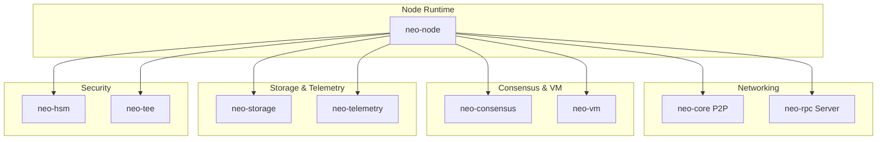
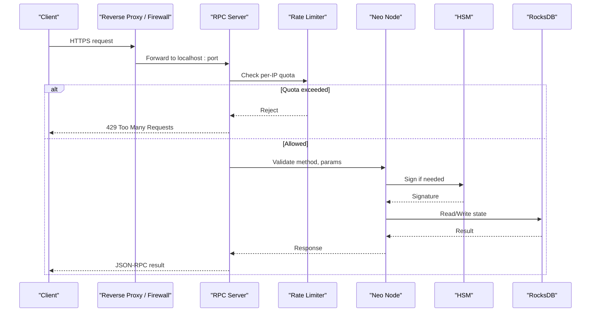
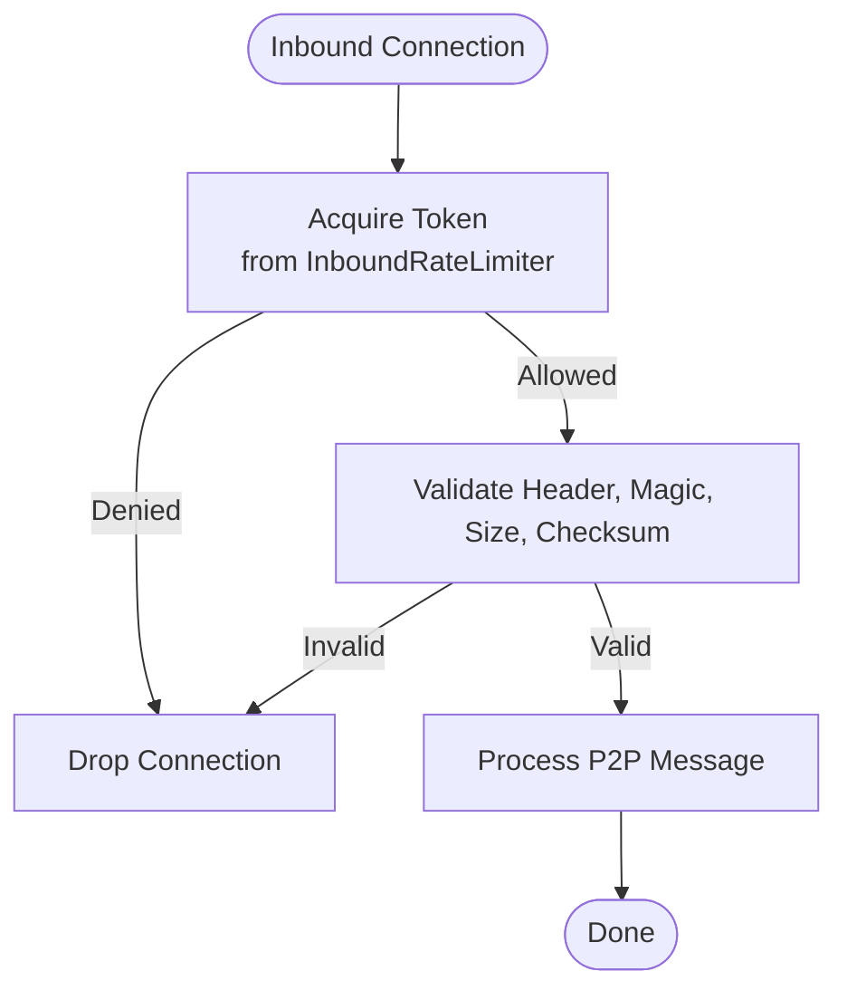
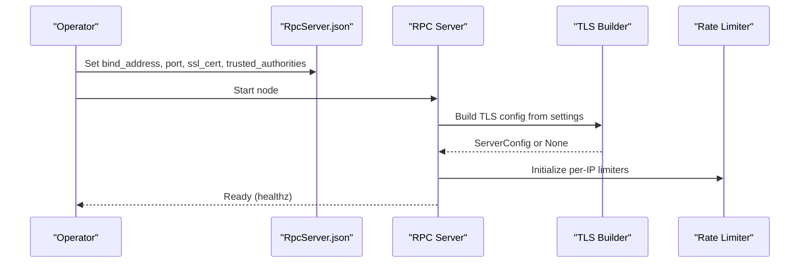
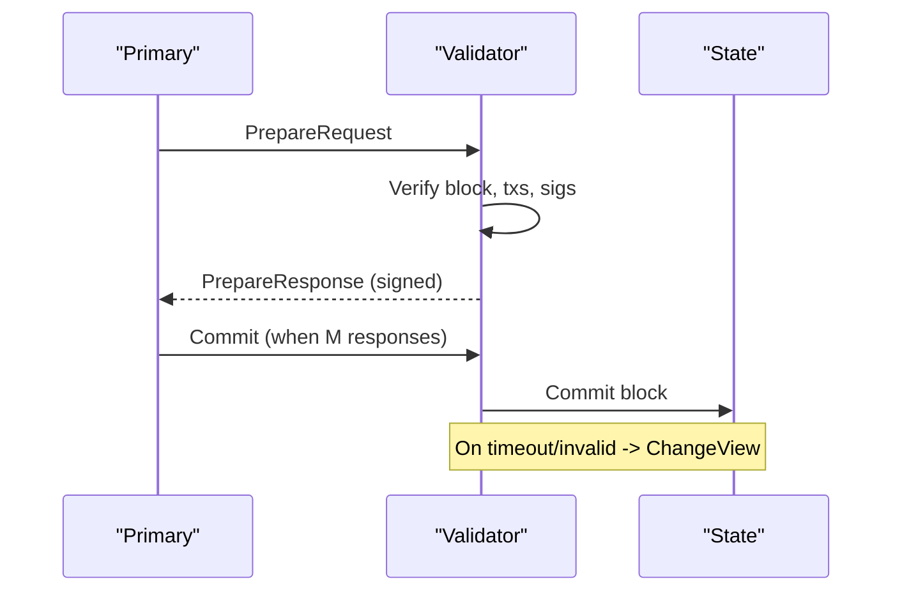
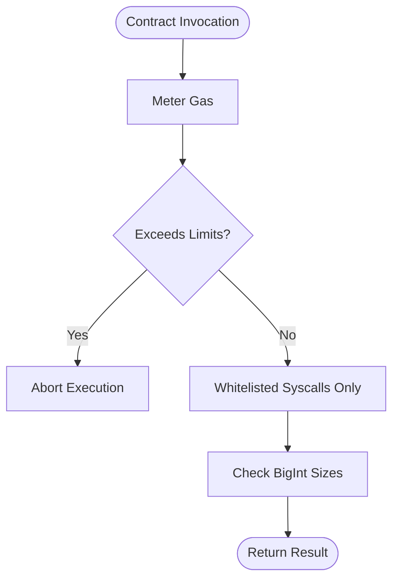
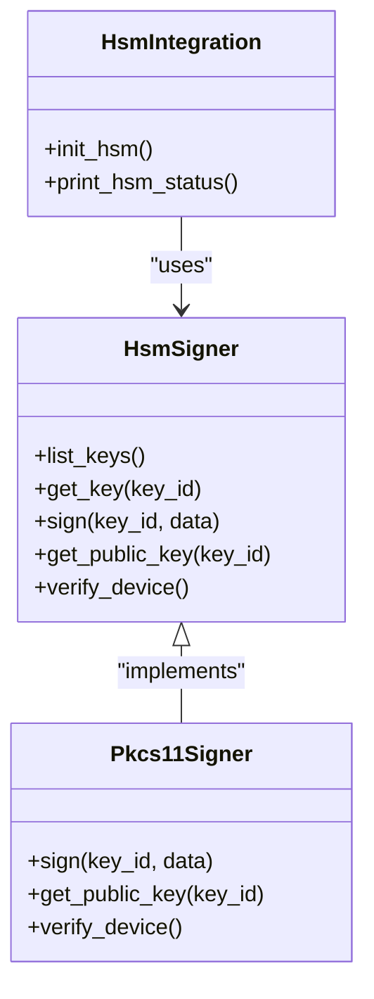
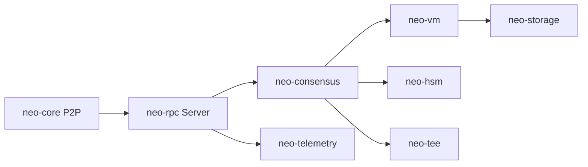

# Security Best Practices

<cite>
**Referenced Files in This Document**
- [SECURITY.md](file://SECURITY.md)
- [docs/SECURITY.md](file://docs/SECURITY.md)
- [neo-rpc/src/server/rpc_tls.rs](file://neo-rpc/src/server/rpc_tls.rs)
- [neo-rpc/src/server/middleware/rate_limiter.rs](file://neo-rpc/src/server/middleware/rate_limiter.rs)
- [neo-core/src/network/p2p/mod.rs](file://neo-core/src/network/p2p/mod.rs)
- [config/mainnet.toml](file://config/mainnet.toml)
- [neo-node/config/RpcServer/RpcServer.json](file://neo-node/config/RpcServer/RpcServer.json)
- [docs/RPC_HARDENING.md](file://docs/RPC_HARDENING.md)
- [scripts/security-check.sh](file://scripts/security-check.sh)
- [Dockerfile](file://Dockerfile)
- [neo-hsm/src/signer/hsm_signer.rs](file://neo-hsm/src/signer/hsm_signer.rs)
- [neo-hsm/src/pkcs11/pkcs11_signer.rs](file://neo-hsm/src/pkcs11/pkcs11_signer.rs)
- [neo-node/src/hsm_integration.rs](file://neo-node/src/hsm_integration.rs)
</cite>

## Table of Contents
1. Introduction
2. Project Structure
3. Core Components
4. Architecture Overview
5. Detailed Component Analysis
6. Dependency Analysis
7. Performance Considerations
8. Troubleshooting Guide
9. Conclusion
10. Appendices

## Introduction
This guide provides security best practices for Neo-RS node operators and developers. It covers secure configuration, network hardening, TLS and RPC server security, monitoring and logging, vulnerability assessment and audits, key management, backup and disaster recovery, environment-specific hardening (cloud, on-premises, containers), threat analysis for blockchain nodes, and operational checklists for deployment validation and ongoing maintenance.

## Project Structure
Neo-RS is a modular Rust project with clear separation between networking, consensus, VM execution, storage, telemetry, and the node runtime. Security-relevant components include:
- P2P networking with rate limiting and message validation
- RPC server with TLS support, authentication, CORS, and method filtering
- Consensus engine with dBFT safety properties and message verification
- VM sandboxing with gas limits and resource caps
- HSM/TEE integrations for secure signing and enclave-based operations
- Telemetry and logging for observability
- Docker image with non-root user and minimal runtime dependencies

**Section sources**
- [Dockerfile:1-129](file://Dockerfile#L1-L129)
- [neo-core/src/network/p2p/mod.rs:131-174](file://neo-core/src/network/p2p/mod.rs#L131-L174)
- [neo-rpc/src/server/rpc_tls.rs:1-66](file://neo-rpc/src/server/rpc_tls.rs#L1-L66)
- [neo-rpc/src/server/middleware/rate_limiter.rs:133-165](file://neo-rpc/src/server/middleware/rate_limiter.rs#L133-L165)

## Core Components
- P2P inbound rate limiter to mitigate connection floods and DoS
- RPC server with TLS, optional client certificate verification, per-IP rate limiting, CORS controls, and disabled methods
- dBFT consensus with strict message validation and view change handling
- VM sandboxing with gas metering and size/depth limits
- HSM integration for secure signing and device attestation
- TEE runtime modes for fail-closed or opportunistic secure enclaves
- Logging and metrics for incident detection and response

**Section sources**
- [neo-core/src/network/p2p/mod.rs:131-174](file://neo-core/src/network/p2p/mod.rs#L131-L174)
- [neo-rpc/src/server/rpc_tls.rs:1-66](file://neo-rpc/src/server/rpc_tls.rs#L1-L66)
- [neo-rpc/src/server/middleware/rate_limiter.rs:133-165](file://neo-rpc/src/server/middleware/rate_limiter.rs#L133-L165)
- [docs/SECURITY.md:337-480](file://docs/SECURITY.md#L337-L480)
- [docs/SECURITY.md:610-734](file://docs/SECURITY.md#L610-L734)
- [neo-hsm/src/signer/hsm_signer.rs:85-112](file://neo-hsm/src/signer/hsm_signer.rs#L85-L112)
- [neo-hsm/src/pkcs11/pkcs11_signer.rs:416-448](file://neo-hsm/src/pkcs11/pkcs11_signer.rs#L416-L448)
- [neo-node/src/hsm_integration.rs:148-204](file://neo-node/src/hsm_integration.rs#L148-L204)

## Architecture Overview
The node exposes untrusted interfaces (P2P, RPC) that are validated and rate-limited before reaching trusted compute zones (consensus, VM, crypto). TLS terminates at the RPC layer; HSM/TEE can be used for high-assurance signing and memory protection.

**Diagram sources**
- [neo-rpc/src/server/rpc_tls.rs:1-66](file://neo-rpc/src/server/rpc_tls.rs#L1-L66)
- [neo-rpc/src/server/middleware/rate_limiter.rs:133-165](file://neo-rpc/src/server/middleware/rate_limiter.rs#L133-L165)
- [neo-hsm/src/pkcs11/pkcs11_signer.rs:416-448](file://neo-hsm/src/pkcs11/pkcs11_signer.rs#L416-L448)

**Section sources**
- [docs/RPC_HARDENING.md:1-69](file://docs/RPC_HARDENING.md#L1-L69)
- [neo-rpc/src/server/rpc_tls.rs:1-66](file://neo-rpc/src/server/rpc_tls.rs#L1-L66)

## Detailed Component Analysis

### Network Security (P2P)
- Inbound connections are rate-limited using a token bucket to prevent connection floods.
- Message validation includes magic number checks, size limits, checksums, and command whitelisting.
- Peer reputation tracking helps penalize misbehaving peers.

**Diagram sources**
- [neo-core/src/network/p2p/mod.rs:131-174](file://neo-core/src/network/p2p/mod.rs#L131-L174)

**Section sources**
- [neo-core/src/network/p2p/mod.rs:131-174](file://neo-core/src/network/p2p/mod.rs#L131-L174)

### RPC Server Security
- Bind to loopback by default; expose via reverse proxy with TLS termination and auth.
- Optional built-in TLS from PKCS#12 with password verification and optional client CA trust.
- Per-IP rate limiting with configurable tiers; disable dangerous methods; enforce CORS policies.
- Use hardened CLI flags to force authentication and disable sensitive methods.

**Diagram sources**
- [neo-node/config/RpcServer/RpcServer.json:1-16](file://neo-node/config/RpcServer/RpcServer.json#L1-L16)
- [neo-rpc/src/server/rpc_tls.rs:1-66](file://neo-rpc/src/server/rpc_tls.rs#L1-L66)
- [neo-rpc/src/server/middleware/rate_limiter.rs:133-165](file://neo-rpc/src/server/middleware/rate_limiter.rs#L133-L165)

**Section sources**
- [docs/RPC_HARDENING.md:1-69](file://docs/RPC_HARDENING.md#L1-L69)
- [neo-rpc/src/server/rpc_tls.rs:1-66](file://neo-rpc/src/server/rpc_tls.rs#L1-L66)
- [neo-rpc/src/server/middleware/rate_limiter.rs:133-165](file://neo-rpc/src/server/middleware/rate_limiter.rs#L133-L165)
- [neo-node/config/RpcServer/RpcServer.json:1-16](file://neo-node/config/RpcServer/RpcServer.json#L1-L16)

### Consensus Security (dBFT)
- Safety guarantees: single-block finality, no forks, consistency among honest nodes.
- Strict validation of Prepare/Commit messages including view numbers, validator indices, signatures, and hashes.
- View change mechanism triggers when primary fails or sends invalid proposals.

**Diagram sources**
- [docs/SECURITY.md:337-480](file://docs/SECURITY.md#L337-L480)

**Section sources**
- [docs/SECURITY.md:337-480](file://docs/SECURITY.md#L337-L480)

### Smart Contract Execution (VM)
- Sandboxed execution with gas metering and strict limits on stack depth, item sizes, invocation depth, and instruction count.
- Syscall whitelist prevents arbitrary host access.
- BigInt size checks prevent memory exhaustion.

**Diagram sources**
- [docs/SECURITY.md:610-734](file://docs/SECURITY.md#L610-L734)

**Section sources**
- [docs/SECURITY.md:610-734](file://docs/SECURITY.md#L610-L734)

### Key Management and HSM/TEE
- HSM signer supports locking, key listing, signing with secp256r1, and device verification.
- PKCS#11 backend uses ECDSA with SHA-256 digest and returns standard signatures.
- TEE runtime modes: strict fail-closed or opportunistic fallback; logs device info and active key.

**Diagram sources**
- [neo-hsm/src/signer/hsm_signer.rs:85-112](file://neo-hsm/src/signer/hsm_signer.rs#L85-L112)
- [neo-hsm/src/pkcs11/pkcs11_signer.rs:416-448](file://neo-hsm/src/pkcs11/pkcs11_signer.rs#L416-L448)
- [neo-node/src/hsm_integration.rs:148-204](file://neo-node/src/hsm_integration.rs#L148-L204)

**Section sources**
- [neo-hsm/src/signer/hsm_signer.rs:85-112](file://neo-hsm/src/signer/hsm_signer.rs#L85-L112)
- [neo-hsm/src/pkcs11/pkcs11_signer.rs:416-448](file://neo-hsm/src/pkcs11/pkcs11_signer.rs#L416-L448)
- [neo-node/src/hsm_integration.rs:148-204](file://neo-node/src/hsm_integration.rs#L148-L204)
- [docs/SECURITY.md:276-335](file://docs/SECURITY.md#L276-L335)

### Monitoring and Logging
- Structured JSON logging with rotation and file paths configured per environment.
- Metrics endpoint available but disabled by default in production configs; enable selectively behind firewall.
- Health checks via HTTP healthz and RPC getversion for container orchestration.

**Section sources**
- [config/mainnet.toml:40-51](file://config/mainnet.toml#L40-L51)
- [Dockerfile:107-115](file://Dockerfile#L107-L115)

### Vulnerability Assessment and Audits
- Security policy defines supported versions and responsible disclosure process.
- Security-hardening specs require addressing audit findings prior to release and dependency scanning.
- CI security checks validate RNG usage, VM safeguards, unsafe code counts, and compilation.

**Section sources**
- [SECURITY.md:1-16](file://SECURITY.md#L1-L16)
- [openspec/specs/security-hardening/spec.md:1-23](file://openspec/specs/security-hardening/spec.md#L1-L23)
- [scripts/security-check.sh:1-73](file://scripts/security-check.sh#L1-L73)

### Secure Configuration for Production
- Bind RPC to loopback; use reverse proxy for TLS, auth, and rate limiting.
- Disable unnecessary methods; set strong credentials; configure CORS allowlists.
- Enforce network magic, restrict peer connections, and tune mempool/storage settings.

**Section sources**
- [docs/RPC_HARDENING.md:1-69](file://docs/RPC_HARDENING.md#L1-L69)
- [config/mainnet.toml:4-35](file://config/mainnet.toml#L4-L35)
- [neo-node/config/RpcServer/RpcServer.json:1-16](file://neo-node/config/RpcServer/RpcServer.json#L1-L16)

### Environment-Specific Hardening
- Cloud: Run behind managed load balancer with WAF; mount secrets via secret manager; isolate ports; enable structured logs and metrics; use read-only root filesystem where possible.
- On-premises: Place node in DMZ; restrict egress to seed nodes; use hardware-backed keys (HSM); segment storage and backups.
- Containerized: Multi-stage build, non-root user, minimal base image, health checks, volume mounts for data/logs, environment-driven secrets.

**Section sources**
- [Dockerfile:1-129](file://Dockerfile#L1-L129)

### Threat Analysis and Mitigations
- Network: Eclipse/Sybil/DDoS mitigated by rate limiting, peer reputation, and connection caps.
- Consensus: Byzantine tolerance enforced via dBFT thresholds and message validation; view changes recover from liveness issues.
- VM: Resource exhaustion prevented by gas limits, stack/item size caps, and syscall whitelisting.
- Cryptography: Secure RNG, constant-time comparisons, and HSM/TEE options reduce side-channel and key exposure risks.

**Section sources**
- [docs/SECURITY.md:42-167](file://docs/SECURITY.md#L42-L167)
- [docs/SECURITY.md:337-480](file://docs/SECURITY.md#L337-L480)
- [docs/SECURITY.md:610-734](file://docs/SECURITY.md#L610-L734)

## Dependency Analysis
Neo-RS composes multiple crates for networking, consensus, VM, storage, and telemetry. Security boundaries are enforced at each interface:
- P2P crate validates all inbound messages and applies rate limits.
- RPC crate enforces TLS, authentication, CORS, and method filtering.
- Consensus crate verifies signatures and enforces dBFT rules.
- VM crate isolates contract execution with gas and size limits.
- HSM/TEE crates provide secure signing and enclave isolation.

**Diagram sources**
- [neo-core/src/network/p2p/mod.rs:131-174](file://neo-core/src/network/p2p/mod.rs#L131-L174)
- [neo-rpc/src/server/rpc_tls.rs:1-66](file://neo-rpc/src/server/rpc_tls.rs#L1-L66)
- [neo-hsm/src/signer/hsm_signer.rs:85-112](file://neo-hsm/src/signer/hsm_signer.rs#L85-L112)

**Section sources**
- [neo-core/src/network/p2p/mod.rs:131-174](file://neo-core/src/network/p2p/mod.rs#L131-L174)
- [neo-rpc/src/server/rpc_tls.rs:1-66](file://neo-rpc/src/server/rpc_tls.rs#L1-L66)
- [neo-hsm/src/signer/hsm_signer.rs:85-112](file://neo-hsm/src/signer/hsm_signer.rs#L85-L112)

## Performance Considerations
- Tune P2P max connections and desired peers to balance resilience and resource usage.
- Configure RPC rate limits and iterator result caps to prevent heavy queries.
- Enable compression for P2P traffic to reduce bandwidth while maintaining security.
- Monitor metrics and logs to detect anomalies early.

[No sources needed since this section provides general guidance]

## Troubleshooting Guide
- TLS startup failures: Ensure PKCS#12 path exists, password is correct, and certificate chain is valid. If trusted authorities are configured, ensure at least one CA loads successfully.
- RPC blocked: Verify per-IP rate limits and disabled methods; confirm reverse proxy forwards only allowed endpoints.
- P2P connectivity issues: Check network magic, seed nodes, and inbound rate limiter thresholds.
- HSM errors: Confirm device readiness, PIN lock status, and key availability; review device info logs.

**Section sources**
- [neo-rpc/src/server/rpc_tls.rs:17-66](file://neo-rpc/src/server/rpc_tls.rs#L17-L66)
- [neo-rpc/src/server/middleware/rate_limiter.rs:133-165](file://neo-rpc/src/server/middleware/rate_limiter.rs#L133-L165)
- [neo-node/src/hsm_integration.rs:148-204](file://neo-node/src/hsm_integration.rs#L148-L204)

## Conclusion
Adopt layered security: harden network boundaries, enforce strict RPC controls, validate all inputs, isolate VM execution, and leverage HSM/TEE for high-assurance operations. Integrate continuous security checks, monitor logs and metrics, and maintain rigorous backup and recovery procedures. Follow the provided checklists to validate deployments and sustain long-term security posture.

## Appendices

### Deployment Validation Checklist
- Bind RPC to loopback and terminate TLS at reverse proxy
- Enable authentication and disable unnecessary RPC methods
- Configure per-IP rate limits and CORS allowlists
- Restrict P2P connections and set appropriate seed nodes
- Enable structured logging and metrics (internal only)
- Verify HSM/TEE initialization and active key selection
- Run security checks in CI/CD and validate compilation

**Section sources**
- [docs/RPC_HARDENING.md:1-69](file://docs/RPC_HARDENING.md#L1-L69)
- [config/mainnet.toml:4-51](file://config/mainnet.toml#L4-L51)
- [scripts/security-check.sh:1-73](file://scripts/security-check.sh#L1-L73)

### Ongoing Maintenance Procedures
- Apply latest security patches promptly; follow coordinated disclosure timelines
- Rotate TLS certificates and HSM credentials regularly
- Review and update rate limits and disabled methods based on usage patterns
- Audit logs for anomalies and perform periodic penetration tests
- Back up RocksDB data and state roots; test restore procedures

**Section sources**
- [SECURITY.md:1-16](file://SECURITY.md#L1-L16)
- [neo-rpc/src/server/rpc_tls.rs:17-66](file://neo-rpc/src/server/rpc_tls.rs#L17-L66)
- [neo-node/src/hsm_integration.rs:148-204](file://neo-node/src/hsm_integration.rs#L148-L204)