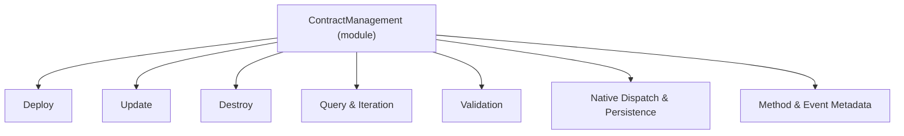
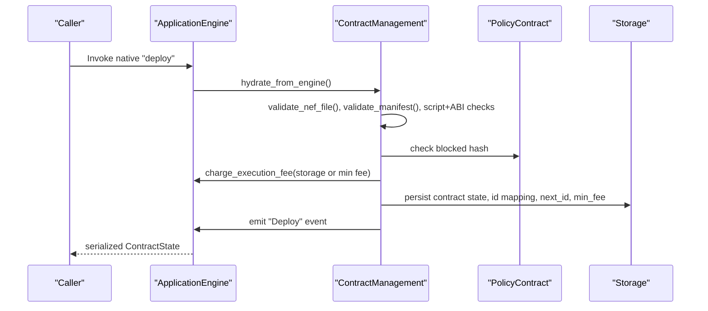
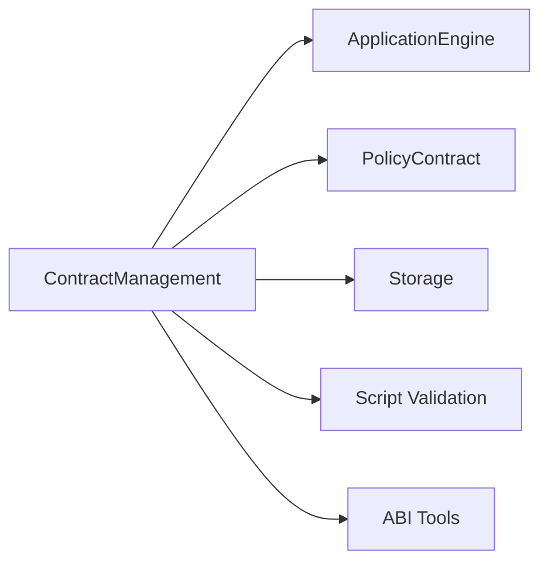

# Contract Management

<cite>
**Referenced Files in This Document**
- [mod.rs](file://neo-core/src/smart_contract/native/contract_management/mod.rs)
- [native_impl.rs](file://neo-core/src/smart_contract/native/contract_management/native_impl.rs)
- [deploy.rs](file://neo-core/src/smart_contract/native/contract_management/deploy.rs)
- [update.rs](file://neo-core/src/smart_contract/native/contract_management/update.rs)
- [destroy.rs](file://neo-core/src/smart_contract/native/contract_management/destroy.rs)
- [query.rs](file://neo-core/src/smart_contract/native/contract_management/query.rs)
- [validation.rs](file://neo-core/src/smart_contract/native/contract_management/validation.rs)
- [metadata.rs](file://neo-core/src/smart_contract/native/contract_management/metadata.rs)
</cite>

## Table of Contents
1. Introduction
2. Project Structure
3. Core Components
4. Architecture Overview
5. Detailed Component Analysis
6. Dependency Analysis
7. Performance Considerations
8. Troubleshooting Guide
9. Conclusion

## Introduction
This document provides comprehensive documentation for the ContractManagement native contract, which manages the lifecycle of smart contracts on the Neo blockchain. It covers deployment, updates, destruction, and query methods; explains manifest validation, bytecode verification, gas costs, parameter types, return values, and error conditions; and outlines upgrade procedures, security considerations, and relationships with other native contracts and system components.

## Project Structure
The ContractManagement native contract is implemented as a modular Rust module under the smart contract subsystem. The key files are:
- Module entry and core structures: mod.rs
- Native method dispatch and persistence hooks: native_impl.rs
- Lifecycle operations: deploy.rs, update.rs, destroy.rs
- Querying and iteration utilities: query.rs
- Validation helpers: validation.rs
- Method and event metadata: metadata.rs

**Diagram sources**
- [mod.rs:1-242](file://neo-core/src/smart_contract/native/contract_management/mod.rs#L1-L242)
- [native_impl.rs:28-369](file://neo-core/src/smart_contract/native/contract_management/native_impl.rs#L28-L369)
- [deploy.rs:1-202](file://neo-core/src/smart_contract/native/contract_management/deploy.rs#L1-L202)
- [update.rs:1-166](file://neo-core/src/smart_contract/native/contract_management/update.rs#L1-L166)
- [destroy.rs:1-81](file://neo-core/src/smart_contract/native/contract_management/destroy.rs#L1-L81)
- [query.rs:1-257](file://neo-core/src/smart_contract/native/contract_management/query.rs#L1-L257)
- [validation.rs:1-263](file://neo-core/src/smart_contract/native/contract_management/validation.rs#L1-L263)
- [metadata.rs:1-33](file://neo-core/src/smart_contract/native/contract_management/metadata.rs#L1-L33)

**Section sources**
- [mod.rs:1-242](file://neo-core/src/smart_contract/native/contract_management/mod.rs#L1-L242)

## Core Components
- ContractStorage: In-memory cache of deployed contracts, ID-to-hash mappings, next available ID, minimum deployment fee, and contract count.
- ContractManagement: Native contract instance providing lifecycle methods, storage keys, serialization helpers, and hydration from engine storage.
- Native dispatch: Maps external calls to internal methods, serializes results, and persists state changes during block persist.

Key responsibilities:
- Enforce policy checks and hardfork-specific behavior.
- Validate NEF files, manifests, scripts, and ABI consistency.
- Manage storage prefixes for contracts, IDs, fees, and counters.
- Emit lifecycle events and invoke optional _deploy hooks.

**Section sources**
- [mod.rs:40-229](file://neo-core/src/smart_contract/native/contract_management/mod.rs#L40-L229)
- [native_impl.rs:28-113](file://neo-core/src/smart_contract/native/contract_management/native_impl.rs#L28-L113)

## Architecture Overview
The ContractManagement native contract integrates with the ApplicationEngine, PolicyContract, and storage layers. It validates inputs, charges fees, persists metadata, and emits events. Updates may trigger re-validation and cache refreshes to ensure subsequent calls use the latest code and manifest.

**Diagram sources**
- [native_impl.rs:57-113](file://neo-core/src/smart_contract/native/contract_management/native_impl.rs#L57-L113)
- [deploy.rs:16-200](file://neo-core/src/smart_contract/native/contract_management/deploy.rs#L16-L200)
- [validation.rs:28-117](file://neo-core/src/smart_contract/native/contract_management/validation.rs#L28-L117)

**Section sources**
- [native_impl.rs:57-113](file://neo-core/src/smart_contract/native/contract_management/native_impl.rs#L57-L113)
- [deploy.rs:16-200](file://neo-core/src/smart_contract/native/contract_management/deploy.rs#L16-L200)

## Detailed Component Analysis

### Deploy
Purpose:
- Register a new contract with validated NEF and manifest, compute deterministic hash, enforce policy and hardfork rules, charge appropriate fees, persist metadata, optionally call _deploy, and emit an event.

Parameters:
- nefFile: ByteArray (NEF file bytes)
- manifest: ByteArray (JSON manifest)
- data: Any (optional initialization payload)

Return value:
- Array representing serialized ContractState

Gas cost:
- Storage fee based on payload size multiplied by storage price, or at least the minimum deployment fee, whichever is larger. Additional execution overhead applies.

Validation and checks:
- Non-empty NEF and manifest; manifest length within limits.
- Hardfork guard requiring full call flags for certain versions.
- NEF checksum validity and script size constraints.
- Manifest JSON parsing and validation; group signature verification; manifest serialization feasibility.
- Script validation against strictness flag; ABI offsets verified against script instructions; no duplicate methods/events.
- Policy check: contract hash not blocked.
- Duplicate deployment prevention via in-memory cache and persisted state.

Side effects:
- Persists contract state, ID mapping, next available ID, and minimum deployment fee.
- Invokes _deploy if present.
- Emits "Deploy" event.

Error conditions:
- Invalid arguments, deserialization errors, invalid NEF/manifest/script/ABI, policy block, duplicate deployment, overflow in fee calculations.

Upgrade procedure note:
- Use Update to replace NEF/manifest while preserving identity.

**Section sources**
- [deploy.rs:16-200](file://neo-core/src/smart_contract/native/contract_management/deploy.rs#L16-L200)
- [validation.rs:28-117](file://neo-core/src/smart_contract/native/contract_management/validation.rs#L28-L117)
- [native_impl.rs:91-113](file://neo-core/src/smart_contract/native/contract_management/native_impl.rs#L91-L113)

### Update
Purpose:
- Replace a contract’s NEF and/or manifest, re-validate, charge storage fee for provided payloads, increment update counter, refresh caches, optionally call _deploy as an update hook, and emit an event.

Parameters:
- nefFile: ByteArray (optional; empty means no change)
- manifest: ByteArray (optional; empty means no change)
- data: Any (optional initialization payload for update hook)

Return value:
- Void

Gas cost:
- Storage fee proportional to the size of provided NEF and/or manifest payloads.

Validation and checks:
- At least one of NEF or manifest must be non-empty.
- Hardfork guard requiring full call flags for certain versions.
- NEF and manifest parsing and validation; name cannot be changed.
- Script validation and ABI consistency checks.
- Whitelist cleanup using old manifest before applying updates.

Side effects:
- Persists updated contract state.
- Refreshes per-tx contract cache so queued _deploy uses new code/manifest.
- Invokes _deploy if present (with update flag).
- Emits "Update" event.

Error conditions:
- Invalid arguments, deserialization errors, invalid NEF/manifest/script/ABI, maximum update counter reached.

**Section sources**
- [update.rs:12-166](file://neo-core/src/smart_contract/native/contract_management/update.rs#L12-L166)
- [native_impl.rs:114-140](file://neo-core/src/smart_contract/native/contract_management/native_impl.rs#L114-L140)

### Destroy
Purpose:
- Remove a contract’s metadata and storage, block the contract hash to prevent redeployment without governance approval, clean whitelist entries, and emit an event.

Parameters:
- None

Return value:
- Void

Behavior differences by hardfork:
- Pre-Gorgon: erase storage first, then block account.
- Gorgon+: block account first, then erase storage to preserve visibility for side effects like vote-revoke callbacks.

Side effects:
- Removes contract state and ID mappings.
- Clears all contract storage.
- Blocks contract hash and cleans whitelist entries.
- Emits "Destroy" event.

Error conditions:
- No calling context, contract not found.

**Section sources**
- [destroy.rs:7-81](file://neo-core/src/smart_contract/native/contract_management/destroy.rs#L7-L81)

### Query Methods
Methods:
- getContract(hash): Returns serialized ContractState or empty array if not found.
- getContractById(id): Returns serialized ContractState or empty array if not found.
- hasMethod(hash, method, parameterCount): Boolean indicating presence of method in ABI.
- isContract(hash): Presence check against snapshot (active after specific hardfork).
- getMinimumDeploymentFee(): Current minimum deployment fee.
- setMinimumDeploymentFee(value): Committee-only setter for minimum deployment fee.
- getContractHashes(): Iterator over non-native contract hashes.

Return values:
- Serialized arrays for contract objects, booleans for checks, integer for fee, iterator handle for hashes.

Notes:
- Iterators are registered with the engine and consumed via storage iterators.
- Snapshot-based lookups support consistent reads across blocks.

**Section sources**
- [native_impl.rs:67-231](file://neo-core/src/smart_contract/native/contract_management/native_impl.rs#L67-L231)
- [query.rs:13-257](file://neo-core/src/smart_contract/native/contract_management/query.rs#L13-L257)

### Validation Helpers
Responsibilities:
- NEF validation: non-empty script, size within limits, checksum correctness.
- Manifest validation: structure, group signatures, serialization feasibility.
- Script and ABI validation: method offsets valid, no duplicates; event names unique.
- Hydration and integrity checks: rebuild in-memory state from storage, detect corruption, reconcile IDs and mappings.

Complexity:
- Linear in number of methods/events and storage entries scanned during hydration.

**Section sources**
- [validation.rs:28-117](file://neo-core/src/smart_contract/native/contract_management/validation.rs#L28-L117)
- [validation.rs:119-263](file://neo-core/src/smart_contract/native/contract_management/validation.rs#L119-L263)

### Method and Event Metadata
- Exposes native methods with associated fees and flags.
- Declares lifecycle events: Deploy, Update, Destroy.

Flags:
- READ_STATES for read-only queries.
- STATES and ALLOW_NOTIFY for write operations that modify state and emit notifications.

**Section sources**
- [metadata.rs:7-33](file://neo-core/src/smart_contract/native/contract_management/metadata.rs#L7-L33)

## Dependency Analysis
ContractManagement depends on:
- ApplicationEngine: execution context, storage access, fee charging, event emission, hardfork checks, contract cache management.
- PolicyContract: blocking/unblocking accounts, whitelist cleanup.
- Storage layer: native storage context and persistence hooks.
- Script validation and ABI tools: ensure code and interface consistency.

**Diagram sources**
- [deploy.rs:16-200](file://neo-core/src/smart_contract/native/contract_management/deploy.rs#L16-L200)
- [update.rs:12-166](file://neo-core/src/smart_contract/native/contract_management/update.rs#L12-L166)
- [destroy.rs:7-81](file://neo-core/src/smart_contract/native/contract_management/destroy.rs#L7-L81)
- [native_impl.rs:243-369](file://neo-core/src/smart_contract/native/contract_management/native_impl.rs#L243-L369)

**Section sources**
- [deploy.rs:16-200](file://neo-core/src/smart_contract/native/contract_management/deploy.rs#L16-L200)
- [update.rs:12-166](file://neo-core/src/smart_contract/native/contract_management/update.rs#L12-L166)
- [destroy.rs:7-81](file://neo-core/src/smart_contract/native/contract_management/destroy.rs#L7-L81)
- [native_impl.rs:243-369](file://neo-core/src/smart_contract/native/contract_management/native_impl.rs#L243-L369)

## Performance Considerations
- Fee calculation uses safe arithmetic to avoid overflows; storage fees scale linearly with payload sizes.
- Hydration rebuilds in-memory state from storage on initialize and invoke; this ensures consistency but incurs O(n) work over stored entries.
- Iterators for contract hashes sort entries by suffix to provide deterministic ordering; consider limiting consumption in callers.
- Persisted writes are optimized with “put if changed” logic to reduce redundant storage operations during block persist.

[No sources needed since this section provides general guidance]

## Troubleshooting Guide
Common errors and causes:
- Invalid argument: wrong number or type of parameters; out-of-range values.
- Deserialization errors: malformed NEF or manifest; invalid encoding.
- Invalid data: NEF checksum mismatch, script too large, invalid ABI offsets, duplicate methods/events.
- Invalid operation: missing calling context, contract not found, policy block, insufficient permissions (committee required for fee setting), hardfork flag restrictions.
- Native contract errors: unknown method invocation.

Debugging tips:
- Verify NEF checksum and script size constraints.
- Ensure manifest JSON is valid and within allowed size; confirm group signatures match contract hash.
- Check hardfork settings when invoking deploy/update; some require full call flags.
- Confirm committee witness for setMinimumDeploymentFee.
- Inspect storage keys and values via native storage context to validate persisted state.

**Section sources**
- [deploy.rs:26-139](file://neo-core/src/smart_contract/native/contract_management/deploy.rs#L26-L139)
- [update.rs:20-88](file://neo-core/src/smart_contract/native/contract_management/update.rs#L20-L88)
- [destroy.rs:10-35](file://neo-core/src/smart_contract/native/contract_management/destroy.rs#L10-L35)
- [native_impl.rs:67-231](file://neo-core/src/smart_contract/native/contract_management/native_impl.rs#L67-L231)

## Conclusion
The ContractManagement native contract provides a robust, validated, and secure mechanism for deploying, updating, destroying, and querying smart contracts on Neo. It enforces strict validation of NEF and manifest content, aligns with hardfork behaviors, integrates with policy controls, and maintains consistent state through careful persistence and hydration. Proper use of its APIs ensures reliable contract lifecycle management and interoperability with other system components.

[No sources needed since this section summarizes without analyzing specific files]