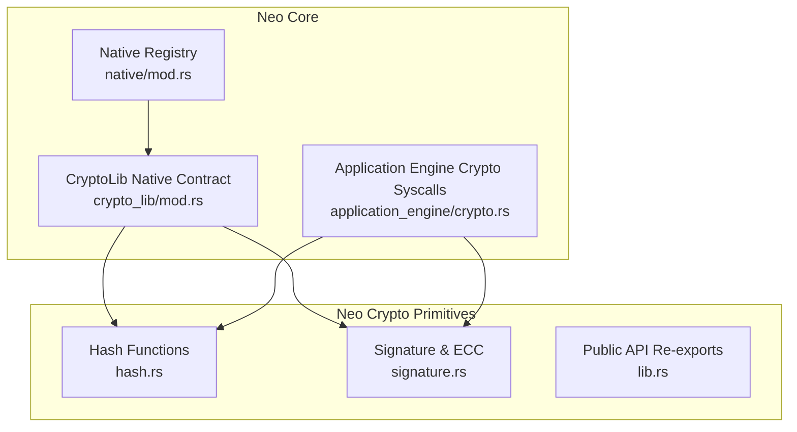
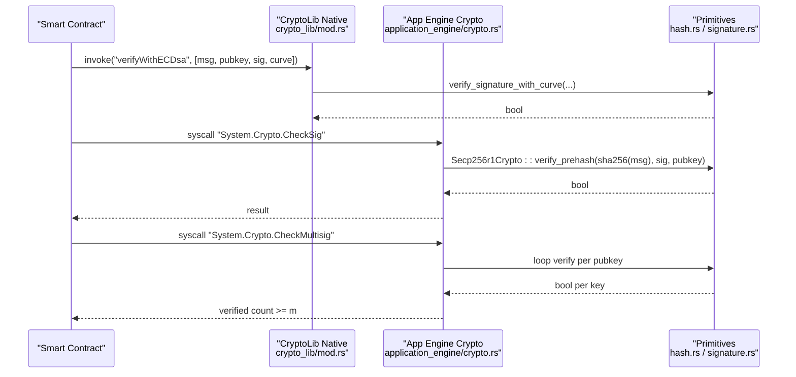
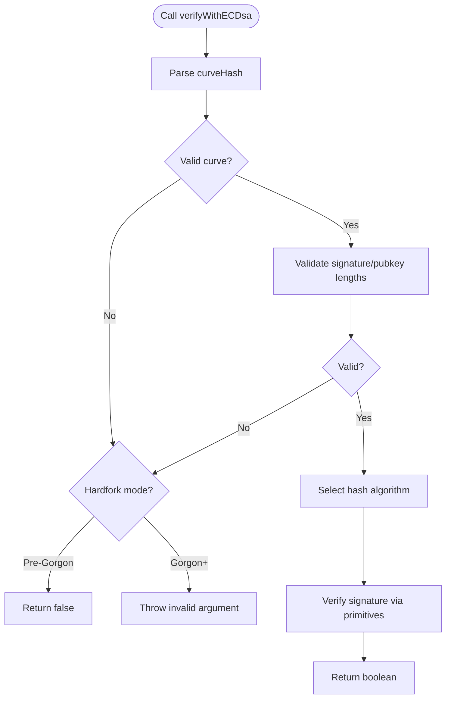
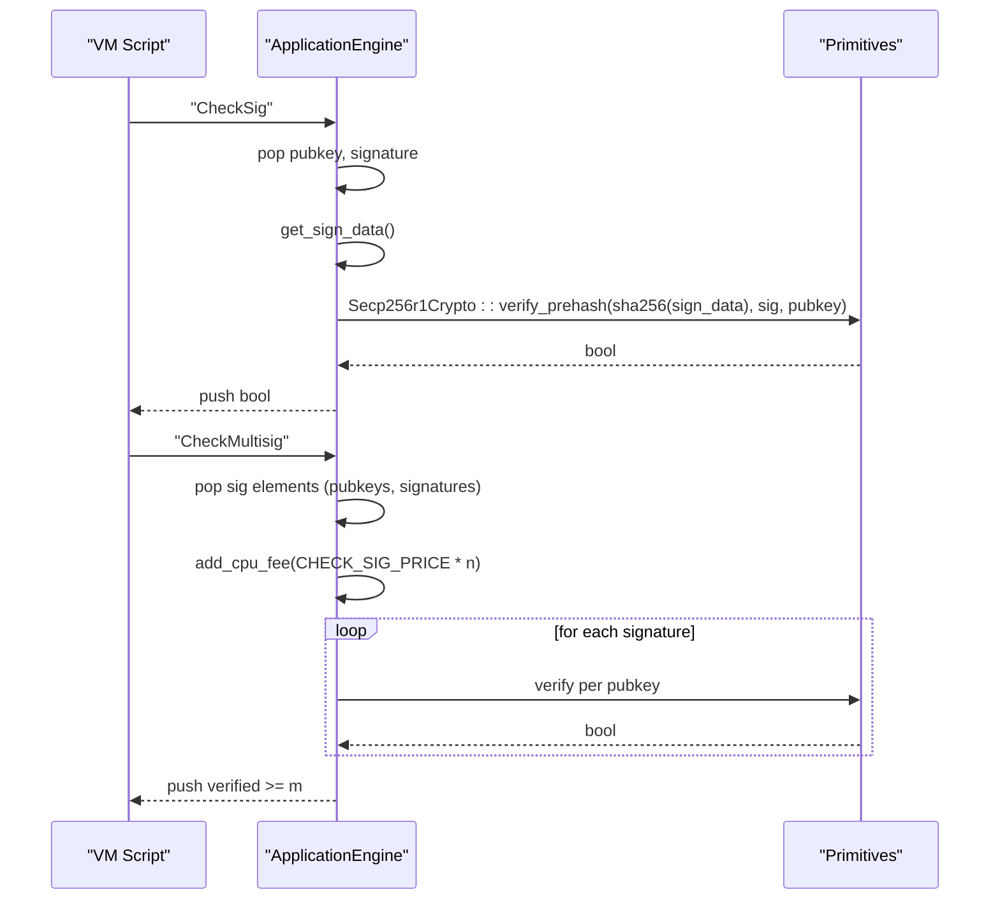
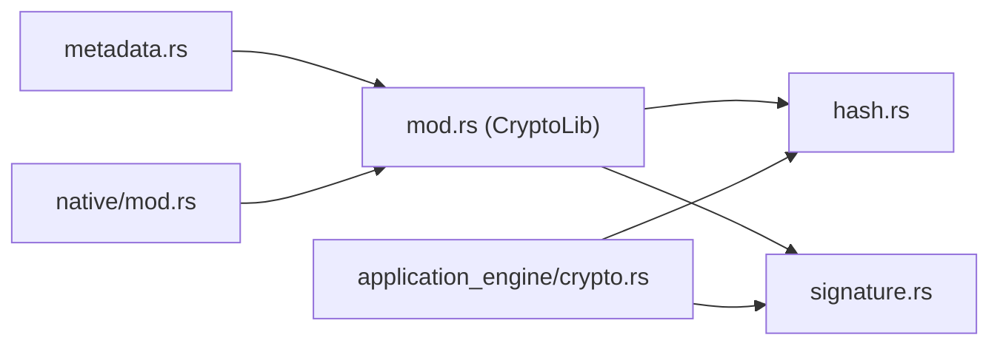
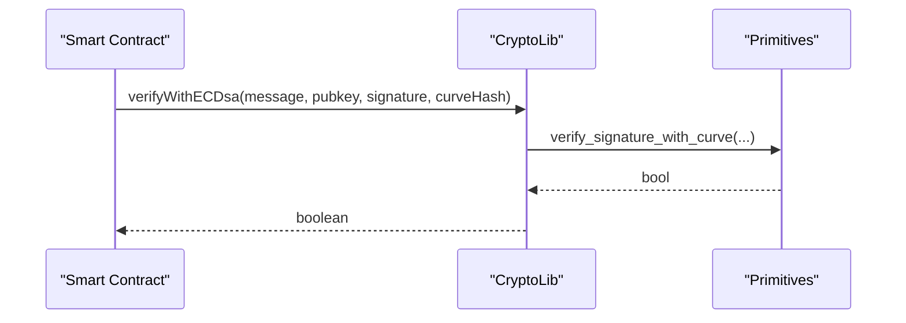
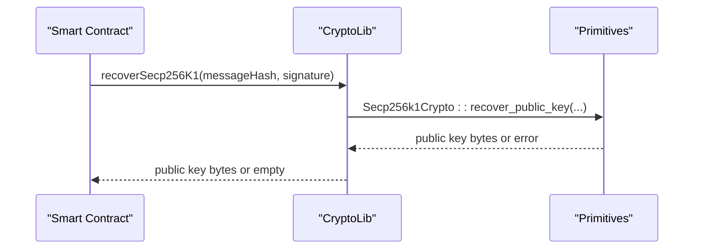

# CryptoLib

<cite>
**Referenced Files in This Document**
- [crypto_lib/mod.rs](file://neo-core/src/smart_contract/native/crypto_lib/mod.rs)
- [crypto_lib/metadata.rs](file://neo-core/src/smart_contract/native/crypto_lib/metadata.rs)
- [application_engine/crypto.rs](file://neo-core/src/smart_contract/application_engine/crypto.rs)
- [hash.rs](file://neo-crypto/src/hash.rs)
- [signature.rs](file://neo-crypto/src/signature.rs)
- [lib.rs](file://neo-crypto/src/lib.rs)
- [native/mod.rs](file://neo-core/src/smart_contract/native/mod.rs)
</cite>

## Table of Contents
1. [Introduction](#introduction)
2. [Project Structure](#project-structure)
3. [Core Components](#core-components)
4. [Architecture Overview](#architecture-overview)
5. [Detailed Component Analysis](#detailed-component-analysis)
6. [Dependency Analysis](#dependency-analysis)
7. [Performance Considerations](#performance-considerations)
8. [Troubleshooting Guide](#troubleshooting-guide)
9. [Conclusion](#conclusion)
10. [Appendices](#appendices)

## Introduction
This document provides comprehensive documentation for the CryptoLib native contract that exposes cryptographic primitives to Neo smart contracts. It covers hash functions (SHA-256, RIPEMD-160), signature verification (ECDSA on secp256r1 and secp256k1, Ed25519), hashing utilities (Keccak-256, Murmur32, Hash160/Hash256), and public key recovery for secp256k1. For each operation, it specifies method signatures, input formats, output types, gas costs where applicable, and common workflows such as signature verification and hash computation. It also includes performance considerations and security best practices for using cryptographic functions in smart contracts.

## Project Structure
CryptoLib is implemented as a native contract under the Neo core module and relies on shared cryptographic primitives from the neo-crypto crate. The application engine exposes additional interop services for CheckSig and CheckMultisig used by witness verification.



**Diagram sources**
- [crypto_lib/mod.rs:1-343](file://neo-core/src/smart_contract/native/crypto_lib/mod.rs#L1-L343)
- [native/mod.rs:160-197](file://neo-core/src/smart_contract/native/mod.rs#L160-L197)
- [application_engine/crypto.rs:17-170](file://neo-core/src/smart_contract/application_engine/crypto.rs#L17-L170)
- [hash.rs:84-301](file://neo-crypto/src/hash.rs#L84-L301)
- [signature.rs:26-320](file://neo-crypto/src/signature.rs#L26-L320)
- [lib.rs:61-78](file://neo-crypto/src/lib.rs#L61-L78)

**Section sources**
- [native/mod.rs:160-197](file://neo-core/src/smart_contract/native/mod.rs#L160-L197)
- [crypto_lib/mod.rs:22-44](file://neo-core/src/smart_contract/native/crypto_lib/mod.rs#L22-L44)

## Core Components
- CryptoLib native contract methods:
  - sha256(data): returns 32-byte SHA-256 digest
  - ripemd160(data): returns 20-byte RIPEMD-160 digest
  - murmur32(data, seed): returns 4-byte little-endian Murmur32 hash
  - keccak256(data): returns 32-byte Keccak-256 digest (Cockatrice+)
  - verifyWithECDsa(message, pubkey, signature, curveHash): returns boolean; supports secp256r1/secp256k1 with configurable hash algorithm depending on hardfork
  - verifyWithEd25519(message, pubkey, signature): returns boolean; Ed25519 verification
  - recoverSecp256K1(messageHash, signature): returns compressed secp256k1 public key or empty on failure
- Application Engine crypto syscalls:
  - System.Crypto.CheckSig: verifies a single secp256r1 signature against message-derived data
  - System.Crypto.CheckMultisig: verifies m-of-n multisig with secp256r1 keys and signatures
- Shared crypto primitives:
  - Hashing: SHA-256, SHA-512, Keccak-256, RIPEMD-160, Blake2b/s, Hash160, Hash256
  - Signatures: ECDSA on secp256r1 and secp256k1, Ed25519, public key recovery for secp256k1

**Section sources**
- [crypto_lib/metadata.rs:10-25](file://neo-core/src/smart_contract/native/crypto_lib/metadata.rs#L10-L25)
- [crypto_lib/mod.rs:46-227](file://neo-core/src/smart_contract/native/crypto_lib/mod.rs#L46-L227)
- [application_engine/crypto.rs:17-170](file://neo-core/src/smart_contract/application_engine/crypto.rs#L17-L170)
- [hash.rs:84-301](file://neo-crypto/src/hash.rs#L84-L301)
- [signature.rs:26-320](file://neo-crypto/src/signature.rs#L26-L320)

## Architecture Overview
The CryptoLib native contract dispatches calls to underlying crypto primitives. Signature verification paths differ based on curve and hardfork settings. The application engine registers host services for CheckSig and CheckMultisig, which are invoked by VM scripts during witness verification.



**Diagram sources**
- [crypto_lib/mod.rs:88-154](file://neo-core/src/smart_contract/native/crypto_lib/mod.rs#L88-L154)
- [application_engine/crypto.rs:17-170](file://neo-core/src/smart_contract/application_engine/crypto.rs#L17-L170)
- [signature.rs:474-511](file://neo-crypto/src/signature.rs#L474-L511)
- [hash.rs:84-104](file://neo-crypto/src/hash.rs#L84-L104)

## Detailed Component Analysis

### CryptoLib Methods
- sha256(data) -> bytes[32]
  - Input: arbitrary byte array
  - Output: 32-byte SHA-256 digest
  - Gas: fee = 1 << 15
  - Notes: Uses shared Crypto::sha256
- ripemd160(data) -> bytes[20]
  - Input: arbitrary byte array
  - Output: 20-byte RIPEMD-160 digest
  - Gas: fee = 1 << 15
  - Notes: Uses shared Crypto::ripemd160
- murmur32(data, seed) -> bytes[4]
  - Input: data (byte array), seed (signed integer)
  - Output: 4-byte little-endian hash
  - Gas: fee = 1 << 13
  - Notes: Seed parsed as u32; invalid seed returns error
- keccak256(data) -> bytes[32]
  - Input: arbitrary byte array
  - Output: 32-byte Keccak-256 digest
  - Gas: fee = 1 << 15
  - Availability: active after HfCockatrice
- verifyWithECDsa(message, pubkey, signature, curveHash) -> boolean
  - Inputs:
    - message: arbitrary bytes
    - pubkey: SEC1-encoded point (secp256r1: 33 or 65 bytes; secp256k1: 33 bytes)
    - signature: 64 bytes raw ECDSA
    - curveHash: integer encoding NamedCurveHash
  - Output: boolean
  - Gas: fee = 1 << 15
  - Behavior:
    - Pre-Cockatrice: only secp256k1-SHA256 and secp256r1-SHA256 supported
    - Cockatrice..Gorgon: malformed inputs degrade to false
    - Gorgon+: malformed inputs throw; curve selection determines hash algorithm
- verifyWithEd25519(message, pubkey, signature) -> boolean
  - Inputs:
    - message: arbitrary bytes
    - pubkey: 32 bytes
    - signature: 64 bytes
  - Output: boolean
  - Gas: fee = 1 << 15
  - Behavior: Echidna..Gorgon degrades malformed inputs to false; Gorgon+ throws on bad sizes
- recoverSecp256K1(messageHash, signature) -> bytes
  - Inputs:
    - messageHash: 32 bytes
    - signature: 64 or 65 bytes (supports compact and standard forms)
  - Output: compressed secp256k1 public key bytes or empty vector on failure
  - Gas: fee = 1 << 15
  - Availability: active after HfEchidna



**Diagram sources**
- [crypto_lib/mod.rs:88-154](file://neo-core/src/smart_contract/native/crypto_lib/mod.rs#L88-L154)
- [crypto_lib/metadata.rs:15-17](file://neo-core/src/smart_contract/native/crypto_lib/metadata.rs#L15-L17)

**Section sources**
- [crypto_lib/metadata.rs:10-25](file://neo-core/src/smart_contract/native/crypto_lib/metadata.rs#L10-L25)
- [crypto_lib/mod.rs:46-227](file://neo-core/src/smart_contract/native/crypto_lib/mod.rs#L46-L227)

### Application Engine Crypto Syscalls
- System.Crypto.CheckSig
  - Stack order: pushes signature then public key; pops pubkey first
  - Computes sign data as network prefix + container hash
  - Verifies secp256r1 signature over SHA-256 prehash
  - Gas: base price CHECK_SIG_PRICE = 1 << 15
- System.Crypto.CheckMultisig
  - Accepts either Array format or N+items format for pubkeys and signatures
  - Validates counts and charges CPU fee proportional to number of keys
  - Verifies m-of-n secp256r1 signatures; early exit optimization when remaining signatures exceed remaining keys
  - Gas: base price 0; per-key cost CHECK_SIG_PRICE * n



**Diagram sources**
- [application_engine/crypto.rs:17-170](file://neo-core/src/smart_contract/application_engine/crypto.rs#L17-L170)

**Section sources**
- [application_engine/crypto.rs:10-170](file://neo-core/src/smart_contract/application_engine/crypto.rs#L10-L170)

### Hashing Utilities
- SHA-256: 32 bytes
- RIPEMD-160: 20 bytes
- Keccak-256: 32 bytes (Ethereum compatibility)
- Hash160: RIPEMD160(SHA256(data))
- Hash256: SHA256(SHA256(data))
- Blake2b/Blake2s: optional salt support for Blake2b

These utilities are exposed via the shared Crypto interface and used by both CryptoLib and application engine logic.

**Section sources**
- [hash.rs:84-301](file://neo-crypto/src/hash.rs#L84-L301)

### Signature Verification and Key Recovery
- ECDSA secp256r1:
  - verify_prehash(message_digest_32, signature_64, pubkey_sec1)
  - Used by CheckSig and CryptoLib verifyWithECDsa for secp256r1
- ECDSA secp256k1:
  - verify(message, signature_64, pubkey_33)
  - recover_public_key(message_hash_32, signature_64_or_65)
- Ed25519:
  - verify(message, signature_64, pubkey_32)

**Section sources**
- [signature.rs:26-143](file://neo-crypto/src/signature.rs#L26-L143)
- [signature.rs:145-320](file://neo-crypto/src/signature.rs#L145-L320)
- [signature.rs:474-559](file://neo-crypto/src/signature.rs#L474-L559)

## Dependency Analysis
CryptoLib depends on:
- Native method table and dispatch macros
- Hardfork-aware behavior via ApplicationEngine
- Shared crypto primitives for hashing and signature operations



**Diagram sources**
- [crypto_lib/metadata.rs:1-44](file://neo-core/src/smart_contract/native/crypto_lib/metadata.rs#L1-L44)
- [crypto_lib/mod.rs:1-343](file://neo-core/src/smart_contract/native/crypto_lib/mod.rs#L1-L343)
- [application_engine/crypto.rs:17-170](file://neo-core/src/smart_contract/application_engine/crypto.rs#L17-L170)
- [hash.rs:84-301](file://neo-crypto/src/hash.rs#L84-L301)
- [signature.rs:26-320](file://neo-crypto/src/signature.rs#L26-L320)
- [native/mod.rs:160-197](file://neo-core/src/smart_contract/native/mod.rs#L160-L197)

**Section sources**
- [native/mod.rs:160-197](file://neo-core/src/smart_contract/native/mod.rs#L160-L197)
- [crypto_lib/mod.rs:1-343](file://neo-core/src/smart_contract/native/crypto_lib/mod.rs#L1-L343)

## Performance Considerations
- Gas costs:
  - CryptoLib methods generally charge 1 << 15 except murmur32 at 1 << 13
  - CheckMultisig charges per public key: CHECK_SIG_PRICE * n
- Early exits:
  - CheckMultisig stops verifying once remaining signatures exceed remaining keys
- Algorithm selection:
  - Pre-Gorgon verifyWithECDsa restricts curves/hashes to reduce overhead
  - Gorgon+ enforces stricter validation to avoid silent failures
- Hashing efficiency:
  - Use prehashed inputs where available (e.g., verify_prehash) to avoid redundant hashing
- Constant-time comparisons:
  - Use constant-time hash equality helpers in security-sensitive contexts to mitigate timing side-channels

[No sources needed since this section provides general guidance]

## Troubleshooting Guide
Common issues and resolutions:
- Invalid public key length:
  - secp256r1 accepts 33 or 65 bytes; secp256k1 expects 33 bytes
  - Ensure SEC1 encoding and correct curve
- Invalid signature length:
  - ECDSA requires 64 bytes; Ed25519 requires 64 bytes
  - recoverSecp256K1 accepts 64 or 65 bytes
- Hardfork-specific behavior:
  - Pre-Gorgon: malformed inputs may return false instead of throwing
  - Gorgon+: malformed inputs throw errors; validate inputs strictly
- Unsupported curve/hash combinations:
  - Pre-Cockatrice: only specific combinations allowed
  - Cockatrice/Gorgon: ensure curveHash matches expected values

**Section sources**
- [application_engine/crypto.rs:144-170](file://neo-core/src/smart_contract/application_engine/crypto.rs#L144-L170)
- [crypto_lib/mod.rs:88-227](file://neo-core/src/smart_contract/native/crypto_lib/mod.rs#L88-L227)

## Conclusion
CryptoLib provides essential cryptographic primitives for Neo smart contracts, including hashing, signature verification across multiple curves, and public key recovery. Its integration with the application engine enables efficient witness verification through CheckSig and CheckMultisig. Developers should adhere to hardfork-specific behaviors, validate inputs rigorously, and consider gas costs and performance optimizations when designing cryptographic workflows.

[No sources needed since this section summarizes without analyzing specific files]

## Appendices

### Method Reference Summary
- sha256(data) -> bytes[32], fee = 1 << 15
- ripemd160(data) -> bytes[20], fee = 1 << 15
- murmur32(data, seed) -> bytes[4], fee = 1 << 13
- keccak256(data) -> bytes[32], fee = 1 << 15, active after HfCockatrice
- verifyWithECDsa(message, pubkey, signature, curveHash) -> boolean, fee = 1 << 15
- verifyWithEd25519(message, pubkey, signature) -> boolean, fee = 1 << 15
- recoverSecp256K1(messageHash, signature) -> bytes, fee = 1 << 15, active after HfEchidna

**Section sources**
- [crypto_lib/metadata.rs:10-25](file://neo-core/src/smart_contract/native/crypto_lib/metadata.rs#L10-L25)

### Common Workflows

#### Signature Verification Workflow (ECDSA secp256r1)


**Diagram sources**
- [crypto_lib/mod.rs:88-154](file://neo-core/src/smart_contract/native/crypto_lib/mod.rs#L88-L154)
- [signature.rs:474-511](file://neo-crypto/src/signature.rs#L474-L511)

#### Hash Computation Workflow
```mermaid
flowchart TD
In["Input Data"] --> SHA256["SHA-256"]
In --> RIPEMD["RIPEMD-160"]
In --> KECCAK["Keccak-256"]
SHA256 --> HASH160["RIPEMD160(SHA256)"]
SHA256 --> HASH256["SHA256(SHA256)"]
SHA256 --> >In["Use for further hashing"]
```

**Diagram sources**
- [hash.rs:84-301](file://neo-crypto/src/hash.rs#L84-L301)

#### Public Key Recovery Workflow (secp256k1)


**Diagram sources**
- [crypto_lib/mod.rs:205-220](file://neo-core/src/smart_contract/native/crypto_lib/mod.rs#L205-L220)
- [signature.rs:95-143](file://neo-crypto/src/signature.rs#L95-L143)