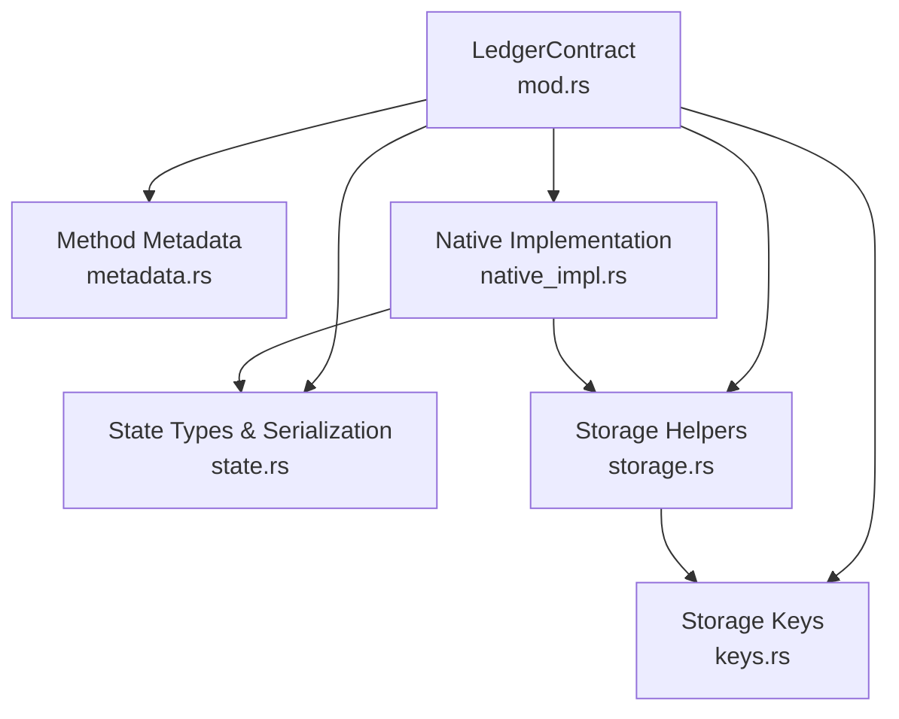
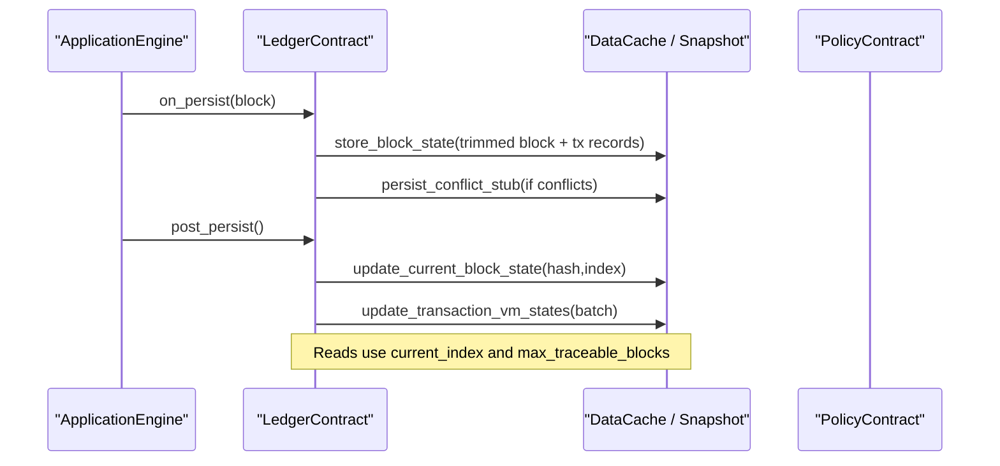
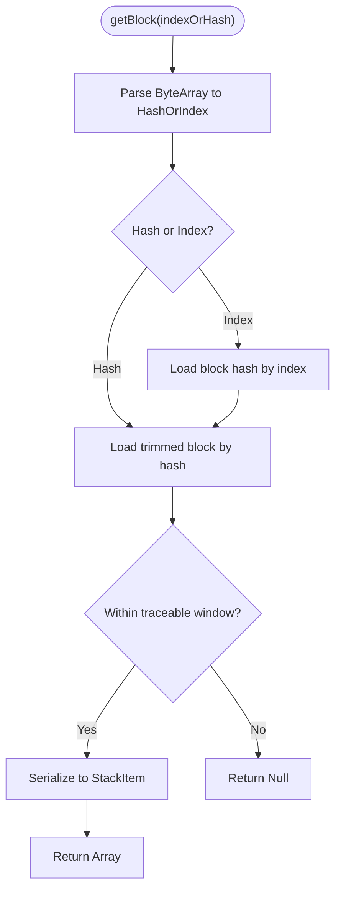
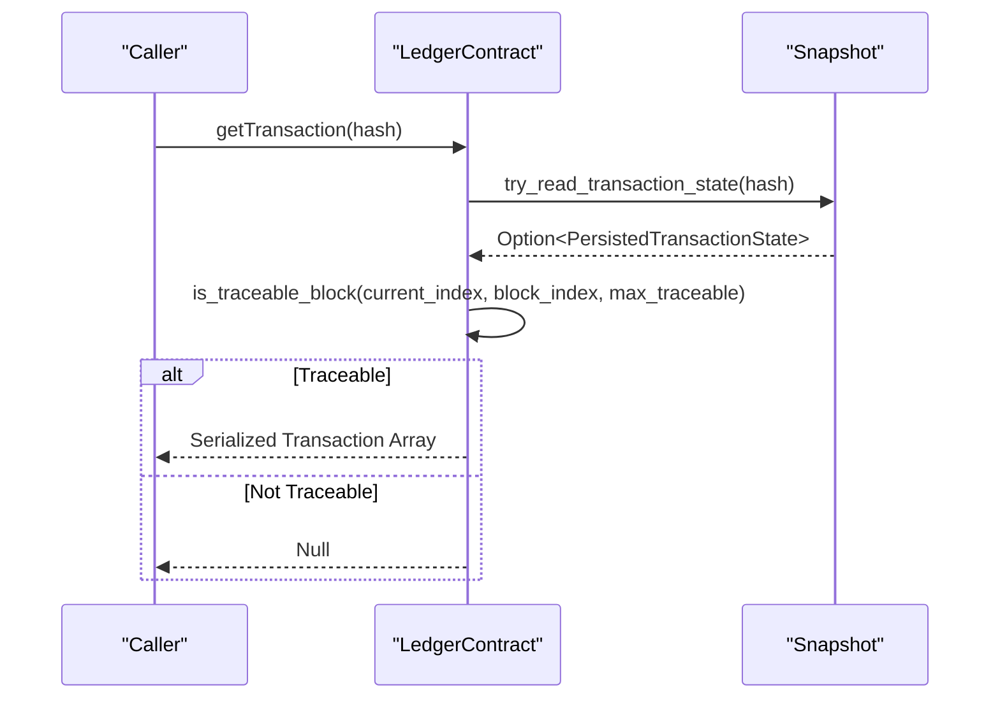
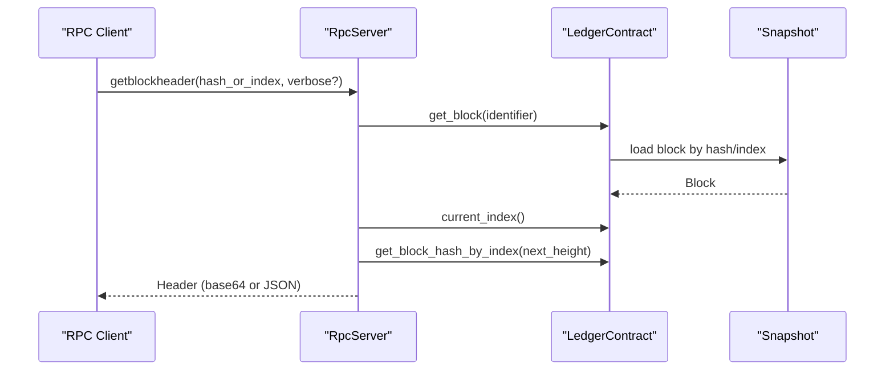
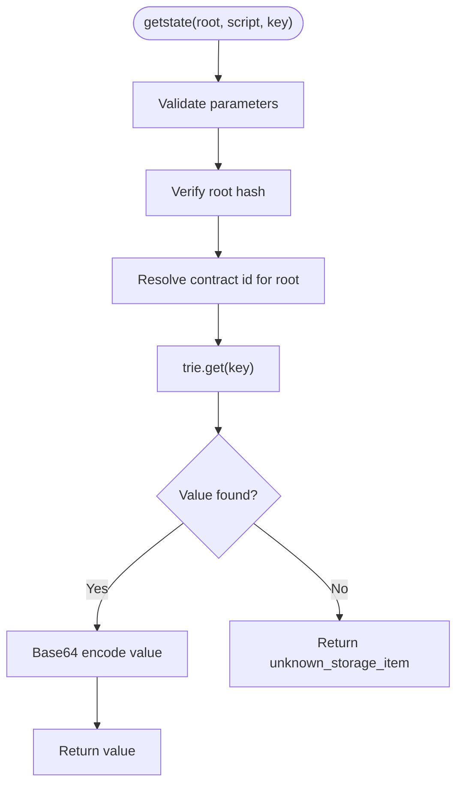
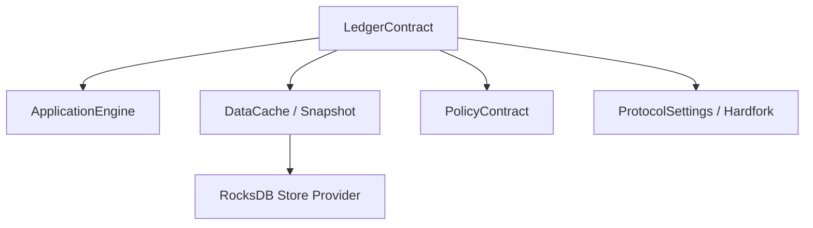

# Ledger Contract

<cite>
**Referenced Files in This Document**
- [mod.rs](file://neo-core/src/smart_contract/native/ledger_contract/mod.rs)
- [metadata.rs](file://neo-core/src/smart_contract/native/ledger_contract/metadata.rs)
- [native_impl.rs](file://neo-core/src/smart_contract/native/ledger_contract/native_impl.rs)
- [state.rs](file://neo-core/src/smart_contract/native/ledger_contract/state.rs)
- [storage.rs](file://neo-core/src/smart_contract/native/ledger_contract/storage.rs)
- [keys.rs](file://neo-core/src/smart_contract/native/ledger_contract/keys.rs)
- [ledger_contract_tests.rs](file://neo-core/tests/ledger_contract_tests.rs)
- [dump_block_header.rs](file://neo-core/examples/dump_block_header.rs)
- [rpc_server_blockchain_mod.rs](file://neo-rpc/src/server/rpc_server_blockchain/mod.rs)
- [rpc_server_state.rs](file://neo-rpc/src/server/rpc_server_state.rs)
</cite>

## Table of Contents
1. Introduction
2. Project Structure
3. Core Components
4. Architecture Overview
5. Detailed Component Analysis
6. Dependency Analysis
7. Performance Considerations
8. Troubleshooting Guide
9. Conclusion
10. Appendices

## Introduction
This document provides comprehensive documentation for the LedgerContract native contract, which exposes read-only access to blockchain data from within smart contracts. It covers retrieving blocks and transactions by index or hash, accessing headers via RPC integration, querying transaction state (including VM execution state), and understanding gas costs and traceability windows. It also includes examples for querying blockchain history, verifying transaction inclusion, and accessing historical state, along with pagination patterns and performance optimization techniques for large data queries.

## Project Structure
The LedgerContract is implemented as a native contract under the smart contract subsystem. Its key modules include:
- Contract definition and public types
- Method metadata and dispatch
- Native method implementations
- State serialization and storage helpers
- Storage key builders and persistence logic

**Diagram sources**
- [mod.rs:22-53](file://neo-core/src/smart_contract/native/ledger_contract/mod.rs#L22-L53)
- [metadata.rs:4-20](file://neo-core/src/smart_contract/native/ledger_contract/metadata.rs#L4-L20)
- [native_impl.rs:21-118](file://neo-core/src/smart_contract/native/ledger_contract/native_impl.rs#L21-L118)
- [state.rs:15-131](file://neo-core/src/smart_contract/native/ledger_contract/state.rs#L15-L131)
- [storage.rs:21-148](file://neo-core/src/smart_contract/native/ledger_contract/storage.rs#L21-L148)
- [keys.rs:7-44](file://neo-core/src/smart_contract/native/ledger_contract/keys.rs#L7-L44)

**Section sources**
- [mod.rs:1-53](file://neo-core/src/smart_contract/native/ledger_contract/mod.rs#L1-L53)
- [metadata.rs:1-34](file://neo-core/src/smart_contract/native/ledger_contract/metadata.rs#L1-L34)
- [native_impl.rs:1-118](file://neo-core/src/smart_contract/native/ledger_contract/native_impl.rs#L1-L118)
- [state.rs:1-131](file://neo-core/src/smart_contract/native/ledger_contract/state.rs#L1-L131)
- [storage.rs:1-148](file://neo-core/src/smart_contract/native/ledger_contract/storage.rs#L1-L148)
- [keys.rs:1-44](file://neo-core/src/smart_contract/native/ledger_contract/keys.rs#L1-L44)

## Core Components
- LedgerContract struct defines the native contract identity and methods.
- HashOrIndex parameter supports block queries by either block hash or block index.
- PersistedTransactionState stores a transaction alongside its containing block index and VM execution state.
- LedgerTransactionStates batches per-block transaction states and produces updates.
- Storage layer persists trimmed blocks, transaction records, current block pointer, and conflict stubs.
- Key builders generate deterministic storage keys for ledger data.

Key responsibilities:
- Provide read-only methods for blocks, transactions, headers (via RPC integration), and transaction state.
- Enforce traceability window constraints for safe historical reads.
- Manage on-chain persistence during block persist phases.

**Section sources**
- [mod.rs:22-53](file://neo-core/src/smart_contract/native/ledger_contract/mod.rs#L22-L53)
- [state.rs:15-131](file://neo-core/src/smart_contract/native/ledger_contract/state.rs#L15-L131)
- [storage.rs:21-148](file://neo-core/src/smart_contract/native/ledger_contract/storage.rs#L21-L148)
- [keys.rs:7-44](file://neo-core/src/smart_contract/native/ledger_contract/keys.rs#L7-L44)

## Architecture Overview
The LedgerContract integrates with the ApplicationEngine lifecycle:
- OnPersist: builds per-block transaction states and persists trimmed blocks and transaction records; records conflict stubs when applicable.
- PostPersist: updates current block pointer and applies batched VM state updates.
- Read methods: resolve current index and max traceable blocks, then fetch data from storage with traceability checks.

**Diagram sources**
- [native_impl.rs:55-118](file://neo-core/src/smart_contract/native/ledger_contract/native_impl.rs#L55-L118)
- [storage.rs:256-315](file://neo-core/src/smart_contract/native/ledger_contract/storage.rs#L256-L315)
- [storage.rs:382-413](file://neo-core/src/smart_contract/native/ledger_contract/storage.rs#L382-L413)

**Section sources**
- [native_impl.rs:55-118](file://neo-core/src/smart_contract/native/ledger_contract/native_impl.rs#L55-L118)
- [storage.rs:256-315](file://neo-core/src/smart_contract/native/ledger_contract/storage.rs#L256-L315)

## Detailed Component Analysis

### Block Retrieval Methods
- getBlock(indexOrHash): Returns a trimmed block (header plus transaction hashes) if the target block is within the traceable window; otherwise returns null.
  - Parameter: ByteArray representing either a 32-byte block hash or a signed integer block index.
  - Return: Array (trimmed block structure) or null.
  - Gas cost: 1 << 15.
  - Flags: READ_STATES.
  - Traceability: Uses current_index and max_traceable_blocks to determine visibility.

- getTransactionFromBlock(blockIndexOrHash, txIndex): Retrieves a specific transaction from a block by index or hash and transaction index.
  - Parameters: ByteArray (block index or hash), Integer (transaction index).
  - Return: Array (transaction) or null if not found or out-of-range.
  - Gas cost: 1 << 16.
  - Flags: READ_STATES.

- getBlockHashByIndex(index): Returns the block hash for a given index via RPC integration using LedgerContract storage.
  - Parameter: u32 block index.
  - Return: Optional UInt256 hash.

- getTrimmedBlock(hash): Returns the trimmed block (header + transaction hashes) for a given hash.
  - Parameter: UInt256 block hash.
  - Return: Optional TrimmedBlock.

Traceability window:
- Determined by protocol settings and policy ceiling; enforced via is_traceable_block(current_index, target_index, max_traceable_blocks).

**Diagram sources**
- [native_impl.rs:197-231](file://neo-core/src/smart_contract/native/ledger_contract/native_impl.rs#L197-L231)
- [storage.rs:150-213](file://neo-core/src/smart_contract/native/ledger_contract/storage.rs#L150-L213)
- [mod.rs:281-289](file://neo-core/src/smart_contract/native/ledger_contract/mod.rs#L281-L289)

**Section sources**
- [native_impl.rs:197-231](file://neo-core/src/smart_contract/native/ledger_contract/native_impl.rs#L197-L231)
- [storage.rs:150-213](file://neo-core/src/smart_contract/native/ledger_contract/storage.rs#L150-L213)
- [mod.rs:281-289](file://neo-core/src/smart_contract/native/ledger_contract/mod.rs#L281-L289)

### Transaction Lookup Methods
- getTransaction(hash): Returns the full transaction if it exists and is within the traceable window; otherwise returns null.
  - Parameter: Hash256 transaction hash.
  - Return: Array (transaction) or null.
  - Gas cost: 1 << 15.
  - Flags: READ_STATES.

- getTransactionHeight(hash): Returns the block index where the transaction was included if traceable; otherwise returns -1.
  - Parameter: Hash256 transaction hash.
  - Return: Integer (block index or -1).
  - Gas cost: 1 << 15.
  - Flags: READ_STATES.

- getTransactionSigners(hash): Returns the list of signers for a transaction if traceable; otherwise returns null.
  - Parameter: Hash256 transaction hash.
  - Return: Array (signers) or null.
  - Gas cost: 1 << 15.
  - Flags: READ_STATES.

- getTransactionVMState(hash): Returns the VM execution state byte (HALT/FAULT/NONE) if traceable; otherwise returns 0.
  - Parameter: Hash256 transaction hash.
  - Return: Integer (VM state byte).
  - Gas cost: 1 << 15.
  - Flags: READ_STATES.

**Diagram sources**
- [native_impl.rs:233-252](file://neo-core/src/smart_contract/native/ledger_contract/native_impl.rs#L233-L252)
- [storage.rs:215-228](file://neo-core/src/smart_contract/native/ledger_contract/storage.rs#L215-L228)
- [native_impl.rs:452-468](file://neo-core/src/smart_contract/native/ledger_contract/native_impl.rs#L452-L468)

**Section sources**
- [native_impl.rs:233-362](file://neo-core/src/smart_contract/native/ledger_contract/native_impl.rs#L233-L362)
- [storage.rs:215-228](file://neo-core/src/smart_contract/native/ledger_contract/storage.rs#L215-L228)

### Header Access
While the native contract does not expose a direct header retrieval method, headers are accessible through RPC endpoints that leverage LedgerContract storage:
- getblockhash(height): Uses LedgerContract.current_index and get_block_hash_by_index to validate height and return the corresponding block hash.
- getblockheader(hash_or_index, verbose?): Fetches a block via LedgerContract and returns the header (base64 or verbose JSON including confirmations and next block hash).

**Diagram sources**
- [rpc_server_blockchain_mod.rs:130-151](file://neo-rpc/src/server/rpc_server_blockchain/mod.rs#L130-L151)
- [storage.rs:187-213](file://neo-core/src/smart_contract/native/ledger_contract/storage.rs#L187-L213)

**Section sources**
- [rpc_server_blockchain_mod.rs:93-151](file://neo-rpc/src/server/rpc_server_blockchain/mod.rs#L93-L151)

### State Queries
- getstate(root_hash, script_hash, base64_key): Retrieves historical state at a specific state root for a contract’s storage key.
  - Parameters: UInt256 root hash, UInt160 script hash, Base64-encoded storage key.
  - Return: Base64-encoded value or error if item unknown.
  - Integration: Uses state store trie for the specified root hash.

**Diagram sources**
- [rpc_server_state.rs:95-113](file://neo-rpc/src/server/rpc_server_state.rs#L95-L113)

**Section sources**
- [rpc_server_state.rs:95-113](file://neo-rpc/src/server/rpc_server_state.rs#L95-L113)

### Gas Costs and Flags
All LedgerContract methods are marked safe and read-only:
- currentHash: fee = 1 << 15, flags = READ_STATES, params = [], returns = Hash256
- currentIndex: fee = 1 << 15, flags = READ_STATES, params = [], returns = Integer
- getBlock: fee = 1 << 15, flags = READ_STATES, params = [ByteArray], returns = Array
- getTransaction: fee = 1 << 15, flags = READ_STATES, params = [Hash256], returns = Array
- getTransactionFromBlock: fee = 1 << 16, flags = READ_STATES, params = [ByteArray, Integer], returns = Array
- getTransactionHeight: fee = 1 << 15, flags = READ_STATES, params = [Hash256], returns = Integer
- getTransactionSigners: fee = 1 << 15, flags = READ_STATES, params = [Hash256], returns = Array
- getTransactionVMState: fee = 1 << 15, flags = READ_STATES, params = [Hash256], returns = Integer

**Section sources**
- [metadata.rs:10-17](file://neo-core/src/smart_contract/native/ledger_contract/metadata.rs#L10-L17)
- [ledger_contract_tests.rs:143-200](file://neo-core/tests/ledger_contract_tests.rs#L143-L200)

## Dependency Analysis
LedgerContract depends on:
- ApplicationEngine for lifecycle hooks and snapshot access
- DataCache/Snapshot for read/write operations
- PolicyContract for maximum traceable blocks ceiling
- ProtocolSettings and Hardfork configuration for traceability limits

**Diagram sources**
- [native_impl.rs:364-450](file://neo-core/src/smart_contract/native/ledger_contract/native_impl.rs#L364-L450)
- [storage.rs:125-148](file://neo-core/src/smart_contract/native/ledger_contract/storage.rs#L125-L148)

**Section sources**
- [native_impl.rs:364-450](file://neo-core/src/smart_contract/native/ledger_contract/native_impl.rs#L364-L450)
- [storage.rs:125-148](file://neo-core/src/smart_contract/native/ledger_contract/storage.rs#L125-L148)

## Performance Considerations
- Traceability window: Limit historical reads to recent blocks to reduce I/O and CPU overhead. Use current_index and max_traceable_blocks to constrain queries.
- Batch updates: Apply VM state updates in batches to minimize storage writes during post_persist.
- Trimmed blocks: Store only headers and transaction hashes to save space; reconstruct full blocks by fetching transactions individually when needed.
- Pagination pattern: For large datasets, iterate by block index ranges and filter transactions by script or sender using application-level logic; avoid single calls returning entire histories.
- RPC efficiency: Prefer base64 responses for compact payloads; use verbose mode selectively for additional metadata like confirmations.

[No sources needed since this section provides general guidance]

## Troubleshooting Guide
Common issues and resolutions:
- Invalid argument length: Ensure block index/hash parameters match expected formats (32 bytes for hash, fewer than 32 bytes for index).
- Unknown block or transaction: Verify the target is within the traceable window; older data may be unavailable.
- Unserializable transactions: Transactions must be serializable to compute hashes; errors will prevent persistence.
- Conflict stubs: When conflicts are present, ensure signer accounts are provided to check conflict presence within the traceable window.

Validation references:
- Argument parsing and validation in invoke methods.
- Tests covering unserializable transactions and conflict stub behavior.

**Section sources**
- [native_impl.rs:374-431](file://neo-core/src/smart_contract/native/ledger_contract/native_impl.rs#L374-L431)
- [mod.rs:164-225](file://neo-core/src/smart_contract/native/ledger_contract/mod.rs#L164-L225)

## Conclusion
The LedgerContract provides robust, read-only access to blockchain data with clear gas costs and safety guarantees. By leveraging traceability windows, trimmed blocks, and batched updates, it balances performance and correctness. Integration with RPC endpoints enables convenient header and block access, while state queries support historical verification. Proper usage patterns—such as pagination and selective verbosity—optimize performance for large-scale queries.

[No sources needed since this section summarizes without analyzing specific files]

## Appendices

### Example: Querying Blockchain History
- Retrieve a block by index and dump header fields using the example tool.
- Use getTransactionHeight to verify inclusion and getTransactionSigners to inspect participants.

**Section sources**
- [dump_block_header.rs:1-46](file://neo-core/examples/dump_block_header.rs#L1-L46)
- [native_impl.rs:296-315](file://neo-core/src/smart_contract/native/ledger_contract/native_impl.rs#L296-L315)

### Example: Verifying Transaction Inclusion
- Call getTransaction(hash) to retrieve the transaction if traceable.
- Use getTransactionFromBlock(blockIndexOrHash, txIndex) to locate a specific transaction within a block.

**Section sources**
- [native_impl.rs:233-294](file://neo-core/src/smart_contract/native/ledger_contract/native_impl.rs#L233-L294)

### Example: Accessing Historical State
- Use getstate(root_hash, script_hash, base64_key) to retrieve contract storage at a specific state root.

**Section sources**
- [rpc_server_state.rs:95-113](file://neo-rpc/src/server/rpc_server_state.rs#L95-L113)