# Native Contract Framework

<cite>
**Referenced Files in This Document**
- [native_contract.rs](file://neo-core/src/smart_contract/native/native_contract.rs)
- [mod.rs](file://neo-core/src/smart_contract/native/mod.rs)
- [native_contract_cache.rs](file://neo-core/src/smart_contract/native/native_contract_cache.rs)
- [hardfork_activable.rs](file://neo-core/src/smart_contract/native/hardfork_activable.rs)
- [method_macros.rs](file://neo-core/src/smart_contract/native/method_macros.rs)
- [metadata_macros.rs](file://neo-core/src/smart_contract/native/metadata_macros.rs)
- [fees_events_native.rs](file://neo-core/src/smart_contract/application_engine/fees_events_native.rs)
- [gas_token_mod.rs](file://neo-core/src/smart_contract/native/gas_token/mod.rs)
- [contract_management_mod.rs](file://neo-core/src/smart_contract/native/contract_management/mod.rs)
- [native_contract_tests.rs](file://neo-core/tests/native_contract_tests.rs)
</cite>

## Table of Contents
1. [Introduction](#introduction)
2. [Project Structure](#project-structure)
3. [Core Components](#core-components)
4. [Architecture Overview](#architecture-overview)
5. [Detailed Component Analysis](#detailed-component-analysis)
6. [Dependency Analysis](#dependency-analysis)
7. [Performance Considerations](#performance-considerations)
8. [Troubleshooting Guide](#troubleshooting-guide)
9. [Conclusion](#conclusion)
10. [Appendices](#appendices)

## Introduction
This document explains the native contract framework in Neo-RS, focusing on how native contracts are defined, registered, invoked, and cached. It covers hardfork activation semantics, metadata generation for manifests, macro-based method definitions, and the integration with the smart contract execution engine. Practical guidance is provided for creating custom native contracts, implementing interfaces, handling upgrades, and testing native logic.

## Project Structure
The native contract subsystem lives under the smart contract module and exposes a trait-based API, a registry for built-in contracts, caching for method metadata, and macros to simplify declarations. Key areas:
- Trait and base types: definition of NativeContract, NativeMethod, lifecycle hooks, and manifest/state builders
- Registry: registration and lookup of native contracts by hash or name
- Caching: per-contract method metadata cache keyed by contract id
- Macros: compact declaration of methods, events, and dispatch tables
- Execution integration: invocation path from ApplicationEngine through fees, validation, and dispatch

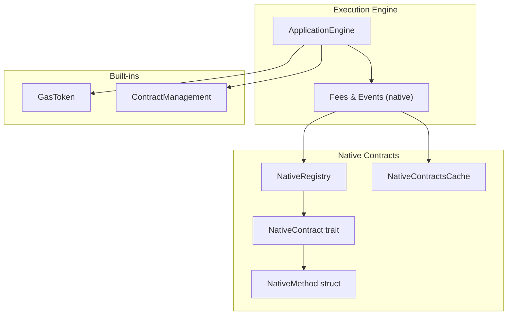

**Diagram sources**
- [native_contract.rs:21-163](file://neo-core/src/smart_contract/native/native_contract.rs#L21-L163)
- [mod.rs:91-198](file://neo-core/src/smart_contract/native/mod.rs#L91-L198)
- [native_contract_cache.rs:7-74](file://neo-core/src/smart_contract/native/native_contract_cache.rs#L7-L74)
- [fees_events_native.rs:190-229](file://neo-core/src/smart_contract/application_engine/fees_events_native.rs#L190-L229)

**Section sources**
- [native_contract.rs:21-163](file://neo-core/src/smart_contract/native/native_contract.rs#L21-L163)
- [mod.rs:91-198](file://neo-core/src/smart_contract/native/mod.rs#L91-L198)
- [native_contract_cache.rs:7-74](file://neo-core/src/smart_contract/native/native_contract_cache.rs#L7-L74)

## Core Components
- NativeContract trait: defines identity (id, hash, name), method table, activation checks, lifecycle hooks (initialize, on_persist, post_persist), manifest/state generation, and invoke entry point.
- NativeMethod: describes a method’s ABI, fees, safety flags, required call flags, parameters, return type, and hardfork activation/deprecation windows.
- BaseNativeContract: helper for common fields and method lookup/validation.
- impl_native_contract macro: generates boilerplate for hash/name/methods/invoke/as_any.
- HardforkActivable: trait for items gated by hardfork activation (used by NativeMethod).
- NativeRegistry: central registry that registers standard native contracts and provides lookup by hash/name; iteration order is deterministic and consensus-critical.
- NativeContractsCache: caches per-contract method metadata and resolves method overloads by name and parameter count at runtime.

Key behaviors:
- Activation: contracts and methods can be activated or deprecated at specific hardfork heights; is_active_for implements interval semantics (active since active_in until deprecated_in).
- Manifest/state: build_native_contract_state filters methods by activation, builds ABI descriptors, and produces NEF bytes for System.Contract.CallNative calls.
- Invocation: ApplicationEngine validates activation, resolves method via cache, charges fees upfront, then invokes the contract’s invoke_method.

**Section sources**
- [native_contract.rs:21-163](file://neo-core/src/smart_contract/native/native_contract.rs#L21-L163)
- [native_contract.rs:165-331](file://neo-core/src/smart_contract/native/native_contract.rs#L165-L331)
- [native_contract.rs:333-435](file://neo-core/src/smart_contract/native/native_contract.rs#L333-L435)
- [native_contract.rs:437-513](file://neo-core/src/smart_contract/native/native_contract.rs#L437-L513)
- [mod.rs:91-198](file://neo-core/src/smart_contract/native/mod.rs#L91-L198)
- [native_contract_cache.rs:7-74](file://neo-core/src/smart_contract/native/native_contract_cache.rs#L7-L74)

## Architecture Overview
The native contract framework integrates tightly with the execution engine:
- Registration: NativeRegistry constructs and stores all standard native contracts in a fixed order.
- Invocation: ApplicationEngine.call_native_contract looks up the contract by hash, checks activation, resolves method metadata from cache, charges CPU/storage fees, and delegates to the contract’s invoke implementation.
- Method dispatch: Contracts typically implement a dispatch method generated by macros that maps method names to handlers with optional aliases.
- Lifecycle: initialize/on_persist/post_persist hooks run during block persistence phases.
- Manifest/state: contract_state returns a ContractState including NEF and ABI derived from method metadata and activation state.

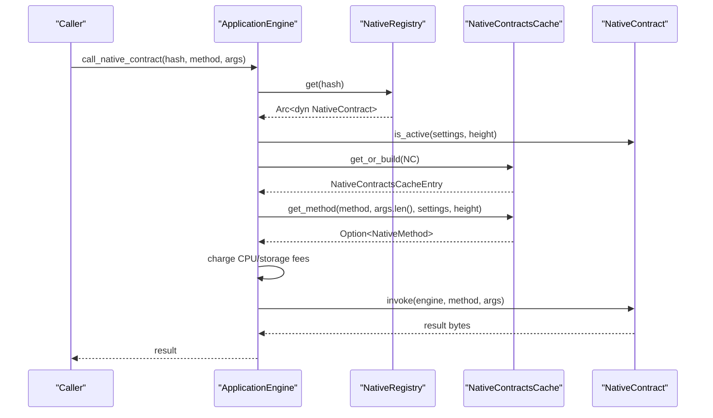

**Diagram sources**
- [fees_events_native.rs:190-229](file://neo-core/src/smart_contract/application_engine/fees_events_native.rs#L190-L229)
- [fees_events_native.rs:265-299](file://neo-core/src/smart_contract/application_engine/fees_events_native.rs#L265-L299)
- [native_contract_cache.rs:13-74](file://neo-core/src/smart_contract/native/native_contract_cache.rs#L13-L74)
- [native_contract.rs:41-49](file://neo-core/src/smart_contract/native/native_contract.rs#L41-L49)

## Detailed Component Analysis

### NativeContract trait and lifecycle
- Identity: id, hash, name uniquely identify a native contract.
- Methods: methods() returns the list of supported NativeMethod entries.
- Activation: active_in() gates the whole contract; each method may have active_in/deprecated_in.
- Lifecycle hooks: initialize, on_persist, post_persist allow setup and state updates during block processing.
- Manifest/state: contract_state builds ContractState with ABI and NEF based on active methods.

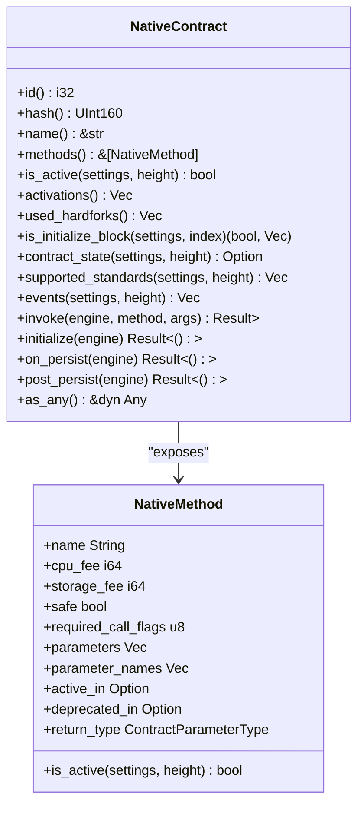

**Diagram sources**
- [native_contract.rs:21-163](file://neo-core/src/smart_contract/native/native_contract.rs#L21-L163)
- [native_contract.rs:165-331](file://neo-core/src/smart_contract/native/native_contract.rs#L165-L331)

**Section sources**
- [native_contract.rs:21-163](file://neo-core/src/smart_contract/native/native_contract.rs#L21-L163)
- [native_contract.rs:165-331](file://neo-core/src/smart_contract/native/native_contract.rs#L165-L331)

### Contract registration and discovery
- NativeRegistry holds an ordered map of contract hashes to instances.
- Standard contracts are registered in a deterministic order matching C# behavior.
- Provides get/get_by_name/is_native/all_hashes/contracts iterators.

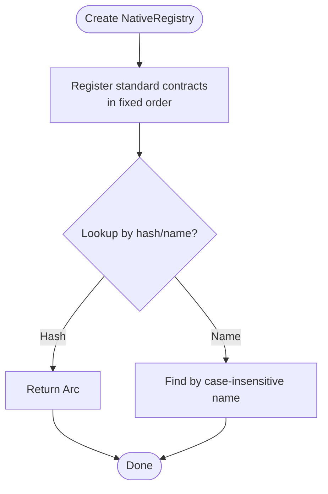

**Diagram sources**
- [mod.rs:91-198](file://neo-core/src/smart_contract/native/mod.rs#L91-L198)

**Section sources**
- [mod.rs:91-198](file://neo-core/src/smart_contract/native/mod.rs#L91-L198)

### Method invocation and caching
- ApplicationEngine resolves the contract, checks activation, and uses NativeContractsCache to find the correct method overload by name and parameter count.
- Fees are charged before invoking the method to match native contract semantics.
- The cache avoids repeated method resolution and enforces uniqueness at a given height.

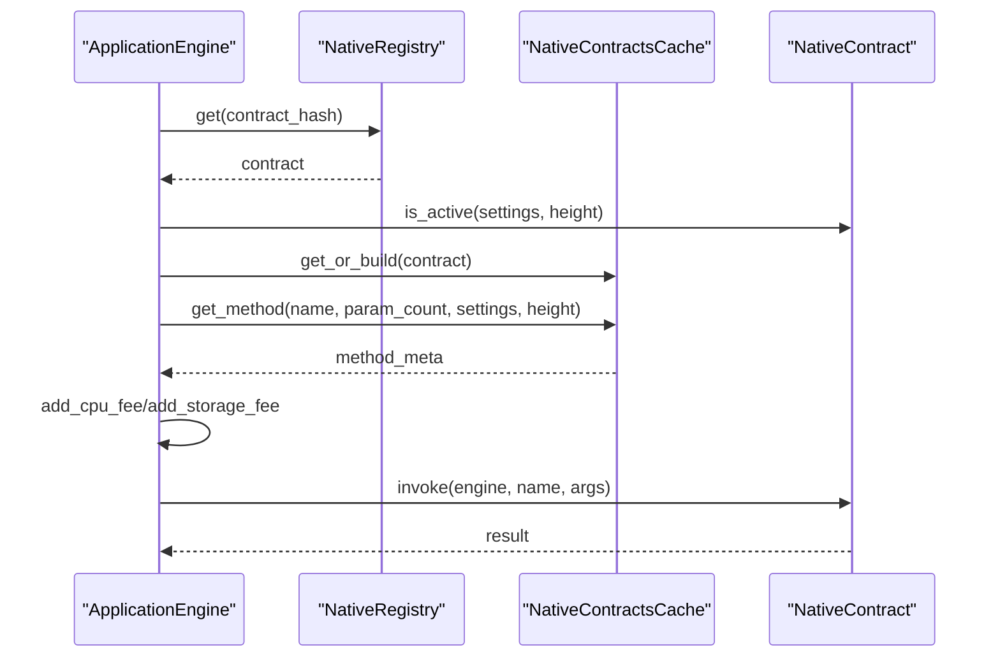

**Diagram sources**
- [fees_events_native.rs:190-229](file://neo-core/src/smart_contract/application_engine/fees_events_native.rs#L190-L229)
- [fees_events_native.rs:265-299](file://neo-core/src/smart_contract/application_engine/fees_events_native.rs#L265-L299)
- [native_contract_cache.rs:13-74](file://neo-core/src/smart_contract/native/native_contract_cache.rs#L13-L74)

**Section sources**
- [fees_events_native.rs:190-229](file://neo-core/src/smart_contract/application_engine/fees_events_native.rs#L190-L229)
- [fees_events_native.rs:265-299](file://neo-core/src/smart_contract/application_engine/fees_events_native.rs#L265-L299)
- [native_contract_cache.rs:13-74](file://neo-core/src/smart_contract/native/native_contract_cache.rs#L13-L74)

### Hardfork activation support
- Contracts can declare active_in to become available only after a specific hardfork height.
- Methods can be individually activated or deprecated using active_in/deprecated_in, following interval semantics.
- used_hardforks aggregates all relevant hardforks for a contract to trigger initialization/refresh at activation blocks.

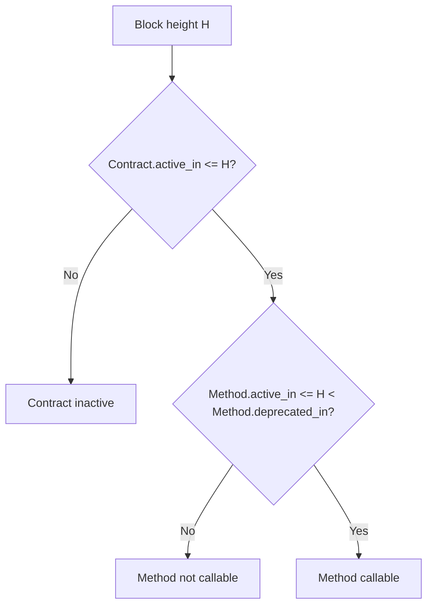

**Diagram sources**
- [native_contract.rs:41-49](file://neo-core/src/smart_contract/native/native_contract.rs#L41-L49)
- [native_contract.rs:312-331](file://neo-core/src/smart_contract/native/native_contract.rs#L312-L331)

**Section sources**
- [native_contract.rs:41-49](file://neo-core/src/smart_contract/native/native_contract.rs#L41-L49)
- [native_contract.rs:312-331](file://neo-core/src/smart_contract/native/native_contract.rs#L312-L331)

### Metadata handling and manifest generation
- build_native_contract_state filters methods by activation, sorts them deterministically, and builds ABI descriptors with parameter names when provided.
- NEF is constructed to call System.Contract.CallNative with version 0; method resolution relies on instruction pointer offsets.
- Supported standards and events can be customized per contract.

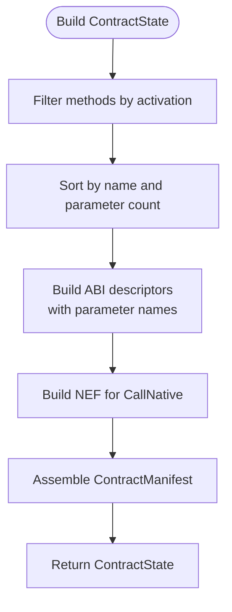

**Diagram sources**
- [native_contract.rs:437-513](file://neo-core/src/smart_contract/native/native_contract.rs#L437-L513)

**Section sources**
- [native_contract.rs:437-513](file://neo-core/src/smart_contract/native/native_contract.rs#L437-L513)

### Macro-based method definitions
- neo_native_methods declares method metadata compactly, including fees, flags, parameters, return types, activation windows, storage fees, and parameter names.
- neo_native_method_dispatch generates a dispatch function mapping method names to handlers, supporting aliases and unknown-method errors.
- neo_native_contract_methods ties together native_methods() and dispatch_method implementations for a contract.
- event_descriptor macro simplifies event descriptor creation.

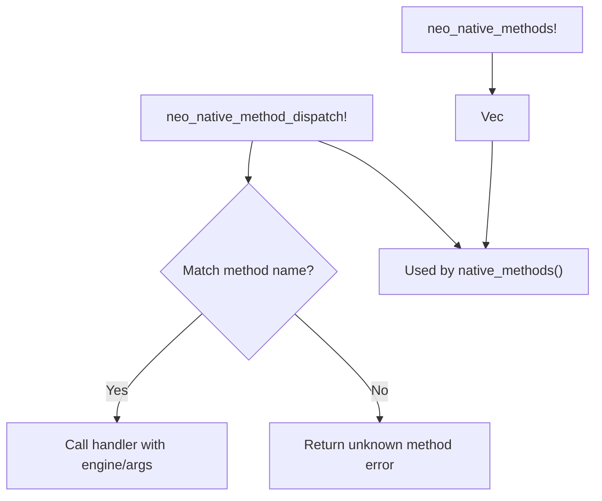

**Diagram sources**
- [method_macros.rs:3-46](file://neo-core/src/smart_contract/native/method_macros.rs#L3-L46)
- [method_macros.rs:82-138](file://neo-core/src/smart_contract/native/method_macros.rs#L82-L138)
- [method_macros.rs:140-195](file://neo-core/src/smart_contract/native/method_macros.rs#L140-L195)
- [metadata_macros.rs:3-38](file://neo-core/src/smart_contract/native/metadata_macros.rs#L3-L38)

**Section sources**
- [method_macros.rs:3-46](file://neo-core/src/smart_contract/native/method_macros.rs#L3-L46)
- [method_macros.rs:82-138](file://neo-core/src/smart_contract/native/method_macros.rs#L82-L138)
- [method_macros.rs:140-195](file://neo-core/src/smart_contract/native/method_macros.rs#L140-L195)
- [metadata_macros.rs:3-38](file://neo-core/src/smart_contract/native/metadata_macros.rs#L3-L38)

### Example: GasToken implementation
- Implements NEP-17-like behavior with transfer, mint, burn, total supply, and balance queries.
- Uses security guards, witness checks, safe arithmetic, and state validators.
- Emits Transfer events and optionally calls onNEP17Payment for recipient contracts.

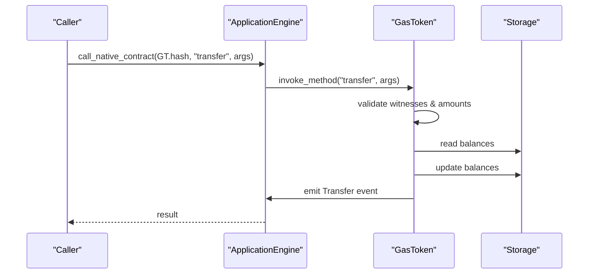

**Diagram sources**
- [gas_token_mod.rs:62-79](file://neo-core/src/smart_contract/native/gas_token/mod.rs#L62-L79)
- [gas_token_mod.rs:81-265](file://neo-core/src/smart_contract/native/gas_token/mod.rs#L81-L265)
- [gas_token_mod.rs:460-484](file://neo-core/src/smart_contract/native/gas_token/mod.rs#L460-L484)

**Section sources**
- [gas_token_mod.rs:62-79](file://neo-core/src/smart_contract/native/gas_token/mod.rs#L62-L79)
- [gas_token_mod.rs:81-265](file://neo-core/src/smart_contract/native/gas_token/mod.rs#L81-L265)
- [gas_token_mod.rs:460-484](file://neo-core/src/smart_contract/native/gas_token/mod.rs#L460-L484)

### Example: ContractManagement
- Manages deployed contracts, IDs, minimum deployment fee, and lifecycle hooks like _deploy.
- Provides serialization/deserialization helpers for contract state and storage key utilities.

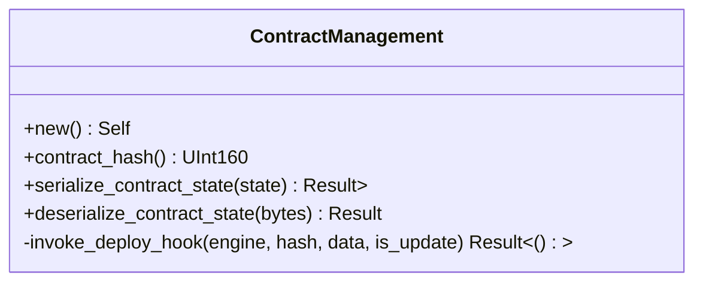

**Diagram sources**
- [contract_management_mod.rs:55-229](file://neo-core/src/smart_contract/native/contract_management/mod.rs#L55-L229)

**Section sources**
- [contract_management_mod.rs:55-229](file://neo-core/src/smart_contract/native/contract_management/mod.rs#L55-L229)

## Dependency Analysis
- ApplicationEngine depends on NativeRegistry for contract lookup and on NativeContractsCache for method resolution.
- NativeContract implementations depend on application engine services (storage, notifications, witness checks).
- Macros reduce coupling by generating consistent method tables and dispatchers.
- HardforkActivable decouples activation logic across contracts and methods.

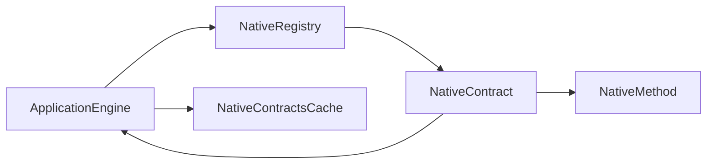

**Diagram sources**
- [fees_events_native.rs:190-229](file://neo-core/src/smart_contract/application_engine/fees_events_native.rs#L190-L229)
- [native_contract.rs:21-163](file://neo-core/src/smart_contract/native/native_contract.rs#L21-L163)
- [native_contract_cache.rs:7-74](file://neo-core/src/smart_contract/native/native_contract_cache.rs#L7-L74)

**Section sources**
- [fees_events_native.rs:190-229](file://neo-core/src/smart_contract/application_engine/fees_events_native.rs#L190-L229)
- [native_contract.rs:21-163](file://neo-core/src/smart_contract/native/native_contract.rs#L21-L163)
- [native_contract_cache.rs:7-74](file://neo-core/src/smart_contract/native/native_contract_cache.rs#L7-L74)

## Performance Considerations
- Method resolution is cached per contract id to avoid repeated filtering and sorting of methods.
- Fee charging occurs before invocation to prevent wasted computation on unauthorized or invalid calls.
- Deterministic ordering of methods ensures stable ABI and NEF generation.
- Safe arithmetic and state validation minimize costly rollback paths and ensure consistency.

[No sources needed since this section provides general guidance]

## Troubleshooting Guide
Common issues and diagnostics:
- Method not found: Ensure the method exists in the contract’s method table and is active at the current height. Check active_in/deprecated_in and hardfork configuration.
- Ambiguous method: Multiple methods with the same name and parameter count active at the same height will cause an error; adjust signatures or activation windows.
- Not active at height: Verify the contract’s active_in and method-level activation relative to protocol settings.
- Unknown method: Confirm dispatch table includes the method and aliases if applicable.

Relevant checks:
- Activation and method selection in ApplicationEngine and cache.
- Error messages for missing or ambiguous methods.

**Section sources**
- [native_contract_cache.rs:44-74](file://neo-core/src/smart_contract/native/native_contract_cache.rs#L44-L74)
- [fees_events_native.rs:190-229](file://neo-core/src/smart_contract/application_engine/fees_events_native.rs#L190-L229)

## Conclusion
The Neo-RS native contract framework provides a robust, extensible foundation for system-level functionality. By combining a clear trait interface, macro-driven metadata, hardfork-aware activation, and efficient caching, it enables precise control over native features while maintaining performance and compatibility with the execution engine. Following the patterns shown here allows developers to create custom native contracts that integrate seamlessly with the blockchain’s lifecycle and tooling.

[No sources needed since this section summarizes without analyzing specific files]

## Appendices

### Creating a Custom Native Contract
Steps:
- Define a struct implementing NativeContract or use BaseNativeContract and impl_native_contract macro.
- Declare methods using neo_native_methods! and generate dispatch with neo_native_contract_methods!.
- Implement invoke_method to route to handlers; handle arguments, witnesses, storage, and events.
- Register the contract in NativeRegistry if it should be part of the standard set; otherwise register it explicitly in tests or custom nodes.

References:
- Trait and macro usage: [native_contract.rs:333-435](file://neo-core/src/smart_contract/native/native_contract.rs#L333-L435)
- Method macros: [method_macros.rs:3-46](file://neo-core/src/smart_contract/native/method_macros.rs#L3-L46), [method_macros.rs:140-195](file://neo-core/src/smart_contract/native/method_macros.rs#L140-L195)
- Registry: [mod.rs:91-198](file://neo-core/src/smart_contract/native/mod.rs#L91-L198)

**Section sources**
- [native_contract.rs:333-435](file://neo-core/src/smart_contract/native/native_contract.rs#L333-L435)
- [method_macros.rs:3-46](file://neo-core/src/smart_contract/native/method_macros.rs#L3-L46)
- [method_macros.rs:140-195](file://neo-core/src/smart_contract/native/method_macros.rs#L140-L195)
- [mod.rs:91-198](file://neo-core/src/smart_contract/native/mod.rs#L91-L198)

### Implementing Interfaces and Standards
- For token-like contracts, follow NEP-17 patterns similar to GasToken: symbol, decimals, total supply, balance, transfer, events.
- Emit standardized events and support onNEP17Payment for interoperability.

References:
- GasToken interface: [gas_token_mod.rs:633-651](file://neo-core/src/smart_contract/native/gas_token/mod.rs#L633-L651)
- Transfer event emission: [gas_token_mod.rs:460-484](file://neo-core/src/smart_contract/native/gas_token/mod.rs#L460-L484)

**Section sources**
- [gas_token_mod.rs:633-651](file://neo-core/src/smart_contract/native/gas_token/mod.rs#L633-L651)
- [gas_token_mod.rs:460-484](file://neo-core/src/smart_contract/native/gas_token/mod.rs#L460-L484)

### Handling Upgrades with Hardforks
- Use active_in/deprecated_in to gate new or changed methods.
- Ensure contract_state filters methods correctly at different heights.
- Validate that used_hardforks triggers initialization at activation blocks.

References:
- Activation logic: [native_contract.rs:41-49](file://neo-core/src/smart_contract/native/native_contract.rs#L41-L49)
- Interval semantics: [native_contract.rs:312-331](file://neo-core/src/smart_contract/native/native_contract.rs#L312-L331)
- Initialization check: [native_contract.rs:84-110](file://neo-core/src/smart_contract/native/native_contract.rs#L84-L110)

**Section sources**
- [native_contract.rs:41-49](file://neo-core/src/smart_contract/native/native_contract.rs#L41-L49)
- [native_contract.rs:312-331](file://neo-core/src/smart_contract/native/native_contract.rs#L312-L331)
- [native_contract.rs:84-110](file://neo-core/src/smart_contract/native/native_contract.rs#L84-L110)

### Testing Strategies
- Use ApplicationEngine to construct test contexts with snapshots and protocol settings.
- Register additional native contracts explicitly when needed (e.g., non-standard ones).
- Assert manifest contents such as supported standards and events.

References:
- Test fixtures and explicit registration: [native_contract_tests.rs:336-371](file://neo-core/tests/native_contract_tests.rs#L336-L371)

**Section sources**
- [native_contract_tests.rs:336-371](file://neo-core/tests/native_contract_tests.rs#L336-L371)