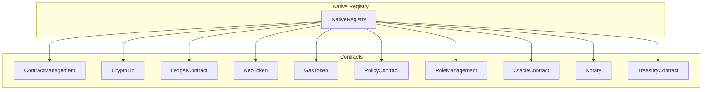
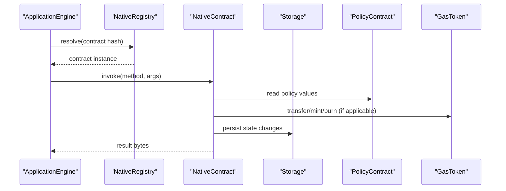
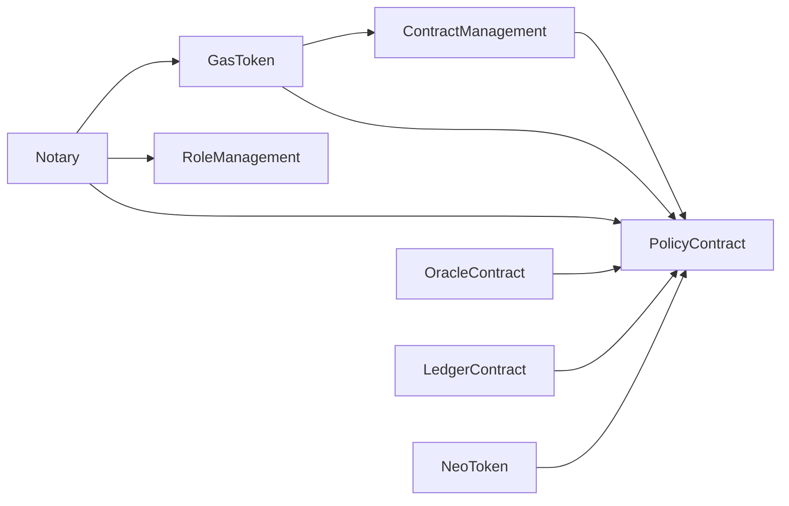

# Native Contracts

<cite>
**Referenced Files in This Document**
- [mod.rs](file://neo-core/src/smart_contract/native/mod.rs)
- [native_contract.rs](file://neo-core/src/smart_contract/native/native_contract.rs)
- [contract_management/mod.rs](file://neo-core/src/smart_contract/native/contract_management/mod.rs)
- [crypto_lib/mod.rs](file://neo-core/src/smart_contract/native/crypto_lib/mod.rs)
- [ledger_contract/mod.rs](file://neo-core/src/smart_contract/native/ledger_contract/mod.rs)
- [neo_token/mod.rs](file://neo-core/src/smart_contract/native/neo_token/mod.rs)
- [gas_token/mod.rs](file://neo-core/src/smart_contract/native/gas_token/mod.rs)
- [policy_contract/mod.rs](file://neo-core/src/smart_contract/native/policy_contract/mod.rs)
- [role_management/mod.rs](file://neo-core/src/smart_contract/native/role_management/mod.rs)
- [oracle_contract/mod.rs](file://neo-core/src/smart_contract/native/oracle_contract/mod.rs)
- [notary/mod.rs](file://neo-core/src/smart_contract/native/notary/mod.rs)
- [treasury.rs](file://neo-core/src/smart_contract/native/treasury.rs)
</cite>

## Table of Contents
1. [Introduction](#introduction)
2. [Project Structure](#project-structure)
3. [Core Components](#core-components)
4. [Architecture Overview](#architecture-overview)
5. [Detailed Component Analysis](#detailed-component-analysis)
6. [Dependency Analysis](#dependency-analysis)
7. [Performance Considerations](#performance-considerations)
8. [Troubleshooting Guide](#troubleshooting-guide)
9. [Conclusion](#conclusion)

## Introduction
This document provides comprehensive, code-sourced documentation for the native contracts implemented in Neo-RS. It covers ContractManagement, CryptoLib, LedgerContract, NeoToken, GasToken, PolicyContract, RoleManagement, OracleContract, Notary, and Treasury. For each contract, it explains initialization, activation behavior, upgrade mechanics, method surface, parameter and return types, gas cost model, usage patterns, and security considerations.

## Project Structure
Native contracts are organized under a single module with shared infrastructure:
- A registry registers all standard native contracts in a deterministic order used by persistence and consensus.
- Each native contract implements a common trait that defines lifecycle hooks, method metadata, invocation dispatching, and manifest generation.
- Hardfork-aware activation controls when contracts or methods become available.

**Diagram sources**
- [mod.rs:159-197](file://neo-core/src/smart_contract/native/mod.rs#L159-L197)

**Section sources**
- [mod.rs:91-197](file://neo-core/src/smart_contract/native/mod.rs#L91-L197)

## Core Components
The base native contract framework defines:
- The NativeContract trait with lifecycle hooks (initialize, on_persist, post_persist), method metadata, activation checks, and invocation dispatch.
- NativeMethod describes name, CPU/storage fees, safety flags, required call flags, parameters, return type, and hardfork activation/deprecation windows.
- Manifest and ABI generation filters methods by active hardforks and builds NEF bytecode stubs that route to native handlers.

Key behaviors:
- Activation: contracts may activate at a specific hardfork; methods can be activated or deprecated per hardfork.
- Initialization: contracts initialize at block 0 or at their activation height.
- Method filtering: only active methods appear in the generated manifest.

**Section sources**
- [native_contract.rs:22-163](file://neo-core/src/smart_contract/native/native_contract.rs#L22-L163)
- [native_contract.rs:165-331](file://neo-core/src/smart_contract/native/native_contract.rs#L165-L331)
- [native_contract.rs:437-512](file://neo-core/src/smart_contract/native/native_contract.rs#L437-L512)

## Architecture Overview
Native contracts interact via the ApplicationEngine and storage layer. They may call other native contracts (e.g., GasToken transfers from Notary), read policy settings, and emit notifications.

**Diagram sources**
- [mod.rs:159-197](file://neo-core/src/smart_contract/native/mod.rs#L159-L197)
- [native_contract.rs:138-159](file://neo-core/src/smart_contract/native/native_contract.rs#L138-L159)

## Detailed Component Analysis

### ContractManagement
Purpose: Manages deployment, update, destruction, and metadata of smart contracts. Maintains minimum deployment fee and contract ID allocation.

Activation and lifecycle:
- Registered first among standard contracts; always active.
- Initializes at genesis and persists contract state across blocks.

Key responsibilities:
- Deploy/update/destroy contracts.
- Enforce minimum deployment fee.
- Manage contract IDs and counts.
- Queue _deploy hooks after successful deploy/update.

Security considerations:
- Validates contract payloads and enforces policy constraints.
- Uses safe serialization/deserialization for contract state.

Usage example (conceptual):
- Deploy a new contract script with sufficient GAS to cover minimum deployment fee.
- Update an existing contract with a new script and optional manifest.
- Destroy a contract to reclaim storage if allowed by policy.

**Section sources**
- [contract_management/mod.rs:26-61](file://neo-core/src/smart_contract/native/contract_management/mod.rs#L26-L61)
- [contract_management/mod.rs:63-229](file://neo-core/src/smart_contract/native/contract_management/mod.rs#L63-L229)

### CryptoLib
Purpose: Provides cryptographic primitives and signature verification functions.

Methods overview:
- Hashing: SHA-256, RIPEMD-160, Murmur32, Keccak-256.
- Signature verification: ECDSA with named curve/hash pairs, Ed25519.
- Public key recovery: secp256k1 recovery from message hash and signature.

Hardfork-sensitive behavior:
- verifyWithECDsa degrades malformed inputs to false between certain hardforks and throws in later ones.
- verifyWithEd25519 similarly adjusts error handling based on hardforks.

Security considerations:
- Strict input validation for signatures and public keys.
- Curve/hash selection enforced per hardfork rules.

Usage example (conceptual):
- Compute hashes for data integrity checks.
- Verify signatures against known public keys using appropriate curves.
- Recover public keys from signatures where applicable.

**Section sources**
- [crypto_lib/mod.rs:22-44](file://neo-core/src/smart_contract/native/crypto_lib/mod.rs#L22-L44)
- [crypto_lib/mod.rs:46-227](file://neo-core/src/smart_contract/native/crypto_lib/mod.rs#L46-L227)
- [crypto_lib/mod.rs:229-258](file://neo-core/src/smart_contract/native/crypto_lib/mod.rs#L229-L258)

### LedgerContract
Purpose: Provides read-only access to blockchain data such as blocks and transactions, and tracks transaction states.

Key capabilities:
- Retrieve block information by index or hash.
- Store and update transaction VM execution states.
- Maintain current block pointer and traceable window logic.

Security considerations:
- Rejects unserializable transactions before tracking writes.
- Ensures consistency when updating VM states in batches.

Usage example (conceptual):
- Query block details for a given index or hash.
- Record transaction execution results during block persistence.
- Check whether a block is within the traceable window.

**Section sources**
- [ledger_contract/mod.rs:22-45](file://neo-core/src/smart_contract/native/ledger_contract/mod.rs#L22-L45)
- [ledger_contract/mod.rs:47-53](file://neo-core/src/smart_contract/native/ledger_contract/mod.rs#L47-L53)
- [ledger_contract/mod.rs:281-289](file://neo-core/src/smart_contract/native/ledger_contract/mod.rs#L281-L289)

### NeoToken
Purpose: Implements NEO governance token functionality including NEP-17 operations, validator registration, voting, committee management, and GAS reward distribution.

Key responsibilities:
- NEP-17 token interface for NEO.
- Candidate registration and voting mechanisms.
- Committee election and rewards distribution.

Security considerations:
- Integrates with PolicyContract for network-wide policies.
- Uses robust account state and reward calculations.

Usage example (conceptal):
- Register as a candidate and receive votes.
- Vote for candidates to influence committee composition.
- Receive GAS rewards proportional to stake and activity.

**Section sources**
- [neo_token/mod.rs:1-89](file://neo-core/src/smart_contract/native/neo_token/mod.rs#L1-L89)

### GasToken
Purpose: Implements GAS currency with NEP-17 compliance, minting, burning, and transfer logic.

Transfer flow highlights:
- Reentrancy guard prevents nested transfers.
- Witness verification ensures authorization.
- Safe arithmetic guards balance updates.
- Emits Transfer events and optionally calls onNEP17Payment for contract recipients.

Mint/Burn:
- Mint increases total supply and account balances with guard and validation.
- Burn decreases balances and total supply with strict checks.

Security considerations:
- Non-negative amount validation.
- State validators ensure consistency after updates.
- Optional watched accounts logging for debugging.

Usage example (conceptual):
- Transfer GAS between accounts with proper witness authorization.
- Mint GAS to system accounts during reward distribution.
- Burn GAS to reduce circulating supply.

**Section sources**
- [gas_token/mod.rs:29-79](file://neo-core/src/smart_contract/native/gas_token/mod.rs#L29-L79)
- [gas_token/mod.rs:81-265](file://neo-core/src/smart_contract/native/gas_token/mod.rs#L81-L265)
- [gas_token/mod.rs:486-606](file://neo-core/src/smart_contract/native/gas_token/mod.rs#L486-L606)
- [gas_token/mod.rs:608-651](file://neo-core/src/smart_contract/native/gas_token/mod.rs#L608-L651)

### PolicyContract
Purpose: Configures network-wide policies such as execution fee factor, storage price, attribute fees, milliseconds per block, and maximum valid until block increment.

Key constants and features:
- Default and maximum limits for various policy fields.
- Whitelisted fee contracts support.
- Event emission for policy changes.

Security considerations:
- Enforces maximum bounds for committee-settable values.
- Validates attribute fees and block timing constraints.

Usage example (conceptual):
- Set execution fee factor to adjust transaction costs.
- Configure storage price to manage node resource usage.
- Adjust attribute fees for specialized transaction attributes.

**Section sources**
- [policy_contract/mod.rs:124-197](file://neo-core/src/smart_contract/native/policy_contract/mod.rs#L124-L197)

### RoleManagement
Purpose: Manages designated nodes per role (e.g., notaries) and enforces committee authorization for designations.

Key operations:
- getDesignatedByRole: retrieve public keys for a role at a given index.
- designateAsRole: assign public keys to a role with committee witness requirement.

Validation and events:
- Limits number of nodes per role.
- Prevents duplicate public keys.
- Emits Designation events with old/new sets depending on hardfork.

Security considerations:
- Requires committee witness for modifications.
- Validates index bounds relative to current block index.

Usage example (conceptual):
- Committee designates notary nodes for upcoming epochs.
- Query current or future notary set for consensus participation.

**Section sources**
- [role_management/mod.rs:20-52](file://neo-core/src/smart_contract/native/role_management/mod.rs#L20-L52)
- [role_management/mod.rs:54-194](file://neo-core/src/smart_contract/native/role_management/mod.rs#L54-L194)
- [role_management/mod.rs:224-244](file://neo-core/src/smart_contract/native/role_management/mod.rs#L224-L244)

### OracleContract
Purpose: Manages external data requests and responses, enabling smart contracts to fetch off-chain data.

Capabilities:
- Request data from URLs with filters and callback methods.
- Configure pricing for oracle requests.
- Finish requests and verify responses.

Constraints:
- Maximum lengths for URL, filter, callback, and user data.
- Pending request limits per URL.

Security considerations:
- Validates request parameters and sizes.
- Controls gas for response processing.

Usage example (conceptual):
- Submit a request specifying URL, filter, callback contract/method, user data, and gas budget.
- Oracle fulfills the request and invokes the callback with verified data.

**Section sources**
- [oracle_contract/mod.rs:25-68](file://neo-core/src/smart_contract/native/oracle_contract/mod.rs#L25-L68)
- [oracle_contract/mod.rs:70-121](file://neo-core/src/smart_contract/native/oracle_contract/mod.rs#L70-L121)

### Notary
Purpose: Assists multisignature transaction formation by managing GAS deposits for notary service fees and validating notary signatures.

Key operations:
- Deposit GAS to secure notary services with expiration.
- Lock deposit until a specified block height.
- Withdraw expired deposits.
- Set maximum NotValidBefore delta (committee only).
- Verify notary signatures for transactions with NotaryAssisted attribute.

Security considerations:
- Minimum deposit requirements based on policy attribute fees.
- Enforces minimum lead time for deposit expiration.
- Validates witness ownership and committee permissions.

Usage example (conceptual):
- Deposit GAS to enable notary-assisted transactions.
- Extend lock periods for ongoing commitments.
- Withdraw funds after expiration.

**Section sources**
- [notary/mod.rs:47-76](file://neo-core/src/smart_contract/native/notary/mod.rs#L47-L76)
- [notary/mod.rs:248-343](file://neo-core/src/smart_contract/native/notary/mod.rs#L248-L343)
- [notary/mod.rs:345-491](file://neo-core/src/smart_contract/native/notary/mod.rs#L345-L491)
- [notary/mod.rs:493-637](file://neo-core/src/smart_contract/native/notary/mod.rs#L493-L637)

### Treasury
Purpose: System treasury for managing funds and verifying committee actions.

Methods:
- verify: checks committee witness.
- onNEP17Payment/onNEP11Payment: hooks for receiving payments.

Activation:
- Activates at HF_Faun hardfork.
- Supports NEP-26, NEP-27, NEP-30 standards.

Security considerations:
- Committee verification for critical operations.
- Payment hooks allow integration with token standards.

Usage example (conceptual):
- Verify committee authorization for treasury operations.
- Receive NEP-17/NEP-11 payments into treasury.

**Section sources**
- [treasury.rs:8-39](file://neo-core/src/smart_contract/native/treasury.rs#L8-L39)
- [treasury.rs:43-99](file://neo-core/src/smart_contract/native/treasury.rs#L43-L99)

## Dependency Analysis
Native contracts depend on shared infrastructure and each other:
- Registry orchestrates contract registration and lookup.
- Base trait governs lifecycle and method dispatch.
- Contracts frequently interact with PolicyContract for fees and limits.
- Token contracts integrate with ContractManagement for recipient callbacks.
- Notary relies on RoleManagement for notary node lists and PolicyContract for attribute fees.

**Diagram sources**
- [mod.rs:159-197](file://neo-core/src/smart_contract/native/mod.rs#L159-L197)
- [native_contract.rs:138-159](file://neo-core/src/smart_contract/native/native_contract.rs#L138-L159)

**Section sources**
- [mod.rs:159-197](file://neo-core/src/smart_contract/native/mod.rs#L159-L197)
- [native_contract.rs:138-159](file://neo-core/src/smart_contract/native/native_contract.rs#L138-L159)

## Performance Considerations
- Use snapshot-based reads to avoid redundant storage queries.
- Batch updates where possible (e.g., transaction VM state updates).
- Leverage safe arithmetic to prevent overflow/underflow overhead.
- Minimize storage writes by consolidating state changes.
- Respect hardfork activation to avoid unnecessary method inclusion in manifests.

[No sources needed since this section provides general guidance]

## Troubleshooting Guide
Common issues and resolutions:
- Unknown method errors: Ensure method names match declared metadata and are active for the current hardfork.
- Invalid argument errors: Validate parameter types and sizes, especially for cryptographic functions.
- Insufficient balance: Check account balances before transfers or burns.
- Committee authorization failures: Confirm committee witness presence for restricted operations.
- Unserializable transactions: Ensure transactions meet serialization constraints before storing state.

**Section sources**
- [crypto_lib/mod.rs:88-154](file://neo-core/src/smart_contract/native/crypto_lib/mod.rs#L88-L154)
- [gas_token/mod.rs:81-192](file://neo-core/src/smart_contract/native/gas_token/mod.rs#L81-L192)
- [role_management/mod.rs:81-141](file://neo-core/src/smart_contract/native/role_management/mod.rs#L81-L141)
- [notary/mod.rs:345-491](file://neo-core/src/smart_contract/native/notary/mod.rs#L345-L491)

## Conclusion
Neo-RS native contracts provide a robust foundation for blockchain operations, governance, cryptography, and system policies. Their hardfork-aware activation, standardized interfaces, and security-focused implementations ensure protocol consistency and reliability. Understanding their interactions and constraints enables developers to build compliant and efficient smart contracts on Neo.

[No sources needed since this section summarizes without analyzing specific files]