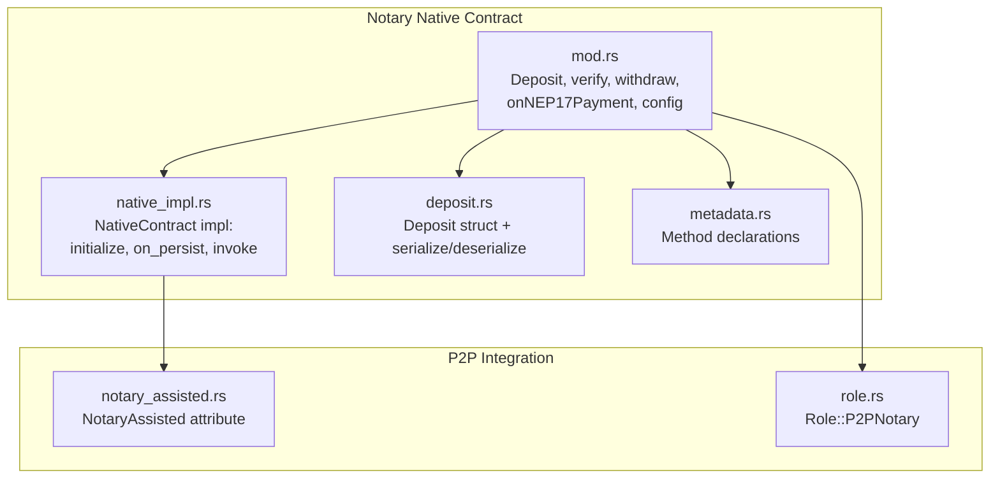
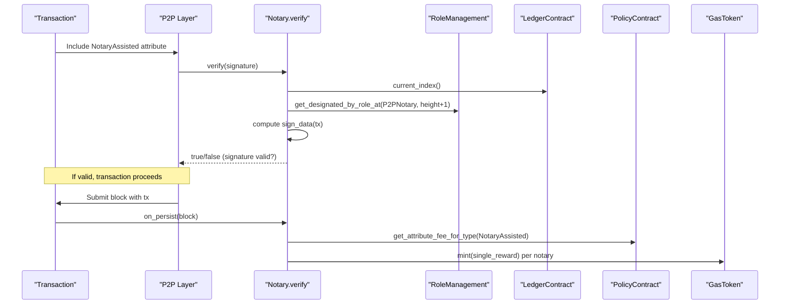
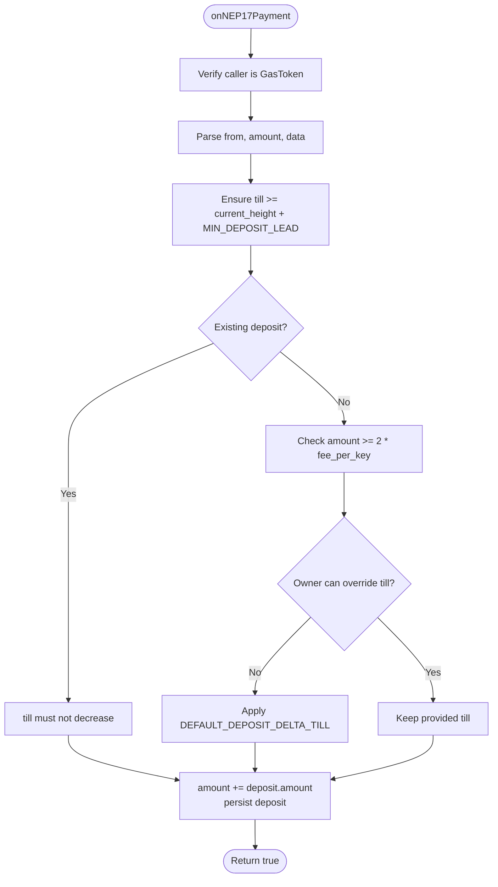
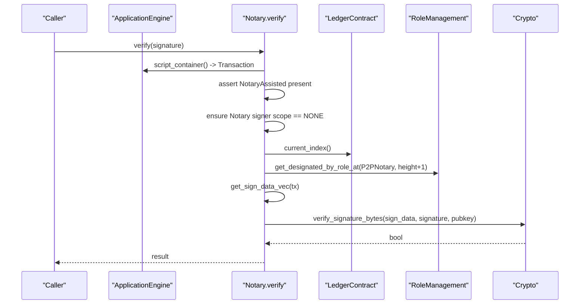
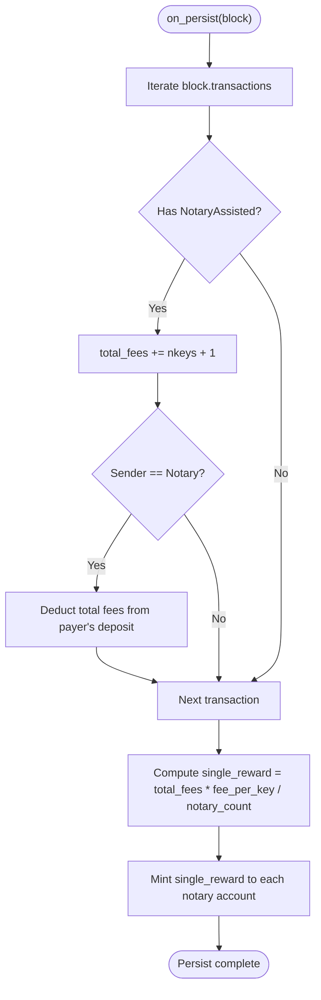
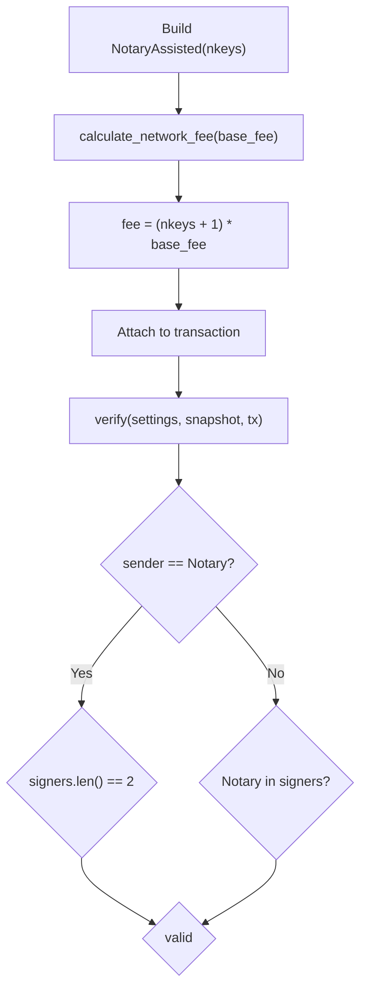
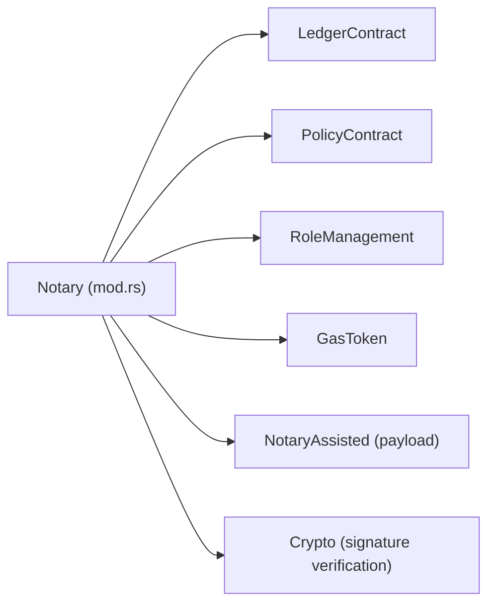

# Notary Contract

<cite>
**Referenced Files in This Document**
- [mod.rs](file://neo-core/src/smart_contract/native/notary/mod.rs)
- [native_impl.rs](file://neo-core/src/smart_contract/native/notary/native_impl.rs)
- [deposit.rs](file://neo-core/src/smart_contract/native/notary/deposit.rs)
- [metadata.rs](file://neo-core/src/smart_contract/native/notary/metadata.rs)
- [notary_assisted.rs](file://neo-core/src/network/p2p/payloads/notary_assisted.rs)
- [role.rs](file://neo-core/src/smart_contract/native/role.rs)
- [notary_contract_tests.rs](file://neo-core/tests/notary_contract_tests.rs)
- [rpc_server_node_tests.rs](file://neo-rpc/src/server/rpc_server_node/tests.rs)
</cite>

## Table of Contents
1. [Introduction](#introduction)
2. [Project Structure](#project-structure)
3. [Core Components](#core-components)
4. [Architecture Overview](#architecture-overview)
5. [Detailed Component Analysis](#detailed-component-analysis)
6. [Dependency Analysis](#dependency-analysis)
7. [Performance Considerations](#performance-considerations)
8. [Troubleshooting Guide](#troubleshooting-guide)
9. [Conclusion](#conclusion)
10. [Appendices](#appendices)

## Introduction
This document explains the Notary native contract that enables witness aggregation and transaction notarization for Neo N3. It covers deposit management, signature verification, consensus participation via designated notary nodes, reward distribution, and integration with P2P networking through the NotaryAssisted attribute. It also provides operational guidance for setting up notary nodes, stake (deposit) requirements, security considerations, fault tolerance, and performance optimization.

## Project Structure
The Notary native contract is implemented as a set of cohesive modules:
- Core logic and storage accessors are in the main module.
- Deposit serialization/deserialization is isolated for clarity and parity with the C# implementation.
- Method registration and signatures are declared in a metadata file.
- Native lifecycle hooks (initialize, on_persist, invoke) are centralized.
- The NotaryAssisted P2P payload defines the attribute used by transactions to opt into notary assistance.
- Role management defines the P2PNotary role used to designate active notaries.

**Diagram sources**
- [mod.rs:1-663](file://neo-core/src/smart_contract/native/notary/mod.rs#L1-L663)
- [native_impl.rs:1-189](file://neo-core/src/smart_contract/native/notary/native_impl.rs#L1-L189)
- [deposit.rs:1-124](file://neo-core/src/smart_contract/native/notary/deposit.rs#L1-L124)
- [metadata.rs:1-19](file://neo-core/src/smart_contract/native/notary/metadata.rs#L1-L19)
- [notary_assisted.rs:1-77](file://neo-core/src/network/p2p/payloads/notary_assisted.rs#L1-L77)
- [role.rs:1-95](file://neo-core/src/smart_contract/native/role.rs#L1-L95)

**Section sources**
- [mod.rs:1-663](file://neo-core/src/smart_contract/native/notary/mod.rs#L1-L663)
- [native_impl.rs:1-189](file://neo-core/src/smart_contract/native/notary/native_impl.rs#L1-L189)
- [deposit.rs:1-124](file://neo-core/src/smart_contract/native/notary/deposit.rs#L1-L124)
- [metadata.rs:1-19](file://neo-core/src/smart_contract/native/notary/metadata.rs#L1-L19)
- [notary_assisted.rs:1-77](file://neo-core/src/network/p2p/payloads/notary_assisted.rs#L1-L77)
- [role.rs:1-95](file://neo-core/src/smart_contract/native/role.rs#L1-L95)

## Core Components
- Notary contract instance and methods: balanceOf, expirationOf, getMaxNotValidBeforeDelta, verify, onNEP17Payment, lockDepositUntil, withdraw, setMaxNotValidBeforeDelta.
- Deposit state: amount and till (expiration block).
- NotaryAssisted attribute: indicates number of keys participating and contributes to network fee calculation.
- Role management: P2PNotary role designates active notary nodes whose public keys are used to verify notary signatures.

Key responsibilities:
- Manage deposits and expiration windows for payers using notary services.
- Verify notary signatures against current designated notaries.
- Distribute rewards to all designated notaries after blocks containing NotaryAssisted transactions.
- Enforce policy constraints such as minimum initial deposit and maximum NotValidBefore delta.

**Section sources**
- [mod.rs:47-663](file://neo-core/src/smart_contract/native/notary/mod.rs#L47-L663)
- [native_impl.rs:19-189](file://neo-core/src/smart_contract/native/notary/native_impl.rs#L19-L189)
- [deposit.rs:8-80](file://neo-core/src/smart_contract/native/notary/deposit.rs#L8-L80)
- [notary_assisted.rs:19-77](file://neo-core/src/network/p2p/payloads/notary_assisted.rs#L19-L77)
- [role.rs:6-20](file://neo-core/src/smart_contract/native/role.rs#L6-L20)

## Architecture Overview
The Notary contract integrates with the ledger, policy, gas token, and role management contracts to provide notarized transactions. Transactions opt-in via the NotaryAssisted attribute. During validation, the contract verifies that a valid notary signature exists from one of the currently designated P2PNotary nodes. On block persistence, fees are collected and distributed among all designated notaries.

**Diagram sources**
- [mod.rs:562-637](file://neo-core/src/smart_contract/native/notary/mod.rs#L562-L637)
- [native_impl.rs:66-137](file://neo-core/src/smart_contract/native/notary/native_impl.rs#L66-L137)
- [notary_assisted.rs:19-77](file://neo-core/src/network/p2p/payloads/notary_assisted.rs#L19-L77)
- [role.rs:6-20](file://neo-core/src/smart_contract/native/role.rs#L6-L20)

## Detailed Component Analysis

### Deposit Management
- Deposits store an amount and expiration block (till). They are serialized with length-prefixed signed big integers for amount followed by a 4-byte little-endian till value.
- Initial deposit requires at least two times the NotaryAssisted attribute fee; subsequent deposits can extend till but cannot reduce it unless the owner explicitly sets a new till.
- Minimum lead ensures deposits remain locked for at least MIN_DEPOSIT_LEAD blocks ahead of current height.
- Withdrawal transfers the deposit back to the owner or a specified recipient only after till has passed.

**Diagram sources**
- [mod.rs:248-343](file://neo-core/src/smart_contract/native/notary/mod.rs#L248-L343)
- [deposit.rs:54-80](file://neo-core/src/smart_contract/native/notary/deposit.rs#L54-L80)

**Section sources**
- [mod.rs:248-343](file://neo-core/src/smart_contract/native/notary/mod.rs#L248-L343)
- [mod.rs:345-396](file://neo-core/src/smart_contract/native/notary/mod.rs#L345-L396)
- [mod.rs:398-491](file://neo-core/src/smart_contract/native/notary/mod.rs#L398-L491)
- [deposit.rs:8-80](file://neo-core/src/smart_contract/native/notary/deposit.rs#L8-L80)

### Signature Verification and Witness Aggregation
- The verify method checks that the transaction includes a NotaryAssisted attribute and that the Notary signer has NONE scope.
- It computes the signing data for the transaction and validates the provided signature against any designated P2PNotary node’s public key.
- For sponsor transactions where the sender is the Notary contract, it additionally ensures the payer’s deposit covers total fees.

**Diagram sources**
- [mod.rs:562-637](file://neo-core/src/smart_contract/native/notary/mod.rs#L562-L637)
- [role.rs:6-20](file://neo-core/src/smart_contract/native/role.rs#L6-L20)

**Section sources**
- [mod.rs:562-637](file://neo-core/src/smart_contract/native/notary/mod.rs#L562-L637)

### Reward Distribution and Consensus Participation
- During on_persist, the contract scans block transactions for NotaryAssisted attributes.
- It accumulates total_fees proportional to nkeys + 1 per transaction.
- It reads the current set of designated P2PNotary nodes and distributes equal rewards to each by minting GAS to their signature contract addresses.
- If no notaries are designated, persist fails with an error.

**Diagram sources**
- [native_impl.rs:66-137](file://neo-core/src/smart_contract/native/notary/native_impl.rs#L66-L137)

**Section sources**
- [native_impl.rs:66-137](file://neo-core/src/smart_contract/native/notary/native_impl.rs#L66-L137)

### NotaryAssisted Attribute and Network Fee Calculation
- The attribute carries nkeys indicating how many keys participate in signing.
- Network fee contribution equals (nkeys + 1) multiplied by the configured base fee for NotaryAssisted.
- Verification ensures either the Notary contract is the sender with exactly two signers or that the Notary contract appears among signers.

**Diagram sources**
- [notary_assisted.rs:19-77](file://neo-core/src/network/p2p/payloads/notary_assisted.rs#L19-L77)

**Section sources**
- [notary_assisted.rs:19-77](file://neo-core/src/network/p2p/payloads/notary_assisted.rs#L19-L77)

### Configuration and Governance
- setMaxNotValidBeforeDelta allows committee to configure the maximum NotValidBefore delta within bounds derived from protocol settings and policy.
- Default values include a default max delta and a default deposit delta when owners cannot override till.

**Section sources**
- [mod.rs:493-560](file://neo-core/src/smart_contract/native/notary/mod.rs#L493-L560)
- [native_impl.rs:52-64](file://neo-core/src/smart_contract/native/notary/native_impl.rs#L52-L64)

## Dependency Analysis
The Notary contract depends on several core components:
- LedgerContract for current block index.
- PolicyContract for attribute fee configuration and MaxValidUntilBlock increment.
- RoleManagement for retrieving designated P2PNotary nodes.
- GasToken for minting rewards and transferring deposits.
- P2P payloads for NotaryAssisted attribute handling.

**Diagram sources**
- [mod.rs:562-637](file://neo-core/src/smart_contract/native/notary/mod.rs#L562-L637)
- [native_impl.rs:66-137](file://neo-core/src/smart_contract/native/notary/native_impl.rs#L66-L137)
- [notary_assisted.rs:19-77](file://neo-core/src/network/p2p/payloads/notary_assisted.rs#L19-L77)
- [role.rs:6-20](file://neo-core/src/smart_contract/native/role.rs#L6-L20)

**Section sources**
- [mod.rs:562-637](file://neo-core/src/smart_contract/native/notary/mod.rs#L562-L637)
- [native_impl.rs:66-137](file://neo-core/src/smart_contract/native/notary/native_impl.rs#L66-L137)
- [notary_assisted.rs:19-77](file://neo-core/src/network/p2p/payloads/notary_assisted.rs#L19-L77)
- [role.rs:6-20](file://neo-core/src/smart_contract/native/role.rs#L6-L20)

## Performance Considerations
- Deposit serialization uses compact length-prefixed encoding to minimize storage overhead.
- Reward distribution mints equal shares to all designated notaries, avoiding per-transaction accounting complexity.
- Reading designated notaries is cached lazily during on_persist to avoid repeated lookups.
- Network fee calculation scales linearly with nkeys; operators should tune base fees to balance throughput and cost.

[No sources needed since this section provides general guidance]

## Troubleshooting Guide
Common issues and resolutions:
- Insufficient deposit: Ensure initial deposit meets at least twice the NotaryAssisted attribute fee. Subsequent deposits must not reduce till unless authorized by the owner.
- Invalid signature: Confirm the signature corresponds to one of the designated P2PNotary nodes at height+1 and that the Notary signer has NONE scope.
- Missing NotaryAssisted attribute: Transactions must include the attribute to use notary verification.
- No notaries designated: Persist will fail if there are no designated P2PNotary nodes; ensure committee has designated nodes.

Operational checks:
- Use balanceOf and expirationOf to inspect deposit status.
- Verify getMaxNotValidBeforeDelta is within allowed bounds.
- Confirm NotaryAssisted attribute fee via policy queries.

**Section sources**
- [mod.rs:248-343](file://neo-core/src/smart_contract/native/notary/mod.rs#L248-L343)
- [mod.rs:562-637](file://neo-core/src/smart_contract/native/notary/mod.rs#L562-L637)
- [native_impl.rs:66-137](file://neo-core/src/smart_contract/native/notary/native_impl.rs#L66-L137)
- [notary_contract_tests.rs:167-198](file://neo-core/tests/notary_contract_tests.rs#L167-L198)
- [rpc_server_node_tests.rs:1119-1404](file://neo-rpc/src/server/rpc_server_node/tests.rs#L1119-L1404)

## Conclusion
The Notary native contract provides a robust mechanism for witness aggregation and transaction notarization through deposit-backed incentives and cryptographic verification against designated notary nodes. Its integration with policy, role management, and P2P payloads ensures secure, configurable, and efficient operation. Proper setup of notary nodes, adequate deposits, and correct attribute usage enable reliable notarization while distributing rewards fairly across participants.

[No sources needed since this section summarizes without analyzing specific files]

## Appendices

### Notary Node Setup and Stake Requirements
- Designate notary nodes via RoleManagement with the P2PNotary role.
- Fund payer accounts and ensure deposits meet minimum requirements based on the NotaryAssisted attribute fee.
- Configure policy parameters including attribute fee and MaxValidUntilBlock increment to control behavior.

**Section sources**
- [role.rs:6-20](file://neo-core/src/smart_contract/native/role.rs#L6-L20)
- [mod.rs:248-343](file://neo-core/src/smart_contract/native/notary/mod.rs#L248-L343)
- [native_impl.rs:52-64](file://neo-core/src/smart_contract/native/notary/native_impl.rs#L52-L64)

### Examples of Notary Operations
- Deposit workflow: Transfer GAS to Notary with metadata specifying owner and till; validate minimum deposit and expiration constraints.
- Lock extension: Owner extends till to keep deposit active beyond current expiration.
- Withdrawal: After till passes, transfer deposit back to owner or another address.
- Notarized transaction: Include NotaryAssisted attribute and a valid notary signature; verify succeeds if signature matches a designated notary.

**Section sources**
- [mod.rs:248-343](file://neo-core/src/smart_contract/native/notary/mod.rs#L248-L343)
- [mod.rs:345-396](file://neo-core/src/smart_contract/native/notary/mod.rs#L345-L396)
- [mod.rs:398-491](file://neo-core/src/smart_contract/native/notary/mod.rs#L398-L491)
- [mod.rs:562-637](file://neo-core/src/smart_contract/native/notary/mod.rs#L562-L637)
- [notary_assisted.rs:19-77](file://neo-core/src/network/p2p/payloads/notary_assisted.rs#L19-L77)

### Security Considerations
- Enforce NONE scope for Notary signer to prevent misuse.
- Validate deposit amounts and expiration to avoid underfunded or expired services.
- Restrict setMaxNotValidBeforeDelta to committee witnesses to prevent unauthorized changes.
- Ensure designated notaries are trusted entities; compromise of private keys could allow forging notary signatures.

**Section sources**
- [mod.rs:562-637](file://neo-core/src/smart_contract/native/notary/mod.rs#L562-L637)
- [mod.rs:493-560](file://neo-core/src/smart_contract/native/notary/mod.rs#L493-L560)

### Fault Tolerance Mechanisms
- Rewards are distributed to all designated notaries; if some nodes are offline, others still receive rewards, maintaining incentive alignment.
- Deposit expiration prevents indefinite locking; owners can manage risk by setting appropriate till values.
- Minimum deposit lead ensures time for network propagation and validation before funds become withdrawable.

**Section sources**
- [native_impl.rs:66-137](file://neo-core/src/smart_contract/native/notary/native_impl.rs#L66-L137)
- [mod.rs:248-343](file://neo-core/src/smart_contract/native/notary/mod.rs#L248-L343)

### Integration with Consensus and P2P Networking
- NotaryAssisted attribute participates in transaction validation and fee calculation within the P2P layer.
- Consensus nodes rely on designated notaries to produce valid notary signatures for notarized transactions.
- Block persistence triggers reward distribution, aligning economic incentives with consensus participation.

**Section sources**
- [notary_assisted.rs:19-77](file://neo-core/src/network/p2p/payloads/notary_assisted.rs#L19-L77)
- [native_impl.rs:66-137](file://neo-core/src/smart_contract/native/notary/native_impl.rs#L66-L137)
- [role.rs:6-20](file://neo-core/src/smart_contract/native/role.rs#L6-L20)