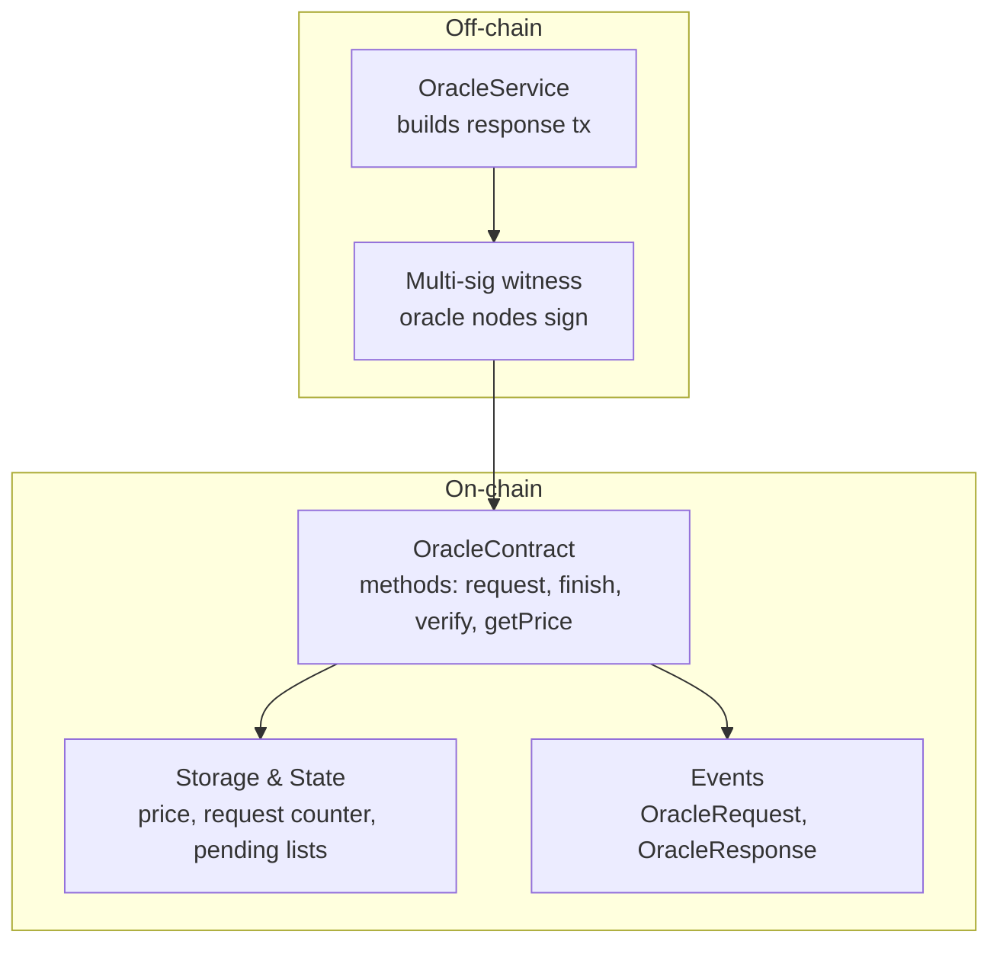
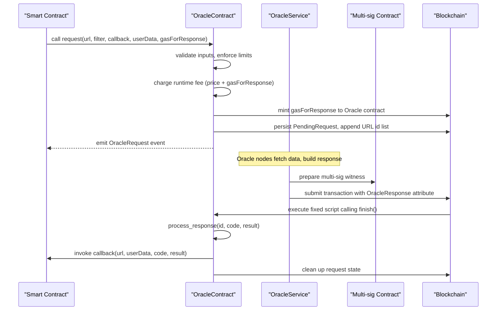
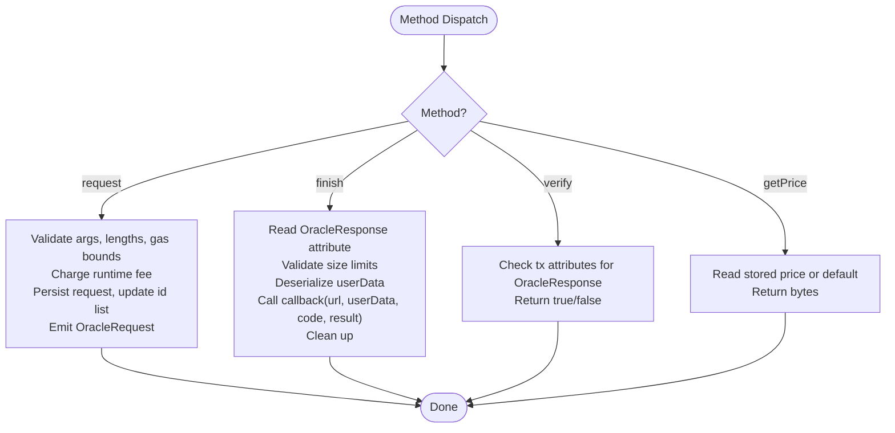
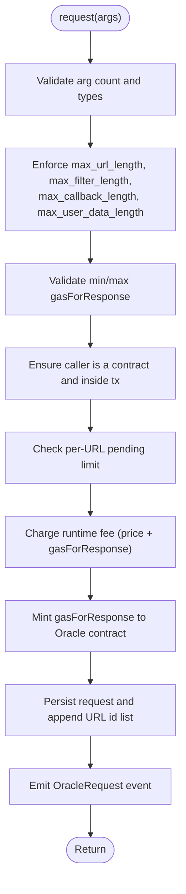
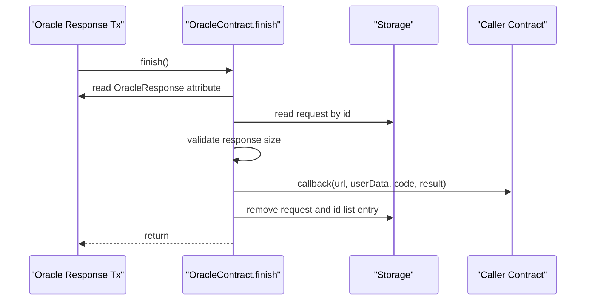
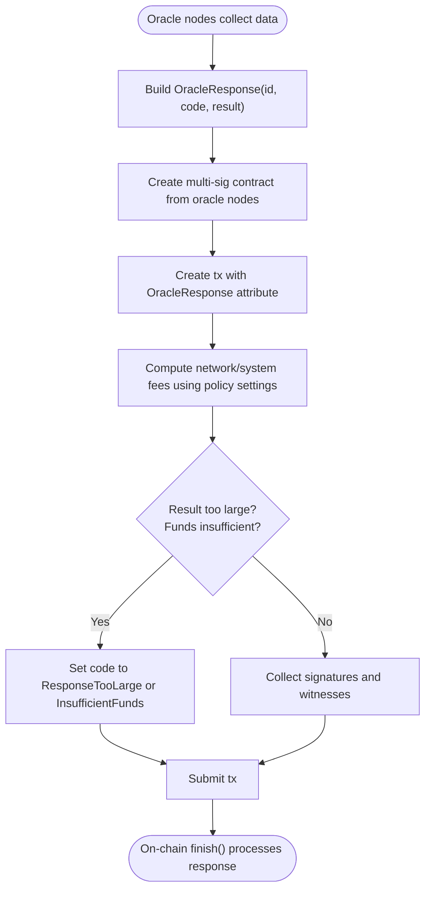
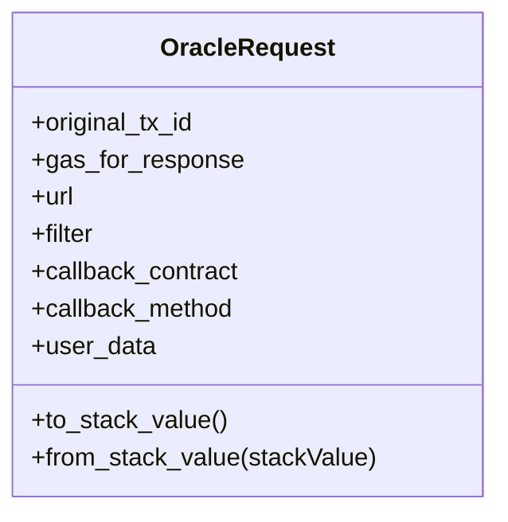
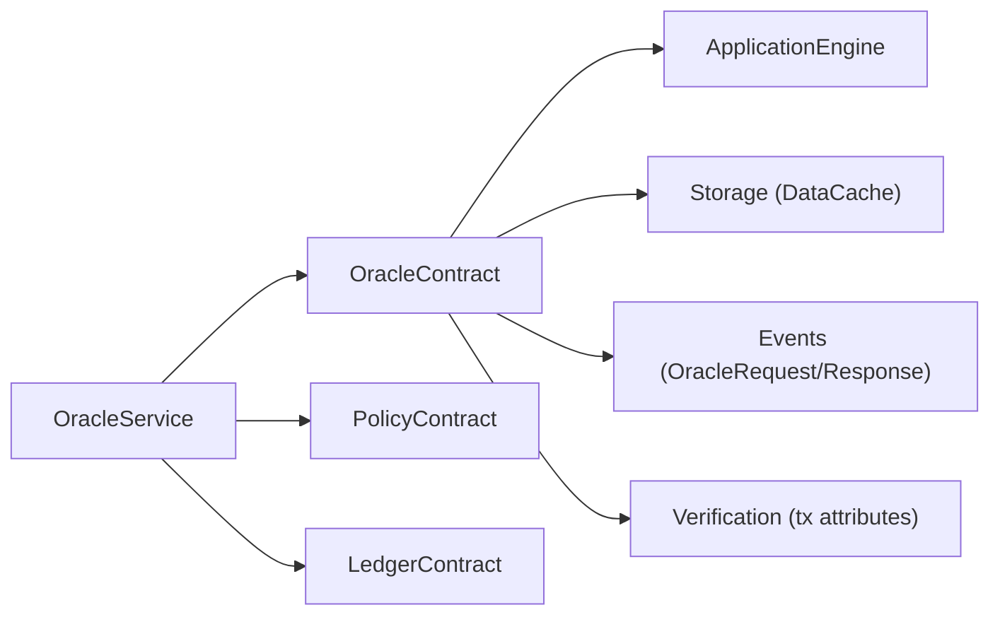

# Oracle Contract

<cite>
**Referenced Files in This Document**
- [mod.rs](file://neo-core/src/smart_contract/native/oracle_contract/mod.rs)
- [config.rs](file://neo-core/src/smart_contract/native/oracle_contract/config.rs)
- [storage.rs](file://neo-core/src/smart_contract/native/oracle_contract/storage.rs)
- [native_impl.rs](file://neo-core/src/smart_contract/native/oracle_contract/native_impl.rs)
- [request.rs](file://neo-core/src/smart_contract/native/oracle_contract/request.rs)
- [response.rs](file://neo-core/src/smart_contract/native/oracle_contract/response.rs)
- [verification.rs](file://neo-core/src/smart_contract/native/oracle_contract/verification.rs)
- [oracle_request.rs](file://neo-core/src/smart_contract/native/oracle_request.rs)
- [metadata.rs](file://neo-core/src/smart_contract/native/oracle_contract/metadata.rs)
- [transactions/response.rs](file://neo-core/src/oracle_service/service/transactions/response.rs)
</cite>

## Table of Contents
1. [Introduction](#introduction)
2. [Project Structure](#project-structure)
3. [Core Components](#core-components)
4. [Architecture Overview](#architecture-overview)
5. [Detailed Component Analysis](#detailed-component-analysis)
6. [Dependency Analysis](#dependency-analysis)
7. [Performance Considerations](#performance-considerations)
8. [Troubleshooting Guide](#troubleshooting-guide)
9. [Conclusion](#conclusion)
10. [Appendices](#appendices)

## Introduction
This document explains the Oracle native contract that enables smart contracts to request and consume off-chain data. It covers how requests are submitted, how responses are delivered back into the blockchain, how data is verified, and how gas is paid for oracle work. It also documents node requirements for oracle operators, request filtering semantics, response formatting, lifecycle management, error handling, security considerations, rate limiting, and cost optimization strategies.

## Project Structure
The Oracle feature spans two main areas:
- On-chain Oracle native contract logic (request submission, pricing, storage, callback invocation, verification).
- Off-chain Oracle service logic (building and submitting response transactions with multi-signature witnesses).

**Diagram sources**
- [mod.rs:70-121](file://neo-core/src/smart_contract/native/oracle_contract/mod.rs#L70-L121)
- [storage.rs:19-116](file://neo-core/src/smart_contract/native/oracle_contract/storage.rs#L19-L116)
- [metadata.rs:23-46](file://neo-core/src/smart_contract/native/oracle_contract/metadata.rs#L23-L46)
- [transactions/response.rs:24-183](file://neo-core/src/oracle_service/service/transactions/response.rs#L24-L183)

**Section sources**
- [mod.rs:1-248](file://neo-core/src/smart_contract/native/oracle_contract/mod.rs#L1-L248)
- [native_impl.rs:13-60](file://neo-core/src/smart_contract/native/oracle_contract/native_impl.rs#L13-L60)

## Core Components
- OracleContract: Entry point for on-chain oracle operations, including method dispatching, pricing, and post-persist cleanup/rewarding.
- Request handling: Validates inputs, enforces limits, charges fees, persists pending requests, and emits events.
- Response handling: Processes oracle response attributes, invokes the caller’s callback with result and status code, and cleans up state.
- Verification: Validates oracle response transactions via built-in verification logic.
- Storage: Manages price, request ID counter, per-URL pending request lists, and serialized request records.
- Configuration: Enforces length limits, timeouts, and gas bounds for responses.

**Section sources**
- [mod.rs:70-121](file://neo-core/src/smart_contract/native/oracle_contract/mod.rs#L70-L121)
- [request.rs:8-132](file://neo-core/src/smart_contract/native/oracle_contract/request.rs#L8-L132)
- [response.rs:12-94](file://neo-core/src/smart_contract/native/oracle_contract/response.rs#L12-L94)
- [verification.rs:6-27](file://neo-core/src/smart_contract/native/oracle_contract/verification.rs#L6-L27)
- [storage.rs:19-116](file://neo-core/src/smart_contract/native/oracle_contract/storage.rs#L19-L116)
- [config.rs:5-46](file://neo-core/src/smart_contract/native/oracle_contract/config.rs#L5-L46)

## Architecture Overview
The oracle workflow consists of a request phase initiated by a smart contract and a response phase executed by oracle nodes off-chain.

**Diagram sources**
- [request.rs:8-132](file://neo-core/src/smart_contract/native/oracle_contract/request.rs#L8-L132)
- [transactions/response.rs:24-183](file://neo-core/src/oracle_service/service/transactions/response.rs#L24-L183)
- [response.rs:12-94](file://neo-core/src/smart_contract/native/oracle_contract/response.rs#L12-L94)

## Detailed Component Analysis

### OracleContract Methods and Lifecycle
- request: Submits an external data request from a smart contract.
- finish: Called by the fixed oracle response script to deliver results back to the requester.
- verify: Returns whether the current transaction contains a valid oracle response attribute.
- getPrice: Reads the current oracle price used to charge callers.

**Diagram sources**
- [mod.rs:70-121](file://neo-core/src/smart_contract/native/oracle_contract/mod.rs#L70-L121)
- [request.rs:8-132](file://neo-core/src/smart_contract/native/oracle_contract/request.rs#L8-L132)
- [response.rs:12-94](file://neo-core/src/smart_contract/native/oracle_contract/response.rs#L12-L94)
- [verification.rs:6-27](file://neo-core/src/smart_contract/native/oracle_contract/verification.rs#L6-L27)

**Section sources**
- [mod.rs:70-121](file://neo-core/src/smart_contract/native/oracle_contract/mod.rs#L70-L121)
- [native_impl.rs:32-60](file://neo-core/src/smart_contract/native/oracle_contract/native_impl.rs#L32-L60)

### Request Submission and Validation
- Input validation: URL, filter, callback name, user data length, and gasForResponse range.
- Caller restriction: Only contracts can call request; must be invoked within a transaction container.
- Rate limiting: Per-URL pending request count enforced to prevent abuse.
- Fees: Runtime fee charged for oracle price and gasForResponse; gasForResponse minted to the oracle contract for later use.
- Persistence: Stores serialized request and appends to per-URL id list; increments global request id counter.

**Diagram sources**
- [request.rs:8-132](file://neo-core/src/smart_contract/native/oracle_contract/request.rs#L8-L132)
- [storage.rs:37-116](file://neo-core/src/smart_contract/native/oracle_contract/storage.rs#L37-L116)
- [config.rs:5-46](file://neo-core/src/smart_contract/native/oracle_contract/config.rs#L5-L46)

**Section sources**
- [request.rs:8-132](file://neo-core/src/smart_contract/native/oracle_contract/request.rs#L8-L132)
- [storage.rs:37-116](file://neo-core/src/smart_contract/native/oracle_contract/storage.rs#L37-L116)
- [config.rs:5-46](file://neo-core/src/smart_contract/native/oracle_contract/config.rs#L5-L46)

### Response Handling and Callback Invocation
- Fixed script: The oracle response transaction executes a fixed script that calls finish().
- Processing: finish() reads the OracleResponse attribute, validates sizes, deserializes userData, and invokes the original contract’s callback with url, userData, code, and result.
- Cleanup: After successful processing, the request is removed and associated id list entries are updated.

**Diagram sources**
- [response.rs:12-94](file://neo-core/src/smart_contract/native/oracle_contract/response.rs#L12-L94)
- [storage.rs:95-116](file://neo-core/src/smart_contract/native/oracle_contract/storage.rs#L95-L116)

**Section sources**
- [response.rs:12-94](file://neo-core/src/smart_contract/native/oracle_contract/response.rs#L12-L94)

### Oracle Node Requirements and Response Transaction Building
- Multi-sig requirement: Oracle nodes form a multi-signature contract based on designated oracle nodes; m-of-n threshold is computed.
- Transaction construction: Builds a transaction with OracleResponse attribute, sets valid_until_block, computes network/system fees, and prepares witnesses.
- Size and funding checks: If result exceeds maximum size or if total fees exceed gasForResponse, the response is marked accordingly.
- Verification pre-check: Executes the oracle contract’s verify method during transaction building to ensure correctness.

**Diagram sources**
- [transactions/response.rs:24-183](file://neo-core/src/oracle_service/service/transactions/response.rs#L24-L183)

**Section sources**
- [transactions/response.rs:24-183](file://neo-core/src/oracle_service/service/transactions/response.rs#L24-L183)

### Data Models and Serialization
- OracleRequest: Represents the persisted request fields and provides conversion to/from VM stack values for serialization compatibility.
- Storage format: Requests are serialized as arrays with specific item order and types; id lists are serialized as arrays of integers.

**Diagram sources**
- [oracle_request.rs:7-125](file://neo-core/src/smart_contract/native/oracle_request.rs#L7-L125)

**Section sources**
- [oracle_request.rs:7-125](file://neo-core/src/smart_contract/native/oracle_request.rs#L7-L125)
- [storage.rs:123-192](file://neo-core/src/smart_contract/native/oracle_contract/storage.rs#L123-L192)

### Events and Metadata
- OracleRequest event: Emits id, requesting contract hash, url, and filter when a new request is created.
- OracleResponse event: Emits id and original transaction hash when a response is processed.

**Section sources**
- [metadata.rs:23-46](file://neo-core/src/smart_contract/native/oracle_contract/metadata.rs#L23-L46)

## Dependency Analysis
Key dependencies and relationships:
- OracleContract depends on ApplicationEngine for execution context, snapshot access, and fee accounting.
- Storage layer uses BinarySerializer and StackValue for consistent serialization across on-chain and off-chain components.
- OracleService constructs response transactions and relies on PolicyContract and LedgerContract for fee and block height calculations.
- Verification integrates with transaction attribute validation to ensure only authorized oracle responses are accepted.

**Diagram sources**
- [native_impl.rs:13-60](file://neo-core/src/smart_contract/native/oracle_contract/native_impl.rs#L13-L60)
- [transactions/response.rs:24-183](file://neo-core/src/oracle_service/service/transactions/response.rs#L24-L183)
- [verification.rs:6-27](file://neo-core/src/smart_contract/native/oracle_contract/verification.rs#L6-L27)

**Section sources**
- [native_impl.rs:13-60](file://neo-core/src/smart_contract/native/oracle_contract/native_impl.rs#L13-L60)
- [transactions/response.rs:24-183](file://neo-core/src/oracle_service/service/transactions/response.rs#L24-L183)

## Performance Considerations
- Fee model: Callers pay both the oracle price and the reserved gasForResponse; ensure appropriate budgeting to avoid InsufficientFunds responses.
- Size limits: Enforced limits on URL, filter, callback, user data, and response length protect against DoS and excessive storage usage.
- Per-URL rate limiting: Limits pending responses per URL to mitigate spam and resource exhaustion.
- Gas estimation: OracleService estimates network fees based on policy settings and multi-sig complexity; tune gasForResponse accordingly.
- Serialization efficiency: Use compact user data and filters to minimize payload sizes and reduce fees.

[No sources needed since this section provides general guidance]

## Troubleshooting Guide
Common issues and resolutions:
- Invalid argument count or types: Ensure exactly five arguments are passed to request with correct types and encodings.
- Length violations: Keep URL, filter, callback, and user data within configured limits.
- Caller restrictions: Only contracts can call request; ensure invocation originates from a deployed contract.
- Per-URL pending limit exceeded: Reduce concurrent requests per URL or wait for responses to complete.
- Insufficient funds: Increase gasForResponse to cover expected network and system fees for the response transaction.
- Response too large: Reduce result size or split data into multiple requests.
- Verify failures: Ensure the oracle response attribute is correctly formed and signed by the designated oracle nodes.

**Section sources**
- [request.rs:8-132](file://neo-core/src/smart_contract/native/oracle_contract/request.rs#L8-L132)
- [response.rs:12-94](file://neo-core/src/smart_contract/native/oracle_contract/response.rs#L12-L94)
- [transactions/response.rs:161-172](file://neo-core/src/oracle_service/service/transactions/response.rs#L161-L172)

## Conclusion
The Oracle native contract provides a secure, fee-controlled mechanism for smart contracts to access off-chain data. By enforcing strict input validation, rate limiting, and gas accounting, it balances flexibility with protection against abuse. Oracle nodes construct response transactions with multi-signature witnesses, ensuring integrity and authorization. Proper configuration and careful budgeting of gasForResponse enable reliable operation while optimizing costs.

[No sources needed since this section summarizes without analyzing specific files]

## Appendices

### Example Workflows

- Request external API data:
  - From your smart contract, call request with a URL, optional JSON path filter, callback method name, small user data payload, and sufficient gasForResponse.
  - Monitor OracleRequest events to track request ids.

- Process responses:
  - Implement the callback method to accept url, userData, code, and result.
  - Handle success and failure codes appropriately; re-request or fallback as needed.

- Handle oracle failures:
  - If code indicates ResponseTooLarge or InsufficientFunds, adjust result size or increase gasForResponse respectively.
  - Implement retry logic with exponential backoff and circuit breakers for robustness.

[No sources needed since this section provides conceptual examples]

### Security Considerations
- Trust model: Responses are validated via multi-signature witnesses; ensure oracle node sets are reputable and diversified.
- Input sanitization: Validate all incoming data in callbacks; do not assume off-chain data is trustworthy.
- Reentrancy: Avoid reentrant calls in callbacks that could alter oracle state unexpectedly.
- Access control: Restrict who can trigger oracle requests and manage oracle node roles through governance mechanisms.

[No sources needed since this section provides general guidance]

### Rate Limiting and Cost Optimization
- Rate limiting:
  - Respect per-URL pending limits; batch requests where possible.
  - Use filters to minimize unnecessary data retrieval.

- Cost optimization:
  - Choose minimal user data payloads.
  - Tune gasForResponse based on observed network fees and multi-sig complexity.
  - Cache frequently requested data off-chain or on-chain to reduce repeated oracle calls.

[No sources needed since this section provides general guidance]