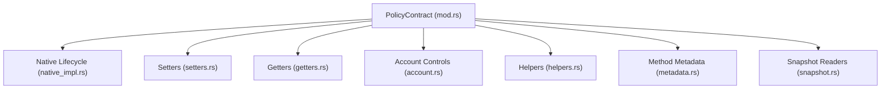
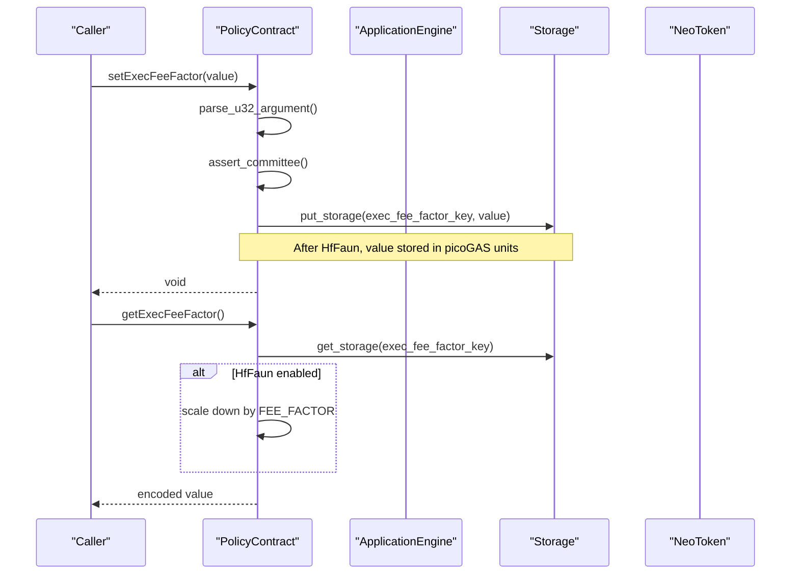
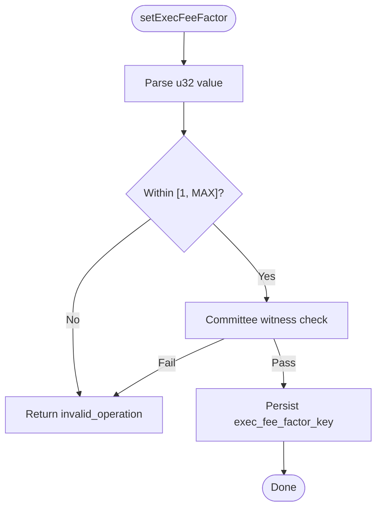
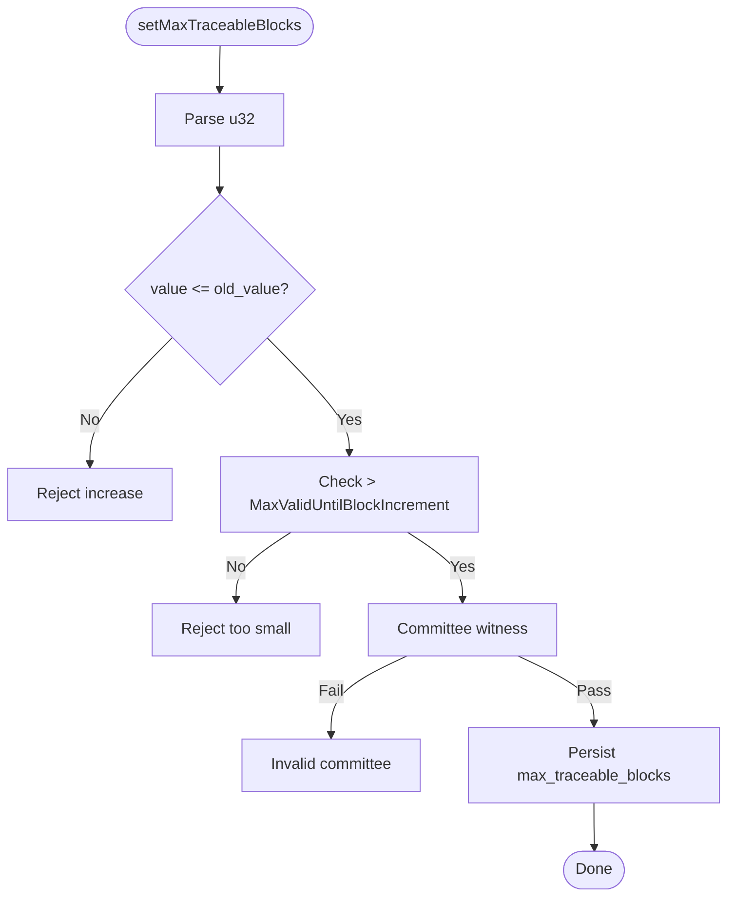
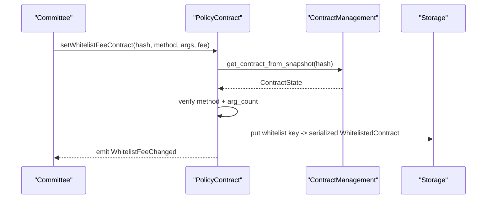
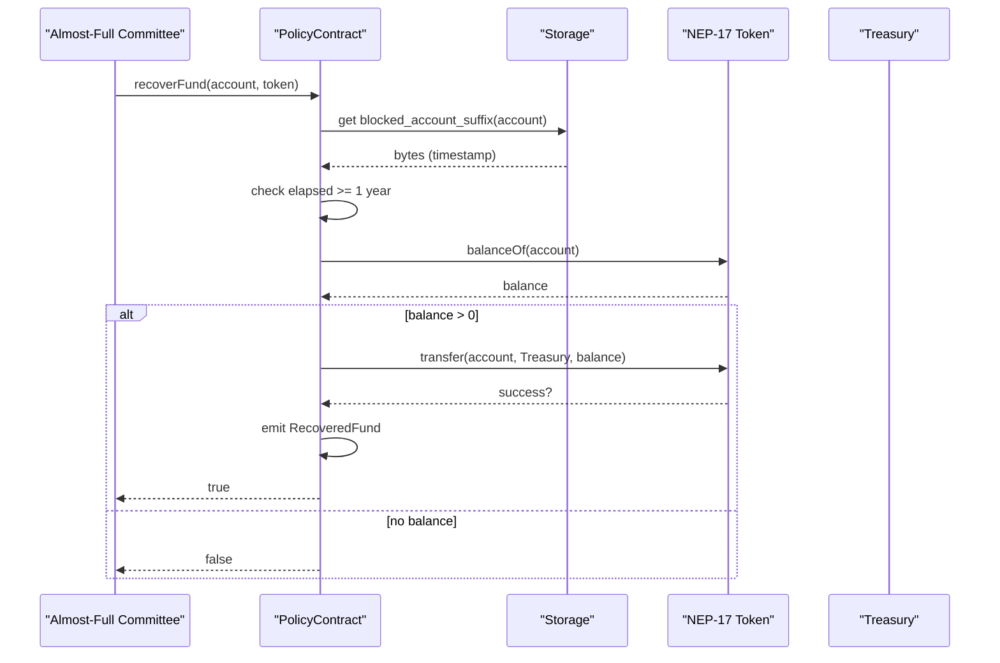
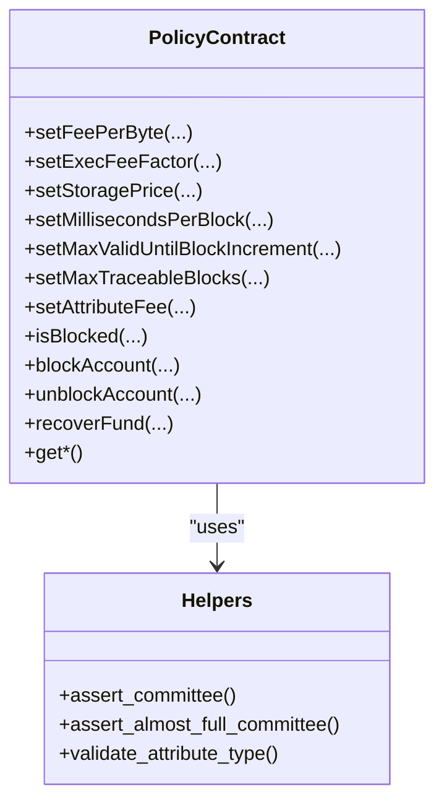
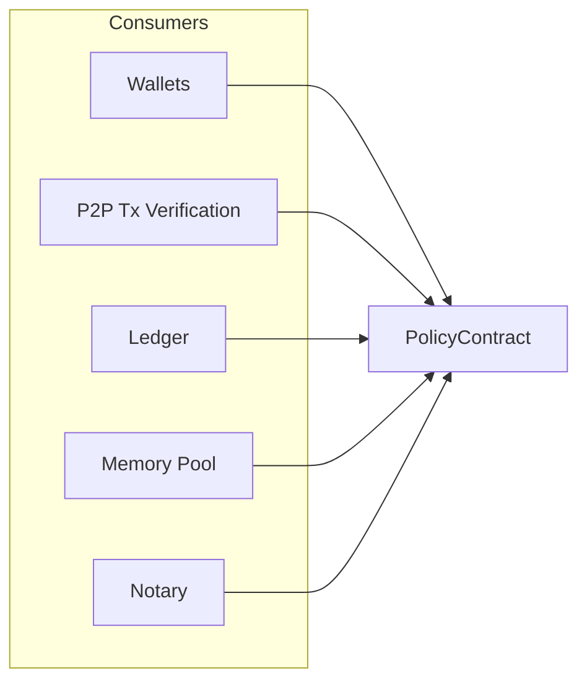

# Policy Contract

<cite>
**Referenced Files in This Document**
- [mod.rs](file://neo-core/src/smart_contract/native/policy_contract/mod.rs)
- [native_impl.rs](file://neo-core/src/smart_contract/native/policy_contract/native_impl.rs)
- [setters.rs](file://neo-core/src/smart_contract/native/policy_contract/setters.rs)
- [getters.rs](file://neo-core/src/smart_contract/native/policy_contract/getters.rs)
- [account.rs](file://neo-core/src/smart_contract/native/policy_contract/account.rs)
- [helpers.rs](file://neo-core/src/smart_contract/native/policy_contract/helpers.rs)
- [metadata.rs](file://neo-core/src/smart_contract/native/policy_contract/metadata.rs)
- [snapshot.rs](file://neo-core/src/smart_contract/native/policy_contract/snapshot.rs)
- [tests.rs](file://neo-core/src/smart_contract/native/policy_contract/tests.rs)
</cite>

## Table of Contents
1. Introduction
2. Project Structure
3. Core Components
4. Architecture Overview
5. Detailed Component Analysis
6. Dependency Analysis
7. Performance Considerations
8. Troubleshooting Guide
9. Conclusion
10. Appendices

## Introduction
This document provides comprehensive documentation for the PolicyContract native contract that manages network policies and restrictions. It covers policy configuration methods (fee rates, execution limits, asset policies, validator-related parameters), enforcement mechanisms, parameter validation, governance processes, role-based access control integration, and policy inheritance via hardforks. It also includes examples of configuring network parameters, setting execution limits, managing validator permissions, and details on update procedures and rollback considerations.

## Project Structure
The PolicyContract is implemented as a native contract with a modular layout:
- mod.rs: Defines the contract struct, constants, default values, storage prefixes, and shared types such as WhitelistedContract.
- native_impl.rs: Implements NativeContract lifecycle including initialization and hardfork-specific migrations.
- setters.rs: Implements committee-gated setters for policy parameters and whitelist management.
- getters.rs: Implements read-only getters for current policy values.
- account.rs: Implements account blocking/unblocking, blocked accounts enumeration, and fund recovery.
- helpers.rs: Provides encoding/decoding utilities, storage key builders, and authorization helpers.
- metadata.rs: Declares exposed methods, call flags, activation conditions by hardfork, and event descriptors.
- snapshot.rs: Provides snapshot-based readers used across the system to enforce policy at runtime.

**Diagram sources**
- [mod.rs:124-210](file://neo-core/src/smart_contract/native/policy_contract/mod.rs#L124-L210)
- [native_impl.rs:23-149](file://neo-core/src/smart_contract/native/policy_contract/native_impl.rs#L23-L149)
- [setters.rs:11-459](file://neo-core/src/smart_contract/native/policy_contract/setters.rs#L11-L459)
- [getters.rs:8-129](file://neo-core/src/smart_contract/native/policy_contract/getters.rs#L8-L129)
- [account.rs:8-336](file://neo-core/src/smart_contract/native/policy_contract/account.rs#L8-L336)
- [helpers.rs:10-201](file://neo-core/src/smart_contract/native/policy_contract/helpers.rs#L10-L201)
- [metadata.rs:8-91](file://neo-core/src/smart_contract/native/policy_contract/metadata.rs#L8-L91)
- [snapshot.rs:7-197](file://neo-core/src/smart_contract/native/policy_contract/snapshot.rs#L7-L197)

**Section sources**
- [mod.rs:124-210](file://neo-core/src/smart_contract/native/policy_contract/mod.rs#L124-L210)

## Core Components
- Fee and execution limits:
  - FeePerByte: Network fee per transaction byte.
  - ExecFeeFactor: Execution cost multiplier; after Faun hardfork stored in picoGAS units and scaled accordingly.
  - StoragePrice: Price per unit of storage.
  - AttributeFee: Per attribute type fee; NotaryAssisted supported after Echidna.
- Block and validity limits:
  - MillisecondsPerBlock: Target block time window.
  - MaxValidUntilBlockIncrement: Maximum ValidUntil increment allowed.
  - MaxTraceableBlocks: Maximum traceable history length; can only be decreased.
- Account controls:
  - Blocked accounts list with optional timestamps post-Faun.
  - recoverFund: Transfers funds from blocked accounts to treasury after a mandatory waiting period using an almost-full committee signature.
- Whitelist fee contracts:
  - Fixed fees for specific contract methods; supports add/remove/query.

Governance and access control:
- Most setters require a valid committee witness.
- recoverFund requires an almost-full committee witness.
- Hardfork-aware behavior ensures compatibility and migration during activation blocks.

**Section sources**
- [mod.rs:131-184](file://neo-core/src/smart_contract/native/policy_contract/mod.rs#L131-L184)
- [native_impl.rs:23-149](file://neo-core/src/smart_contract/native/policy_contract/native_impl.rs#L23-L149)
- [setters.rs:11-459](file://neo-core/src/smart_contract/native/policy_contract/setters.rs#L11-L459)
- [account.rs:8-336](file://neo-core/src/smart_contract/native/policy_contract/account.rs#L8-L336)
- [helpers.rs:116-170](file://neo-core/src/smart_contract/native/policy_contract/helpers.rs#L116-L170)
- [metadata.rs:14-39](file://neo-core/src/smart_contract/native/policy_contract/metadata.rs#L14-L39)

## Architecture Overview
PolicyContract exposes a stable method surface governed by hardforks. Setters validate inputs, enforce committee signatures, and persist changes. Getters return current values or defaults. Snapshot readers are consumed by other components (wallets, P2P, ledger, notary) to enforce policy consistently.

**Diagram sources**
- [setters.rs:43-78](file://neo-core/src/smart_contract/native/policy_contract/setters.rs#L43-L78)
- [getters.rs:17-33](file://neo-core/src/smart_contract/native/policy_contract/getters.rs#L17-L33)
- [native_impl.rs:48-75](file://neo-core/src/smart_contract/native/policy_contract/native_impl.rs#L48-L75)
- [helpers.rs:116-123](file://neo-core/src/smart_contract/native/policy_contract/helpers.rs#L116-L123)

**Section sources**
- [metadata.rs:14-39](file://neo-core/src/smart_contract/native/policy_contract/metadata.rs#L14-L39)
- [native_impl.rs:23-149](file://neo-core/src/smart_contract/native/policy_contract/native_impl.rs#L23-L149)

## Detailed Component Analysis

### Fee and Execution Limits
- setFeePerByte(value): Validates range and requires committee witness; persists FeePerByte.
- setExecFeeFactor(value): Validates range against max (scaled by FEE_FACTOR after HfFaun); persists ExecFeeFactor.
- getExecFeeFactor(): Returns legacy-scaled value when HfFaun is active; otherwise returns raw stored value.
- getExecPicoFeeFactor(): Returns raw picoGAS value for compatibility.
- setStoragePrice(value): Validates range and requires committee witness; persists StoragePrice.
- getAttributeFee(attributeType): Reads per-attribute fee; NotaryAssisted allowed after HfEchidna.

**Diagram sources**
- [setters.rs:43-78](file://neo-core/src/smart_contract/native/policy_contract/setters.rs#L43-L78)
- [helpers.rs:116-123](file://neo-core/src/smart_contract/native/policy_contract/helpers.rs#L116-L123)

**Section sources**
- [setters.rs:11-108](file://neo-core/src/smart_contract/native/policy_contract/setters.rs#L11-L108)
- [getters.rs:8-56](file://neo-core/src/smart_contract/native/policy_contract/getters.rs#L8-L56)
- [native_impl.rs:48-75](file://neo-core/src/smart_contract/native/policy_contract/native_impl.rs#L48-L75)

### Block Time and Validity Limits
- setMillisecondsPerBlock(value): Requires committee witness; emits MillisecondsPerBlockChanged event.
- setMaxValidUntilBlockIncrement(value): Must be less than MaxTraceableBlocks; requires committee witness.
- setMaxTraceableBlocks(value): Can only decrease; must remain larger than MaxValidUntilBlockIncrement; requires committee witness.

**Diagram sources**
- [setters.rs:199-249](file://neo-core/src/smart_contract/native/policy_contract/setters.rs#L199-L249)

**Section sources**
- [setters.rs:110-197](file://neo-core/src/smart_contract/native/policy_contract/setters.rs#L110-L197)
- [setters.rs:199-249](file://neo-core/src/smart_contract/native/policy_contract/setters.rs#L199-L249)

### Asset Policies and Whitelist Fees
- setWhitelistFeeContract(contractHash, method, argCount, fixedFee): Validates contract exists and method signature; stores fixed fee mapping; emits WhitelistFeeChanged.
- removeWhitelistFeeContract(...): Removes entry if present; emits event with null fee.
- getWhitelistFeeContracts(): Returns iterator over whitelisted entries.

**Diagram sources**
- [setters.rs:285-357](file://neo-core/src/smart_contract/native/policy_contract/setters.rs#L285-L357)

**Section sources**
- [setters.rs:285-418](file://neo-core/src/smart_contract/native/policy_contract/setters.rs#L285-L418)
- [getters.rs:114-129](file://neo-core/src/smart_contract/native/policy_contract/getters.rs#L114-L129)

### Account Blocking and Fund Recovery
- isBlocked(account): Checks presence under blocked account prefix.
- blockAccount(account): Committee-gated; after HfFaun writes timestamp and revokes votes; pre-Faun entries migrated at activation.
- unblockAccount(account): Committee-gated; removes entry if present.
- getBlockedAccounts(): Returns iterator over blocked accounts.
- recoverFund(account, token): Almost-full committee required; enforces 1-year wait; verifies token is NEP-17; transfers balance to Treasury; emits RecoveredFund.

**Diagram sources**
- [account.rs:157-326](file://neo-core/src/smart_contract/native/policy_contract/account.rs#L157-L326)
- [helpers.rs:125-151](file://neo-core/src/smart_contract/native/policy_contract/helpers.rs#L125-L151)

**Section sources**
- [account.rs:8-155](file://neo-core/src/smart_contract/native/policy_contract/account.rs#L8-L155)
- [account.rs:157-326](file://neo-core/src/smart_contract/native/policy_contract/account.rs#L157-L326)
- [helpers.rs:125-151](file://neo-core/src/smart_contract/native/policy_contract/helpers.rs#L125-L151)

### Governance and Role-Based Access Control
- Committee multisig: Required for most setters via assert_committee.
- Almost-full committee: Required for recoverFund via assert_almost_full_committee.
- Hardfork gating: Methods and behaviors change at HfFaun and HfEchidna; metadata declares activation and deprecation.

**Diagram sources**
- [metadata.rs:14-39](file://neo-core/src/smart_contract/native/policy_contract/metadata.rs#L14-L39)
- [helpers.rs:116-170](file://neo-core/src/smart_contract/native/policy_contract/helpers.rs#L116-L170)

**Section sources**
- [helpers.rs:116-170](file://neo-core/src/smart_contract/native/policy_contract/helpers.rs#L116-L170)
- [metadata.rs:14-39](file://neo-core/src/smart_contract/native/policy_contract/metadata.rs#L14-L39)

### Policy Inheritance via Hardforks
- HfFaun:
  - ExecFeeFactor stored in picoGAS; getters scale down for legacy compatibility.
  - blockAccount writes timestamp and revokes votes; pre-Faun entries migrated at activation.
  - New methods/events: recoverFund, WhitelistFeeChanged, getBlockedAccounts, getWhitelistFeeContracts.
- HfEchidna:
  - NotaryAssisted attribute fee support.
  - New getters/setters for MillisecondsPerBlock, MaxValidUntilBlockIncrement, MaxTraceableBlocks.
  - Event descriptors include MillisecondsPerBlockChanged.

**Section sources**
- [native_impl.rs:48-149](file://neo-core/src/smart_contract/native/policy_contract/native_impl.rs#L48-L149)
- [metadata.rs:14-39](file://neo-core/src/smart_contract/native/policy_contract/metadata.rs#L14-L39)
- [getters.rs:17-47](file://neo-core/src/smart_contract/native/policy_contract/getters.rs#L17-L47)

## Dependency Analysis
PolicyContract is consumed by multiple subsystems to enforce policy:
- Wallets: Use snapshot readers to compute network fees and enforce validity windows.
- P2P Transaction Verification: Enforces MaxValidUntilBlockIncrement and fee factors.
- Ledger and Memory Pool: Read block timing and traceability limits.
- Notary: Uses MaxValidUntilBlockIncrement to constrain deltas.

**Diagram sources**
- [snapshot.rs:7-197](file://neo-core/src/smart_contract/native/policy_contract/snapshot.rs#L7-L197)

**Section sources**
- [snapshot.rs:7-197](file://neo-core/src/smart_contract/native/policy_contract/snapshot.rs#L7-L197)

## Performance Considerations
- ExecFeeFactor scaling: After HfFaun, values are stored in picoGAS to preserve precision while enabling fine-grained tuning.
- Storage iteration: Whitelist and blocked accounts use iterators to avoid loading entire sets into memory.
- Validation early exit: Parameter validation and authority checks occur before storage writes to minimize unnecessary work.

[No sources needed since this section provides general guidance]

## Troubleshooting Guide
Common errors and resolutions:
- Invalid committee signature: Ensure calls to setters are signed by a valid committee multisig.
- Value out of range: Check min/max constraints enforced by setters (e.g., ExecFeeFactor, StoragePrice).
- Cannot increase MaxTraceableBlocks: Only decreases are allowed; coordinate with MaxValidUntilBlockIncrement.
- recoverFund too early: Wait until at least one year has elapsed since block time recorded for the blocked account.
- NotaryAssisted attribute unsupported: Enable HfEchidna before setting its fee.

**Section sources**
- [setters.rs:11-459](file://neo-core/src/smart_contract/native/policy_contract/setters.rs#L11-L459)
- [account.rs:157-326](file://neo-core/src/smart_contract/native/policy_contract/account.rs#L157-L326)
- [helpers.rs:116-170](file://neo-core/src/smart_contract/native/policy_contract/helpers.rs#L116-L170)

## Conclusion
PolicyContract centralizes network policy configuration and enforcement with robust governance and hardfork-aware behavior. It provides clear APIs for fee tuning, execution limits, asset policies, and validator-related parameters, while integrating tightly with other core components through snapshot-based reads. Committee and almost-full committee controls ensure secure updates, and hardforks enable evolution without breaking compatibility.

[No sources needed since this section summarizes without analyzing specific files]

## Appendices

### Examples of Configuring Network Parameters
- Configure fee rate: Call setFeePerByte with a value within the allowed range and sign with committee.
- Set execution limit: Call setExecFeeFactor with a value within [1, MAX], considering HfFaun scaling.
- Adjust storage price: Call setStoragePrice within allowed bounds and sign with committee.
- Manage attribute fees: Call setAttributeFee for supported types; NotaryAssisted available after HfEchidna.

**Section sources**
- [setters.rs:11-108](file://neo-core/src/smart_contract/native/policy_contract/setters.rs#L11-L108)
- [metadata.rs:14-39](file://neo-core/src/smart_contract/native/policy_contract/metadata.rs#L14-L39)

### Managing Validator Permissions
- Validator-related limits are enforced via MaxValidUntilBlockIncrement and MaxTraceableBlocks; adjust these with committee signatures and respect their mutual constraints.
- Notary module references these limits to constrain deltas.

**Section sources**
- [setters.rs:158-249](file://neo-core/src/smart_contract/native/policy_contract/setters.rs#L158-L249)

### Policy Update Procedures and Rollback Mechanisms
- Updates are immediate upon successful committee-signed transactions.
- Some parameters have built-in safeguards (e.g., MaxTraceableBlocks cannot increase; recoverFund requires a long delay).
- No explicit rollback method exists; revert by issuing a new setter call with the desired value.

**Section sources**
- [setters.rs:199-249](file://neo-core/src/smart_contract/native/policy_contract/setters.rs#L199-L249)
- [account.rs:157-326](file://neo-core/src/smart_contract/native/policy_contract/account.rs#L157-L326)