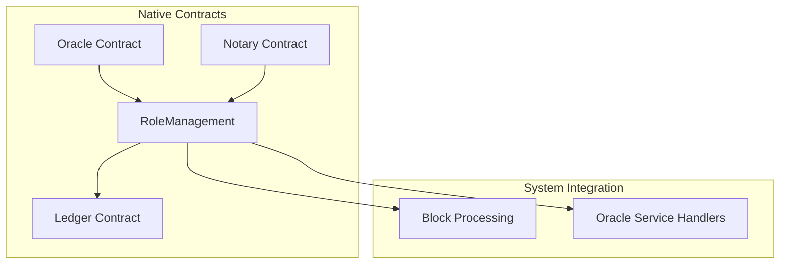
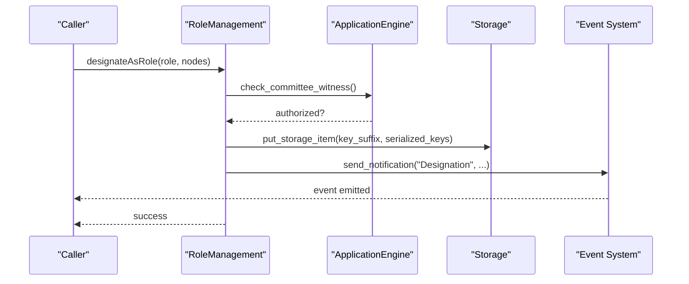
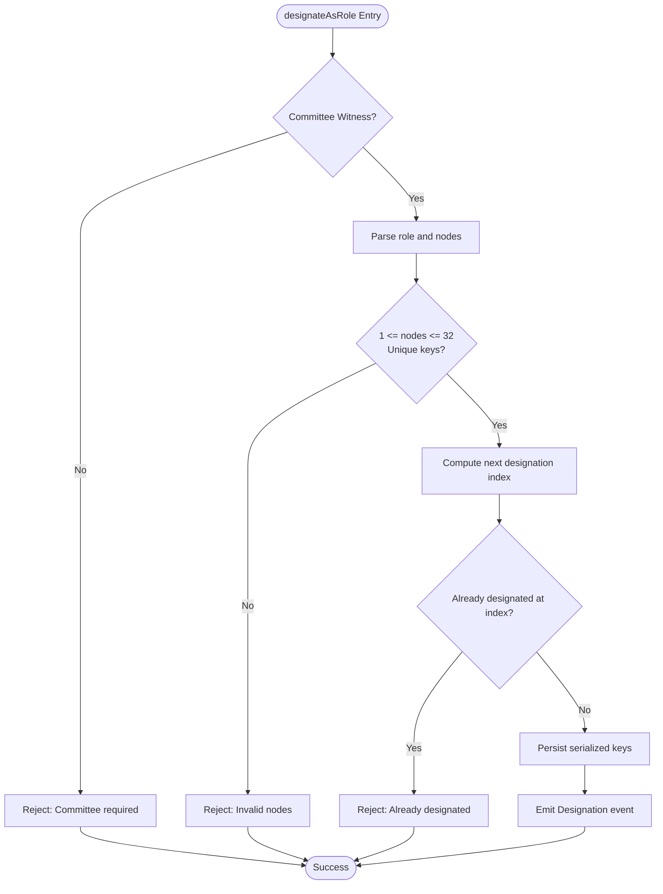
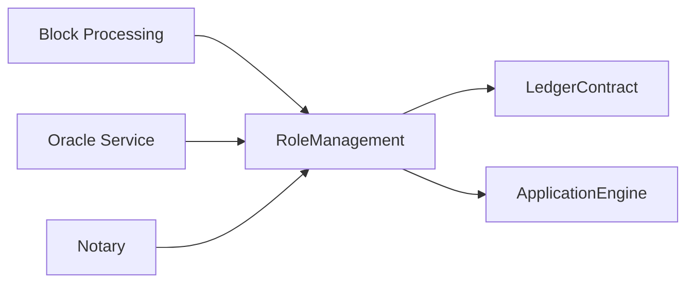

# Role Management

<cite>
**Referenced Files in This Document**
- [mod.rs](file://neo-core/src/smart_contract/native/role_management/mod.rs)
- [storage.rs](file://neo-core/src/smart_contract/native/role_management/storage.rs)
- [metadata.rs](file://neo-core/src/smart_contract/native/role_management/metadata.rs)
- [role.rs](file://neo-core/src/smart_contract/native/role.rs)
- [native_mod.rs](file://neo-core/src/smart_contract/native/mod.rs)
- [block_processing.rs](file://neo-core/src/ledger/blockchain/block_processing.rs)
- [oracle_handlers.rs](file://neo-core/src/oracle_service/service/handlers.rs)
</cite>

## Table of Contents
1. [Introduction](#introduction)
2. [Project Structure](#project-structure)
3. [Core Components](#core-components)
4. [Architecture Overview](#architecture-overview)
5. [Detailed Component Analysis](#detailed-component-analysis)
6. [Dependency Analysis](#dependency-analysis)
7. [Performance Considerations](#performance-considerations)
8. [Troubleshooting Guide](#troubleshooting-guide)
9. [Conclusion](#conclusion)
10. [Appendices](#appendices)

## Introduction
This document explains the RoleManagement native contract that implements role-based access control for designated nodes on the Neo blockchain. It covers the supported roles, their permissions, how roles are assigned and revoked, validator management, privilege escalation controls, security implications, best practices, and audit trails for monitoring role changes.

## Project Structure
RoleManagement is implemented as a native contract with three primary modules:
- Core logic and method dispatching
- Storage helpers for serialization and lookup
- Metadata defining exposed methods and events

It is registered among other native contracts and activated by a specific hardfork.

**Diagram sources**
- [native_mod.rs:160-197](file://neo-core/src/smart_contract/native/mod.rs#L160-L197)
- [block_processing.rs:400-420](file://neo-core/src/ledger/blockchain/block_processing.rs#L400-L420)
- [oracle_handlers.rs:32-53](file://neo-core/src/oracle_service/service/handlers.rs#L32-L53)

**Section sources**
- [native_mod.rs:160-197](file://neo-core/src/smart_contract/native/mod.rs#L160-L197)
- [mod.rs:20-43](file://neo-core/src/smart_contract/native/role_management/mod.rs#L20-L43)

## Core Components
- Roles: StateValidator, Oracle, NeoFSAlphabetNode, P2PNotary
- Methods:
  - getDesignatedByRole(role, index): returns public keys designated for a role at a given block index
  - designateAsRole(role, nodes): assigns or revokes nodes for a role (committee-only)
- Events:
  - Designation: emitted when a designation changes; includes old/new node lists after activation

Key constants:
- Maximum nodes per role: 32
- CPU fee for methods

Permissions:
- Only committee witnesses can call designateAsRole
- All nodes can read designations via getDesignatedByRole

Security:
- Duplicate public keys are rejected
- Designation must be unique per block index
- Index validation prevents future designations beyond current + 1

**Section sources**
- [role.rs:6-20](file://neo-core/src/smart_contract/native/role.rs#L6-L20)
- [metadata.rs:8-25](file://neo-core/src/smart_contract/native/role_management/metadata.rs#L8-L25)
- [mod.rs:27-31](file://neo-core/src/smart_contract/native/role_management/mod.rs#L27-L31)
- [mod.rs:81-194](file://neo-core/src/smart_contract/native/role_management/mod.rs#L81-L194)
- [metadata.rs:27-44](file://neo-core/src/smart_contract/native/role_management/metadata.rs#L27-L44)

## Architecture Overview
RoleManagement integrates into consensus and service layers:
- Block processing uses designated state validators to build whitelists for verification
- Oracle service queries designated oracles to determine active oracle nodes
- Notary and other components query designated notaries

**Diagram sources**
- [mod.rs:81-194](file://neo-core/src/smart_contract/native/role_management/mod.rs#L81-L194)
- [metadata.rs:27-44](file://neo-core/src/smart_contract/native/role_management/metadata.rs#L27-L44)

**Section sources**
- [block_processing.rs:400-420](file://neo-core/src/ledger/blockchain/block_processing.rs#L400-L420)
- [oracle_handlers.rs:32-53](file://neo-core/src/oracle_service/service/handlers.rs#L32-L53)

## Detailed Component Analysis

### Roles and Permissions
- StateValidator: Participates in consensus; used to build verification whitelist
- Oracle: Provides off-chain data; queried by oracle service
- NeoFSAlphabetNode: Reserved for NeoFS alphabet nodes
- P2PNotary: Used by NotaryAssisted transactions

Permissions:
- Reading designations is open
- Writing designations requires committee authorization

**Section sources**
- [role.rs:6-20](file://neo-core/src/smart_contract/native/role.rs#L6-L20)
- [mod.rs:81-93](file://neo-core/src/smart_contract/native/role_management/mod.rs#L81-L93)

### Method: getDesignatedByRole(role, index)
Behavior:
- Validates role and optional index
- Ensures index does not exceed current height + 1
- Returns serialized public keys for the latest designation at or before the requested index
- Emits empty array if no designation exists

Complexity:
- Lookup scans backward from role prefix to find the latest valid entry
- Parsing/serialization cost proportional to number of nodes (max 32)

Usage examples:
- Block processing retrieves state validators at current height
- Oracle service retrieves oracles at current height

**Section sources**
- [mod.rs:54-79](file://neo-core/src/smart_contract/native/role_management/mod.rs#L54-L79)
- [storage.rs:12-62](file://neo-core/src/smart_contract/native/role_management/storage.rs#L12-L62)
- [block_processing.rs:400-420](file://neo-core/src/ledger/blockchain/block_processing.rs#L400-L420)
- [oracle_handlers.rs:32-53](file://neo-core/src/oracle_service/service/handlers.rs#L32-L53)

### Method: designateAsRole(role, nodes)
Authorization:
- Requires committee witness; otherwise fails

Validation:
- Role must be valid
- Nodes array must contain between 1 and 32 public keys
- Public keys must be unique
- Cannot designate twice at the same block index

Persistence:
- Stores serialized public keys under key suffix: role + big-endian block index
- Computes next designation index based on persisting block index + 1

Events:
- Emits Designation event with role and block index
- After hardfork activation, also emits Old and New arrays for change auditing

**Diagram sources**
- [mod.rs:81-194](file://neo-core/src/smart_contract/native/role_management/mod.rs#L81-L194)

**Section sources**
- [mod.rs:81-194](file://neo-core/src/smart_contract/native/role_management/mod.rs#L81-L194)
- [metadata.rs:27-44](file://neo-core/src/smart_contract/native/role_management/metadata.rs#L27-L44)

### Storage and Serialization
- Keys:
  - Prefix: role byte
  - Suffix: role byte + big-endian block index
- Values:
  - Serialized StackValue::Array of compressed secp256r1 public key bytes
- Lookup:
  - Backward scan from role prefix to find latest designation at or before requested index

Complexity:
- O(k) where k is number of designations for a role up to the target index
- Max nodes per designation: 32

**Section sources**
- [storage.rs:12-62](file://neo-core/src/smart_contract/native/role_management/storage.rs#L12-L62)
- [storage.rs:64-103](file://neo-core/src/smart_contract/native/role_management/storage.rs#L64-L103)

### Eventing and Audit Trails
- Event name: Designation
- Fields:
  - Role: integer
  - BlockIndex: integer
  - Old: array of public keys (after hardfork activation)
  - New: array of public keys (after hardfork activation)
- Use cases:
  - Monitor role changes over time
  - Reconstruct history of designated nodes
  - Alert on unexpected changes

**Section sources**
- [metadata.rs:27-44](file://neo-core/src/smart_contract/native/role_management/metadata.rs#L27-L44)
- [mod.rs:154-191](file://neo-core/src/smart_contract/native/role_management/mod.rs#L154-L191)

### Integration Points
- Block processing:
  - Builds verification whitelist using designated state validators
- Oracle service:
  - Determines active oracle nodes at current height
- Notary:
  - Queries designated P2PNotary nodes

**Section sources**
- [block_processing.rs:400-420](file://neo-core/src/ledger/blockchain/block_processing.rs#L400-L420)
- [oracle_handlers.rs:32-53](file://neo-core/src/oracle_service/service/handlers.rs#L32-L53)

## Dependency Analysis
RoleManagement depends on:
- LedgerContract for current block index
- ApplicationEngine for storage, notifications, and committee checks
- Hardfork settings for event schema differences

Other components depend on RoleManagement to obtain designated nodes:
- Block processing for consensus whitelisting
- Oracle service for oracle node discovery
- Notary for notary set retrieval

**Diagram sources**
- [mod.rs:54-79](file://neo-core/src/smart_contract/native/role_management/mod.rs#L54-L79)
- [block_processing.rs:400-420](file://neo-core/src/ledger/blockchain/block_processing.rs#L400-L420)
- [oracle_handlers.rs:32-53](file://neo-core/src/oracle_service/service/handlers.rs#L32-L53)

**Section sources**
- [native_mod.rs:160-197](file://neo-core/src/smart_contract/native/mod.rs#L160-L197)

## Performance Considerations
- Node limit: 32 per role keeps serialization and verification costs bounded
- Read path: backward scan from role prefix; typically few entries per role
- Write path: committee-only operations; minimal frequency expected
- Event emission: includes full old/new arrays post-hardfork; consider bandwidth for high-frequency changes

Recommendations:
- Batch role changes across multiple roles in a single committee transaction when possible
- Avoid frequent small changes; prefer larger updates less often
- Monitor event volume for downstream consumers

[No sources needed since this section provides general guidance]

## Troubleshooting Guide
Common errors and causes:
- Committee authorization required:
  - Ensure the transaction is signed by the committee account
- Invalid role argument:
  - Verify role value matches defined roles
- Index exceeds current + 1:
  - Do not request future designations beyond allowed window
- Duplicate public keys:
  - Remove duplicates from nodes array
- Role already designated at this height:
  - Each block index can have only one designation per role

Debugging steps:
- Check committee signature validity
- Validate input parameters against constraints
- Inspect storage keys for existing designations
- Review emitted Designation events for change history

**Section sources**
- [mod.rs:81-194](file://neo-core/src/smart_contract/native/role_management/mod.rs#L81-L194)
- [storage.rs:12-62](file://neo-core/src/smart_contract/native/role_management/storage.rs#L12-L62)

## Conclusion
RoleManagement provides a secure, committee-governed mechanism to designate nodes for critical network roles. Its design enforces strict validation, supports auditability through events, and integrates deeply with consensus and services. Proper governance procedures and monitoring are essential to maintain network integrity and prevent unauthorized privilege escalation.

[No sources needed since this section summarizes without analyzing specific files]

## Appendices

### Examples

- Setting up validators:
  - Committee calls designateAsRole with Role::StateValidator and an array of public keys for the next block index
  - Block processing will include these validators in the verification whitelist

- Managing oracle nodes:
  - Committee calls designateAsRole with Role::Oracle to update the active oracle set
  - Oracle service reads the current designation to determine which nodes should process requests

- Controlling account privileges:
  - Privileges are derived from role membership; only designated nodes gain operational capabilities
  - Revocation is achieved by calling designateAsRole with an empty or updated list for the next block index

[No sources needed since this section provides conceptual usage guidance]

### Security Implications and Best Practices
- Committee control:
  - Only committee can assign/revoke roles; protect committee keys rigorously
- Input validation:
  - Enforce node count limits and uniqueness to prevent malformed states
- Monitoring:
  - Subscribe to Designation events to detect unexpected changes
- Least privilege:
  - Assign only necessary nodes to each role
- Upgrade planning:
  - Coordinate role changes with hardforks and network upgrades to avoid downtime

[No sources needed since this section provides general guidance]