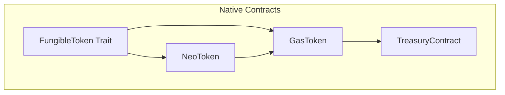
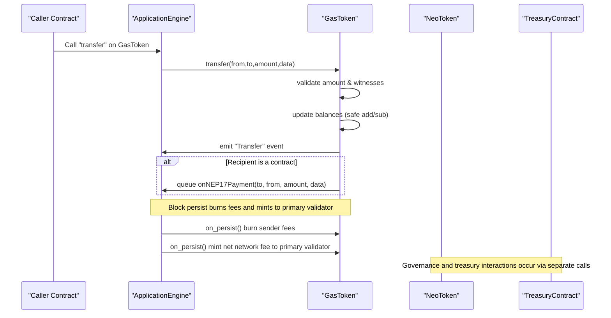
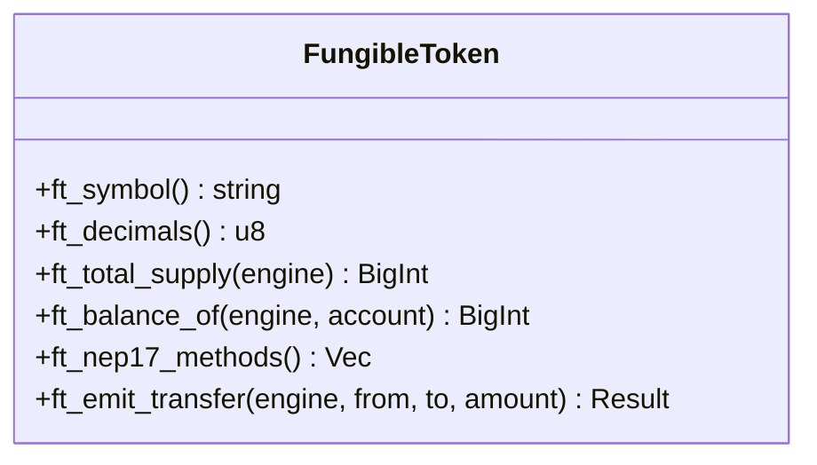
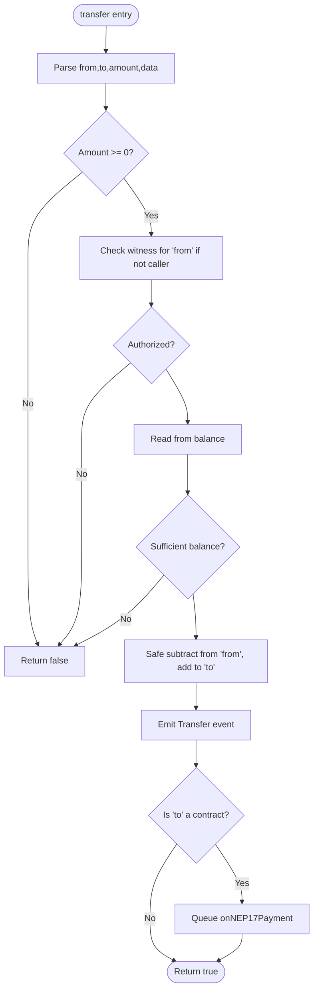
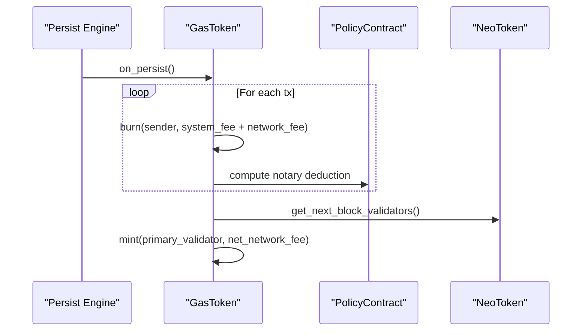
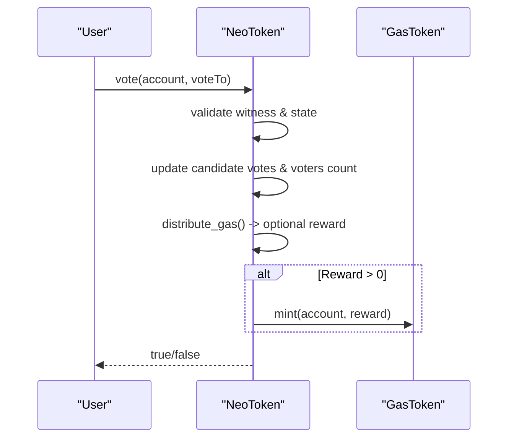
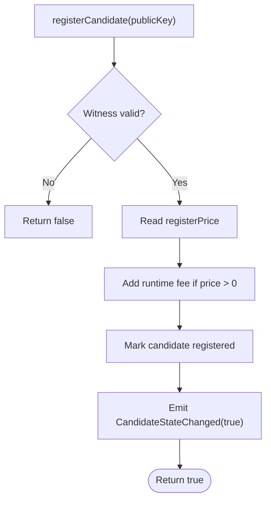
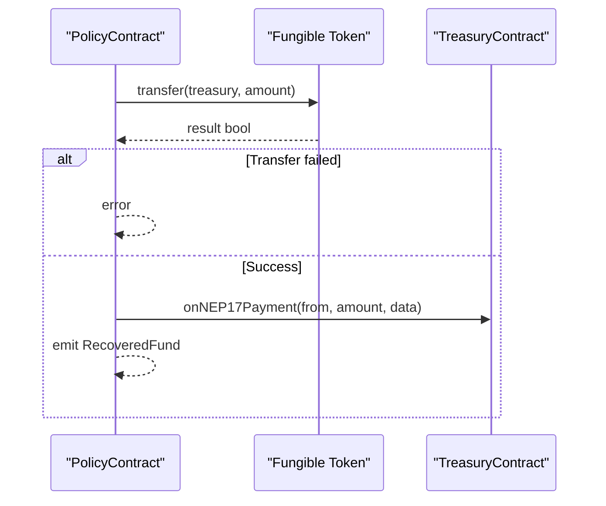
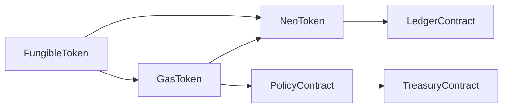

# Token Contracts

<cite>
**Referenced Files in This Document**
- [fungible_token.rs](file://neo-core/src/smart_contract/native/fungible_token.rs)
- [gas_token/mod.rs](file://neo-core/src/smart_contract/native/gas_token/mod.rs)
- [gas_token/native_impl.rs](file://neo-core/src/smart_contract/native/gas_token/native_impl.rs)
- [gas_token/metadata.rs](file://neo-core/src/smart_contract/native/gas_token/metadata.rs)
- [neo_token/mod.rs](file://neo-core/src/smart_contract/native/neo_token/mod.rs)
- [neo_token/nep17.rs](file://neo-core/src/smart_contract/native/neo_token/nep17.rs)
- [neo_token/methods.rs](file://neo-core/src/smart_contract/native/neo_token/methods.rs)
- [neo_token/governance.rs](file://neo-core/src/smart_contract/native/neo_token/governance.rs)
- [neo_token/bonus.rs](file://neo-core/src/smart_contract/native/neo_token/bonus.rs)
- [treasury.rs](file://neo-core/src/smart_contract/native/treasury.rs)
</cite>

## Table of Contents
1. Introduction
2. Project Structure
3. Core Components
4. Architecture Overview
5. Detailed Component Analysis
6. Dependency Analysis
7. Performance Considerations
8. Troubleshooting Guide
9. Conclusion

## Introduction
This document explains the token-related native contracts in the Neo N3 implementation: GasToken (GAS), NeoToken (NEO), and Treasury. It covers NEP-17 compliance, transfer flows, balance and total supply tracking, NeoToken staking/voting/registration mechanics, GAS fee burn and minting, and treasury fund management. It also documents method signatures, approvals via witness checks, event emissions, example workflows, security considerations, and gas optimization strategies.

## Project Structure
The token contracts are implemented as native contracts under the smart contract subsystem:
- FungibleToken trait defines shared NEP-17 behavior for both tokens.
- GasToken implements NEP-17 with mint/burn and block-level fee handling.
- NeoToken extends fungible behavior with governance (voting, candidates, committee).
- Treasury provides a system account with verification hooks and payment callbacks.

**Diagram sources**
- [fungible_token.rs:28-231](file://neo-core/src/smart_contract/native/fungible_token.rs#L28-L231)
- [gas_token/mod.rs:33-79](file://neo-core/src/smart_contract/native/gas_token/mod.rs#L33-L79)
- [neo_token/mod.rs:46-89](file://neo-core/src/smart_contract/native/neo_token/mod.rs#L46-L89)
- [treasury.rs:8-39](file://neo-core/src/smart_contract/native/treasury.rs#L8-L39)

**Section sources**
- [fungible_token.rs:28-231](file://neo-core/src/smart_contract/native/fungible_token.rs#L28-L231)
- [gas_token/mod.rs:33-79](file://neo-core/src/smart_contract/native/gas_token/mod.rs#L33-L79)
- [neo_token/mod.rs:46-89](file://neo-core/src/smart_contract/native/neo_token/mod.rs#L46-L89)
- [treasury.rs:8-39](file://neo-core/src/smart_contract/native/treasury.rs#L8-L39)

## Core Components
- FungibleToken: Shared NEP-17 interface and helpers for symbol, decimals, totalSupply, balanceOf, transfer, Transfer event emission, and storage key prefixes.
- GasToken: NEP-17 compliant GAS token with mint/burn, per-block fee burn and primary validator mint, and onNEP17Payment callback support.
- NeoToken: NEO governance token with voting, candidate registration/unregistration, committee queries, GAS reward distribution to voters and holders, and settable parameters (gasPerBlock, registerPrice).
- TreasuryContract: System contract exposing verify (committee witness check) and payment callbacks; used by policy mechanisms to recover funds into treasury.

Key responsibilities:
- Balance management: stored per account with safe arithmetic and snapshot reads.
- Total supply: tracked for GAS; NEO has fixed supply.
- Events: Transfer events emitted on all transfers; governance emits Vote and CandidateStateChanged.
- Approvals: Witness-based authorization for transfers and governance actions.

**Section sources**
- [fungible_token.rs:28-231](file://neo-core/src/smart_contract/native/fungible_token.rs#L28-L231)
- [gas_token/mod.rs:33-79](file://neo-core/src/smart_contract/native/gas_token/mod.rs#L33-L79)
- [neo_token/mod.rs:46-89](file://neo-core/src/smart_contract/native/neo_token/mod.rs#L46-L89)
- [treasury.rs:8-39](file://neo-core/src/smart_contract/native/treasury.rs#L8-L39)

## Architecture Overview
The token architecture centers around a common NEP-17 base and specialized native contracts. GasToken handles network fees and GAS issuance/burning. NeoToken adds governance and rewards. Treasury acts as a system vault and recovery target.

**Diagram sources**
- [gas_token/mod.rs:81-265](file://neo-core/src/smart_contract/native/gas_token/mod.rs#L81-L265)
- [gas_token/native_impl.rs:57-168](file://neo-core/src/smart_contract/native/gas_token/native_impl.rs#L57-L168)
- [fungible_token.rs:147-176](file://neo-core/src/smart_contract/native/fungible_token.rs#L147-L176)

**Section sources**
- [gas_token/mod.rs:81-265](file://neo-core/src/smart_contract/native/gas_token/mod.rs#L81-L265)
- [gas_token/native_impl.rs:57-168](file://neo-core/src/smart_contract/native/gas_token/native_impl.rs#L57-L168)
- [fungible_token.rs:147-176](file://neo-core/src/smart_contract/native/fungible_token.rs#L147-L176)

## Detailed Component Analysis

### FungibleToken Base (NEP-17)
- Methods exposed: symbol, decimals, totalSupply, balanceOf, transfer.
- Storage keys: PREFIX_TOTAL_SUPPLY and PREFIX_ACCOUNT define how balances and supply are stored.
- Encoding: little-endian signed integers for amounts; helper methods for encoding/decoding.
- Event: canonical Transfer event with from, to, amount using StackItem types.
- Method descriptors: generated with appropriate flags and fees.

**Diagram sources**
- [fungible_token.rs:28-231](file://neo-core/src/smart_contract/native/fungible_token.rs#L28-L231)

**Section sources**
- [fungible_token.rs:28-231](file://neo-core/src/smart_contract/native/fungible_token.rs#L28-L231)

### GasToken (GAS)
- Identity: ID -6, symbol "GAS", decimals 8.
- NEP-17: Implements standard read methods via FungibleToken; custom transfer with witness checks and onNEP17Payment callback.
- Mint/Burn: mint increases balance and total supply; burn decreases both with validation.
- Block lifecycle: initialize mints initial GAS to BFT address; on_persist burns each sender’s system+network fees and mints net network fee to primary validator.
- Storage: account state serialized as stack value; total supply stored as integer bytes.

**Diagram sources**
- [gas_token/mod.rs:81-265](file://neo-core/src/smart_contract/native/gas_token/mod.rs#L81-L265)

**Diagram sources**
- [gas_token/native_impl.rs:57-168](file://neo-core/src/smart_contract/native/gas_token/native_impl.rs#L57-L168)
- [gas_token/mod.rs:486-606](file://neo-core/src/smart_contract/native/gas_token/mod.rs#L486-L606)

**Section sources**
- [gas_token/mod.rs:33-79](file://neo-core/src/smart_contract/native/gas_token/mod.rs#L33-L79)
- [gas_token/mod.rs:81-265](file://neo-core/src/smart_contract/native/gas_token/mod.rs#L81-L265)
- [gas_token/mod.rs:486-606](file://neo-core/src/smart_contract/native/gas_token/mod.rs#L486-L606)
- [gas_token/native_impl.rs:57-168](file://neo-core/src/smart_contract/native/gas_token/native_impl.rs#L57-L168)
- [gas_token/metadata.rs:6-21](file://neo-core/src/smart_contract/native/gas_token/metadata.rs#L6-L21)

### NeoToken (NEO)
- Identity: ID -5, symbol "NEO", decimals 0, fixed total supply 100,000,000.
- NEP-17: Inherits fungible behavior; transfer integrates reward distribution and vote updates.
- Governance:
  - Candidates: registerCandidate, unregisterCandidate, getCandidates, getAllCandidates, getCandidateVote.
  - Voting: vote(account, voteTo) updates voter state, candidate votes, and voters count.
  - Committee: getCommittee, getCommitteeAddress, getNextBlockValidators.
  - Parameters: setGasPerBlock (committee only), setRegisterPrice (committee only), getGasPerBlock, getRegisterPrice.
- Rewards:
  - unclaimedGas(account, end): calculates NEO holder reward and voter reward up to next block.
  - distribute_gas: updates last gas per vote and balance height; returns unclaimed GAS to mint.
  - onNEP17Payment: enables GAS-based candidate registration by receiving exact register price and burning it from treasury-like context.

**Diagram sources**
- [neo_token/governance.rs:550-725](file://neo-core/src/smart_contract/native/neo_token/governance.rs#L550-L725)
- [neo_token/nep17.rs:252-324](file://neo-core/src/smart_contract/native/neo_token/nep17.rs#L252-L324)

**Diagram sources**
- [neo_token/governance.rs:419-503](file://neo-core/src/smart_contract/native/neo_token/governance.rs#L419-L503)

**Section sources**
- [neo_token/mod.rs:46-89](file://neo-core/src/smart_contract/native/neo_token/mod.rs#L46-L89)
- [neo_token/methods.rs:7-67](file://neo-core/src/smart_contract/native/neo_token/methods.rs#L7-L67)
- [neo_token/nep17.rs:46-217](file://neo-core/src/smart_contract/native/neo_token/nep17.rs#L46-L217)
- [neo_token/governance.rs:13-800](file://neo-core/src/smart_contract/native/neo_token/governance.rs#L13-L800)
- [neo_token/bonus.rs:7-163](file://neo-core/src/smart_contract/native/neo_token/bonus.rs#L7-L163)

### TreasuryContract
- Identity: ID -11, name "Treasury".
- Methods:
  - verify(): returns true if committee witness is valid.
  - onNEP17Payment/from/to/amount/data: no-op hook for payments received.
  - onNEP11Payment/from/amount/tokenId/data: no-op hook for NFT payments.
- Standards: supports NEP-26, NEP-27, NEP-30.
- Integration: Used by policy to recover funds by transferring tokens to treasury; success emits RecoveredFund.

**Diagram sources**
- [treasury.rs:8-99](file://neo-core/src/smart_contract/native/treasury.rs#L8-L99)

**Section sources**
- [treasury.rs:8-99](file://neo-core/src/smart_contract/native/treasury.rs#L8-L99)

## Dependency Analysis
- GasToken depends on:
  - FungibleToken for NEP-17 surface and Transfer event.
  - PolicyContract for notary fee deductions.
  - NeoToken for retrieving next validators during on_persist.
- NeoToken depends on:
  - FungibleToken for NEP-17 surface.
  - GasToken for minting rewards and handling GAS-based registration.
  - LedgerContract for current index and gas-per-block records.
- TreasuryContract is independent but invoked by policy flows.

**Diagram sources**
- [gas_token/native_impl.rs:57-168](file://neo-core/src/smart_contract/native/gas_token/native_impl.rs#L57-L168)
- [neo_token/governance.rs:727-800](file://neo-core/src/smart_contract/native/neo_token/governance.rs#L727-L800)
- [treasury.rs:8-99](file://neo-core/src/smart_contract/native/treasury.rs#L8-L99)

**Section sources**
- [gas_token/native_impl.rs:57-168](file://neo-core/src/smart_contract/native/gas_token/native_impl.rs#L57-L168)
- [neo_token/governance.rs:727-800](file://neo-core/src/smart_contract/native/neo_token/governance.rs#L727-L800)
- [treasury.rs:8-99](file://neo-core/src/smart_contract/native/treasury.rs#L8-L99)

## Performance Considerations
- Safe arithmetic: All balance and supply updates use safe addition/subtraction to prevent overflow/underflow.
- Snapshot reads: Balance and supply reads use snapshot caches to avoid redundant storage access.
- Minimal storage writes: Account states are deleted when zero to save space; total supply entries removed when zero.
- Efficient iteration: Candidate lists limited to 256 entries; iterators used for full scans where needed.
- Early exits: Insufficient balance or unauthorized transfers return quickly without state changes.
- Event batching: Transfer events emitted once per operation; callbacks queued rather than executed inline.

[No sources needed since this section provides general guidance]

## Troubleshooting Guide
Common issues and diagnostics:
- Transfer rejected due to insufficient balance or missing witness: Check caller vs from, ensure proper witness signature, and verify sufficient balance before calling transfer.
- GAS burn failures at persist: Logs include pre-balance, total supply, and BFT address details to diagnose insufficient sender balance.
- Registration failures: Ensure correct public key format, witness validity, and that registerPrice is positive and paid via onNEP17Payment when required.
- Reward calculation discrepancies: Verify account state (balance_height, vote_to, last_gas_per_vote) and gasPerBlock history; use unclaimedGas with end = current + 1.

**Section sources**
- [gas_token/mod.rs:117-191](file://neo-core/src/smart_contract/native/gas_token/mod.rs#L117-L191)
- [gas_token/native_impl.rs:61-138](file://neo-core/src/smart_contract/native/gas_token/native_impl.rs#L61-L138)
- [neo_token/governance.rs:419-503](file://neo-core/src/smart_contract/native/neo_token/governance.rs#L419-L503)
- [neo_token/bonus.rs:7-163](file://neo-core/src/smart_contract/native/neo_token/bonus.rs#L7-L163)

## Conclusion
GasToken, NeoToken, and Treasury form the core economic and governance layer of Neo N3. GasToken ensures fee burning and validator incentives while adhering to NEP-17. NeoToken provides staking, voting, and reward distribution with strict state consistency and witness-based authorization. Treasury offers a secure mechanism for recovering funds and interacting with token payments. Together, they deliver a robust, efficient, and secure token ecosystem aligned with protocol standards.

[No sources needed since this section summarizes without analyzing specific files]