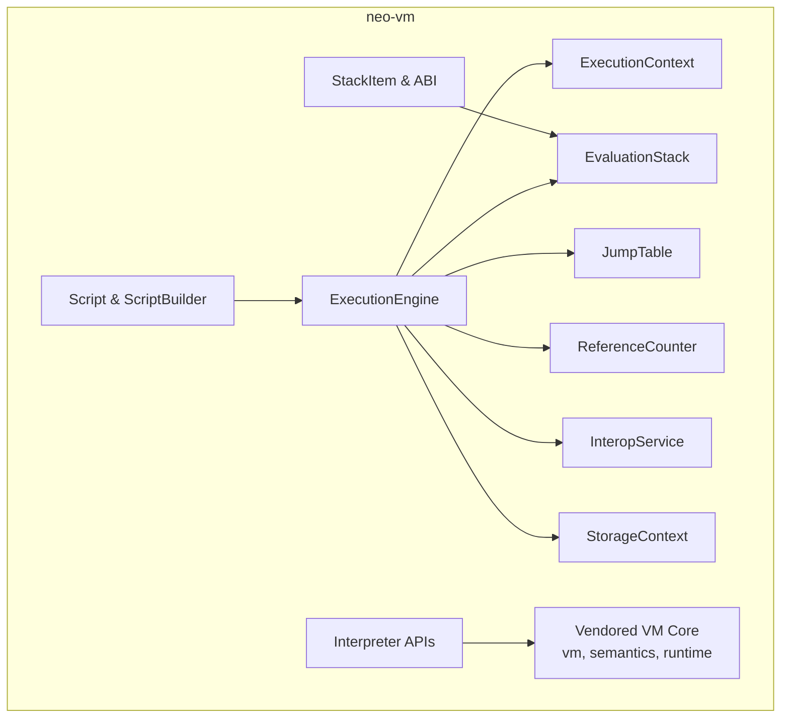
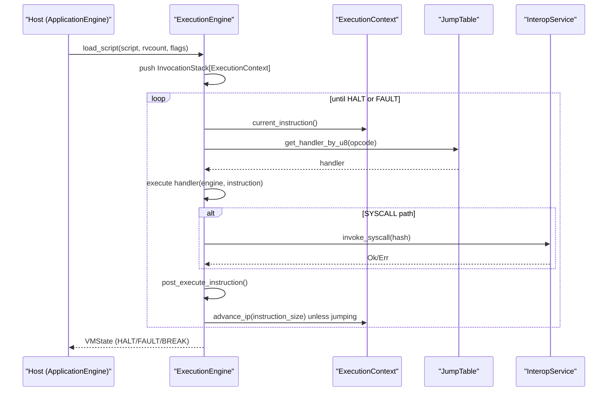
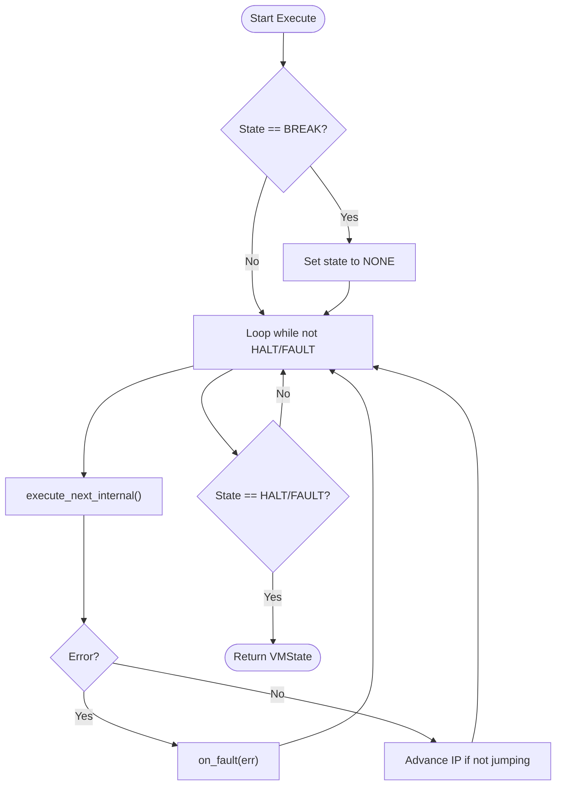
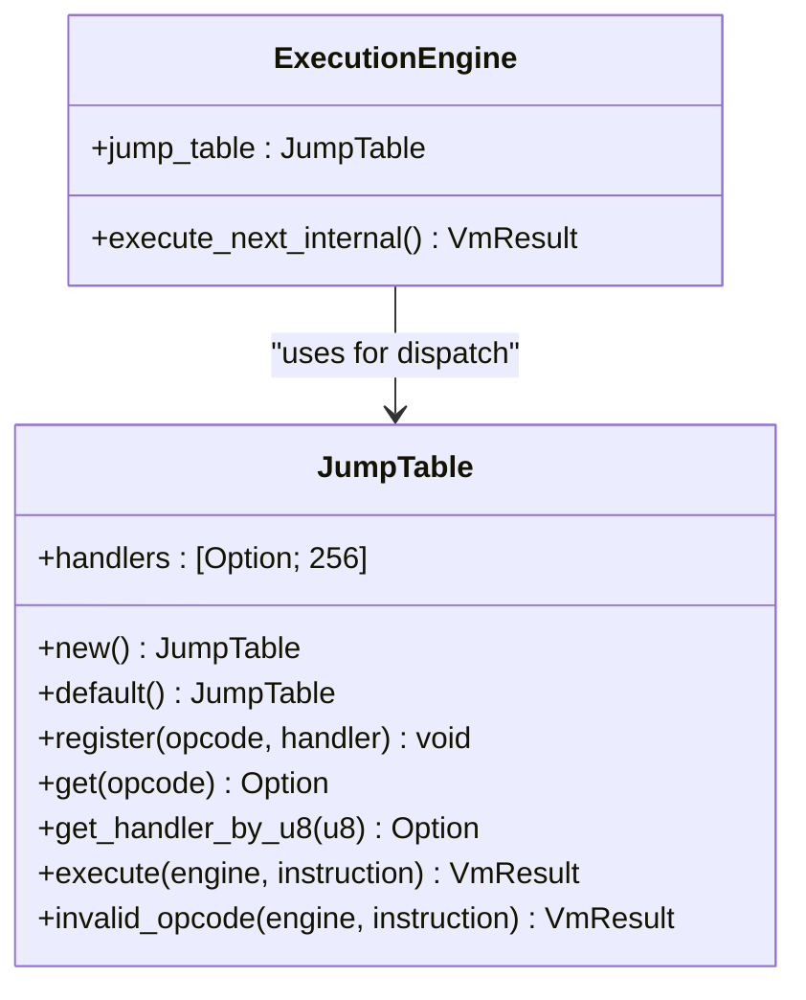
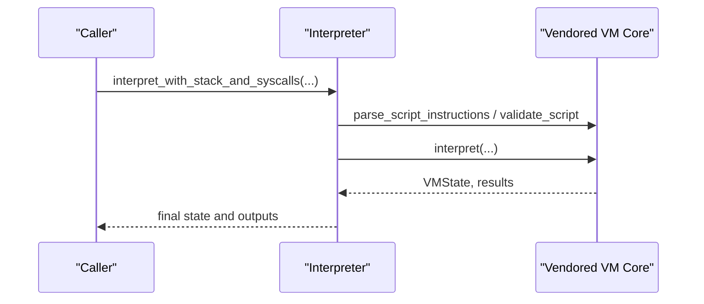
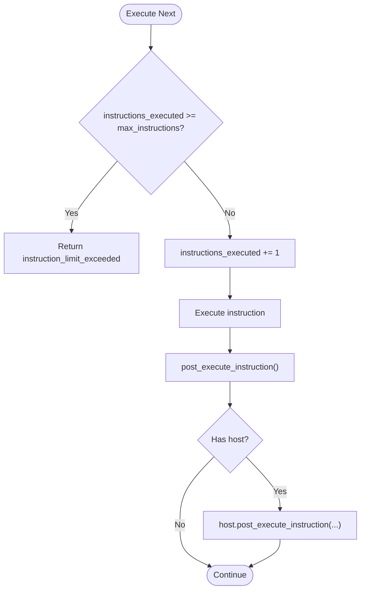
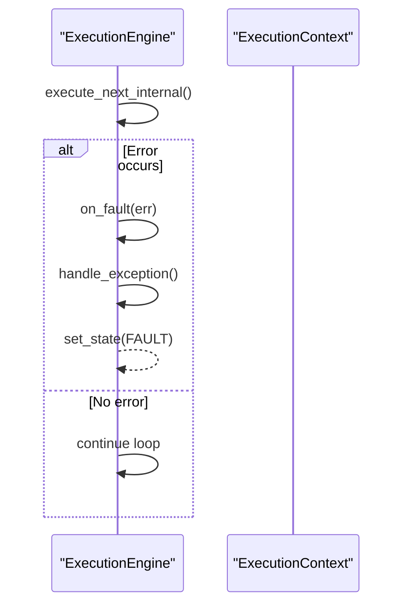
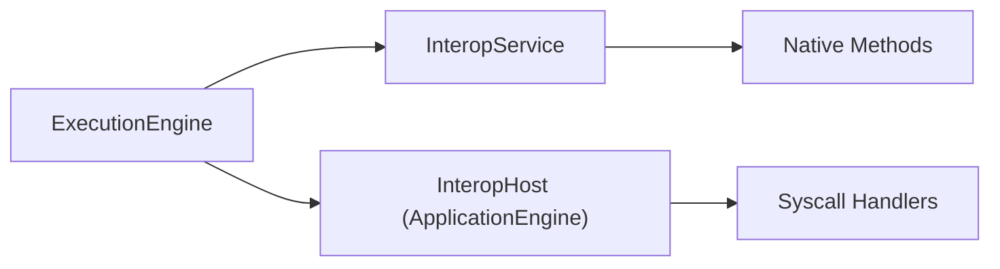
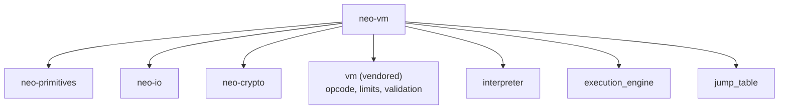

# Neo Virtual Machine Architecture

<cite>
**Referenced Files in This Document**
- [lib.rs](file://neo-vm/src/lib.rs)
- [mod.rs (execution_engine)](file://neo-vm/src/execution_engine/mod.rs)
- [core.rs (execution_engine)](file://neo-vm/src/execution_engine/core.rs)
- [execution.rs (execution_engine)](file://neo-vm/src/execution_engine/execution.rs)
- [mod.rs (jump_table)](file://neo-vm/src/jump_table/mod.rs)
- [mod.rs (interpreter)](file://neo-vm/src/interpreter/mod.rs)
- [mod.rs (vm)](file://neo-vm/src/vm/mod.rs)
</cite>

## Table of Contents
1. [Introduction](#introduction)
2. [Project Structure](#project-structure)
3. [Core Components](#core-components)
4. [Architecture Overview](#architecture-overview)
5. [Detailed Component Analysis](#detailed-component-analysis)
6. [Dependency Analysis](#dependency-analysis)
7. [Performance Considerations](#performance-considerations)
8. [Troubleshooting Guide](#troubleshooting-guide)
9. [Conclusion](#conclusion)

## Introduction
This document explains the Neo Virtual Machine (NeoVM) architecture as implemented in the neo-rs repository. It focuses on the stack-based execution model, opcode system, and bytecode interpretation mechanism. It also documents the execution engine components including context management, control flow handling, exception processing, gas metering, interpreter implementation with jump tables, instruction decoding, and state management. Finally, it outlines how the VM integrates with native contracts, interop services, and storage access patterns, along with examples for contract compilation to NEO VM bytecode, execution flow analysis, and performance profiling.

## Project Structure
The NeoVM crate is self-contained and organized into clear layers:
- Core VM modules: vm (opcode metadata, instruction parsing, limits), semantics (ABI-level value behavior), interpreter (high-level interpret APIs), runtime (runtime stacks and contexts).
- Stateful host surface: execution_engine (main loop, contexts, gas, exceptions), evaluation_stack, execution_context, reference_counter, storage_context, script/script_builder, interop_service, jump_table (stateful dispatch adapters), stack_item, error types.
- Public re-exports mirror the vendored VM core API so downstream code can use a stable surface.

**Diagram sources**
- [lib.rs:142-235](file://neo-vm/src/lib.rs#L142-L235)
- [mod.rs (execution_engine):8-30](file://neo-vm/src/execution_engine/mod.rs#L8-L30)

**Section sources**
- [lib.rs:1-135](file://neo-vm/src/lib.rs#L1-L135)
- [mod.rs (execution_engine):1-62](file://neo-vm/src/execution_engine/mod.rs#L1-L62)

## Core Components
- ExecutionEngine: Main VM that manages invocation stack, result stack, gas consumption, limits, and execution loop.
- ExecutionContext: Per-script call frame holding instruction pointer, evaluation stack, locals, and return value count.
- EvaluationStack: Type-safe operand stack with reference counting support.
- JumpTable: Fixed-size array mapping opcodes to handlers; provides fast dispatch and invalid-opcode handling.
- ReferenceCounter: Tracks compound item references for efficient memory management without GC pauses.
- InteropService: Registry for SYSCALL methods exposed by native contracts.
- StorageContext: Abstraction for smart contract storage operations.
- StackItem and ABI: Canonical VM value types and serialization helpers.

Key responsibilities:
- Instruction decoding and dispatch via JumpTable.
- Control flow and exception handling across nested contexts.
- Gas metering per instruction and overall limit enforcement.
- Integration points with host through InteropHost callbacks.

**Section sources**
- [mod.rs (execution_engine):195-242](file://neo-vm/src/execution_engine/mod.rs#L195-L242)
- [mod.rs (jump_table):34-44](file://neo-vm/src/jump_table/mod.rs#L34-L44)
- [lib.rs:146-218](file://neo-vm/src/lib.rs#L146-L218)

## Architecture Overview
NeoVM follows an adapter-oriented design: canonical opcode metadata and ABI semantics are vendored into the VM module, while the stateful host surface lives in neo-vm. The execution engine orchestrates the lifecycle of contexts, invokes the jump table for each instruction, and coordinates gas, exceptions, and interop calls.

**Diagram sources**
- [execution.rs:9-23](file://neo-vm/src/execution_engine/execution.rs#L9-L23)
- [execution.rs:132-197](file://neo-vm/src/execution_engine/execution.rs#L132-L197)
- [mod.rs (jump_table):133-152](file://neo-vm/src/jump_table/mod.rs#L133-L152)

## Detailed Component Analysis

### Execution Engine: Lifecycle, Contexts, and Control Flow
- Construction initializes default limits, reference counter, interop service, and empty invocation/result stacks.
- Execution loop runs until HALT or FAULT, stepping through instructions and handling implicit returns at script end.
- Context management supports nested calls; return values are routed to caller or result stack based on invocation depth.
- Exception handling sets uncaught exception and transitions to FAULT when needed.

**Diagram sources**
- [execution.rs:9-23](file://neo-vm/src/execution_engine/execution.rs#L9-L23)
- [execution.rs:132-197](file://neo-vm/src/execution_engine/execution.rs#L132-L197)

**Section sources**
- [core.rs:11-45](file://neo-vm/src/execution_engine/core.rs#L11-L45)
- [execution.rs:9-23](file://neo-vm/src/execution_engine/execution.rs#L9-L23)
- [execution.rs:25-100](file://neo-vm/src/execution_engine/execution.rs#L25-L100)
- [core.rs:67-93](file://neo-vm/src/execution_engine/core.rs#L67-L93)

### Opcode System and Jump Table Dispatch
- Opcodes are defined in the vendored vm module and parsed into Instructions.
- JumpTable uses a fixed-size array of 256 entries for direct, zero-overhead dispatch in release builds.
- Default handlers are registered by category (bitwise, numeric, control, push, slot, splice, stack, types).
- Invalid opcodes produce a structured unsupported operation error.

**Diagram sources**
- [mod.rs (jump_table):34-44](file://neo-vm/src/jump_table/mod.rs#L34-L44)
- [mod.rs (jump_table):133-152](file://neo-vm/src/jump_table/mod.rs#L133-L152)
- [execution.rs:163-171](file://neo-vm/src/execution_engine/execution.rs#L163-L171)

**Section sources**
- [mod.rs (jump_table):154-182](file://neo-vm/src/jump_table/mod.rs#L154-L182)
- [mod.rs (vm):1-26](file://neo-vm/src/vm/mod.rs#L1-L26)

### Interpreter Implementation: Decoding and State Management
- The interpreter exposes high-level APIs to run scripts with optional syscalls and initializers.
- It maintains last-interpreter state such as instruction pointer, result limit, and stack length for introspection.
- Decoding and validation are provided by the vm module’s script validation utilities.

**Diagram sources**
- [mod.rs (interpreter):8-15](file://neo-vm/src/interpreter/mod.rs#L8-L15)
- [mod.rs (vm):13-25](file://neo-vm/src/vm/mod.rs#L13-L25)

**Section sources**
- [mod.rs (interpreter):1-16](file://neo-vm/src/interpreter/mod.rs#L1-L16)
- [mod.rs (vm):13-25](file://neo-vm/src/vm/mod.rs#L13-L25)

### Gas Metering and Resource Limits
- The engine tracks instructions_executed and gas_consumed, enforcing max_instructions and gas_limit via ExecutionEngineLimits.
- Pre-execution checks prevent exceeding instruction limits; post-execution hooks integrate with host for additional metering.
- Default gas limit is set to a reasonable value to prevent infinite loops and resource exhaustion.

**Diagram sources**
- [execution.rs:132-143](file://neo-vm/src/execution_engine/execution.rs#L132-L143)
- [execution.rs:199-245](file://neo-vm/src/execution_engine/execution.rs#L199-L245)
- [mod.rs (execution_engine):188-191](file://neo-vm/src/execution_engine/mod.rs#L188-L191)

**Section sources**
- [execution.rs:132-143](file://neo-vm/src/execution_engine/execution.rs#L132-L143)
- [execution.rs:199-245](file://neo-vm/src/execution_engine/execution.rs#L199-L245)
- [mod.rs (execution_engine):188-191](file://neo-vm/src/execution_engine/mod.rs#L188-L191)

### Exception Processing and Try/Catch Semantics
- Exceptions raised during execution are captured; if unhandled, the engine sets an uncaught exception and transitions to FAULT.
- Catchable exceptions can be converted to try-catch flows when configured via limits.catch_engine_exceptions.
- Fault diagnostics include instruction pointer, current opcode, and evaluation stack depth for debugging.

**Diagram sources**
- [core.rs:67-93](file://neo-vm/src/execution_engine/core.rs#L67-L93)
- [core.rs:182-192](file://neo-vm/src/execution_engine/core.rs#L182-L192)
- [execution.rs:173-185](file://neo-vm/src/execution_engine/execution.rs#L173-L185)

**Section sources**
- [core.rs:67-93](file://neo-vm/src/execution_engine/core.rs#L67-L93)
- [core.rs:182-192](file://neo-vm/src/execution_engine/core.rs#L182-L192)
- [execution.rs:173-185](file://neo-vm/src/execution_engine/execution.rs#L173-L185)

### Interop Services and Native Contracts
- InteropService registers native contract methods accessible via SYSCALL.
- The engine delegates syscall invocation to the host through InteropHost callbacks, enabling integration with ApplicationEngine and other host-specific logic.
- Call flags govern permissions and capabilities for the current execution context.

**Diagram sources**
- [mod.rs (execution_engine):212-223](file://neo-vm/src/execution_engine/mod.rs#L212-L223)
- [lib.rs:185-188](file://neo-vm/src/lib.rs#L185-L188)

**Section sources**
- [mod.rs (execution_engine):212-223](file://neo-vm/src/execution_engine/mod.rs#L212-L223)
- [lib.rs:185-188](file://neo-vm/src/lib.rs#L185-L188)

### Storage Access Patterns
- StorageContext abstracts storage operations used by smart contracts.
- Storage reads/writes are typically invoked via interop/syscalls from within contract execution, integrating with the VM’s gas metering and limits.

**Section sources**
- [lib.rs:208-212](file://neo-vm/src/lib.rs#L208-L212)

## Dependency Analysis
NeoVM depends on foundational primitives and I/O abstractions, and exposes a stable public surface for neo-core integration.

**Diagram sources**
- [Cargo.toml:16-28](file://neo-vm/Cargo.toml#L16-L28)
- [lib.rs:220-235](file://neo-vm/src/lib.rs#L220-L235)

**Section sources**
- [Cargo.toml:1-32](file://neo-vm/Cargo.toml#L1-L32)
- [lib.rs:220-235](file://neo-vm/src/lib.rs#L220-L235)

## Performance Considerations
- Jump table dispatch uses a fixed-size array with unsafe indexing for minimal overhead in release builds.
- Instruction size caching avoids redundant fetches in the hot path.
- Two-phase stack overflow detection balances safety and performance, performing thorough checks only near limits.
- Reference counting minimizes GC pauses and efficiently manages compound stack items.
- Gas metering enforces strict resource limits to prevent abuse and ensure deterministic execution costs.

[No sources needed since this section provides general guidance]

## Troubleshooting Guide
Common issues and diagnostics:
- Unsupported opcode: Indicates missing or invalid handler; check opcode definitions and jump table registration.
- Instruction limit exceeded: Increase limits or optimize contract logic to reduce instruction count.
- Stack underflow/overflow: Review script logic and ensure proper stack usage; inspect evaluation stack depth in fault messages.
- Uncaught exceptions: Inspect uncaught exception message and context (IP, opcode, eval depth) to locate failures.

**Section sources**
- [mod.rs (jump_table):142-152](file://neo-vm/src/jump_table/mod.rs#L142-L152)
- [execution.rs:135-143](file://neo-vm/src/execution_engine/execution.rs#L135-L143)
- [core.rs:67-93](file://neo-vm/src/execution_engine/core.rs#L67-L93)

## Conclusion
NeoVM in neo-rs implements a robust, stack-based virtual machine with precise gas metering, efficient opcode dispatch, and comprehensive exception handling. Its layered design separates canonical semantics from stateful host concerns, enabling clean integration with native contracts and interop services. By understanding the execution engine, jump table, interpreter APIs, and resource limits, developers can compile contracts to NEO VM bytecode, analyze execution flows, and profile performance effectively.

[No sources needed since this section summarizes without analyzing specific files]